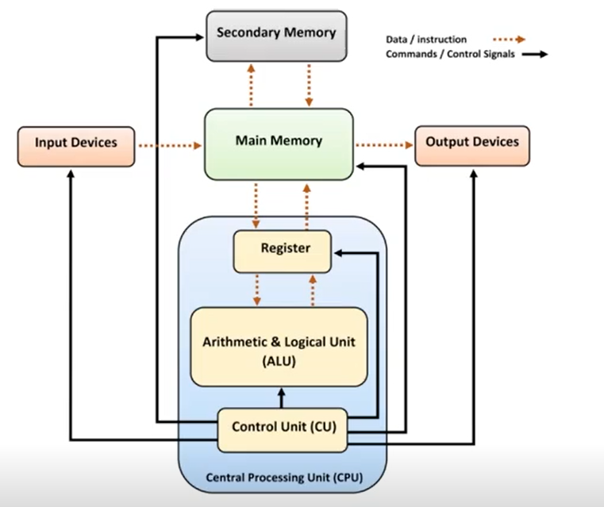
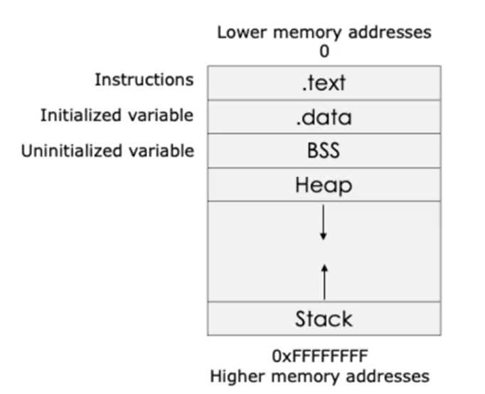
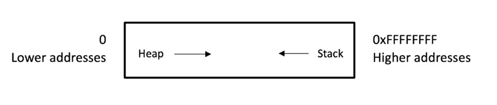

# System Security and x86 Assembly Fundamentals

## Course Introduction

### Course Topic Overview

- Architecture Fundamentals
	- CPU Architecture and Components
	- CPU Registers
	- Process Memory
	- The Stack
- x86 Assembly Fundamentals
    - Assemblers and Compilers
    - Introduction to x86 Assembly
    - Basic x86 Assembly Programming

### Prerequisites

- Basic understanding of computer architecture concepts.
- Familiarity with low-level programming languages such as C or C++.
- Proficiency in using a Linux-based operating system, including basic command-line navigation and file manipulation.
- Some knowledge of assembly language programming concepts would be beneficial but not required.

### Learning Objectives

1. Understanding Computer Architecture Fundamentals:
    - Explain the basic principles of computer architecture, including CPU architecture and process memory.
    - Understand the role of the CPU, CPU registers, and memory in the operation of a computer system.

2. IA-32 CPU Architecture:
    - Describe the architecture of IA-32 processors, including registers, instruction set, and execution pipeline.
    - Understand the function and purpose of general-purpose registers, and other CPU components.

3. Memory Organization and Process Memory:
    - Explore the different memory regions, including code, data, heap, and stack, and their roles in program execution.

4. Understanding the Stack and Stack Frames:
    - Explain the stack data structure and its role in function calls and local variable storage.
    - Understand the concept of stack frames and their organization in memory during function execution.

5. Introduction to IA-32 Assembly Language:
    - Define assembly language and its role in low-level programming.
    - Differentiate between high-level languages and assembly language.

6. IA-32 Assembly Language Basics:
    - Learn how to use assembly language instructions for basic arithmetic and logical operations.
    - Understand data movement instructions and memory addressing modes in IA-32 assembly.

---
---

## Introduction to System Security

### Introduction to System Security - Theory

System Security is a comprehensive course designed to equip penetration testers and red teamers with the foundational knowledge of computer architecture, assembly language, and security mechanisms.

The purpose of this course is to give you the fundamental knowledge needed to help you improve your skills in topics such as fuzzing, exploit development, buffer overflows, debugging, reverse engineering and malware analysis (these topics will be explored in-detail in the Exploit Development Course).

This course will provide you with an understanding of CPU architecture, memory management, and the intricacies of x86 and x64 instruction sets.

You will also learn the basics of 32-bit assembly language for the Intel Architecture (IA-32) family of processors on Linux and learn how to apply it to Infosec.

Once we are done with the basics, we will use what we have learned in the Exploit Development course where we will be exploring Buffer Overflows, fuzzing, shellcoding, etc.

Assembly language is the gateway to understanding exploitation techniques, reverse engineering, shellcoding and other low level fields in information security.

Without a good grasp of system architecture and assembly knowledge it will not be possible to master these fields effectively. ​

---

## Architecture Fundamentals

### CPU Architecture - Theory

#### CPU Architecture

A CPU (Central Processing Unit) is often referred to as the brain of a computer, responsible for executing instructions and performing calculations.

The Central Processing Unit (CPU) is the device in charge of executing the machine code of a program.

The machine code, or machine language, is the set of instructions that the CPU processes.

Each instruction is a primitive command that performs a specific operation such as moving data between registers, working with memory, changing the execution flow of a program, and performing arithmetic and more.

As a rule, each CPU has its own instruction set architecture (ISA).

CPU instructions are represented in hexadecimal (HEX) format. Due to the inherent unreadable nature and complexity, it is impossible for humans to read or utilize it in its natural format.

As a result, machine code is translated into Assembly Language (ASM). Assembly language (ASM) is mnemonic code (a more readable language) that humans can understand and interpret.

Assembly language is a low-level programming language that is closely related to the machine code instructions of a specific CPU architecture.

It provides a symbolic representation of the machine instructions and allows programmers to write instructions using mnemonics and symbolic labels rather than binary code.

Assembly language is closely tied to the architecture of the target CPU.

Different CPU architectures have their own instruction sets and assembly languages.

For example, x86 assembly language is used for Intel and AMD processors, while ARM assembly language is used for ARM-based processors.



#### CPU Components

##### Control Unit (CU)

The Control Unit is responsible for coordinating and controlling the operations of the CPU.
It fetches instructions from memory, decodes them, and manages the execution of instructions by directing data movement and control flow within the CPU.

##### Arithmetic Logic Unit (ALU)

The Arithmetic Logic Unit is the component responsible for performing arithmetic and logical operations.
It can perform basic operations like addition, subtraction, multiplication, division, as well as logical operations like AND, OR, and NOT.

##### Registers

Registers are small, high-speed storage locations within the CPU used to store data temporarily during processing. Some common types of registers include:
    - Program Counter (PC): Holds the memory address of the next instruction to be fetched.
    - Instruction Register (IR): Holds the currently executing instruction.
    - Accumulator: Stores the result of arithmetic and logic operations.
    - General-Purpose Registers: Used to store intermediate values and operands during instruction execution.

#### CPU Instruction Set Architecture (ISA)

Each CPU has its own instruction set architecture (ISA). The ISA is the set of instructions that a programmer (or a compiler) must understand and use to write a program correctly for that specific CPU and machine.
In other words, ISA is what a programmer can see: memory, registers, instructions, etc. It provides all the necessary information for who wants to write a program in that machine language.

The most common ISA is the x86 instruction set (or architecture) which originated from the Intel 8086 processor.
The x86 acronym identifies 32-bit processors, while x64 (aka x86_64 or AMD64) identifies the 64-bit versions. ​

### CPU Registers - Theory

#### Registers

CPU registers are small, high-speed storage locations located within the CPU (Central Processing Unit).

They are used to temporarily hold data that is being processed or manipulated by the CPU.

Registers play a crucial role in the execution of instructions and the management of data within the computer system.

The architecture of the CPU (32-bit and 64-bit) refers to the width/size of the CPU registers.

Each CPU has its fixed set of registers that are accessed when required.

You can think of registers as temporary variables used by the CPU to retrieve and store data.

For the purpose of this course, we will focus on a specific group of registers: General Purpose Registers (GPRs).

#### General Purpose Registers

General-purpose registers are used to store data temporarily during program execution.

They are versatile and can hold various types of data, such as integers, memory addresses, or intermediate results of arithmetic/logical operations. Examples of general-purpose registers include:
- EAX, EBX, ECX, EDX: Used for general data manipulation and arithmetic operations.
- ESI, EDI: Often used for string manipulation operations.
- ESP, EBP: Used for managing the stack (ESP for stack pointer, EBP for base pointer).
- In 64-bit architectures (x64), the general-purpose registers are extended to 64 bits (RAX, RBX, RCX, RDX, etc.), providing increased addressable memory space and support for larger data types.

| X86 NAME | NAME          | PURPOSE                                                      |
|----------|---------------|--------------------------------------------------------------|
| EAX      | Accumulator   | Used in arithmetic operations                                |
| ECX      | Counter       | Used in shift/rotate instruction and loops                   |
| EDX      | Data          | Used in arithmetic operation and I/O                         |
| EBX      | Base          | Used as a pointer to data                                    |
| ESP      | Stack Pointer | Pointer to the top of the stack                              |
| EBP      | Base Pointer  | Pointer to the base of the stack (aka Stack Base Pointer, or Frame pointer) |
| ESI      | Source Index  | Used as a pointer to a source in stream operation            |
| EDI      | Destination   | Used as a pointer to a destination in stream operation       |

Pay close attention to the x86 naming convention as it refers to the register names for the x86 (32-bit) architecture.

We will see how the names differ for 64-bit, 32-bit, 16-bit and 8-bit.

##### EAX (Accumulator Register)

The **EAX** register is the primary accumulator register used for arithmetic and logic operations. It is often used to store operands and receive results of computations. In certain contexts, it holds function return values and is used as a scratch register for intermediate calculations.

##### EBX (Base Register)

The **EBX** register, also known as the base register, is typically used as a pointer to data in memory or as a base address for memory operations. It can also serve as a general-purpose register for storing data temporarily during computations.

##### ECX (Counter Register)

The **ECX** register, known as the counter register, is commonly used for loop control and iteration counting. It is often used in conjunction with the LOOP instruction to implement loops and repetitive tasks.

##### EDX (Data Register)

The **EDX** register, or data register, is used in conjunction with EAX for certain arithmetic operations that require a wider range of data storage (e.g., 64-bit multiplication and division). It can also serve as a general-purpose register for storing data.

##### ESI (Source Index Register)

The **ESI** register, known as the source index register, is commonly used in string manipulation operations. It typically holds the starting address of the source data or the source string during operations like copying, comparing, or searching strings.

##### EDI (Destination Index Register)

The **EDI** register, or destination index register, complements the ESI register in string manipulation operations. It usually holds the starting address of the destination data or the destination string during string operations like copying or concatenation.

##### ESP (Stack Pointer Register)

The **ESP** register, or stack pointer register, points to the top of the stack in memory. It is used to manage the stack, a special area of memory used for storing function parameters, local variables, return addresses, and other data during program execution.

##### EBP (Base Pointer Register)

The **EBP** register, known as the base pointer register, is commonly used in conjunction with the ESP register to access parameters and local variables within function calls. It serves as a reference point for accessing data stored on the stack.

##### Instruction Pointer (EIP)

In addition to the eight general purposes registers, there is also another register that will be important for what we will be doing in this course, the EIP (x86 naming convention).
The **Instruction Pointer (EIP)** controls the program execution by storing a pointer to the address of the next instruction (machine code) that will be executed.

> **Note:** It tells the CPU where the next instruction is.

#### Architecture Specific Register Names

Although this information may seem overwhelming, everything will become make sense once we explore the Stack.
The naming convention of the old 8-bit CPU had 16-bit registers divided into two parts:
    - A low byte, identified by an L at the end of the name, and
    - A high byte, identified by an H at the end of the name.
The 16-bit naming convention combines the L and the H, and replaces it with an X. While for the Stack Pointer, Base Pointer, Source and Destination registers it simply removes the L.
In the 32-bit representation, the register acronym/name is prefixed with an E, meaning extended. Whereas, in the 64-bit representation, the E is replaced with the R.
Although we will mainly be using the 32-bit naming convention throughout the duration of this course, it is useful to understand the 64-bit name convention as well.

### Process Memory - Theory

#### Process Memory

Process memory management is a fundamental aspect of operating systems, responsible for organizing and managing memory resources for running programs (processes).

Modern operating systems implement a concept known as virtual memory, which abstracts physical memory resources and presents each process with a virtual address space.

Each process perceives its memory as a contiguous block of memory addresses, starting from address 0 and extending up to the maximum addressable space.

#### Memory Segmentation

Process memory is typically divided into segments, each serving a specific purpose:
- **Code Segment:** Contains the executable code of the program.
- **Data Segment:** Stores initialized data, such as global variables and static variables.
- **BSS Segment:** Contains uninitialized data, initialized to zero during program execution.
- **Heap Segment:** Dynamically allocated memory for program data structures (e.g., heap memory allocated using functions like malloc() and free()).
- **Stack Segment:** Stores function call frames, local variables, and function parameters. The stack grows and shrinks dynamically as functions are called and return.

When a process runs, it is typically organized in memory as shown in the figure below.



The Text region, or instruction segment, is fixed by the program and contains the program code (instructions). This region is marked as read-only since the program should not change during execution.

The Data region is divided into initialized data and uninitialized data. Initialized data includes items such as static and global declared variables that are predefined and can be modified.

The uninitialized data, named Block Started by Symbol (BSS), also initializes variables that are initialized to zero or do not have explicit initialization (ex. static int t).

Next is the Heap, which starts right after the BSS segment. During the execution, the program can request more space in memory via brk and sbrk system calls, used by malloc, realloc, and free.

Hence, the size of the data region can be extended; this is not vital, but if you are very interested in a more detailed process, these may be topics to do your own research on.

The last region of the memory is the Stack. For our purposes, this is the most important structure we will deal with.

### Understanding the Stack  - Theory

#### The Stack

The stack is a fundamental data structure in computer science and plays a crucial role in the execution of programs.

In the context of process memory management, <u>the stack is a region of memory</u> allocated for storing function call frames, local variables, function parameters, and return addresses during program execution.

#### LIFO (Last-In-First-Out)

<u>The stack follows the Last-In-First-Out (LIFO) principle</u>, meaning that <u>the last item pushed onto the stack is the first one to be popped off</u>.

This makes the stack an ideal data structure for managing function calls and storing temporary data that needs to be accessed in reverse order of its insertion.

You can think of the stack as an array used for saving a function's return addresses, passing function arguments, and storing local variables.

The purpose of the ESP register (Stack Pointer) is to identify the top of the stack, and it is modified each time a value is pushed in (PUSH) or popped out (POP).

#### The Stack Pointer

The stack is managed by a special CPU register called the stack pointer (ESP in x86 architectures, RSP in x64 architectures).

The stack pointer points to the top of the stack, indicating the location in memory where the next item will be pushed or popped.

As items are pushed onto the stack (e.g., during function calls), the stack pointer is decremented to allocate more space. Conversely, when items are popped off the stack (e.g., when functions return), the stack pointer is incremented to reclaim memory.

##### ESP (Stack Pointer Register)

The ESP register, or stack pointer register, points to the top of the stack in memory.
It is used to manage the stack, a special area of memory used for storing function parameters, local variables, return addresses, and other data during program execution.

#### The Stack

Before exploring how the stack works and how to operate on it, it is important to understand how the stack grows.

Common sense would make you think that the stack grows upwards, towards higher memory addresses, but as you saw in the previous memory structure diagram, the stack grows downward, towards the lower memory addresses.

This is probably due to historical reasons when the memory in old computers was limited and divided into two parts: Heap and Stack.

Knowing the limits of the memory allowed the programmer to know how big the heap and/or the stack would be.

It was decided that the Heap would start from lower addresses and grow upwards and the Stack would start from the end of the memory and grow downward.



As previously mentioned, the stack is a LIFO structure, and the most fundamental operations are the PUSH and POP.

The main pointer for these operations is the ESP, which contains the memory address for the top of the stack and changes during each PUSH and POP operation.

"Push" and "pop" are two fundamental operations performed on a stack data structure. Here's an explanation of each:

##### PUSH

"Push" is an operation that adds an element to the top of the stack. When you push an item onto the stack, it becomes the new top element, and the stack grows in size.
The push operation involves two main steps:
- Increment the stack pointer: The stack pointer is moved upwards to allocate space for the new element.
- Store the element: The new element is stored at the memory location indicated by the stack pointer.

In programming terms, pushing an element onto the stack typically involves copying the value of the element into the memory location pointed to by the stack pointer and then updating the stack pointer to point to the next available memory location.

##### POP

"Pop" is an operation that removes the top element from the stack. When you pop an item from the stack, it is removed from the top, and the stack shrinks in size.

The pop operation also involves two main steps:
- Access the top element: The element at the top of the stack is retrieved.
- Decrement the stack pointer: The stack pointer is moved downwards to deallocate the space previously occupied by the top element.

In programming terms, popping an element from the stack typically involves reading the value stored at the memory location pointed to by the stack pointer, then decrementing the stack pointer to point to the next element on the stack.

##### PUSH Example 1

**PUSH Instruction**:
PUSH E

**Starting value**:
The ESP points to the top of the stack.

**Process**:
A PUSH is executed, and the ESP register is modified.
1. A PUSH instruction subtracts 4 (in 32-bit) or 8 (in 64-bit) from the ESP and writes the data to the memory address in the ESP, and then updates the ESP to the top of the stack.
2. Remember that the Stack grows backward. Therefore the PUSH subtracts 4 or 8, in order to point to a lower memory location on the stack. If we do not subtract it, the PUSH operation will overwrite the current location pointed by ESP (the top) and we would lose data.

**Ending value**:
The ESP points to the top of the stack -4.


##### PUSH Example 2

Now for a more detailed example of the PUSH instruction.

**Starting value** (ESP contains the address value):
ESP points to the following memory address: 0x0028FF80.

**Process**:
1. The program executes the instruction PUSH 1.
2. ESP decreases by 4, becoming 0x0028FF7C, and the value 1 will be pushed on the stack.

**Ending value**:
ESP points to the following memory address: 0x0028FF7C.


##### POP Example 1

**Starting value** (ESP contains the address value):
After the PUSH 1, the ESP points to the following memory address: 0x0028FF7C.

**Process**:
1. The program executes the inverse instruction, POP EAX. The value (00000001) contained at the address of the ESP (0x0028FF7C = the top of the Stack), will be popped out from the stack and will be copied in the EAX register.
2. Then, ESP is updated by adding 4 and becoming 0x0028FF80.

**Ending value**:
ESP points to the following memory address: 0x0028FF80. It returns to its original value.


### Stack Frames - Theory

#### Stack Frames

A stack frame, also known as an activation record or call frame, is a data structure used by the CPU and the operating system to manage function calls and execution flow within a program.

It contains information related to a single function call, including parameters, local variables, return address, and other relevant data.

#### Procedures and Functions

Now that we know more about the Stack, we will investigate how procedures and functions work. It is important to know that procedures and functions alter the normal flow of the process.

When a procedure or a function terminates, it returns control to the statement or instruction that called the function.

Functions contain two important components, the prologue and the epilogue, which we will discuss later, but here is a very quick overview.

The prologue prepares the stack to be used, similar to putting a bookmark in a book. When the function has completed, the epilogue resets the stack to the prologue settings.

The Stack consists of logical stack frames (portions/areas of the Stack), that are PUSHed when calling a function and POPped when returning a value.

When a subroutine, such as a function or procedure, is started, a stack frame is created and assigned to the current ESP location (top of the stack); this allows the subroutine to operate independently in its own location in the stack.

When the subroutine ends, two things happen:
- The program receives the parameters passed from the subroutine.
- The Instruction Pointer (EIP) is reset to the location at the time of the initial call.

In other words, the stack frame keeps track of the location where each subroutine should return the control when it terminates.

We will break down this process in a more specific example for you to better understand how stack frames work.

First, we will explain the operations, and then we will illustrate how it happens in an actual program. When this program is run, the following process occurs.

#### Stack Frames - Example

This process has three main operations:

1. When a function is called, the arguments (in brackets) need to be evaluated.
2. The control flow jumps to the body of the function, and the program executes its code.
3. Once the function ends, a return statement is encountered, the program returns to the function call (the next statement in the code).

The following code snippet explains how this works in the Stack. This example is written in C:

```c
int b(){ // function b
  return 0;
}

int a(){ // function a
  b();
  return 0;
}

int main (){ // main function
  a();
  return 0;
}
```

##### Step 1

The entry point of the program is main().
The first stack frame that needs to be pushed to the Stack is the main() stack frame.
Once initialized, the stack pointer is set to the top of the stack and a new main() stack frame is created.

Our stack will then look like the following:


##### Step 2

Once inside main(), the first instruction that executes is a call to the function named a().
Once again, the stack pointer is set to the top of the stack of main() and a new stack frame for a() is created on the stack.


##### Step 3

Once the function a() starts, the first instruction is a call to the function named b().
Here again, the stack pointer is set, and a new stack frame for b() will be pushed on the top of the stack.


##### Step 4

The function b() does nothing and just returns.
When the function completes, the stack pointer is moved to its previous location, and the program returns to the stack frame of a() and continues with the next instruction.


##### Step 5

The next instruction executed is the return statement contained in a().
The a() stack frame is popped, the stack pointer is reset, and we will get back in the main() stack frame.


This was a quick overview of how stack frames work, but for buffer overflows, we need to go into more detail as to what information is stored, where it is stored and how the registers are updated.

---

## x86 Assembly Fundamentals

### Assemblers and Compilers - Theory

#### Assemblers

In the context of assembly language programming, an assembler is a type of language translator that converts assembly language code into machine code, which is directly executable by the computer's CPU.

<u>Assembly language is a low-level programming language that uses mnemonic instructions to represent machine instructions</u>, making it easier for humans to read and write compared to raw binary machine code.

There are several types of assemblers that depend on the target system's ISA (Instruction Set Architecture):
- Microsoft Macro Assembler (MASM), x86 assembler that uses the Intel syntax for MS-DOS and Microsoft Windows.
- GNU Assembler (GAS), used by the GNU Project, default back-end of GCC.
- <u>Netwide Assembler (NASM), x86 architecture used to write 16-bit, 32-bit (IA-32) and 64-bit (x86-64) programs, one of the most popular assemblers for Linux</u>.
- Flat Assembler (FASM), x86, supports Intel-style assembly language on the IA-32 and x86-64.

#### How Assemblers Work

<u>When source code is assembled, the resulting file is called an object file</u>. It is a binary representation of the program.

While the assembly instructions and the machine code have a one-to-one correspondence, and the translation process may be simple, the assembler does some further operations such as assigning memory location to variables and instructions and resolving symbolic names.

<u>Once the assembler has created the object file, a linker is needed in order to create the actual executable file. What a linker does is take one or more object files and combine them to create the executable file</u>.


#### Compilers

<u>A compiler is a software tool used in computer programming to translate source code written in a high-level programming language into machine code or executable code</u> that can be directly executed by a computer's CPU.

The compiler is similar to the assembler. It converts high-level source code (such as C) into low-level code or directly into an object file. Therefore, once the output file is created, the previous process will be executed on the file. The end result is an executable file.

### Introduction to Assembly - Theory

#### Assembly Language

<u>Assembly language is a low-level programming language that is closely related to the machine code instructions of a specific CPU architecture</u>.

It provides a symbolic representation of the machine instructions and allows programmers to write instructions using mnemonics and symbolic labels rather than binary code.

Different CPU architectures have their own instruction sets and assembly languages.

For example, x86 assembly language is used for Intel and AMD processors, while ARM assembly language is used for ARM-based processors.


#### CPU Specific Assembly Languages

Intel Assembly Language and ARM Assembly Language are two distinct assembly languages designed for different CPU architectures: x86 (Intel) and ARM, respectively.

**Intel Assembly Language (x86/x64)**
Intel Assembly Language is specific to Intel's x86 and x64 CPU architectures, which are widely used in personal computers, servers, and other computing devices.

**ARM Assembly Language**
ARM Assembly Language is specific to the ARM architecture, which is widely used in mobile devices, embedded systems, and increasingly in other computing devices.

#### Intel Assembly

Intel Architecture-specific assembly language is typically referred to simply as "Intel Assembly Language" or "x86 Assembly Language" for the 32-bit version, and "x86-64 Assembly Language" for the 64-bit version.

These terms directly reflect the architecture of the Intel processors for which the assembly language is designed.

Additionally, it may sometimes be referred to as IA-32 Assembly Language for the 32-bit version, where "IA" stands for "Intel Architecture." Similarly, the 64-bit version may be referred to as "IA-32e" or "Intel 64" assembly language.

##### IA-32

In this course we will be using IA-32 Assembly on Linux.

Why IA-32?
- A large number of processors/systems are still running IA-32.
- Learning and understanding IA-32 is the best place to start and provides a logical progression to IA-64.

### Hello World in Assembly - Theory/Lab

#### IA-32 Lab Environment

The IA-32 exercises and demos will be performed on [Ubuntu 16.04.7 LTS (32-bit)](https://releases.ubuntu.com/16.04/) installed on VirtualBox.

#### Setting Up Our Lab - Practical Demo

`sudo apt-get update`, `sudo apt-get install nasm build-essential`

`vim ~/.vimrc`:
```
set number
syntax on 
```

`lscpu`:
```
Architecture:            i686 ←
CPU op-mode(s):          32-bit ←
Byte Order:              Little Endian
CPU(s):                  2
On-line CPU(s) list:     0,1
Thread(s) per core:      1
Core(s) per socket:      2
Socket(s):               1
Vendor ID:               AuthenticAMD
CPU family:              23
Model:                   113
Model name:              AMD Ryzen 5 3600 6-Core Processor
Stepping:                0
CPU MHz:                 3599.994
BogoMIPS:                7199.98
Hypervisor vendor:       KVM
Virtualization type:     full
L1d cache:               32K
L1i cache:               32K
L2 cache:                512K
L3 cache:                32768K
```

`free -h`:
```
total        used        free      shared  buff/cache   available
Mem:           2.0G       542M       905M        11M        564M        2G
Swap:          974M         0B       974M
```

#### Hello World in Assembly - Practical Demo

`https://syscalls.w3challs.com/?arch=x86`: to search for system calls numbers.

`vim hello_world.asm`:
```asm
; Hello World program in ASM

section .data
	hello db 'Hello World!',0xA ; Null terminated string (newline)

section .text
	global _start ; Entry Point for the program

_start:
	mov eax, 0x4 ; Move system call number for sys_write to eax
	mov ebx, 0x1 ; File descriptor 1 (stdout)
	mov ecx, hello ; Pointer of the string
	mov edx, 13 ; Length of the string
	int 0x80 ; Call kernel

	; Gracefully Exit
	mov eax, 0x1 ; Move system call number for sys_exit to eax
	xor ebx, ebx ; Return status 0
	int 0x80 ; Call kernel
```

`ls`:
```
hello_world.asm ←
```

`nams -f elf32 -o hello_world.o hello_world.asm`: to assemble the assembly code into an object file.

`ls`:
```
hello_world.asm
hello_world.o ←
```

`ld -m elf_i386 hello_world hello_world.o`: to link the object file to create the executable.

`ls`:
```
hello_world ←
hello_world.asm
hello_world.o
```

`./hello_world`: to execute the program.

##### Explanation of the Assembly Code

In the previous example, we are writing a "Hello World" program in x86 assembly language.

Here is what each part of the code does:

1. **Data Section:**
    - `section .data`: This section is used to declare initialized data or constants.
    - `hello db 'Hello World!',0xA`: Defines a string "Hello World!" followed by a newline character (`0xA`).

2. **Text Section:**    
    - `section .text`: This section is used for the actual code.
    - `global _start`: Declares the entry point of the program, which is `_start`.

3. **Start of the Program:**    
    - `_start:`: This label marks the beginning of the program.

4. **Writing "Hello World" to Standard Output:**
    - `mov eax, 0x4`: Moves the system call number for `sys_write` into the `eax` register. The value `0x4` corresponds to the `sys_write` system call.
    - `mov ebx, 0x1`: Moves the file descriptor for standard output (`stdout`) into the `ebx` register. `0x1` is the file descriptor for `stdout`.
    - `mov ecx, hello`: Moves the pointer to the string `hello` into the `ecx` register.
    - `mov edx, 13`: Moves the length of the string (`13` bytes) into the `edx` register.
    - `int 0x80`: Triggers a software interrupt to invoke the kernel and perform the system call.

5. **Exiting the Program:**
    - `mov eax, 0x1`: Moves the system call number for `sys_exit` into the `eax` register. The value `0x1` corresponds to the `sys_exit` system call.
    - `xor ebx, ebx`: Sets the `ebx` register to `0` by performing an XOR operation with itself, which is the exit status code.
    - `int 0x80`: Triggers a software interrupt to invoke the kernel and perform the system call to exit the program.

This code first prints "Hello World!" to the terminal and then exits gracefully.
The `sys_write` system call writes the string to the standard output, and the `sys_exit` system call terminates the program.

##### How the CPU Understands What to Do

1. **Instruction Decoding:**
The CPU decodes each instruction (mov, int, etc.) through its instruction set architecture (ISA). The decoding tells the CPU which operation to execute.

2. **Registers:**
Each register (e.g., eax, ebx, ecx, edx) has a specific purpose in system calls and low-level operations as defined by the ISA. The CPU knows what to do with these registers based on the instruction executed.

3. **System Calls:**
System calls use predefined numbers (like 0x4 for sys_write) that the CPU and kernel interpret to perform specific operations. The int 0x80 instruction causes the CPU to pass control to the kernel, which then reads the registers to determine which system call to execute and which arguments to use.

4. **Code Execution:**
The CPU executes instructions sequentially (unless there are jumps or calls), using registers and memory to complete the required operations.

In summary, the CPU uses the instruction set to decode and execute each operation, and the registers are used to store temporary data and pass arguments to system calls. The combination of these operations allows the program to function as intended.

### Data Types and Variables - Theory/Lab

#### GNU Debugger (GDB)

GDB, the GNU Debugger, is a powerful tool used by developers to debug programs written in various programming languages, including C, C++, and assembly language.

It allows developers to:
- **Inspect and Control Program Execution:** GDB enables developers to run programs in a controlled environment where they can start, stop, and step through execution line by line.
- **Set Breakpoints:** Developers can set breakpoints at specific lines of code or memory addresses. This allows the program to pause execution at these points, making it easier to inspect the state of the program at critical moments.
- **Examine and Modify Variables:** GDB provides the ability to inspect the values of variables and memory addresses. Developers can also modify these values to test different scenarios and outcomes.
- **Disassemble Code:** For programs written in assembly language, GDB can disassemble binary code to show the equivalent assembly instructions, helping developers understand the low-level execution of their programs.
- **Debug Multi-threaded Programs:** GDB supports debugging multi-threaded applications, allowing developers to control and inspect individual threads.
- **Trace System Calls:** GDB can trace system calls made by a program, providing insights into how the program interacts with the operating system.

Overall, GDB is an essential tool for debugging and understanding the behavior of programs, helping developers identify and fix bugs, optimize performance, and ensure the correct functionality of their code.

#### Data Types and Variables - Practical Demo

`vim variables.asm`:
```asm
section .text
	global _start

_start:
	xor eax, eax      ; Clear the eax register by XOR-ing it with itself
	mov eax, 0x41     ; Move the hexadecimal value 0x41 (ASCII for 'A') into eax
	mov [val], eax    ; Store the value in eax into the memory location labeled 'val'

	xor eax, eax      ; Clear the eax register again
	mov ebx, 0x1      ; Move the file descriptor for stdout (1) into ebx
	int 0x80          ; Interrupt to call the kernel

section .bss
	val RESB 1        ; Reserve 1 byte of space for the variable 'val'
```

`ls`:
```
variables.asm ←
```

`nams -f elf32 -o variables.o variables.asm`: to assemble the assembly code into an object file.

`ls`:
```
variables.asm
variables.o ←
```

`ld -m elf_i386 variables variables.o`: to link the object file to create the executable.

`ls`:
```
variables ←
variables.asm
variables.o
```

`./variables`: to execute the program (it doesn't print anything this time).

This is where a tool like GDB comes into play.

##### Using GDB to debug

`gdb -q variables`:
```
Reading symbols from variables...(no debugging symbols found)
(gdb) set disassembly intel
(gdb) set pagination off
(gdb) info functions
All defined functions:
Non-debugging symbols:
0x08048080 _start
(gdb) disass _start
Dump of assembler code for function _start:
0x08048080 <+0>:    xor    eax, eax
0x08048082 <+2>:    mov    eax, 0x41
0x08048087 <+7>:    mov    ds:0x8049098, eax
0x0804808c <+12>:   xor    eax, eax
0x0804808e <+14>:   mov    eax, 0x1 ←
0x08048093 <+19>:   int    0x80
End of assembler dump.
(gdb) br * _start + 14
Breakpoint 1 at 0x804808e ←
(gdb) r
Starting program: /root/Desktop/variables
Breakpoint 1, 0x0804808e in _start ()
(gdb) x/s &val
0x8049098:    "A" ←
```

##### Explanation of the GDB steps

1. **Setting Disassembly Syntax:**
    - `set disassembly intel`: Sets the disassembly output to use Intel syntax, which is often easier to read than the default AT&T syntax.
2. **Disabling Pagination:**
    - `set pagination off`: Disables pagination so that the output is not broken up into pages, making it easier to view the complete output.
3. **Listing Functions:**
    - `info functions`: Lists all functions defined in the program. Here it shows `_start` as the non-debugging symbol.
4. **Disassembling a Function:**
    - `disass _start`: Disassembles the `_start` function to show the actual assembly instructions being executed.
5. **Setting a Breakpoint:**
    - `br * _start + 14`: Sets a breakpoint at the specified address (`_start + 14`), which helps in pausing execution at a critical point to examine the state of the program.
6. **Running the Program:**
    - `r`: Runs the program. Execution stops at the previously set breakpoint.
7. **Examining Memory:**
    - `x/s &val`: Examines the memory at the address of `val` and interprets it as a string, showing that it contains the character "A".

By using GDB, we can inspect the internal state of the program and verify that the value "A" has been correctly stored in the memory location labeled `val`.

##### Explanation of the Assembly Code

- **section .text**: This section contains the executable instructions of the program.
- **global _start**: Declares the entry point of the program as `_start`.
- **_start**: The entry point of the program.
    - `xor eax, eax`: Clears the `eax` register by XOR-ing it with itself (sets `eax` to 0).
    - `mov eax, 0x41`: Moves the value `0x41` (which is the ASCII code for 'A') into the `eax` register.
    - `mov [val], eax`: Stores the value in `eax` into the memory location labeled `val`
- **Clearing `eax` and preparing for system call**:
    - `xor eax, eax`: Clears the `eax` register again.
    - `mov ebx, 0x1`: Moves the file descriptor for `stdout` (which is 1) into the `ebx` register.
    - `int 0x80`: Calls the kernel interrupt to perform the system call (though in this specific code, the system call is incomplete as it does not specify a `sys_write` call or similar).
- **section .bss**: This section is used for declaring variables. It reserves space in memory.    
    - `val RESB 1`: Reserves 1 byte of space for the variable `val`.

This code sets up and stores a value in a variable and prepares a system call. However, the system call part seems incomplete for an actual write operation. If the intention was to print the value of `val` to `stdout`, additional instructions would be needed to perform a `sys_write`.

---
---
