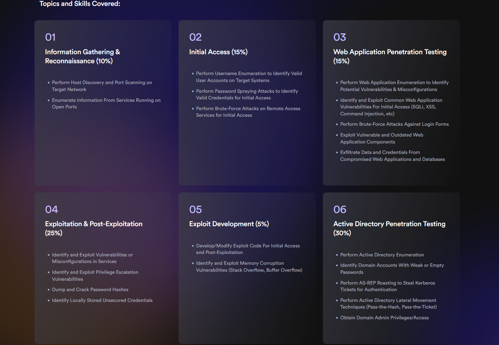

# eLearnSecurity Certified Professional Penetration Tester (eCPPTv3) Preparation

	

## Learning Path Topics

### Resource Development and Initial Access

#### 01 [PowerShell for Pentesters](./01_powershell_for_pentesters.md)

- [x] PowerShell Fundamentals
- [x] PowerShell for Pentesting
	- [x] Download and Execution (with Net.WebClient)
	- [x] PowerShell Code Obfuscation (with Invoke-Obfuscation)
	- [x] Information Gathering and Reconnaissance with PowerShell (with Invoke-Portscan, Get-HttpStatus, Invoke-ARPScan)
	- [x] Post-Exploitation with PowerShell (with Nishang, PowerSploit, psgetsystem)
	- [x] Metasploit to Create PowerShell Payloads
	- [x] UAC Bypass with PowerShell Script
	- [x] Leveraging WMI for Persistence (with Get-WmiObject, Invoke-WmiMethod, PowerLurk)
	- [x] PowerShell-Empire for Persistence
	- [x] Windows Black-Box Penetration Test (with Nmap, Metasploit, PowerShell-Empire, proxychains)
- [x] Antivirus Evasion (with Shellter)

#### 02 [Client-Side Attacks](./02_client_side_attacks.md)

- [x] Introduction to Client-Side Attacks
- [x] Client-Side Information Gathering and Fingerprinting
- [x] Social Engineering
	- [x] Introduction to Social Engineering Techniques
	- [x] Introduction to Pretexting Techniques
	- [x] Phishing (with GoPhish)
- [x] Development and Weaponization 
	- [x] VBA Macro Development (Manual)
	- [x] Weaponizing VBA Macros (with Metasploit)
	- [x] VBA PowerShell Dropper
	- [x] VBA Reverse Shell Macro (with Powercat)
	- [x] Using ActiveX Controls for Macro Execution
	- [x] Pretexting Phishing Documents (with office-phish-templates)
	- [x] Automating Macro Development (Manual and with MacroPack)
	- [x] HTML Application (HTA) Attacks (with MSFvenom)
- [x] Delivery and Execution
	- [x] File Smuggling with HTML and JavaScript (with MSFvenom)
	- [x] Initial Access via Spear Phishing Attachment (with MSFvenom)
	- [x] Client-Side Black-Box Penetration Test (with Nmap, MSFvenom, Metasploit)
- [x] Browser Attacks
	- [x] Browser-Based Attacks (with BeEF)

### Web Application Attacks

#### 03 [Web Application Penetration Testing](./03_web_application_penetration_testing.md)

- [x] Passive Information Gathering
	- [x] Ownership and IP Addresses Discovery (with WHOIS)
	- [x] Website Fingerprinting (with Netcraft)
	- [x] Passive DNS Enumeration (with DNSRecon)
	- [x] Reviewing Webserver Metafiles for Information Leakage (Manual)
	- [x] Web App Technology Fingerprinting (with BuiltWith/Wappalyzer/WhatWeb)
	- [x] Passive Crawling (with Burp Suite)
- [x] Active Information Gathering
	- [x] Web Server Fingerprinting (with Nmap/Metasploit)
	- [x] Web Server Vulnerability Scanning (with Nikto)
	- [x] File and Directory Brute-Force Attacks (with Gobuster)
	- [x] Automated Web Reconnaissance (with OWASP Amass)
- [x] Identifying and Exploiting XSS Vulnerabilities (Stored, Reflected, DOM-Based)
- [x] Identifying and Exploiting SQLi Vulnerabilities (Error-Based, Union-Based)

### Network Security

#### 04 [Network Penetration Testing](./04_network_penetration_testing.md)

- [x] Host Discovery and Port Scanning
	- [x] Host Discovery (with FPing/Nmap)
	- [x] Port Scanning (with Nmap)
	- [x] Service Version and OS Detection (with Nmap)
	- [x] Nmap Scripting Engine (NSE)
	- [x] Firewall Detection and IDS Evasion (with Nmap)
	- [x] Optimizing Nmap Scans: Scan Timing and Performance
	- [x] Nmap Output Formats
- [x] Windows and Linux Enumeration
	- [x] Windows Enumeration: SMB and NetBIOS Enumeration (with Nmap, smbclient)
	- [x] Windows Enumeration: SNMP Enumeration (with Nmap, snmpwalk)
	- [x] Linux Service Enumeration (with Nmap, SMTP-user-enum, smbmap, rpcclient, Metasploit, finger-user-enum)
- [x] Windows Exploitation
	- [x] Windows Exploitation: DNS and SMB Relay Attack (with dnsspoof, arpspoof, Metasploit)
	- [x] Windows Exploitation: MSSQL DB User Impersonation to RCE (with Nmap, impacket-mssqlclient)
- [x] Linux Exploitation
	- [x] Linux Exploitation: Black-Box Penetration Test (with Nmap, Metasploit)
- [x] Windows Post-Exploitation
	- [x] Windows Post-Exploitation: Dumping and Cracking NTLM Hashes (with Nmap, Metasploit, JohntheRipper/Hashcat)
	- [x] Windows Black-Box Penetration Test (with Nmap, Metasploit, proxychains, xfreerdp)
- [x] MITM and Network-Based Attacks
- [x] Antivirus Evasion (with UPX and Veil-Framework)

### Exploit Development

#### 05 [System Security and x86 Assembly Fundamentals](./05_system_security_and_x86_assembly_fundamentals.md)

- [x] Architecture Fundamentals
	- [x] CPU Architecture and Components
	- [x] CPU Registers
	- [x] Process Memory
	- [x] The Stack
- [x] x86 Assembly Fundamentals
	- [x] Assemblers and Compilers
	- [x] Introduction to x86 Assembly
	- [x] Basic x86 Assembly Programming

#### 06 [Buffer Overflows](./06_buffer_overflows.md)

- [x] Buffer Overflow Fundamentals
- [x] Finding Buffer Overflow Vulnerabilities
- [x] Stack-Based Overflows
- [x] Windows Structured Exception Handling (SEH) Overflow
- [x] Windows SEH Overflow (with SPIKE)

### Post-Exploitation

#### 07 [Privilege Escalation](./07_privilege_escalation.md)

- [x] Introduction to Privilege Escalation
- [x] Windows Privilege Escalation Techniques
	- [x] Privilege Escalation Scripts (PowerUp, PrivescCheck)
	- [x] Locally Stored Credentials (Unattended Installation Files, Windows Credential Manager, PowerShell History)
	- [x] Insecure Service Permissions
	- [x] Windows Registry AutoRuns
	- [x] Bypassing UAC (UACme)
	- [x] Impersonation Attacks (Incognito, Juicy Potato)
	- [x] DLL Hijacking
- [x] Linux Privilege Escalation Techniques
	- [x] Locally Stored Credentials
	- [x] Misconfigured File Permissions
	- [x] SUID Binaries
	- [x] Misconfigured SUDO Permissions
	- [x] Shared Library Injection

#### 08 [Lateral Movement and Pivoting](./08_lateral_movement_and_pivoting.md)

- [x] Introduction to Lateral Movement and Pivoting
- [x] Windows Lateral Movement
	- [x] Windows Lateral Movement Techniques
	- [x] Windows Lateral Movement with PsExec
	- [x] Windows Lateral Movement with SMBExec
	- [x] Windows Lateral Movement with CrackMapExec
	- [x] Windows Lateral Movement via RDP
	- [x] Windows Lateral Movement via WinRM
	- [x] Windows Lateral Movement with Metasploit
	- [x] Windows Lateral Movement with WMIExec
- [x] Linux Lateral Movement
	- [x] Linux Lateral Movement Techniques
- [x] Pivoting
	- [x] Pivoting and Port Forwarding with Metasploit
	- [x] Pivoting with SOCKS Proxy
	- [x] Pivoting via SSH Tunneling
	- [x] Pivoting with reGeorg
- [x] Linux Lateral Movement and Pivoting
	- [x] Linux Lateral Movement and Pivoting: Black-Box Penetration Test (with SOCKS Proxy, SSH Tunneling, Metasploit)

### Red Teaming

#### 09 [Active Directory Penetration Testing](./09_active_directory_penetration_testing.md)

- [x] Active Directory Penetration Testing Methodology
- [x] Active Directory Enumeration (with BloodHound, PowerView)
- [x] Active Directory Privilege Escalation (AS-REP Roasting, Kerberoasting)
- [x] Active Directory Lateral Movement (Pass-the-Hash, Pass-the-Ticket)
- [x] Active Directory Persistence (Silver Ticket, Golden Ticket)

### 10 [Command and Control (C2/C&C)](./10_command_and_control.md)

- [x] Command and Control Primer
	- [x] Introduction to Command and Control
	- [x] Introduction to C2 Frameworks
- [x] Understanding C2 Frameworks
	- [x] How C2 Frameworks Work
	- [x] C2 Framework Terminology
	- [x] C2 Infrastructure Deployment and Operations
	- [x] The C2 Matrix: Choosing the Correct C2 Framework
- [x] PowerShell-Empire and Starkiller
	- [x] Introduction to PowerShell-Empire
	- [x] Introduction to Starkiller
	- [x] Red Team Operations with PowerShell-Empire
	- [x] Red Team Operations with Starkiller
- [x] C2 Frameworks: Armitage
	- [x] Introduction to Armitage
	- [x] Port Scanning and Enumeration with Armitage
	- [x] Exploitation and Post Exploitation with Armitage
- [x] Custom C2 Protocol
	- [x] Custom C2 Protocol (with Merlin)

---

---
---
